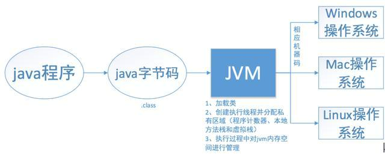

# CSE271 - Object-Oriented Programming - Java基础知识

返回[Bulletin](./bulletin.md)

返回[CSE271 - Object-Oriented Programming](./CSE271.md)

[TOC]

## 发明公司与发明人

SUN(Stanford University Network)公司的James Gosling

## 特点

### 跨平台

*核心优势*



我们编写的 Java 源码，编译后会生成一种 .class 文件，称为字节码文件。

Java 源文件 -> 编译器 -> 字节码文件

而字节码文件又通过Java 虚拟机中的解释器，编译成特定机器上的机器码，然后运行我们编写的 Java 程序。

字节码文件 -> JVM -> 机器码

而这个过程，我们编写的 Java 程序没有做任何改变，仅仅是通过JVM这一“中间层”，就能在不同平台上运行，真正实现了 “一次编译，到处运行” 的目的。

注意：跨平台的是Java程序，而不是JVM. JVM是用C/C++开发的，是编译后的机器码，不能跨平台，不同平台下需要安装不同版本的JVM.

### 简单

取消了以下设定：

- #include, #define等预处理功能
- struct, union, typedef
- 脱离于类之外的函数
- 指针
- 多重继承
- goto(但是关键字仍被保留)
- 操作符重载
- 全局变量
- 手动内存管理

### 安全

取消了指针，防止其任意访问其他内存区域，也避免了数组越界之类的问题。

自动内存管理机制，防止垃圾处理不当造成内存溢出。

字节码在传输过程中使用了公开密钥加密机制PKC.

运行环境提供了四级安全性保障机制：

- 字节码校验器
- 类装载器
- 运行时内存布局
- 文件访问限制

### 完全面向对象

解决了C++的一些固有缺陷，语法更加清晰，便于学习。

### 健壮

强制类型机制、异常处理、垃圾回收、安全检查等机制保障了Java的健壮性。

## 体系架构

### J2EE/JavaEE

定位在服务器端的应用。

### J2SE/JavaSE

定位在个人PC上的应用。

### J2ME/JavaME

定位在消费性电子产品上的应用。

## 注释

```java
//单行注释

/*
多行注释
*/

/**
 * 文档注释
 */
```

## 字符集

| 字符集    | 字节数 | 备注                                                      |
| --------- | ------ | --------------------------------------------------------- |
| ASCII     | 1      | 英文字符集                                                |
| ISO8859-1 | 1      | 西欧字符集                                                |
| BIG5      | 2      | 台湾的大五码，表示繁体汉字                                |
| GB2312    | 2      | 大陆使用最早、最广的简体中文字符集                        |
| GBK       | 2      | GB2312的扩展，可以表示繁体汉字                            |
| GB18030   | 2      | 最新GBK的扩展，可以表示汉字、维吾尔文、藏文等中华民族字符 |
| Unicode   | 2      | 国际通用字符集                                            |

## 标识符

**标识符**是指在程序中，我们自己定义的内容，譬如，类的名字，方法名称以及变量名称等等，都是标识符。

### 规则

- 字母、下划线、美元符可以作为开头
- 字母、下划线、美元符、数字可以作为其他部分

- 大小写敏感

- 长度无限制
- 不可以使用已有的Java关键字
- 不采用ASCII字符集，而是unicode这样的国际字符集

### 规范

- 类命名：首字符大写，后面每个单词首字母大写（大驼峰式）。
  - Person, AlipayTransacation, ...
- 变量、方法命名：首字母小写，后面每个单词首字母大写（小驼峰式）。
  - context, applicationContext, hashcode(), toString(), ...
- 常量命名：大写字母和下划线
  - MAX_VALUE, ...

## 基本类型 primitive type

### byte

byte 数据类型是8位、有符号的，以二进制补码表示的整数；

最小值是 -128（-2^7）；

最大值是 127（2^7-1）；

默认值是 0；

byte 类型用在大型数组中节约空间，主要代替整数，因为 byte 变量占用的空间只有 int 类型的四分之一；

```Java
byte a = 100;

byte b = -50;
```

### short

short 数据类型是 16 位、有符号的以二进制补码表示的整数

最小值是 -32768（-2^15）；

最大值是 32767（2^15 - 1）；

Short 数据类型也可以像 byte 那样节省空间。一个short变量是int型变量所占空间的二分之一；

默认值是 0；

```Java
short s = 1000;

short r = -20000;
```

### int

int 数据类型是32位、有符号的以二进制补码表示的整数；

最小值是 -2,147,483,648（-2^31）；

最大值是 2,147,483,647（2^31 - 1）；

一般地整型变量默认为 int 类型；

默认值是 0 ；

```Java
int a = 100000;

int b = -200000;
```

#### 原码、反码、补码

|                 | 原码 | 反码                     | 补码   |
| --------------- | ---- | ------------------------ | ------ |
| 大于等于0的整数 | 自身 | -                        | -      |
| 小于0的整数     | 自身 | 原码除符号位以外全部取反 | 反码+1 |

### long

long 数据类型是 64 位、有符号的以二进制补码表示的整数；

最小值是 -9,223,372,036,854,775,808（-2^63）；

最大值是 9,223,372,036,854,775,807（2^63 -1）；

这种类型主要使用在需要比较大整数的系统上；

默认值是 0L；

```java
long a = 100000L;

long b = -200000L;
```

"L"理论上不分大小写，但是若写成"l"容易与数字"1"混淆，不容易分辩。所以最好大写。

### float

float 数据类型是单精度、32位、符合IEEE 754标准的浮点数；

float 在储存大型浮点数组的时候可节省内存空间；

默认值是 0.0f；

浮点数不能用来表示精确的值，如货币；

```Java
float f1 = 234.5f;
```

#### 精度转换

运算过程中，低精度的类型向高精度类型转换。

如果将高精度的数值赋值给低精度类型变量，则必须要进行显性的强制转换。

#### 浮点数精度

例如3*0.1==0.3值为false, 因为有些浮点数不能完全精确的表示出来。

#### 取整运算

Math.round(-1.5)的返回值是-1。四舍五入的原理是在参数上加0.5然后做向下取整。

### double

double 数据类型是双精度、64 位、符合IEEE 754标准的浮点数；

浮点数的默认类型为double类型；

double类型同样不能表示精确的值，如货币；

默认值是 0.0d；

```Java
double d1 = 123.4;
```

### boolean

boolean数据类型表示一位的信息；

- boolean数组在Oracle的JVM中，编码为byte数组，每个boolean元素占用8位=1字节。
- boolean数组在非Oracle JVM里面，占用字节数可能不是1字节。
- boolean类型会通过自动补齐被JVM编译为int类型，等于是说JVM里占用字节和int完全一样，也是4字节。

只有两个取值：true 和 false；

这种类型只作为一种标志来记录 true/false 情况；

默认值是 false；

```Java
boolean one = true;
```

### char

char类型是一个单一的 16 位 Unicode 字符；

最小值是 \u0000（即为0）；

最大值是 \uffff（即为65,535）；

char 数据类型可以储存任何字符；

```Java
char letter = 'A';
```

## 运算符

| 优先级 | 运算符                                           | 结合性   |
| ------ | ------------------------------------------------ | -------- |
| 1      | ()、[]、{}                                       | 从左向右 |
| 2      | !、+、-、~、++、--                               | 从右向左 |
| 3      | *、/、%                                          | 从左向右 |
| 4      | +、-                                             | 从左向右 |
| 5      | «、»、>>>                                        | 从左向右 |
| 6      | <、<=、>、>=、instanceof                         | 从左向右 |
| 7      | ==、!=                                           | 从左向右 |
| 8      | &                                                | 从左向右 |
| 9      | ^                                                | 从左向右 |
| 10     | \|                                               | 从左向右 |
| 11     | &&                                               | 从左向右 |
| 12     | \|\|                                             | 从左向右 |
| 13     | ?:                                               | 从右向左 |
| 14     | =、+=、-=、*=、/=、&=、\|=、^=、~=、«=、»=、>>>= | 从右向左 |

#### 算术运算符

```
+, -, *, /, %, ++, --
```

++i和i++都会让i的值加1，但是++i本身的值比i++本身的值大1。

--i和i--都会让i的值减1，但是--i本身的值比i--本身的值小1。

++和--不是线程安全的操作。它涉及到多个指令，如读取变量值，增加，然后存储回内存，这个过程可能会出现多个线程交差。

#### 赋值运算符

```
=
```

#### 扩展赋值运算符

```
+=, -=, *=, /=
```

在两个变量的数据类型一样时，a+=b 和a=a+b 是没有区别的。

但是当两个变量的数据类型不同时，+=符号结合了强制类型转换的功能，在a+=b中会自动转换为a的类型，因此不会出现编译错误。而后者会出现编译错误。

#### 关系运算符

```
>, <, >=, <=, ==, !=
```

#### 逻辑运算符

```
&&, ||, !
```

#### 位运算符

```
&, |, ^, ~, >>, <<, >>>
```

其中>>不带符号位右移，>>>带符号位右移。

#### 条件运算符

```
{if} ? {then} : {else}
```

### 包装类

为了能够将基本数据类型当成对象操作，Java为每一个基本数据类型都引入了对应的包装类型（wrapper class），int的包装类就是Integer，从Java 5开始引入了**自动装箱/拆箱机制**，使得二者可以相互转换。

Java 为每个原始类型提供了包装类型：

| 原始类型 | 包装类型  |
| -------- | --------- |
| boolean  | Boolean   |
| char     | Character |
| byte     | Byte      |
| short    | Short     |
| int      | Integer   |
| long     | Long      |
| float    | Float     |
| double   | Double    |

**用途1: 数据类型的转化**

```java
//通过包装类来实现转化的
int num=Integer.valueOf("12");
int num2=Integer.parseInt("12");
double num3=Double.valueOf("12.2");
double num4=Double.parseDouble("12.2");
//其他的类似。通过基本数据类型的包装来的valueOf和parseXX来实现String转为XX
String a=String.valueOf("1234");//这里括号中几乎可以是任何类型
String b=String.valueOf(true);
String c=new Integer(12).toString();//通过包装类的toString()也可以
String d=new Double(2.3).toString();
```

HashMap和HashSet对于基本类型的包装类，都会按值传递。

**用途2: 泛型**

```Java
List<Integer> nums;
```

这里<>需要类。如果你用int。它会报错的。

#### 内存占用

以整型为例，Integer对象会比int占用更多的内存。

Integer是一个对象，需要存储对象的元数据，但是int是一个原始类型的数据，所以占用的空间更少。

#### Integer.valueOf()执行后的结果比较

当我们给一个Integer对象赋一个int值的时候，会调用Integer类的静态方法valueOf，若整型字面量的值在-128到127之间，那么不会new新的Integer对象，而是直接引用常量池中的Integer对象。所以：

```java
Integer f1 = 100, f2 = 100, f3 = 150, f4 = 150;
System.out.println(f1 == f2); //输出true
System.out.println(f3 == f4); //输出false
```

## 枚举类型 enumeration type

### enum VS Enum

enum是一个关键字，使用enum定义的枚举类本质上就相对于一个类继承了Enum这个抽象类。

```Java
public abstract class Enum<E extends Enum<E>> extends Object implements Comparable<E>, Serializable
```

## 引用类型 reference type

### BigDecimal

Java语言提供了另外一种数据类型**BigDecimal**，可以表示精确的浮点数，适合用作财务计算的数据类型。由于float和double所表示的浮点数是近似值，不是精确的值，因此,二者不适合作为价格的数据类型。

需要注意的是，在使用BigDecimal的时候，只有用字符串（而不是float或double）作为参数才能精确地表示精度。

**注意**

- 使用equals比较BigDecimal会同时比较value和scale, 所以1.0不等于1. 可以改用compareTo.
- 作为Hash key时，1.0和1也会作为不同的key. 可以改用TreeSet替换HashSet, 或者先使用stripTrailingZeros去掉尾部的零。

## 访问权限修饰符

| 修饰符    | 当前类 | 同 包 | 子 类 | 其他包 |
| --------- | ------ | ----- | ----- | ------ |
| public    | √      | √     | √     | √      |
| protected | √      | √     | √     | ×      |
| default   | √      | √     | ×     | ×      |
| private   | √      | ×     | ×     | ×      |

一个Java文件中只允许有一个public类。

## 静态修饰符

修饰静态变量

```java
static int num;
```

修饰静态方法

```java
public static void main(String[] args) {}
```

修饰静态块（多用于初始化操作）

```Java
static {
    int num = 0;
}
```

修饰静态内部类

```Java
public class InnerClassTest {
    public static class StaticInnerClass {
        public void printThis() {
            System.out.println(this.toString());
        }
    }
}
```

静态导包，即 import static.import static是在JDK 1.5之后引入的新特性,可以用来指定导入某个类中的静态资源,并且不需要使用类名,可以直接使用资源名

```Java
import static java.lang.Math.*;
public class Test{
    public static void main(String[] args){
        //System.out.println(Math.sin(20));传统做法
        System.out.println(sin(20));
    }
}
```

## final修饰符

**修饰数据**

包括成员变量和局部变量，该变量只能被赋值一次且它的值无法被改变。对于成员变量来讲，我们必须在声明时或者构造方法中对它赋值。

**修饰方法参数**

表示在变量的生存期中它的值不能被改变。

**修饰方法**

表示该方法无法被重写，但可以被继承。

不可以修饰构造方法。

编译器在遇到调用final方法时候会转入内嵌机制，大大提高执行效率。

**修饰类**

表示该类无法被继承。

类中的方法默认是final的。

### 不可变类Immutable Class

不可变类在对象构造完成之后，内部构造不会被改变。

- Class应该定义成final，避免被继承。

- 所有的成员变量应该被定义成final。

- 不要提供可以改变类状态(成员变量)的方法。get()方法不要把类里的成员变量让外部客服端引用,当需要访问成员变量时，返回成员变量的copy.
- 不可变对象可以包含可变对象，保证不要共享可变对象的引用就可以。如果需要变化时，就返回原对象的一个拷贝。最常见的例子就是对象中包含一个日期对象的引用。

## 关键字/保留字

| **关键字**   | **含义**                                                     |
| ------------ | ------------------------------------------------------------ |
| abstract     | 表明类或者成员方法具有抽象属性                               |
| assert       | 断言，用来进行程序调试                                       |
| boolean      | 基本数据类型之一，声明布尔类型的关键字                       |
| break        | 提前跳出一个块                                               |
| byte         | 基本数据类型之一，字节类型                                   |
| case         | 用在switch语句之中，表示其中的一个分支                       |
| catch        | 用在异常处理中，用来捕捉异常                                 |
| char         | 基本数据类型之一，字符类型                                   |
| class        | 声明一个类                                                   |
| const        | 保留关键字，没有具体含义                                     |
| continue     | 回到一个块的开始处                                           |
| default      | 默认，例如，用在switch语句中，表明一个默认的分支。Java8 中也作用于声明接口函数的默认实现 |
| do           | 用在do-while循环结构中                                       |
| double       | 基本数据类型之一，双精度浮点数类型                           |
| else         | 用在条件语句中，表明当条件不成立时的分支                     |
| enum         | 枚举                                                         |
| extends      | 表明一个类型是另一个类型的子类型。对于类，可以是另一个类或者抽象类；对于接口，可以是另一个接口 |
| final        | 用来说明最终属性，表明一个类不能派生出子类，或者成员方法不能被覆盖，或者成员域的值不能被改变，用来定义常量 |
| finally      | 用于处理异常情况，用来声明一个基本肯定会被执行到的语句块     |
| float        | 基本数据类型之一，单精度浮点数类型                           |
| for          | 一种循环结构的引导词                                         |
| goto         | 保留关键字，没有具体含义                                     |
| if           | 条件语句的引导词                                             |
| implements   | 表明一个类实现了给定的接口                                   |
| import       | 表明要访问指定的类或包                                       |
| instanceof   | 用来测试一个对象是否是指定类型的实例对象                     |
| int          | 基本数据类型之一，整数类型                                   |
| interface    | 接口                                                         |
| long         | 基本数据类型之一，长整数类型                                 |
| native       | 用来声明一个方法是由与计算机相关的语言（如C/C++/FORTRAN语言）实现的 |
| new          | 用来创建新实例对象                                           |
| package      | 包                                                           |
| private      | 一种访问控制方式：私用模式                                   |
| protected    | 一种访问控制方式：保护模式                                   |
| public       | 一种访问控制方式：共用模式                                   |
| return       | 从成员方法中返回数据                                         |
| short        | 基本数据类型之一,短整数类型                                  |
| static       | 表明具有静态属性                                             |
| strictfp     | 用来声明FP_strict（单精度或双精度浮点数）表达式遵循[IEEE 754](https://baike.baidu.com/item/IEEE 754)算术规范 |
| super        | 表明当前对象的父类型的引用或者父类型的构造方法               |
| switch       | 分支语句结构的引导词                                         |
| synchronized | 表明一段代码需要同步执行                                     |
| this         | 指向当前实例对象的引用                                       |
| throw        | 抛出一个异常                                                 |
| throws       | 声明在当前定义的成员方法中所有需要抛出的异常                 |
| transient    | 声明不用序列化的成员域                                       |
| try          | 尝试一个可能抛出异常的程序块                                 |
| void         | 声明当前成员方法没有返回值                                   |
| volatile     | 表明两个或者多个变量必须同步地发生变化                       |
| while        | 用在循环结构中                                               |

### instanceof

instanceof 严格来说是Java中的一个双目运算符，用来测试一个对象是否为一个类的实例，用法为：

```Java
Boolean result = obj instanceof Class
```

### switch

在Java 5以前，switch(expr)中，expr只能是byte、short、char、int。

从Java 5开始，Java中引入了枚举类型，expr也可以是enum类型。

从Java 7开始，expr还可以是字符串（String）。

但是长整型（long）在目前所有的版本中都是不可以的。

## 值传递和引用传递

**值传递**（pass by value）是指在调用函数时将实际参数复制一份传递到函数中，这样在函数中如果对参数进行修改，将不会影响到实际参数。

**引用传递**（pass by reference）是指在调用函数时将实际参数的地址直接传递到函数中，那么在函数中对参数所进行的修改，将影响到实际参数。

