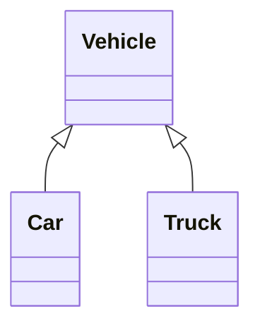
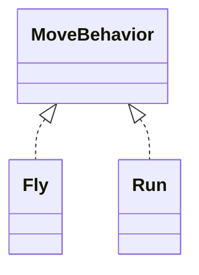
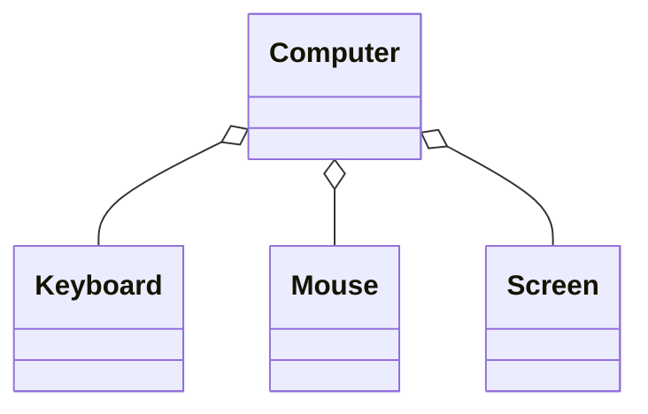
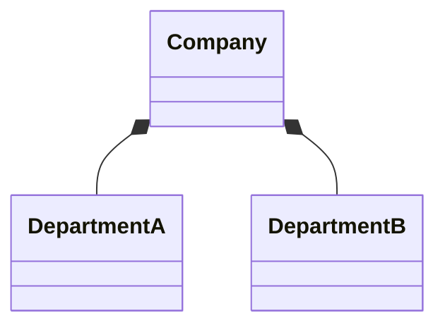
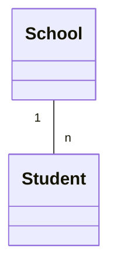
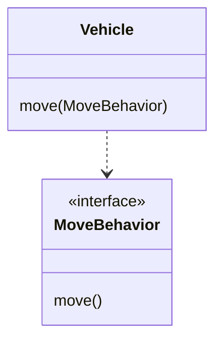

# CSE2712 - Object-Oriented Programming

返回[Bulletin](./bulletin.md)

返回[CSE271 - Java Core](./CSE271.md)

[TOC]

> 本文档定位：面向对象编程（OOP）语言层核心知识，服务 Senior Java Backend 面试复习。主线是四大特征、继承/多态语义、抽象类与接口的取舍。设计模式、JVM、Spring 相关内容不在这里展开。

## 1. 面向对象核心思想

### Abstraction

抽象是将一类对象的共同特征总结出来构造类的过程，包括数据抽象和行为抽象两方面。抽象只关注对象有哪些属性和行为，并不关注这些行为的细节是什么。

Abstraction is a process where you show only “relevant” data and “hide” unnecessary details of an object from the user.

### Encapsulation

通常认为封装是把数据和操作数据的方法绑定起来，只向外界提供最简单的编程接口。
Create the class which represents the real things. The data and methods inside the class are protected.

**实现形式**

使用访问权限修饰符private 在定义JavaBean时对于成员变量使用private进行修饰，同时对外提供set、get方法 使用了private修饰的成员在其他类中不能直接访问，此时需要使用set、get方法进行。 定义一个Java类与Java的方法就是最简单最常见的面向对象的封装操作，这些操作符合隐藏实现细节，提供访问方式的思路。

**优点**

将变化隔离，便于使用，提高重用性、安全性。

**缺点**

将变量等使用private修饰，或者封装进方法内，使其不能直接被访问，增加了访问步骤与难度。

### Inheritance

继承是从已有类得到继承信息创建新类的过程。继承让变化中的软件系统有了一定的延续性，同时继承也是封装程序中可变因素的重要手段。

Create a new class based on a class. The new class (child) can inherit methods and variables from the old class (parent).

继承的详细语义、约束与取舍见 §2。

### Polymorphism

多态就是同一个接口使用不同的实现而执行不同的操作，分为编译时多态和运行时多态。

Provision of a single interface to entities of different types.

重写、重载、动态绑定与静态方法隐藏的详细规则见 §3。

## 2. Inheritance

### extends 与继承语义

子类通过 `extends` 继承父类，得到父类的非 private 成员（字段与方法），并可以追加或重写行为。

#### 父类

提供继承信息的类被称为**父类**（超类、基类）；

#### 子类

得到继承信息的类被称为**子类**（派生类）。

#### this关键字

指向实例对象自己的引用。

#### super关键字

可以通过super关键字来实现子类对父类成员的访问，引用当前实例对象的父类。

构造规则：子类构造方法中，首行必须是 `super(...)`（显式）或隐式调用父类无参构造；父类没有可访问的无参构造时，子类必须显式 `super(...)`。

#### 为什么说继承破坏了封装

因为属性的访问修饰符被修改，使得属性在本包和子类里可以任意修改属性的数据，数据的安全性从而得不到保障。

补充一个更一般化的视角：子类会依赖父类的实现细节，父类的任何变化（哪怕只是"修复"）都可能破坏子类——即脆弱的基类（fragile base class）问题。这是 §2 末尾 Composition over Inheritance 的出发点。

#### 为什么 JAVA 只允许单继承

在Java语言中，一个类只能继承一个父类，禁止多重继承（即一个类可以具有多个直接父类）。

**存在钻石形继承问题**

多重继承不合法的原因是容易引发意义不明确。例如，有一个类C，如果允许它同时继承A类与B类（class C extends A,B{}），假如A、B两个类都有同一种方法fun()，如果定义：C c = new C();那么c.fun()应该调用哪一个父类的fun()方法？无法给出答案，因此Java语言禁止多重继承。 但C++却是可以的，所以C++比起java在语法上却难了些。

**使得设计复杂化**

多重继承确实使设计复杂化，因为会产生大量歧义。由于接口只有方法声明而且没有提供任何实现，因此只有一个特定方法的实现，因此不会有任何歧义。

### Initialization Order

子类初始化的顺序：

- 父类静态代码块和静态变量。
- 子类静态代码块和静态变量。
- 父类普通代码块和普通变量。
- 父类构造方法。
- 子类普通代码块和普通变量。
- 子类构造方法。

要点：静态只在类加载时初始化一次（先父后子）；实例初始化每次 new 都执行，且**先完成父类构造再执行子类构造**——因此构造方法中调用可重写方法存在风险（子类字段尚未初始化）。类加载细节见 CSE301。

### Composition over Inheritance

实际工程设计中通常推荐：**Favor composition over inheritance.**（Effective Java）

**继承的问题：**

- **强耦合**：子类编译期就绑定父类实现，子类依赖父类实现细节。
- **父类变化可能影响子类**：父类修改方法实现、新增方法（意外与子类方法同签名）、甚至改变遍历方式，都可能悄悄破坏子类（fragile base class）。
- **容易形成脆弱的继承体系**：层次过深后行为来自哪一层难以追踪， override 链难以推理。
- 继承还突破了封装：子类依赖父类的内部实现，父类必须为子类而设计（Effective Java 中"专门为继承而设计的类必须文档化 self-use"）。

**组合的优势：**

- **依赖接口/能力**：持有接口引用而非父类，调用方只依赖契约。
- **更容易替换实现**：运行时更换委托对象，天然支持策略式扩展（对应策略模式思想，但不展开）。
- **更容易测试**：可注入 mock/fake 替代真实实现。
- **通常耦合更低**：新功能通过新增委托对象获得，不侵入既有继承体系。

**实践判断**：明确的 is-a 关系、需要复用大量状态与受保护实现时，继承依然合理（抽象类正是为此存在）；仅仅为了"复用一段代码"时，优先考虑组合。

## 3. Polymorphism

### Override

实现的是运行时的多态性（也称为后绑定）。
1. 发生在父类与子类之间
2. 方法名，参数列表，返回类型（除过子类中方法的返回类型是父类中返回类型的子类）必须相同
3. 访问修饰符的限制一定要大于被重写方法的访问修饰符（public>protected>default>private)
4. 重写方法一定不能抛出新的检查异常或者比被重写方法申明更加宽泛的检查型异常

```
public class Father {
    public static void main(String[] args) {
        Son s = new Son();
        s.sayHello();
    }
    public void sayHello() {
        System.out.println("Hello");
    }
}
class Son extends Father{
    @Override public void sayHello() {
        System.out.println("hello by ");
    }
}
```

要点：override 的判定发生在运行时，依据**对象的实际类型**选择方法版本（见 Dynamic Binding）；`@Override` 注解帮助编译器校验（见 Appendix C）。

### Overload

实现的是编译时的多态性（也称为前绑定）。
1. 重载Overload是一个类中多态性的一种表现
2. 重载要求同名方法的参数列表不同(参数类型，参数个数甚至是参数顺序)
3. 重载的时候，返回值类型可以相同也可以不相同。无法以返回型别作为重载函数的区分标准

```
public static void main(String[] args) {
    Father s = new Father();
    s.sayHello();
    s.sayHello("wintershii");
}
public void sayHello() {
    System.out.println("Hello");
}
public void sayHello(String name) {
    System.out.println("Hello" + " " + name);
}
```

要点：overload 在**编译期**根据引用（静态）类型与参数列表完成选择；参数自动装箱、 widening 优先级（如 `sayHello(long)` 优先于 `sayHello(Long)`）是常见追问点。

### Override vs Overload

| 维度         | Override（重写）                     | Overload（重载）                 |
| ------------ | ------------------------------------ | -------------------------------- |
| 发生位置     | 父类与子类之间                       | 同一个类（或父子继承链上）       |
| 绑定时期     | 运行时（动态绑定）                   | 编译期（静态绑定）               |
| 方法签名     | 相同（返回值可为协变类型）           | 参数列表必须不同                 |
| 返回类型     | 相同或协变（子类返回更具体类型）     | 可相同可不同，不能作为区分依据   |
| 访问修饰符   | 不能比父类更严格                     | 无限制                           |
| 抛出异常     | 不能比父类更宽泛的检查异常           | 无限制                           |
| 多态方向     | 运行时按对象实际类型选择             | 编译期按引用类型与实参类型选择   |

### Dynamic Binding

方法重写基于**运行时的动态绑定**：JVM 根据引用指向对象的**实际类型**在方法表中查找被重写方法的实现，因此 `Father f = new Son(); f.sayHello();` 调用的是 Son 的版本。这是运行时多态的实现机制。

字段不参与多态：字段访问在编译期按引用类型绑定；static 方法、private 方法、构造器也都不参与运行时多态。

> 方法表、虚方法调用的实现见 CSE301。

### Static Method Hiding

**子类可以定义在父类一样的静态方法吗？是重写吗？**

可以在子类中声明一个完全相同的方法，不会报出编译时错误。虽然看起来可以在Java中覆盖静态方法，但实际上这是**方法隐藏（method hiding）**。

你不能重写Java中的静态方法，因为方法重写基于运行时的动态绑定，静态方法在编译时使用静态绑定进行绑定。子类同签名静态方法只是隐藏了父类版本，调用哪个版本由**引用类型**（编译期）决定，与对象实际类型无关。

```java
class Father {
    static void hello() { System.out.println("Father"); }
}
class Son extends Father {
    static void hello() { System.out.println("Son"); }  // hiding，不是 override
}
Father f = new Son();
f.hello();      // 输出 Father：按引用类型 Father 编译期绑定
```

## 4. Abstract Class vs Interface

### Interface Method

不要再停留在"接口只能有抽象方法"的旧模型。现代 Java 中接口可以存在四类方法：

| 方法种类        | 隐式修饰符                  | 引入版本 | 说明 |
| --------------- | --------------------------- | -------- | ---- |
| abstract method | `public abstract`           | Java 1.0 | 实现类必须提供实现，且不能降低可见性（必须 public） |
| default method  | `public`（非 abstract）     | Java 8   | 提供默认实现，实现类可重写；用于接口演化（如 Collection 的 stream） |
| static method   | `public static`             | Java 8   | 属于接口本身，**不继承**给实现类，通过接口名调用 |
| private method  | `private` / `private static`| Java 9   | 供 default/static 方法复用内部逻辑，接口外不可见 |

实现类从多个接口继承到**同签名 default 方法**时编译冲突，必须在本类重写消解。

### Interface Field

interface 中的字段隐式为：

```java
public static final
```

即常量：必须显式赋初值，实现类中不能重新定义、不能改变其值。

### extends / implements

三个关系必须分清：

```java
class A extends B {}                 // 类继承类（单继承）
class A implements I {}              // 类实现接口（可多实现）
interface I extends J, K {}          // 接口继承接口（可多继承）
class A extends B implements I, J {} // 类先继承后实现
// class A extends I {}              // 错误：类不能 extends 接口，必须用 implements
```

### Abstract Class vs Interface

|   | 抽象类  | 接口  |
|:----------|:----------|:----------|
| 实例化    | 不能，子类实现方法后可以实例化    | 不能，子类实现方法后可以实例化    |
| 类    | 一种继承关系，一个类只能使用一次继承关系    | 一个类可以实现多个 interface    |
| 构造器    | 有（供子类 `super(...)` 调用）    | 没有    |
| 方法   | 可以私有的，非 abstract 方法，必须实现    | 不可有私有的，默认是 public abstract 类型；JDK 8 起支持 static 和 default，JDK 9 起支持 private    |
| 变量    | 可有私有的，默认是 friendly（包私有）型，其值可以在子类中重新定义，也可以重新赋值    | 不可有私有的，默认是 public static final 型，且必须给其初值，实现类中不能重新定义，不能改变其值    |
| 设计理念    | 表示的是"is-a"关系    | 表示的是 "like-a" 关系    |
| 实现    | 需要继承，要用 extends    | 需要实现，要用 implements    |

关于"is-a / like-a"：这是经典助记方式，可以保留作为直觉参考，但不要当作绝对判断标准——工程取舍见下节 How to Choose。

### How to Choose

工程视角的快速判断：

**选 Interface 当：**
- 要定义的是**能力/契约**（"能做什么"），而非状态；
- 需要**多实现**、跨继承体系复用同一契约；
- 要**解耦调用方与实现**（依赖注入、SPI、Mock 测试）。

**选 Abstract Class 当：**
- 子类间需要**共享状态**（非静态非 final 字段）；
- 需要**共享实现代码**并允许非 public/protected 级复用（模板方法场景）；
- 有**明确的继承层次**，is-a 关系真实存在；
- 需要提供非 public 的成员给子类使用。

**选 Composition 当：**
- 只是想要复用一段行为，is-a 关系站不住；
- 想避免 fragile base class，保持可替换、可测试（见 §2）。

三者不互斥：常见的稳健结构是 `接口定义能力 + 组合委托实现 + 抽象类只做真有层次关系的模板`。

---

# Appendix — Fundamentals, Legacy & Reference

"降级，不删除"：以下内容仍有参考价值，但当前面试复习优先级较低，统一归档于此。

## A. Programming Language Fundamentals

### 机器语言

我们把CPU能够直接认识的数据指令，称为机器语言，也就是010101001这种形式。

### 汇编语言

低级语言，通过汇编器翻译成机器语言。

### 高级语言

最终肯定还是要转换成机器能够懂的机器语言。

#### 编译型 VS 解释型

##### 编译型

*C, C++, GoLang*

使用专门的编译器，针对特定的平台，将高级语言源代码一次性的编译成可被该平台硬件执行的机器码，并包装成该平台所能识别的可执行性程序的格式。

执行速度快、效率高；依靠编译器、跨平台性差些。

把做好的源程序全部编译成二进制代码的可运行程序。然后，可直接运行这个程序。

##### 解释型

*Python, Javascript*

使用专门的解释器对源程序逐行解释成特定平台的机器码并立即执行。是代码在执行时才被解释器一行行动态翻译和执行，而不是在执行之前就完成翻译。

执行速度慢、效率低；依靠解释器、跨平台性好。

把做好的源程序翻译一句，然后执行一句，直至结束。

#### 面向过程 VS 面向对象

##### 面向过程

*C, fortran, COBOL, PASCAL, ADA*

分析出解决问题所需要的步骤，然后用函数把这些步骤一步一步实现，使用的时候一个一个依次调用。
例如五子棋，面向过程的设计思路就是首先分析问题的步骤：

1. 开始游戏，
2. 黑子先走，
3. 绘制画面，
4. 判断输赢，
5. 轮到白子，
6. 绘制画面，
7. 判断输赢，
8. 返回步骤2，
9. 输出最后结果。

把上面每个步骤用分别的函数来实现，问题就解决了。

##### 面向对象

*C++, C#, Java, Scala*

把构成问题事务分解成各个对象，建立对象的目的不是为了完成一个步骤，而是为了描叙某个事物在整个解决问题的步骤中的行为。
整个五子棋可以分为：

1. 黑白双方，这两方的行为是一模一样的，
2. 棋盘系统，负责绘制画面，
3. 规则系统，负责判定诸如犯规、输赢等。

第一类对象（玩家对象）负责接受用户输入，并告知第二类对象（棋盘对象）棋子布局的变化，棋盘对象接收到了棋子的变化就要负责在屏幕上面显示出这种变化，同时利用第三类对象（规则系统）来对棋局进行判定。

## B. Inner Class

Java支持 nested / inner class：在一个类内部嵌套另一个类。定义内部类主要是为了该类不被大家共同使用访问。详细规则见本节。

```java
public class InnerClassTest {
    public void printThis() {
        System.out.println(this.toString());
    }

    /**
     * 静态内部类
     */
    public static class StaticInnerClass {
        public void printThis() {
            System.out.println(this.toString());
        }
    }

    /**
     * 成员内部类
     */
    public class MemberInnerClass {
        public void printThis() {
            System.out.println(this.toString());
        }
    }

    /**
     * 局部内部类
     * 只允许abstract或final修饰符
     */
    public void localInnerClassMethod() {
        class LocalInnerClass {
            public void printThis() {
                System.out.println(this.toString());
            }
        }
        LocalInnerClass localInnerClass = new LocalInnerClass();
        localInnerClass.printThis();
    }

    /**
     * 匿名内部类
     * 1.匿名内部类不能有构造方法。
     * 2.匿名内部类不能定义任何静态成员，方法和类。
     * 3.匿名内部类不能使用public，protected，private，static。
     * 4.只能创建匿名内部类的一个实例。
     * 5.一个匿名内部类一定是在 new 后面，用其隐含实现一个接口或实现一个类。
     * 6.因匿名内部类为局部内部类，所以，局部内部类的所有限制都对其有效。
     * 7.成员/局部/匿名内部类可以访问外部类的所有成员（含private实例成员）；
     *    只有静态嵌套类（static nested class）只能访问外部类的静态变量或静态方法。
     * 8.内部类当中的 this 指的是匿名内部类本身，如果使用外部类中的 this，则“外部类.this”。
     */
    public void anonymousInnerClassMethod() {
        AnonymousInnerClass anonymousInnerClass = new AnonymousInnerClass() {
            @Override
            public void printThis() {
                // TODO Auto-generated method stub
                System.out.println(this.toString());
            }
        };
        anonymousInnerClass.printThis();
    }
    interface AnonymousInnerClass {
        public void printThis();
    }

    public static void main(String[] args) {
        InnerClassTest innerClassTest = new InnerClassTest();
        innerClassTest.printThis();
        InnerClassTest.StaticInnerClass staticInnerClass = new InnerClassTest.StaticInnerClass();
        staticInnerClass.printThis();
        innerClassTest.localInnerClassMethod();
        innerClassTest.anonymousInnerClassMethod();
    }
}
```

四种形态的访问规则（纠错后的准确表述）：

- **Static Nested Class（静态嵌套类）**：不持有外部类实例引用；**只能访问外部类的静态成员**；可通过 `new Outer.StaticInner()` 独立实例化。它其实不属于"内部类（inner class）"的严格语义（JLS 中 inner class 专指非 static 的嵌套类）。
- **Member Inner Class（成员内部类）**：持有外部类实例引用；**可以访问外部类的所有成员，包括 private 实例成员**；必须通过 `outer.new MemberInner()` 实例化。
- **Local Inner Class（局部内部类）**：定义在方法内；只能访问** effectively final **的局部变量（Java 8 起隐式 effectively final，此前必须显式 final）；只允许 abstract 或 final 修饰符。
- **Anonymous Inner Class（匿名内部类）**：见代码注释清单；其中"不能定义静态成员"一条在现代 Java 中允许 static final 常量，实践上仍按原清单理解即可。

> Lambda（Java 8+）在"只实现单个抽象方法接口"的场景大量替代匿名内部类，属于 Modern Java 演进。

## C. Annotation

Annotation（注解）通过 `@interface` 定义，隐式继承 `java.lang.annotation.Annotation` 接口；程序可以通过反射来获取指定程序中元素的Annotation对象，然后通过该Annotation对象来获取注解中的元数据信息。

作用在**代码**的注解在java.lang中：

- @Override - 检查该方法是否是重写方法。如果发现其父类，或者是引用的接口中并没有该方法时，会报编译错误。
- @Deprecated - 标记过时方法。如果使用该方法，会报编译警告。
- @SuppressWarnings - 指示编译器去忽略注解中声明的警告。

作用在**其他注解**的注解(元注解)在java.lang.annotation中：

- @Target - 标记这个注解可以使用在Java代码的哪些位置。

- @Retention - 标识这个注解的保存保存级别，描述注解的生命周期。以下由短到长：
  - Source - 只在代码中
  - Class - 编入class文件中
  - Runtime - 在运行时可以通过反射访问
- @Documented - 标记这些注解是否将包含在用户文档javadoc中。
- @Inherited - 标记这个注解是继承于哪个注解类(默认注解并没有继承于任何子类)

从Java 7开始，额外添加了 3 个注解：

- @SafeVarargs - Java 7 开始支持，忽略任何使用参数为泛型变量的方法或构造函数调用产生的警告。
- @FunctionalInterface - Java 8 开始支持，标识一个匿名函数或函数式接口。
- @Repeatable - Java 8 开始支持，标识某注解可以在同一个声明上使用多次。

自定义注解：

```java
@Target({ElementType.FIELD, ElementType.METHOD})
@Retention(RetentionPolicy.RUNTIME)
@Documented
public @interface MyAnnotation {
    String name() default "zhangsan";
}
```

Spring 的注解体系（@Component、@Autowired 等）是建立在这套元注解机制之上的应用层内容，见 CSE401。

## D. UML Class Relationships

UML 类关系仍有 System Design / Architecture 参考价值。六种关系按耦合由强到弱排列如下。

### 泛化关系 Generalization

用来描述继承关系，在Java中使用extends关键字。


```mermaid
classDiagram
    Vehicle <|-- Car
    Vehicle <|-- Truck
```

### 实现关系 Realization

用来实现一个接口，在 Java 中使用 implements 关键字。


```mermaid
classDiagram
    MoveBehavior <|.. Fly
    MoveBehavior <|.. Run
```

### 聚合关系 Aggregation

表示整体由部分组成，但是整体和部分不是强依赖的，整体不存在了部分还是会存在。


```mermaid
classDiagram
    Computer o-- Keyboard
    Computer o-- Mouse
    Computer o-- Screen
```

### 组合关系 Composition

和聚合不同，组合中整体和部分是强依赖的，整体不存在了部分也不存在了。比如公司和部门，公司没了部门就不存在了。但是公司和员工就属于聚合关系了，因为公司没了员工还在。


```mermaid
classDiagram
    Company *-- DepartmentA
    Company *-- DepartmentB
```

### 关联关系 Association

表示不同类对象之间有关联，这是一种静态关系，与运行过程的状态无关，在最开始就可以确定。因此也可以用 1 对 1、多对 1、多对多这种关联关系来表示。比如学生和学校就是一种关联关系，一个学校可以有很多学生，但是一个学生只属于一个学校，因此这是一种多对一的关系，在运行开始之前就可以确定。


```mermaid
classDiagram
    School "1" -- "n" Student
```

### 依赖关系 Dependency

和关联关系不同的是，依赖关系是在运行过程中起作用的。A 类和 B 类是依赖关系主要有三种形式：
- A 类是 B 类方法的局部变量；
- A 类是 B 类方法的参数；
- A 类向 B 类发送消息，从而影响 B 类发生变化。


```mermaid
classDiagram
    class Vehicle {
        move(MoveBehavior)
    }
    class MoveBehavior {
        <<interface>>
        move()
    }
    Vehicle ..> MoveBehavior
```
