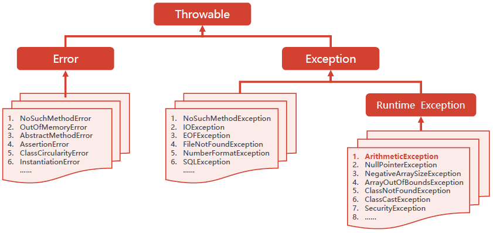

# CSE271 - Object-Oriented Programming - 异常

返回[Bulletin](./bulletin.md)

返回[CSE271 - Object-Oriented Programming](./cse271.md)

[TOC]



## 相关类

### Throwable

程序出了问题就抛出Throwable.

Throwable有两个重要的子类：**Exception**（异常）和 **Error**（错误），二者都是 Java 异常处理的重要子类，各自都包含大量子类。

### Error

Error是程序无法处理的错误，涵盖程序丌应捕获的异常，表示运行应用程序中较严重问题。

大多数错误与代码编写者执行的操作无关，而表示代码运行时 JVM（Java 虚拟机）出现的问题。

当程序触发Error时，它的执行状态已经无法恢复，需要中止线程甚至是中止虚拟机。

- NoSuchMethodError
- OutOfMemoryError
- AbstractMethodError
- AssertionError
- ClassCircularityError
- InstantiationError…

### Exception

Exception是指严重程度较轻的程序问题，涵盖程序可能需要捕获处理的异常，相较于Error更容易被后续代码处理和修复。

有些需要程序本身通过try catch代码处理，有些不建议通过try catch代码处理。

### Checked Exception

Checked Exception（非运行时异常/编译异常）就是在写代码的时候，IDE(比如Eclipse)会要求你写try catch的那种Exception，比如IOException。这种Exception是Java的设计者要求你的程序去处理的，通俗的话说就是在写代码时出现红线，需要try catch或者throws时出现的异常。

这种异常一般不会影响程序的主体，容易手动诊断修复，所以Java要求你在catch下面写出处理的代码，以保证程序遇到此类exception之后还可以正常运行。比如：

- NoSuchMethodException
- IOException
- EOFException
- FileNotFoundException
- NumberFormatException
- SQLException …

### Unchecked Exception

Unchecked Exception（运行时异常）是**RuntimeException**类及其子类，用来表示“程序虽然无法继续执行，但是还能抢救一下”的情况。

- ArithmeticException
- NullPointerException
- NegativeArraySizeException
- ArrayOutOfBoundsException
- ClassNotFoundException
- ClassCastException
- SecurityException …

## 异常处理原则

**只针对异常的情况才使用异常**

因为异常机制的初衷适用于不正常的情形，所有几乎没有JVM试图对他们进行优化，所以把代码放在try-catch块中反而阻止了现代JVM实现本可能执行的某些特定优化。

有些JVM在执行遍历时会进行优化，并不会导致冗余的检查。

**对可恢复的情况使用受检异常、对编程错误使用运行时异常**

避免不必要地使用受检的异常，记得在受检异常上提供方法，以便协助程序恢复。

不要定义任何既不是受检异常也不是运行异常的抛出类型。

**优先使用标准的异常**

不要直接重用Exception、RuntimeException、Throwable或者Error. 对待这些类要像对待抽象类一样，因为它们是一个方法可能抛出的其他异常的超类，无法可靠地测试这些异常。

**抛出与抽象相对应的异常**

异常转译（exceptiontranslation）指更高层的实现应该捕获低层的异常，同时抛出可以按照高层抽象进行解释的异常。

一种特殊的异常转译形式称为异常链（exceptionchaining），如果低层的异常对于调试导致高层异常的问题非常有帮助，使用异常链就很合适。低层的异常（原因）被传到高层的异常，高层的异常提供访问方法(Throwable的getCause方法）来获得低层的异常。

```Java
try {
    //...
} catch (LowerLevelException cause) {
    throw new HighLevelException(cause);
}
```

**每个方法抛出的异常都要有文档**

始终要单独地声明受检异常，并且利用Javadoc的＠throws标签，准确地记录下抛出每个异常的条件。

**在细节消息中包含能捕获失败的信息**

为了捕获失败，异常的细节信息应该包含“对该异常有贡献”的所有参数和字段的值。

**努力使失败保持原子性**

当对象抛出异常之后，通常我们期望这个对象仍然保持在一种定义良好的可用状态之中，即使失败是发生在执行某个操作的过程中间。对于受检异常而言，这尤为重要，因为调用者期望能从这种异常中逆行恢复。一般而言，失败的方法调用应该使对象保持在被调用之前的状态。具有这种属性的方法被称为具有失败原子性（failure atomic）

**不要盲目忽略异常**

空的catch块会使异常达不到应有的目的，即强迫你处理异常的情况。有可能侥幸逃过抛出异常但也有可能因此造成更大的问题。

## throw VS throws

### throw

throw抛出具体的问题对象，执行到throw，功能就已经结束了，跳转到调用者，并将具体的问题对象抛给调用者。所以下面不要定义其他语句，因为执行不到。throw 用在函数内，后面跟的是异常对象。

### throws

throws用来声明异常，让调用者提前知道该功能可能出现的问题。throws用在函数上，后面跟的是一个或者多个异常类。

## try–catch-finally

### 结构

```java
Scanner scanner = null;
try {
    scanner = new Scanner(new File("test.txt"));
    while (scanner.hasNext()) {
        System.out.println(scanner.nextLine());
    }
} catch (FileNotFoundException e) {
    e.printStackTrace();
} finally {
    if (scanner != null) {
        scanner.close();
    }
}
```

### try-with-resources

```
try (Scanner scanner = new Scanner(new File("test.txt"))) {
    while (scanner.hasNext()) {
        System.out.println(scanner.nextLine());
    }
} catch (FileNotFoundException fnfe) {
    fnfe.printStackTrace();
}
```

### AutoCloseable

实现了AutoCloseable接口的类，都会提供一个close()方法，以供在关闭此类时调用。重写示例如下：

```Java
public class MyResource implements **AutoCloseable** {
    @Override
    public void close() throws Exception {
        System.out.println("Closed MyResource");
    }
}
```

### 执行不到finally的情况

正常情况下，无论try里执行了return语句、break语句、还是continue语句，finally语句块还会继续执行。

但是也存在特殊情况，在try块中有System.exit(0);这样的语句，System.exit(0);是终止Java虚拟机JVM的，连JVM都停止了，所有都结束了，当然finally语句也不会被执行到。

finally中的return优先于try中的return或catch中的throw执行。