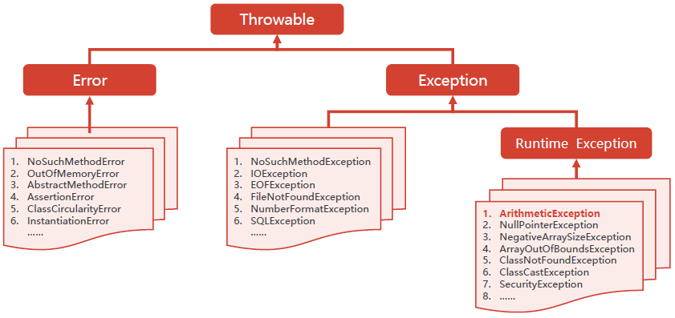
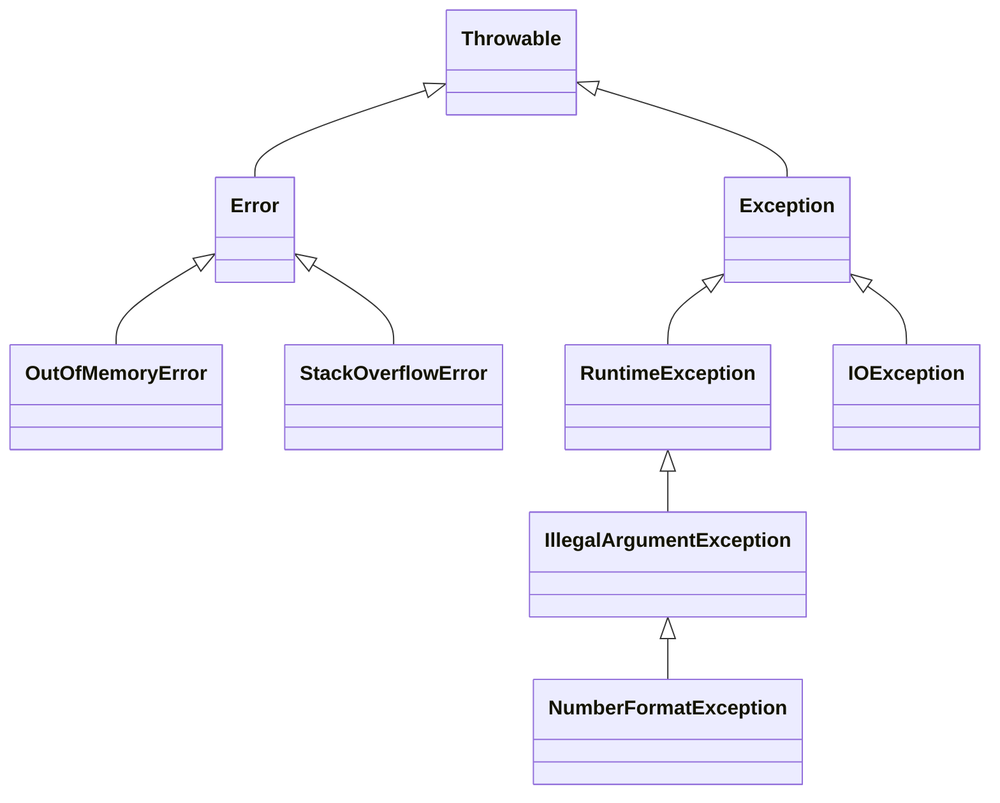

# CSE2713 - Exception Handling

返回[Bulletin](./bulletin.md)

返回[CSE271 - Java Core](./CSE271.md)

[TOC]

> 本文档定位：Java Exception Handling 核心知识，服务 Senior Java Backend 面试复习。主线是 Throwable 体系、Checked / Unchecked 语义、try-with-resources、异常设计与常见反模式。JVM 故障排查、Logging 框架、Spring 异常处理与分布式错误处理进入对应课程，本文不展开。

## 1. Exception Hierarchy



> **纠错**：上图为历史笔记配图，其中把 NumberFormatException 列在 Exception 直属子类下——实际它继承自 IllegalArgumentException → RuntimeException，属于 Unchecked Exception（见下方修正后的层次图与 §1.5）。

### Throwable

程序出了问题就抛出Throwable.

Throwable有两个重要的子类：**Exception**（异常）和 **Error**（错误），二者都是 Java 异常处理的重要子类，各自都包含大量子类。


```mermaid
classDiagram
    Throwable <|-- Error
    Throwable <|-- Exception
    Exception <|-- RuntimeException
    Error <|-- OutOfMemoryError
    Error <|-- StackOverflowError
    Exception <|-- IOException
    RuntimeException <|-- IllegalArgumentException
    IllegalArgumentException <|-- NumberFormatException
```

层次要点：**Error** 与 **RuntimeException 及其子类** 是 Unchecked；**Exception 中除 RuntimeException 子树之外的部分** 是 Checked，受编译器 catch-or-declare 约束。

### Error

Error是程序无法处理的错误，涵盖程序不应捕获的异常，表示运行应用程序中较严重问题。

大多数错误与代码编写者执行的操作无关，而表示代码运行时 JVM（Java 虚拟机）出现的问题。

> **纠错**：原文"当程序触发Error时，它的执行状态已经无法恢复，需要中止线程甚至是中止虚拟机"表述过于绝对。更准确的说法是：**Error 通常表示严重问题，应用程序通常不应该尝试捕获并恢复**。多数场景下放任其终止当前线程乃至 JVM 是合理选择，但这不等于"一定无法恢复"，也不是所有 Error 都代表 JVM 自身错误。

后端排障高频代表：

- OutOfMemoryError
- StackOverflowError
- NoClassDefFoundError（类加载失败、依赖冲突的常见信号）
- NoSuchMethodError（典型于 jar 版本冲突）
- AssertionError

低频 Error 类型（AbstractMethodError、ClassCircularityError、InstantiationError 等）见 Appendix A。

### Exception

Exception是指严重程度较轻的程序问题，涵盖程序可能需要捕获处理的异常，相较于Error更容易被后续代码处理和修复。

有些需要程序本身通过try catch代码处理，有些不建议通过try catch代码处理。

按编译器约束进一步划分为 Checked Exception 与 Unchecked Exception（RuntimeException 系）。

### Checked Exception

正式定义：**除 RuntimeException 及其子类之外的 Exception**，受 Java 编译器 **catch-or-declare requirement** 约束——调用方要么 catch，要么在方法签名上用 throws 声明，否则编译不通过。

原文的通俗记忆——"就是在写代码的时候，IDE(比如Eclipse)会要求你写try catch的那种Exception""写代码时出现红线"——可以作为辅助理解，但注意：红线只是编译器规则在 IDE 里的呈现，不是定义本身。

> **纠错**：原文"这种异常一般不会影响程序的主体，容易手动诊断修复，所以Java要求你在catch下面写出处理的代码"属于虚构因果。Java 强制处理 Checked Exception 是**语言设计与编译期规则**，与"是否容易修复"没有因果关系；设计意图是强迫调用方面对"调用可能失败"这一事实并显式做出决策。

典型例子：

- IOException
- FileNotFoundException
- SQLException
- ClassNotFoundException（**纠错**：原笔记把它列在 Unchecked，实际它是 Checked Exception）

低频类型（NoSuchMethodException、EOFException 等）见 Appendix A。

### Unchecked Exception

核心定义：**RuntimeException 及其子类**属于 Unchecked Exception；Java 编译器不强制调用方 catch 或 declare。

工程含义：RuntimeException 通常表示编程错误（bug）——非法参数、非法状态、空指针等。正确的处理方式通常是修复代码本身，而不是到处 catch。

> **纠错**：原文把 Unchecked Exception 定义为"程序虽然无法继续执行，但是还能抢救一下"——这个说法不能作为定义，只可当作非正式记忆。

典型例子：

- NullPointerException
- IllegalArgumentException
- IllegalStateException
- ArithmeticException
- ClassCastException
- IndexOutOfBoundsException
- NumberFormatException（**纠错**：原笔记把它列在 Checked；它继承自 IllegalArgumentException → RuntimeException，是 Unchecked Exception）

低频类型（NegativeArraySizeException、SecurityException 等）见 Appendix A。

## 2. Exception Handling

### throw vs throws

throw抛出具体的问题对象，执行到throw，功能就已经结束了，跳转到调用者，并将具体的问题对象抛给调用者。所以下面不要定义其他语句，因为执行不到。throw 用在函数内，后面跟的是异常对象。

throws用来声明异常，让调用者提前知道该功能可能出现的问题。throws用在函数上，后面跟的是一个或者多个异常类。

对比：

- throw → 抛出一个具体 Throwable 对象 → 出现在方法体中
- throws → 声明方法可能抛出的异常类型 → 出现在 method signature

### try / catch / finally

基本执行流程（原例）：

```java
Scanner scanner = null;
try {
    scanner = new Scanner(new File("test.txt"));
    while (scanner.hasNext()) {
        System.out.println(scanner.nextLine());
    }
} catch (FileNotFoundException e) {
    e.printStackTrace();
} finally {
    if (scanner != null) {
        scanner.close();
    }
}
```

要点补充：

- catch 应尽可能针对有意义的异常类型分别处理；无差别 catch 会掩盖真正的问题（见 §4 Catch Too Broadly）
- finally 通常用于 cleanup（关闭资源、释放锁等）
- **不建议在 finally 中 return**：finally 中的 return 会覆盖 try/catch 的返回值，甚至吞掉正在传播的异常（边角细节见 Appendix B）
- 原例中的 `e.printStackTrace()` 属于教学写法，生产代码应使用统一 logging（见 §4 printStackTrace()）

### try-with-resources

**try-with-resources 是管理 AutoCloseable 资源的首选方式**：资源在 try 结束时自动关闭，省去手写 null 检查和 close 样板代码，还能保证多资源关闭顺序、且不丢失原始异常信息。上文的 try–catch–finally 手工 close 写法，在有资源的情况下应优先改写为这种形式。

```
try (Scanner scanner = new Scanner(new File("test.txt"))) {
    while (scanner.hasNext()) {
        System.out.println(scanner.nextLine());
    }
} catch (FileNotFoundException fnfe) {
    fnfe.printStackTrace();
}
```

### AutoCloseable

实现了AutoCloseable接口的类，都会提供一个close()方法，以供在关闭此类时调用。重写示例如下：

```java
public class MyResource implements AutoCloseable {
    @Override
    public void close() throws Exception {
        System.out.println("Closed MyResource");
    }
}
```

两个细节：

- 多个资源按声明的**逆序**关闭（先声明的后关闭）
- try-with-resources 中，close 抛出的异常会作为 suppressed exception 附在主异常上（`getSuppressed()` 可获取），不像手写 finally 那样可能覆盖或吞掉原异常

## 3. Exception Design & Best Practices

> 本节整理自原"异常处理原则"，核心思想与《Effective Java》一致，原文尽量保留。

### Use Exceptions Only for Exceptional Conditions

**只针对异常的情况才使用异常。**

因为异常机制的初衷适用于不正常的情形。

> **纠错**：原文"所以几乎没有JVM试图对他们进行优化，把代码放在try-catch块中反而阻止了现代JVM实现本可能执行的某些特定优化"这类绝对表述未经证实，不宜作为依据（原文另注"有些JVM在执行遍历时会进行优化，并不会导致冗余的检查"）。站得住脚的理由是：**异常的构造（尤其 stack trace 捕获）存在真实成本，且异常路径绕过正常控制流、破坏可读性**。因此不要把异常机制当成普通分支使用。

### Checked vs Unchecked

**对可恢复的情况使用受检异常、对编程错误使用运行时异常。**

避免不必要地使用受检的异常，记得在受检异常上提供方法，以便协助程序恢复。

不要定义任何既不是受检异常也不是运行异常的抛出类型。

补充（避免教条化）：这是设计指引而非语言强制。可合理恢复、调用者有能力处理的情况，可考虑 checked exception；programming error / invalid argument / illegal state 等通常使用 runtime exception。现代 Java 工程对 checked exception 的取舍存在不同设计取向——例如 Spring 把 JDBC 的 SQLException 统一转译为 unchecked 的 DataAccessException——不要把某一种观点写成 Java 语言强制规范。

### Prefer Standard Exceptions

**优先使用标准的异常。**

不要直接重用Exception、RuntimeException、Throwable或者Error. 对待这些类要像对待抽象类一样，因为它们是一个方法可能抛出的其他异常的超类，无法可靠地测试这些异常。

常用且语义明确的标准异常：IllegalArgumentException（非法参数）、IllegalStateException（非法状态）、UnsupportedOperationException（不支持的操作）。不要滥造没有必要的异常类型。

### Exception Translation

**抛出与抽象相对应的异常。**

异常转译（exception translation）指更高层的实现应该捕获低层的异常，同时抛出可以按照高层抽象进行解释的异常——higher-level abstraction 不应该把无意义的 lower-level implementation exception 直接泄漏给调用方。

### Exception Chaining

一种特殊的异常转译形式称为异常链（exception chaining）：如果低层的异常对于调试导致高层异常的问题非常有帮助，使用异常链就很合适。低层的异常（原因）被传到高层的异常，高层的异常提供访问方法（Throwable 的 getCause 方法）来获得低层的异常。

```Java
try {
    //...
} catch (LowerLevelException cause) {
    throw new HighLevelException(cause);
}
```

### Document Exceptions

**每个方法抛出的异常都要有文档。**

始终要单独地声明受检异常，并且利用 Javadoc 的 @throws 标签，准确地记录下抛出每个异常的条件。

### Preserve Failure Information

**在细节消息中包含能捕获失败的信息。**

为了捕获失败，异常的细节信息应该包含"对该异常有贡献"的所有参数和字段的值。

注意边界：不要把密码、token、银行卡号、完整敏感个人数据写进异常 message 或日志。

### Failure Atomicity

**努力使失败保持原子性。**

当对象抛出异常之后，通常我们期望这个对象仍然保持在一种定义良好的可用状态之中，即使失败是发生在执行某个操作的过程中间。对于受检异常而言，这尤为重要，因为调用者期望能从这种异常中进行恢复。一般而言，失败的方法调用应该使对象保持在被调用之前的状态。具有这种属性的方法被称为具有失败原子性（failure atomic）。

### Do Not Ignore Exceptions

**不要盲目忽略异常。**

空的catch块会使异常达不到应有的目的，即强迫你处理异常的情况。有可能侥幸逃过抛出异常但也有可能因此造成更大的问题。

（展开见 §4 Swallow Exception。）

## 4. Common Exception Anti-Patterns

Senior 面试与代码评审高频，逐条保持短小。

### Swallow Exception

空 catch，或捕获后什么都不做：

```java
try {
    doSomething();
} catch (SomeException e) {
    // 什么也不做
}
```

真正的问题被隐藏，排障时无从下手。确有理由忽略时，至少记录日志并用注释说明原因（见 §3 Do Not Ignore Exceptions）。

### Catch Too Broadly

无理由的：

```java
catch (Exception e)
catch (Throwable t)
```

会连不该在此处理的类型（包括 Error 与 RuntimeException）一并捕获，隐藏真正根因，也让上层失去区分处理的机会。

注意：不是"永远不能 catch Exception"——边界层（线程顶层兜底、RPC handler 入口、定时任务入口）做最后防线的捕获与统一记录是合理用法；问题在业务代码中间层无差别吞捕获。

### printStackTrace()

生产代码不依赖 printStackTrace()：输出走 System.err、没有日志级别、不受日志框架与采集体系管理。应使用统一 logging / error handling（框架细节见 Logging 课程）。

### Lose the Cause

```java
throw new BusinessException("failed");     // 原始 cause 丢失
throw new BusinessException("failed", e); // 保留 cause，getCause() 可达
```

### Log and Throw

同一异常在每一层都：

```java
log.error("failed", e);
throw e;
```

同一次故障在日志里重复 N 条，污染告警与统计。应明确异常在哪一层真正记录：通常在边界层记录一次，下层只做转译/上抛。

### Exception as Control Flow

不要依赖抛异常实现普通循环、判断或正常业务分支——异常构造有成本、控制流不可读（见 §3 Use Exceptions Only for Exceptional Conditions）。

## 5. Custom Exception

什么时候值得自定义异常：

- 表达明确的领域语义（如 `InsufficientBalanceException` 比 `IllegalStateException` 更能自解释）
- 对调用者提供稳定抽象、隔离底层实现异常（配合 Exception Translation，见 §3）
- 需要携带结构化错误信息供上层统一处理

不要为了"每种错误都有一个类"无限创建异常类型——优先复用标准异常（见 §3 Prefer Standard Exceptions）。

Checked 还是 Unchecked：根据调用者是否有合理恢复责任、API 设计取向决定，没有统一答案（见 §3 Checked vs Unchecked）。

# Appendix — Fundamentals, Legacy & Reference

"降级，不删除"：以下内容仍有参考价值，但当前面试复习优先级较低，统一归档于此。

## A. Common Exception Reference

原笔记中的各类例子清单归档于此，正文只保留高频代表类型。

### Error（低频补充类型）

- AbstractMethodError
- ClassCircularityError
- InstantiationError
- ……

### Checked Exception（低频补充类型）

- NoSuchMethodException
- EOFException

### Unchecked Exception（低频补充类型）

- NegativeArraySizeException
- ArrayIndexOutOfBoundsException（IndexOutOfBoundsException 的子类；原笔记误写为 ArrayOutOfBoundsException）
- SecurityException

## B. finally Edge Cases

原"执行不到finally的情况"整节归档于此——边角面试题，知道即可，不应成为正文重点。

正常情况下，无论try里执行了return语句、break语句、还是continue语句，finally语句块还会继续执行。

但是也存在特殊情况，在try块中有System.exit(0);这样的语句，System.exit(0);是终止Java虚拟机JVM的，连JVM都停止了，所有都结束了，当然finally语句也不会被执行到。

finally中的return优先于try中的return或catch中的throw执行。

**明确不推荐：不要在 finally 中 return。**finally 中的 return 可能覆盖：

- try 中的 return
- catch 中的 return
- 正在传播的 exception（直接被吞掉）

正确用法：finally 只做 cleanup。
