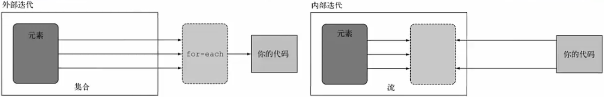
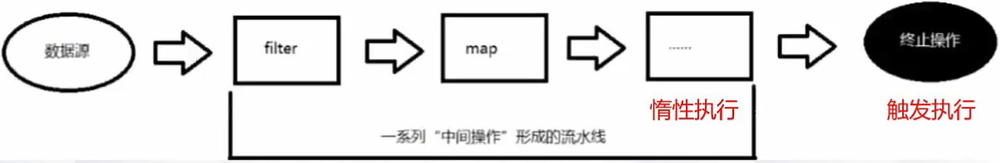
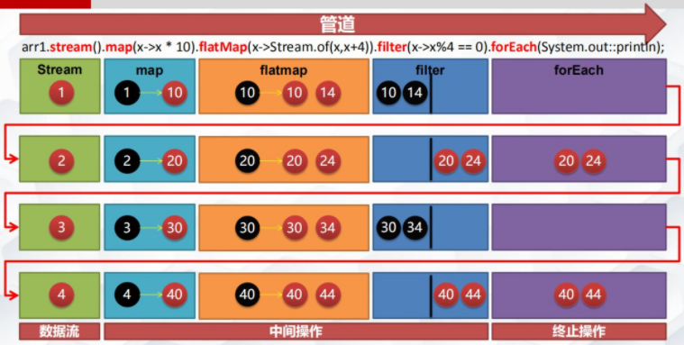
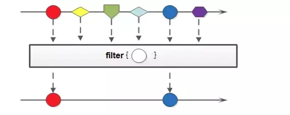
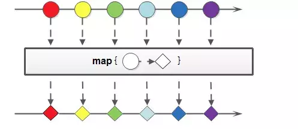
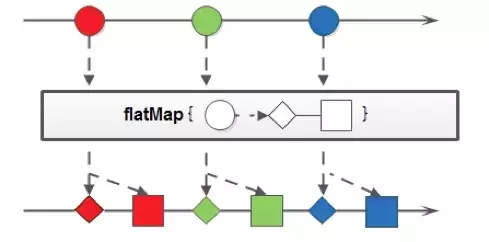
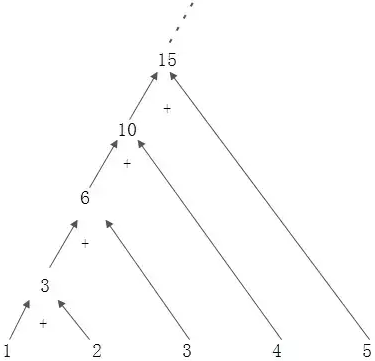

# CSE271 - Object-Oriented Programming - Java 8 新特性

返回[Bulletin](./bulletin.md)

返回[CSE271 - Object-Oriented Programming](./cse271.md)

[TOC]

*注：这里只收录了不好归类的 Java 8 新特性，一些便于归类的新特性例如 HashMap / ConcurrentHashMap 的优化等会在专门的章节中提及。*

## 泛型（优化）

### 什么是泛型？

泛型，顾名思义“泛指的类型”，是Java SE 1.5之后的特性，《Java核心技术》中对泛型的定义是：泛型意味着编写的代码可以被不同类型的对象所重用。

我们提供了泛指的概念，但具体执行的时候却可以有具体的规则来约束，比如我们用的非常多的ArrayList就是个泛型类，ArrayList作为集合可以存放各种元素，如Integer, String，自定义的各种类型等，但在我们使用的时候通过具体的规则来约束，如我们可以约束集合中只存放Integer类型的元素，如

```java
List<Integer> iniData = new ArrayList<>();
```

以集合来举例，使用泛型的好处是我们不必因为添加元素类型的不同而定义不同类型的集合。

在泛型使用过程中，操作的数据类型被指定为一个参数，这种参数类型可以用在类、接口和方法中，分别被称为泛型类、泛型接口、泛型方法。

### 协变

能在使用父类型的场景中改用**子类型**的被称为**协变**。

List<? extends T> 是**协变**（参数类型只能使用T及其**子类型**，T是上限），用于生产者（指函数的入口参数），只读不写。

List<? extends T> 的默认实现是 List<? extends Object>, 表示 ? 是继承自Object的任意类型，不可读不可写。

### 逆变

能在使用子类型的场景中改用**父类型**的被称为**逆变**。

List<? super T> 是**逆变**（参数类型只能使用T及其**父类型**，T是下限），用于消费者（指函数的出口参数或返回值），只写不读。

### 不变

不能做到以上两点的被称为**不变**。

### 泛型类

泛型类型用于类的定义中，被称为泛型类。通过泛型可以完成对一组类的操作对外开放相同的接口。最典型的就是各种容器类，如：List、Set、Map.

```java
//此处T可以随便写为任意标识，常见的如T、E、K、V等形式的参数常用于表示泛型
//在实例化泛型类时，必须指定T的具体类型
public class Generic<T> {
    
    //key这个成员变量的类型为T,T的类型由外部指定
    private T key;
    
    //泛型构造方法形参key的类型也为T，T的类型由外部指定
    public Generic(T key) {
        this.key = key;
    }
    
    //泛型方法getKey的返回值类型为T，T的类型由外部指定
    public T getKey(){
        return key;
    }
}

//泛型的类型参数只能是类类型（包括自定义类），不能是简单类型
//传入的实参类型需与泛型的类型参数类型相同，即为Integer.
Generic<Integer> genericInteger = new Generic<Integer>(123456);

//传入的实参类型需与泛型的类型参数类型相同，即为String.
Generic<String> genericString = new Generic<String>("key_vlaue");
```

### 泛型接口

泛型接口与泛型类的定义及使用基本相同，常被用在各种类的生产器中。

```java
//定义一个泛型接口
public interface Generator<T> {
    public T next();
}

/**
 * 未传入泛型实参时，与泛型类的定义相同，在声明类的时候，需将泛型的声明也一起加到类中
 * 即：class FruitGenerator<T> implements Generator<T>{
 * 如果不声明泛型，如：class FruitGenerator implements Generator<T>，编译器会报错："Unknown class"
 */
class FruitGenerator<T> implements Generator<T> {
    @Override
    public T next() {
        return null;
    }
}
```

### ? VS T

?表示一个未知类型，T是表示一个确定的类型。因此?无法像T声明变量和使用变量。

•    允许static <T> void test1(List<**T**> list) {

•    不允许static void test2(List<**?**> list){

?主要针对泛型类的限制，无法像 T类型参数一样单独存在。

•    允许List<T> list = xxx; list.add(xxx);

•    不允许List<?> list = xxx; list.add(xxx);

?表示? extends Object, 因此它是属于 in类型，无法接收数据, 而T可以。

“in”类型变量向代码提供数据，使用上边界通配符? extends.

“out”类型变量保存接收数据，使用下边界通配符? super.

•    允许static <T> void test1(**T** t) {

•    不允许static void test2(**?** t) {

? 主要表示使用泛型,T表示声明泛型

•    允许public class Holder<?> {…} …Holder<?> holder;

•    不允许public class Holder<T> {…}

•    允许Holder<?> holder;

•    不允许Holder<T> holder;

永远不要在方法返回中使用?，在方法中不会报错，但是方法的接收者将无法正常使用返回值。因为它返回了一个不确定的类型。

### 泛型方法

```java
/**
 * 泛型方法的基本介绍
 * @param tClass 传入的泛型实参
 * @return T 返回值为T类型
 * 说明：
 *   1）public 与 返回值中间<T>非常重要，可以理解为声明此方法为泛型方法。
 *   2）只有声明了<T>的方法才是泛型方法，泛型类中的使用了泛型的成员方法并不是泛型方法。
 *   3）<T>表明该方法将使用泛型类型T，此时才可以在方法中使用泛型类型T。
 *   4）与泛型类的定义一样，此处T可以随便写为任意标识，常见的如T、E、K、V等形式的参数常用于表示泛型。
 */
public <T> T genericMethod(Class<T> tClass) throws InstantiationException, IllegalAccessException {
    T instance = tClass.newInstance();
    return instance;
}

//泛型方法与可变参数
public <T> void printMsg( T... args) {
    for(T t : args){
        Log.d("泛型测试","t is " + t);
    }
}
```

### 泛型在什么阶段生效？

泛型只在**编译阶段**有效，以下面代码为例：

```java
List<String> stringArrayList = new ArrayList<String>();
List<Integer> integerArrayList = new ArrayList<Integer>();
Class classStringArrayList = stringArrayList.getClass();
Class classIntegerArrayList = integerArrayList.getClass();
if(classStringArrayList.equals(classIntegerArrayList)){
    Log.d("泛型测试","类型相同");
}
```

输出结果：D/泛型测试: 类型相同。

在编译过程中，正确检验泛型结果后，泛型的相关信息会被擦除，并且在对象进入和离开方法的边界处添加类型检查和类型转换的方法。也就是说，泛型信息不会进入到运行时阶段。 

## lambda表达式

【亚博科技 中信培训 字节跳动面试】

Lambda表达式，也可称为闭包，它是推动Java 8发布的最重要新特性，可以认为是一个匿名内部类的语法糖。

Java 8中引入了一个新的操作符"->"，该操作符称为箭头操作符或Lambda操作符。箭头操作符将 Lambda 表达式拆分成两部分：

•    左侧：Lambda 表达式的方法参数。

•    右侧：Lambda 表达式中所需执行的功能，即Lambda方法体。

(arg1, arg2 …)或(type1 arg1, type2 arg2 …) -> expression或{ statements; }

不需要声明参数类型，编译器可以统一识别参数值

(arg1, arg2 …)等价于(type1 arg1, type2 arg2 …) 

如果方法体只有一句表达式，那么可以省略大括号，且返回值的类型要与方法定义中的返回值类型兼容

public int sumMethod2(int a, double b);

(a, b)->a+(int)b

### 无参数、无返回值

```java
new Thread(new Runnable() {
    @Override
    public void run() {
        System.out.println("This is a thread!");
    }
});
//如果没有参数，则必须保留空括号
new Thread(()->System.out.println("This is a thread!"));
```

### 无参数、有返回值

```java
ExecutorService pool = Executors.newFixedThreadPool(5);
pool.submit(new Callable<Integer>() {
    @Override
    public Integer call() {
        System.out.println("This is a thread!");
        return 0;
    }
});
pool.submit(()->{
    System.out.println("This is a thread!");
    return 0;
});
```

### 只有一个参数

如果只有一个参数，可以省略括号。

```java
a->a++;
```

## 接口（优化）

### 默认方法

在JDK8中，可以在接口的方法声明前加上default关键字，这样就可以给walk()方法添加具体的实现，此种写法称之为默认方法实现。

```java
public interface IWalk {
    default void walk(){
        System.out.println("IWalk walk");
    }
}
```

### 静态方法

接口的默认方法除了可以声明为default之外，还可以声明为**static**，此时，调用默认方法时，则需要用**类名.方法名**来调用，和调用静态方法的方式是一样的。

## 函数式接口

### 定义

函数式接口（Functional Interface）指除了default和static, 有且只有**一个**抽象方法的接口。

Sum1 s = (a, b) -> Test.go(a, b); 这种接口定义方式是有可能存在无法正确匹配的问题的。

Java 8 为函数式接口增加了注解@FunctionalInterface校验接口是否只有一个抽象方法。如果使用了此注解，再往接口中新增抽象方法，实现接口的所有客户端就会编译器报错不通过。

函数式接口带给我们最大的好处就是：可以使用极简的lambda表达式实例化接口。

使用**匿名内部类**实现Comparator

```java
public class Test { 
    public static void main(String args[]) { 
        List<Person> persons = new ArrayList<Person>();
        Collections.sort(persons, new Comparator<Person>() {
            @Override
            public int compare(Person o1, Person o2) {
                return Integer.compareTo(o1.getAge(), o2.getAge());
            }
        });
    }
}
```

使用**函数式接口**实现Comparator

```java
Comparator<Person> comparator = (p1, p2) -> Integer.compareTo(p1.getAge(), p2.getAge());
```

-> 前面的 () 是Comparator接口中compare方法的参数列表

-> 后面则是compare方法的方法体。

### Function<T, R>函数型接口

传入一个参数T，返回R.

```java
public static void main(String[] args) {
    Function function = new Function<String, String>() {
        @Override
        public String apply(String s) {
            return s;
        }
    };
    // 只要是函数式接口，就可以使用lambda表达式简化
    Function function1 = a -> {
        return a;
    };
    System.out.println(function.apply("WWWW") + "====" + function1.apply("XXXX"));
}
```

### Predicate断定型接口

传入一个参数，返回一个布尔值。

```java
public static void main(String[] args) {
    // 传入一个参数，返回一个boolean值
    Predicate predicate = new Predicate<String>() {
        @Override
        public boolean test(String s) {
            return false;
        }
    };
    // 只要是函数式接口，就可以使用lambda表达式简化
    Predicate predicate1 = a -> {
        return false;
    };
    System.out.println(predicate.test("a") + "====" + predicate1.test("b"));
}
```

### Consumer消费型接口

传入一个参数，没有返回值。

```java
public static void main(String[] args) {
    Consumer consumer = new Consumer<String>() {
        @Override
        public void accept(String s) {
            System.out.println(s);
        }
    };
    // 只要是函数式接口，就可以使用lambda表达式简化
    Consumer consumer1 = a -> {
        System.out.println(a);
    };
    consumer.accept("s");
    consumer1.accept("a");
}
```

### Supplier供给型接口

不传入参数，返回一个值。

```java
public static void main(String[] args) {
    Supplier supplier = new Supplier() {
        @Override
        public String get() {
            return "aaa";
        }
    };
    // 只要是函数式接口，就可以使用lambda表达式简化
    Supplier supplier1 = () -> {
        return "bbb";
    };
    supplier.get();
    supplier1.get();
}
```

### 其他接口

除了上述得4种类型得接口外还有其他的一些接口供我们使用：

**BiFunction<T, U, R>**

参数类型有2个，为T，U，返回值为R，其中方法为R apply(T t, U u)

**UnaryOperator**(Function子接口)

参数为T，对参数为T的对象进行一元操作，并返回T类型结果，其中方法为T apply(T t)

**BinaryOperator**(BiFunction子接口)

参数为T，对参数为T得对象进行二元操作，并返回T类型得结果，其中方法为T apply（T t1， T t2）

**BiConsumer**(T, U)

参数为T，U无返回值，其中方法为 void accept(T t, U u)

**ToIntFunction**, **ToLongFunction**, **ToDoubleFunction**

参数类型为T, 返回值分别为int, long, double, 分别计算int，long，double得函数。

**IntFunction**, **LongFunction, DoubleFunction**

参数分别为int, long, double, 返回值为R.

## 方法引用

方法引用是一种函数式接口的另一种书写方式，通过一对双冒号::来表示：

### 类::静态方法

通过类名::静态方法名，如Integer::parseInt 

Interface Sum1 { public int sumMethod(int a, int b); }

public class Test { static int go(int a, double b) { return a+(int)b; } } 

//可以通过两种写法达到相同效果定义接口

Sum1 s = (a, b) -> Test.go(a, b);

Sum1 s = Test::go; 

### 类::构造方法

通过类名::new，如User::new

### 对象::实例方法

通过实例对象::实例方法，如 str::substring

### 数组[]::new

等价于new 数组[]

## 管道

### 定义

Java 8引入了全新的Stream API. Stream是一种**流式编程**，流式编程是一种编程范式。

这里的Stream和I/O流不同，它更像具有Iterable的集合类，但行为和集合类又有所不同。Stream和Collection结构化的数据不一样，Stream是一系列的元素，就像是生产线上的罐头一样，一串串的出来。

**采用内部迭代**

内置迭代器会自动触发循环，无需显式编写循环，配合Lambda表达式，使代码更加简短和优雅。只要给出需要对其包含的元素执行什么操作，比如“过滤掉长度大于 10 的字符串”、“获取每个字符串的首字母”等，Stream会隐式地在内部进行遍历，做出相应的数据转换。



**简便的集合操作符**

对比集合类，提供了更多简便的集合操作符，简化了一些必须进行循环的繁琐操作。



**使用了管道/流水线**

管道指的是一系列的聚合操作，每一步操作都返回流对象自身，分3个部分：管道源、中间操作、结束操作。



### 管道源

#### 管道源是集合（顺序流）

```java
collection1.stream().forEach(h->System.out.println(h.name));
```

#### 管道源是集合（并行流）

```java
collection1.parallelStream().forEach(h->System.out.println(h.name));
```

对于简单的集合操作，为了提升并发性能，手工去建立线程池显得很臃肿，并且写法也不够优雅。

将Stream替换成ParallelStream可以简洁高效的写出并发代码，内部默认使用ForkJoinPool线程池。

parallelStream提供了更简单的并发执行的实现，但并不意味着更高的性能，它是使用要根据具体的应用场景。影响性能的五要素是：

•    数据大小

•    源数据结构

•    值是否装箱

•    可用的CPU核数量

•    处理每个元素所花的时间

parallelStream并行执行是无序的。任务之间最好是状态无关的，因为parallelStream默认是非线程安全的，可能带来结果的不确定性。

#### 管道源是数组

```java
Hero hs[] = heros.toArray(new Hero[heros.size()]);
Arrays.stream(hs).forEach(h->System.out.println(h.name));
```

#### 管道源是值

可以使用静态方法Stream.of

public static <T> Stream<T> of(T… values)创建一个流，可以接收任意数量的参数。

#### 管道源是函数

可以使用静态方法Stream.iterator()和Stream.generate()创建无限流。

```java
//迭代
public static <T> Stream<T> iterate(final T seed, final UnaryOperator<T> f)
//生成
public static <T> Stream<T> generate(Supplier<T> s)
```

### 中间操作

每个中间操作，又会返回一个Stream，比如.filter()又返回一个Stream, 中间操作是“懒”操作，并不会真正进行遍历。

#### filter

遍历数据并检查其中的元素时使用。

filter接受一个函数作为参数，该函数用Lambda表达式表示。

```java
collection1.stream().filter(element -> "男".equals(element.getGender())).collect(Collectors.toList());
```



#### map

map生成的是个一对一映射，for的作用，比较常用、而且很简单。

```java
collection1.stream().map(element -> element.getName()).collect(Collectors.toList());
```

 

#### flatMap

顾名思义，跟map差不多，更深层次的操作，但返回值不同。

```java
//Map一对一
collection1.stream().map(element -> Arrays.stream(element.getName().split(" "))).collect(Collectors.toList());
//Flatmap一对多
collection2.stream().flatMap(element -> Arrays.stream(element.getName().split(" "))).collect(Collectors.toList());
```

flatMap的可以处理更深层次的数据，入参为多个list，结果可以返回为一个list，而map是一对一的，入参是多个list，结果返回必须是多个list。通俗的说，如果入参都是对象，那么flatMap可以操作对象里面的对象，而map只能操作第一层。



#### reduce

数字(字符串)累加，类似递归。

```java
//求最大值
Stream.of(1, 2, 3, 4)**.**reduce(Integer::max).ifPresent(System.out::println);
//求最小值
Stream.of(1, 2, 3, 4).reduce(Integer::min).ifPresent(System.out::println);
//求总和
Stream.of(1, 2, 3, 4).reduce((i, j) -> i.add(j)).ifPresent(System.out::println);
```

collect

在流中生成列表，map等常用的数据结构.

collection1.stream()**.collect(**Collectors.toList()**)**;

collection1.stream()**.collect(**Collectors.toSet()**)**;

collection1.stream()**.collect(**Collectors.toMap(element -> element.getName(), xx -> {return xx + "1";})**)**;

collection1.stream()**.collect(**Collectors.toCollection(TreeSet::new)**)**;

 

#### distinct

去除重复(根据equals判断) 

#### sorted

自然排序

#### sorted(Comparator<T>) 

指定排序

#### limit

保留

#### skip

忽略

### 结束操作

当这个操作执行后，流就被使用“光”了，无法再被操作。所以这必定是流的最后一个操作。 结束操作不会返回Stream，但是会返回int、float、String、 Collection或者像forEach，什么都不返回。

结束操作才进行真正的遍历行为，在遍历的时候，才会去进行中间操作的相关判断

#### forEach()

遍历每个元素

#### toArray()

转换为数组

#### min(Comparator<T>)

取最小的元素

#### max(Comparator<T>) 

取最大的元素

#### count()

总数

#### findFirst()

第一个元素

### Optional

Optional是为核心类库新设计的一个数据类型，用来替换null值，因为人们对原有的null值有很多抱怨，甚至连发明这一概念的Tony Hoare也是如此，他曾说这是自己的一个“价值连城的错误”。

- Optional.of(T)，T为非空，否则初始化报错
- Optional.ofNullable(T)，T为任意，可以为空
- Optional.isPresent(T)，相当于 ！=null
- Optional.ifPresent(T)， T可以是一段lambda表达式 ，或者其他代码，非空则执行

Optional用处很广，不光在lambda中，哪都能用。

### 时间日期API

JDK 1.8之前，Java时间使用java.util.Date和java.util.Calendar类。可以使用SimpleDateFormat对事件进行格式化，但是不保证线程安全。

JDK1.8之后，推出了以下时间日期API:

| 属性          | 含义                                                         |
| ------------- | ------------------------------------------------------------ |
| Instant       | 代表的是时间戳                                               |
| LocalDate     | 代表日期，比如2020-01-14                                     |
| LocalTime     | 代表时刻，比如12:59:59                                       |
| LocalDateTime | 代表具体时间 2020-01-12 12:22:26                             |
| ZonedDateTime | 代表一个包含时区的完整的日期时间，偏移量是以UTC/ 格林威治时间为基准的 |
| Period        | 代表时间段                                                   |
| ZoneOffset    | 代表时区偏移量，比如：+8:00                                  |
| Clock         | 代表时钟，比如获取目前美国纽约的时间                         |

