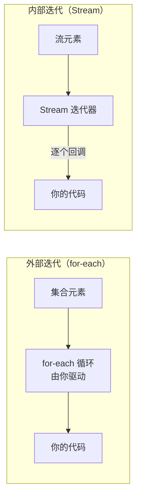
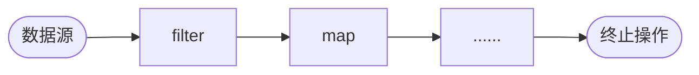
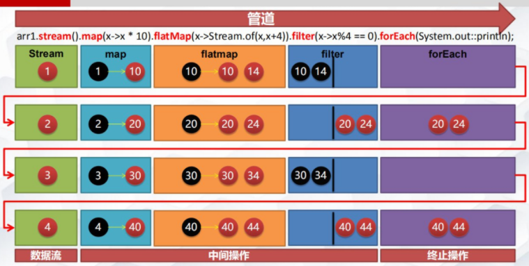
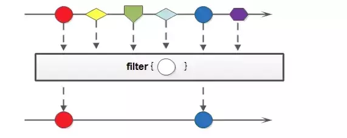
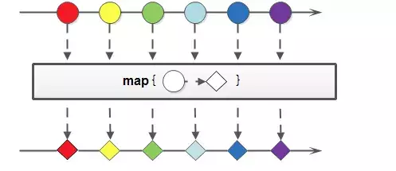
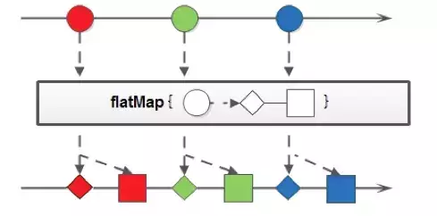
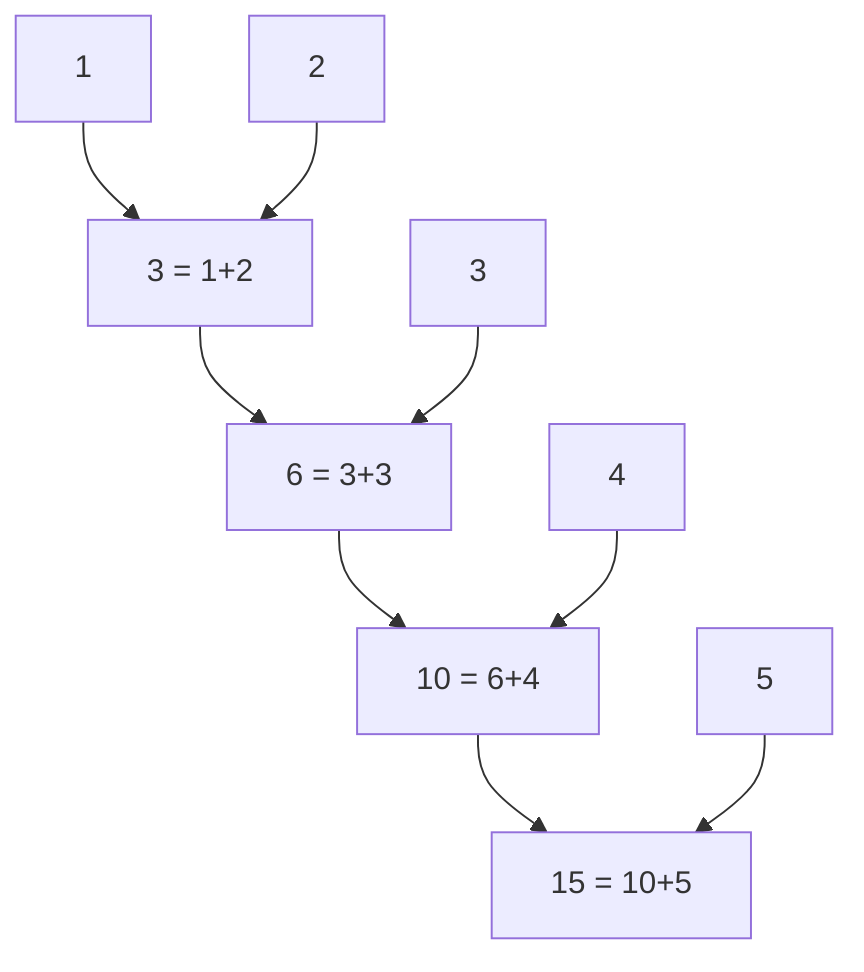

# CSE2716 - Modern Java

返回[Bulletin](./bulletin.md)

返回[CSE271 - Java Core](./CSE271.md)

[TOC]

> 本文档定位：Modern Java 的函数式编程主线——Generics、Lambda、Functional Interface、Method Reference、Stream API、Optional、java.time。Willington 定义：Java 8 及以后 = Modern Java；Java 7 及以前 = Classical / Legacy Java。Generics 虽来自 Java 5，但它是 Lambda、Functional API、Stream 与现代 Java 类型系统的基础，因此保留在本文件正文。var、text block、record、sealed class、switch expression、pattern matching、virtual thread、structured concurrency 等 Java 9+ 演进以后另建 Modern Java 章节，本文不展开。

## 1. Generics

*Generics introduced in Java 5（Java SE 1.5）。*

### Why Generics（什么是泛型）

泛型，顾名思义"泛指的类型"，是Java SE 1.5之后的特性，《Java核心技术》中对泛型的定义是：泛型意味着编写的代码可以被不同类型的对象所重用。

我们提供了泛指的概念，但具体执行的时候却可以有具体的规则来约束，比如我们用的非常多的ArrayList就是个泛型类，ArrayList作为集合可以存放各种元素，如Integer, String，自定义的各种类型等，但在我们使用的时候通过具体的规则来约束，如我们可以约束集合中只存放Integer类型的元素，如

```java
List<Integer> iniData = new ArrayList<>();
```

以集合来举例，使用泛型的好处是我们不必因为添加元素类型的不同而定义不同类型的集合。

在泛型使用过程中，操作的数据类型被指定为一个参数，这种参数类型可以用在类、接口和方法中，分别被称为泛型类、泛型接口、泛型方法。

核心收益两条：**类型安全**（编译期检查元素类型，错配直接编译报错，而不是运行时才发现）与**代码复用**（一套 API 适配所有类型）。

### Generic Class（泛型类）

泛型类型用于类的定义中，被称为泛型类。通过泛型可以完成对一组类的操作对外开放相同的接口。最典型的就是各种容器类，如：List、Set、Map.

```java
//此处T可以随便写为任意标识，常见的如T、E、K、V等形式的参数常用于表示泛型
//在实例化泛型类时，必须指定T的具体类型
public class Generic<T> {

    //key这个成员变量的类型为T,T的类型由外部指定
    private T key;

    //泛型构造方法形参key的类型也为T，T的类型由外部指定
    public Generic(T key) {
        this.key = key;
    }

    //泛型方法getKey的返回值类型为T，T的类型由外部指定
    public T getKey(){
        return key;
    }
}

//泛型的类型参数只能是类类型（包括自定义类），不能是简单类型
//传入的实参类型需与泛型的类型参数类型相同，即为Integer.
Generic<Integer> genericInteger = new Generic<Integer>(123456);

//传入的实参类型需与泛型的类型参数类型相同，即为String.
Generic<String> genericString = new Generic<String>("key_vlaue");
```

### Generic Interface（泛型接口）

泛型接口与泛型类的定义及使用基本相同，常被用在各种类的生产器中。

```java
//定义一个泛型接口
public interface Generator<T> {
    public T next();
}

/**
 * 未传入泛型实参时，与泛型类的定义相同，在声明类的时候，需将泛型的声明也一起加到类中
 * 即：class FruitGenerator<T> implements Generator<T>{
 * 如果不声明泛型，如：class FruitGenerator implements Generator<T>，编译器会报错："Unknown class"
 */
class FruitGenerator<T> implements Generator<T> {
    @Override
    public T next() {
        return null;
    }
}
```

### Generic Method（泛型方法）

```java
/**
 * 泛型方法的基本介绍
 * @param tClass 传入的泛型实参
 * @return T 返回值为T类型
 * 说明：
 *   1）public 与 返回值中间<T>非常重要，可以理解为声明此方法为泛型方法。
 *   2）只有声明了<T>的方法才是泛型方法，泛型类中的使用了泛型的成员方法并不是泛型方法。
 *   3）<T>表明该方法将使用泛型类型T，此时才可以在方法中使用泛型类型T。
 *   4）与泛型类的定义一样，此处T可以随便写为任意标识，常见的如T、E、K、V等形式的参数常用于表示泛型。
 */
public <T> T genericMethod(Class<T> tClass) throws Exception {
    T instance = tClass.getDeclaredConstructor().newInstance();
    return instance;
}

//泛型方法与可变参数
public <T> void printMsg( T... args) {
    for(T t : args){
        Log.d("泛型测试","t is " + t);
    }
}
```

> 注：原写法 `tClass.newInstance()` 是 legacy API（Java 9 起 deprecated），此处已替换为现代等价写法，见 Appendix A。

### Invariance（不变）

不能做到以上两点的被称为不变（"以上两点"指协变与逆变，见下文 Wildcards）。

Java 泛型默认是 **invariant**：即使 `Integer extends Number`，也不意味着 `List<Integer>` 是 `List<Number>` 的子类型——`List<Number> list = new ArrayList<Integer>();` 编译不通过。

这是刻意的类型安全设计（否则可以往"Integer 列表"里塞 Double），也正是需要通配符的原因。

### Wildcards（通配符）

由于泛型默认 invariant，泛型 API 用通配符在"灵活"与"类型安全"之间取得平衡。

#### ? extends T（协变）

能在使用父类型的场景中改用**子类型**的被称为**协变**。

List<? extends T> 是**协变**（参数类型只能使用T及其**子类型**，T是上限），用于生产者（指函数的入口参数），只读不写。

> **纠错**：
> 1. "只读不写"可以当记忆口诀，但要理解真实类型原因：`List<? extends Number>` 的实际运行时列表可能是 `List<Integer>`、`List<Double>` 等 Number 的任意子类型列表，编译器不知道具体是哪个。因此：
>    - **读**是安全的——任何元素都一定是 Number（get 得到 Number）
>    - **写**不安全——`add(new Integer(...))` 可能写进一个实际为 `List<Double>` 的列表，编译器因此禁止 add 任何具体类型（只允许 `add(null)`）
> 2. 原文"List<? extends T> 的默认实现是 List<? extends Object>, 表示 ? 是继承自Object的任意类型，不可读不可写"是错误结论：不存在"默认实现"这一说，且它是**可读**的（读作 T）。

**Producer Extends**：当一个结构主要向调用者"提供/生产" T 时，用 `? extends T`。

#### ? super T（逆变）

能在使用子类型的场景中改用**父类型**的被称为**逆变**。

List<? super T> 是**逆变**（参数类型只能使用T及其**父类型**，T是下限），用于消费者（指函数的出口参数或返回值），只写不读。

> **纠错**：
> 1. "只写不读"同样是口诀。真实类型原因：`List<? super Integer>` 的实际列表可能是 `List<Number>`、`List<Object>`。往里 add Integer（或其子类）永远安全（Integer 一定能放进 Number/Object 容器）；但 get 只能安全地当作 Object——你不知道列表声明的是什么父类型。
> 2. 原文"消费者（指函数的出口参数或返回值）"的括号解释是混乱的：consumer 指**接收/消费数据**的结构，典型是往里面填充的集合参数，不是"返回值"。

**Consumer Super**：当结构需要"接收/消费" T 时，用 `? super T`。

#### PECS

**Producer Extends, Consumer Super** —— 出自《Effective Java》，泛型 API 设计最重要的一条原则。

JDK 标准示例（`java.util.Collections#copy`）：

```java
public static <T> void copy(List<? super T> dest, List<? extends T> src)
```

src 是生产者（从里面读 T），所以 `? extends T`；dest 是消费者（往里面写 T），所以 `? super T`。

### ? vs T

T = **named type parameter**（命名的类型参数），在声明泛型类/泛型方法时引入；? = **wildcard**（通配符），表示"某个未知的具体类型"，只能用在**使用**泛型类型的位置，不能用于声明。

原文结论整理与纠错：

- 允许 `static <T> void test1(List<T> list)` —— T 在此声明为类型参数
- **允许** `static void test2(List<?> list)` —— **纠错**：原笔记写"不允许"，实际完全合法；`List<?>` 是"元素类型未知"的列表，可以读元素（得到 Object），不能添加非 null 元素
- 允许 `static <T> void test1(T t)`；不允许 `static void test2(? t)` —— ? 不能作为方法参数类型使用
- `List<T> list = xxx; list.add(xxx);` 合法；`List<?> list = xxx;` 赋值本身合法，但其后 `list.add(xxx)` 不允许（null 除外）
- **允许** `public class Holder<T> {…}`；**不允许** `public class Holder<?> {…}` —— **纠错**：原笔记把这两条写反了。`Holder<?>` 作为泛型类声明是**非法语法**——通配符只能出现在类型使用处，不能出现在类型参数声明位置
- 允许 `Holder<?> holder;`（未知类型，可读为 Object）；`Holder<T> holder;` 在没有声明 T 的上下文中不允许

> **纠错**：原文"?表示? extends Object, 因此它是属于 in类型，无法接收数据"——错误。`List<?>` **可以读取**元素（视为 Object），只是不能添加非 null 元素。原文的两条 in/out 对应也写反了：out（输出/生产）对应协变 `? extends`，in（输入/消费）对应逆变 `? super`（与 C#/Kotlin 的型变标注一致）。

? 主要表示使用泛型，T 表示声明泛型。

`<T>` 用于声明 type parameter：

```java
public <T> T identity(T value) {
    return value;
}
```

`<?>` 用于使用泛型类型时表达未知类型：

```java
List<?> list = ...;   // 元素类型未知：可读 Object，不可写非 null
```

**返回值中使用通配符**（修正原文的绝对化）：

原文："永远不要在方法返回中使用?，在方法中不会报错，但是方法的接收者将无法正常使用返回值。因为它返回了一个不确定的类型。"

返回类型用通配符会让调用方拿不到有用的类型信息，多数 API 设计应避免，改用具体的类型参数；但这不是语言层面的绝对禁令——JDK 里就有反例：`Object.getClass()` 返回 `Class<?>`（具体类型只有运行时才知道，只能这样声明）。

### Type Erasure（泛型在什么阶段生效？）

泛型只在**编译阶段**有效，以下面代码为例：

```java
List<String> stringArrayList = new ArrayList<String>();
List<Integer> integerArrayList = new ArrayList<Integer>();
Class classStringArrayList = stringArrayList.getClass();
Class classIntegerArrayList = integerArrayList.getClass();
if(classStringArrayList.equals(classIntegerArrayList)){
    Log.d("泛型测试","类型相同");
}
```

输出结果：D/泛型测试: 类型相同。

在编译过程中，正确检验泛型结果后，泛型的相关信息会被擦除，并且在对象进入和离开方法的边界处添加类型检查和类型转换的方法。

> **纠错**：原文"也就是说，泛型信息不会进入到运行时阶段"过于绝对。Java 泛型采用 **type erasure**：运行期 `List<String>` 与 `List<Integer>` 共享同一个 Class（上面代码正证明了这一点），大部分 type parameter 信息在运行时不可直接获得——不能 `new T()`，`instanceof` 不能针对 `List<String>` 这类参数化类型。但部分 generic metadata 仍保留在 class 文件中，可通过 reflection 读取（如 `Field.getGenericType()`、`Class.getGenericSuperclass()`——子类保存的父类泛型实参能被读出来）。

## 2. Lambda Expression

Lambda表达式，也可称为闭包，它是推动Java 8发布的最重要新特性。

> **纠错**：原文接着写"可以认为是一个匿名内部类的语法糖"——不准确。Lambda 提供了一种实现 Functional Interface 行为的简洁表达方式，与匿名内部类在多数场景可互换，但**语义并不完全相同**（this 指向、作用域、实现机制都有差异，见下节）。

Java 8中引入了一个新的操作符"->"，该操作符称为箭头操作符或Lambda操作符。箭头操作符将 Lambda 表达式拆分成两部分：

- 左侧：Lambda 表达式的方法参数。
- 右侧：Lambda 表达式中所需执行的功能，即Lambda方法体。

(arg1, arg2 …)或(type1 arg1, type2 arg2 …) -> expression或{ statements; }

不需要声明参数类型，编译器可以统一识别参数值

(arg1, arg2 …)等价于(type1 arg1, type2 arg2 …)

如果方法体只有一句表达式，那么可以省略大括号，且返回值的类型要与方法定义中的返回值类型兼容

public int sumMethod2(int a, double b);

(a, b)->a+(int)b

### 无参数、无返回值

```java
new Thread(new Runnable() {
    @Override
    public void run() {
        System.out.println("This is a thread!");
    }
});
//如果没有参数，则必须保留空括号
new Thread(()->System.out.println("This is a thread!"));
```

### 无参数、有返回值

```java
ExecutorService pool = Executors.newFixedThreadPool(5);
pool.submit(new Callable<Integer>() {
    @Override
    public Integer call() {
        System.out.println("This is a thread!");
        return 0;
    }
});
pool.submit(()->{
    System.out.println("This is a thread!");
    return 0;
});
```

### 只有一个参数

如果只有一个参数，可以省略括号。

```java
a->a++
```

### Lambda vs Anonymous Inner Class

- **this 指向**：Lambda 中的 this 指向外围实例（enclosing instance）；匿名内部类中的 this 指向匿名类实例自身
- **作用域**：Lambda 不引入新的作用域，其参数不能遮蔽（shadow）外围同名的局部变量；匿名内部类有自己的作用域，可以
- **实现机制**：Lambda 不能简单理解成"编译器生成了一个匿名内部类"——实现借助 invokedynamic 在运行期完成（字节码细节见 CSE301 JVM）

### Effectively Final

Lambda 捕获 local variable 时，变量必须是 final 或 **effectively final**（只赋值一次、事实上的 final）：

```java
int count = 0;
count++;                                       // 再赋值 → 非 effectively final
Runnable r = () -> System.out.println(count);  // 编译错误
```

原因简释：Lambda 捕获的是变量值的**拷贝**，而 Lambda 体可能被延迟/异步执行；如果允许原变量随后被修改，两边就失去了同步，语义不清——Java 直接在编译期禁止。（捕获实例字段不受此限，因为它经由 this 引用访问。）

## 3. Functional Interface

函数式接口（Functional Interface）指有且只有**一个**抽象方法（Object类的方法除外）的接口。

补充：default methods、static methods、以及 Object 的 public 方法签名（如 equals/hashCode 的重新声明）都**不计入**"唯一抽象方法"的限制。

Sum1 s = (a, b) -> Test.go(a, b); 这种接口定义方式是有可能存在无法正确匹配的问题的。

Java 8 为函数式接口增加了注解@FunctionalInterface校验接口是否只有一个抽象方法。如果使用了此注解，再往接口中新增抽象方法，实现接口的所有客户端就会编译器报错不通过。

函数式接口带给我们最大的好处就是：可以使用极简的lambda表达式实例化接口。

使用**匿名内部类**实现Comparator

```java
public class Test {
    public static void main(String args[]) {
        List<Person> persons = new ArrayList<Person>();
        Collections.sort(persons, new Comparator<Person>() {
            @Override
            public int compare(Person o1, Person o2) {
                return Integer.compare(o1.getAge(), o2.getAge());
            }
        });
    }
}
```

使用**函数式接口**实现Comparator

```java
Comparator<Person> comparator = (p1, p2) -> Integer.compare(p1.getAge(), p2.getAge());
```

> **纠错**：原文两处写作 `Integer.compareTo(...)`——compareTo 是实例方法，不能这样静态调用，正确写法是静态方法 `Integer.compare(a, b)`。

-> 前面的 () 是Comparator接口中compare方法的参数列表

-> 后面则是compare方法的方法体。

更进一步可用工厂方法/方法引用：`Comparator.comparing(Person::getAge)`。

### Interface Evolution：default 与 static 方法（原"接口（优化）"）

在JDK8中，可以在接口的方法声明前加上default关键字，这样就可以给walk()方法添加具体的实现，此种写法称之为默认方法实现。

```java
public interface IWalk {
    default void walk(){
        System.out.println("IWalk walk");
    }
}
```

接口的默认方法除了可以声明为default之外，还可以声明为**static**，此时，调用默认方法时，则需要用**类名.方法名**来调用，和调用静态方法的方式是一样的。

default method 让 Collection 这类老接口能在 Java 8 直接增加 `stream()` 而不破坏既有实现类——这也是 Stream API 能落地的前提。

### Function<T, R>

一个输入，一个输出，一般情况下输入和输出类型不同。

```java
public static void main(String[] args) {
    Function function = new Function<String, String>() {
        @Override
        public String apply(String s) {
            return s;
        }
    };
    // 只要是函数式接口，就可以使用lambda表达式简化
    Function function1 = a -> {
        return a;
    };
    System.out.println(function.apply("WWWW") + "====" + function1.apply("XXXX"));
}
```

#### primitive specialization

- ToIntFunction, ToLongFunction, ToDoubleFunction：参数类型为T，返回值分别为int, long, double
- IntFunction, LongFunction, DoubleFunction：参数分别为int, long, double，返回值为R

#### UnaryOperator<T>

Function子接口。

一个输入，一个输出，输入和输出类型相同。其中方法为T apply(T t)，即 T → T。

### Predicate<T>

传入一个参数，返回一个布尔值。

```java
public static void main(String[] args) {
    // 传入一个参数，返回一个boolean值
    Predicate predicate = new Predicate<String>() {
        @Override
        public boolean test(String s) {
            return false;
        }
    };
    // 只要是函数式接口，就可以使用lambda表达式简化
    Predicate predicate1 = a -> {
        return false;
    };
    System.out.println(predicate.test("a") + "====" + predicate1.test("b"));
}
```

### Consumer<T>

一个输入，没有输出。

```java
public static void main(String[] args) {
    Consumer consumer = new Consumer<String>() {
        @Override
        public void accept(String s) {
            System.out.println(s);
        }
    };
    // 只要是函数式接口，就可以使用lambda表达式简化
    Consumer consumer1 = a -> {
        System.out.println(a);
    };
    consumer.accept("s");
    consumer1.accept("a");
}
```

#### BiConsumer<T, U>

两个输入，没有输出。其中方法为 void accept(T t, U u)

### Supplier<T>

没有输入，一个输出。

```java
public static void main(String[] args) {
    Supplier supplier = new Supplier() {
        @Override
        public String get() {
            return "aaa";
        }
    };
    // 只要是函数式接口，就可以使用lambda表达式简化
    Supplier supplier1 = () -> {
        return "bbb";
    };
    supplier.get();
    supplier1.get();
}
```

### BiFunction<T, U, R>

> **纠错**：原文写"一个输入，两个输出"是错的。正确：**两个输入，一个输出**。其中方法为 R apply(T t, U u)

#### BinaryOperator<T>

BiFunction子接口。

> **纠错**：原文写"一个输入，两个输出"是错的。正确：**两个同类型输入，一个同类型输出**，即 (T, T) → T。其中方法为 T apply(T t1, T t2)

## 4. Method Reference

方法引用是一种函数式接口的另一种书写方式，通过一对双冒号::来表示。

### 类::静态方法

通过类名::静态方法名，如Integer::parseInt

Interface Sum1 { public int sumMethod(int a, int b); }

public class Test { static int go(int a, double b) { return a+(int)b; } }

//可以通过两种写法达到相同效果定义接口

Sum1 s = (a, b) -> Test.go(a, b);

Sum1 s = Test::go;

### 对象::实例方法

通过实例对象::实例方法，如 str::substring

### 类::实例方法

未绑定的实例方法引用：第一个参数会成为方法的调用者（receiver）。

```java
Function<String, Integer> length = String::length;   // s -> s.length()
Comparator<String> cmp = String::compareToIgnoreCase; // (a, b) -> a.compareToIgnoreCase(b)
```

### 类::构造方法

通过类名::new，如User::new

### 数组[]::new

等价于new 数组[]

## 5. Stream API / Pipeline（原"管道"）

### Stream vs Collection

Java 8引入了全新的Stream API. Stream是一种**流式编程**，流式编程是一种编程范式。

这里的Stream和I/O流不同，它更像具有Iterable的集合类，但行为和集合类又有所不同。Stream和Collection结构化的数据不一样，Stream是一系列的元素，就像是生产线上的罐头一样，一串串的出来。

一句话对比：Collection 主要**保存**数据；Stream 主要**描述**对数据的一系列计算操作。

**简便的集合操作符**

对比集合类，提供了更多简便的集合操作符，简化了一些必须进行循环的繁琐操作。

### Internal Iteration

内置迭代器会自动触发循环，无需显式编写循环，配合Lambda表达式，使代码更加简短和优雅。只要给出需要对其包含的元素执行什么操作，比如"过滤掉长度大于 10 的字符串"、"获取每个字符串的首字母"等，Stream会隐式地在内部进行遍历，做出相应的数据转换。

外部迭代由你驱动 for-each；内部迭代由 Stream 驱动、按元素回调你的代码：


```mermaid
flowchart LR
    subgraph Ext["外部迭代（for-each）"]
        E1[集合元素] --> E2[for-each 循环<br>由你驱动] --> E3[你的代码]
    end
    subgraph Int["内部迭代（Stream）"]
        S1[流元素] --> S2[Stream 迭代器] -->|逐个回调| S3[你的代码]
    end
```

### Pipeline（管道）

管道指的是一系列的聚合操作，每一步操作都返回流对象自身，分3个部分：**管道源、中间操作、结束操作**。

**Source → Intermediate Operations → Terminal Operation**


```mermaid
flowchart LR
    SRC([数据源]) --> F[filter] --> M[map] --> D[ ...... ] --> T([终止操作])
```

中间操作（filter、map、……）形成流水线，**惰性执行**；**终止操作触发执行**（见下节）。

逐元素视角的管道执行过程示意（原笔记配图，保留）：



### Lazy Evaluation

每个中间操作，又会返回一个Stream，比如.filter()又返回一个Stream, 中间操作是"懒"操作，并不会真正进行遍历。

结束操作才进行真正的遍历行为，在遍历的时候，才会去进行中间操作的相关判断。

### 管道源

#### 管道源是集合（顺序流）

```java
collection1.stream().forEach(h->System.out.println(h.name));
```

#### 管道源是集合（并行流）

```java
collection1.parallelStream().forEach(h->System.out.println(h.name));
```

并发语义与性能取舍见下文 Parallel Stream。

#### 管道源是数组

```java
Hero hs[] = heros.toArray(new Hero[heros.size()]);
Arrays.stream(hs).forEach(h->System.out.println(h.name));
```

#### 管道源是值

可以使用静态方法Stream.of

public static <T> Stream<T> of(T… values)创建一个流，可以接收任意数量的参数。

#### 管道源是函数

可以使用静态方法Stream.iterate()和Stream.generate()创建无限流。

```java
//迭代
public static <T> Stream<T> iterate(final T seed, final UnaryOperator<T> f)
//生成
public static <T> Stream<T> generate(Supplier<T> s)
```

### Intermediate Operations（中间操作）

每个中间操作返回新的 Stream，本身不触发执行（见 Lazy Evaluation）。

#### filter

遍历数据并检查其中的元素时使用。

filter接受一个函数作为参数，该函数用Lambda表达式表示。

```java
collection1.stream().filter(element -> "男".equals(element.getGender())).collect(Collectors.toList());
```



#### map

map生成的是个一对一映射，for的作用，比较常用、而且很简单。

类型上是 T → R。

```java
collection1.stream().map(element -> element.getName()).collect(Collectors.toList());
```



#### flatMap

顾名思义，跟map差不多，更深层次的操作，但返回值不同。

```java
//Map一对一
collection1.stream().map(element -> Arrays.stream(element.getName().split(" "))).collect(Collectors.toList());
//Flatmap一对多
collection2.stream().flatMap(element -> Arrays.stream(element.getName().split(" "))).collect(Collectors.toList());
```

flatMap的可以处理更深层次的数据，入参为多个list，结果可以返回为一个list，而map是一对一的，入参是多个list，结果返回必须是多个list。通俗的说，如果入参都是对象，那么flatMap可以操作对象里面的对象，而map只能操作第一层。

> **修正表述**：原文的直觉方向是对的，准确的类型规则是：
> - map：T → R，一对一映射
> - flatMap：T → Stream<R>，先映射成内部 Stream，再把多个内部 Stream **flatten** 成一个 Stream
>
> "操作对象里面的对象"（摊平嵌套结构）可作辅助记忆。



#### reduce

> **纠错**：原文"数字(字符串)累加，类似递归"不准确。reduce 是一种 **reduction / fold 操作**：按给定的结合规则把多个元素**组合成一个结果**，`reduce((acc, x) -> f(acc, x))` 从左向右折叠，与递归是两回事。

```java
//求最大值
Stream.of(1, 2, 3, 4).reduce(Integer::max).ifPresent(System.out::println);
//求最小值
Stream.of(1, 2, 3, 4).reduce(Integer::min).ifPresent(System.out::println);
//求总和
Stream.of(1, 2, 3, 4).reduce((i, j) -> i + j).ifPresent(System.out::println);
```

> **纠错**：原文求和写作 `(i, j) -> i.add(j)`——Integer 没有 add 方法，无法编译，应为 `i + j` 或 `Integer::sum`。

`reduce((a, b) -> a + b)` 对 1..5 的折叠过程（原 CSE271014.png 重绘）：


```mermaid
graph TD
    L1["1"] --> S3["3 = 1+2"]
    L2["2"] --> S3
    S3 --> S6["6 = 3+3"]
    L3["3"] --> S6
    S6 --> S10["10 = 6+4"]
    L4["4"] --> S10
    S10 --> S15["15 = 10+5"]
    L5["5"] --> S15
```

#### collect

在流中生成列表，map等常用的数据结构.

collect 是 **mutable reduction**：把元素累积进可变容器，常用于收集成 List、Set、Map，或用 groupingBy 等下游收集器分组。

```java
collection1.stream().collect(Collectors.toList());
collection1.stream().collect(Collectors.toSet());
collection1.stream().collect(Collectors.toMap(element -> element.getName(), xx -> {return xx + "1";}));
collection1.stream().collect(Collectors.toCollection(TreeSet::new));
// 按键分组
collection1.stream().collect(Collectors.groupingBy(Person::getCity));
```

#### distinct

去除重复(根据equals判断)

#### sorted

自然排序

#### sorted(Comparator<T>)

指定排序

#### limit

保留

#### skip

忽略

### Terminal Operations（结束操作）

当这个操作执行后，流就被使用"光"了，无法再被操作。所以这必定是流的最后一个操作。 结束操作不会返回Stream，但是会返回int、float、String、 Collection或者像forEach，什么都不返回。

#### forEach()

遍历每个元素

#### toArray()

转换为数组

#### min(Comparator<T>)

取最小的元素

#### max(Comparator<T>)

取最大的元素

#### count()

总数

#### findFirst()

第一个元素

#### anyMatch / allMatch / noneMatch

短路匹配：任一匹配 / 全部匹配 / 无一匹配，达到判定条件即提前结束。

### Parallel Stream

对于简单的集合操作，为了提升并发性能，手工去建立线程池显得很臃肿，并且写法也不够优雅。

将Stream替换成ParallelStream可以简洁高效的写出并发代码，内部默认使用ForkJoinPool.commonPool。

parallelStream提供了更简单的并发执行的实现，但并不意味着更高的性能，它是要根据具体的应用场景使用的。影响性能的五要素（原文保留）：

- 数据大小
- 源数据结构
- 值是否装箱
- 可用的CPU核数量
- 处理每个元素所花的时间

补充两项现代工程同样要算进成本的：merge 成本，以及应避免 blocking I/O（会占死 commonPool 的 worker）。

**Parallel ≠ Faster**。是否有收益取决于上述要素；小数据量、每元素成本低、boxing 频繁、数据源难以 splitting 的场景下，并行常常更慢。

> **纠错**：原文"parallelStream并行执行是无序的。任务之间最好是状态无关的，因为parallelStream默认是非线程安全的，可能带来结果的不确定性"——表述不准确。parallel stream 本身并不意味着"线程安全/不安全"；真正的问题是：**一旦 pipeline 操作共享 mutable state，就会出现 race condition，结果不确定**。并行处理可能不按 encounter order 执行（如 forEach 的输出顺序），任务之间最好状态无关，这一原文直觉是对的。

避免在 parallel stream 中：

- 修改共享 ArrayList（非线程安全容器，直接 ConcurrentModificationException 或数据丢失）
- 修改共享计数器（用 LongAdder / reduce 代替）
- 做大量 blocking I/O（占死 commonPool）
- 依赖严格 encounter order 却又使用无序操作

并发与线程安全的完整知识见 CSE311；ForkJoinPool 细节不在此展开。

## 6. Optional

Optional是为核心类库新设计的一个数据类型，用来替换null值，因为人们对原有的null值有很多抱怨，甚至连发明这一概念的Tony Hoare也是如此，他曾说这是自己的一个"价值连城的错误"。

- Optional.of(value)：value 不能为 null，否则立即抛 NullPointerException（原文"否则初始化报错"，准确说是 NPE）
- Optional.ofNullable(value)：允许 null
- Optional.isPresent()：**无参数**，返回 boolean，相当于 !=null（纠错：原笔记写成 isPresent(T)）
- Optional.ifPresent(Consumer<? super T> action)：存在 value 时执行 action（纠错：原笔记写成 ifPresent(T)，实际接收 Consumer）

补充最有价值的 API：

- orElse(T other)：value 缺失时返回 other
- orElseGet(Supplier<? extends T>)：value 缺失时惰性生成 fallback
- orElseThrow(...)：缺失时抛指定异常
- map / flatMap：对可能存在的值做转换（flatMap 用于转换结果本身是 Optional、避免嵌套的场景）

Optional用处很广，不光在lambda中，哪都能用。

### orElse vs orElseGet

orElse 的参数是**先求值**的——即使 value 存在也会执行；orElseGet 通过 Supplier **惰性**获取 fallback，只有缺失才调用：

```java
Optional.of("x").orElse(expensiveCall());      // expensiveCall() 总会执行
Optional.of("x").orElseGet(() -> expensiveCall()); // 不会执行
```

高频面试点：有副作用/开销大的 fallback 一律用 orElseGet。

### Optional Best Practices

Optional 主要用于表达"**方法可能没有返回值**"（作为返回类型）。

通常不建议：

- 把字段到处定义成 Optional
- 把所有方法参数都包成 Optional
- `isPresent()` + `get()` 式滥用（应优先 map / flatMap / orElse* 链式处理；get() 在空时直接 NoSuchElementException）

这些是工程取向而非绝对语言规范，按团队 API 设计取舍。

## 7. Java Date/Time API

JDK 1.8之前，Java时间使用java.util.Date和java.util.Calendar类。可以使用SimpleDateFormat对事件进行格式化，但是不保证线程安全。

JDK1.8之后，推出了以下时间日期API:

| 属性          | 含义                                                         |
| ------------- | ------------------------------------------------------------ |
| Instant       | 代表的是时间戳                                               |
| LocalDate     | 代表日期，比如2020-01-14                                     |
| LocalTime     | 代表时刻，比如12:59:59                                       |
| LocalDateTime | 代表具体时间 2020-01-12 12:22:26                             |
| ZonedDateTime | 代表一个包含时区的完整的日期时间，偏移量是以UTC/ 格林威治时间为基准的 |
| Period        | 代表时间段                                                   |
| ZoneOffset    | 代表时区偏移量，比如：+8:00                                  |
| Clock         | 代表时钟，比如获取目前美国纽约的时间                         |

### Duration vs Period

- **Duration**：时间量，秒/纳秒尺度（`Duration.between(t1, t2)`），配合 Instant / LocalTime 使用
- **Period**：日期量，年/月/日尺度（`Period.between(d1, d2)`），配合 LocalDate 使用

### LocalDateTime vs ZonedDateTime vs Instant

- **LocalDateTime**：日期+时间字面量，**本身不含时区**——"2020-01-12 12:22:26"在东京和伦敦是时间线上两个不同的瞬间
- **Instant**：时间线上的瞬时时刻（UTC 尺度上的一个点），机器视角（存储/传时间戳用它）
- **ZonedDateTime**：带时区规则的日期时间，能正确处理夏令时（DST）等规则

### DateTimeFormatter

java.time API 通常按 immutable / thread-safe 设计，`DateTimeFormatter` 创建后可安全共享静态使用；这正是原文开头 SimpleDateFormat 线程不安全问题的解法。

# Appendix — Fundamentals, Legacy & Reference

"降级，不删除"：以下内容仍有参考价值，但当前面试复习优先级较低，统一归档于此。

## A. Legacy Generic APIs

Class.newInstance() —— 原文泛型方法示例使用的旧反射写法，Java 9 起被标记 @Deprecated（原因：它会绕过 throws 检查、把构造器的任意受检异常直接抛出）。现代等价写法：

```java
T instance = tClass.getDeclaredConstructor().newInstance();
// 抛出 NoSuchMethodException / IllegalAccessException / InvocationTargetException / InstantiationException
```

正文 §1 Generic Method 已替换为该写法，此处存档原始 API 说明。

## B. Java 8 Historical Notes

- 原文件开头注（历史定位）：*这里只收录了不好归类的 Java 8 新特性，一些便于归类的新特性例如 HashMap / ConcurrentHashMap 的优化等会在专门的章节中提及。* —— 本文件后来重新定位为 Modern Java：Generics & Functional Programming；HashMap / ConcurrentHashMap 优化等仍在专门章节。
- Java 8（2014年3月发布）首次引入：Lambda 表达式、函数式接口与 @FunctionalInterface、方法引用、接口 default / static 方法、Stream API、Optional、java.time。本文件正文即围绕这条主线。
- Generics introduced in Java 5（J2SE 1.5，2004年），属 Classical 时代的语言演进；因是函数式 API 与 Stream 的类型基础，保留在本文件正文（见文首定位说明）。
