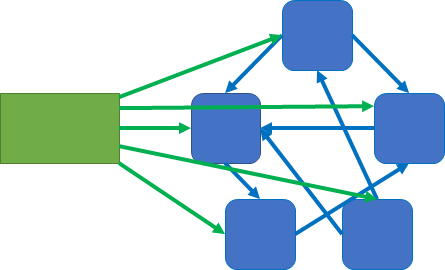
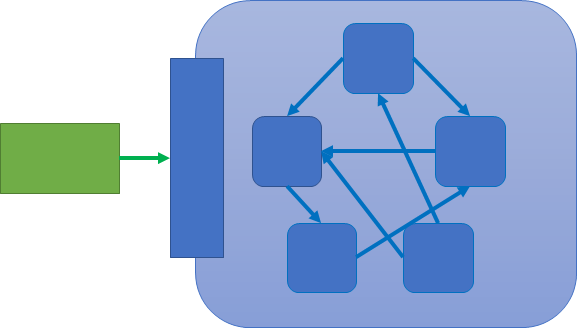
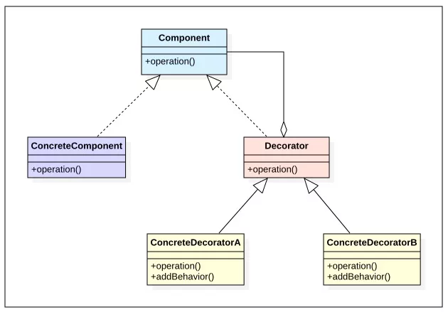
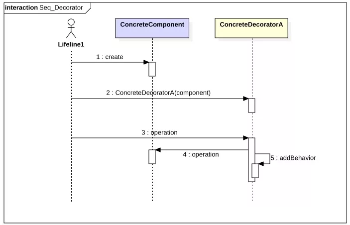
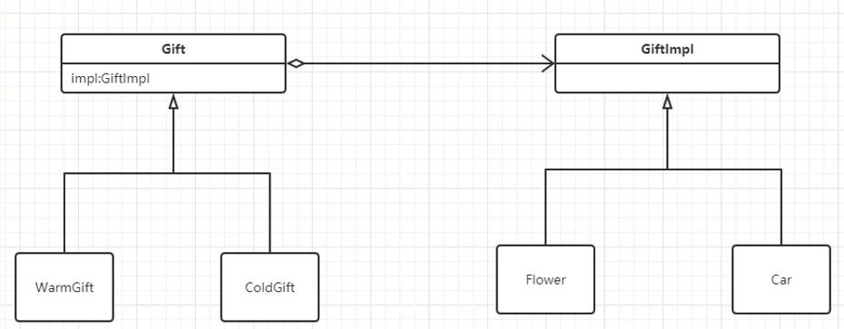

# CSE272 - Design Patterns - 结构型模式

返回[Bulletin](./bulletin.md)

返回[CSE272 - Design Patterns](./CSE272.md)

[TOC]

## 结构型模式

用于描述如何将类戒对象按某种布局组成更大的结构。

## 代理模式 Proxy

代理模式（Proxy Pattern）属于结构型模式。当我们需要隐藏某个类中的具体实现、或者扩展某个类的功能时，在不直接引用目标对象的情况下，在客户端和目标对象之间增加一个代理对象，具有现有对象功能以便向外界提供功能接口，起到一个中介作用和保护目标对象的作用，这就是代理模式。

代理模式包含如下角色：

- Subject: 抽象主题角色
- Proxy: 代理主题角色
- RealSubject: 真实主题角色

**优点**

代理可以协调调用方与被调用方，降低了系统的耦合度。根据代理类型和场景的不同，可以起到控制安全性、减小系统开销等作用。

**缺点**

增加了一层代理处理，增加了系统的复杂度，同时可能会降低系统的相应速度。

| 代理方式       | 使用灵活性               | 是否单独引入外部jar包              | 代理类生成时间 |
| -------------- | ------------------------ | ---------------------------------- | -------------- |
| 静态代理       | 最低  经常需要重写       | 否                                 | 编译时         |
| 动态代理 JDK   | 中等  一定要继承一个接口 | 否，通过java.lang.reflection.Proxy | 运行时         |
| 动态代理 CGLIB | 最强  无需接口，用继承   | 是，CGLIB相关jar包                 | 运行时         |

### 静态代理

**静态代理**是在编译时，创建委托类实例，代理类和委托类实现同一接口、引用同名方法。

外部类调用委托类某个方法时，直接以接口指向代理类的实例，这正是代理的意义所在：屏蔽。

软件设计中所指的代理一般是指静态代理，也就是在代码中显式指定的代理。

**缺点**

因为代理对象需要与目标对象实现一样的接口，所以会有很多代理类被创建，类太多。

同时，一旦接口增加斱法，目标对象不代理对象都要维护，增加维护成本。

```java
interface Products {
    void sale();
}
class FundProduct implements Products {
    public void sale() {
        System.out.println("You can buy it!");
    }
}
//继承
class FundProductNoProxy extends FundProduct {
    @Override
    public void sale() {
        //前置逻辑
        System.out.println(this.toString() + " before sale()");
        super.sale();
        //后置逻辑
        System.out.println(this.toString() + " after sale()");
    }
    public static void main (String args[]) {
        Products p = new FundProductNoProxy();
        p.sale();
    }
}
//com.github.ltprc.proxy.FundProductNoProxy@762efe5d  before sale()  You can buy  it! //com.github.ltprc.proxy.FundProductNoProxy@762efe5d  after sale()  
//静态代理
class FundProductProxy implements Products{
    Products product;
    public FundProductProxy (FundProduct product) {
        this.product = product;
    }
    public void sale() {
        //前置逻辑
        System.out.println(product.toString() + " before sale()");
        product.sale();
        //后置逻辑
        System.out.println(product.toString() + " after sale()");
    }
    public static void main (String args[]) {
        Products p = new FundProductProxy(new FundProduct());
        p.sale();
    }
}
//com.github.ltprc.proxy.FundProduct@762efe5d  before sale()  You can buy  it!  //com.github.ltprc.proxy.FundProduct@762efe5d  after sale()  
```

### 动态代理

代理类的代码不是在编译时生成，而是在运行时通过Java反射生成代理类对象，直接通过字节码定义类的属性和方法，是基于**接口**的代理。

动态代理比静态代理灵活很多，非常容易指定被代理类一共有哪些代理，以及它们的排序。当需要进行代理上的改动时，不需要关联被代理类的类型，不用修改原来的代码，就可以通过修改代理类切入新的逻辑，所以没有必要使用装饰器结构。

#### 基于JDK Proxy

通过实现InvocationHandler接口创建自己的调用处理器。

通过JDK 1.8中java.lang.reflect提供的工具方法Proxy.newProxyInstance动态构建全新的代理类。代理类继承Proxy类，持有引用字节码文件，并返回实例化对象。

此方法会调用到Proxy.getProxyConstructor, 会通过proxyCache代理缓存池校验代理是不是已经生成过了，如果没有就调用new ProxyBuilder()生成新的代理类。其中会调用Proxy.defineProxyClass()生成类对象，调用ProxyGenerator.generateProxyClass(), ProxyGenerator.generateClassFIle().

```java
import java.lang.reflect.InvocationHandler;
import java.lang.reflect.Method;
import java.lang.reflect.Proxy;

public class FundProductProxyReflect implements InvocationHandler {
    FundProduct fundProduct;
    public FundProductProxyReflect(FundProduct fundProduct) {
        this. fundProduct = fundProduct;
    }
    public Object invoke(
        Object proxy, //不是被代理对象，而是this, 生成的代理对象
        Method method, //调用方法
        Object[] args //方法参数
        ) throws Throwable {
        //前置逻辑
        System.out.println(fundProduct.toString() + " before sale()");
        Object o = method.invoke(fundProduct, args);
        //后置逻辑
        System.out.println(fundProduct.toString() + " after sale()");
        return o;
    }
    public static void main (String[] args) {
        FundProduct fundProduct = new FundProduct();
        Products product = (Products) Proxy.newProxyInstance (
                //参数1 使用哪个ClassLoader把被代理对象返回到内存
                //和被代理对象的ClassLoader保持一致就好
                //也可以是父类加载器，但不可以是平行的
                FundProduct.class.getClassLoader(),
                //参数2被代理对象应该实现哪些接口
//等价于tank.class.getInterfaces()
                new Class[]{Products.class}, 
                //参数3 InvocationHandler处理被调用的方法，参数为被代理对象
                new FundProductProxyReflect(fundProduct));
        //看起来调用的是被代理对象的sale()方法
        //实际上执行的是InvocationHandler的invoke()方法
        product.sale();
    }
}
//com.github.ltprc.proxy.FundProduct@59690aa4  before sale()  You can buy  it!  //com.github.ltprc.proxy.FundProduct@59690aa4  after sale()  
```

#### ASM类库

反射只能读，不能改。用了ASM以后，在运行的时候可以直接改变类的属性和方法，动态添加、动态删除，Java才可以称为动态语言。

ASM类库是应用最广泛的二进制字节码操作类库。大小非常小，50K左右。

#### 基于CGlib

CGlib(Code Generator LIbrary)采用非常底层的ASM字节码技术，需要引入CGlib相关Jar包。可以为一个类创建子类，并在子类的中采用方法拦截技术，拦截所有父类方法的调用并顺势织入横切逻辑。

CGLIB基于**继承**被代理类生成代理子类实现动态代理，不用实现接口。被代理类不能是final类。

```java
import java.lang.reflect.Method;

import org.springframework.cglib.proxy.Enhancer;
import org.springframework.cglib.proxy.MethodInterceptor;
import org.springframework.cglib.proxy.MethodProxy;

public class FundProductProxyCglib implements MethodInterceptor {
    public Object intercept(
            Object o,
            Method method,
            Object[] objects,
            MethodProxy methodProxy) throws Throwable {
        //前置逻辑
        System.out.println(this.toString() + " before sale()");
        Object result = null;
        result = methodProxy.invokeSuper(o, objects);
        //后置逻辑
        System.out.println(this.toString() + " after sale()");
        return result;
    }
    public static void main (String[] args) {
        //增强器 Enhancer
        Enhancer enhancer = new Enhancer();
        //动态代理类是Tank类的子类
        enhancer.setSuperclass(FundProduct.class);
        //方法拦截器 TimeMethodInterceptor 相当于InvocationHandler
        enhancer.setCallback(new FundProductProxyCglib());
        FundProduct fundProduct = (FundProduct) enhancer.create();
        fundProduct.sale();
    }
}
//com.github.ltprc.proxy.FundProductProxyCglib@1ed4004b  before sale()  You can buy  it!  //com.github.ltprc.proxy.FundProductProxyCglib@1ed4004b  after sale()  
```

#### 基于Aspectj

修改目标类的字节，织入代理的字节，在程序编译的时候插入动态代理的字节码，不会生成全新的Class.

#### 基于Instrument

修改目标类的字节码、类装载的时候基于javaagent动态拦截去插入动态代理的字节码，不会生成全新的Class.

## 门面/外观模式 Facade



将大量的内部复杂逻辑全部封装到一个类里，由这一个类来管理这些逻辑，对外提供一个统一的接口，用来访问子系统中的一群接口，从而降低调用者使用方法的难度，让子系统更容易使用。



## 装饰器模式 Decorator

装饰器模式（Decorator Pattern）允许向一个现有的对象添加新的功能，同时又不改变其结构。这种类型的设计模式属于结构型模式，它是作为现有的类的一个包装。

- 不改变原类文件。
- 不使用继承。
- 动态扩展。

适合需要（通过配置，如：diamond）来动态增减对象功能的场景，以及适合一个对象需要N种功能排列组合的场景（如果用继承，会使子类数量爆炸式增长）。Java.io包的设计模式就是装饰器模式。

装饰模式包含如下角色：

- Component：抽象构件
- ConcreteComponent：具体构件
- Decorator：抽象装饰类
- ConcreteDecorator：具体装饰类





## 3、组合模式 Composite

组合模式（Composite Pattern），又叫部分整体模式，是用于把一组相似的对象当作一个单一的对象。组合模式依据树形结构来组合对象，用来表示部分以及整体层次。这种类型的设计模式属于结构型模式，它创建了对象组的**树形结构**。

这种模式创建了一个包含自己对象组的类。该类提供了修改相同对象组的方式。

## 享元模式 Flyweight

享元即共享元数据，重复利用对象，减少创建对象的数量，以减少内存占用和提高性能。这种类型的设计模式属于结构型模式，它提供了减少对象数量从而改善应用所需的对象结构的方式。

JDK 中 String 池、Integer 池以及 Long 池都是很好的使用了享元模式的例子。

## 适配器/包装器/转换器模式 Adapter/Wrapper

例子：

- 电压转换头

- java.io

```java
FileInputStream fis = new FileInputStream("c:/test.text");
InputStreamReader isr = new InputStreamReader(fis); //字节流转换为字符流
BufferedReader br = new BufferedReader(isr);
String line = br.readLine();
while (line != null && !line.equals("")) {
    System.out.println(line);
}
br.close();
```

- JDBC-ODBC Bridge（不是桥接模式）

Java只能访问JDBC, 而访问微软SQL Server必须要使用ODBC. 中间需要的就是JDBC-ODBC Bridge进行两者的接口转换。

- ASM transformer

以下反例Adapter仅仅用来在编程时方便使用有大量需要重写的方法的Listener类，使用时只写业务关心的方法即可，它本身并不是Adapter:

- WindowAdapter 监听窗口的接口

- KeyAdapter 监听键盘的接口

## 桥接模式 Bridge

双维度扩展，使用场景不多。

分离抽象与具体，使两者分开发展，然后用聚合方式（桥）连接抽象与具体。

比如有一个类可以继承自多个类，且这些类型可能由于已经实现了一些方法从而导致不能改成接口。此时就可以使用桥接模式，用**聚合**代替**继承**。

 

## MVC模式

MVC 模式代表 Model-View-Controller（模型-视图-控制器） 模式。这种模式用于应用程序的分层开发。

### Model 模型

模型代表一个存取数据的对象或 JAVA POJO。它也可以带有逻辑，在数据变化时更新控制器。

### View 视图

视图代表模型包含的数据的可视化。

### Controller 控制器

控制器作用于模型和视图上。它控制数据流向模型对象，并在数据变化时更新视图。它使视图与模型分离开。