# CSE272 - Design Patterns - 行为型模式

返回[Bulletin](./bulletin.md)

返回[CSE272 - Design Patterns](./CSE272.md)

[TOC]

## 行为型模式

用于描述类戒对象之间怎样相互协作共同完成单个对象都无法单独完成的任务，以及怎样分配职责。

## 策略模式 Strategy

在策略模式（Strategy Pattern）中，一个类的行为或其算法可以在运行时根据不同策略进行更改。这种类型的设计模式属于行为型模式。策略模式定义、封装了一系列的算法，并且使它们可相互替换。

策略模式结构：

- Context: 环境类
- Strategy: 抽象策略类
- ConcreteStrategy: 具体策略类

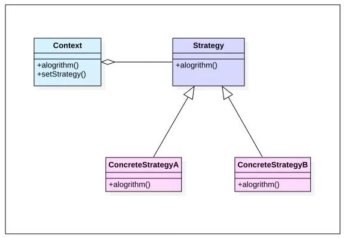

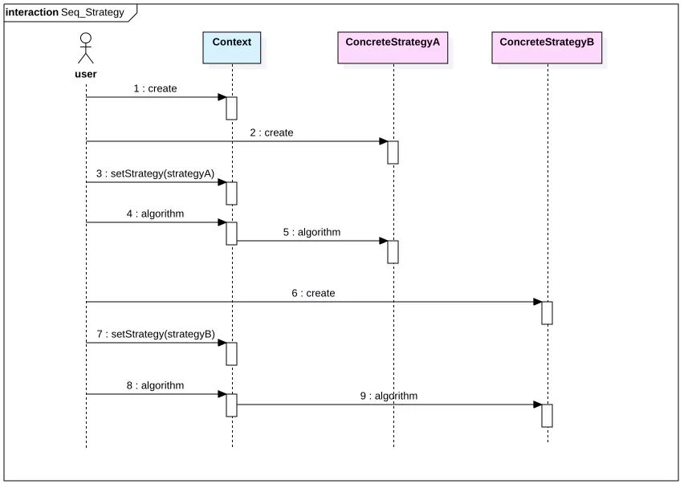

**优点**

策略模式提供了对“开闭原则”的完美支持，用户可以在不修改原有系统的基础上选择算法或行为。干掉复杂难看的if-else。

**缺点**

调用时，必须提前知道都有哪些策略模式类，才能自行决定当前场景该使用何种策略。

**实现**

```java
//排序类
public class Sorter<T> {
    public void sort(T[] arr, Comparator<T> comparator) { //可以调用任何实现Comparator接口的子类
        for(int i=0; i<arr.length - 1; i++) {
            int minPos = i;
            for(int j=i+1; j<arr.length; j++) {
                minPos = comparator.compare(arr[j],arr[minPos])==-1 ? j : minPos; //用不同子类排序的方法
            }
            swap(arr, i, minPos);
        }
    }
    void swap(T[] arr, int i, int j) {
        T temp = arr[i];
        arr[i] = arr[j];
        arr[j] = temp;
    }
}
//比较器示例之一
public class DogComparator implements Comparator<Dog> {
    @Override
    public int compare(Dog o1, Dog o2) {
        if(o1.food < o2.food) return -1;
        else if (o1.food > o2.food) return 1;
        else return 0;
    }
}
```

### 调停者/中介者模式 Mediator

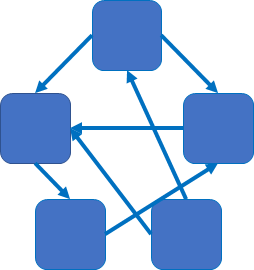

在内部的多个类之间逻辑交错的情况下，调停者可以作为唯一和其他类进行通信的类，减少这些类之间的通信复杂性。

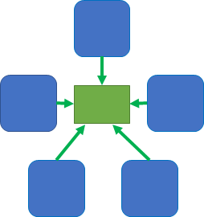

在实际场景中有一个鼎鼎大名的应用，**消息中间件**，可以对系统进行**解耦**。

## 责任链模式 Chain of Responsibility

**责任链模式**（Chain of Responsibility Pattern）为请求创建了一个接收者对象的**链**，将一个请求从链的首端发出，沿着链的路径依次传递每个节点对象，直到有对象处理这个请求为止。这种类型的设计模式属于行为型模式。用于Spring MVC拦截器、Servlet拦截器等。

**用途**

- 当一个请求需要根据请求参数的不同由不同对象来处理时候。
- 当一个请求需要固定对象顺序处理，并且可扩展性的在固定顺序里面插入新的对象进行处理时候。

**特点**

- 降低了对象之间的耦合度。该模式使得一个对象无须知道到底是哪一个对象处理其请求以及链的结构，避免无止境的if-else语句使用。
- 增强了系统的可扩展性。可以根据需要增加新的请求处理类。
- 增强了给对象指派职责的灵活性。可以动态地改变链内成员、调动次序、增删责任等。
- 对比较长的职责链，请求的处理可能涉及多个处理对象，系统性能将受到一定影响。

 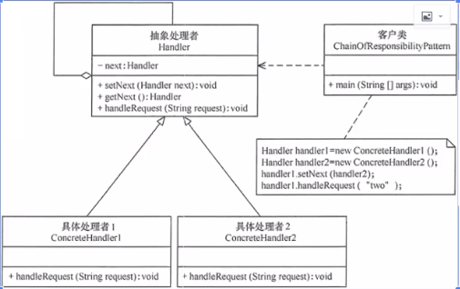

 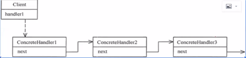

 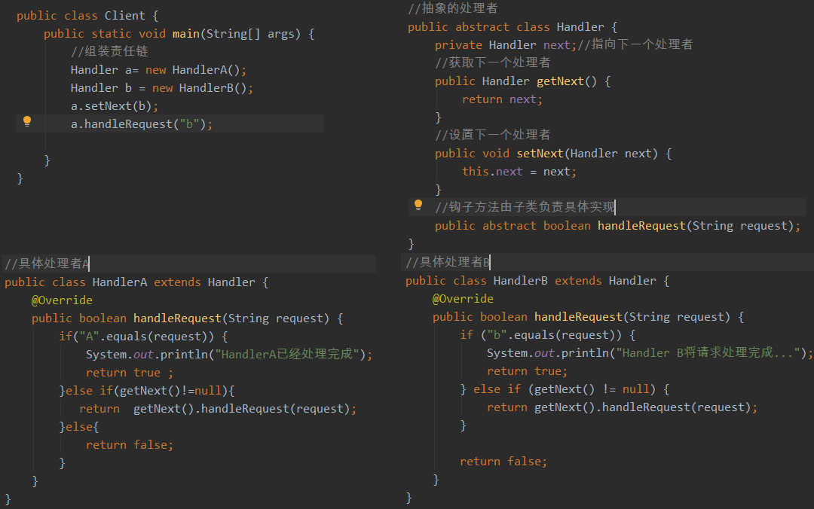

## 观察者模式 Observer

观察者模式（又被称为发布-订阅（Publish/Subscribe）模式，属于行为型模式的一种，它定义了一种“一对多”的依赖关系，让多个观察者对象同时监听某一个主题对象。这个主题对象在状态变化时，会通知所有的观察者对象，使他们能够自动更新自己。

适用于一对多的的业务场景，一个对象发生变更，会触发N个对象做相应处理的场景。例如：游戏开发、Spring框架的ApplicationListerner和ApplicationContext等。

观察者模式包含如下角色：

- Subject：抽象主题（抽象被观察者），抽象主题角色把所有观察者对象保存在一个集合里，每个主题都可以有任意数量的观察者，抽象主题提供一个接口，可以增加和删除观察者对象。
- ConcreteSubject：具体主题（具体被观察者），该角色将有关状态存入具体观察者对象，在具体主题的内部状态发生改变时，给所有注册过的观察者发送通知。
- Observer：抽象观察者，是观察者的抽象类，它定义了一个更新接口，使得在得到主题更改通知时更新自己。
- ConcrereObserver：具体观察者，实现抽象观察者定义的更新接口，以便在得到主题更改通知时更新自身的状态。

 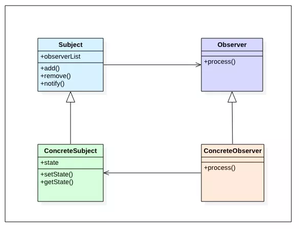

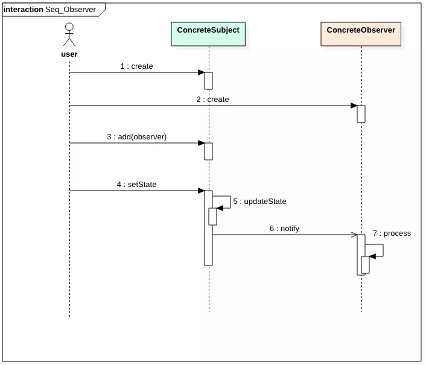

**优点**

将复杂的串行处理逻辑变为单元化的独立处理逻辑，被观察者只是按照自己的逻辑发出消息，不用关心谁来消费消息，每个观察者只处理自己关心的内容。逻辑相互隔离带来简单清爽的代码结构。

**缺点**

观察者较多时，可能会花费一定的开销来发消息，但这个消息可能仅一个观察者消费。

**实现**

```java
public class ObserverPattern {
    public static void main(String[] args) {
        Subject subject = new ConcreteSubject();
        Observer obsA = new ConcreteObserverA();
        Observer obsb = new ConcreteObserverB();
        subject.add(obsA);
        subject.add(obsB);
        subject.setState(0);
    }
}
//抽象目标
abstract class Subject {
    protected List<Observer> observerList = new ArrayList<Observer>();   
    //增加观察者方法
    public void add(Observer observer) {
        observers.add(observer);
    }    
    //删除观察者方法
    public void remove(Observer observer) {
        observers.remove(observer);
    }   
    public abstract void notify(); //通知观察者方法
}
//具体目标
class ConcreteSubject extends Subject {
   private Integer state;
   public void setState(Integer state) {
        this.state = state;
        // 状态改变通知观察者
        notify();
    }
    public void notify() {
        System.out.println("具体目标状态发生改变...");
        System.out.println("--------------");       
        for(Observer obs:observers) {
            obs.process();
        }
    }          
}
//抽象观察者
interface Observer {
    void process(); //具体的处理
}
//具体观察者A
class ConcreteObserverA implements Observer {
    public void process() {
        System.out.println("具体观察者A处理！");
    }
}
//具体观察者B
class ConcreteObserverB implements Observer {
    public void process() {
        System.out.println("具体观察者B处理！");
    }
}
```

## 迭代器模式 Iterator

迭代器（Iterator）是一种设计模式，它是一个对象，它可以**遍历**并选择序列中的对象，而开发人员不需要了解该序列的底层结构。迭代器通常被称为“轻量级”对象，因为创建它的代价小。

Java中的Iterator功能比较简单，并且只能单向移动：

- 使用方法iterator()要求容器返回一个Iterator。第一次调用Iterator的next()方法时，它返回序列的第一个元素。注意：iterator()方法是java.lang.Iterable接口,被Collection继承。
- 使用next()获得序列中的下一个元素。
- 使用hasNext()检查序列中是否还有元素。
- 使用remove()将迭代器新返回的元素删除。

```java
interface Iterator {
    boolean hasNext();
    Object next();
    void remove();
}
//执行
Iterator it = mySet.iterator();
while (it.hasNext()) {
    Person employee = (Person)it.next();
    System.out.println(employee);
}
```

Iterator是Java迭代器最简单的实现，为List设计的ListIterator具有更多的功能，它可以从两个方向遍历List，也可以从List中插入和删除元素。

### 迭代器支持fail-fast吗？

迭代器是采用快照风格，不支持fail-fast.

### for each

for (Object o : collection) {;}

for each是Java提供的语法糖，Java编译器会将其转化为iterator迭代器遍历。

遍历数组时，for循环效率更高。

### 删除ArrayList元素

使用foreach()方法遍历ArrayList进行删除会报错java.util.ConcurrentModificationException.

因为foreach循环遍历容器使用迭代器进行遍历时，会对修改次数modCount进行检查，不允许集合进行更改操作。

```java
public static void remove2(ArrayList<String> list) {
    for (String s : list) {
        if (s.equals("b")) {
            list.remove(s);
        }
        System.out.println(s);
    }
}
```

源码如下：

```java
final void checkForComodification() {
    if (modCount != expectedModCount)
        throw new ConcurrentModificationException();
}
```

直接迭代器遍历并删除时能够避免上述问题，这是因为：在ArrayList中，modCount是指集合的修改次数，当进行add或者delete时，modCount会+1；expectedModCount是指集合的迭代器的版本号，初始值是modCount，但是当集合进行add或者delete操作时，modCount会+1，而expectedModCount不会改变，所以方法二中会抛出异常。但是it.remove操作时，会同步expectedModCount的值，把modCount的值赋予expectedModCount。所以不会抛出异常。

```java
public static void remove3(ArrayList<String> list) {
    Iterator<String> it = list.iterator();  
    while (it.hasNext()) {  
        String s = it.next();  
        if (s.equals("b")) {  
            it.remove();  
        }  
    }  
}
```

it.remove()的源码如下：

```java
public void remove() {
    if (lastRet < 0)
        throw new IllegalStateException();
    checkForComodification();
    try {
        ArrayList.this.remove(lastRet);  // 移除元素
        cursor = lastRet;
        lastRet = -1;
        expectedModCount = modCount;    // 同步expectedModCount的值
    } catch (IndexOutOfBoundsException ex) {
        throw new ConcurrentModificationException();
    }
}
```

### 访问者模式 Visitor

【马士兵】

在**结构固定不变**的情况下，动态改变对于内部元素的动作。应用面不宽，一般使用较少。

**实现**

创建一个定义接受操作的 ComputerPart 接口，Keyboard, Mouse, Monitor, Computer 是实现了 ComputerPart 接口的实体类。

定义另一个接口 ComputerPartVisitor，它定义了访问者类的操作。Computer 使用实体访问者来执行相应的动作。

VisitorPatternDemo，我们的演示类使用 Computer、ComputerPartVisitor 类来演示访问者模式的用法。

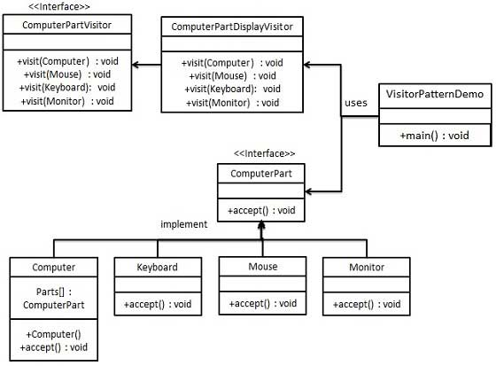

步骤 1 定义一个表示元素的接口。

```java
public interface ComputerPart {
    public void accept(ComputerPartVisitor computerPartVisitor);
}
```

步骤 2 创建扩展了上述类的实体类。

```java
public class Keyboard implements ComputerPart {
    @Override
    public void accept(ComputerPartVisitor computerPartVisitor) {
        computerPartVisitor.visit(this);
    }
}
public class Monitor implements ComputerPart {
    @Override
    public void accept(ComputerPartVisitor computerPartVisitor) {
        computerPartVisitor.visit(this);
    }
}
public class Mouse implements ComputerPart {
    @Override
    public void accept(ComputerPartVisitor computerPartVisitor) {
        computerPartVisitor.visit(this);
    }
}
public class Computer implements ComputerPart {
    ComputerPart[] parts;
    public Computer() {
        parts = new ComputerPart[] {new Mouse(), new Keyboard(), new Monitor()};   
    } 
    @Override
    public void accept(ComputerPartVisitor computerPartVisitor) {
        for (int i = 0; i < parts.length; i++) {
            parts[i].accept(computerPartVisitor);
        }
        computerPartVisitor.visit(this);
    }
}
```

步骤 3 定义一个表示访问者的接口。

```java
public interface ComputerPartVisitor {
    public void visit(Computer computer);
    public void visit(Mouse mouse);
    public void visit(Keyboard keyboard);
    public void visit(Monitor monitor);
}
```

步骤 4 创建实现了上述类的实体访问者。

```java
public class ComputerPartDisplayVisitor implements ComputerPartVisitor {
    @Override
    public void visit(Computer computer) {
        System.out.println("Displaying Computer.");
    } 
    @Override
    public void visit(Mouse mouse) {
        System.out.println("Displaying Mouse.");
    } 
    @Override
    public void visit(Keyboard keyboard) {
        System.out.println("Displaying Keyboard.");
    } 
    @Override
    public void visit(Monitor monitor) {
        System.out.println("Displaying Monitor.");
    }
}
```

步骤 5 使用 ComputerPartDisplayVisitor 来显示 Computer 的组成部分。

```java
public class VisitorPatternDemo {
    public static void main(String[] args) {
        ComputerPart computer = new Computer();
        computer.accept(new ComputerPartDisplayVisitor());
    }
}
```

步骤 6 执行程序，输出结果：

```java
//Displaying Mouse.
//Displaying Keyboard.
//Displaying Monitor.
//Displaying Computer.
```

##  命令/动作/事务模式 Command/Action/Transaction

命令模式用来封装命令。

```java
//命令抽象类，封装了执行和撤销两种方法
public abstract class Command {
    public abstract void doit(); //亦可命名为exec, run等
    public abstract void undo();
}
//用来操作的内容类
public class Content {
    String msg = "hello everybody ";
}
//插入命令类
public class InsertCommand extends Command {
    Content c;
    String strToInsert = "http://www.mashibing.com";
    public InsertCommand(Content c) {
        this.c = c;
    }
    @Override
    public void doit() {
        c.msg = c.msg + strToInsert;
    }
    @Override
    public void undo() {
        c.msg = c.msg.substring(0, c.msg.length()-strToInsert.length());
    }
}
//复制命令类
public class CopyCommand extends Command {
    Content c;
    public CopyCommand(Content c) {
        this.c = c;
    }
    @Override
    public void doit() {
        c.msg = c.msg + c.msg;
    }
    @Override
    public void undo() {
        c.msg = c.msg.substring(0, c.msg.length()/2);
    }
}
//删除命令类
public class DeleteCommand extends Command {
    Content c;
    String deleted;
    public DeleteCommand(Content c) {
        this.c = c;
    }
    @Override
    public void doit() {
        deleted = c.msg.substring(0, 5); //需要记录删除部分，以备还原之需
        c.msg = c.msg.substring(5, c.msg.length());
    }
    @Override
    public void undo() {
        c.msg = deleted + c.msg;
    }
}
```

### 实现多次undo

```java
Content c = new Content();
Command insertCommand = new InsertCommand(c);
insertCommand.doit();
insertCommand.undo();
Command copyCommand = new CopyCommand(c);
insertCommand.doit();
insertCommand.undo();
Command deleteCommand = new DeleteCommand(c);
deleteCommand.doit();
deleteCommand.undo();
List<Command> commands = new ArrayList<>(); //使用**责任链模式**连续执行命令
commands.add(new InsertCommand(c));
commands.add(new CopyCommand(c));
commands.add(new DeleteCommand(c));
for(Command comm : commands) {
    comm.doit();
}
System.out.println(c.msg);
for(int i= commands.size()-1; i>=0; i--) {
    commands.get(i).undo();
}
System.out.println(c.msg);
```

### 实现宏命令

宏命令是树状结构，由很多宏命令组成，可以结合**组合**模式实现。

## 备忘录模式 Memento

备忘录模式（Memento Pattern）保存一个对象的某个状态，包括记录快照（瞬时状态）、存盘等，以便在适当的时候恢复对象。备忘录模式属于行为型模式。

例如：序列化、反序列化。

## 模板方法模式 Template Method

模板方法就是钩子函数。

定义一个操作中的算法的框架，而将一些步骤延迟到子类中，使得子类可以不改变一个算法的结构即可重定义该算法的某些特定步骤。

通俗的讲，就是将子类相同的方法，都放到其抽象父类中。类图如下：

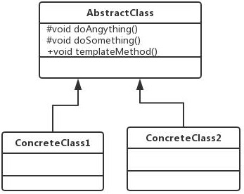

AbstractClass叫**抽象模板**，它的方法分为以下两类：

- **基本方法**，也叫做基本操作，是由子类实现的方法，并且在模板方法被调用。
- **模板方法**，可以有一个或几个，一般是一个具体方法，也就是一个框架，实现对基本方法的调度，完成固定逻辑，一般模板方法都加上final关键字，不允许被覆写，以防止恶意的操作。

ConcreteClass1和ConcreteClass2叫做**具体模板**,实现父类所定义的一个或多个抽象方法,也就是父类定义的基本方法在子类中得以实现。

 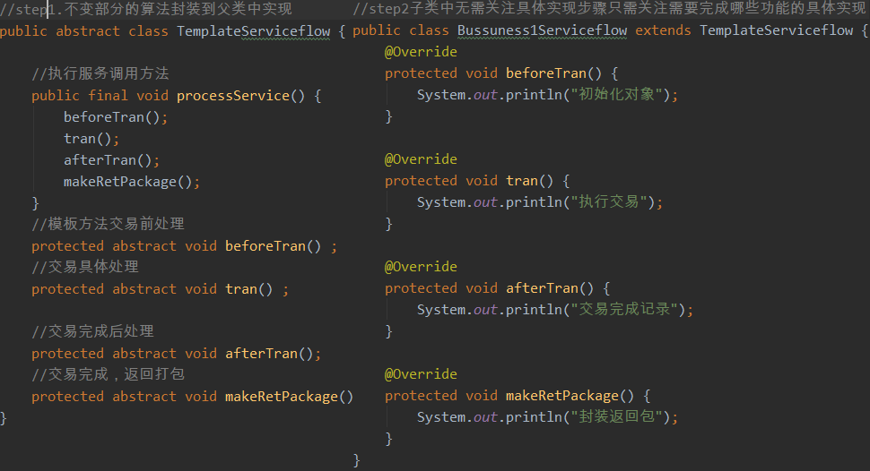

## 状态模式 State

根据状态，决定行为。允许对象在内部状态改变时改变它的行为，对象看起来好像修改了它的类。

Java线程状态的切换是状态模式的一种实践。

## 解释器模式 Interpreter

用于解释脚本语言，例如正则表达式解析器。

使用频率很低，编写过于复杂。