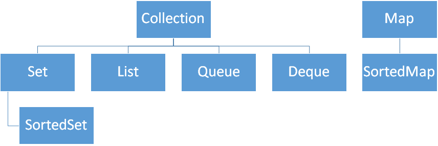
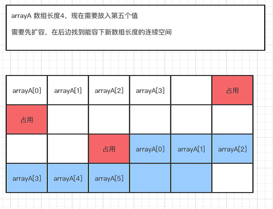
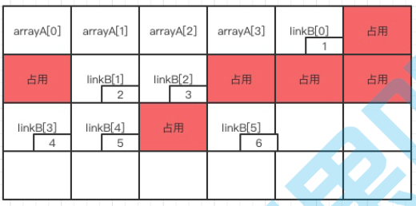
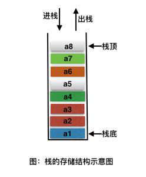
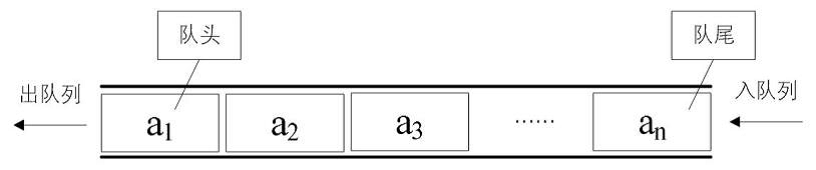
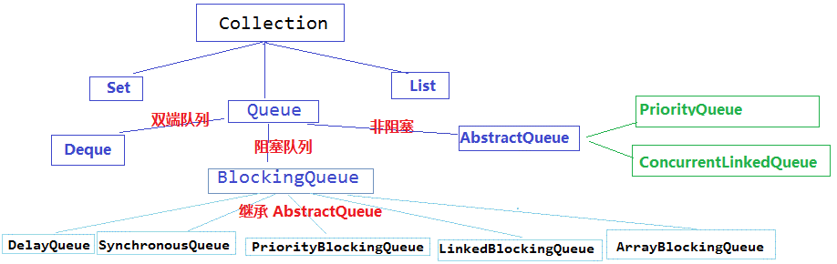

# CSE274 - Data Structure and Algorithms - 集合

返回[Bulletin](./bulletin.md)

返回[CSE272 - Design Patterns](./CSE272.md)

[TOC]

## Collection

Collection是一个集合接口，存放于Java.util包中，主要有3种：Set(集)、List(列表)和Queue(队列)。



集合类公共方法如下：

- add()，添加一个元素
- addAll()，添加一组元素
- clear()，清空
- remove()，移除一个
- removeAll()，移除一组
- size()，元素个数
- isEmpty()，判断是否为空
- iterator()，迭代

### List接口

List类似于数组，可以通过索引来访问元素，实现该接口的常用类有ArrayList、LinkedList、Vector、Stack等。

对于需要快速在头部插入、删除元素，应该使用LinkedList。

对于需要快速随机访问元素，应该使用ArrayList。

如果List需要被多线程操作，应该使用Vector。

#### List集合的特有的方法

凡是可以操作角标的方法都是该体系特有的方法

- add(index,element)
- addAll(index,collection)
- remove(index)
- set(index,element)
- get(index)
- subList(from,to)
- listIterator()

#### ArrayList

ArrayList是动态数组。在插入元素的时候，ArrayList都会检查当前的数组大小是否足够，如果不够，将会扩容到当前容量 * 1.5 + 1（加1是为了当前容量为1时，也能扩展到2）。

JDK 1.8之后，变为当前容量 * 1.5.

数组的缺点是每个元素之间不能有间隔，当数组大小不满足时，就需要把原来的元素全部复制到一个1.5倍大小的新数组，将旧的数组抛弃掉(等待垃圾回收)，这个操作是比较耗时。



ArrayList是非线程安全的，即它没有同步，不过，可以通过Collections.synchronizedList()静态方法返回一个同步的实例，例如：

```java
List synList = Collections.synchronizedList(list);
```

##### 插入海量数据的优化

理论上定义了初始长度的ArrayList在插入长度数量的元素时更快，因为ArrayList的底层是数组实现并且数组的默认值是10，如果插入10000条要不断的扩容，耗费时间。所以我们调用ArrayList的指定容量的构造器方法ArrayList(int size) 就可以实现不扩容,就提高了性能。例如ArrayList list = new ArrayList(100); 这样，在插入小于100个元素的时候都是不需要进行扩容的，能够带来性能的提升。当然，如果对这个容量估计大了，可能会带来一些空间的损耗。

#### LinkedList

LinkedList也实现了List接口，其内部实现是使用双向链表来保存元素，因此插入与删除元素的性能都表现不错。它还提供了一些其它操作方法，如在头部、尾部插入或者删除元素，因此，可以用它来实现栈、队列、双向队列。

与ArrayList一样，LinkedList也是非同步的，如果需要实现多线程访问，则需要自己在外部实现同步方法。当然也可以使用Collections.synchronizedList()静态方法，例如List synList = Collections.synchronizedList(list);



- 不需要连续空间

- 大小不定，扩展性强

#### ArrayList VS LinkedList

##### 时间复杂度

ArrayList善于查找，LinkedList善于增删。

| 操作     | ArrayList | LinkedList |
| -------- | --------- | ---------- |
| 随机访问 | **O(1)**  | O(N)       |
| 头部插入 | O(N)      | **O(1)**   |
| 头部删除 | O(N)      | **O(1)**   |
| 尾部插入 | O(1)      | O(1)       |
| 尾部删除 | O(1)      | O(1)       |

遍历操作时间复杂度都是O(N)，但是ArrayList比LinkedList更快，因为ArrayList的连续内存会有一部分或者全部数据一起进入到CPU缓存，而LinkedList还需要再去内存中根据上下标查找；CPU缓存比内存快太多。

##### 应用

**ArrayList**

有序数组、无序数组、多维数组、矩阵等。

**LinkedList**

单链表、双向链表、循环链表、双向循环链表、栈、队列、双向队列等。

#### Vector

Vector是ArrayList的线程同步版本，即是说Vector是同步的，支持多线程访问，因此访问它比访问ArrayList 慢。

除此之外，ArrayList是当前容量 * 1.5 + 1，而Vector默认**扩展一倍**容量。

#### Stack

Stack是一种后进先出的数据结构，继承自Vector类，其各种操作也是基于Vector的各种操作，因此其内部实现也是动态数组，先进后出。提供了push、pop、peek（获得栈顶元素）等方法。Stack是线程安全的。



##### Stack的Java实现方式

```java
/**
 * 内部链式存储机制
 * 2018/6/3
 * StoneFu
 */
public class LinkedStack<T> {
    //内部节点类
    private static class Node<U>{
        U item;
        Node<U> next;
        Node(){
            item=null;
            next=null;
        }
        Node(U item,Node<U> next){
            this.item=item;
            this.next=next;
        }
        boolean end(){
            return item==null&& next==null;
        }
}
    //顶点哨兵
    private Node<T> top=new Node<T>();
    //入栈
    public void push(T item){
        top=new Node<>(item,top);
    }
    //出栈
    public T pop(){
        T result=top.item;
        if(!top.end()){
            top=top.next;
        }
        return result;
    }
}
```

#### 数组转换为List

使用Arrays.asList(array)进行转换。

- 不能转换基本类型数组，因为int可以装箱为Integer, 但是int[]不可以装箱为Integer[].
  - 可以使用Arrays.stream或者传入Integer[].

- 结果不支持增删操作，因为结果的ArrayList类型不是java.util.ArrayList, 而是Arrays的内部类。
  - 可以在结果外部new一个ArrayList.

- 结果随着原始数组变化而变化，因为结果是直接使用的原始数组。
  - 可以在结果外部new一个ArrayList.

#### List转换为数组

使用List自带的toArray()方法。

### Set接口

Set是不能包含重合元素的容器，对象的相等性本质是对象hashCode 值（java 是依据对象的内存地址计算出的此序号）判断的，如果想要让两个不同的对象视为相等的，就必须覆盖Object的hashCode方法和equals方法。

其实现类有HashSet，继承于它的接口有SortedSet接口等。Set中提供了加、减、和交等集合操作函数。Set不能按照索引随机访问元素，这是它与List的一个重要区别。

Set集合的功能和Collection是一致的，全部是公用方法。

#### 求交集

set1.retainAll(set2);

#### 求并集

set1.addAll(set2);

#### 求差集

set1.removeAll(set2);

#### HashSet

HashSet实现了Set接口，基于HashMap实现。

哈希值相同、equals为false的元素，在同样的哈希值对应的位置下下顺延（可以认为哈希值相同的元素放在一个哈希桶中）存成一列，即一个hashCode 位置上可以存放多个元素。

HashSet存储元素的顺序并不是按照存入时的顺序（和List显然不同） 而是按照哈希值来存的所以取数据也是按照哈希值取得。HashSet是非线程安全的。

#### TreeSet

TreeSet存储的元素是按顺序存储的，Integer和String对象都可以进行默认的TreeSet排序，而自定义类的对象是不可以的，自己定义的类需要实现Comparable接口并且覆写相应的compareTo()函数。

TreeSet也是非线程安全的，底层结构为红黑树。

#### LinkedHashSet

LinkedHashSet继承自HashSet，它与HashSet不同的是，LinkedHashSet存储元素的顺序是按照元素的插入顺序存储的。

LinkedHashSet的遍历速度只和实际数据有关，和容量无关，而HashSet的遍历速度和他的容量有关。

LinkedHashSet也是非线程安全的。

### Queue接口

Queue是一个先入先出（FIFO）的数据结构。



Queue接口与List、Set同一级别，都是继承了Collection接口。LinkedList实现了Deque接 口。



#### 添加一个元素

add 如果队列已满，则抛出一个IIIegaISlabEepeplian异常

offer 添加一个元素并返回true, 如果队列已满则返回false 

#### 移除并返问队列头部的元素

remove 如果队列为空，则抛出一个NoSuchElementException异常

poll 如果队列为空，则返回null 

#### 查看一个元素

element 如果队列为空，则抛出一个NoSuchElementException异常

peek 如果队列为空，则返回null

#### Queue的Java实现方式

```java
/**
 * 定义一个queue
 */
class ArrayQueue{
    private int[] data ; //队列中存放的数据
    private int maxSize ; //队列的大小
    private int front ;//指向队列头部的指针
    private int rear ; //指向队列尾部的指针

    public ArrayQueue(int maxSize){
        this.maxSize = maxSize;
        data = new int[maxSize];
        front = -1;
        rear = -1;
    }

    /**
     * 判断队列是否已满
     * @return
     */
    public boolean isFull(){
        return rear == maxSize -1 ;
    }

    /**
     * 判断队列是否为空
     * @return
     */
    public boolean isEmpty(){
        return rear == front;
    }

    /**
     * 添加数据到队列
     * @param n
     */
    public void add(int n){
        if(isFull()){
            System.out.println("队列已满，不能添加");
            return;
        }
        data[++rear] = n;
    }

    /**
     * 显示头部数据
     * @return
     */
    public void head(){
        if(isEmpty()){          
   　　　　　　throw new RuntimeException("队列为空");
        }
        System.out.println(data[front+1]);
    }

    /**
     * 取出头部数据
     * @return
     */
    public int pop(){
        if(isEmpty()){
            throw new RuntimeException("队列为空");
        }
        int a = data[++front];
        data[front] = 0;
        return a;
    }

    /**
     * 打印全部数据
     */
    public void print(){
        if(isEmpty()){
            System.out.println("队列为空");
            return;
        }
        for(int i=0;i<data.length;i++){
            System.out.printf("array["+i+"]=%d\n",data[i]);
        }
    }
}
```

## Collections

Collections是一个包装类，包含了很多静态方法，不能被实例化，就像一个工具类。

### 集合排序

```java
Collections.sort(list);
```

### 让一个集合不能被修改？

可以使用Collections.unmodifiableCollection(Collection c)方法来创建一个只读集合，这样改变集合的任何操作都会抛出Java.lang.UnsupportedOperationException异常。

```java
List<String> list = new ArrayList<>();
list.add("x");
Collection<String> clist = Collections.unmodifiableCollection(list);
clist.add("y"); // 运行时此行报错
System.out.println(list. size());
```

