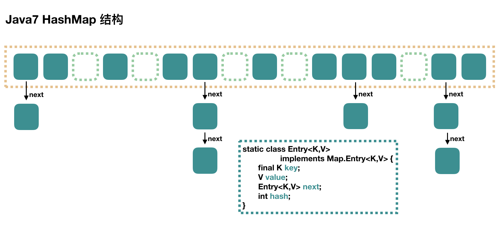
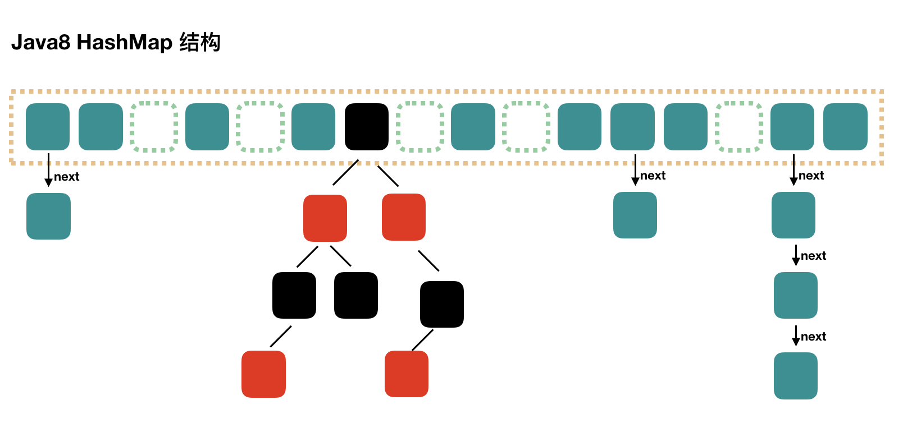

# CSE274 - Data Structure and Algorithms - 表

返回[Bulletin](./bulletin.md)

返回[CSE274 - Data Structure and Algorithms](./CSE274.md)

[TOC]

## 基本概念

### 哈希冲突

如果两个不同对象的hashCode相同，这种现象称为hash冲突。

解决方法：

#### 再散列法/开发定址法

当关键字key的哈希地址p=H（key）出现冲突时，以p为基础，产生另一个哈希地址p1，如果p1仍然冲突，再以p1为基础，产生另一个哈希地址p2，…，直到找出一个不冲突的哈希地址pi ，将相应元素存入其中。

- 线性探测再散列
- 二次探测再散列
- 伪随机探测再散列

#### 再哈希法

这种方法是同时构造多个不同的哈希函数：当哈希地址Hi=RH1（key）发生冲突时，再计算Hi=RH2（key）……，直到冲突不再产生。

不易产生聚集，但增加了计算时间。

#### 链表地址法

将所有哈希地址相同的都链接在同一个链表中 ，因而查找、插入和删除主要在同义词链中进行。

链表地址法适用于经常进行插入和删除的情况。

java中HashMap采用的是**链表地址法**。桶位置相同时，两个Map.Entry存在同一个链表上。

#### 建立一个公共溢出区

将哈希表分为基本表和溢出表两部分，凡是和基本表发生冲突的元素，一律填入溢出表。

- 开放散列（open hashing）：键值对存在相对的位置，比如哈希表的链表的某一位上。
- 封闭散列（closed hashing）：键值对存在绝对的位置，比如直接存在哈希表上。

## Map接口

Map集合提供了按照“键值对”存储元素的方法，一个键唯一映射一个值。集合中“键值对”整体作为一个实体元素时，类似List集合，但是如果分开来年，Map是一个两列元素的集合：键是一列，值是一列。与Set集合一样，Map也没有提供随机访问的能力，只能通过键来访问对应的值。

Map的每一个元素都是一个Map.Entry，这个实体的结构是<Key, Value>样式。

### HashMap

#### JDK8以前

HashMap用数组（位桶）保存链表的头节点。

通过计算key的hashCode，再与数组长度进行求余运算得到数组下标(链表头节点)。



当加入N个数据时，扩容次数可以估算为log2N（1,2,4,…,N/4,N/2）. 扩容后桶的大小翻倍，所有数据计算哈希值重新取模、重新决定位置。使用和自动扩容的总体时间复杂度为O(1).

#### JDK8以后

内部结构从位桶+链表变成了位桶+链表/红黑树的方式，也是非线程安全的。当某个位桶的链表的长度达到某个阀值（8个）的时候， HashMap会动态的使用一个专门的TreeMap实现来替换掉它。这样做的结果会更好，是O(log(n))，而不是糟糕的O(n)。

##### 为什么HashMap红黑树退化成链表的阈值是8？

链表查找的时间复杂度平均是O(N/2)，红黑树查找的时间复杂度平均是O(logN)。

当N=8时时间比大约为4:3，红黑树在5至7左右优势不是十分明显（当N=6时时间比大约为3:2.585）。

##### 为什么使用红黑树而不使用AVL树?

AVL树和红黑树有几点比较和区别：

1. AVL树是更加严格的平衡，因此可以提供更快的查找速度，一般读取查找密集型任务，适用AVL树。
2. 红黑树更适合于插入修改密集型任务。
3. 通常，AVL树的旋转比红黑树的旋转更加难以平衡和调试。

扩容顺序从先扩容后增加元素，变成了先增加元素再扩容。

插入顺序从插入头部，变成了插入尾部。

 


#### 参数

##### capacity

当前数组容量，始终保持2^n，可以扩容，扩容后数组大小为当前的2倍。

##### loadFactor

负载因子，根据泊松分布，默认为0.75。

假如数组的默认长度为 10，扩展因子为 0.5，那么当数组超过 10*0.5=5 个时，HashMap 就会扩容为之前容量的两倍，即10*2=20，所以说扩展因子就是用来判定 HashMap 是否满足扩容条件的。

##### threshold

扩容的阈值，等于：
$$
capacity * loadFactor
$$

#### 构造方法

基于JDK 1.8的HashMap源码：

**无参构造方法HashMap()**

负载因子为默认值 0.75f

容量为默认初始值 16

**有一个初始容量参数的构造方法HashMap(int initialCapacity)**

参数：initialCapacity 初始容量

负载因子为默认值 0.75f

**有两个参数的构造方法HashMap(int initialCapacity, float loadFactor)**

参数：initialCapacity 初始容量

参数：loadFactor 负载因子

调用tableSizeFor方法计算出不小于initialCapacity的最小的2的幂的结果，并赋给成员变量threshold

```java
this.threshold = tableSizeFor(initialCapacity); 
```

#### hash方法

hash：计算元素 key 的散列值

##### JDK8以前

1. 处理 String 类型时，调用 stringHash32 方法获取 hash 值。
2. 处理其他类型数据时，提供一个相对于 HashMap 实例唯一不变的随机值 hashSeed 作为计算初始量。
3. 执行异或和无符号右移使 hash 值更加离散，减小哈希冲突概率。

##### JDK8以后

如果 key 为 null 返回 0，否则就将 key 的 hashCode 方法返回值高低16位异或，让尽可能多的位参与运算，让结果的 0 和 1 分布更加均匀，降低哈希冲突概率。

#### indexFor方法

indexFor：计算元素下标

将hash值和数组长度-1进行与操作，保证结果不会超过table数组范围。

#### get等方法

get：获取元素的 value 值

##### JDK8以前

1. 如果 key 为 null，调用 getForNullKey 方法，如果 size 为 0 表示链表为空，返回 null。如果 size 不为 0 说明存在链表，遍历 table[0] 链表，如果找到了 key 为 null 的节点则返回其 value，否则返回 null。
2. 如果 key 为 不为 null，调用 getEntry 方法，如果 size 为 0 表示链表为空，返回 null 值。如果 size 不为 0，首先计算 key 的 hash 值，然后遍历该链表的所有节点，如果节点的 key 和 hash 值都和要查找的元素相同则返回其 Entry 节点。
3. 如果找到了对应的 Entry 节点，调用 getValue 方法获取其 value 并返回，否则返回 null。

#### JDK8以后

1. 调用 getNode 方法获取 Node 节点，如果不是 null 就返回其 value 值，否则返回 null。
2. getNode 方法中如果数组不为空且存在元素，先比较第一个节点和要查找元素的 hash 和 key ，如果都相同则直接返回。
3. 如果第二个节点是 TreeNode 类型则调用 getTreeNode 方法进行查找，否则遍历链表根据 hash 和 key 查找，如果没有找到就返回 null。

#### 遍历HashMap

```java
//第一种：普遍使用，二次取值
System.out.println("通过Map.keySet遍历key和value：");
for (String key : map.keySet()) {
    System.out.println("key= "+ key + " and value= " + map.get(key));
}
//第二种
System.out.println("通过Map.entrySet使用iterator遍历key和value：");
Iterator<Map.Entry<String, String>> it = map.entrySet().iterator();
while (it.hasNext()) {
    Map.Entry<String, String> entry = (Map.Entry<String, String>) it.next();
    System.out.println("key= " + entry.getKey() + " and value= " + entry.getValue());
}
//第三种：推荐，尤其是容量大时
System.out.println("通过Map.entrySet遍历key和value");
for (Map.Entry<String, String> entry : map.entrySet()) {
    System.out.println("key= " + entry.getKey() + " and value= " + entry.getValue());
}
//第四种
System.out.println("通过Map.values()遍历所有的value，但不能遍历key");
for (String v : map.values()) {
    System.out.println("value= " + v);
}
```

#### put方法

put：添加元素

##### JDK8以前

1. 如果 key 为 null，直接存入底层数组的零号位置table[0]。
2. 如果 key 不为 null，计算 key 的 hash 值。调用 indexFor 计算元素存放的下标 i。遍历 table[i] 对应的链表，如果 key 已存在，就更新 value 然后返回旧 value。

3. 如果 key 不存在，将 modCount 值加 1，使用 addEntry 方法增加一个节点并返回 null。

##### JDK8以后

1. 调用 putVal 方法添加元素。
2. 如果 table 为空或长度为 0 就进行扩容，否则计算元素下标位置，不存在就调用 newNode 创建一个节点。
3. 如果存在且是链表，如果首节点和待插入元素的 hash 和 key 都一样，更新节点的 value。
4. 如果首节点是 TreeNode 类型，调用 putTreeVal 方法增加一个树节点，每一次都比较插入节点和当前节点的大小，待插入节点小就往左子树查找，否则往右子树查找，找到空位后执行两个方法：

- balanceInsert 方法，插入节点并调整平衡；
- moveRootToFront 方法，由于调整平衡后根节点可能变化，需要重置根节点。

5. 如果都不满足，遍历链表，根据 hash 和 key 判断是否重复，决定更新 value 还是新增节点。如果遍历到了链表末尾则添加节点，如果达到建树阈值 7，还需要调用 treeifyBin 把链表重构为红黑树。
6. 存放元素后将 modCount 加 1，如果 ++size > threshold ，调用 resize 扩容。

####  resize方法

resize：扩容数组

##### JDK8以前

1. 如果当前容量达到了最大容量，将阈值设置为 Integer 最大值，之后扩容不再触发。
2. 否则计算新的容量，将阈值设为 newCapacity x loadFactor 和 最大容量 + 1 的较小值。
3. 创建一个容量为 newCapacity 的 Entry 数组，调用 transfer 方法将旧数组的元素转移到新数组。

##### JDK8以后

重新规划长度和阈值，如果长度发生了变化，部分数据节点也要重新排列。

重新规划长度

- 如果当前容量 oldCap > 0 且达到最大容量，将阈值设为 Integer 最大值，return 终止扩容。-
-  如果未达到最大容量，当 oldCap << 1 不超过最大容量就扩大为 2 倍。
- 如果都不满足且当前扩容阈值 oldThr > 0，使用当前扩容阈值作为新容量。
- 否则将新容量置为默认初始容量 16，新扩容阈值置为 12。

重新排列数据节点

- 如果节点为 null 不进行处理。

- 如果节点不为 null 且没有next节点，那么通过节点的 hash 值和 新容量-1 进行与运算计算下标存入新的 table 数组。

- 如果节点为 TreeNode 类型，调用 split 方法处理，如果节点数 hc 达到6 会调用 untreeify 方法转回链表。

- 如果是链表节点，需要将链表拆分为 hash 值超出旧容量的链表和未超出容量的链表。对于hash & oldCap == 0 的部分不需要做处理，否则需要放到新的下标位置上，新下标 = 旧下标 + 旧容量。

#### transfer方法

transfer：转移元素

1. 遍历旧数组的所有元素，调用 rehash 方法判断是否需要哈希重构，如果需要就重新计算元素 key 的 hash 值。

2. 调用 indexFor 方法计算元素存放的下标 i，利用头插法将旧数组的元素转移到新数组。

#### HashMap为什么线程不安全？

##### 数据丢失问题

**并发赋值被覆盖**

在 createEntry 方法中，新添加的元素直接放在头部，使元素之后可以被更快访问，但如果两个线程同时执行到此处，会导致其中一个线程的赋值被覆盖。

**已遍历区间新增元素丢失**

当某个线程在 transfer 方法迁移时，其他线程新增的元素可能落在已遍历过的哈希槽上。遍历完成后，table 数组引用指向了 newTable，新增元素丢失。

**新表被覆盖**

如果 resize 完成，执行了 table = newTable，则后续元素就可以在新表上进行插入。但如果多线程同时 resize ，每个线程都会 new 一个数组，这是线程内的局部对象，线程之间不可见。迁移完成后resize 的线程会赋值给 table 线程共享变量，可能会覆盖其他线程的操作，在新表中插入的对象都会被丢弃。

##### 环形链表/死循环问题

在JDK 8以前，HashMap采用的是位桶+链表的方式，有可能因为多线程同时操作导致“环形链表”。

当线程A执行插入操作时，会进行HashMap扩容，将逆序重建数组后的链表。

如果此时另一个线程B在线程A执行扩容的前后读链表，就会读成A->B->A这样的错误环形链表。

HashMap 导致 CPU 100% 的原因就是因为 HashMap 死循环导致的。

```java
/**
 * Transfers all entries from current table to newTable.
 */
void transfer(Entry[] newTable, boolean rehash) {
    int newCapacity = newTable.length;
    for (Entry<K,V> e : table) {
        //遍历数组
        while(null != e) {
            Entry<K,V> next = e.next;
            if (rehash) {
                e.hash = null == e.key ? 0 : hash(e.key);
            }
            //重新计算每个元素在数组中的索引位置: h & (length-1)
            int i = indexFor(e.hash, newCapacity);
            //标记下一个元素，添加是链表头添加
            e.next = newTable[i];
            newTable[i] = e;//将元素入链
            e = next;//访问下一个 Entry 链上的元素
        }
    }
}
```

JDK 8在resize方法中完成扩容，并改用尾插法，不会产生死循环，但并发下仍可能丢失数据。可用 ConcurrentHashMap 或 Collections.synchronizedMap包装成同步集合。

```java
Entry<K,V> next = e.next;
int i = indexFor(e.hash, newCapacity);
e.next = newTable[i];
newTable[i] = e;
e = next;
```

### HashMap VS HashTable

HashMap和Hashtable都实现了Map接口，但决定用哪一个之前先要弄清楚它们之间的分别。

- HashMap可以接受为null的键值(key)和值(value)，而Hashtable则不行。

- HashMap把HashTable的contains方法去掉，改成了containsValue和containsKey, 因为contains方法容易让人引起误解。HashTable的contains方法等同于containsValue.

- HashMap中hash数组的默认大小是16，而且一定是2的指数。Hashtable中hash数组默认大小是11，增加的方式是 old*2+1。

- HashMap的迭代器(Iterator)是fail-fast迭代器，而Hashtable的enumerator迭代器不是fail-fast的。所以当有其它线程改变了HashMap的结构（增加或者移除元素），将会抛出ConcurrentModificationException，但迭代器本身的remove()方法移除元素则不会抛出ConcurrentModificationException异常。但这并不是一个一定发生的行为，要看JVM。这条同样也是Enumeration和Iterator的区别。

- Hashtable是线程安全的，HashMap不是。

### TreeMap

TreeMap实现SortMap接口，存储的元素是按顺序存储的，Integer和String对象都可以进行默认的TreeMap排序，而自定义类的对象是不可以的，自己定义的类需要实现Comparable接口并且覆写相应的compareTo()函数。

TreeMap也是非线程安全的。

#### 底层实现

Java中的TreeMap底层是使用**红黑树**实现的，因此具备以下HashMap不具备的时间复杂度为O(logN)的方法：

- firstKey() 返回最小key

- lastKey() 返回最大key

- floorKey(int n) 小于等于n的离n最近的key

- ceilingKey(int n) 大于等于n的离n最近的key

#### null键

当未实现Comparator接口时，key不可以为null，否则抛NullPointerException异常；

当实现 Comparator 接口时，若未对null情况进行判断，则可能抛NullPointerException异常。如果针对null情况实现了，可以存入，但是却不能正常使用get()访问，只能通过遍历去访问。

允许空值的最简单方法是使用比较器(如Comparator.nullsFirst(Comparator.naturalOrder())或Comparator.nullsLast(Comparator.naturalOrder())创建TreeMap.

### LinkedHashMap

LinkedHashMap继承自HashMap，它与HashMap不同的是，LinkedHashMap存储元素的顺序是按照元素的插入顺序存储的。

LinkedHashMap的遍历速度只和实际数据有关，和容量无关，而HashMap的遍历速度和他的容量有关。

LinkedHashMap也是非线程安全的。和HashMap一样，允许键值为NULL的元素。

### WeakHashMap

WeakHashMap的工作与正常的HashMap类似，但是使用弱引用作为key，意思就是当key对象没有任何引用时，key/value 将会被回收。不过如果value对key存在强引用，key就无法被回收，无限添加的话依然存在OOM风险。可以通过使用Spring的CocurrentReferenceHashMap, 或者对value使用WeakReference包装来解决这个问题。

和HashMap一样，WeakHashMap允许键值为NULL的元素。

## 算法

### 设计一个HashMap数据结构

考虑点：

- **变量类型**是否可以简化为int整型变量？

- **哈希冲突**可否使用链表结构解决？

- 是否需要考虑到**重载因子**(load factor)？

- 是否需要验证输入的**键**或者**值**的**有效性**。

- 是否需要考虑**内存**充足与否。

### 一种消息接收并打印的结构设计

已知一个消息流会不断地吐出整数 1~N，但不一定按照顺序吐出。如果上次打印的数为 i， 那么当 i+1 出现时，请打印 i+1 及其之后接收过的并且连续的所有数，直到 1~N 全部接收 并打印完，请设计这种接收并打印的结构。

初始时默认i==0

要求以O(N)时间复杂度支持以下逻辑：

- 吐出2，接收2，但是不打印；（因为1还没出现）

- 吐出1，接收1，打印1、2；

- 吐出4，接收4，但是不打印；（因为3还没出现）

- 吐出5，接收5，但是不打印；（因为3还没出现）

- 吐出3，接收3，打印3、4、5；

有时视频直播的短暂卡顿，可能就是遇到了缺少某个包的情况。

#### 解法

本题解法需要准备以下数据结构：

哈希表1(存储作为区间开始的消息的编号、消息体)；

哈希表2(存储作为区间结束的消息的编号、消息体)；

消息体为Node格式，可以连成一个链表。

```java
/*
public static class Node {
    public int num;
    public Node next;
    
    public Node(int num) {
        this.num = num;
    }
}
*/
public static class MessageBox {
    private HashMap<Integer, Node> headMap;
    private HashMap<Integer, Node> tailMap;
    private int lastPrint; //最后一次打印到的信息的进度

    public MessageBox() {
        headMap = new HashMap<Integer, Node>();
        tailMap = new HashMap<Integer, Node>();
        lastPrint = 0;
    }

    public void receive(int num) {
        if (num < 1) {
            return;
        }
        Node cur = new Node(num);
        headMap.put(num, cur);
        tailMap.put(num, cur);
        if (tailMap.containsKey(num - 1)) {
            tailMap.get(num - 1).next = cur;
            tailMap.remove(num - 1);
            headMap.remove(num);
        }
        if (headMap.containsKey(num + 1)) {
            cur.next = headMap.get(num + 1);
            tailMap.remove(num);
            headMap.remove(num + 1);
        }
        if (headMap.containsKey(lastPrint + 1)) {
            print();
        }
    }

    private void print() {
        Node node = headMap.get(++lastPrint);
        headMap.remove(lastPrint);
        while (node != null) {
            System.out.print(node.num + " ");
            node = node.next;
            lastPrint++;
        }
        tailMap.remove(--lastPrint);
        System.out.println();
    }
}
```

