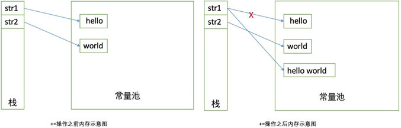

# CSE274 - Data Structure and Algorithms - 字符串

返回[Bulletin](./bulletin.md)

返回[CSE274 - Data Structure and Algorithms](./CSE274.md)

[TOC]

## String

### 字符串常量池如何存数据？

**存储格式**

StringTable

- 类似HashTable

- Key:Hash值 Value:引用

- Key:100 Value:0x122

地址（0x1122）

- “James”

**处理逻辑**

当常量池中不存在"abc"这个字符串的引用时：

- （JDK1.6）在堆内存中new一个新的String对象，复制这个对象加入常量池，返回常量池中的对象。

- （JDK1.7以上）在堆内存中new一个新的String对象，将这个对象的引用加入常量池。（跟1.6的区别是常量池不再存放对象，只存放引用。）

当常量池中存在"abc"这个字符串的引用时，str指向这个对象的引用。

### String为什么是final/不可变类？ 

**确实不可变**

String中提供了一些看似可以改变String对象的方法，但实际上它们已经是指向了一个新建的对象。



**字符串已被广泛用作参数**

如果 String 不是不可变的，这将导致严重的安全威胁。

**多线程编程**

由于 String 是不可变的，它可以安全地共享许多线程，这对于多线程编程非常重要. 并且避免了 Java 中的同步问题，不变性也使得String 实例在 Java 中是线程安全的，这意味着你不需要从外部同步 String 操作。

**不可变的哈希码**

Java 中的不可变 String 缓存其哈希码，并且不会在每次调用 String 的 hashcode 方法时重新计算，这使得它在 Java 中的 HashMap 中使用的 HashMap 键非常快。

**类加载机制**

String被类加载机制使用，它的不可变特性保证类加载机制中类的加载路径无法被篡改。

### 是否可以继承String类？

字符串常量String类是final类，故不可以继承。

### 为什么char[]比String更适合存储密码？

密码如果存在字符串，它很可能会保留在内存中持续很长时间，从而构成安全威胁。而字符数组可以内容置空，免除安全风险。

密码如果存在字符串，打印日志时会打印出它的实际内容。而字符数组会打印其地址。

Java本身就提供了JPasswordField 的 getPassword() 方法，该方法返回一个 char[].

此外，建议保存加密或哈希过的密码而不是明文。

### String str = new String("abc");生成了几个对象？

两个。"abc"和new String("abc")

只要使用new, 就生成一个新对象。

str.subString(0, 1)或str.toUpperCase()在执行过程中，也相当于生成了new String("...")

### 字符串比较题

"a"+"B" == “ab”吗？

True.

字符串常量连接，在编译时就已经变成了新的字符串常量。

------

final String s = "a";

String str = s + "b";

str == "ab"吗？

True

编译时生成"ab"

------

String s1 = "a";

String s2 = "b";

String str = s1 + s2;

str == "ab"吗？

False.

第三步运行时会新增一个new String("ab") 

------

问题：

What’s the result of the following function, and why?

```java
 public static void main(String[] args) {
     String str1 = "Thomsonreuters";
     String str2 = "Thomson" + new String("reuters");
     System.err.println(str1 == str2);
}
```

答案：

false

Reason: String in Java is immutable. Although str1 and str2 are strings that look identical, they are not the same objects. "==" operation will be false since their memory addresses are different.

### Java中需要转义的字符

在Java中，不管是String.split()，还是正则表达式，有一些特殊字符需要转义，这些字符是：

(   [   {   /   ^   -   $   ¦   }   ]   )   ?   *   +   . 

**方法一**

转义方法为字符前面加上"\\"，这样在split、replaceAll时就不会报错了，代码示例：

```java
String b[] = a.split("**\\.**");
for (String c:b) {
    System.out.println(c);
} 
```

**方法二**

既然split(".")被代码给转义了，我们可以用没有被转义的字符代替，然后再进行截取。代码示例：

```java
a = a.replace(".", "￥");
String d[]=a.split("￥");
for (String e:d) {
    System.out.println(e);
}
```

注意String.contains()方法不需要转义。

### indexOf(String match)

indexOf 方法返回一个整数值，指出 String 对象内子字符串的开始位置。如果没有找到子字符串，则返回-1。

如果 startindex 是负数，则 startindex 被当作零。如果它比最大的字符位置索引还大，则它被当作最大的可能索引。

Java中字符串中子串的查找共有四种方法，如下：

- int indexOf(String str) ：返回第一次出现的指定子字符串在此字符串中的索引。 

- int indexOf(String str, int startIndex)：从指定的索引处开始，返回第一次出现的指定子字符串在此字符串中的索引。 

- int lastIndexOf(String str) ：返回在此字符串中最右边出现的指定子字符串的索引。 

- int lastIndexOf(String str, int startIndex) ：从指定的索引处开始向后搜索，返回在此字符串中最后一次出现的指定子字符串的索引。

### 删除空格

str.trim() 去掉首尾空格 

str.replace(" ", ""); 去掉所有空格，包括首尾、中间

## StringBuffer

字符串变量StringBuffer, 线程安全。

简要的说，String类型和StringBuffer类型的主要性能区别其实在于 String 是不可变的对象，因此在每次对String类型进行改变的时候其实都等同于生成了一个新的 String 对象，然后将指针指向新的 String 对象，所以经常改变内容的字符串最好不要用 String，因为每次生成对象都会对系统性能产生影响，特别当内存中无引用对象多了以后， JVM 的 GC 就会开始工作，那速度是一定会相当慢的。

而如果是使用StringBuffer类结果就不一样了，每次结果都会对StringBuffer对象本身进行操作，而不是生成新的对象，再改变对象引用。所以在一般情况下我们推荐使用StringBuffer，特别是字符串对象经常改变的情况下。

StringBuffer上的主要操作是append()和insert()方法，可重载这些方法，以接受任意类型的数据。每个方法都能有效地将给定的数据转换成字符串，然后将该字符串的字符追加或插入到字符串缓冲区中。append 方法始终将这些字符添加到缓冲区的末端；而 insert 方法则在指定的点添加字符。

例如，如果z引用一个当前内容是“start”的字符串缓冲区对象，则此方法调用 z.append("le") 会使字符串缓冲区包含“startle”，而 z.insert(4, "le") 将更改字符串缓冲区，使之包含“starlet”。

### 什么时候StringBuffer比String操作慢？

在某些特别情况下，String对象的字符串拼接其实是被 JVM 解释成了StringBuffer对象的拼接，所以这些时候String对象的速度并不会比StringBuffer对象慢，而特别是以下的字符串对象生成中，String效率是远要比StringBuffer快的：

```java
String s1 = "This is only a" + " simple" + " test";
StringBuffer sb = new StringBuffer("This is only a").append(" simple").append(" test");
```

你会很惊讶的发现，生成String S1对象的速度简直太快了，而这个时候StringBuffer居然速度上根本一点都不占优势。其实这是JVM的一个把戏，在JVM眼里，这个

```java
String S1 = "This is only a" + " simple" + " test"; 
```

其实就是：

```java
String S1 = "This is only a simple test"; 
```

所以当然不需要太多的时间了。但大家这里要注意的是，如果你的字符串是来自另外的String对象的话，速度就没那么快了，譬如：

```java
String S2 = "This is only a";
String S3 = "simple";
String S4 = "test";
String S1 = S2 +S3 + S4;
```

这时候 JVM 会规规矩矩的按照原来的方式去做。

## StringBuilder VS StringBuffer

java.lang.StringBuilder是 Java 5.0新增的字符串类。此类提供与StringBuffer兼容的 API，但不保证同步，线程不安全。该类被设计用作StringBuffer的一个简易替换，在大多数实现中，它比 StringBuffer 要快。两者的方法基本相同。