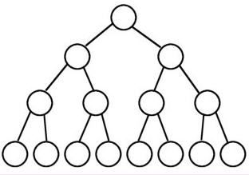
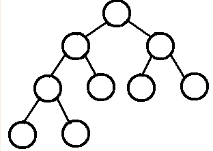

# CSE274 - Data Structure and Algorithms - 二叉树

返回[Bulletin](./bulletin.md)

返回[CSE274 - Data Structure and Algorithms](./CSE274.md)

[TOC]

## 二叉树

二叉树是每个节点最多有两个子树的树结构。通常子树被称作“左子树”（left subtree）和“右子树”（right subtree），其次序不能任意颠倒。

若二叉树的层次从0开始，则在二叉树的第i层至多有2^i个结点(i>=0)。

高度为k的二叉树最多有2^(k+1) - 1个结点(k>=-1)。 (空树的高度为-1)。

节点的度，代表节点下的子节点个数。

**存储方式**

和图一样，有链表和数组两种，用数组存访问速度快，但插入、删除节点操作就比较费时了。实际中更多的是用链表来表示二叉树的。

### 满二叉树

所有叶结点同处于最底层（非底层结点均是内部结点），一个深度为k(>=-1)且有2^(k+1) - 1个结点。



#### 检验满二叉树

```java
public static boolean isFull1 (Node head) {
    if (head == null) {
        return true;
    }
    int height = h(head);
    int nodes = n(head);
    return (1 << height) - 1 == nodes;
}
public static int h (Node head) {
    if (head == null) {
        return 0;
    }
    return Math.max(h(head.left), h(head.right)) + 1;
}
public static int n (Node head) {
    if (head == null) {
        return 0;
    }
    return n(head.left) + n(head.right) + 1;
}
```

### 完全二叉树

叶结点只能出现在最底层的两层，且最底层叶结点均处于次底层叶结点的左侧。



#### 检验完全二叉树

从左往右层级遍历。

当某一个节点有右子节点没有左子节点的时候，直接返回false.

当某一个节点没有右子节点，则往后的节点必须没有子节点，否则返回false.

```java
public static boolean isCBT1(Node head) {
    if (head == null) {
        return true;
    }
    LinkedList<Node> queue = new LinkedList<>();
    // 是否遇到过左右两个孩子不双全的节点
    boolean leaf = false;
    Node l = null;
    Node r = null;
    queue.add(head);
    while (!queue.isEmpty()) {
        head = queue.poll();
        l = head.left;
        r = head.right;
        if (
            // 如果遇到了不双全的节点之后，又发现当前节点不是叶节点
            (leaf && (l != null || r != null)) || (l == null && r != null)
        ) {
            return false;
        }
        if (l != null) {
            queue.add(l);
        }
        if (r != null) {
            queue.add(r);
        }
        if (l == null || r == null) {
            leaf = true;
        }
    }
    return true;
}
```

#### 求完全二叉树节点的个数

```java
public static int nodeNum(Node head) {
    if (head == null) {
        return 0;
    }
    return bs(head, 1, mostLeftLevel(head, 1));
}
public static int bs(Node node, int l, int h) {
    if (l == h) {
        return 1;
    }
    if (mostLeftLevel(node.right, l + 1) == h) {
        // 左满 右不一定
        return (1 << (h - l)) + bs(node.right, l + 1, h);
    } else {
        // 左不一定 右满且少一层
        return (1 << (h - l - 1)) + bs(node.left, l + 1, h);
    }
}
// 当前树上最左节点的深度
public static int mostLeftLevel(Node node, int level) {
    while (node != null) {
        level++;
        node = node.left;
    }
    return level - 1;
}
```

### 平衡二叉树

左右子树的高度差不能超过1，左右子树也是平衡二叉树。

#### 检验平衡二叉树

```java
public boolean IsBalanced_Solution3(TreeNode root){
    return etDepth(root) !=-1;
}
private int etDepth(TreeNode root){
    if(root == null) return 0;
    int left = etDepth(root.left);
    if(left == -1) return -1;
    int right = etDepth(root.right);
    if(right == -1) return -1;
    return Math.abs(left-right) >1 ? -1:1+Math.max(left, right);
}
```

