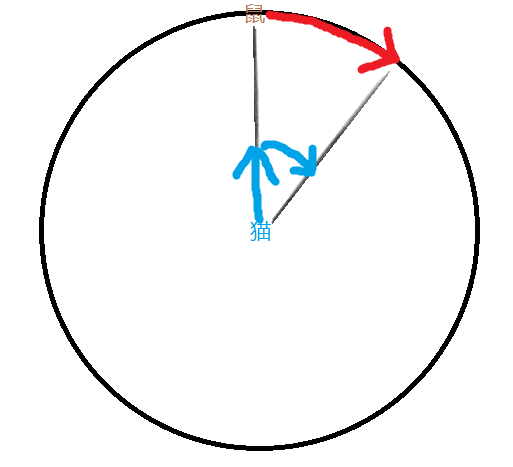

# CSE274 - Data Structure and Algorithms - 数学题/智力题

返回[Bulletin](./bulletin.md)

返回[CSE274 - Data Structure and Algorithms](./CSE274.md)

[TOC]

## 数字类

### 为什么两个大于5的相邻奇数质数的中间的值是6的倍数？

首先，这个数一定是2的倍数，其次他一定是3的倍数，否则相邻的数不可能是质数。

### 一个数组，每次任选两个元素减一，能否全部减到0

必须满足以下所有条件：

条件1：数组长度大于1；

条件2：总和不能是奇数；

条件3：最大项不能比其他项加起来还大。注意防止溢出，使用减法验证。

### 一根金条，可以借助工具，切两刀，用于分七天支付一个人工资。

你让工人为你工作7天，给工人的回报是一根金条。金条平分成相连的7段 ，你必须在每天结束时给他们一段金条，如果只许你两次把金条弄断，你如何给你 的工人付费？

**答案**

把金条1:2:4切分。

### 一种粗细不均匀的绳子，烧光一根需要一小时，如何计算一小时零十五分？

拿出两根绳子，第一根从两头烧，第二根从一头烧。当第一根烧完时，时间应该过了半小时，此时熄灭第二根。

然后拿出第三根绳子，先从一头烧第三根绳子，度过一小时，然后从两头烧剩下的第二根绳子，等绳子烧完，时间应该一共度过了一小时零十五分。

## 应用类

### 翻硬币问题

4枚银币，排列成正方形，每一枚银币有２面，初始状况未知，现在请应聘者给出指令，使得最后４枚银币的正面都向上。用户可以给出４种指令，翻１个，沿着横边／竖边翻２个，沿着对角线翻２个，４个全翻。至于，翻的是哪一个，沿着哪条边翻或者哪条对角线翻，就完全随机了。

### 四个人过桥

四个人过桥，每次最多只能过两个人，只有一个电筒，过桥必须电筒。A需要1分钟、B需要2分钟、C需要5分钟、D需要10分钟。要求17分钟内过完。

| 第几分钟 | 桥这边       | 桥那边       |
| -------- | ------------ | ------------ |
| 0        | A B C D 电筒 |              |
| 2        | C D          | A B电筒      |
| 3        | A C D电筒    | B            |
| 13       | A            | B C D电筒    |
| 15       | A B电筒      | C D          |
| 17       |              | A B C D 电筒 |

### 大家看不到自己是黑帽子还是白帽子，黑帽子至少有一顶，第三次大家猜出自己是什么帽子，问共有多少顶黑帽子和白帽子？

一群人开舞会，每人头上都戴着一顶帽子。帽子只有黑白两种，黑的至少有一顶。每个人都能看到其他人帽子的颜色，却看不到自己的。主持人先让大家看看别人头上戴的是什么帽子，然后关灯，如果有人认为自己戴的是黑帽子，就打自己一个耳光。第一次关灯，没有声音。于是再开灯，大家再看一遍，关灯时仍然鸦雀无声。一直到第三次关灯，才有劈劈啪啪打耳光的声音响起。问有多少人戴着黑帽子？

**分析**

假如只有一个人戴黑帽子，那他看到所有人都戴白帽，在第一次关灯时就 应自打耳光，所以应该不止一个人戴黑帽子；

如果有两顶黑帽子，第一次两人都只看到对方头上的黑帽子，不敢确定自己的颜色，但到第二次关灯，这两人应该明白，如果自己戴着白帽，那对方早在上一次就应打耳光了，因此自己戴的也是黑帽子，于是也会有耳光声响起；

可事实是第三次才响起了耳光声，说明全场不止两顶黑帽，依此类推，应该是关了几次灯，有几顶黑帽。

### 12个球一个天平，现知道只有一个和其它的重量不同，问怎样称才能用三次就找到那个球。

- 从12个球里选4个放在天平左边，选4个放在天平右边，称重。

- 如果一边重一边轻：

  - 将12个球定义为4个重球，4个轻球，4个好球。问题球将出自重球或者轻球。
  - 将2个重球和2个轻球放在天平左边，将1个轻球和3个好球放在天平右侧。
  - 如果重球和轻球重：
    - 得知问题球比好球重。2个重球中较重者为问题球。

  - 如果重球和轻球轻：
    - 得知问题球比好球轻。右边这个轻球为问题球。
  - 如果一样重：
    - 得知问题球比好球重。因为所有轻球都和好球一样重。问题球出自剩下的2个重球。2个重球中较重者为问题球。

- 如果一样重：
  - 将12个球定义为8个好球，4个坏球。问题球将出自坏球。
  - 将3个坏球放在天平左边，将3个好球放在天平右边。
  - 如果坏球重：
    - 得知问题球比好球重。将这3个坏球定义为坏球1、坏球2、坏球3。问题球将出自这3个坏球。
    - 将坏球1放在天平左边，将坏球2放在天平右边。
    - 如果坏球1重：
      - 问题球是坏球1.
    - 如果坏球2重：
      - 问题球是坏球2.
    - 如果一样重：
      - 问题球是坏球3.
  - 如果好球重：
    - 得知问题球比好球轻。
    - 思路同上。
  - 如果一样重：
    - 问题球是未称重的坏球。

### 13个球一个天平，现知道只有一个和其它的重量不同，问怎样称才能用三次就找到那个球。

- 从13个球里选4个放在天平左边，选4个放在天平右边，称重。

- 如果一边重一边轻：
  - 将12个球定义为4个重球，4个轻球，5个好球。问题球将出自重球或者轻球。
  - 将2个重球和2个轻球放在天平左边，将1个轻球和3个好球放在天平右侧。
  - 如果重球和轻球重：
    - 得知问题球比好球重。2个重球中较重者为问题球。
  - 如果重球和轻球轻：
    - 得知问题球比好球轻。右边这个轻球为问题球。
  - 如果一样重：
    - 得知问题球比好球重。因为所有轻球都和好球一样重。
    - 问题球出自剩下的2个重球。
    - 2个重球中较重者为问题球。

- 如果一样重：
  - 将13个球定义为8个好球，5个坏球。问题球将出自坏球。
  -  将这5个坏球定义为坏球1、坏球2、坏球3、坏球4、坏球5。问题球将出自这5个坏球。
  - 将4个坏球放在天平左边，将4个好球放在天平右边。
  - 如果坏球重：
    - 得知问题球比好球重。
    - 将坏球1、坏球2、坏球3放在天平左边，将坏球4和两个好球放在天平右边。
    - 如果坏球1、坏球2、坏球3重：
      - 问题出自坏球1、坏球2、坏球3。
      - 称重坏球1和坏球2：
      - 如果坏球1重：
        - 问题球是坏球1. 
      - 如果坏球2重：
        - 问题球是坏球2.
      - 如果一样重：
        - 问题球是坏球3.
    - 如果坏球1、坏球2、坏球3轻：
      - 问题球是坏球4.
    - 如果一样重：
      - 问题球是坏球5.

- 如果好球重：
  - 得知问题球比好球轻。
  - 思路同上。

- 如果一样重：
  - 问题球是坏球5。（不知道是偏重还是偏轻）

### 飞机加油问题

**已知：**

每个飞机只有一个油箱，

飞机之间可以相互加油(注意是相互，没有加油机)，

一箱油可供一架飞机绕地球飞半圈。

**问题：**

为使至少一架飞机绕地球一圈回到起飞时的飞机场，至少需要出动几架飞机？

(所有飞机从同一机场起飞，而且必须安全返回机场，不允许中途降落，中间没有飞机场)

**答案：**

3架飞机5架次。

ABC 3架同时起飞，

1/8处，C给AB加满油，C返航，

1/4处，B给A加满油，B返航，

A到达1/2处，C从机场往地球**另一方向**起飞，

3/4处，C同已经空油箱的A平分剩余油量，同时B从机场起飞，

AC到7/8处同B平分剩余油量，刚好3架飞机同时返航。

### 汽车持续加油问题

一辆载油500升的汽车从A开往1000公里外的B，已知汽车每公里耗油量为1升，A处有无穷多的油，其他任何地点都没有油，但该车可以在任何地点存放油以备中转，问从A到B最少需要多少油？

题目可归结为求数列  an=500/(2n+1)  n=0,1,2,3......的和Sn什么时候大于等于1000

解得n> 6

当n=6时，S6=977.57 

所以第一个中转点离起始位置距离为1000-977.57=22.43公里 

所以第一次中转之前共耗油  22.43*(2*7+1)=336.50升

此后每次中转耗油500升 

所以总耗油量为7*500+336.50=3836.50升

### 监狱放风开关灯问题

监狱里有100个房间，每个房间内有一囚犯。一天，监狱长说，你们狱房外有一电灯，你们在放风时可以控制这个电灯(熄或亮)。每天只能有一个人出来放风，并且防风是随机的。如果在有限时间内，你们中的某人能对我说：“我敢保证，现在每个人都已经至少放过一次风了。”我就放了你们!问囚犯们要采取什么策略才能被监狱长放掉?如果采用了这种策略，大致多久他们可以被释放？

**答案**

约定好一个人作为报告人(可以是第一个放风的人)

规则如下：

1. 报告人放风的时候开灯并数开灯次数
2. 其他人第一次遇到开着灯放风时，将灯关闭
3. 当报告人第100次开灯的时候，去向监狱长报告，要求监狱长放人......

按照概率大约30年后(10000天)他们可以被释放。

### 实现多人公平抢同一个红包

现在有 n 个人抢红包，一共 M 元。

要求给出一种随机算法，使得每个人期望得到的钱数相同，且每个人得到的钱数是个随机变量。但不要求每个人得到的钱数的取值范围是 [0,M]。

**二倍均值法**

剩余红包金额M，剩余人数N，那么：每次抢到金额=随机(0，M/N*2)

保证了每次随机金额的平均值是公平的

假设10人，红包金额100元

第一人：100/10*2=20，随机范围(0,20)，平均可以抢到10元

第二人：90/9*2=20，随机范围(0,20)，平均可以抢到10元

第三人：80/8*2=20，随机范围(0,20)，平均可以抢到10元

以此类推，每次随机范围的均值是相等的

即假设N个人,红包金额M元，

第一次平均抢到M/N元，第二次抢到(M-M/N)/(N-1)=M/N,以此类推，每个人的均值都一样。

缺点：除了最后一次，任何一次抢到的金额都不会超过人均金额的两倍，并不是任意的随机。

**线段分割法**

把红包总金额想象成一条很长的线段，而每个人抢到的金额，则是这条主线段所拆分出的若干子线段。当N个人一起抢红包的时候，就需要确定N-1个切割点。因此，当N个人一起抢总金额为M的红包时，我们需要做N-1次随机运算，以此确定N-1个切割点。

随机的范围区间是（1， M）。当所有切割点确定以后，子线段的长度也随之确定。这样每个人来抢红包的时候，只需要顺次领取与子线段长度等价的红包金额即可。

当随机切割点出现重复，可以视作部分线段长度为0，不过要在分割线断之前每个人分到的金额增加保底，比如每个人至少分到一分钱，那么在进行分割线段之前，总长度需要减去0.01*总人数。

与二倍均值法相比，改善了缺点。越大金额抢到的人数越少。

## 几何类

### 猫抓老鼠问题

猫抓老鼠，猫在圆型中间，老鼠在圆的周长上，速度相同，问猫能不能抓到老鼠。

一定能抓到，猫只需要和老鼠保持一样的角速度，并且把剩余的线速度用来往圈外跑就迟早能抓到。

 

### 给你一个单位圆，还有平面上的n个点，求这个圆最多能覆盖的点数

这题很容易想到一个O(n^3)的算法，也就是枚举两个距离小于2的点，用它们来固定一个圆，当然对称圆也要算，再枚举所有点，看是不是在这个圆内，当然这题这样就可以水过，不过这并不是最优的。

还有一种O(n^2 log n)的算法，这种方法其实也简单，不过我还是没有自己想出来，先枚举一个点，再枚举所有与它距离小于2的点，这样就可以求出相交弧，把所有弧保存下来，并离散化，就能算出覆盖次数最多的一段弧，这个次数也就是答案了，具体看代码吧。

### 在9个点上画10条直线,要求每条直线上至少有三个点

### 怎么样种植4棵树木，使其中任意两棵树的距离相等？

## 脑筋急转弯类

### 请把一盒蛋糕切成8份，分给8个人，但蛋糕盒里还必须留有一份

面对这样的怪题，有些应聘者绞尽脑汁也无法分成；而有些应聘者却感到此题实际很简单，把切成的8份蛋糕先拿出7份分给7人，剩下的1份连蛋糕盒一起分给第8个人。

### 胡搅蛮缠型题目

你有两个罐子，50个红色弹球，50个蓝色弹球，随机选出一个罐子，随机选取出一个弹球放入罐子，怎么给红色弹球最大的选中机会？在你的计划中，得到红球的准确几率是多少？

**答案**

无论怎么分都一样，看你有没有魄力坚持自己的意见。

### 两颗6面色子，可以在它们各个面上刻上0-9任意一个数字，要求能够用它们拼出任意某一日的数值

012345 0126(9)78