# CSE301 — Java Virtual Machine

返回[Bulletin](./bulletin.md)

[TOC]

> 本文档定位：JVM 原理——回答"JVM 为什么这样工作"。主线是类加载、运行时数据区、对象与内存、GC 基础与主流收集器（G1 / ZGC）、执行与编译。线上事故排查、JVM 调优与工具实战由 CSE381（Java Production Troubleshooting & Performance）负责，不在本文展开。

## 1. JVM Architecture

### JDK

JDK(Java Development Kit) 是 Java 语言的软件开发工具包(SDK)。

在JDK的安装目录下有一个jre目录，里面有两个文件夹bin和lib，bin里的就是jvm，lib中则是jvm工作所需要的类库。

### JRE

JRE（Java Runtime Environment，Java运行环境），包含JVM标准实现及Java核心类库，有了JRE我们写的java程序才可以运行起来被用户所使用。

JRE是Java运行环境，并不是一个开发环境，所以没有包含任何开发工具（如编译器和调试器）。

### JVM

JVM是Java Virtual Machine（Java虚拟机）的缩写，它通过模拟一个计算机来达到一个计算机所具有的的计算功能。JVM 能够跨计算机体系结构来执行 Java 字节码，主要是由于 JVM 屏蔽了与各个计算机平台相关的软件或者硬件之间的差异，使得与平台相关的耦合统一由 JVM 提供者来实现。

JVM 是运行在操作系统之上的，它与硬件没有直接的交互。

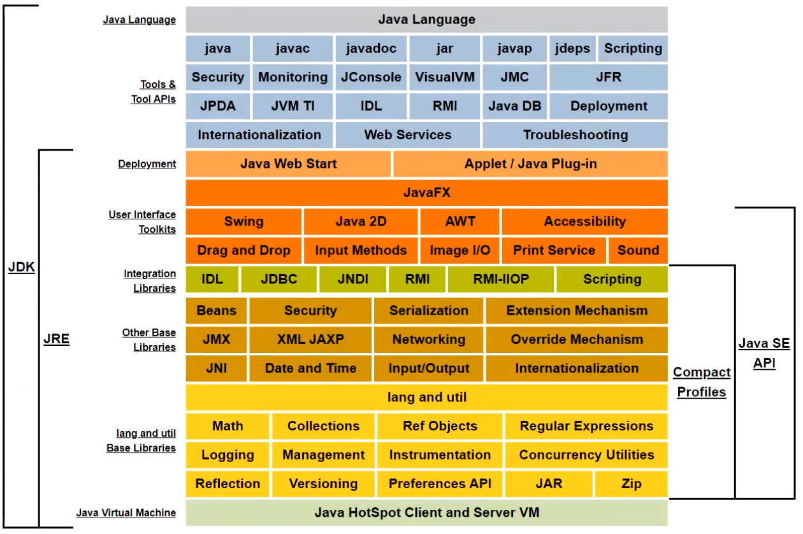

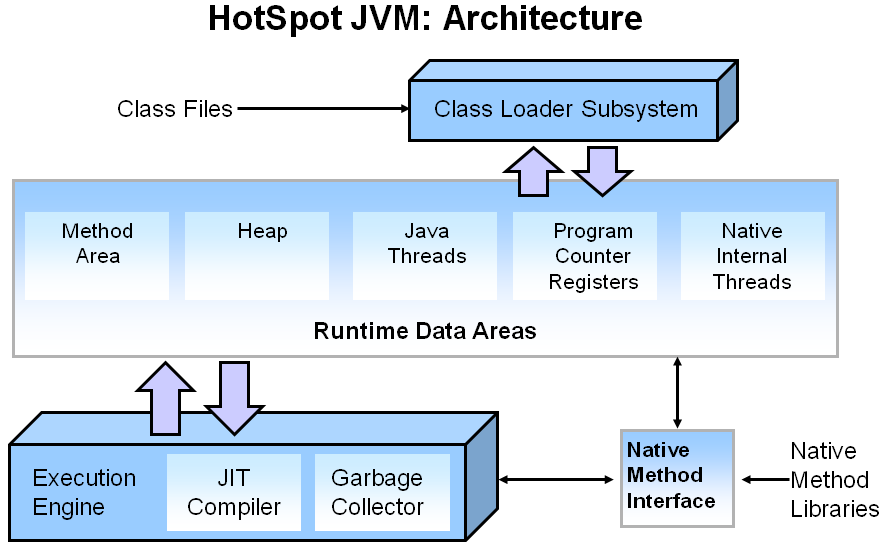

> 面试只需记住三者关系：JDK = JRE + 开发工具（javac/javap 等）；JRE = JVM + 核心类库。Client VM / Server VM 等历史运行模式见 Appendix A。

### HotSpot 与常见 JVM

HotSpot 是 SUN（后被 Oracle 收购）出品的官方 JVM，当前主流。其他历史 JVM（JRockit、J9、Microsoft VM、TaobaoVM、Azul Zing 等）见 Appendix B。

### HotSpot 的整体构成

HotSpot 由以下几部分协作构成：

- **类加载器（Class Loader）**：在JVM启动时或者类运行时，把Java代码转换成字节码，即class文件，然后加载到内存。Class loader只管加载，只要符合文件结构就加载，至于能否运行，它不负责，那是由Exectution Engine 负责的。
- **执行引擎（Execution Engine）**：执行引擎也叫解释器，负责解释命令，将字节码翻译成底层系统指令再交由CPU去执行。
- **本地方法接口（Native Interface）**：调用C/C++实现的本地方法为java所用，来帮助实现整个程序的功能。
- **运行时数据区（Runtime Data Area）**：将内存划分成负责不同功能的存储、记录和调度模块，程序都被加载到这里之后才开始运行（见 §3）。

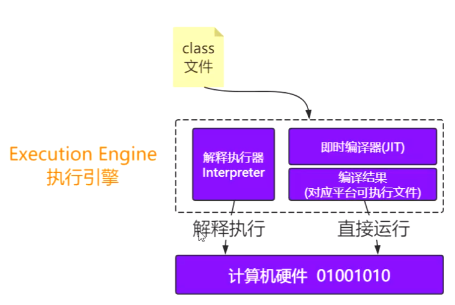

### Java Source → Bytecode → JVM

Java 源码经 `javac` 编译为与平台无关的字节码（Class 文件，`CAFEBABE` 魔数开头），由 JVM 加载（§2）后通过解释器 / JIT（§9）执行——这就是"一次编译，到处运行"的实际路径。Class 文件的二进制结构较细，见 Appendix C。

### JVM 生命周期

一个运行时的Java虚拟机负责运行一个Java程序。当启动一个Java程序时，一个虚拟机实例也就诞生了。当程序关闭退出，这个虚拟机实例也就随之消亡。

**启动**

Java虚拟机实例通过调用某个初始类的main()方法来运行一个Java程序。而这个main()方法必须是public static的，返回值为void，并且接受一个String[]数组作为参数。任何拥有这样一个main()方法的类都可以作为Java程序运行的起点。告诉Java虚拟机要运行的Java程序中初始类的名字，整个程序将从它的main()方法开始运行。

**守护线程**

Java虚拟机内部有两种线程：守护线程和非守护线程。守护线程通常是由虚拟机自己使用的，比如执行垃圾收集任务的线程。不过Java程序也可以把它创建的任何线程通过setDaemon(true)标记为守护线程。但是Java程序中的初始线程-就是开始于main()的那个是非守护线程。

**终止**

只要还有任何非守护线程在运行，那么这个Java程序也在继续运行(虚拟机仍然存活)。

当程序中的所有的非守护线程都终止时，虚拟机实例自动退出。假如安全管理器允许，程序本身也能够通过调用Runtime类或者System类的exit()方法退出。

## 2. Class Loading

类加载是 Senior Java 面试最高频的 JVM 知识点之一。

### 类加载机制

类的加载指的是将编译好的class类文件中的字节码读入到内存中，将其放在方法区内并创建对应的Class对象。

Java中的所有类，都需要由类加载器装载到JVM中才能运行。

#### 加载 Loading

- 找到Class文件（全路径）到底在哪里。
  - 包括磁盘、内存、数据库、网络等。
  - 不一定非得要获取Class文件，从ZIP 包中读取（比如从jar 包和war 包中读取）、在运行时计算生成（动态代理）、由其它文件生成（比如将JSP 文件转换成对应的Class 类）皆可。

- 将Class的字节流信息存储到**方法区**。

- 将Class文件的对象（Class clazz）存储到**堆**。

#### 连接 Linking

##### 验证 Verification

- 验证Class文件的正确性，确保Class 文件的字节流中包含的信息是否符合当前虚拟机的要求。包括：
  - 文件格式验证
  - 元数据验证
  - 字节码验证
  - 符号引用验证

##### 准备 Preparation

- 在方法区中为类中由static修饰的静态变量分配存储空间，并且设置初始值。
  - 这里要注意，初始值是0或者null, 而不是代码中设置的具体值。
  - 代码中设置的值是在初始化阶段完成的。另外这里也不包含用final修饰的静态变量，因为final在编译的时候就会分配了。

##### 解析 Resolution

- 虚拟机将常量池中二进制数据的符号引用替换为直接引用的过程。
  - 在编译的时候一个每个java类都会被编译成一个class文件，但在编译的时候虚拟机并不知道所引用类的地址，所以就用符号引用来代替。
  - 符号引用只是符号，JVM认识，但是没有实际含义，不占用物理机的地址和操作码。
  - 直接引用是要落地真实的物理内存的。

- ClassLoader的loadClass方法的第二个参数是boolean类型，如果设置成false会跳过解析步骤。

#### 隐式装载与显式装载

隐式装载：程序在运行过程中当碰到通过new 等方式生成对象时，隐式调用类装载器加载对应的类到jvm中。

显式装载：通过class.forname()等方法，显式加载需要的类。

### 初始化时机与懒加载 Lazy-loading

严格讲应该叫做lazy-initializing. Java类的加载是动态的，它并不会一次性将所有类全部加载后再运行，而是保证程序运行的基础类(像是基类)完全加载到jvm中，至于其他类，则在需要的时候才加载。这当然就是为了节省内存开销。

JVM规范并没有规定什么时候加载，但是严格规定了什么时候**必须初始化**，如下所示：

- 当new, getstatic, putstatic, invokestatic指令访问非final变量时。

- java.lang.reflect对类进行反射调用时。

- 子类被初始化之前（应先触发父类初始化）。

- 虚拟机启动时被执行的主类。

- 动态语言支持java.lang.invoke.MethodHandle解析结果为REF_getstatic, REF_putstatic, REF_invokestatic的方法句柄时。

### 类加载器与双亲委派模型

类加载器之间的层次关系被称为类加载器的双亲委派模型。该模型要求除了顶层的启动类加载器外其余的类加载器都应该有自己的父类加载器，而这种父子关系一般通过组合（Composition）关系来实现，而不是通过继承（Inheritance）。

```java
protected Class<?> loadClass(String name, boolean resolve)
    throws ClassNotFoundException {
    synchronized (getClassLoadingLock(name)) {
        // First, check if the class has already been loaded
        Class<?> c = findLoadedClass(name);
        if (c == null) {
            long t0 = System.nanoTime();
            try {
                if (parent != null) {
                    c = parent.loadClass(name, false);
                } else {
                    c = findBootstrapClassOrNull(name);
                }
            } catch (ClassNotFoundException e) {
                // ClassNotFoundException thrown if class not found
                // from the non-null parent class loader
            }
            if (c == null) {
                // If still not found, then invoke findClass in order
                // to find the class.
                long t1 = System.nanoTime();
                c = findClass(name);
                // this is the defining class loader; record the stats
                PerfCounter.getParentDelegationTime().addTime(t1 - t0);
                PerfCounter.getFindClassTime().addElapsedTimeFrom(t1);
                PerfCounter.getFindClasses().increment();
            }
        }
        if (resolve) {
            resolveClass(c);
        }
        return c;
    }
}
```

先自下而上，检查该类是否已经加载。再自上而下，进行实际查找和加载。

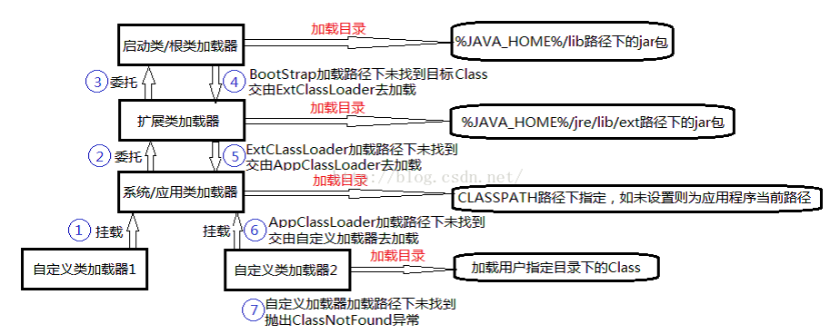

#### 三层类加载器

##### 启动类加载器（Bootstrap）

负责加载Java核心类库。一般用本地代码（C++）实现，不是ClassLoader子类。

加载$JAVA_HOME中jre/lib/rt.jar里的所有class, 或通过-Xbootclasspath参数指定路径中的jar包。（JDK 9 模块化后对应 java.base 等系统模块。）

> JDK 9 起出现 BootClassLoader（Java 实现，与 JVM 内部协作），但为了兼容，获取启动类加载器的场景仍返回 null。

##### 平台类加载器（Platform，JDK9 前为 Extension 扩展类加载器）

负责加载Java平台中扩展功能的一些jar包。它的父加载器是Bootstrap类加载器。

加载$JAVA_HOME中jre/lib/*.jar, 或通过-Djava.ext.dirs系统变量指定路径中的类库。（JDK 9 起由 PlatformClassLoader 取代 ExtensionClassLoader，因为模块化本身已提供扩展能力；`-Djava.ext.dirs` 随之失效。）

##### 应用/系统类加载器（Application/System）

它是应用最广泛的类加载器，是用户自定义加载器的默认父加载器。它的父加载器是Extension类加载器。

负责加载用户路径（classpath）上的jar包，或通过-Djava.class.path系统变量指定路径中的类库。

##### 用户自定义类加载器

通过java.lang.ClassLoader的子类自定义加载class.

如果不想打破双亲委派模型，那么只需要重写java.lang.ClassLoader的findClass方法中的defineClass(byte[] -> Class clazz)逻辑。如下所示：

```java
public class MyClassLoader extends ClassLoader {
    private String classPrePath = "./";
    public String getClassPrePath() {
        return classPrePath;
    }
    public void setClassPrePath(String classPrePath) {
        this.classPrePath = classPrePath;
    }
    @Override
    protected Class<?> findClass(String name) throws ClassNotFoundException {
        File f = new File(classPrePath, name.replace(".", "/").concat(".class"));
        try {
            FileInputStream fis = new FileInputStream(f);
            ByteArrayOutputStream baos = new ByteArrayOutputStream();
            int b = 0;
            while ((b = fis.read()) !=0) {
                baos.write(b);
            }
            byte[] bytes = baos.toByteArray();
            baos.close();
            fis.close();
            return defineClass(name, bytes, 0, bytes.length);
        } catch (Exception e) {
            e.printStackTrace();
        }
        return super.findClass(name); //throws ClassNotFoundException
    }
    public static void main(String[] args) throws Exception {
        ClassLoader l = new MyClassLoader();
        Class clazz = l.loadClass("com.github.ltprc.jvm.???");
        Class clazz1 = l.loadClass("com.github.ltprc.jvm.???");
        System.out.println(clazz == clazz1);
        /**
         * TODO Define ???
         */
        //??? h = (???)clazz.newInstance();
        //h.m();
        System.out.println(l.getClass().getClassLoader());
        System.out.println(l.getParent());
        System.out.println(getSystemClassLoader());
    }
}
```

如果想打破双亲委派模型，那么就重写整个java.lang.ClassLoader的loadClass方法，在JDK 1.2之前必须如此。

```java
public class T012_ClassReloading2 {
    private static class MyLoader extends ClassLoader {
        @Override
        public Class<?> loadClass(String name) throws ClassNotFoundException {
            File f = new File("C:/work/ijprojects/JVM/out/production/JVM/" + name.replace(".", "/").concat(".class"));
            if(!f.exists()) return super.loadClass(name);
            try {
                InputStream is = new FileInputStream(f);
                byte[] b = new byte[is.available()];
                is.read(b);
                return defineClass(name, b, 0, b.length);
            } catch (IOException e) {
                e.printStackTrace();
            }
            return super.loadClass(name);
        }
    }
}
```

可以通过ClassLoader构造方法指定它的父加载器：

```java
private static class MyLoader extends ClassLoader {
    public MyLoader() {
        super(parentClassLoaderInstance);
    }
}
```

#### 使用原因

主要原因是，双亲委派模型能够保证核心基础的Java类会被根加载器加载，而不会去加载用户自定义的和基础类库相同名字的类，从而保证系统的有序、**安全**。

比如加载位于rt.jar 包中的类java.lang.Object，不管是哪个加载器加载这个类，最终都是委托给顶层的启动类加载器进行加载，这样就保证了使用不同的类加载器最终得到的都是同样一个Object 对象。

次要原因是，可以不必重复加载已经被加载的类，节省资源。

#### 返回类加载器

```java
System.out.println(X.class.getClassLoader());
System.out.println(X.class.getClassLoader().getParent());
System.out.println(X.class.getClassLoader().getParent().getParent());
```

```
jdk.internal.loader.ClassLoaders$AppClassLoader@2077d4de
jdk.internal.loader.ClassLoaders$PlatformClassLoader@7637f22
null
```

Java是用C++编写的，在逻辑上并不存在Bootstrap类加载器的实体。所以打印Bootstrap类加载器的内容将会得到null.

#### Java 如何判定两个类相同？（Class Identity）

Java 虚拟机不仅要看类的全名是否相同，还要看加载此类的类加载器是否一样。只有两者都相同的情况，才认为两个类是相同的。即便是同样的字节代码，被不同的类加载器加载之后所得到的类，也是不同的。

比如一个 Java 类 com.example.Sample，编译之后生成了字节代码文件 Sample.class。两个不同的类加载器 ClassLoaderA和 ClassLoaderB分别读取了这个 Sample.class文件，并定义出两个 java.lang.Class类的实例来表示这个类。这两个实例是不相同的。对于 Java 虚拟机来说，它们是不同的类。试图对这两个类的对象进行相互赋值，会抛出运行时异常 ClassCastException.

#### JDK 9 模块化后的委派变化

JDK 9没有从根本上改变三层类加载器架构和双亲委派模型，但为了新引入的模块化系统的顺利运行，仍然发生了一些值得被注意的变动。

- 首先 ExtensionClassLoader被平台类加载器PlatformClassLoader取代。因为整个JDK都基于模块化进行构建，其中的各个java类库就已天然满足了可扩展的需求，所以扩展类加载器就完成了他自己的使命。

- 另外，JDK 9之后出现了BootClassLoader这样一个Java类，启动类加载器现在是在jvm内部和java类库共同协作实现的类加载器。但为了与之前代码兼容，在获取启动类加载器的场景中仍然会返回null，而不会得到BootClassLoader实例。

- 最后，委派关系发生了一些变动：当PlatformClassLoader以及ApplicationClassLoader收到加载请求的时候，在委派给父加载器前，会先判断该类是否能够归属到某个系统模块中去，如果可以，就会优先委派给那个模块的加载器完成加载。

所以JDK 9之后的三层委派模型就成了这样：

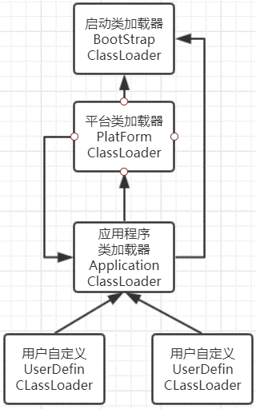

#### 违反双亲委派模型的情况

双亲委派模型并不是强制规定的，可以根据需要打破。

##### Tomcat

Tomcat为了实现隔离性，没有遵守这个约定，每个webappClassLoader加载自己的目录下的class文件，不会传递给父类加载器。

| Tomcat自定义的类加载器 | 备注                                                         |
| ---------------------- | ------------------------------------------------------------ |
| commonLoader           | Tomcat最基本的类加载器，加载路径/common/*中的class可以被Tomcat容器本身以及各个Webapp访问。 |
| catalinaLoader         | Tomcat容器私有的类加载器，加载路径/server/*中的class对于Webapp不可见。 |
| sharedLoader           | 各个Webapp共享的类加载器，加载路径`/shared/*`（在tomcat 6之后已经合并到根目录下的lib目录下）中的class对于所有Webapp可见，但是对于Tomcat容器不可见。 |
| WebappClassLoader      | 各个Webapp私有的类加载器，加载路径/WebApp/WEB-INF/*中的class只对当前Webapp可见。 |

当应用需要到某个类时，则会按照下面的顺序进行类加载：

1. 使用bootstrap引导类加载器加载

2. 使用system系统类加载器加载

3. 使用应用类加载器在WEB-INF/classes中加载

4. 使用应用类加载器在WEB-INF/lib中加载

5. 使用common类加载器在CATALINA_HOME/lib中加载

（OSGi、JNDI 线程上下文类加载器等其他打破场景见 Appendix E。）

#### 相关错误和异常

| **ClassNotFoundException**                                   | **NoClassDefFoundError**                          |
| ------------------------------------------------------------ | ------------------------------------------------- |
| 从java.lang.Exception继承，是一个Exception类型               | 从java.lang.Error继承，是一个Error类型            |
| 当动态加载Class的时候找不到类会抛出该异常                    | 当编译成功以后执行过程中Class找不到导致抛出该错误 |
| 一般在执行Class.forName()、ClassLoader.loadClass()或ClassLoader.findSystemClass()的时候抛出 | 由JVM的运行时系统抛出                             |

## 3. Runtime Data Areas

### 总览：不同版本对比

先建立正确的心智模型：**方法区是 JVM 规范定义的逻辑概念；永久代（PermGen）/ 元空间（Metaspace）是 HotSpot 在不同时代的具体实现**。面试说"方法区"时按规范回答，说"PermGen/Metaspace"时按 HotSpot 实现回答，两者不要混为一谈。

#### Hotspot JDK 1.6

- 线程共享区域
  - 方法区（永久代，相比较小）
    - 运行时常量池
    - 字符串常量池
    - 静态变量
    - 类Class的信息
    - 方法Method的信息
    - Code区（方法字节码）
    - 方法表信息
    - ...
  - 堆（相比较大）
    - 对象
    - 数组

- 线程私有区域（几个不同版本没有改动）
  - 程序计数器
  - Java虚拟机栈
  - 本地方法栈

- 对外内存/直接内存
- …

#### Hotspot JDK 1.7

- 线程共享区域
  - 方法区（永久代，相比较小）
    - 类Class的信息
    - 方法Method的信息
    - Code区（方法字节码）
    - 方法表信息
    - ...
  - 堆（相比较大）
    - 对象
    - 数组
    - 运行时常量池【JDK 1.7】
    - 字符串常量池【JDK 1.7】
    - 静态变量【JDK 1.7】

- 线程私有区域（几个不同版本没有改动）
  - 程序计数器
  - Java虚拟机栈
  - 本地方法栈

- 对外内存/直接内存
- …

#### Hotspot JDK 1.8

- 线程共享区域
  - 堆（相比较大）
    - 对象
    - 数组
    - 运行时常量池
    - 字符串常量池
    - 静态变量
    - DirectByteBuffer（此对象可以直接操作对外内存）【JDK 1.8】

- 线程私有区域（几个不同版本没有改动）
  - 程序计数器
  - Java虚拟机栈
  - 本地方法栈

- 对外内存/直接内存
  - 方法区（元空间，Metaspace）【JDK 1.8 起 HotSpot 用 Metaspace 取代 PermGen，元数据移入本地内存】
    - 类Class的信息
    - 方法Method的信息
    - Code区（方法字节码）
    - 方法表信息
    - ...
  - DirectByteBuffer对应的数据【JDK 1.8】
- …

要点回顾：

- JDK 1.7：字符串常量池、静态变量、运行时常量池从方法区（永久代）移入**堆**。
- JDK 1.8：HotSpot 移除 PermGen，类元数据移入**本地内存**的 **Metaspace**（默认只受本机内存限制，可用 `-XX:MetaspaceSize` / `-XX:MaxMetaspaceSize` 控制）；运行时常量池属于方法区规范内容，跟随 Metaspace。

### 程序计数器 / PC 寄存器

程序计数器（Program Counter Register）是一个非常小的内存空间，保存着当前线程所执行的虚拟机字节码的位置。

程序计数器每个线程工作时都有一个独立的计数器进行计数操作，字节码解析器正是通过改变这个计数器的值，来选取下一条需要执行的字节码指令。对象的晋升问题依靠的也是计数器。

> **纠错**：原文"对象的晋升问题依靠的也是计数器"表述有误。对象晋升年龄记录在**对象头 Mark Word 的 age 位**（HotSpot 占 4 bit，默认 15 即 `MaxTenuringThreshold`），每次 Minor GC 存活后加一，与程序计数器无关。程序计数器只负责当前线程字节码的行号指示。

程序计数器为执行java方法服务，执行native方法时，程序计数器为空。

**生命周期**：与线程相同, 依赖用户线程的启动/结束。

**异常**：程序计数器是唯一一个无OutOfMemoryError的区域。

### Java 虚拟机栈

Java虚拟机栈（Java Virtual Machine Stacks）也叫方法栈，是程序的运行单位，是线程私有的，和线程的生命周期相同。

**生命周期**：与线程相同, 依赖用户线程的启动/结束。

**异常**

StackOverflowError - 线程请求的栈深度大于JVM所允许的深度。

OutOfMemoryError – 在JVM允许动态扩展的情况下，无法申请到足够内容。

#### 栈帧

线程在执行**每个方法**时都会同时创建一个**栈帧**，调用方法时创建入栈，方法结束时出栈销毁。无论方法是正常完成还是异常完成（抛出了在方法内未被捕获的异常）都算作方法结束。

##### 执行过程

```java
void a() {
    b();
}
void b() {
    c();
}
void c() {
}
```

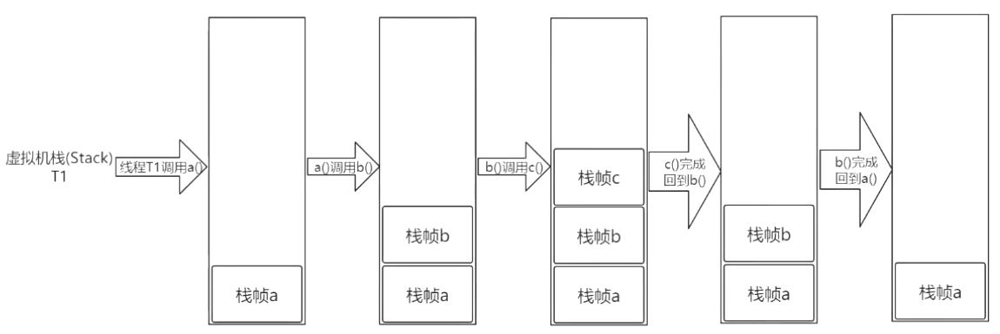

##### 存储信息

| 存储信息              | 备注                                   |
| --------------------- | -------------------------------------- |
| 局部变量表/本地变量表 | 存储局部变量的表格                     |
| 操作数栈              | 用于计算的临时数据的存储区             |
| 动态链接              | 当前方法所属于类型的运行时常量池的引用 |
| 返回地址/方法出口     | 记录方法执行完以后，程序继续执行的位置 |

### 本地方法栈

本地方法栈（Native Method Stack）与虚拟机栈类似，也是用来保存线程执行方法时的信息，只不过虚拟机栈是服务 Java 方法的，而本地方法栈是为虚拟机调用 Native 方法服务的。

native是一个计算机函数，一个Native Method就是一个Java调用非Java代码的接口。方法的实现由非Java语言实现，比如C或C++.

HotSpot VM直接就把本地方法栈和虚拟机栈合二为一。

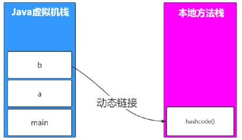

**生命周期**：与线程相同, 依赖用户线程的启动/结束。

**异常**

StackOverflowError - 线程请求的栈深度大于JVM所允许的深度。

OutOfMemoryError - 在JVM允许动态扩展的情况下，无法申请到足够内容。

### 堆

堆（Java Heap）是jvm管理的内存中最大的一块，堆被所有线程共享，同一块堆内存空间可以被不同的栈内存指向。创建的对象和数组都保存在Java堆内存中。

**生命周期**：域随虚拟机的启动/关闭而创建/销毁。

**异常**：当堆内存没有可用的空间时，会抛出OOM异常。

**垃圾回收**：这里也是垃圾收集器进行垃圾收集的最重要的内存区域。根据对象存活的周期不同，JVM把堆内存进行分代管理，由垃圾回收器来进行对象的回收管理（见 §5、§6）。

### 方法区

方法区（Method Area）是 JVM 规范中的逻辑区域，也是各个线程共享的内存区域。HotSpot 的实现：JDK1.7及以前为**永久代（PermGen，在堆内）**，JDK1.8及之后为**元空间（Metaspace，在本地内存）**。位置不同，内容也不同。

> **注意**：Method Area 是规范概念，PermGen / Metaspace 只是 HotSpot 的实现。被问"方法区在哪"时，先答规范（逻辑区域、线程共享），再答实现演进（PermGen → Metaspace）。不要把 PermGen 当作现代 JVM 的当前结构。

用于存储：

- 类的元信息（类型信息、方法信息、属性信息）

- 方法表

- JIT编译后的代码（机器码）等等

**生命周期**：域随虚拟机的启动/关闭而创建/销毁。

**异常**：当方法区没有可用的空间时，会抛出OOM异常（Metaspace 时代对应 `java.lang.OutOfMemoryError: Metaspace`）。

**垃圾回收**：Java 1.8之前FGC不会清理，从Java 1.8开始自动清理。

方法区垃圾回收需要同时满足以下条件：

- 类的对象已经全部被回收；

- 加载类的类加载器被回收；
- java.lang.Class对象已经被回收。

### 直接内存

直接内存并不是JVM运行时数据区的一部分，不受JVM GC管理。但也会被频繁的使用：直接内存是在java堆外的、直接向系统申请的内存空间。通常访问直接内存的速度会优于Java堆。

由于直接内存在java堆外，因此它的大小不会直接受限于Xmx指定的最大堆大小，但是系统内存是有限的，Java堆和直接内存的总和依然受限于操作系统能给出的最大内存。

因此出于性能的考虑，读写频繁的场合可能会考虑使用直接内存。

在JDK 1.4引入的NIO允许Java程序使用直接内存。NIO提供了基于Channel与Buffer的IO方式，它可以使用Native函数库直接分配堆外内存，然后使用DirectByteBuffer对象作为这块内存的引用进行操作。这样就避免了在Java堆和Native堆中来回复制数据，因此在一些场景中可以显著提高性能。

### 堆 VS 栈

|          | 堆                                                         | 栈                                     |
| -------- | ---------------------------------------------------------- | -------------------------------------- |
| 物理地址 | 物理地址分配不连续，性能慢                                 | 物理地址分配连续，性能快               |
| 内存大小 | 物理地址分配不连续，大小不固定，远大于栈                   | 物理地址分配连续，大小在编译时就固定   |
| 存放内容 | 数据（实例、数组）  注：静态对象存在堆，静态变量存在方法区 | 程序方法的执行（局部变量、返回结果）   |
| 可见度   | 整个应用程序共享可见                                       | 线程私有、线程可见、生命周期和线程相同 |

### 不同区域的引用关系

#### 栈指向堆

```java
private Object obj=new Object();
```

#### 方法区指向堆

方法区中会存放静态变量，常量等数据，即典型的方法区中元素指向堆中的对象。

```java
private static Object obj=new Object();
```

#### 堆指向方法区

因为对象存在堆，而类信息存在方法区，所以类信息就遵循了堆指向方法区。

## 4. Object & Memory

### 对象创建过程

- new 类名
- 根据new的参数，在常量池中定位类的符号引用。
  - 如果没有定位到，说明类还没有被加载，则进行类的加载、解析和初始化
- 为对象在堆中分配内存
- 将分配的内存初始化为0值
- 调用对象的<init>方法

以以下源码为例：

```java
class T {
    int m = 8;
}
T t = new T();
```

可以使用jclasslibrary插件展示字节码。

```assembly
0 new #2 <T> ;申请一块内存存储T对象
3 dup ;复制一份上面的引用，用于下一步处理，可以先不考虑其逻辑
4 invokespecial #3 <T.<init>> ;半初始化状态，成员的值赋为默认值
7 astore_1 ;变量和新建的对象之间建立关联
8 return ;暂时忽略
```

#### invoke 方法调用指令

JVM调用方法有五条指令，分别是：

| 调用指令        | 备注                                                         |
| --------------- | ------------------------------------------------------------ |
| invokestatic    | 用来调用static方法（类方法）                                 |
| invokespecial   | 用来调用需要特殊处理的实例方法，私有方法，父类方法(super.)，初始化方法。在对象的创建过程中，new之后很多都会执行<init>方法，就是依赖字节码中是否包含invokespecial指令。多数方法都是调用invokespecial. |
| invokevirtual   | 用于调用涉及到多态的方法。调用的哪个对象的方法，就把它被调用的方法压入栈中。 |
| invokeinterface | 调用接口方法，在运行时搜索一个实现了这个接口方法的对象，找出适当的方法进行调用。 |
| invokedynamic   | Java 1.7加入，在执行动态语言（运行时产生class文件）时调用。Lambda 表达式的实现也依赖它（见 CSE2716）。 |

### 对象生命周期与内存分配

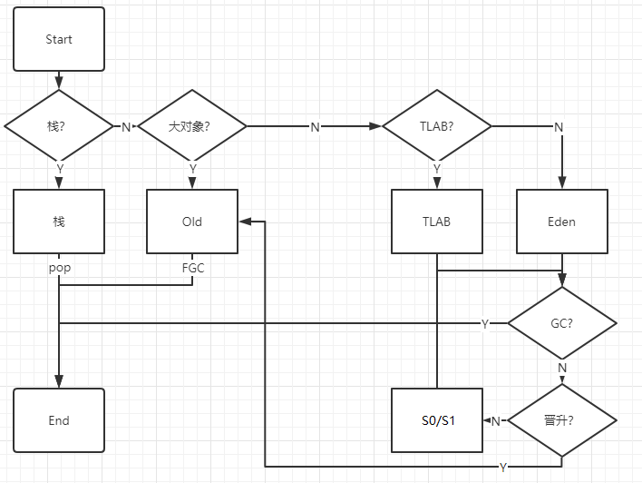

#### 栈与逃逸分析

原文："new出对象以后，进行**逃逸分析**。只要对象不存在逃逸，即对象仅仅活跃、被调用于某一个方法之内，就优先分配在栈。回收的时候不需要GC介入，栈一弹出，对象就被回收掉，效率相当高。"

> **纠错（重点）**："不逃逸的对象优先分配在栈上"是流传很广的**过度简化**表述。准确的说法：
>
> - 对象分配**默认发生在堆上**（HotSpot 即使经过逃逸分析确认了不逃逸，绝大多数情况下对象本体仍然分配在堆上）。
> - 逃逸分析（Escape Analysis）的价值在于让 JIT 做后续优化，主要是：**标量替换（Scalar Replacement）**——把"对象"拆散成若干成员变量分别分配（这些变量才可能落在栈帧上）、**同步消除（锁消除）**、**分配消除（Allocation Elimination）**。优化掉的是"这次分配本身"，而不是"对象从堆搬到栈"这个物理动作。
> - 因此面试中应说："逃逸分析使 JIT 可以进行标量替换、锁消除等优化，减少无效堆分配和 GC 压力"，而不是"Java 对象优先栈上分配"。

#### Old 区

如果对象特别大，就放在Old区。只有经过Major GC或Full GC才会回收。

#### TLAB

向堆中的新生代申请内存空间时，通常通过一个指针来紧凑划分内存。创建新对象时，指针就右移对象大小即可，这叫指针加法。如果多个线程都在分配对象，那么这个指针就会成为热点资源，需要互斥，分配的效率就会降低。

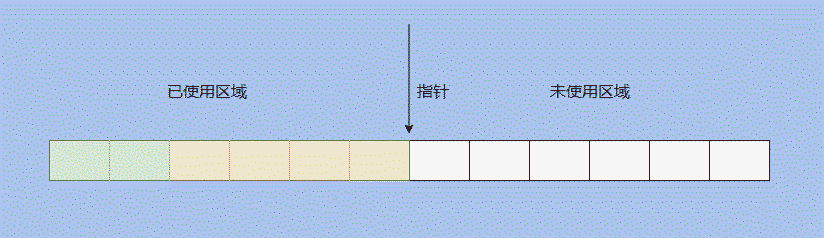

TLAB（Thread Local Allocation Buffer）本地分配缓冲区只允许一个线程申请分配对象、允许所有线程访问这块内存区域。

如果对象不大，就会分配在TLAB, 这样就不需要争抢热点指针，TLAB内存用完了再去申请即可；如果对象大，还是需要在共享的 eden 区分配。

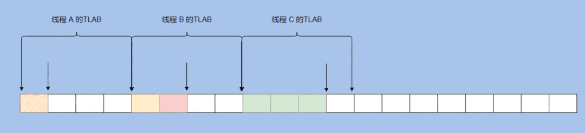

TLAB每次申请的大小不固定，如果剩余内存不够放下新生成的对象就会造成空间浪费。

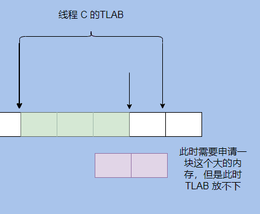

**PLAB**

在多线程并行执行 YGC 时，可能有很多对象需要晋升到老年代，此时老年代的指针就"热"起来了，于是搞了个 PLAB(Promotion Local Allocation Buffers). PLAB和TLAB思想相似，每个线程先申请一块内存作为PLAB, 然后在里面分配晋升的对象。

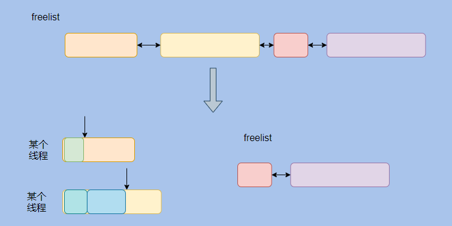

#### Eden 区

如果TLAB盛不下就分配在Eden. （实际上TLAB也位于Eden.）

Eden经过Young GC,要么被清掉，要么进入S0和S1区。

> **时代说明**："Eden + 两块 Survivor 连续布局"是传统 Serial / Parallel 等经典分代收集器的模型。G1 逻辑分代、物理分区（Region 动态扮演 Eden/Survivor/Old，见 §6）；早期 ZGC 不分代（见 §7）。"这个模型快过时了"的原文判断是对的，但要按 G1/ZGC 的具体机制讲，不要笼统说"分代不存在了"。

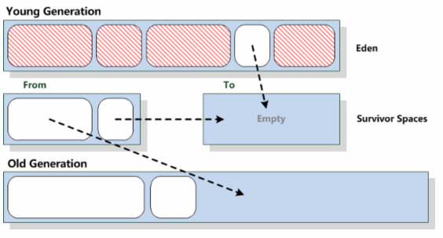

#### BTP

采用栈的形式，将Eden区最晚创建的对象保存在栈顶。

### 对象存储布局

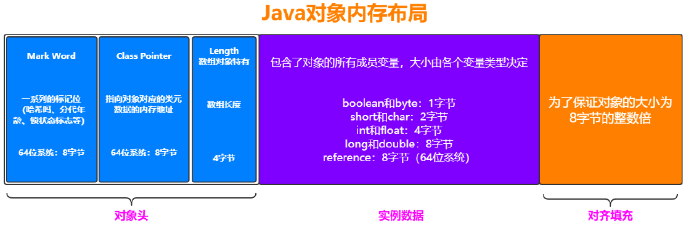

对象在 HotSpot 中的布局：**对象头（Mark Word + Class Pointer）+ 实例数据 + 对齐填充（Padding）**。

使用**jol**工具查看对象的存储布局：

```java
public static void main(String[] args) {
    M m = new M();
    System.out.println(ClassLayout.parseInstance(m).toPrintable());
}
static class M {
}
```

```shell
com.github.ltprc.jvm.jol.JolTest$M object internals:
 OFFSET  SIZE   TYPE DESCRIPTION                               VALUE
      0     4        (object header)                           01 00 00 00 (00000001 00000000 00000000 00000000) (1)
      4     4        (object header)                           00 00 00 00 (00000000 00000000 00000000 00000000) (0)
      8     4        (object header)                           40 02 06 00 (01000000 00000010 00000110 00000000) (393792)
     12     4        (loss due to the next object alignment)
Instance size: 16 bytes
Space losses: 0 bytes internal + 4 bytes external = 4 bytes total
```

引用变量 = 4Byte

Object对象 = 8(Markword) + 4(Classpointer) + 4(Padding) = 16Byte

```java
static class M {
    int a;
}
```

```shell
com.github.ltprc.jvm.jol.JolTest$M object internals:
 OFFSET  SIZE   TYPE DESCRIPTION                               VALUE
      0     4        (object header)                           01 00 00 00 (00000001 00000000 00000000 00000000) (1)
      4     4        (object header)                           00 00 00 00 (00000000 00000000 00000000 00000000) (0)
      8     4        (object header)                           40 02 06 00 (01000000 00000010 00000110 00000000) (393792)
     12     4    int M.a                                       0
Instance size: 16 bytes
Space losses: 0 bytes internal + 0 bytes external = 0 bytes total
```

```java
static class M {
    boolean b;
}
```

```shell
com.github.ltprc.jvm.jol.JolTest$M object internals:
 OFFSET  SIZE      TYPE DESCRIPTION                               VALUE
      0     4           (object header)                           01 00 00 00 (00000001 00000000 00000000 00000000) (1)
      4     4           (object header)                           00 00 00 00 (00000000 00000000 00000000 00000000) (0)
      8     4           (object header)                           40 02 06 00 (01000000 00000010 00000110 00000000) (393792)
     12     1   boolean M.b                                       false
     13     3           (loss due to the next object alignment)
Instance size: 16 bytes
Space losses: 0 bytes internal + 3 bytes external = 3 bytes total
```

Boolean类型会进行"内补齐"，从1补3位变成4.

```java
static class M {
    String s;
}
```

```shell
com.github.ltprc.jvm.jol.JolTest$M object internals:
 OFFSET  SIZE               TYPE DESCRIPTION                               VALUE
      0     4                    (object header)                           01 00 00 00 (00000001 00000000 00000000 00000000) (1)
      4     4                    (object header)                           00 00 00 00 (00000000 00000000 00000000 00000000) (0)
      8     4                    (object header)                           40 02 06 00 (01000000 00000010 00000110 00000000) (393792)
     12     4   java.lang.String M.s                                       null
Instance size: 16 bytes
Space losses: 0 bytes internal + 0 bytes external = 0 bytes total
```

> 注：开启压缩指针（`-XX:+UseCompressedOops`，默认开启）时 Class Pointer 为 4 Byte；Mark Word 在 64 位 HotSpot 下固定 8 Byte，其中记录了 hashCode、GC 分代年龄（age）、锁状态标志等信息。

### 对象引用

#### 指针与引用

指针是地址，在运行时可以改变所指向的地址值，可以被重新赋值，以指向另一个对象。

引用是别名，一旦与某个对象绑定后就不再改变，不过指向的内容可以改变。

指针和引用两者的效率理论上是一致的。

#### 四种引用类型

| 引用类型 | GC回收时间 | 用途           | 生存时间       |
| -------- | ---------- | -------------- | -------------- |
| 强引用   | never      | 对象的一般状态 | JVM停止运行时  |
| 软引用   | 内存不足   | 对象缓存       | 内存不足时终止 |
| 弱引用   | GC时       | 对象缓存       | GC后终止       |
| 虚引用   | unknown    | unknown        | unknown        |

##### 强引用

在Java 中最常见的就是强引用，把一个对象赋给一个引用变量，这个引用变量就是一个强引用。

```java
Object o = new Object();
```

当一个对象被强引用变量引用时，它处于可达状态，它是不可能被垃圾回收机制回收的，即使该对象以后永远都不会被用到JVM也不会回收。因此强引用是造成Java内存泄漏的主要原因之一。

```java
M m = new M();
m = null; //m实例将会被回收
System.gc(); //执行GC
System.out.println(m); //打印为null
Syetem.in.read();//不放这行的话程序退出太快 可以用Thread.sleep()代替
```

##### 软引用

软引用需要用java.lang.ref.SoftReference类来实现，对于只有软引用的对象来说，当系统内存空间不足时它会被JVM回收。因此，这一点可以很好地用来解决OOM的问题。

软引用通常用在对内存敏感的程序中，并且这个特性很适合用来实现**缓存**：比如网页缓存、图片缓存等。

```java
SoftReference<byte[]> m = new SoftReference<>(new byte[1024*1024*10]); //大小为10MB
//m -> SR 强引用
//SR -> byte[] 软引用
System.out.println(m.get()); //通过get()获取软引用的值
System.gc(); //执行GC
Thread.sleep();
System.out.println(m.get()); //通过get()获取软引用的值 没有变化 没被回收
byte[] b = new byte[1024*1024*10]; //创建一个堆快盛不下的大小 造成空间不够 回收软引用 需要提前改小堆的大小
System.out.println(m.get()); //通过get()获取软引用的值 变成null 被回收
```

##### 弱引用

弱引用需要用java.lang.ref.WeakReference类来实现，与软引用的区别在于：只具有弱引用的对象拥有更短暂的生命周期。在垃圾回收器线程扫描它所管辖的内存区域的过程中，一旦发现了只具有弱引用的对象，不管当前内存空间足够与否，都会回收它的内存。不过，由于垃圾回收器是一个优先级很低的线程，因此不一定会很快发现那些只具有弱引用的对象。

如果这个对象是偶尔的使用，并且希望在使用时随时就能获取到，但又不想影响此对象的垃圾收集，那么你应该用Weak Reference来记住此对象。

```java
WeakReference<M> m = new WeakReference<>(new M());
System.out.println(m.get()); //通过get()获取弱引用的值
System.gc(); //执行GC
//中间无需sleep()也可以观察到
System.out.println(m.get()); //通过get()获取弱引用的值 被回收为null
```

WeakHashMap、ThreadLocal 的键都是典型的弱引用使用场景。

##### 虚引用

虚引用需要用java.lang.ref.PhantomReference类来实现，也称为幻影引用，是一种"形同虚设"的引用，虚引用并不会决定对象的生命周期。如果一个对象仅持有虚引用，那么它就和没有任何引用一样，在任何时候都可能被垃圾回收器回收。

虚引用主要用来跟踪对象被垃圾回收器回收的活动。它不能单独使用，必须和**引用队列**(ReferenceQueue)联合使用。当垃圾回收器准备回收一个对象时，如果发现它还有虚引用，就会在回收对象的内存之前，把这个虚引用加入到与之关联的引用队列中。

```java
List<Object> LIST = new LinkedList<>();
ReferenceQueue<M> QUEUE = new ReferenceQueue<>();
PhantomReference<M> m = new PhantomReference<>(new M(), QUEUE);
System.out.println(m.get()); //通过get()获取虚引用的值 是null
new Thread(() -> {
    while (true) {
        LIST.add(new byte[1024 * 1024]); //造成空间不足引发回收
        try {
            Thread.sleep(1000);
        }
        System.out.println(phantomReference.get());
    }
}).start();
//垃圾回收线程
new Thread(() -> {
    while (true) {
        Reference<? extends M> poll = QUEUE.poll();
        if (poll != null) {
            System.out.println("虚引用对象已被回收");
        }
    }
}).start();
```

虚引用主要用作管理**直接内存**和**堆外内存**。

以前，JVM是无法控制堆外由操作系统控制的内存的。

后来出现了NIO的**零拷贝**（zero-copy）技术，可以把堆外的数据拷贝到堆内。为了更方便，使用引用去调用堆外数据取代了拷贝数据。

```java
//JVM内部分配缓冲区
ByteBuffer buffer1 = ByteBuffer.allocate(1024);
//JVM外部分配缓冲区
ByteBuffer buffer2 = ByteBuffer.allocateDirect(1024);
```

可以将buffer设置成虚引用，从而当buffer失效时，可以通知系统去处理堆外对象。

Cleaner是用于回收的对象，它继承于PhantomReference<Object>，使用虚引用对对象进行跟踪。一旦Cleaner内部维护的队列ReferenceQueue<Object> dummyQueue里面出现对象，就说明它要被回收，因为buffer是direct内存，所以需要Cleaner去堆外回收。

### 对象定位

#### 句柄

引用指针 -> 实例数据指针 -> 堆-对象

引用指针 -> 类型数据指针 -> 方法区-类

**长处**：便于GC. GC进行复制的时候，引用指针的值不需要变。

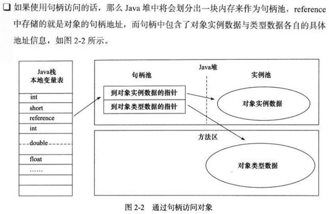

#### 直接指针

引用指针 -> 堆-对象 -> 方法区-类

**长处**：效率高

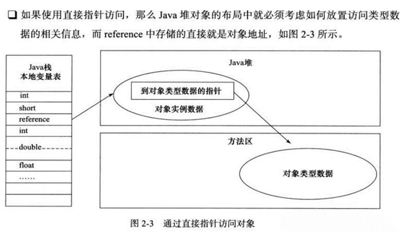

句柄和直接指针两者内存消耗是一样的。

> HotSpot 采用直接指针方式访问对象。

### 为什么 HotSpot 不使用 C++ 对象来代表 Java 对象？

C++对象有个虚函数表，占空间太大，Java没有。

## 5. Garbage Collection Fundamentals

GC 部分回答三个问题：什么是垃圾、如何判定垃圾、如何回收垃圾。前两个本节解决，回收器在 §6-§8。

### 5.1 引用计数法

引用计数器算法算是一种古老的java垃圾回收算法，C++使用这种方式查找垃圾，目前很多版本的java已经废弃。

#### 定义

给每个对象分配一个计算器，当有引用指向这个对象时，计数器加1，当指向该对象的引用失效时，计数器减1。最后如果该对象的计算器为0时，java垃圾回收器会认为该对象是可回收的。

#### 优点

- 实时性：无需等到内存不够才开始回收，运行时根据对象的计数器是否为0，就可以直接回收。

- 应用无需挂起：在垃圾回收过程中，应用无需挂起。如果申请内存时，内存不足，则立刻报outOfMemory错误。

- 区域性：更新对象的计数器时，只是影响到该对象，不会扫描全部对象

#### 缺点

- 每次对象被引用时都需要去更新计数器，有一点时间开销。

- 无法解决循环引用问题。例如：

```java
A a = new A();
B b = new B();
a.b = b;
b.a = a;
a = null;
b = null;
```

- 浪费cpu，即使内存够用，仍然在运行时进行计数器的统计。

> HotSpot 等主流 JVM 不采用引用计数，根本原因就是**循环引用问题**：即使 `a`、`b` 都置 null，两者互相引用使计数器永远不为 0，导致内存永远无法回收。主流方案是下节的可达性分析。

### 5.2 可达性分析

因为程序可以使用引用变量访问对象的属性和调用对象的方法，所以大多数垃圾回收算法使用了**根集**(root set)这个概念，即正在执行的Java程序可以访问的引用变量的集合(包括局部变量、参数、类变量)。JVM会把以下几类对象作为GC Roots：

- 虚拟机栈（栈帧中本地变量表）中引用的对象；
- 方法区中类静态属性引用的对象；
- 方法区中常量引用的对象；
- 本地方法栈中JNI（Native方法）引用的对象。

（补充：JVM 内部的常量、类加载器、Thread 对象、同步锁持有对象等也属于 GC Roots 集合——不同收集器实现略有差异，面试答上面四类即可。）

垃圾回收首先需要确定从根开始哪些对象是可达的、哪些是不可达的，从根集可达的对象都是活动对象，它们不能作为垃圾被回收，这也包括从根集间接可达的对象。

而根集通过任意路径不可达的对象符合垃圾收集的条件，应该被回收，但并不是直接被回收，至少需要进行两次标记才会确定该对象是否被回收：

- 如果对象在进行可达性分析后发现没有与GC Roots相连接的引用链，那它将会被第一次标记。

- 第一次标记后接着会进行一次筛选，筛选的条件是此对象是否有必要执行finalize()方法。finalize()是Object类的方法，为待删除对象做删除前必要的清理工作。垃圾收集器先确定这个对象没有被引用，然后再调用finalize()。

- 在finalize()方法中没有重新与引用链建立关联关系的，将被进行第二次标记。如果对象在finalize()方法中重新与引用链建立了关联关系，那么将会逃离本次回收，继续存活；否则清除。

> 注：finalize() 自 Java 9 起已被标记为 deprecated，工程中应使用 try-with-resources / Cleaner 管理资源（见 CSE2713）。

```java
public class FinalizeEscapeGC {
    public static FinalizeEscapeGC instance = null;

    public void isAlive() {
        System.out.println("isAlive() activited");
    }

    @Override
    protected void finalize() throws Throwable {
// super.finalize();
        System.out.println("finalize method executed");
        instance = this;
    }

    public static void main(String[] args) throws InterruptedException {
        instance = new FinalizeEscapeGC();
        instance = null;
        System.gc();
        Thread.sleep(1000);
        instance.isAlive(); // 在没有重写finalize方法时，肯定是会报nullpointerException的
        instance = null;
        System.gc();
        Thread.sleep(1000);
        if (instance == null) {
            System.out.println("instance does not exist");
        } else {
            System.out.println("instance exists");
        }
    }
}
```

```
finalize method executed
isAlive() activited
instance does not exist
```

### 5.3 标记-清除算法 Mark-Sweep

标记清除算法（Mark-Sweep）这个方法是最基础的垃圾回收算法，将垃圾回收分成了两个阶段：

- **标记阶段** - 标记所有根节点开始可达的对象，未标记的对象就是未被引用的垃圾对象。

- **清除阶段** - 清除掉所有未被标记的对象。

#### 优点

回收效率高（无需移动对象）。

#### 缺点

会产生内存碎片：清除后空闲内存不连续，后续大对象可能无处分配，触发 Full GC。

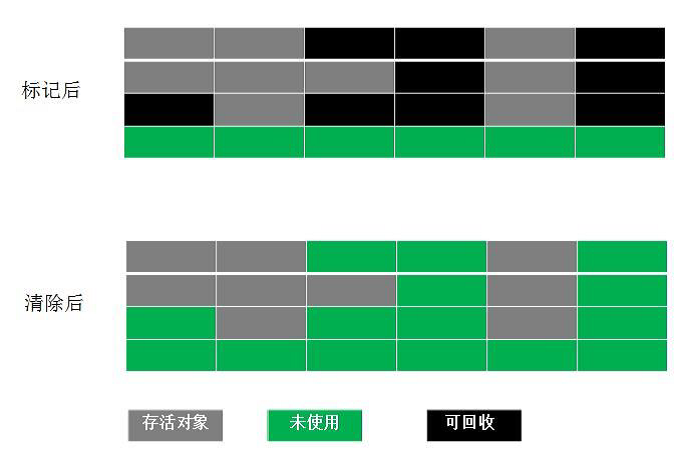

### 5.4 标记-复制算法 Mark-Copying

复制算法（Mark-Copying）是为了解决标记清除算法内存碎片化的缺陷而被提出的算法。核心思想是同一时刻只使用survivor区其中的一块，在垃圾回收时将正在使用的内存中的存活的对象复制到survivor区中未使用的一块，然后清除正在使用的内存块（eden区和另一块survivor区）中所有的对象，然后把survivor区未使用的内存块变成survivor区正在使用的内存块，把survivor区原来使用的内存块变成survivor区未使用的内存块。

适用于**新生代**那些生命周期短、回收频率高的内存对象。

#### 优点

不会产生内存碎片；存活对象少时效率极高。

#### 缺点

空间利用率低（同一时刻有一块 Survivor 闲置）；存活对象多时复制开销大；**对象在内存中移动，引用地址需要更新**（这也是复制/整理类算法必须 STW 的原因之一）。

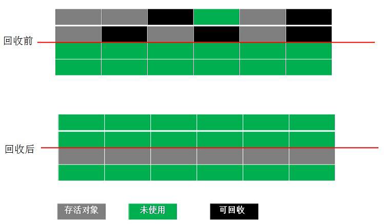

### 5.5 标记-压缩算法 Mark-Compact

标记压缩算法（Mark-Compact）的标记阶段和标记清除Mark-Sweep算法相同，标记后不是清理对象，而是将存活对象移向内存的一端，然后清除端边界外的对象。分为两个阶段：

- **标记阶段** - 标记所有根节点开始可达的对象，未标记的对象就是未被引用的垃圾对象。

- **压缩阶段** - 将这些标记过的对象集中放到一起，确定开始和结束地址，比如全部放到开始处，然后再去清除边界外的对象，这样将不会产生内存碎片。

适用于**老年代**那些生命周期长、回收频率低，但回收一次足够释放内存的场景。

#### 优点

空间利用率高（无碎片）。

#### 缺点

回收效率低：移动存活对象成本高，必须 STW，且要更新所有指向这些对象的引用。

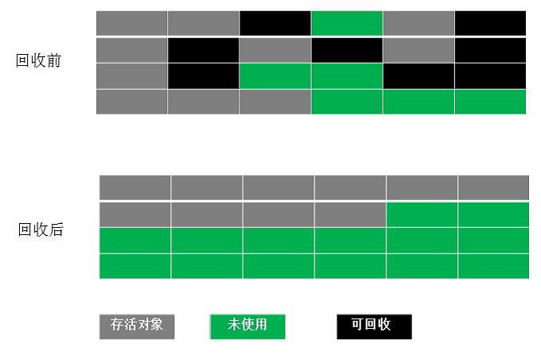

> **三种算法如何组合**：没有"最优"算法。复制算法用空间换碎片-free 和速度（适合存活率低的新生代）；标记-清除不移动对象但留碎片（CMS 老年代并发收集的选择）；标记-压缩无碎片但停顿长（Serial Old / Parallel Old / G1 的转移式回收）。现代收集器都是按分代特征组合使用（见下节）。

### 5.6 分代收集 Generational

分代收集法是目前大部分JVM 所采用的方法，主要思想是根据对象的生命周期长短特点将其划分为不同的域，根据每块内存区间的特点，使用不同的回收算法，从而提高垃圾回收的效率。

理论基础是**分代假说（Generational Hypothesis）**：绝大多数对象朝生夕死（weak generational hypothesis），熬过越多次 GC 的对象越可能继续存活（strong generational hypothesis）。

#### 年轻代 Young Generation

主要用来存放新创建的对象，年轻代分为一个eden区和两个Survivor区：

##### Eden 区

这里有新生的小对象。每当使用关键字new的时候，默认都会在此空间内创建对象。如果创建的对象过多，造成了Eden区内存空间占满，此时，若干次**Minor GC**后还保存的对象将会发生晋级操作。

##### Survivor 区

这里有一些GC后还保存的对象。共有两块空间S0, S1，有一块空间永远都是空的，还存活的对象会在两个Survivor区交替保存，达到一定次数的对象会晋升到老年代。

> **纠错（时代性）**：传统经典收集器（Serial / ParNew / Parallel Scavenge）的新生代默认按 `Eden : S0 : S1 = 8 : 1 : 1`（`-XX:SurvivorRatio=8`）布局，这只是**传统布局默认值**，不是 JVM 规范，更不是现代 G1/ZGC 的统一物理结构——G1 的 Eden/Survivor 是一组 Region 角色，大小随停顿目标动态调整。

#### 老年代 Old Generation

用来存放从年轻代晋升而来的，经历了无数次GC之后依然被保存下来的对象；很大的对象也会直接保存到老年代。

如果老年代空间不足，会出现**Major GC**或者**Full GC**对老年代进行清理，非常耗费性能。

#### 永久代 / 元空间

用来保存类的元数据。如果永久代满了或者是超过了临界值，会触发完全垃圾回收(**Full GC**)，期间永久代也是被回收的。这就是为什么正确的永久代大小对避免Full GC是非常重要的原因。

JDK 1.7及以前是永久代，在JDK 1.8及以后取消了所谓的永久代，而变为了**元空间**，不再在堆内存里面保存，而是直接利用物理内存保存。因此在默认情况下，元空间的大小受到本地内存限制。

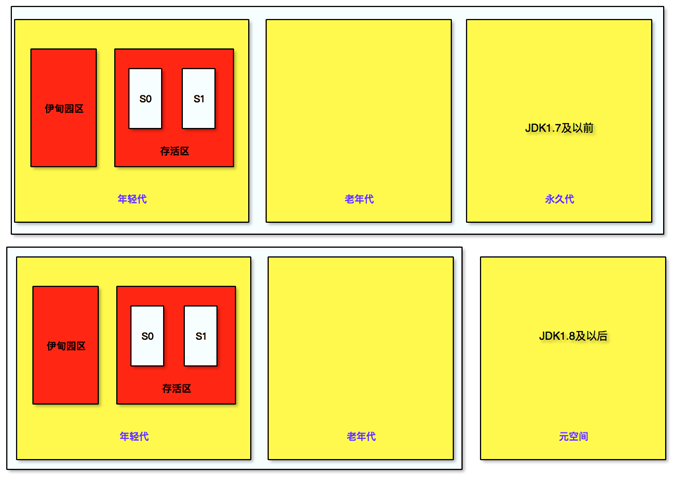

#### Partial GC

并不收集整个GC堆的模式。

##### Minor GC / Young GC

只收集young gen的GC。当young gen中的eden区或s区分配满的时候触发。

##### Major GC / Old GC

只收集old gen的GC。只有CMS的concurrent collection是这个模式。

##### Mixed GC

收集整个young gen以及部分old gen的GC。只有G1有这个模式。

#### Full GC

收集整个堆，包括young gen, old gen, perm gen（如果存在的话）等所有部分的模式。

##### Full GC 触发条件

- Young GC时，年轻代平均晋升大小比老年代剩余空间更大。

- 永久代空间不足。

- 老年代空间不足。

- 执行System.gc()（不是立即），jmap -dump等命令。

> 注：以上是经典分代收集器时代的总结。G1 的 Full GC 概念不同（整堆单线程/并行兜底，见 §6）；DirectBuffer、Metaspace 不足等也有各自的触发路径。

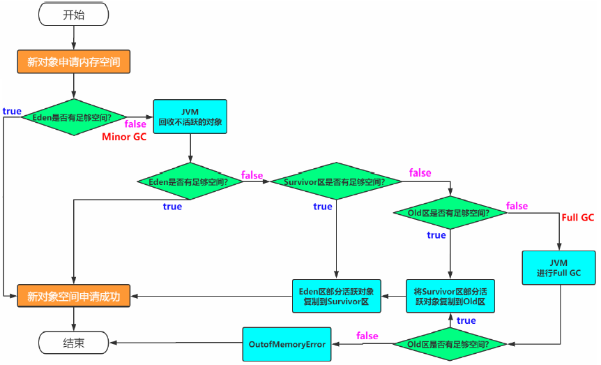

#### 分代方式的进化

- **逻辑分代 + 物理分代**：传统 Serial / ParNew / Parallel / CMS 组合，Java 堆被划分为物理上连续的新生代和老年代。

  其中Serial Old作为CMS出现"Concurrent Mode Failure"失败后的后备预案。

  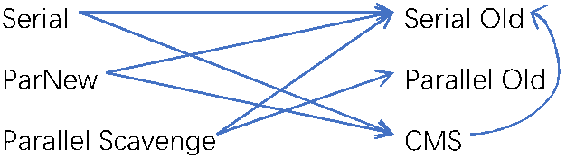

- **逻辑分代 + 物理不分代**：G1——逻辑上仍有 Eden/Survivor/Old（Region 动态扮演角色），物理上整堆切分为等大的 Region。

- **逻辑不分代 + 物理不分代**：Epsilon、Shenandoah、**早期（JDK 11~20）的 ZGC**。

  > **注意（面试常考）**：不能说"ZGC 不分代"作为当前结论——JDK 21 起 ZGC 默认进入**分代模式**（见 §7.3）。

#### 进入老年代的时机

不同垃圾收集器年轻代升级老年代的年龄（次数）：

- PS+PO默认15
- CMS默认6
- G1起逻辑不分代 → **纠错**：G1 仍是逻辑分代的，只是晋升判定不只靠固定年龄阈值，还结合对象占用 Survivor 空间的比例（见下文"动态年龄"）；此处应理解为"G1 没有全局统一的固定晋升年龄参数"。

> 晋升年龄记录在对象头 Mark Word 的 age 位（4 bit，所以上限 15）。

#### 动态年龄判定

年轻代的s1和s2如果互相拷贝超过50%的大小，即使没到上述指定次数，也会将年龄最大的放入老年代。

### 5.7 STW（Stop The World）

不管什么 GC，都会发生 stop-the-world，区别是发生的时间长短。而这个时间跟垃圾收集器又有关系：

- Serial、ParNew、Parallel Scavenge 收集器无论是串行还是并行，都会挂起用户线程；

- 而CMS和G1在并发标记时是不会挂起用户线程的，但其它时候一样会挂起用户线程，stop the world的时间相对来说就小很多了。

## 6. G1 Garbage Collector

### G1 总览

不管并行还是串行算法，实际上都有可能引起大范围的程序暂停问题，导致程序的性能不高。现在最关键的问题是需要去解决大空间下的性能问题，在这样的背景下就产生了 G1 回收算法（**JDK 9 之后的默认收集器**）。

G1(Garbage First)垃圾收集器是目前垃圾收集器理论发展的最前沿成果，相比与CMS收集器，G1收集器最突出的改进是：

- 基于**分区**收集：整堆切分为大量等大的 Region，精确控制每次回收哪些 Region。

- 基于标记-**压缩**（转移式回收，Evacuation）：存活对象被复制到新 Region，天然不产生内存碎片。

- 可设置停顿目标：`-XX:MaxGCPauseMillis`（默认 200ms），在满足吞吐量的前提下实现低停顿垃圾回收。

> **纠错**：原文改进点中写"CMS回收老年代，G1不分代"——不准确。G1 **逻辑上仍然分代**（Region 动态扮演 Eden / Survivor / Old 角色），只是**物理上不再分连续的新生代/老年代**；且 G1 有 Mixed GC 回收部分老年代。另外原文"支持的最大内存为 64G（Region 范围 1-32）"保留作历史笔记：Region 大小实际为 1~32MB 的 2 的幂（`-XX:G1HeapRegionSize`，默认按堆大小推算、目标约 2048 个 Region），G1 并无 64G 的硬性上限。

#### G1 为什么出现（CMS 的局限）

- CMS 只负责老年代、基于标记-**清除**：长期运行产生大量内存碎片，最终 Full GC 被迫压缩（Serial Old 兜底，停顿极长）。
- 浮动垃圾与 **Concurrent Mode Failure**：并发清理期间新垃圾只能留给下次，老年代预留空间不足时直接退化为 Serial Old Full GC。
- 对 CPU 敏感：并发阶段 GC 线程与应用争用 CPU（默认 (CPU+3)/4）。
- 无法做整堆的、以停顿目标为驱动的增量回收——这正是 G1 的设计目标：面向服务端大堆，在可控停顿内回收"垃圾最多"的 Region（Garbage First 名字的由来）。

### Region-based Heap（分区收集）

G1垃圾收集器使用**分区收集算法**。

将堆内存划分成多个连续的、大小相等的独立区域(Region)，每个区间都独立使用，独立回收。虽然还保留新生代和老年代的概念，但是新生代和老年代不是物理隔离。

好处是可以控制一次回收多少个小区间。根据目标停顿时间，每次合理地回收若干个小区间(而不是整个堆)，从而减少一次GC 所产生的停顿。确保G1 收集器可以在有限时间获得最高的垃圾收集效率。

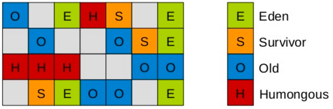

Region 可以扮演的角色：**Eden、Survivor、Old、Humongous、Free**。其中 H（Humongous）专门存放巨型对象，本质上也属于老年代。

#### Humongous Object（巨型对象）

如果一个对象占用的空间超过了分区容量50%以上，G1收集器就认为这是一个巨型对象。这些巨型对象，默认直接会被分配在年老代，但是如果它是一个短期存在的巨型对象，就会对垃圾收集造成负面影响。

为了解决这个问题，G1划分了一个**Humongous区**，它用来专门存放巨型对象。如果一个H区装不下一个巨型对象，那么G1会寻找连续的H分区来存储。为了能找到连续的H区，有时候不得不启动Full GC。

> 工程提示：大对象（如大数组、大字符串、未经压缩的大 JSON）走 Humongous 分配，容易造成 Region 浪费与提前 GC；应控制对象体积、避免频繁分配大对象。

### 三色标记、漏标与错标

并发标记把对象分成三种类型：

- 黑色：根对象，或者该对象与它的子对象都被扫描过。

- 灰色：对象本身被扫描，但还没扫描完该对象的成员对象。

- 白色：未被扫描对象。扫描完成所有对象之后，最终的白色对象为不可达对象，即垃圾对象。

#### 标记过程

- 刚开始，所有的对象都是白色，没有被访问。

- 将GC Roots直接关联的对象置为灰色。

- 遍历灰色对象的所有引用，灰色对象本身置为黑色，引用置为灰色。重复此步骤直到没有灰色对象为止。

- 结束时，黑色对象存活，白色对象回收。

然而，并发标记的过程中，用户线程仍在运行，因此就会产生漏标和错标。

#### 漏标

黑色对象取消了灰色对象的引用，但是由于被取消引用的对象已经变成灰色，所以它和它的引用会继续存活，从而成为浮动垃圾。

**解决**：可以通过「写屏障」来解决，只要在黑色对象写灰色对象的时候加入写屏障，记录下灰色对象被切断的记录，重新标记时可以再把他们标为白色即可。

#### 错标

灰色对象取消了白色对象的引用，改由黑色对象指向了白色对象。白色对象虽然被引用，但是不再被扫描到，于是被回收。

**解决**：

- CMS用了**增量更新**（Incremental update）打破了第一个条件，**关注引用的增加**：如果发现黑色指向了白色，把黑色重新标记为灰色，remark过程将重新扫描属性。不过会造成重复扫描已扫描过的属性。

- G1用了**SATB**（snapshot-at-the-beginning）打破了第二个条件，**关注引用的删除**：当灰色对象对白色对象的引用删除后，将这个引用推到GC的堆栈中，保证白色对象还是能够被扫描到。由于有G1的RSet存在，不需要扫描整个堆去查找指向白色的引用，效率比较高。

### Remembered Set / Card Table（记忆集与卡表）

G1 的记忆集就是个hash table, key就是别的region的起始地址，value是一个存储card table的index的集合。

因为每次引用字段的赋值都需要维护记忆集，开销很大，所以G1的实现利用了logging write barrier的异步思想，会先将修改记录到队列中，当队列超过一定阈值由后台线程取出遍历来更新记忆集。

配套机制：

- **卡表（Card Table）**：把堆划分为 512 字节大小的卡页，用字节数组记录每张卡是否"脏"（存在跨 Region / 跨代引用）。引用类型字段赋值时由**写屏障**（Write Barrier，HotSpot 对"引用赋值"动作的 AOP 式拦截，分写前/写后屏障）把对应卡页置脏；GC 时只需扫描脏卡，避免全堆扫描。
- **Remembered Set（RSet）**：每个 Region 一份，记录"有哪些其它 Region 的对象引用了本 Region 的对象"，配合卡表精确定位跨 Region 引用——这是 G1 并发回收不必扫描整堆的关键，也是 G1 的内存/维护开销来源之一。

### G1 的 GC 类型

#### Young GC

Young GC主要是对Eden区进行GC，它在Eden空间耗尽时会被触发。

在这种情况下，Eden空间的数据移动到Survivor空间中，如果Survivor空间不够，Eden空间的部分数据会直接晋升到年老代空间。Survivor区的数据移动到新的Survivor区中，也有部分数据晋升到老年代空间中。最终Eden空间的数据为空，GC停止工作，应用线程继续执行。

##### 过程

- **根扫描** - 静态和本地对象被扫描
- **更新RS** - 处理dirty card队列更新RS
- **处理RS** - 检测从年轻代指向年老代的对象
- **对象拷贝** - 拷贝存活的对象到survivor/old区域
- **处理引用队列** - 软引用，弱引用，虚引用处理

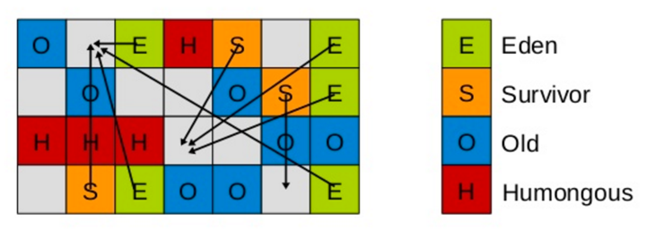

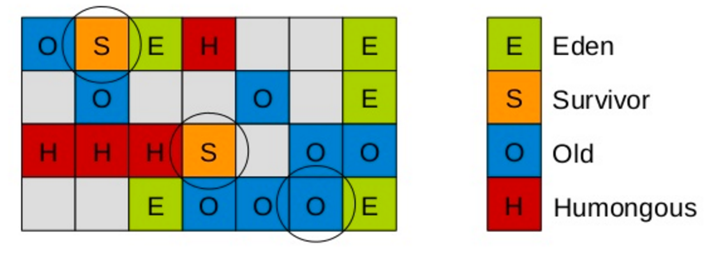

#### Concurrent Marking Cycle（并发标记周期）

当堆使用率达到阈值（`InitiatingHeapOccupancyPercent`，默认 45%）时启动，为 Mixed GC 做准备：

###### 初始标记（stop-the-world事件）

这是一个stop-the-world事件。G1垃圾收集器通过一个正常的年轻代垃圾回收，利用外部的bitmap而不是对象头标记根区域，这些幸存区域可能对年老代中的对象有引用。

###### 根区域扫描

G1垃圾收集器扫描上一步标记的幸存区域，查找对年老代的引用。它在应用程序持续运行时发生。并且只有完成该阶段后，才能开始下一次 STW 年轻代垃圾回收。

###### 并发标记

这个阶段和应用线程并发，G1垃圾收集器在整个堆查找可访问的存活对象。它在应用程序持续运行时同时进行，该阶段可能被年轻代垃圾回收打断。

###### 最终标记/再标记（stop-the-world事件）

完成堆中存活对象的标记。使用一种称为snapshot-at-the-beginning（SATB）算法，它比CMS回收器中使用的算法快得多。

GC过程中新分配的对象也都认为是活的，每个region会维护两个TAMS（top at mark start）指针，分别是prevTAMS和nextTAMS, 标记两次并发标记开始时候Top指针的位置，Top指针就是region中最新分配对象的位置，所以nextTAMS和Top之间区域的对象都是新分配的对象都认为其是存活的即可。

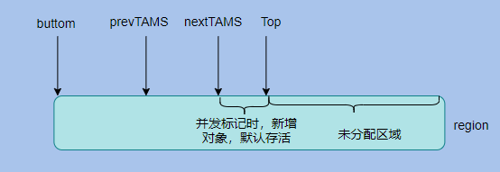

###### 清除（stop-the-world事件）

统计全部存活对象、完全空闲的区域，和CSet（准备进行Mix GC的区域）。擦除RSet。

#### Mixed GC

并发标记完成后进入混合回收：每次停顿（Evacuation Pause）回收**全部年轻代 Region + 依回收价值（垃圾占比）优先排序选出的一批老年代 Region（CSet，Collection Set）**，直到老年代垃圾降到阈值以下。记录日志为 `[GC Pause (mixed)]`（纯年轻代为 `[GC pause (young)]`）。

##### 拷贝存活对象

stop-the-world暂停来撤空或复制存活对象到一个未使用的区域。这可能在年轻代区域完成，记录日志为[GC pause(young)]。或者在年轻代和年老代两类区域完成，记录日志为[GC Pause(mixed)]

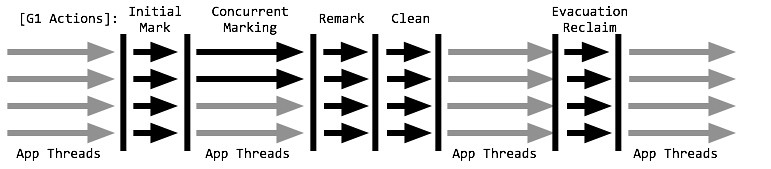

#### Full GC

G1 的 Full GC 是**兜底**：并发回收跟不上分配速度（如 Humongous 分配失败、元空间不足、晋升失败）时触发，整堆回收。JDK 9 及以前是单线程 Serial 实现，JDK 10 起改为并行实现（JEP 307）。Full GC 应尽量避免——出现频繁 Full GC 属于调优信号（调优见 CSE381）。

### 停顿目标 MaxGCPauseMillis

`-XX:MaxGCPauseMillis`（默认 200ms）是 G1 的**停顿目标（soft goal）而非硬性保证**：G1 据此动态调整年轻代大小和每轮 Mixed GC 的 CSet 数量——目标越紧，每轮回收的 Region 越少、回收越频繁。工程上不能把它当 SLA 承诺，停顿是否达标要靠 GC 日志/监控验证。

### Interview Answer — 1~2 分钟讲清 G1

"G1 是 JDK 9 起 HotSpot 的默认服务端收集器，目标是**可预测的停顿**。它把整堆切成大量等大的 Region（1~32MB，约 2048 个），Region 动态扮演 Eden / Survivor / Old / Humongous——逻辑上仍分代，物理上不再分连续的新生代和老年代。回收分三类：Eden 满了触发 **Young GC**（STW，把存活对象复制到 Survivor 或晋升 Old）；堆使用率到 45% 启动**并发标记周期**（初始标记 STW、根区扫描、并发标记、最终标记 STW 用 SATB、清理 STW），找出整堆存活对象；然后做**Mixed GC**——每轮在 `MaxGCPauseMillis`（默认 200ms）目标内，按'垃圾最多优先'选一批老年代 Region 和年轻代一起回收。跨 Region 引用靠每个 Region 的 **RSet + 卡表**记录，SATB 保证并发标记期间不丢对象；存活对象整体复制（转移式回收）所以**没有内存碎片**。收不动时才退化 **Full GC**（JDK 10 起为并行实现）。一句话：G1 = Region 化整堆 + 增量回收 + 停顿目标驱动的回收集选择。"

## 7. ZGC

### ZGC 总览

当前主流垃圾回收算法为G1, 未来的趋势为ZGC（零停顿）垃圾收集器。ZGC于JDK 11登场，是一个可伸缩的、低延迟的垃圾收集器，主要为了满足如下目标进行设计：

- 停顿时间不会超过10ms（停顿时间不会随着堆的增大而增大——不管多大的堆都能保持在10ms以下）

- 可支持几百M，甚至几T的堆大小（Java 11最大支持4TB Java 13最大支持16TB）

> "10ms"应理解为**设计目标**而非承诺；实测大堆下通常远低于 10ms（亚毫秒级常见）。

### ZGC 为什么停顿低

ZGC 把大部分 GC 工作放到与应用线程**并发**的阶段完成（并发标记、并发重定位），只把必须一致的短动作留给 STW（初始标记、再标记、开始重定位等，且这些停顿不随堆增大而增长）。两大核心机制：

#### Colored Pointers（染色指针）

ZGC 将元数据信息（Marked0 / Marked1 / Remapped / Finalizable 等状态位）**直接编码在 64 位指针的高位**上（利用 64 位地址空间远大于实际物理内存的富余位），因此**对象不需要移动即可完成标记状态翻转**——多视图映射（multi-mapping）让同一块物理内存对应多个不同"颜色"的虚拟地址。

#### Load Barriers（读屏障）

每次从堆加载引用时，读屏障检查指针颜色；若颜色"不对"（比如指向尚未重映射的对象），转入慢路径完成自愈（修正引用 / 协助重定位）。这使**重定位可以和应用线程并发进行**，应用几乎无感。

代价：读屏障带来一定吞吐开销，且染色指针利用多视图映射，需要较多**虚拟**地址空间（历史原因曾仅限 64 位；Linux 起步，JDK 14 支持 Windows，JDK 15 支持 macOS）。

### Generational ZGC（分代演进）

> 原文："不管是物理上还是逻辑上，ZGC中已经不存在新老年代的概念了，而是会分为一个个page. 当进行GC操作时会对page进行压缩，因此没有碎片问题。" —— 这描述的是**早期（JDK 11~20）的 Non-generational ZGC**，当时正确。

- **JDK 11~20**：ZGC 不分代（整堆作为一个 Generation，回收单位是 Page/Small/Medium/Large）。
- **JDK 21（JEP 439）**：**Generational ZGC**，分代成为默认模式——年轻代用基于 Region 的复制回收（思想接近 G1），老年代并发标记 + 重定位；性能明显优于非分代模式。
- **JDK 23（JEP 474）**：非分代 ZGC 标记为废弃，随后版本移除。

因此**现代面试中不能再说"ZGC 不分代"**；准确说法是"早期 ZGC 不分代，JDK 21 起默认分代"。（Shenandoah 是另一条低延迟路线：Red Hat 主导，Brooks Pointers + 并发压缩，OpenJDK 内置，Oracle JDK 未提供。）

### G1 vs ZGC

| 维度 | G1 | ZGC |
| ---- | ---- | ---- |
| 定位 | 通用服务端默认（JDK 9+） | 超低延迟、大堆场景 |
| 停顿 | 默认目标 200ms，可配 | 目标 <10ms 且不随堆增长，常见亚毫秒 |
| 堆规模 | GB 级大堆友好 | TB 级（JDK 13 起 16TB） |
| 分代 | 逻辑分代（Region 角色） | JDK 21 起分代（早期不分代） |
| 核心机制 | Region + RSet/卡表 + SATB + 转移式回收 | 染色指针 + 读屏障 + 并发重定位 |
| 吞吐代价 | 较低 | 略高（读屏障 + 并发线程 CPU） |
| 启用方式 | 默认 | `-XX:+UseZGC`（JDK 21+ 分代默认开启） |

选型基于 workload、latency / throughput 指标、堆大小、CPU 余量综合判断，**不是"G1 不行就换 ZGC"**：延迟敏感且堆大再考虑 ZGC，否则 G1 通常更划算。

### Interview Answer — 1~2 分钟讲清 ZGC

"ZGC 是 JDK 11 引入的低延迟收集器，目标是大堆下停顿控制在 10ms 以内且不随堆增大而恶化——标记、重定位等重活全部与应用线程并发，STW 只剩几个毫秒级的短停顿。压低停顿的核心是两个机制：**染色指针**把标记状态（Marked0/Marked1/Remapped 等）塞进 64 位指针高位，对象不移动即可翻转标记；**读屏障**在每次加载引用时检查颜色，发现'坏颜色'转入慢路径自愈，使重定位能和业务并发。早期 ZGC（11~20）不分代，JDK 21 起默认 **Generational ZGC**、非分代模式随后废弃——所以现在不能说'ZGC 不分代'。代价是吞吐略低于 G1、吃 CPU 和虚拟地址空间。选型上 G1 是通用默认，ZGC 适合延迟敏感、TB 级大堆的服务，不是 G1 的替代品而是按指标的补充。"

## 8. Other Garbage Collectors

### 并行时代 – Parallel Scavenge / Parallel Old

JDK 1.4.1中新的收集器都是为解决多处理器系统中垃圾收集器的问题而设计的。

**Parallel Scavenge**收集器是一个多线程垃圾收集器。为**新生代并行**垃圾回收，使用**复制算法**。特点是它的关注点与其他收集器不同。CMS等收集器的关注点是尽可能地缩短垃圾收集时用户线程的停顿时间，而Parallel Scavenge收集器的目标则是达到一个可控制的吞吐量(Throughput)。所谓吞吐量就是CPU用于运行用户代码的时间与CPU总消耗时间的比值，即

$$
吞吐量 = 运行用户代码时间 / (运行用户代码时间 + 垃圾收集时间)
$$

虚拟机总共运行了100分钟，其中垃圾收集花掉1分钟，那吞吐量就是99%。

- MaxGCPauseMillis参数允许的值是一个大于0的毫秒数，收集器将尽可能地保证内存回收花费的时间不超过设定值。

- GCTimeRatio参数的值应当是一个大于0且小于100的整数，也就是垃圾收集时间占总时间的比率，相当于是吞吐量的倒数，用来限制GC的最大时间。
- UseAdaptiveSizePolicy参数是一个开关参数，一旦打开，虚拟机会根据当前系统的运行情况收集性能监控信息，动态调整堆内存的各种GC参数，以提供最合适的停顿时间或者最大的吞吐量，这种调节方式称为GC自适应的调节策略（GC Ergonomics）。

**Parallel Old**收集器是Parallel Scavenge收集器的年老代版本。多线程，**并行**垃圾回收，使用**标记-压缩算法**。

在JDK1.6 之前，新生代使用Parallel Scavenge收集器只能搭配年老代的Serial Old收集器，只能保证新生代的吞吐量优先，无法保证整体的吞吐量。Parallel Old正是为了在年老代同样提供吞吐量优先的垃圾收集器，如果系统对吞吐量要求比较高，可以优先考虑新生代Parallel Scavenge和年老代Parallel Old收集器的搭配策略。

**定位**：吞吐量优先的批处理型收集器（`-XX:+UseParallelGC`，JDK 8 下的服务端默认）。与 G1 相比没有停顿目标与增量回收概念，停顿更长但 CPU 利用率高——适合吞吐敏感、能接受较长停顿的后台任务。ParNew 是其"停顿优化版"（兼容 CMS），本身定位重叠，已随 CMS 一起退出历史舞台。

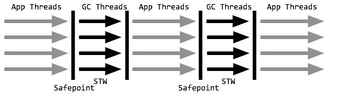

### 串行时代 - Serial + Serial Old

JDK 1.3的时候计算机基本只有一个单核CPU，因此垃圾回收最初的设计实现也是基于单核单线程工作的。并且垃圾回收线程的执行相对于正常业务线程执行来说还是STW（stop the world）的，当内存不足时，串行GC设置停顿标识，待所有线程都进入安全点(Safepoint)时，应用线程暂停，串行GC开始工作，采用单线程方式回收空间并整理内存。

单线程也意味着复杂度更低、占用内存更少，但同时也意味着不能有效利用多核优势。因此，串行收集器特别适合堆内存不高、单核甚至双核CPU的场合。

**Serial**收集器是最基本的垃圾收集器，使用**复制算法**，曾经是JDK1.3.1之前新生代唯一的垃圾收集器。

**Serial Old**收集器是Serial垃圾收集器老年代版本，使用**标记-压缩算法**。

它们是**单线程**的**串行**收集器，只会使用一个CPU或一条收集线程去完成垃圾收集工作，在进行垃圾收集时，必须暂停其他所有的工作线程，直到它收集结束。

下图为新生代Serial收集器搭配老年代Serial Old收集器的GC过程图：

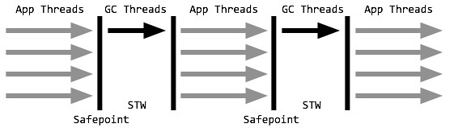

> 现代意义：堆小于百MB的微型应用 / 客户端程序（`-XX:+UseSerialGC`）；同时也是各收集器的兜底（CMS 并发失败、G1 Full GC 的前身思想来源）。

### CMS（Legacy，已从现代 JDK 移除）

> **定位说明**：CMS 在 JDK 9 被标记废弃、**JDK 14 正式移除**，不是现代 GC 主线。本节只保留其基本思想与历史价值，深入机制与调优参数见 Appendix D。

在JDK 1.5时期，HotSpot推出了一款在强交互应用中几乎可称为有划时代意义的**CMS**(Concurrent Mark Sweep)**收集器**，专门用来对**老年代**做**并发**收集。和其他年老代使用标记-整理算法不同，它使用多线程的**标记-清除算法**。其最主要目标是获取最短垃圾回收停顿时间，最短的垃圾收集停顿时间可以为交互比较高的程序提高用户体验。

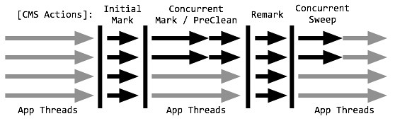

CMS非常适合堆内存大、CPU核数多的服务器端应用，也是G1出现之前大型应用的首选收集器。JDK 1.6以前，如果老年代使用了CMS, 那么新生代只能使用Serial或ParNew收集器。

#### 主要阶段（简化）

- **初始标记 Initial Mark（STW）**：标记直接与GC Root或年轻代存活对象相连的对象。过程非常快，且耗时可控（不随堆变大而明显变慢）。
- **并发标记 Concurrent Mark**：以初始标记对象为根并发遍历整个对象图，耗时最长但不 STW；期间引用变化通过卡表记录为 Dirty。
- **重新标记 Remark（STW）**：处理并发阶段引用关系变化导致的漏标，停顿明显长于初始标记（原始机制的代价所在）。
- **并发清理 Concurrent Sweep**：并发清理未标记（死亡）对象，不移动存活对象、不产生整理。

（预清理 / 可中断预清理等细节与卡表、mod-union table、写屏障机制见 Appendix D。）

#### 存在的问题

##### 对处理器敏感

并发标记、并发清理阶段，虽然CMS不会触发STW，但是标记和清理需要GC线程介入处理，GC线程会占用一定的CPU资源，进而导致程序的性能下降，程序响应速度变慢。CPU核心数多的话还稍微好一点，CPU资源紧张的情况下，GC线程对程序的性能影响非常大。

##### 内存碎片

由于它是标记-清除不是标记-整理，因此会产生内存碎片，Old区会随着时间的推移而终究被耗尽或产生无法分配大对象的情况。最后不得不通过底层的担保机制（CMS背后有串行的回收作为兜底）进行一次Full GC，并进行内存压缩。

##### 浮动垃圾

由于CMS并发清理阶段用户线程还在运行着，伴随程序运行自然就还会有新的垃圾不断产生，这一部分垃圾出现在标记过程之后，CMS无法在当次收集中处理掉它们，只好留待下一次GC时再清理掉。这一部分垃圾就称为"浮动垃圾"。

##### 并发失败 Concurrent Mode Failure

由于浮动垃圾的存在，因此CMS必须预留一部分空间来装载这些新产生的垃圾。CMS不能像Serial Old收集器那样，等到Old区填满了再来清理。

在JDK5时，CMS会在老年代使用了68%的空间时激活，预留了32%的空间来装载浮动垃圾，这是一个比较偏保守的配置。到了JDK6，触发的阈值就被提升至92%，只预留了8%的空间来装载浮动垃圾。

如果CMS预留的内存无法容纳浮动垃圾，那么就会导致「并发失败」，这时JVM不得不触发预备方案，启用Serial Old收集器来回收Old区，这时停顿时间就变得更长了。

#### 为什么被 G1 取代

标记-清除的**碎片**问题无解（越跑越需要 Full GC 压缩）；并发失败退化 Serial Old 反而更慢；只覆盖老年代、无法整堆按停顿目标增量回收；对 CPU 敏感。G1 用"Region + 转移式回收 + 停顿目标"同时解决了这几个问题（JDK 9 起 G1 取代 CMS 成为默认）。

### Shenandoah / Epsilon 简述

- **Shenandoah**：Red Hat 主导的低延迟收集器（OpenJDK 内置，Oracle JDK 不提供），Brooks Pointers + 并发压缩，目标与 ZGC 相近。
- **Epsilon**（JEP 318，JDK 11）：No-op GC，只分配不回收，用于性能基线测试与短生命周期应用。

## 9. Execution & Compilation

### 混合模式 -Xmixed

也就是解释+编译的方式，是默认模式。

对于大部分不常用的代码，不需要浪费时间将其编译成机器码，只需要用到的时候再以解释的方式运行；对于小部分的热点代码，可以采取编译的方式，追求更高的运行效率。因此，Java可以被称为一门编译型+解释型的语言。

```shell
java -version -Xmixed
java version "1.8.0_161"
Java(TM) SE Runtime Environment (build 1.8.0_161-b12)
Java HotSpot(TM) Client VM (build 25.161-b12, mixed mode)
```

监测热点代码的参数为：

```shell
-XX:CompileThreshold=10000
```

> 注：CompileThreshold 是早期 C2 计数阈值；分层编译（Tiered）下由多个计数器（InvocationCounter + BackEdgeCounter）共同决定，现代 JDK 不建议手工调整。

### 纯解释模式 -Xint

启动很快，执行稍慢。

```shell
java -version -Xint
java version "1.8.0_161"
Java(TM) SE Runtime Environment (build 1.8.0_161-b12)
Java HotSpot(TM) Client VM (build 25.161-b12, mixed mode)
```

### 纯编译模式 -Xcomp

需要编译的类如果很多的话，启动很慢，执行很快。

```shell
java -Xcomp -version
java version "1.8.0_161"
Java(TM) SE Runtime Environment (build 1.8.0_161-b12)
Java HotSpot(TM) Client VM (build 25.161-b12, compiled mode)
```

### JIT 即时编译器与分层编译

Java的class文件最终是通过JVM来翻译才能在对应的平台上运行，而这个翻译大多数时候是解释的过程，刚开始执行引擎只采用了解释执行的，但是后来发现某些方法或者代码块被调用执行的特别频繁时，就会把这些代码认定为"热点代码"。热点代码原本应该被解释执行，但是会被执行引擎提前编译为中间文件然后在需要的时候直接运行，提高效率，称之为即时编译器，即**JIT**(Just In Time). 即时编译器先将这些热点代码编译成与本地平台关联的机器码，并且进行各层次的优化，保存到内存中，从而提高运行速度。

HotSpot虚拟机里面内置了两个JIT：C1和C2

- C1也称为Client Compiler，适用于执行时间短或者对启动性能有要求的程序

- C2也称为Server Compiler，适用于执行时间长或者对峰值性能有要求的程序

Java7开始，HotSpot会使用分层编译的方式，也就是会结合C1的启动性能优势和C2的峰值性能优势，热点方法会先被C1编译，然后热点方法中的热点会被C2再次编译。

分层编译等级（Tier 0~4）：0 解释执行 → 1/2/3 C1（含 profiling 的等级 2/3）→ 4 C2 全量优化。

### AOT(Ahead of Time)编译器

Java 9中，引入了AOT编译器。

即时编译器是在程序运行过程中，将字节码翻译成机器码。而AOT是在程序运行之前，将字节码转换为机器码。

##### 优势

这样不需要在运行过程中消耗计算机资源来进行即时编译。

##### 劣势

AOT编译无法得知程序运行时的信息，因此也无法进行基于类层次分析的完全虚方法内联，或者基于程序 profile 的投机性优化（并非硬性限制，我们可以通过限制运行范围，或者利用上一次运行的程序 profile 来绕开这两个限制）。

### Graal 编译器

在Java10中，新的JIT编译器**Graal**被引入，它是一个以Java为主要编程语言，面向字节码的编译器。跟C++实现的C1和C2相比，模块化更加明显，也更加容易维护。

Graal既可以作为动态编译器，在运行时编译热点方法；也可以作为静态编译器，实现AOT编译。

除此之外，它还移除了编程语言之间的边界，并且支持通过即时编译技术，将混杂了不同的编程语言的代码编译到同一段二进制码之中，从而实现不同语言之间的无缝切换。

> 工程现状：GraalVM 走独立路线（Native Image 静态编译为原生镜像，Serverless / CLI 场景价值大）；HotSpot 内置的 Graal JIT（JEP 317，JDK 10 实验引入）未成为默认，C2 仍是主力。

# Appendix — Legacy, Historical & Deep Reference

"降级，不删除"：以下内容仍有参考价值，但当前 Senior Java 面试优先级较低，统一归档于此。

## A. Client VM / Server VM 与 jvm.cfg

HotSpot虚拟机包括两种运行模式：

#### Server VM(-server)

（默认）为在服务器环境中最大化程序执行速度而设计。

#### Client VM(-client)

为在客户端环境中减少启动时间而优化。

### 配置文件的位置

注意是JRE_HOME而不是JDK_HOME

若为64位操作系统 {JRE_HOME}/lib/amd64/jvm.cfg

若为32位操作系统 {JRE_HOME}/lib/i386/jvm.cfg

```
-server  KNOWN
-client  IGNORE
```

其中第一行KNOWN就是默认版本。

## B. 常见 JVM 历史

| 常见JVM      | 备注                                                         |
| ------------ | ------------------------------------------------------------ |
| Hotspot      | 出自SUN（被Oracle收购），Oracle官方JVM                       |
| JRocket      | 出自BEA（被Oracle收购），曾经号称世界上最快的JVM. Oracle不可能花费额外费用去维护两个虚拟机标准，所以现已和Hotspot合并。 |
| J9           | 出自IBM（曾经打算收购SUN）：JVM's, J9.                       |
| Microsoft VM | 出自微软。                                                   |
| TaobaoVM     | Hotspot深度定制版，阿里、天猫都在使用。                      |
| LiquidVM     | 直接针对硬件，不基于Window, Linux等操作系统，效率更高。      |
| Azul Zing    | 出自Azul, 最新垃圾回收的业界标杆，收费高昂。                 |

## C. Class File 二进制结构（Deep Reference）

#### Class文件

##### 格式

Class文件是一个二进制字节流，逻辑上可以划分为以下数据类型：u1, u2, u4, u8, _info(表类型)，u4代表16进制中的8位，同理，u2代表16进制中的4位。

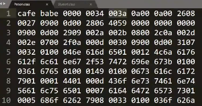

```c++
ClassFile {
    u4             magic;
    //代表当前class文件必须遵循的格式规范，通常以16进制的CAFEBABE开头。
    u2             minor_version;
    //最小版本号，只和JDK版本有关，下图为JDK8中16进制的34，即10进制的52
    u2             major_version;
    //最大版本号，只和JDK版本有关，下图为JDK8中16进制的48，即10进制的72
    u2             constant_pool_count;
    //常量池中的成员个数
    cp_info        constant_pool[constant_pool_count-1];
    //常量池的具体实现，长度为constant_pool_count-1的表
    cp_info {
        u1 tag;//表示当前常量是什么类型的常量，对关系如下：
            CONSTANT_Class	7
            CONSTANT_Fieldref	9
            CONSTANT_Methodref	10
            CONSTANT_InterfaceMethodref	11
            CONSTANT_String	8
            CONSTANT_Integer	3
            CONSTANT_Float	4
            CONSTANT_Long	5
            CONSTANT_Double	6
            CONSTANT_NameAndType	12
            CONSTANT_Utf8	1
            CONSTANT_MethodHandle	15
            CONSTANT_MethodType	16
            CONSTANT_InvokeDynamic	18
        u1 info[];//具体格式还需要根据类型查文档解析
    }
    u2             access_flags;
    //类的访问标识位，用来标识类是否具有pulbic/abstract/interface/final等修饰符。用其中的bit位标识是否存在。例如，如果是public的class，其值为0x0001
    u2             this_class;
    //当前类名
    u2             super_class;
    //父类名
    u2             interfaces_count;
    //当前类实现的接口个数
    u2             interfaces[interfaces_count];
    每一个指向常量池里的接口的全名称
    u2             fields_count;
    当前类的成员变量个数
    field_info     fields[fields_count];
    field_info {
        u2 access_flags 成员变量的访问标识，与上边access_flags相似
        u2 name_index //指向常量池里当前字段的名字
        u2 desc_index //指向常量池里当前字段的描述。例如字符串类型对应的描述是'Ljava.lang.String;'
        u4 attribute_count //字段的属性表个数，跟类的属性表类似。在下面介绍
        attribute_info attributes[attributes_count]; //存放字段的属性信息
    }
    //成员变量信息
    u2             methods_count;
    //当前类的成员方法个数
    method_info    methods[methods_count];
    //成员方法信息
    method_info {
        u2 access_flags //成员方法的访问标识，与上边access_flags相似
        u2 name_index //指向常量池里当前方法的名字
        u2 desc_index //指向常量池里当前方法的描述。比如 public String test(Object o) 方法对应描述是(Ljava.lang.Object;)Ljava.lang.String;
        u4 attribute_count //方法的属性表个数，跟类的属性表类似。在下面介绍
        attribute_info attributes[attributes_count]; //存放方法的属性信息，最重要的属性就是Code,存放了方法的字节码指令
    }
    u2             attributes_count;
    //类的属性表个数
    attribute_info attributes[attributes_count];
    //类的属性信息
    attribute_info attributes {
        u2 attribute_name_index //指向常量池里属性的名称
        u4 attribute_length //下边info内容的长度
        info //属性的内容。不同的属性，内容结构不同
    }
}
```

##### 查看Class文件二进制码

**javap**

javap是一个JDK自带的命令集

-c 对代码进行反汇编，将class文件生成更可读的汇编代码。

-v 查看class文件基本信息。

**JBE**

除了可以观察二进制以外，还可以直接修改。

**JClassLib**

IDEA插件之一。

## D. CMS 深入细节（Deep Reference）

### 完整七阶段

#### 预清理阶段 CMS concurrent preclean

前一个阶段没有标记出老年代全部的存活对象，是因为标记的同时应用程序会改变一些对象引用。

不暂停其他线程，扫描所有标记为Dirty的Card. 这个阶段就是用来处理前一个阶段因为引用关系改变导致没有标记到的存活对象的。（例如图中3在上一个阶段指向了6）

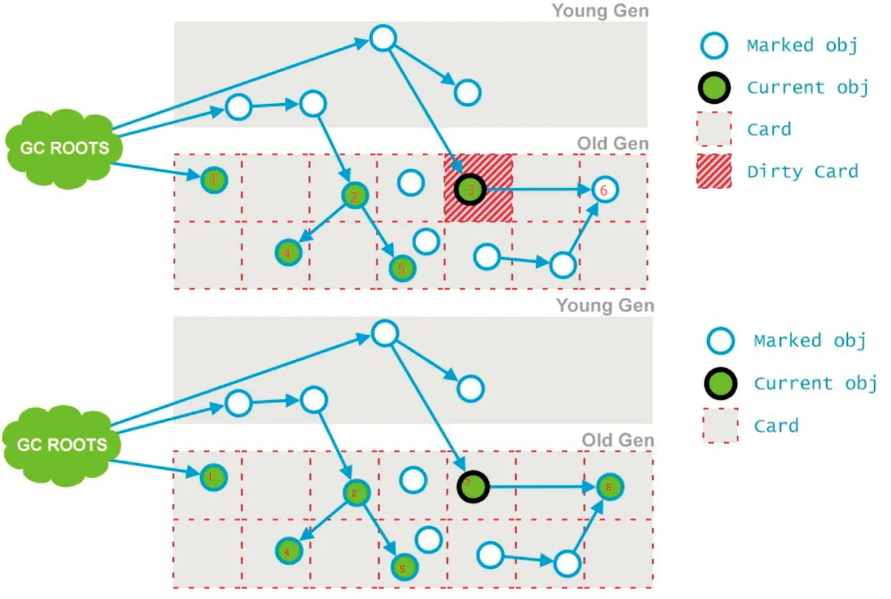

#### 可中断预清理阶段 CMS concurrent abortable preclean

不暂停其他线程，尝试着去承担下一个阶段足够多的重新标记工作。

这个阶段重复做相同的事情，直到发生abort的条件之一才会停止，比如：重复的次数、多少量的工作、持续的时间等等。

此阶段最大持续时间为5秒，之所以可以持续5秒，另外一个原因也是为了期待这5秒内能够发生一次ygc清理年轻代的引用，减少下个阶段的重新标记工作量和用时。

CMS有两个参数：CMSScheduleRemarkEdenSizeThreshold、CMSScheduleRemarkEdenPenetration，默认值分别是2M、50%。两个参数组合起来的意思是预清理后，eden空间使用超过2M时启动可中断的并发预清理（CMS-concurrent-abortable-preclean），直到eden空间使用率达到50%时中断，进入重新标记阶段。

#### 并发标记阶段的引用变化处理

并发标记期间发生新生代的对象晋升到老年代、或者是直接在老年代分配对象、或者更新老年代对象的引用关系等等，这些对象所在的Card都是需要进行重新标记为Dirty的。后续只需扫描这些Dirty Card的对象，避免扫描整个老年代。

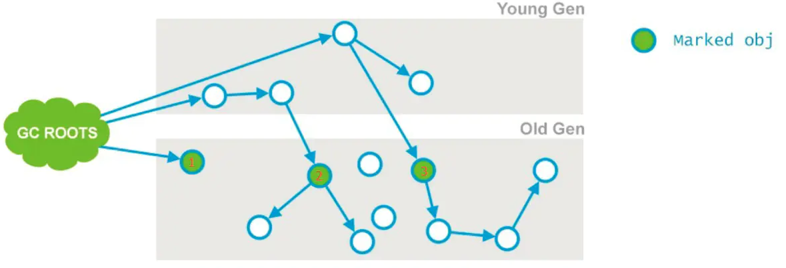

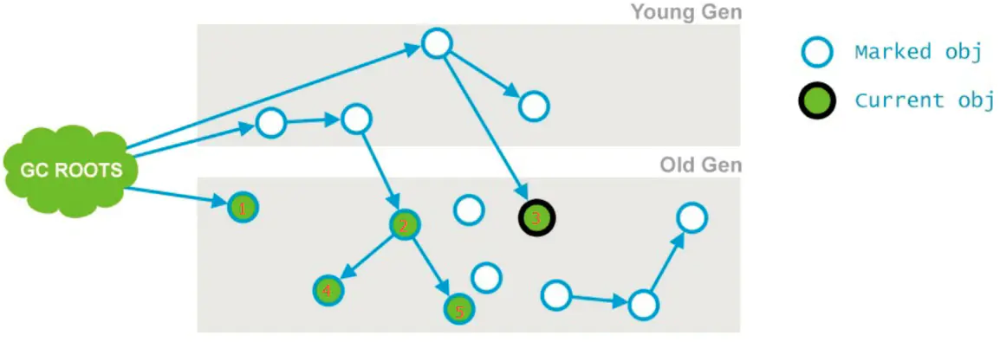

### 记忆集与卡表（CMS 实现）

#### 记忆集 RSet(Remember Set)

利用**记忆集**记录老年代中可能被新生代引用的对象地址，来避免全堆扫描。

记忆集可以采用不同的记录粒度，以节省记忆集的存储和维护成本：

- **字长精度**：每个记录精确到一个机器字长（处理器的寻址位数，如常见的 32 位或 64 位），该字包含跨代指针。

- **对象精度**：每个记录精确到一个对象，该对象中有字段包含跨代指针。

- **卡精度**：每个记录精确到一块内存区域，该区域中有对象包含跨代指针。

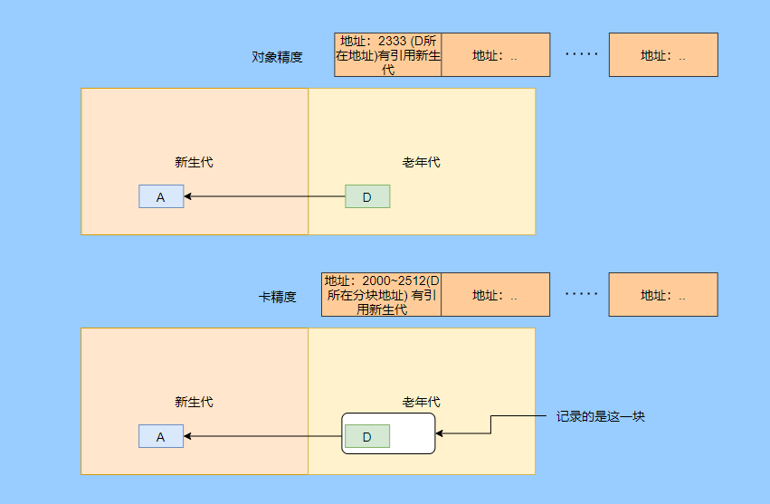

#### 卡表 Card Table

CMS的记忆集是老年代指向年轻代的**卡表**(card table)，卡表是使用一个字节数组实现：CARD_TABLE[this address >>9]=0，它把堆中分为很多块，每块512字节（卡页），值等于1表示脏块，里面存在跨代引用。GC时只要筛选卡表中变脏的元素加入GCRoots.

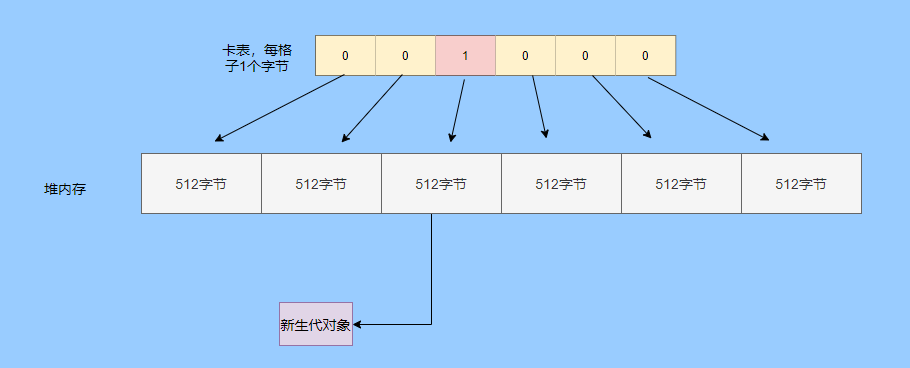

#### mod-union table

卡表其实只有一份，又得用来支持YGC又得支持CMS并发时的增量更新，肯定是不够的，因为每次YGC都会扫描重置卡表，这样增量更新的记录就被清理了。所以还搞了个mod-union table, 在并发标记时，如果发生YGC需要重置卡表的记录时，就会更新mod-union table对应的位置。

这样CMS重新标记阶段就能结合当时的卡表和mod-union table来处理增量更新，防止漏标对象了。

#### 写屏障

HotSpot使用写屏障维护卡表状态，可看做在虚拟机层面对"引用类型字段赋值"动作的AOP切面，在赋值时产生一个环形通知。赋值前后都属于写屏障，赋值前称为"写前屏障（Pre-Write Barrier）"，赋值后称为"写后屏障（Post-Write Barrier）"。

（通用概念：写屏障也是 G1 SATB 与 RSet 维护的实现手段，见 §6。）

### CMS 调优参数（Historical）

#### 内存碎片的缓解

```shell
-XX:CMSFullGCsBeforeCompaction={n}
```

意思是说在上一次CMS并发GC执行过后，到底还要再执行多少次full GC才会做压缩，这个参数可以用来解决内存碎片问题。

#### 浮动垃圾的缓解

降低触发CMS的阈值。

#### 并发失败的缓解

让CMS尽早GC.

```shell
-XX:CMSInitiatingOccupancyFraction=70
```

是指设定CMS在对内存占用率达到70%的时候开始GC。设置大了，会增加concurrent mode failure发生的频率，设置的小了，又会增加CMS频率，所以要根据应用的运行情况来选取一个合理的值。

```shell
-XX:+UseCMSInitiatingOccupancyOnly
```

如果不指定，则JVM仅在第一次使用设定值，后续自行调整。

## E. 其他打破双亲委派的场景

### OSGi

OSGi(Open Service Gateway Initiative)，是基于Java语言的动态模块化规范，类加载器之间是网状结构，更加灵活，但是也更复杂。

基于OSGi 的程序很可能可以实现模块级的热插拔功能，当程序升级更新时，可以只停用、重新安装然后启动程序的其中一部分，这对企业级程序开发来说是非常具有诱惑力的特性。

但并非所有的应用都适合采用OSGi 作为基础架构，它在提供强大功能同时，也引入了额外的复杂度，因为它不遵守了类加载的双亲委托模型。

### JNDI

JNDI服务使用线程上下文类加载器，父类加载器去使用子类加载器。
