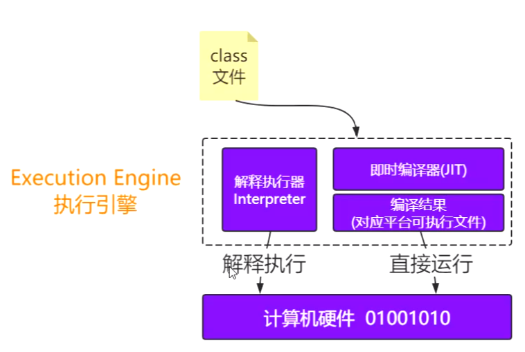

# CSE301 - Java Virtual Machine - 组成

返回[Bulletin](./bulletin.md)

返回[CSE274 - Data Structure and Algorithms](./CSE274.md)

[TOC]


## JDK

JDK(Java Development Kit) 是 Java 语言的软件开发工具包(SDK)。

在JDK的安装目录下有一个jre目录，里面有两个文件夹bin和lib，bin里的就是jvm，lib中则是jvm工作所需要的类库。

### 运行模式

HotSpot虚拟机包括两种运行模式：

#### Server VM(-server)

（默认）为在服务器环境中最大化程序执行速度而设计。

#### Client VM(-client)

为在客户端环境中减少启动时间而优化。

### 配置文件的位置

注意是JRE_HOME而不是JDK_HOME

若为64位操作系统 {JRE_HOME}/lib/amd64/jvm.cfg

若为32位操作系统 {JRE_HOME}/lib/i386/jvm.cfg

```
-server  KNOWN
-client  IGNORE  
```

其中第一行KNOWN就是默认版本。

## JRE

JRE（Java Runtime Environment，Java运行环境），包含JVM标准实现及Java核心类库，有了JRE我们写的java程序才可以运行起来被用户所使用。

JRE是Java运行环境，并不是一个开发环境，所以没有包含任何开发工具（如编译器和调试器）。

## JVM

JVM是Java Virtual Machine（Java虚拟机）的缩写，它通过模拟一个计算机来达到一个计算机所具有的的计算功能。JVM 能够跨计算机体系结构来执行 Java 字节码，主要是由于 JVM 屏蔽了与各个计算机平台相关的软件或者硬件之间的差异，使得与平台相关的耦合统一由 JVM 提供者来实现。

JVM 是运行在操作系统之上的，它与硬件没有直接的交互。


### 常见JVM

| 常见JVM      | 备注                                                         |
| ------------ | ------------------------------------------------------------ |
| Hotspot      | 出自SUN（被Oracle收购），Oracle官方JVM                       |
| JRocket      | 出自BEA（被Oracle收购），曾经号称世界上最快的JVM. Oracle不可能花费额外费用去维护两个虚拟机标准，所以现已和Hotspot合并。 |
| J9           | 出自IBM（曾经打算收购SUN）：JVM's, J9.                       |
| Microsoft VM | 出自微软。                                                   |
| TaobaoVM     | Hotspot深度定制版，阿里、天猫都在使用。                      |
| LiquidVM     | 直接针对硬件，不基于Window, Linux等操作系统，效率更高。      |
| Azul Zing    | 出自Azul, 最新垃圾回收的业界标杆，收费高昂。                 |

### 生命周期

一个运行时的Java虚拟机负责运行一个Java程序。当启动一个Java程序时，一个虚拟机实例也就诞生了。当程序关闭退出，这个虚拟机实例也就随之消亡。

#### 启动

Java虚拟机实例通过调用某个初始类的main()方法来运行一个Java程序。而这个main()方法必须是public static的，返回值为void，并且接受一个String[]数组作为参数。任何拥有这样一个main()方法的类都可以作为Java程序运行的起点。告诉Java虚拟机要运行的Java程序中初始类的名字，整个程序将从它的main()方法开始运行。

#### 守护线程

Java虚拟机内部有两种线程：守护线程和非守护线程。守护线程通常是由虚拟机自己使用的，比如执行垃圾收集任务的线程。不过Java程序也可以把它创建的任何线程通过setDaemon(true)标记为守护线程。但是Java程序中的初始线程-就是开始于main()的那个是非守护线程。

#### 终止

只要还有任何非守护线程在运行，那么这个Java程序也在继续运行(虚拟机仍然存活)。

当程序中的所有的非守护线程都终止时，虚拟机实例自动退出。假如安全管理器允许，程序本身也能够通过调用Runtime类或者System类的exit()方法退出。

### 子系统-类加载器(Class Loader)

在JVM启动时或者类运行时，把Java代码转换成字节码，即class文件，然后加载到内存。

Class loader只管加载，只要符合文件结构就加载，至于能否运行，它不负责，那是由Exectution Engine 负责的。

#### 类加载机制

类的加载指的是将编译好的class类文件中的字节码读入到内存中，将其放在方法区内并创建对应的Class对象。

Java中的所有类，都需要由类加载器装载到JVM中才能运行。

##### 加载 Loading

- 找到Class文件（全路径）到底在哪里。
  - 包括磁盘、内存、数据库、网络等。
  - 不一定非得要获取Class文件，从ZIP 包中读取（比如从jar 包和war 包中读取）、在运行时计算生成（动态代理）、由其它文件生成（比如将JSP 文件转换成对应的Class 类）皆可。

- 将Class的字节流信息存储到**方法区**。

- 将Class文件的对象（Class clazz）存储到**堆**。

##### 连接 Linking

###### 验证 Verification

- 验证Class文件的正确性，确保Class 文件的字节流中包含的信息是否符合当前虚拟机的要求。包括：
  - 文件格式验证
  - 元数据验证
  - 字节码验证
  - 符号引用验证

###### 准备 Prepartion

- 在方法区中为类中由static修饰的静态变量分配存储空间，并且设置初始值。
  - 这里要注意，初始值是0或者null, 而不是代码中设置的具体值。
  - 代码中设置的值是在初始化阶段完成的。另外这里也不包含用final修饰的静态变量，因为final在编译的时候就会分配了。

###### 解析 Resolution

- 虚拟机将常量池中二进制数据的符号引用替换为直接引用的过程。
  - 在编译的时候一个每个java类都会被编译成一个class文件，但在编译的时候虚拟机并不知道所引用类的地址，多以就用符号引用来代替。
  - 符号引用只是符号，JVM认识，但是没有实际含义，不占用物理机的地址和操作码。
  - 直接引用是要落地真实的物理内存的。

- ClassLoader的loadClass方法的第二个参数是boolean类型，如果设置成false会跳过解析步骤。

#### 隐式装载

程序在运行过程中当碰到通过new 等方式生成对象时，隐式调用类装载器加载对应的类到jvm中。

#### 显式装载

通过class.forname()等方法，显式加载需要的类。

#### 双亲委派模型

类加载器之间的层次关系被称为类加载器的双亲委派模型。该模型要求除了顶层的启动类加载器外其余的类加载器都应该有自己的父类加载器，而这种父子关系一般通过组合（Composition）关系来实现，而不是通过继承（Inheritance）。

```java
protected Class<?> loadClass(String name, boolean resolve)
    throws ClassNotFoundException {
    synchronized (getClassLoadingLock(name)) {
        // First, check if the class has already been loaded
        Class<?> c = findLoadedClass(name);
        if (c == null) {
            long t0 = System.nanoTime();
            try {
                if (parent != null) {
                    c = parent.loadClass(name, false);
                } else {
                    c = findBootstrapClassOrNull(name);
                }
            } catch (ClassNotFoundException e) {
                // ClassNotFoundException thrown if class not found
                // from the non-null parent class loader
            }
            if (c == null) {
                // If still not found, then invoke findClass in order
                // to find the class.
                long t1 = System.nanoTime();
                c = findClass(name);
                // this is the defining class loader; record the stats
                PerfCounter.getParentDelegationTime().addTime(t1 - t0);
                PerfCounter.getFindClassTime().addElapsedTimeFrom(t1);
                PerfCounter.getFindClasses().increment();
            }
        }
        if (resolve) {
            resolveClass(c);
        }
        return c;
    }
}
```

先自下而上，检查该类是否已经加载。再自上而下，进行实际查找和加载。


##### 使用原因

主要原因是，双亲委派模型能够保证核心基础的Java类会被根加载器加载，而不会去加载用户自定义的和基础类库相同名字的类，从而保证系统的有序、**安全**。

比如加载位于rt.jar 包中的类java.lang.Object，不管是哪个加载器加载这个类，最终都是委托给顶层的启动类加载器进行加载，这样就保证了使用不同的类加载器最终得到的都是同样一个Object 对象。

次要原因是，可以不必重复加载已经被加载的类，节省资源。

##### 根类加载器（BootStrap）

负责加载Java核心类库。一般用本地代码（C++）实现，不是ClassLoader子类。

加载$JAVA_HOME中jre/lib/rt.jar里的所有class, 或通过-Xbootclasspath参数指定路径中的jar包。

##### 扩展类加载器（Extension）

负责加载Java平台中扩展功能的一些jar包。它的父加载器是Bootstrap类加载器。

加载$JAVA_HOME中jre/lib/*.jar, 或通过-Djava.ext.dirs系统变量指定路径中的类库。

##### 应用/系统类加载器（Application/System）

它是应用最广泛的类加载器，是用户自定义加载器的默认父加载器。它的父加载器是Extension类加载器。

负责加载用户路径（classpath）上的jar包，或通过-Djava.class.path系统变量指定路径中的类库。

##### 用户自定义类加载器

通过java.lang.ClassLoader的子类自定义加载class.

如果不想打破双亲委派模型，那么只需要重写java.lang.ClassLoader的findClass方法中的defineClass(byte[] -> Class clazz)逻辑。如下所示：

```java
public class MyClassLoader extends ClassLoader {
    private String classPrePath = "./";
    public String getClassPrePath() {
        return classPrePath;
    }
    public void setClassPrePath(String classPrePath) {
        this.classPrePath = classPrePath;
    }
    @Override
    protected Class<?> findClass(String name) throws ClassNotFoundException {
        File f = new File(classPrePath, name.replace(".", "/").concat(".class"));
        try {
            FileInputStream fis = new FileInputStream(f);
            ByteArrayOutputStream baos = new ByteArrayOutputStream();
            int b = 0;
            while ((b = fis.read()) !=0) {
                baos.write(b);
            }
            byte[] bytes = baos.toByteArray();
            baos.close();
            fis.close();
            return defineClass(name, bytes, 0, bytes.length);
        } catch (Exception e) {
            e.printStackTrace();
        }
        return super.findClass(name); //throws ClassNotFoundException
    }
    public static void main(String[] args) throws Exception {
        ClassLoader l = new MyClassLoader();
        Class clazz = l.loadClass("com.github.ltprc.jvm.???");
        Class clazz1 = l.loadClass("com.github.ltprc.jvm.???");
        System.out.println(clazz == clazz1);
        /**
         * TODO Define ???
         */
        //??? h = (???)clazz.newInstance();
        //h.m();
        System.out.println(l.getClass().getClassLoader());
        System.out.println(l.getParent());
        System.out.println(getSystemClassLoader());
    }
}
```

如果想打破双亲委派模型，那么就重写整个java.lang.ClassLoader的loadClass方法，在JDK 1.2之前必须如此。

```java
public class T012_ClassReloading2 {
    private static class MyLoader extends ClassLoader {
        @Override
        public Class<?> loadClass(String name) throws ClassNotFoundException {
            File f = new File("C:/work/ijprojects/JVM/out/production/JVM/" + name.replace(".", "/").concat(".class"));
            if(!f.exists()) return super.loadClass(name);
            try {
                InputStream is = new FileInputStream(f);
                byte[] b = new byte[is.available()];
                is.read(b);
                return defineClass(name, b, 0, b.length);
            } catch (IOException e) {
                e.printStackTrace();
            }
            return super.loadClass(name);
        }
    }
}
```

可以通过ClassLoader构造方法指定它的父加载器：

```java
private static class MyLoader extends ClassLoader {
    public MyLoader() {
        super(parentClassLoaderInstance);
    }
}
```

##### 返回类加载器

```java
System.out.println(X.class.getClassLoader());
System.out.println(X.class.getClassLoader().getParent());
System.out.println(X.class.getClassLoader().getParent().getParent());
```

```
jdk.internal.loader.ClassLoaders$AppClassLoader@2077d4de
jdk.internal.loader.ClassLoaders$PlatformClassLoader@7637f22
null
```

Java是用C++编写的，在逻辑上并不存在Bootstrap类加载器的实体。所以打印Bootstrap类加载器的内容将会得到null.

##### Java如何判定两个类相同？

Java 虚拟机不仅要看类的全名是否相同，还要看加载此类的类加载器是否一样。只有两者都相同的情况，才认为两个类是相同的。即便是同样的字节代码，被不同的类加载器加载之后所得到的类，也是不同的。

比如一个 Java 类 com.example.Sample，编译之后生成了字节代码文件 Sample.class。两个不同的类加载器 ClassLoaderA和 ClassLoaderB分别读取了这个 Sample.class文件，并定义出两个 java.lang.Class类的实例来表示这个类。这两个实例是不相同的。对于 Java 虚拟机来说，它们是不同的类。试图对这两个类的对象进行相互赋值，会抛出运行时异常 ClassCastException.

##### JDK 9的优化

JDK 9没有从根本上改变三层类加载器架构和双亲委派模型，但为了新引入的模块化系统的顺利运行，仍然发生了一些值得被注意的变动。

- 首先 ExtensionClassLoader被平台类加载器PlatformClassLoader取代。因为整个JDK都基于模块化进行构建，其中的个java类库就已天然满足了可扩展的需求，所以扩展类加载器就完成了他自己的使命。

- 另外，JDK 9之后出现了BootClassLoader这样一个Java类，启动类加载器现在是在jvm内部和java类库共同协作实现的类加载器。但为了与之前代码兼容，在获取启动类加载器的场景中仍然会返回null，而不会得到BootClassLoader实例

- 最后，委派关系发生了一些变动，当PlatFormCLassLoader以及ApplicationClassLoader收到加载请求的时候，在委派给父加载器前，会先判断该类是否能够归属到某个系统模块中去，如果可以，就会优先委派给那个模块的加载器完成加载。

- 在平台类加载器PlatformClassLoader和ApplicationClassLoader应用类加载器收到加载请求时，在委派给父类加载器之前会先判断该类能否归属到一个系统模块中，如果能，就需要优先委派给负责那个模块的加载器完成加载。

所以JDK 9之后的三层委派模型就成了这样：


##### 违反双亲委派模型的情况

双亲委派模型并不是强制规定的，可以根据需要打破。

###### Tomcat

Tomcat为了实现隔离性，没有遵守这个约定，每个webappClassLoader加载自己的目录下的class文件，不会传递给父类加载器。

| Tomcat自定义的类加载器 | 备注                                                         |
| ---------------------- | ------------------------------------------------------------ |
| commonLoader           | Tomcat最基本的类加载器，加载路径/common/*中的class可以被Tomcat容器本身以及各个Webapp访问。 |
| catalinaLoader         | Tomcat容器私有的类加载器，加载路径/server/*中的class对于Webapp不可见。 |
| sharedLoader           | 各个Webapp共享的类加载器，加载路径`/shared/*`（在tomcat 6之后已经合并到根目录下的lib目录下）中的class对于所有Webapp可见，但是对于Tomcat容器不可见。 |
| WebappClassLoader      | 各个Webapp私有的类加载器，加载路径/WebApp/WEB-INF/*中的class只对当前Webapp可见。 |

当应用需要到某个类时，则会按照下面的顺序进行类加载：

1. 使用bootstrap引导类加载器加载

2. 使用system系统类加载器加载

3. 使用应用类加载器在WEB-INF/classes中加载

4. 使用应用类加载器在WEB-INF/lib中加载

5. 使用common类加载器在CATALINA_HOME/lib中加载

###### OSGI

OSGi(Open Service Gateway Initiative)，是基于Java语言的动态模块化规范，类加载器之间是网状结构，更加灵活，但是也更复杂。

基于OSGi 的程序很可能可以实现模块级的热插拔功能，当程序升级更新时，可以只停用、重新安装然后启动程序的其中一部分，这对企业级程序开发来说是非常具有诱惑力的特性。

但并非所有的应用都适合采用OSGi 作为基础架构，它在提供强大功能同时，也引入了额外的复杂度，因为它不遵守了类加载的双亲委托模型。

###### JNDI

JNDI服务使用线程上下文类加载器，父类加载器去使用子类加载器。

#### 懒加载Lazy-loading

严格讲应该叫做lazy-initializing. Java类的加载是动态的，它并不会一次性将所有类全部加载后再运行，而是保证程序运行的基础类(像是基类)完全加载到jvm中，至于其他类，则在需要的时候才加载。这当然就是为了节省内存开销。

JVM规范并没有规定什么时候加载，但是严格规定了什么时候必须初始化，如下所示：

- 当new, getstatic, putstatic, invokestatic指令访问非final变量时。

- java.lang.reflect对类进行反射调用时。

- 子类被初始化之前。

- 虚拟机启动时被执行的主类。

- 动态语言支持java.lang.invoke.MethodHandle解析结果为REF_getstatic, REF_putstatic, REF_invokestatic的方法句柄时。

#### 混合模式 -Xmixed

也就是解释+编译的方式，是默认模式。

对于大部分不常用的代码，不需要浪费时间将其编译成机器码，只需要用到的时候再以解释的方式运行；对于小部分的热点代码，可以采取编译的方式，追求更高的运行效率。因此，Java可以被称为一门编译型+解释型的语言。

```shell
java -version -Xmixed
java version "1.8.0_161"
Java(TM) SE Runtime Environment (build 1.8.0_161-b12)
Java HotSpot(TM) Client VM (build 25.161-b12, mixed mode)
```

监测热点代码的参数为：

```shell
-XX:CompileThreshold=10000
```

#### 纯解释模式 -Xint

启动很快，执行稍慢。

```shell
java -version -Xint
java version "1.8.0_161"
Java(TM) SE Runtime Environment (build 1.8.0_161-b12)
Java HotSpot(TM) Client VM (build 25.161-b12, mixed mode)
```

#### 纯编译模式 -Xcomp

需要编译的类如果很多的话，启动很慢，执行很快。

```shell
java -Xcomp -version
java version "1.8.0_161"
Java(TM) SE Runtime Environment (build 1.8.0_161-b12)
Java HotSpot(TM) Client VM (build 25.161-b12, compiled mode)
```

#### JIT(Just In Time) 即时编译器

Java的class文件最终是通过JVM来翻译才能在对应的平台上运行，而这个翻译大多数时候是解释的过程，刚开始执行引擎只采用了解释执行的，但是后来发现某些方法或者代码块被调用执行的特别频繁时，就会把这些代码认定为“热点代码”。热点代码原本应该被解释执行，但是会被执行引擎提前编译为中间文件然后在需要的时候直接运行，提高效率，称之为即时编译器，即**JIT**(Just In Time). 即时编译器先将这些热点代码编译成与本地平台关联的机器码，并且进行各层次的优化，保存到内存中，从而提高运行速度。

HotSpot虚拟机里面内置了两个JIT：C1和C2 

- C1也称为Client Compiler，适用于执行时间短或者对启动性能有要求的程序

- C2也称为Server Compiler，适用于执行时间长或者对峰值性能有要求的程序

Java7开始，HotSpot会使用分层编译的方式，也就是会结合C1的启动性能优势和C2的峰值性能优势，热点方法会先被C1编译，然后热点方法中的热点会被C2再次编译。

#### AOT(Ahead of Time)编译器

Java 9中，引入了AOT编译器。

即时编译器是在程序运行过程中，将字节码翻译成机器码。而AOT是在程序运行之前，将字节码转换为机器码。

##### 优势

这样不需要在运行过程中消耗计算机资源来进行即时编译。

##### 劣势

AOT编译无法得知程序运行时的信息，因此也无法进行基于类层次分析的完全虚方法内联，或者基于程序 profile 的投机性优化（并非硬性限制，我们可以通过限制运行范围，或者利用上一次运行的程序 profile 来绕开这两个限制）。

#### Graal编译器

在Java10中，新的JIT编译器**Graal**被引入，它是一个以Java为主要编程语言，面向字节码的编译器。跟C++实现的C1和C2相比，模块化更加明显，也更加容易维护。

Graal既可以作为动态编译器，在运行时编译热点方法；也可以作为静态编译器，实现AOT编译。

除此之外，它还移除了编程语言之间的边界，并且支持通过即时编译技术，将混杂了不同的编程语言的代码编译到同一段二进制码之中，从而实现不同语言之间的无缝切换。

#### Class文件

##### 格式

Class文件是一个二进制字节流，逻辑上可以划分为以下数据类型：u1, u2, u4, u8, _info(表类型)，u4代表16进制中的8位，同理，u2代表16进制中的4位。


```c++
ClassFile {
    u4             magic;
    //代表当前class文件必须遵循的格式规范，通常以16进制的CAFEBABE开头。
    u2             minor_version;
    //最小版本号，只和JDK版本有关，下图为JDK8中16进制的34，即10进制的52
    u2             major_version;
    //最大版本号，只和JDK版本有关，下图为JDK8中16进制的48，即10进制的72
    u2             constant_pool_count;
    //常量池中的成员个数
    cp_info        constant_pool[constant_pool_count-1];
    //常量池的具体实现，长度为constant_pool_count-1的表
    cp_info {
        u1 tag;//表示当前常量是什么类型的常量，对关系如下：
            CONSTANT_Class	7
            CONSTANT_Fieldref	9
            CONSTANT_Methodref	10
            CONSTANT_InterfaceMethodref	11
            CONSTANT_String	8
            CONSTANT_Integer	3
            CONSTANT_Float	4
            CONSTANT_Long	5
            CONSTANT_Double	6
            CONSTANT_NameAndType	12
            CONSTANT_Utf8	1
            CONSTANT_MethodHandle	15
            CONSTANT_MethodType	16
            CONSTANT_InvokeDynamic	18
        u1 info[];//具体格式还需要根据类型查文档解析
    }
    u2             access_flags;
    //类的访问标识位，用来标识类是否具有pulbic/abstract/interface/final等修饰符。用其中的bit位标识是否存在。例如，如果是public的class，其值为0x0001
    u2             this_class;
    //当前类名
    u2             super_class;
    //父类名
    u2             interfaces_count;
    //当前类实现的接口个数
    u2             interfaces[interfaces_count];
    每一个指向常量池里的接口的全名称
    u2             fields_count;
    当前类的成员变量个数
    field_info     fields[fields_count];
    field_info {
        u2 access_flags 成员变量的访问标识，与上边access_flags相似
        u2 name_index //指向常量池里当前字段的名字
        u2 desc_index //指向常量池里当前字段的描述。例如字符串类型对应的描述是'Ljava.lang.String;'
        u4 attribute_count //字段的属性表个数，跟类的属性表类似。在下面介绍
        attribute_info attributes[attributes_count]; //存放字段的属性信息
    }
    //成员变量信息
    u2             methods_count;
    //当前类的成员方法个数
    method_info    methods[methods_count];
    //成员方法信息
    method_info {
        u2 access_flags //成员方法的访问标识，与上边access_flags相似
        u2 name_index //指向常量池里当前方法的名字
        u2 desc_index //指向常量池里当前方法的描述。比如 public String test(Object o) 方法对应描述是(Ljava.lang.Object;)Ljava.lang.String;
        u4 attribute_count //方法的属性表个数，跟类的属性表类似。在下面介绍
        attribute_info attributes[attributes_count]; //存放方法的属性信息，最重要的属性就是Code,存放了方法的字节码指令
    }
    u2             attributes_count;
    //类的属性表个数
    attribute_info attributes[attributes_count];
    //类的属性信息
    attribute_info attributes {
        u2 attribute_name_index //指向常量池里属性的名称
        u4 attribute_length //下边info内容的长度
        info //属性的内容。不同的属性，内容结构不同
    }
}
```

##### 查看Class文件二进制码

**javap**

javap是一个JDK自带的命令集

-c 对代码进行反汇编，将class文件生成更可读的汇编代码。

-v 查看class文件基本信息。

**JBE**

除了可以观察二进制以外，还可以直接修改。

**JClassLib**

IDEA插件之一。

#### 相关错误和异常

| **ClassNotFoundException**                                   | **NoClassDefFoundError**                          |
| ------------------------------------------------------------ | ------------------------------------------------- |
| 从java.lang.Exception继承，是一个Exception类型               | 从java.lang.Error继承，是一个Error类型            |
| 当动态加载Class的时候找不到类会抛出该异常                    | 当编译成功以后执行过程中Class找不到导致抛出该错误 |
| 一般在执行Class.forName()、ClassLoader.loadClass()或ClassLoader.findSystemClass()的时候抛出 | 由JVM的运行时系统抛出                             |

### 子系统-执行引擎(Execution Engine)

执行引擎也叫解释器，负责解释命令，将字节码翻译成底层系统指令再交由CPU去执行。



### 组件-本地接口(Runtime Data Area)

调用C/C++实现的本地方法为java所用，来帮助实现整个程序的功能。

### 组件-运行时数据区(Runtime Data Area)

将内存划分成负责不同功能的存储、记录和调度模块，程序都被加载到这里之后才开始运行。

#### 不同版本对比

##### Hotspot JDK 1.6

- 线程共享区域
  - 方法区（永久代，相比较小）
    - 运行时常量池
    - 字符串常量池
    - 静态变量
    - 类Class的信息
    - 方法Method的信息
    - Code区（方法字节码）
    - 方法表信息
    - ...
  - 堆（相比较大）
    - 对象
    - 数组

- 线程私有区域（几个不同版本没有改动）
  - 程序计数器
  - Java虚拟机栈
  - 本地方法栈

- 对外内存/直接内存
- …

##### Hotspot JDK 1.7

- 线程共享区域
  - 方法区（永久代，相比较小）
    - 类Class的信息
    - 方法Method的信息
    - Code区（方法字节码）
    - 方法表信息
    - ...
  - 堆（相比较大）
    - 对象
    - 数组
    - 运行时常量池【JDK 1.7】
    - 字符串常量池【JDK 1.7】
    - 静态变量【JDK 1.7】

- 线程私有区域（几个不同版本没有改动）
  - 程序计数器
  - Java虚拟机栈
  - 本地方法栈

- 对外内存/直接内存
- …

##### Hotspot JDK 1.8

- 线程共享区域
  - 堆（相比较大）
    - 对象
    - 数组
    - 运行时常量池
    - 字符串常量池
    - 静态变量
    - DirectByteBuffer（此对象可以直接操作对外内存）【JDK 1.8】

- 线程私有区域（几个不同版本没有改动）
  - 程序计数器
  - Java虚拟机栈
  - 本地方法栈

- 对外内存/直接内存
  - 方法区（永久代，相比较小）【JDK 1.8 Oracle收购Sun后因JRocket不兼容方法区作出改动】
    - 类Class的信息
    - 方法Method的信息
    - Code区（方法字节码）
    - 方法表信息
    - ...
  - DirectByteBuffer对应的数据【JDK 1.8】
- …

#### 程序计数器/PC寄存器

程序计数器（Program Counter Register）是一个非常小的内存空间，保存着当前线程所执行的虚拟机字节码的位置。

程序计数器每个线程工作时都有一个独立的计数器进行计数操作，字节码解析器正是通过改变这个计数器的值，来选取下一条需要执行的字节码指令。对象的晋升问题依靠的也是计数器。

程序计数器为执行java方法服务，执行native方法时，程序计数器为空。

##### 生命周期

与线程相同, 依赖用户线程的启动/结束。

##### 异常

程序计数器是唯一一个无OutOfMemoryError的区域。

#### Java虚拟机栈

Java虚拟机栈（Java Virtual Machine Stacks）也叫方法栈，是程序的运行单位的单位，是线程私有的，和线程的生命周期相同。

##### 生命周期

与线程相同, 依赖用户线程的启动/结束。

##### 异常

StackOverflowError - 线程请求的栈深度大于JVM所允许的深度。

OutOfMemoryError – 在JVM允许动态扩展的情况下，无法申请到足够内容。

##### 栈帧

线程在执行**每个方法**时都会同时创建一个**栈帧**，调用方法时创建入栈，方法结束时出栈销毁。无论方法是正常完成还是异常完成（抛出了在方法内未被捕获的异常）都算作方法结束。

###### 执行过程

```java
void a() {
    b();
}
void b() {
    c();
}
void c() {
}
```


###### 存储信息

| 存储信息              | 备注                                   |
| --------------------- | -------------------------------------- |
| 局部变量表/本地变量表 | 存储局部变量的表格                     |
| 操作数栈              | 用于计算的临时数据的存储区             |
| 动态链接              | 当前方法所属于类型的运行时常量池的引用 |
| 返回地址/方法出口     | 记录方法执行完以后，程序继续执行的位置 |

#### 本地方法栈

本地方法栈（Native Method Stack）与虚拟机栈类似，也是用来保存线程执行方法时的信息，只不过虚拟机栈是服务 Java 方法的，而本地方法栈是为虚拟机调用 Native 方法服务的。

native是一个计算机函数，一个Native Method就是一个Java调用非Java代码的接口。方法的实现由非Java语言实现，比如C或C++.

HotSpot VM直接就把本地方法栈和虚拟机栈合二为一。


##### 生命周期

与线程相同, 依赖用户线程的启动/结束。

##### 异常

StackOverflowError - 线程请求的栈深度大于JVM所允许的深度。

OutOfMemoryError - 在JVM允许动态扩展的情况下，无法申请到足够内容。

#### 堆

堆（Java Heap）是jvm管理的内存中最大的一块，堆被所有线程共享，同一块堆内存空间可以被不同的栈内存指向。创建的对象和数组都保存在Java堆内存中。

##### 生命周期

域随虚拟机的启动/关闭而创建/销毁。

##### 异常

当堆内存没有可用的空间时，会抛出OOM异常。

##### 垃圾回收

这里也是垃圾收集器进行垃圾收集的最重要的内存区域。根据对象存活的周期不同，JVM把堆内存进行分代管理，由垃圾回收器来进行对象的回收管理。

#### 方法区

方法区（Methed Area）也是各个线程共享的内存区域，JDK1.7及以前被称为**永久代（Perm space）**，JDK1.8及之后被称为**元空间（Meta space）**。位置不同，内容也不同。

用于存储：

- 类的元信息（类型信息、方法信息、属性信息）

- 方法表

- JIT编译后的代码（机器码）等等

##### 生命周期

域随虚拟机的启动/关闭而创建/销毁。

##### 异常

当方法区没有可用的空间时，会抛出OOM异常。

##### 垃圾回收

Java 1.8之前FGC不会清理，从Java 1.8开始自动清理。

方法区垃圾回收需要同时满足以下条件：

- 类的对象已经全部被回收；

- 加载类的类加载器被回收；
- java.lang.Class对象已经被回收。

#### 直接内存

直接内存并不是JVM运行时数据区的一部分，不受JVM GC管理。但也会被频繁的使用：直接内存是在java堆外的、直接向系统申请的内存空间。通常访问直接内存的速度会优于Java堆。

由于直接内存在java堆外，因此它的大小不会直接受限于Xmx指定的最大堆大小，但是系统内存是有限的，Java堆和直接内存的总和依然受限于操作系统能给出的最大内存。

因此出于性能的考虑，读写频繁的场合可能会考虑使用直接内存。

在JDK 1.4引入的NIO允许Java程序使用直接内存。NIO提供了基于Channel与Buffer的IO方式，它可以使用Native函数库直接分配堆外内存，然后使用DirectByteBuffer对象作为这块内存的引用进行操作。这样就避免了在Java堆和Native堆中来回复制数据，因此在一些场景中可以显著提高性能。

#### 堆 VS 栈

|          | 堆                                                         | 栈                                     |
| -------- | ---------------------------------------------------------- | -------------------------------------- |
| 物理地址 | 物理地址分配不连续，性能慢                                 | 物理地址分配连续，性能快               |
| 内存大小 | 物理地址分配不连续，大小不固定，远大于栈                   | 物理地址分配连续，大小在编译时就固定   |
| 存放内容 | 数据（实例、数组）  注：静态对象存在堆，静态变量存在方法区 | 程序方法的执行（局部变量、返回结果）   |
| 可见度   | 整个应用程序共享可见                                       | 线程私有、线程可见、生命周期和线程相同 |

#### 不同区域的引用关系

##### 栈指向堆

```java
private Object obj=new Object();
```

##### 方法区指向堆

方法区中会存放静态变量，常量等数据，即典型的方法区中元素指向堆中的对象。

```java
private static Object obj=new Object();
```

##### 堆指向方法区

因为对象存在堆，而类信息存在方法区，所以类信息就遵循了堆指向方法区。

