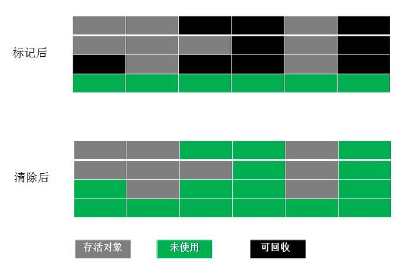
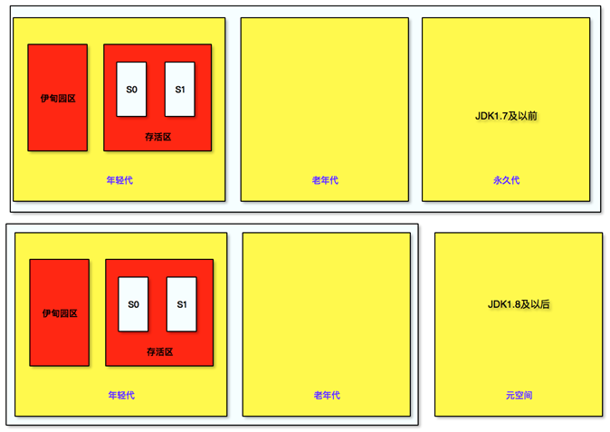

# CSE301 - Java Virtual Machine - 垃圾回收

返回[Bulletin](./bulletin.md)

返回[CSE274 - Data Structure and Algorithms](./CSE274.md)

[TOC]

## 对象

### 创建过程

- new 类名
- 根据new的参数，在常量池中定位类的符号引用。
  - 如果没有定位到，说明类还没有被加载，则进行类的加载、解析和初始化
- 为对象在堆中分配内存
- 将分配的内存初始化为0值
- 调用对象的<init>方法

以以下源码为例：

```java
class T {
    int m = 8;
}
T t = new T();
```

可以使用jclasslibrary插件展示字节码。

```assembly
0 new #2 <T> ;申请一块内存存储T对象
3 dup ;复制一份上面的引用，用于下一步处理，可以先不考虑其逻辑
4 invokespecial #3 <T.<init>> ;半初始化状态，成员的值赋为默认值
7 astore_1 ;变量和新建的对象之间建立关联
8 return ;暂时忽略
```

#### invoke方法调用指令

JVM调用方法有五条指令，分别是：

| 调用指令        | 备注                                                         |
| --------------- | ------------------------------------------------------------ |
| invokestatic    | 用来调用static方法（类方法）                                 |
| invokespecial   | 用来调用需要特殊处理的实例方法，私有方法，父类方法(super.)，初始化方法。在对象的创建过程中，new之后很多都会执行<init>方法，就是依赖字节码中是否包含invokespecial指令。多数方法都是调用invokespecial. |
| invokevirtual   | 用于调用涉及到多态的方法。调用的哪个对象的方法，就把它被调用的方法压入栈中。 |
| invokeinterface | 调用接口方法，在运行时搜索一个实现了这个接口方法的对象，找出适当的方法进行调用。 |
| invokedynamic   | Java 1.7加入，在执行动态语言（运行时产生class文件）时调用。  |

#### 生命周期


##### 栈

new出对象以后，进行**逃逸分析**。只要对象不存在逃逸，即对象仅仅活跃、被调用于某一个方法之内，就优先分配在栈。回收的时候不需要GC介入，栈一弹出，对象就被回收掉，效率相当高。

##### Old区

如果对象特别大，就放在Old区。只有经过Major GC或Full GC才会回收。

##### TLAB

向堆中的新生代申请内存空间时，通常通过一个指针来紧凑划分内存。创建新对象时，指针就右移对象大小即可，这叫指针加法。如果多个线程都在分配对象，那么这个指针就会成为热点资源，需要互斥，分配的效率就会降低。


TLAB（Thread Local Allocation Buffer）本地分配缓冲区只允许一个线程申请分配对象、允许所有线程访问这块内存区域。

如果对象不大，就会分配在TLAB, 这样就不需要争抢热点指针，TLAB内存用完了再去申请即可；如果对象大，还是需要在共享的 eden 区分配。


TLAB每次申请的大小不固定，如果剩余内存不够放下新生成的对象就会造成空间浪费。


**PLAB**

在多线程并行执行 YGC 时，可能有很多对象需要晋升到老年代，此时老年代的指针就“热”起来了，于是搞了个 PLAB(Promotion Local Allocation Buffers). PLAB和TLAB思想相似，每个线程先申请一块内存作为PLAB, 然后在里面分配晋升的对象。


##### Eden区

如果TLAB盛不下就分配在Eden. （实际上TLAB也位于Eden.）

Eden经过Young GC,要么被清掉，要么进入S0和S1区。这个模型快过时了，因为G1逻辑分代物理不分代，ZGC不分代。


#### BTP

采用栈的形式，将Eden区最晚创建的对象保存在栈顶。

### 存储布局


使用**jol**工具查看对象的存储布局：

```java
public static void main(String[] args) {
    M m = new M();
    System.out.println(ClassLayout.parseInstance(m).toPrintable());
}
static class M {
}
```

```shell
com.github.ltprc.jvm.jol.JolTest$M object internals:
 OFFSET  SIZE   TYPE DESCRIPTION                               VALUE
      0     4        (object header)                           01 00 00 00 (00000001 00000000 00000000 00000000) (1)
      4     4        (object header)                           00 00 00 00 (00000000 00000000 00000000 00000000) (0)
      8     4        (object header)                           40 02 06 00 (01000000 00000010 00000110 00000000) (393792)
     12     4        (loss due to the next object alignment)
Instance size: 16 bytes
Space losses: 0 bytes internal + 4 bytes external = 4 bytes total
```

引用变量 = 4Byte

Object对象 = 8(Markword) + 4(Classpointer) + 4(Padding) = 16Byte

```java
static class M {
    int a;
}
```

```shell
com.github.ltprc.jvm.jol.JolTest$M object internals:
 OFFSET  SIZE   TYPE DESCRIPTION                               VALUE
      0     4        (object header)                           01 00 00 00 (00000001 00000000 00000000 00000000) (1)
      4     4        (object header)                           00 00 00 00 (00000000 00000000 00000000 00000000) (0)
      8     4        (object header)                           40 02 06 00 (01000000 00000010 00000110 00000000) (393792)
     12     4    int M.a                                       0
Instance size: 16 bytes
Space losses: 0 bytes internal + 0 bytes external = 0 bytes total
```

```java
static class M {
    boolean b;
}
```

```shell
com.github.ltprc.jvm.jol.JolTest$M object internals:
 OFFSET  SIZE      TYPE DESCRIPTION                               VALUE
      0     4           (object header)                           01 00 00 00 (00000001 00000000 00000000 00000000) (1)
      4     4           (object header)                           00 00 00 00 (00000000 00000000 00000000 00000000) (0)
      8     4           (object header)                           40 02 06 00 (01000000 00000010 00000110 00000000) (393792)
     12     1   boolean M.b                                       false
     13     3           (loss due to the next object alignment)
Instance size: 16 bytes
Space losses: 0 bytes internal + 3 bytes external = 3 bytes total
```

Boolean类型会进行“内补齐”，从1补3位变成4.

```java
static class M {
	String s;
}
```

```shell
com.github.ltprc.jvm.jol.JolTest$M object internals:
 OFFSET  SIZE               TYPE DESCRIPTION                               VALUE
      0     4                    (object header)                           01 00 00 00 (00000001 00000000 00000000 00000000) (1)
      4     4                    (object header)                           00 00 00 00 (00000000 00000000 00000000 00000000) (0)
      8     4                    (object header)                           40 02 06 00 (01000000 00000010 00000110 00000000) (393792)
     12     4   java.lang.String M.s                                       null
Instance size: 16 bytes
Space losses: 0 bytes internal + 0 bytes external = 0 bytes total
```

### 对象引用

#### 指针

指针是地址，在运行时可以改变所指向的地址值，可以被重新赋值，以指向另一个对象。

#### 引用

引用是别名，一旦与某个对象绑定后就不再改变，不过指向的内容可以改变。

指针和引用两者的效率理论上是一致的。

| 引用类型 | GC回收时间 | 用途           | 生存时间       |
| -------- | ---------- | -------------- | -------------- |
| 强引用   | never      | 对象的一般状态 | JVM停止运行时  |
| 软引用   | 内存不足   | 对象缓存       | 内存不足时终止 |
| 弱引用   | GC时       | 对象缓存       | GC后终止       |
| 虚引用   | unknown    | unknown        | unknown        |

##### 强引用

在Java 中最常见的就是强引用，把一个对象赋给一个引用变量，这个引用变量就是一个强引用。

```java
Object o = new Object();
```

当一个对象被强引用变量引用时，它处于可达状态，它是不可能被垃圾回收机制回收的，即使该对象以后永远都不会被用到JVM也不会回收。因此强引用是造成Java内存泄漏的主要原因之一。

```java
M m = new M();
m = null; //m实例将会被回收
System.gc(); //执行GC
System.out.println(m); //打印为null
Syetem.in.read();//不放这行的话程序退出太快 可以用Thread.sleep()代替
```

##### 软引用

软引用需要用java.lang.ref.SoftReference类来实现，对于只有软引用的对象来说，当系统内存空间不足时它会被JVM回收。因此，这一点可以很好地用来解决OOM的问题。

软引用通常用在对内存敏感的程序中，并且这个特性很适合用来实现**缓存**：比如网页缓存、图片缓存等。

```java
SoftReference<byte[]> m = new SoftReference<>(new byte[1024*1024*10]); //大小为10MB
//m -> SR 强引用
//SR -> byte[] 软引用
System.out.println(m.get()); //通过get()获取软引用的值
System.gc(); //执行GC
Thread.sleep();
System.out.println(m.get()); //通过get()获取软引用的值 没有变化 没被回收
byte[] b = new byte[1024*1024*10]; //创建一个堆快盛不下的大小 造成空间不够 回收软引用 需要提前改小堆的大小
System.out.println(m.get()); //通过get()获取软引用的值 变成null 被回收
```

##### 弱引用

弱引用需要用java.lang.ref.WeakReference类来实现，与软引用的区别在于：只具有弱引用的对象拥有更短暂的生命周期。在垃圾回收器线程扫描它所管辖的内存区域的过程中，一旦发现了只具有弱引用的对象，不管当前内存空间足够与否，都会回收它的内存。不过，由于垃圾回收器是一个优先级很低的线程，因此不一定会很快发现那些只具有弱引用的对象。

如果这个对象是偶尔的使用，并且希望在使用时随时就能获取到，但又不想影响此对象的垃圾收集，那么你应该用Weak Reference来记住此对象。

```java
WeakReference<M> m = new WeakReference<>(new M());
System.out.println(m.get()); //通过get()获取弱引用的值
System.gc(); //执行GC
//中间无需sleep()也可以观察到
System.out.println(m.get()); //通过get()获取弱引用的值 被回收为null
```

##### 虚引用

虚引用需要用java.lang.ref.PhantomReference类来实现，也称为幻影引用，是一种“形同虚设”的引用，虚引用并不会决定对象的生命周期。如果一个对象仅持有虚引用，那么它就和没有任何引用一样，在任何时候都可能被垃圾回收器回收。

虚引用主要用来跟踪对象被垃圾回收器回收的活动。它不能单独使用，必须和**引用队列**(ReferenceQueue)联合使用。当垃圾回收器准备回收一个对象时，如果发现它还有虚引用，就会在回收对象的内存之前，把这个虚引用加入到与之关联的引用队列中。

```java
List<Object> LIST = new LinkedList<>();
ReferenceQueue<M> QUEUE = new ReferenceQueue<>();
PhantomReference<M> m = new PhantomReference<>(new M(), QUEUE);
System.out.println(m.get()); //通过get()获取虚引用的值 是null
new Thread(() -> {
    while (true) {
        LIST.add(new byte[1024 * 1024]); //造成空间不足引发回收
        try {
            Thread.sleep(1000);
        }
        System.out.println(phantomReference.get());
    }
}).start();
//垃圾回收线程
new Thread(() -> {
    while (true) {
        Reference<? extends M> poll = QUEUE.poll();
        if (poll != null) {
            System.out.println("虚引用对象已被回收");
        }
    }
}).start();
```

虚引用主要用作管理**直接内存**和**堆外内存**。

以前，JVM是无法控制堆外由操作系统控制的内存的。

后来出现了NIO的**零拷贝**（zero-copy）技术，可以把堆外的数据拷贝到堆内。为了更方便，使用引用去调用堆外数据取代了拷贝数据。

```java
//JVM内部分配缓冲区
ByteBuffer buffer1 = ByteBuffer.allocate(1024); 
//JVM外部分配缓冲区
ByteBuffer buffer2 = ByteBuffer.allocateDirect(1024); 
```

可以将buffer设置成虚引用，从而当buffer失效时，可以通知系统去处理堆外对象。

Cleaner是用于回收的对象，它继承于PhantomReference<Object>，使用虚引用对对象进行跟踪。一旦Cleaner内部维护的队列ReferenceQueue<Object> dummyQueue里面出现对象，就说明它要被回收，因为buffer是direct内存，所以需要Cleaner去堆外回收。

### 对象定位

#### 句柄

引用指针 -> 实例数据指针 -> 堆-对象

引用指针 -> 类型数据指针 -> 方法区-类

##### 长处

便于GC. GC进行复制的时候，引用指针的值不需要变。


#### 直接指针

引用指针 -> 堆-对象 -> 方法区-类

##### 长处

效率高


句柄和直接指针两者内存消耗是一样的。

### 为什么Hotspot不使用C++对象来代表Java对象？

C++对象有个虚函数表，占空间太大，Java没有。

## 引用计数法

引用计数器算法算是一种古老的java垃圾回收算法，C++使用这种方式查找垃圾，目前很多版本的java已经废弃。

### 定义

给每个对象分配一个计算器，当有引用指向这个对象时，计数器加1，当指向该对象的引用失效时，计数器减1。最后如果该对象的计算器为0时，java垃圾回收器会认为该对象是可回收的。

### 优点

- 实时性：无需等到内存不够才开始回收，运行时根据对象的计数器是否为0，就可以直接回收。

- 应用无需挂起：在垃圾回收过程中，应用无需挂起。如果申请内存时，内存不足，则立刻报outOfMemory错误。

- 区域性：更新对象的计数器时，只是影响到该对象，不会扫描全部对象

### 缺点

- 每次对象被引用时都需要去更新计数器，有一点时间开销。

- 无法解决循环引用问题。例如：

```java
A a = new A();
B b = new B();
a.b = b;
b.a = a;
a = null;
b = null;
```

- 浪费cpu，即使内存够用，仍然在运行时进行计数器的统计。

## 可达性分析

因为程序可以使用引用变量访问对象的属性和调用对象的方法，所以大多数垃圾回收算法使用了**根集**(root set)这个概念，即正在执行的Java程序可以访问的引用变量的集合(包括局部变量、参数、类变量)。JVM会把以下几类对象作为GC Roots：

- 虚拟机栈（栈帧中本地变量表）中引用的对象；
- 方法区中类静态属性引用的对象；
- 方法区中常量引用的对象；
- 本地方法栈中JNI（Native方法）引用的对象。

垃圾回收首先需要确定从根开始哪些对象是可达的、哪些是不可达的，从根集可达的对象都是活动对象，它们不能作为垃圾被回收，这也包括从根集间接可达的对象。

而根集通过任意路径不可达的对象符合垃圾收集的条件，应该被回收，但并不是直接被回收，至少需要进行两次标记才会确定该对象是否被回收：

- 如果对象在进行可达性分析后发现没有与GC Roots相连接的引用链，那它将会被第一次标记。

- 第一次标记后接着会进行一次筛选，筛选的条件是此对象是否有必要执行finalize()方法。finalize()是Object类的方法，为待删除对象做删除前必要的清理工作。垃圾收集器先确定这个对象没有被引用，然后再调用finalize()。

- 在finalize()方法中没有重新与引用链建立关联关系的，将被进行第二次标记。如果对象在finalize()方法中重新与引用链建立了关联关系，那么将会逃离本次回收，继续存活；否则清除。

```java
public class FinalizeEscapeGC {
    public static FinalizeEscapeGC instance = null;

    public void isAlive() {
        System.out.println("isAlive() activited");
    }

    @Override
    protected void finalize() throws Throwable {
// super.finalize();
        System.out.println("finalize method executed");
        instance = this;
    }

    public static void main(String[] args) throws InterruptedException {
        instance = new FinalizeEscapeGC();
        instance = null;
        System.gc();
        Thread.sleep(1000);
        instance.isAlive(); // 在没有重写finalize方法时，肯定是会报nullpointerException的
        instance = null;
        System.gc();
        Thread.sleep(1000);
        if (instance == null) {
            System.out.println("instance does not exist");
        } else {
            System.out.println("instance exists");
        }
    }
}
```

```
finalize method executed
isAlive() activited
instance does not exist
```

### 标记-清除算法

标记清除算法（Mark-Sweep）这个方法是最基础的垃圾回收算法，将垃圾回收分成了两个阶段：

- **标记阶段** - 标记所有根节点开始可达的对象，未标记的对象就是未被引用的垃圾对象。

- **清除阶段** - 清除掉所有未被标记的对象。

#### 优点

回收效率高。

#### 缺点

会产生内存碎片。



### 标记-复制算法

复制算法（Mark-Copying）是为了解决标记清除标记-清除算法内存碎片化的缺陷而被提出的算法。核心思想是同一时刻只使用survior区其中的一块，在垃圾回收时将正在使用的内存中的存活的对象复制到survior区中未使用的一块，然后清除正在使用的内存块（eden区和另一块survior区）中所有的对象，然后把survior区未使用的内存块变成survior区正在使用的内存块，把survior区原来使用的内存块变成survior区未使用的内存块。

适用于**新生代**那些生命周期短、回收频率高的内存对象。

#### 优点

不会产生内存碎片。

#### 缺点

空间利用率低。 


### 标记-压缩算法

标记压缩算法（Mark-Compact）的标记阶段和标记清除Mark-Sweep算法相同，标记后不是清理对象，而是将存活对象移向内存的一端，然后清除端边界外的对象。分为两个阶段： 

- **标记阶段** - 标记所有根节点开始可达的对象，未标记的对象就是未被引用的垃圾对象。

- **压缩阶段** - 将这些标记过的对象集中放到一起，确定开始和结束地址，比如全部放到开始处，然后再去清除边界外的对象，这样将不会产生磁盘碎片。

适用于**老年代**那些生命周期长、回收频率低，但回收一次足够释放内存的场景。

#### 优点

空间利用率高。

#### 缺点

回收效率低。


## 垃圾回收器

### 分代法

分代收集法是目前大部分JVM 所采用的方法，主要思想是根据对象的生命周期长短特点将其划分为不同的域，根据每块内存区间的特点，使用不同的回收算法，从而提高垃圾回收的效率。

#### 年轻代

主要用来存放新创建的对象，年轻代分为一个eden区和两个Survivor区：

##### eden区

这里有新生的小对象。每当使用关键字new的时候，默认都会在此空间内创建对象。如果创建的对象过多，造成了Eden区内存空间占满，此时，若干次**Minor GC**后还保存的对象将会发生晋级操作。

##### Survivor区

这里有一些GC后还保存的对象。程序计数器会记录GC的执行次数。共有两块空间S0, S1，有一块空间永远都是空的，还存活的对象会在两个Survivor区交替保存，达到一定次数的对象会晋升到老年代。

年轻代需要考虑两个技术名词：

#### 老年代

用来存放从年轻代晋升而来的，经历了无数次GC之后依然被保存下来的对象；很大的对象也会直接保存到老年代。

如果老年代空间不足，会出现**Major GC**或者**Full GC**对老年代进行清理，非常耗费性能。

#### 永久代

用来保存类的元数据。如果永久代满了或者是超过了临界值，会触发完全垃圾回收(**Full GC**)，期间永久代也是被回收的。这就是为什么正确的永久代大小对避免Full GC是非常重要的原因。

JDK 1.7及以前的永久代，在JDK 1.8及以后取消了所谓的永久代，而变为了**元空间**，不再在堆内存里面保存，而是直接利用物理内存保存。因此在默认情况下，元空间的大小受到本地内存限制。



#### Partial GC

并不收集整个GC堆的模式。

##### Minor GC / Young GC

只收集young gen的GC。当young gen中的eden区或s区分配满的时候触发。

##### Major GC / Old GC

只收集old gen的GC。只有CMS的concurrent collection是这个模式。

##### Mixed GC

收集整个young gen以及部分old gen的GC。只有G1有这个模式。

#### Full GC

收集整个堆，包括young gen, old gen, perm gen（如果存在的话）等所有部分的模式。

##### 触发条件

- Young GC时，年轻代平均晋升大小比老年代剩余空间更大。

- 永久代空间不足。

- 老年代空间不足。

- 执行System.gc()（不是立即），jmap -dump等命令。


### 分代方式进化

#### 逻辑分代+物理分代

Java 堆内存被划分为新生代和年老代两部分。

其中Serial Old作为CMS出现“Concurrent Mode Failure”失败后的后备预案。


##### 进入老年代的时间

不同垃圾收集器年轻代升级老年代的年龄（次数）：

- PS+PO默认15
- CMS默认6
- G1起逻辑不分代

##### 动态年龄

年轻代的s1和s2如果互相拷贝超过50%的大小，即使没到上述指定次数，也会将年龄最大的放入老年代。

#### 逻辑分代+物理不分代

G1

#### 逻辑不分代+物理不分代

Epsilon, ZGC, Shenandoah, ...

### STW

不管什么 GC，都会发送 stop-the-world，区别是发生的时间长短。而这个时间跟垃圾收集器又有关系：

- Serial、PartNew、Parallel Scavenge 收集器无论是串行还是并行，都会挂起用户线程；

- 而CMS和G1在并发标记时是不会挂起用户线程的，但其它时候一样会挂起用户线程，stop the world的时间相对来说就小很多了。

### 串行时代 - Serial收集器 + SerialOld收集器

JDK 1.3的时候计算机基本只有一个单核CPU，因此垃圾回收最初的设计实现也是基于单核单线程工作的。并且垃圾回收线程的执行相对于正常业务线程执行来说还是STW（stop the world）的，当内存不足时，串行GC设置停顿标识，待所有线程都进入安全点(Safepoint)时，应用线程暂停，串行GC开始工作，采用单线程方式回收空间并整理内存。

单线程也意味着复杂度更低、占用内存更少，但同时也意味着不能有效利用多核优势。因此，串行收集器特别适合堆内存不高、单核甚至双核CPU的场合。

**Serial**收集器是最基本的垃圾收集器，使用**复制算法**，曾经是JDK1.3.1之前新生代唯一的垃圾收集器。

**Serial Old**收集器是Serial垃圾收集器老年代版本，使用**标记-压缩算法**。

它们是**单线程**的**串行**收集器，只会使用一个CPU或一条收集线程去完成垃圾收集工作，在进行垃圾收集时，必须暂停其他所有的工作线程，直到它收集结束。

下图为新生代Serial收集器搭配老年代Serial Old收集器的GC过程图：


### 并行时代 – ParNew/Parallel Scavenge/Parallel Old收集器

JDK 1.4.1中新的收集器都是为解决多处理器系统中垃圾收集器的问题而设计的。

**ParNew**收集器是Serial收集器的多线程版本。为**新生代并行**垃圾回收，使用**复制算法**。除了使用多线程进行垃圾收集之外，其余的行为和Serial 收集器完全一样，ParNew 垃圾收集器在垃圾收集过程中同样也要暂停所有其他的工作线程。

**Parallel Scavenge**收集器也是一个多线程垃圾收集器。为**新生代并行**垃圾回收，使用**复制算法**。特点是它的关注点与其他收集器不同。CMS等收集器的关注点是尽可能地缩短垃圾收集时用户线程的停顿时间，而Parallel Scavenge收集器的目标则是达到一个可控制的吞吐量(Throughput)。所谓吞吐量就是CPU用于运行用户代码的时间与CPU总消耗时间的比值，即
$$
吞吐量 = 运行用户代码时间 / (运行用户代码时间 + 垃圾收集时间)
$$
虚拟机总共运行了100分钟，其中垃圾收集花掉1分钟，那吞吐量就是99%。

- MaxGCPauseMillis参数允许的值是一个大于0的毫秒数，收集器将尽可能地保证内存回收花费的时间不超过设定值。

- GCTimeRatio参数的值应当是一个大于0且小于100的整数，也就是垃圾收集时间占总时间的比率，相当于是吞吐量的倒数，用来限制GC的最大时间。
- UseAdaptiveSizePolicy参数是一个开关参数，一旦打开，虚拟机会根据当前系统的运行情况收集性能监控信息，动态调整堆内存的各种GC参数，以提供最合适的停顿时间或者最大的吞吐量，这种调节方式称为GC自适应的调节策略（GC Ergonomics）。

**Parallel Old**收集器是Parallel Scavenge收集器的年老代版本。多线程，**并行**垃圾回收，使用**标记-压缩算法**。

在JDK1.6 之前，新生代使用Parallel Scavenge收集器只能搭配年老代的Serial Old收集器，只能保证新生代的吞吐量优先，无法保证整体的吞吐量。Parallel Old正是为了在年老代同样提供吞吐量优先的垃圾收集器，如果系统对吞吐量要求比较高，可以优先考虑新生代Parallel Scavenge和年老代Parallel Old收集器的搭配策略。

注意，ParNew收集器不兼容Parallel Old收集器。


### 并发时代 - CMS收集器

在JDK 1.5时期，HotSpot推出了一款在强交互应用中几乎可称为有划时代意义的**CMS**(Concurrent Mark Sweep)**收集器**，专门用来对**老年代**做**并发**收集。和其他年老代使用标记-整理算法不同，它使用多线程的**标记-清除算法**。其最主要目标是获取最短垃圾回收停顿时间，最短的垃圾收集停顿时间可以为交互比较高的程序提高用户体验。


CMS非常适合堆内存大、CPU核数多的服务器端应用，也是G1出现之前大型应用的首选收集器。JDK 1.6以前，如果老年代使用了CMS, 那么新生代只能使用Serial或ParNew收集器。

#### 工作机制

CMS工作机制相比其他的垃圾收集器来说更复杂，它主要分为以下七个阶段：

##### 初始标记阶段 CMS initial mark

**暂停所有其他线程**，标记直接与GC Root或者年轻代存活对象相连的对象。这个过程非常快，而且初试标记的耗时不会因为堆空间的变大而变慢，是可控的，因此可以忽略这个过程导致的短暂停顿。


##### 并发标记阶段 CMS concurrent mark

并发标记就是将初始标记的对象进行深度遍历，以这些对象为根，遍历整个对象图。

这个过程耗时较长，而且标记的时间会随着堆空间的变大而变长。不过好在这个过程是不会触发STW的，用户线程仍然可以工作，程序依然可以响应，只是程序的性能会受到一点影响。因为GC线程会占用一定的CPU和系统资源，对处理器比较敏感。CMS默认开启的GC线程数是：(CPU核心数+3)/4，当CPU核心数超过4个时，GC线程会占用不到25%的CPU资源，如果CPU数不足4个，GC线程对程序的影响就会非常大，导致程序的性能大幅降低。

因为是并发运行的，在运行期间会发生新生代的对象晋升到老年代、或者是直接在老年代分配对象、或者更新老年代对象的引用关系等等，这些对象所在的Card都是需要进行重新标记为Dirty的，不负责处理。后续只需扫描这些Dirty Card的对象，避免扫描整个老年代。


##### 预清理阶段 CMS concurrent preclean

前一个阶段没有标记出老年代全部的存活对象，是因为标记的同时应用程序会改变一些对象引用。

不暂停其他线程，扫描所有标记为Dirty的Card. 这个阶段就是用来处理前一个阶段因为引用关系改变导致没有标记到的存活对象的。（例如图中3在上一个阶段指向了6）


##### 可中断预清理阶段 CMS concurrent abortable preclean

不暂停其他线程，尝试着去承担下一个阶段足够多的重新标记工作。

这个阶段重复做相同的事情，直到发生abort的条件之一才会停止，比如：重复的次数、多少量的工作、持续的时间等等。

此阶段最大持续时间为5秒，之所以可以持续5秒，另外一个原因也是为了期待这5秒内能够发生一次ygc清理年轻代的引用，减少下个阶段的重新标记工作量和用时。

CMS有两个参数：CMSScheduleRemarkEdenSizeThreshold、CMSScheduleRemarkEdenPenetration，默认值分别是2M、50%。两个参数组合起来的意思是预清理后，eden空间使用超过2M时启动可中断的并发预清理（CMS-concurrent-abortable-preclean），直到eden空间使用率达到50%时中断，进入重新标记阶段。

##### 重新标记阶段 CMS remark

由于并发标记时，用户线程仍在运行，这意味着并发标记期间，用户线程有可能改变了对象间的引用关系，可能会发生两种情况：一种是原本不能被回收的对象，现在可以被回收了；另一种是原本可以被回收的对象，现在不能被回收了。针对这两种情况，暂停所有的其他线程，标记整个年老代的所有的存活对象。

##### 并发清扫阶段 CMS concurrent sweep

重新标记完成后，就可以开启GC线程对未标记的区域做并发清理了，不暂停其他线程。这个过程耗时也比较长，且清理的开销会随着堆空间的变大而变大。

和并发标记一样，清理时GC线程依然要占用一定的CPU和系统资源，会导致程序的性能降低。

#### 记忆集RSet(Remember Set)

利用**记忆集**记录老年代中可能被新生代引用的对象地址，来避免全堆扫描。

记忆集可以采用不同的记录粒度，以节省记忆集的存储和维护成本：

- **字长精度**：每个记录精确到一个机器字长（处理器的寻址位数，如常见的 32 位或 64 位），该字包含跨代指针。

- **对象精度**：每个记录精确到一个对象，该对象中有字段包含跨代指针。

- **卡精度**：每个记录精确到一块内存区域，该区域中有对象包含跨代指针。


##### 卡表

CMS的记忆集是老年代指向年轻代的**卡表**(card table)，卡表是使用一个字节数组实现：CARD_TABLE[this addredd >>9]=0，它把堆中分为很多块，每块512字节（卡页），值等于1表示脏块，里面存在跨代引用。GC时只要筛选卡表中变脏的元素加入GCRoots.


##### mod-union table

卡表其实只有一份，又得用来支持YGC又得支持CMS并发时的增量更新，肯定是不够的，因为每次YGC都会扫描重置卡表，这样增量更新的记录就被清理了。所以还搞了个mod-union table, 在并发标记时，如果发生YGC需要重置卡表的记录时，就会更新mod-union table对应的位置。

这样CMS重新标记阶段就能结合当时的卡表和mod-union table来处理增量更新，防止漏标对象了。

##### 写屏障

HotSpot使用写屏障维护卡表状态，可看做在虚拟机层面对“引用类型字段赋值”动作的AOP切面，在赋值时产生一个环形通知。赋值前后都属于写屏障，赋值前称为“写前屏障（Pre-Write Barrier）”，赋值后称为“写后屏障（Post-Write Barrier）”。

#### 存在的问题

##### 对处理器敏感

并发标记、并发清理阶段，虽然CMS不会触发STW，但是标记和清理需要GC线程介入处理，GC线程会占用一定的CPU资源，进而导致程序的性能下降，程序响应速度变慢。CPU核心数多的话还稍微好一点，CPU资源紧张的情况下，GC线程对程序的性能影响非常大。

##### 内存碎片

由于它是标记-清除不是标记-整理，因此会产生内存碎片，Old区会随着时间的推移而终究被耗尽或产生无法分配大对象的情况。最后不得不通过底层的担保机制（CMS背后有串行的回收作为兜底）进行一次Full GC，并进行内存压缩。

###### 解决

```shell
-XX:CMSFullGCsBeforeCompaction={n}
```

意思是说在上一次CMS并发GC执行过后，到底还要再执行多少次full GC才会做压缩，这个参数可以用来解决内存碎片问题。

##### 浮动垃圾

由于CMS并发清理阶段用户线程还在运行着，伴随程序运行自然就还会有新的垃圾不断产生，这一部分垃圾出现在标记过程之后，CMS无法在当次收集中处理掉它们，只好留待下一次GC时再清理掉。这一部分垃圾就称为“浮动垃圾”。

###### 解决

降低触发CMS的阈值。

##### 并发失败

由于浮动垃圾的存在，因此CMS必须预留一部分空间来装载这些新产生的垃圾。CMS不能像Serial Old收集器那样，等到Old区填满了再来清理。

在JDK5时，CMS会在老年代使用了68%的空间时激活，预留了32%的空间来装载浮动垃圾，这是一个比较偏保守的配置。如果实际引用中，老年代增长的不是太快，可以通过-XX：CMSInitiatingOccupancyFraction参数适当调高这个值。

到了JDK6，触发的阈值就被提升至92%，只预留了8%的空间来装载浮动垃圾。

如果CMS预留的内存无法容纳浮动垃圾，那么就会导致「并发失败」，这时JVM不得不触发预备方案，启用Serial Old收集器来回收Old区，这时停顿时间就变得更长了。

###### 解决

让CMS尽早GC.

```shell
-XX:CMSInitiatingOccupancyFraction=70
```

是指设定CMS在对内存占用率达到70%的时候开始GC。设置大了，会增加concurrent mode failure发生的频率，设置的小了，又会增加CMS频率，所以要根据应用的运行情况来选取一个合理的值。

```shell
-XX:+UseCMSInitiatingOccupancyOnly
```

如果不指定，则JVM仅在第一次使用设定值，后续自行调整。

### 并发时代 - G1收集器

最初的电脑是没有这么高的硬件配置的，内存最早出现的时候售卖的单位是K. 但是GC发展到了今天已经不单单是以上古老算法了，不管是并行还是串行算法，实际上都有可能引起大范围的程序暂停问题，导致程序的性能不高。现在最关键的问题就需要去解决大空间下的性能问题,在这样的背景下就产生了 G1 回收算法（现在 JDK 1.9 之后的标配算法），支持的最大内存为 64G（每一个小的区域里面可以设置的范围“1 - 32”）。

G1(Garbage first)垃圾收集器是目前垃圾收集器理论发展的最前沿成果，相比与CMS收集器，G1收集器最突出的改进是：

- CMS回收老年代，G1不分代.

- 基于标记-压缩算法，不产生内存碎片。

- 基于分区收集算法，可以非常精确控制停顿时间，在不牺牲吞吐量前提下，实现低停顿垃圾回收。

#### 分区收集算法

G1垃圾收集器使用**分区收集算法**。

将堆内存划分成多个连续的、大小相等的独立区域(Region)，每个区间都独立使用，独立回收。虽然还保留新生代和老年代的概念，但是新生代和老年代不是物理隔离。

好处是可以控制一次回收多少个小区间。根据目标停顿时间，每次合理地回收若干个小区间(而不是整个堆)，从而减少一次GC 所产生的停顿。确保G1 收集器可以在有限时间获得最高的垃圾收集效率。


##### Humongous区

如果一个对象占用的空间超过了分区容量50%以上，G1收集器就认为这是一个巨型对象。这些巨型对象，默认直接会被分配在年老代，但是如果它是一个短期存在的巨型对象，就会对垃圾收集器造成负面影响。

为了解决这个问题，G1划分了一个**Humongous区**，它用来专门存放巨型对象。如果一个H区装不下一个巨型对象，那么G1会寻找连续的H分区来存储。为了能找到连续的H区，有时候不得不启动Full GC。

#### 三色标记算法

我们将对象分成三种类型：

- 黑色：根对象，或者该对象与它的子对象都被扫描过。

- 灰色：对象本身被扫描，但还没扫描完该对象的成员对象。

- 白色：未被扫描对象。扫描完成所有对象之后，最终的白色对象为不可达对象，即垃圾对象。

##### 标记过程

- 刚开始，所有的对象都是白色，没有被访问。

- 将GC Roots直接关联的对象置为灰色。

- 遍历灰色对象的所有引用，灰色对象本身置为黑色，引用置为灰色。重复此步骤直到没有灰色对象为止。
- 结束时，黑色对象存活，白色对象回收。

然而，并发标记的过程中，用户线程仍在运行，因此就会产生漏标和错标。

##### 漏标

黑色对象取消了灰色对象的引用，但是由于被取消引用的对象已经变成灰色，所以它和它的引用会继续存活，从而成为浮动垃圾。

###### 解决

可以通过「写屏障」来解决，只要在黑色对象写灰色对象的时候加入写屏障，记录下灰色对象被切断的记录，重新标记时可以再把他们标为白色即可。

##### 错标

灰色对象取消了白色对象的引用，改由黑色对象指向了白色对象。白色对象虽然被引用，但是不再被扫描到，于是被回收。

###### 解决

- CMS用了**增量更新**（Incremental update）打破了第一个条件，**关注引用的增加**，如果发现黑色指向了白色，把黑色重新标记为白色，remark过程将重新扫描属性。不过会造成重复扫描已扫描过的属性。

- G1用了**SATB**（snapshot-at-the-beginning）打破了第二个条件，**关注引用的删除**，当灰色对象对白色对象的引用删除后，将这个引用推到GC的堆栈中，保证白色对象还是能够被扫描到。由于有G1的Rset（在老年代中有一块区域用来记录指向新生代的引用）存在，不需要扫描整个堆去查找指向白色的引用，效率比较高。

#### Young GC

Young GC主要是对Eden区进行GC，它在Eden空间耗尽时会被触发。

在这种情况下，Eden空间的数据移动到Survivor空间中，如果Survivor空间不够，Eden空间的部分数据会直接晋升到年老代空间。Survivor区的数据移动到新的Survivor区中，也有部分数据晋升到老年代空间中。最终Eden空间的数据为空，GC停止工作，应用线程继续执行。

##### 过程

- **根扫描** - 静态和本地对象被扫描
- **更新RS **- 处理dirty card队列更新RS
- **处理RS** - 检测从年轻代指向年老代的对象
- **对象拷贝 **- 拷贝存活的对象到survivor/old区域
- **处理引用队列** - 软引用，弱引用，虚引用处理


##### 记忆集

G1的记忆集就是个hash table, key就是别的region的起始地址，value是一个存储card table的index的集合。

因为每次引用字段的赋值都需要维护记忆集，开销很大，所以G1的实现利用了logging write barrier的异步思想，会先将修改记录到队列中，当队列超过一定阈值由后台线程取出遍历来更新记忆集。 

#### Mix GC

##### 全局并发标记

###### 初始标记（stop-the-world事件）

这是一个stop-the-world事件。G1垃圾收集器通过一个正常的年轻代垃圾回收，利用外部的bitmap而不是对象头标记根区域，这些幸存区域可能对年老代中的对象有引用。

###### 根区域扫描

G1垃圾收集器扫描上一步标记的幸存区域，查找对年老代的引用。它在应用程序持续运行时发生。并且只有完成该阶段后，才能开始下一次 STW 年轻代垃圾回收。

###### 并发标记

这个阶段和应用线程并发，G1垃圾收集器在整个堆查找可访问的存活对象。它在应用程序持续运行时同时进行，该阶段可能被年轻代垃圾回收打断。

###### 再次标记/最终标记（stop-the-world事件）

完成堆中存活对象的标记。使用一种称为snapshot-at-the-beginning（SATB）算法，它比CMS回收器中使用的算法快得多。

GC过程中新分配的对象也都认为是活的，每个 region会维护两个TAMS（top at mark start）指针，分别是prevTAMS和nextTAMS, 标记两次并发标记开始时候Top指针的位置，Top指针就是region中最新分配对象的位置，所以nextTAMS和Top之间区域的对象都是新分配的对象都认为其是存活的即可。


###### 清除（stop-the-world事件）

统计全部存活对象、完全空闲的区域，和CSet（准备进行Mix GC的区域）。擦除RSet.

##### 拷贝存活对象

###### 复制（stop-the-world）

stop-the-world暂停来撤空或复制存活对象到一个未使用的区域。这可能在年轻代区域完成，记录日志为[GC pause(young)]。或者在年轻代和年老代两类区域完成，记录日志为[GC Pause(mixed)]


### ZGC垃圾收集器

当前主流垃圾回收算法为G1, 未来的趋势为ZGC（零停顿）垃圾收集器。ZGC于JDK 11登场，是一个可伸缩的、低延迟的垃圾收集器，主要为了满足如下目标进行设计：

- 停顿时间不会超过10ms

- 停顿时间不会随着堆的增大而增大（不管多大的堆都能保持在10ms以下）

- 可支持几百M，甚至几T的堆大小（Java 11最大支持4TB Java 13最大支持16TB）

不管是物理上还是逻辑上，ZGC中已经不存在新老年代的概念了，而是会分为一个个page. 当进行GC操作时会对page进行压缩，因此没有碎片问题。由于其是JDK11和只能在64位的linux上使用，因此目前用得还比较少。

