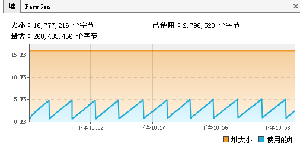
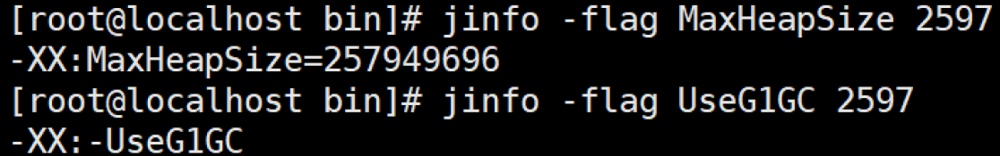

# CSE301 - Java Virtual Machine - 调优

返回[Bulletin](./bulletin.md)

返回[CSE274 - Data Structure and Algorithms](./CSE274.md)

[TOC]

## 调优目标

- GC低停顿和低频率。

- 低内存占用。

- 高吞吐量。

## 调优时机

遇到以下情况就需要考虑进行JVM调优了：

- Heap内存（老年代）持续上涨达到设置的最大内存值；

- Full GC 次数频繁；

- GC 停顿时间过长（超过1秒）；

- 应用出现OutOfMemory 等内存异常；

- 应用中有使用本地缓存且占用大量内存空间；

- 系统吞吐量与响应性能不高或下降。

### 排查CPU100%问题

*某服务器上部署了若干tomcat实例，即若干垂直切分的Java站点服务，以及若干Java微服务，运维突然收到CPU异常告警。*

*问：如何定位是哪个服务进程导致CPU过载？哪个线程导致CPU过载？哪段代码导致CPU过载？*

#### 步骤一：找到最消耗CPU的进程

工具 ： top或者 htop（高级）

方法：top -c 显示进程运行详细列表

键入 P （大写P），按照cpu进行排序


如上图，最耗CPU的进程PID为1865

#### 步骤二：找到最耗CPU的线程

工具：top

方法：top -Hp {PID} ，显示一个进程的线程运行信息列表

键入P (大写p)，线程按照CPU使用率排序


如上图，进程1865内，最耗CPU的线程PID为2747

#### 步骤三：将线程PID转化为16进制

工具：printf

方法：printf “%x\n” 2747


如上图，2747对应的16进制是abbn，当然，这一步可以用计算器。

注意：之所以要转化为16进制，是因为堆栈里，线程id是用16进制表示的。

#### 步骤四：查看堆栈，找到线程在干嘛

工具：pstack/jstack/grep

方法：jstack 10765 | grep ‘0x2a34’ -C5 --color

jstack pid命令查看当前运行程序进程的堆栈状态，通过将该pid转成16进制的值，在thread dump中每个线程都有一个nid，找到对应的nid即可；隔段时间再执行一次stack命令获取thread dump，区分两份dump是否有差别，在nid=0x2a34的线程调用栈中，有多次调用现象就说明该地方可能代码有问题了。

### 排查频繁Full GC问题

#### System.gc()方法的调用

此方法的调用是建议JVM进行Full GC,虽然只是建议而非一定,但很多情况下它会触发 Full GC,从而增加Full GC的频率,也即增加了间歇性停顿的次数。强烈影响系建议能不使用此方法就别使用，让虚拟机自己去管理它的内存。

##### 解决方案

可通过-XX:+DisableExplicitGC来禁止RMI调用System.gc

#### 老年代代空间不足

老年代空间只有在新生代对象转入及创建为大对象、大数组时才会出现不足的现象，当执行Full GC后空间仍然不足，则抛出如下错误：java.lang.OutOfMemoryError: Java heap space

##### 解决方案

尽量做到让对象在Minor GC阶段被回收、让对象在新生代多存活一段时间。

不要创建过大的对象及数组。

使用-XX:+UseCMSCompactAtFullCollection开关参数，在Full GC之后额外免费赠送一个碎片整理的过程。因为内存整理的过程是无法并发的，所以时间变长。

-XX:CMSFullGCsBeforeCompaction, 这个参数用于设置在执行多少次不压缩的Full GC后,跟着来一次带压缩的。

#### 永生区空间不足

JVM规范中运行时数据区域中的方法区，在HotSpot虚拟机中又被习惯称为永生代或者永生区，Permanet Generation中存放的为一些class的信息、常量、静态变量等数据，当系统中要加载的类、反射的类和调用的方法较多时，Permanet Generation可能会被占满，在未配置为采用CMS GC的情况下也会执行Full GC. 如果经过Full GC仍然回收不了，那么JVM会抛出如下错误信息：java.lang.OutOfMemoryError: PermGen space 

##### 解决方案

为避免Perm Gen占满造成Full GC现象，可采用的方法为增大Perm Gen空间或转为使用CMS GC.

#### CMS GC时出现promotion failed和concurrent mode failure

对于采用CMS进行老年代GC的程序而言，尤其要注意GC日志中是否有promotion failed和concurrent mode failure两种状况，当这两种状况出现时可能会触发Full GC。

promotion failed是在进行Minor GC时，survivor space放不下、对象只能放入老年代，而此时老年代也放不下造成的；

concurrent mode failure是在执行CMS GC的过程中同时有对象要放入老年代，而此时老年代空间不足造成的（有时候“空间不足”是CMS GC时当前的浮动垃圾过多导致暂时性的空间不足触发Full GC）。

##### 解决方案

增大survivor space、老年代空间或调低触发并发GC的比率，但在JDK 5.0+、6.0+的版本中有可能会由于JDK的bug29导致CMS在remark完毕后很久才触发sweeping动作。对于这种状况，可通过设置-XX: CMSMaxAbortablePrecleanTime=5（单位为ms）来避免。

#### 定时任务

对于使用RMI来进行RPC或管理的Sun JDK应用而言，默认情况下会一小时执行一次Full GC。

##### 解决方案

可通过在启动时通过- java -Dsun.rmi.dgc.client.gcInterval=3600000来设置Full GC执行的间隔时间。

或通过-XX:+DisableExplicitGC来禁止RMI调用System.gc

## 堆溢出 StackOverflowError

示例代码如下

```java
public class StackDemo {
    public static long count=0;
    public static void method(long i) {
        System.out.println(count++);
        method(i);
    }
    public static void main(String[] args) {
        method(1);
    }
}
```

运行结果和报错：

```
7252
7253
7254
7255
Exception in thread "main" java.lang.StackOverflowError
    at sun.nio.cs.UTF_8$Encoder.encodeLoop(UTF_8.java:691)
    at java.nio.charset.CharsetEncoder.encode(Charset.Encoder.java:579)
```

Stack Space用来做方法的递归调用时压入Stack Frame(栈帧)。所以当递归调用太深的时候，就有可能耗尽Stack Space，报出栈溢出StackOverflow的错误。

根据应用的线程所需内存大小进行调整。在相同物理内存下，通过减小以下参数的值，能生成更多的线程。

```shell
-Xss128k
```

设置每个线程的堆栈大小。JDK 5以后每个线程堆栈大小为1M，以前每个线程堆栈大小为256K。

但是操作系统对一个进程内的线程数还是有限制的，不能无限生成，经验值在3000~5000左右。

线程栈的大小是个双刃剑，如果设置过小，可能会出现栈溢出，特别是在该线程内有递归、大的循环时出现溢出的可能性更大，如果该值设置过大，就有影响到创建栈的数量，如果是多线程的应用，就会出现内存溢出的错误。

## 内存溢出 OutOfMemoryError

内存溢出（out of memory）通俗理解就是内存不够，指程序在申请内存时，没有足够的内存空间供其使用，出现out of memory.

引发错误的原因主要分为七种：

### Java heap space

示例代码如下，可通过设置参数比如-Xmx20M -Xms20M调小堆大小引发问题。

```java
@RestController
public class HeapController {
    List<Person> list=new ArrayList<Person>();
    @GetMapping("/heap")
    public String heap() {
        while(true){
            list.add(new Person());
        }
    }
}
```

访问http://localhost:8080/heap后报错：

```
Exception in thread "http-nio-8080-exec-2" java.lang.OutOfMemoryError: GC overhead limit exceeded
```

发生这种问题的原因是java虚拟机创建的对象太多，在进行垃圾回收之间，虚拟机分配的到堆内存空间已经用满了，与Heap space有关。

#### 解决

- 检查程序，看是否有死循环或不必要地重复创建大量对象。

- 增加Java虚拟机中Xms（初始堆大小）和Xmx（最大堆大小）参数的大小。

### Permgem space / Metaspace

示例配置和代码如下，可通过设置参数比如如-XX:MetaspaceSize=50M -XX:MaxMetaspaceSize=50M调小方法区大小引发问题。

```xml
<dependency>
    <groupId>asm</groupId>
    <artifactId>asm</artifactId>
    <version>3.3.1</version>
</dependency>
```

```java
public class MyMetaspace extends ClassLoader {
    public static List<Class<?>> createClasses() {
        List<Class<?>> classes = new ArrayList<Class<?>>();
        for (int i = 0; i < 10000000; ++i) {
            ClassWriter cw = new ClassWriter(0);
            cw.visit(Opcodes.V1_1, Opcodes.ACC_PUBLIC, "Class" + i, null, "java/lang/Object", null);
            MethodVisitor mw = cw.visitMethod(Opcodes.ACC_PUBLIC, "<init>", "()V", null, null);
            mw.visitVarInsn(Opcodes.ALOAD, 0);
            mw.visitMethodInsn(Opcodes.INVOKESPECIAL, "java/lang/Object", "<init>", "()V");
            mw.visitInsn(Opcodes.RETURN);
            mw.visitMaxs(1, 1);
            mw.visitEnd();
            Metaspace test = new Metaspace();
            byte[] code = cw.toByteArray();
            Class<?> exampleClass = test.defineClass("Class" + i, code, 0, code.length);
            classes.add(exampleClass);
        }
        return classes;
    }
}
@RestController
public class NonHeapController {
    List<Class<?>> list=new ArrayList<Class<?>>();
    @GetMapping("/nonheap")
    public String nonheap() {
        while(true) {
            list.addAll(MyMetaspace.createClasses());
        }
    }
}
```

访问http://localhost:8080/nonheap后报错：

```
java.lang.OutOfMemoryError: Metaspace
    at java.lang.ClassLoader.defineClass1(Native Method) ~[na:1.8.0_191]
    at java.lang.ClassLoader.defineClass(ClassLoader.java:763) ~[na:1.8.0_191]
```

发生这种问题的原意是程序中使用了大量的jar或class，使java虚拟机装载类的空间不够，与Permanent Generation space / Metaspace有关。

#### 解决

- 增加java虚拟机中的XX:PermSize和XX:MaxPermSize参数的大小，其中XX:PermSize是初始永久保存区域大小，XX:MaxPermSize是最大永久保存区域大小。

- 清理应用程序中web-inf/lib下的jar，如果tomcat部署了多个应用，很多应用都使用了相同的jar，可以将共同的jar移到tomcat共同的lib下，减少类的重复加载。这种解决方式相比第一种效果有限。

### Unable to create new native thread

程序创建的线程数量已达到上限值，例如如下代码：

```java
while(true) {
    new Thread(new Runnable() {
        public void run() {
            try {
                Thread.sleep(10000000);
            } catch(InterruptedException e) { } 
        }
  }).start();
}
```

利用死循环创建N多个新线程。用不了多久就会产生 java.lang.OutOfMemoryError: Unable to create new native thread 错误。

### GC overhead limit exceeded

执行垃圾收集的时间比例太大，有效的运算量太小。说明程序基本上耗尽了所有的可用内存，GC也清理不了。

默认情况下, 如果GC花费的时间超过98%，并且GC回收的内存少于2%, JVM就会抛出这个错误。

### Out of swap space

JVM启动参数指定了最大内存限制，如‐Xmx以及相关的其他启动参数。假若JVM使用的内存总量超过可用的物理内存，操作系统就会用到虚拟内存。

该报错表明，交换空间(swap space,虚拟内存) 不足，是由于物理内存和交换空间都不足所以导致内存分配失败。

### Requested array size exceeds VM limis

Java平台限制了数组的最大长度。各个版本的具体限制可能稍有不同, 但范围都在1~21亿之间。

如果报错，就说明想要创建的数组长度超过限制。

### Kill process or sacrifice child

如果可用内存(含swap)不足，就有可能会影响系统稳定。这时候 Out of memory killer 就会设法找出流氓进程并杀死他，也就是引起了这个报错。通常采用启发式算法，对所有进程计算评分(heuristics scoring)，得分最低的进程将被kill掉。

因此Out of memory: Kill process or sacrifice child和前面所讲的OutOfMemoryError都不同，因为它既不由JVM触发也不由JVM代理，而是系统内核内置的一种安全保护措施。

### 场景示例

- 项目中使用定时线程池不断从数据库表中拿数据，在旧的业务逻辑中，全量信息缓存后不回收，从而造成了OOM.
- list不断加入对象且不回收。（过于常见）
- 设计上是分页，但实际没有开发。（过于常见）
- 以前写C++的程序员写了程序以后产生OOM特别多，后来一看是因为他们习惯于做析构函数，在Java里找不到合适的，于是就重写finalize方法，造成对象回收变慢，新对象产生又快，于是大量OOM. （过于常见）

## 内存泄漏 Memory Leak

**内存泄漏**（Memory Leak）是指程序中己动态分配的堆内存由于某种原因程序未释放或无法释放，造成系统内存的浪费，导致程序运行速度减慢甚至系统崩溃等严重后果。

内存泄漏很容易导致**内存溢出**，但内存溢出不一定是内存泄漏导致的。

## 相关命令

### java命令

#### 标准参数

不会随着JDK版本变化而变化，例如：

```shell
java -version
java -help
```

#### 非标准参数

随着JDK版本变化可能会变化

##### -X参数

源码文件-类文件->前端编译

##### -XX参数

-XX: name=value

-XX:+/- name 启用/禁用

| 参数                                                         | 说明                                                         |
| ------------------------------------------------------------ | ------------------------------------------------------------ |
| -XX:CICompilerCount=3                                        | 最大并行编译数  如果设置大于1，虽然编译速度会提高，但是同样影响系统稳定性，会增加JVM崩溃的可能 |
| -XX:InitialHeapSize=100M  -Xms100M（简写）                   | 初始化堆大小                                                 |
| -XX:MaxHeapSize=100M  -Xmx100M（简写）                       | 最大堆大小                                                   |
| -XX:NewSize=20M                                              | 设置年轻代的大小                                             |
| -XX:MaxNewSize=50M                                           | 年轻代最大大小                                               |
| -XX:OldSize=50M                                              | 设置老年代大小                                               |
| -XX:MetaspaceSize=50M                                        | 设置方法区大小                                               |
| -XX:MaxMetaspaceSize=50M                                     | 方法区最大大小                                               |
| -XX:+UseParallelGC                                           | 使用UseParallelGC 新生代，吞吐量优先                         |
| -XX:+UseParallelOldGC                                        | 使用UseParallelOldGC 老年代，吞吐量优先                      |
| -XX:+UseConcMarkSweepGC                                      | 使用CMS 老年代，停顿时间优先                                 |
| -XX:+UseG1GC                                                 | 使用G1GC 新生代，老年代，停顿时间优先                        |
| -XX:NewRatio                                                 | 新老生代的比值比如-XX:Ratio=4，则表示新生代:老年代=1:4，也就是新生代占整个堆内存的1/5 |
| -XX:SurvivorRatio                                            | 两个S区和Eden区的比值  比如-XX:SurvivorRatio=8，也就是(S0+S1):Eden=2:8，也就是一个S占整个新生代的1/10 |
| -XX:+HeapDumpOnOutOfMemoryError                              | 启动堆内存溢出打印  当JVM堆内存发生溢出时，也就是OOM，自动生成dump文件 |
| -XX:HeapDumpPath=heap.hprof                                  | 指定堆内存溢出打印目录  表示在当前目录生成一个heap.hprof文件 |
| -XX:+PrintGCDetails  -XX:+PrintGCTimeStamps  -XX:+PrintGCDateStamps  -Xloggc:g1-gc.log | 打印出GC日志  可以使用不同的垃圾收集器，对比查看GC情况       |
| -Xss128k                                                     | 设置每个线程的堆栈大小  经验值是3000-5000最佳                |
| -XX:MaxTenuringThreshold=6                                   | 提升年老代的最大临界值默认值为6                              |
| -XX:InitiatingHeapOccupancyPercent                           | 启动并发GC周期时堆内存使用占比  G1之类的垃圾收集器用它来触发并发GC周期,基于整个堆的使用率,而不只是某一代内存的使用比. 值为 0 则表示”一直执行GC循环”. 默认值为 45. |
| -XX:G1HeapWastePercent                                       | 允许的浪费堆空间的占比  默认是10%，如果并发标记可回收的空间小于10%,则不会触发MixedGC。 |
| -XX:MaxGCPauseMillis=200ms                                   | G1最大停顿时间  暂停时间不能太小，太小的话就会导致出现G1跟不上垃圾产生的速度。最终退化成Full GC。所以对这个参数的调优是一个持续的过程，逐步调整到最佳状态 |
| -XX:ConcGCThreads=n                                          | 并发垃圾收集器使用的线程数量  默认值随JVM运行的平台不同而不同 |
| -XX:G1MixedGCLiveThresholdPercent=65                         | 混合垃圾回收周期中要包括的旧区域设置占用率阈值默认占用率为65% |
| -XX:G1MixedGCCountTarget=8                                   | 设置标记周期完成后，对存活数据上限为G1MixedGCLIveThresholdPercent  的旧区域执行混合垃圾回收的目标次数  默认8次混合垃圾回收，混合回收的目标是要控制在此目标次数以内 |
| -XX:G1OldCSetRegionThresholdPercent=1                        | 描述Mixed GC时，Old Region被加入到CSet中  默认情况下，G1只把10%的Old Region加入到CSet中 |

#### 参数优化

##### 减少伸缩区的使用

针对JVM堆的设置，一般可以通过-Xms -Xmx限定其最小、最大值，为了防止垃圾收集器在最小、最大之间收缩堆而产生额外的时间，通常把最大、最小设置为相同的值。

同样，为了防止年轻代的堆收缩，我们通常会把-XX:newSize -XX:MaxNewSize设置为同样大小。

##### 合理调整分代大小比例

本着Full GC尽量少的原则，让年老代尽量缓存常用对象，JVM的默认比例1：2也是这个道理，可以通过调整二者之间的比率NewRadio来调整二者之间的大小。

经过观察，如果应用存在大量的临时对象，应该选择更大的年轻代；如果存在相对较多的持久对象，年老代应该适当增大。

##### 使用更高效的GC算法

在配置较好的机器上（比如多核、大内存），可以为年老代选择并行收集算法： -XX:+UseParallelOldGC

##### 优化线程堆栈的设置

每个线程默认会开启1M的堆栈，用于存放栈帧、调用参数、局部变量等，对大多数应用而言这个默认值太了，一般-Xss256k就足用。理论上，在内存不变的情况下，减少每个线程的堆栈，可以产生更多的线程，但这实际上还受限于操作系统。

### top命令

可以看出Java程序在不断吃CPU, 消耗内存，产生内存泄漏。

### jps命令

查看Java进程。


### jstack

查看线程堆栈信息，可用于排查死锁。

```shell
jstack PID
```


其中标注daemon字样的是后台线程。以上的用户线程中包括：

- 线程的一些基本信息：名称、优先级及id
- 线程状态：waiting on condition等
- 线程的调用栈
- 线程锁住的资源：locked<0x3f63d600>

### arthas

Arthas是Alibaba开源的Java诊断工具，采用命令行交互模式，是排查jvm相关问题的利器。

下载安装：

```shell
curl -O https://alibaba.github.io/arthas/arthas-boot.jar
java -jar arthas-boot.jar
# 或者 java -jar arthas-boot.jar -h
# 然后可以选择一个Java进程
```

### jmap

生成堆转储快照

打印出堆内存相关信息


dump出堆内存相关信息


一般在开发中，JVM参数可以加上下面两句，这样内存溢出时，会自动dump出该文件

```shell
-XX:+HeapDumpOnOutOfMemoryError -XX:HeapDumpPath=heap.hprof
```

设置堆内存大小: -Xms20M -Xmx20M 启动，然后访问localhost:9090/heap，使得堆内存溢出。一般dump下来的文件可以结合工具来分析。

### jconsole

JConsole工具是JDK自带的可视化监控工具。用于对JVM中的内存、线程和类等进行监控，查看java应用程序的运行概况、监控堆信息、永久区使用情况、类加载情况等。

```shell
jconsole
```

### jvisualvm

JDK自带的全能分析工具，可以分析：内存快照、线程快照、程序死锁、监控内存的变化、GC变化等。即可以监控本地Java进程，也可以监控远端Java进程。

```shell
jvisualvm
```

visualgc插件下载链接 https://visualvm.github.io/pluginscenters.html

选择对应JDK版本链接--->Tools--->Visual GC



### jinfo

实时查看和调整JVM配置参数。

#### 查看

```shell
jinfo -flag name PID #查看某个java进程的name属性的值：
jinfo -flag MaxHeapSize PID
jinfo -flag UseG1GC PID
jinfo -flags PID #jinfo -flags PID #
```



#### 修改

参数只有flags被标记为manageable才可以被实时修改

```shell
jinfo -flag [+|-] PID
jinfo -flag <name>=<value> PID
```


### jstat

查看虚拟机性能统计信息

The jstat command displays performance statistics for an instrumented Java HotSpot VM. The target JVM is identified by its virtual machine identifier, or vmid option.

查看类装载信息

```shell
jstat -class PID 1000 10
# 查看某个java进程的类装载信息，每1000毫秒输出一次，共输出10次
```


查看垃圾收集信息

```shell
jstat -gc PID 1000 10
```


### Native Memory Tracking (NMT)

Native Memory Tracking (NMT) 是Hotspot VM用来分析VM内部内存使用情况的一个功能。我们可以利用jcmd（jdk自带）这个工具来访问NMT的数据。

#### 打开NMT

NMT必须先通过VM启动参数中打开，不过要注意的是，打开NMT会带来5%-10%的性能损耗。

```shell
-XX:NativeMemoryTracking=[off | summary | detail]
# off: 默认关闭
# summary: 只统计各个分类的内存使用情况.
# detail: Collect memory usage by individual call sites.
```

#### jcmd查看NMT报告

通过jcmd查看NMT报告以及查看对比情况。

```shell
jcmd <pid> VM.native_memory [summary | detail | baseline | summary.diff | detail.diff | shutdown] [scale= KB | MB | GB]
# summary: 分类内存使用情况.
# detail: 详细内存使用情况，除了summary信息之外还包含了虚拟内存使用情况。
# baseline: 创建内存使用快照，方便和后面做对比
# summary.diff: 和上一次baseline的summary对比
# detail.diff: 和上一次baseline的detail对比
# shutdown: 关闭NMT
```

#### VM退出时打印NMT

可以通过下面VM参数在JVM退出时打印NMT报告。

```shell
-XX:+UnlockDiagnosticVMOptions -XX:+PrintNMTStatistics
```

## JMH微基准测试

JMH是一个微基准测试框架，旨在便于衡量特定代码的基准性能。比如，在进行微基准测试时，我们想要测试的是“程序被JVM编译成机器代码（而不是直接执行字节码）”的执行速度。为了让JVM把要测试的代码编译成机器码，我们可能需要把要测试的代码进行“预热处理”（就是先跑几回，或十几回等，当运行的次多了，JVM就会生成机器码），JMH就提供“预热处理”等一系列的处理。

## GC日志

```
5.617: [GC 5.617: [ParNew: 43296K->7006K(47808K), 0.0136826 secs] 44992K->8702K(252608K), 0.0137904 secs] [Times: user=0.03 sys=0.00, real=0.02 secs]
```

```
5.617（时间戳）: [GC（GC指YGC, FGC指FGC） 
5.617（时间戳）: 
[ParNew（使用ParNew作为年轻代的垃圾回收器）: 
43296K（年轻代垃圾回收前的大小）
->7006K（年轻代垃圾回收以后的大小）
(47808K)（年轻代的总大小）, 
0.0136826 secs（回收时间）] 
44992K（堆区垃圾回收前的大小）
->8702K（堆区垃圾回收后的大小）
(252608K)（堆区总大小）, 
0.0137904 secs（回收时间）] 
[Times: user=0.03（Young GC用户耗时） 
sys=0.00（Young GC系统耗时）, 
real=0.02 secs（Young GC实际耗时）]
```

