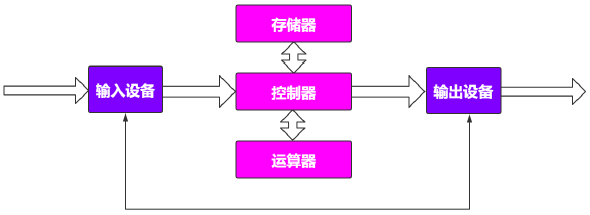
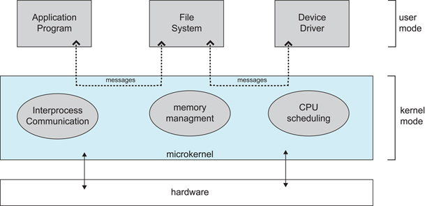
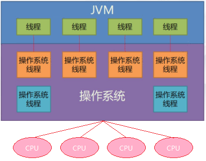
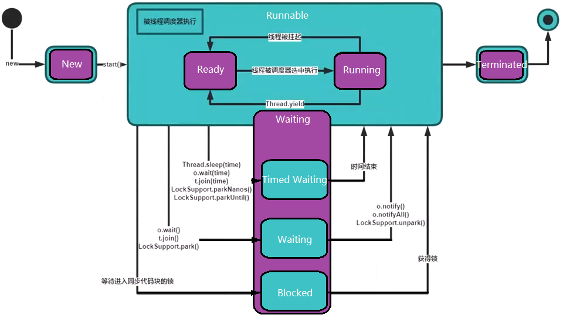
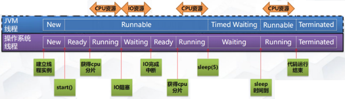
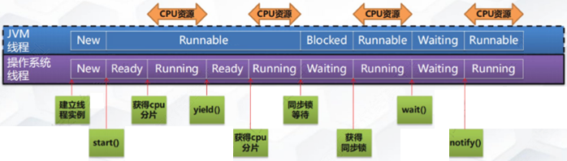
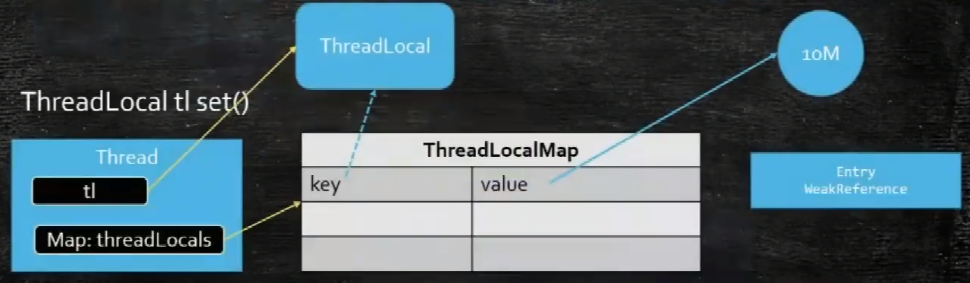
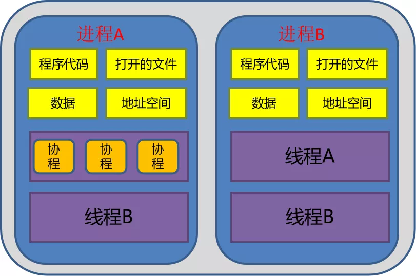

# CSE311 - Multi-thread Programming - 线程

返回[Bulletin](./bulletin.md)

返回[CSE311 - Multi-thread Programming](./CSE311.md)

[TOC]

## CPU

### 冯诺依曼体系



#### 数据处理过程

本质上就是CPU(存储器+运算器+控制器)读取数据指令然后返回结果。

1. 提取阶段:由输入设备把原始数据或信息输入给计算机存储器存起来。
2. 解码阶段:根据CPU的指令集架构(ISA)定义将数值解译为指令。
3. 执行阶段:再由控制器把需要处理或计算的数据调入运算器。
4. 最终阶段:由输出设备把最后运算结果输出。

站在CPU的角度，不关心处理线程的总数。

## 操作系统

### 基本功能

- **进程管理** - 进程控制、进程同步、进程通信、死锁处理、处理机调度等。
- **内存管理** - 内存分配、地址映射、内存保护与共享、虚拟内存等。
- **文件管理** - 文件存储空间的管理、目录管理、文件读写管理和保护等。
- **设备管理** - 完成用户的 I/O 请求，方便用户使用各种设备，并提高设备的利用率。主要包括缓冲管理、设备分配、设备处理、虛拟设备等。

## 内核态

操作系统 -> 硬件

### 宏内核

宏内核是将操作系统功能作为一个紧密结合的整体放到内核。

由于各模块共享信息，因此有很高的性能。

### 微内核

由于操作系统不断复杂，因此将一部分操作系统功能移出内核，从而降低内核的复杂性。移出的部分根据分层的原则划分成若干服务，相互独立。

在微内核结构下，操作系统被划分成小的、定义良好的模块，只有微内核这一个模块运行在内核态，其余模块运行在用户态。

因为需要频繁地在用户态和核心态之间进行切换，所以会有一定的性能损失。



## 用户态

用户 -> 操作系统

操作系统不允许用户直接访问内存、网卡、显示器等。

## 多线程

### 上下文

是指某一时间点，CPU寄存器和程序计数器的内容。

### 上下文切换

指的是CPU保存现场，执行新线程，恢复现场，继续执行原线程的过程。

#### 引发原因

- 当前执行任务的时间片用完之后，系统CPU正常调度下一个任务；
- 当前执行任务碰到IO阻塞，调度器将此任务挂起，继续下一任务；
- 多个任务抢占锁资源，当前任务没有抢到锁资源，被调度器挂起，继续下一任务；
- 用户代码挂起当前任务，让出CPU时间；
- 硬件中断。

### 线程状态

#### 创建状态 (new)

正在被创建，尚未到就绪状态。

#### 就绪状态 (ready)

已处于准备运行状态，即获得了除了处理器之外的一切所需资源，一旦得到处理器资源(处理器分配的时间片)即可运行。

#### 运行状态 (running)

正在处理器上上运行(单核CPU下任意时刻只有一个进程处于运行状态)。

#### 阻塞状态 (waiting)

又称为等待状态，正在等待某一事件而暂停运行如等待某资源为可用或等待 IO 操作完成。即使处理器空闲也不能运行。

#### 结束状态 (terminated)

正常结束或其他原因退出运行。

### 线程调度策略

|        | 协同式线程调度                                    | 抢占式线程调度                                 |
| ------ | ------------------------------------------------- | ---------------------------------------------- |
| 控制权 | 线程本身（线程执行完后，主动通知系统切换）        | 系统决定                                       |
| 优点   | 1.切换操作线程已知，控制简单 2.不存在线程同步问题 | 线程执行时间可控，不会因为一个线程耽误整个进程 |
| 缺点   | 执行时间不可控，一个线程可能耽误整个进程          | 1.切换控制复杂 2.存在线程同步问题              |

### 使用多线程的原因

#### 发挥多核 CPU 的优势

当前的计算机都已经是多核心CPU, 如果仍然按照单线程来编写就只能利用CPU单个核心的处理能力，是对CPU计算的资源的浪费。

如果采用多条线程，就可以最大程度地利用多核CPU的处理能力。

- 对于单核CPU来说，是通过CPU分片模拟多线程的同时处理，这叫做**并发编程**；

- 对于多核CPU来说，可以真正做到多核同时处理，叫做**并行编程**。并行编程是并发编程的子集。

##### 并发

交替做不同事的能力/不同代码块交替执行的性能。操作系统通过引入进程和线程使得程序能够并发运行。

##### 并行

同时做不同事的能力/不同代码块同时执行的性能。需要硬件支持，如多流水线、多核处理器或者分布式计算系统。

#### 防止阻塞

从程序运行效率的角度来看，单核 CPU 不但不会发挥出多线程的优势，反而会因为在单核 CPU 上运行多线程导致线程上下文的切换，而降低程序整体的效率。但是单核 CPU 我们还是要应用多线程，就是为了防止阻塞。

试想，如果单核 CPU 使用单线程，一旦线程阻塞整个程序都会停止运行。多线程可以防止这个问题，多条线程同时运行，阻塞一条线程，不会影响其它任务的执行。

#### 便于建模

这是另外一个没有这么明显的优点了。假设有一个大的任务 A，单线程编程，那么就要考虑很多，建立整个程序模型比较麻烦。但是如果把这个大的任务 A 分解成几个小任务，任务 B、任务 C、任务 D，分别建立程序模型，并通过多线程分别运行这几个任务，那就简单很多了。

### 进程 Process

**进程**指“程序启动进入内存”，是系统进行资源分配和调度的基本单位，是操作系统结构的基础。

程序本身是没有生命周期的，它只是存在磁盘上的一些指令，一个正在运行的应用程序被视为一个进程。它包含着一个运行程序所需要的资源，是一个独立(self-contained)的运行环境，有一个程序运行的入口、顺序执行序列和程序的出口。

当程序需要运行时，操作系统将代码和所有静态数据记载到内存和进程所拥有的唯一的地址空间中，创建和初始化栈（局部变量，函数参数和返回地址)、分配堆内存以及与IO相关的任务，然后启动程序，OS将CPU的控制权转移到新创建的进程，进程开始运行。

#### PCB

操作系统对进程的控制和管理通过PCB(Processing Control Block)，PCB通常是系统内存占用区中的一个连续存区，它存放着操作系统用于描述进程情况及控制进程运行所需的全部信息，包括进程标识号、进程状态、进程优先级、文件系统指针以及各个寄存器的内容等。

进程的PCB是系统感知进程的唯一实体。

### 线程 Thread

**线程**是程序执行的基本单位，是操作系统分配CPU时间的最小单位。

一个进程可以有一个或多个线程，同一进程中的多个线程将共享该进程中的全部系统资源，如虚拟地址空间，文件描述符和信号处理等等。但同一进程中的多个线程有各自的调用栈和线程本地存储，如下图所示。

#### TCB

系统为线程分配一个线程控制块TCB（Thread Control Block），将所有用于控制和管理线程的信息记录在线程的控制块中，TCB中通常包括：

- 线程标志符

- 一组寄存器

- 线程运行状态

- 优先级

- 线程专有存储区

- 信号屏蔽

#### JVM线程

Java中的线程1:1对应操作系统的线程：

- 在Windows中是Win32 API提供的原生多线程；

- 在Linux中是pthread库实现的轻量级线程。



##### 主要组成

- CPU寄存器 主要记录当前所执行线程的状态

- 调用栈 主要用于维护线程所调用到的内存与数据

- 本地存储器（Thread Local Storage，TLS） 主要用于存放线程的状态信息。

##### 数量限制

线程可创建数量受到以下三个方面限制：

- JVM的堆内存大小（线程和堆大小互相抢空间，反向影响）；

- 线程的栈内存大小（Linux内默认有8MB，可以调整）；

- 系统最大可创建的线程数（很大）。

##### 线程状态

下图中，紫色部分表示操作系统的线程状态，蓝色部分表示JVM的线程状态。



在JVM中一共定义了6种线程状态：

##### NEW（新建）

这个状态是指线程刚创建，但还未调用线程的start()方法进行启动。

##### RUNNABLE（可运行）

该状态的可运行是指可以被运行，具体有没有运行要看底层操作系统的资源调度。在操作系统层面，它可能处于运行状态，也可能等待资源调度（例如资源调度、IO阻塞）完成再进入运行状态。

##### BLOCKED（阻塞）

请求获取monitor lock进入synchronized函数或者代码块，但是其它线程已经占用了该monitor lock, 就会进入阻塞状态。要结束该状态进入RUNNABLE需要占用monitor lock的线程将其释放。

##### WAITING（无限等待）

线程进入该状态会释放锁对象，并且显式等待被其他的线程所唤醒，处于这种状态的线程不会被分配CPU时间片。

| **进入方法**                           | **退出方法**                          |
| -------------------------------------- | ------------------------------------- |
| 没有设置Timeout参数的Object.wait()方法 | Object.notify()  / Object.notifyAll() |
| 没有设置Timeout参数的Thread.join()方法 | 被调用的线程执行完毕                  |
| LockSupport.park()方法                 | LockSupport.unpark(Thread)            |

##### TIMED_WAITING（有限等待）

无需等待其它线程显式地唤醒，在一定时间之后会被系统自动唤醒，处于这种状态的线程不会被分配CPU时间片。

| **进入方法**                              | **退出方法**                                    |
| ----------------------------------------- | ----------------------------------------------- |
| Thread.sleep()方法                        | 时间结束                                        |
| 设置了Timeout参数的Object.wait()方法      | 时间结束 / Object.notify() / Object.notifyAll() |
| 设置了Timeout参数的Thread.join()方法      | 时间结束 / 被调用的线程执行完毕                 |
| LockSupport.parkNanos(long  nanos)方法    | 时间结束 / LockSupport.unpark(Thread)           |
| LockSupport.parkUntil(long  deadline)方法 | 时间结束 / LockSupport.unpark(Thread)           |

##### TERMINATED（死亡）

这个状态是指run()方法已执行完毕，线程进入死亡状态。





##### 创建线程

###### 实现Runnable接口

实现Runnable和Callable接口的类只能当做一个可以在线程中运行的任务，不是真正意义上的线程，因此最后还需要通过Thread来调用。可以理解为任务是由线程驱动执行的。

相比继承Thread类，实现接口会更好一些，因为：

- Java 不支持多重继承，因此继承了Thread类就无法继承其它类，但是可以实现多个接口；

- 类可能只要求可执行就行，继承整个Thread类开销过大。

需要实现接口中的 run() 方法。

```java
public class MyRunnable implements Runnable {
    @Override
    public void run() {
        // ...
    }
}
```

使用 Runnable 实例再创建一个 Thread 实例，然后调用 Thread 实例的 start() 方法来启动线程。

```java
public static void main(String[] args) {
    MyRunnable instance = new MyRunnable();
    Thread thread = new Thread(instance);
    thread.start();
}
```

###### 实现Callable接口

与Runnable相比，Callable有返回值，通过Future<V>进行封装。

```java
public class MyCallable implements Callable<Integer> {
    public Integer call() {
        return 123;
    }
}
public static void main(String[] args) throws ExecutionException, InterruptedException {
    MyCallable mc = new MyCallable();
    FutureTask<Integer> ft = new FutureTask<>(mc);
    Thread thread = new Thread(ft);
    thread.start();
    System.out.println(ft.get());
}
```

###### 继承Thread类

同样也是需要实现 run() 方法，因为 Thread 类也实现了 Runable 接口。

当调用 start() 方法启动一个线程时，虚拟机会将该线程放入就绪队列中等待被调度，当一个线程被调度时会执行该线程的 run() 方法。

```java
public class MyThread extends Thread {
    public void run() {
        // ...
    }
}
public static void main(String[] args) {
    MyThread mt = new MyThread();
    mt.start();
}
```

##### 线程睡眠/让步

|          | Thread.sleep(long millis)                                    | Thread.yield()                                               |
| -------- | ------------------------------------------------------------ | ------------------------------------------------------------ |
| 含义     | 当前线程暂停一段时间，让出CPU给其他线程运行。对于操作系统和CPU调度具有更好的可移植性。 | 当前线程让出CPU给其他线程运行，或者继续由自己执行。          |
| 锁       | 不会释放对象锁。如果有synchronized同步块，其他线程仍然不能访问共享数据。 | 不会释放对象锁。如果有synchronized同步块，其他线程仍然不能访问共享数据。 |
| 优先级   | 不考虑线程的优先级。                                         | 只能使相同或者高优先级的线程得到执行机会。                   |
| 异常声明 | 声明抛出InterruptedException.                                | 没有声明任何异常。                                           |

```java
public void run() {
    try {
        // 线程睡眠，
        Thread.sleep(3000);
        // 线程让步，
        Thread.yield();
    } catch (InterruptedException e) {
        e.printStackTrace();
    }
}
```

##### join()

当前运行的线程转为阻塞状态等待，改为运行调用join()的线程，完了以后自己再变为就绪状态执行。

- join方法只有在继承了Thread类的线程中才有。

- 线程必须要start()后再join才能起作用。

- 自己join自己没有意义。

```java
public class JoinExample {
    private class A extends Thread {
        @Override
        public void run() {
            System.out.println("A");
        }
    }
    private class B extends Thread {
        private A a;
        B(A a) {
            this.a = a;
        }
        @Override
        public void run() {
            try {
                a.join();
            } catch (InterruptedException e) {
                e.printStackTrace();
            }
            System.out.println("B");
        }
    }
    public void test() {
        A a = new A();
        B b = new B(a);
        b.start();
        a.start();
    }
}
public static void main(String[] args) {
    JoinExample example = new JoinExample();
    example.test();
}
```

```
A
B
```

##### interrupt()

调用interrupt()方法并不会中断一个正在运行的线程。也就是说处于Running状态的线程并不会因为被中断而被终止，仅仅改变了内部维护的中断标识位而已。因此可以在循环体中使用interrupted()方法来判断线程是否处于中断状态，从而提前结束线程。

```java
public class InterruptExample {
    private static class MyThread2 extends Thread {
        @Override
        public void run() {
            while (!interrupted()) {
                // ..
            }
            System.out.println("Thread end");
        }
    }
}
public static void main(String[] args) throws InterruptedException {
    Thread thread2 = new MyThread2();
    thread2.start();
    thread2.interrupt();
}
```

```
Thread end
```

调用过sleep()而处于TIMED-WATING状态的线程，一旦调用interrupt()方法，会抛出InterruptedException, 从而使线程提前结束TIMED-WATING状态。

```java
public class InterruptExample {
    private static class MyThread1 extends Thread {
        @Override
        public void run() {
            try {
                Thread.sleep(2000);
                System.out.println("Thread run");
            } catch (InterruptedException e) {
                e.printStackTrace();
            }
        }
    }
}
public static void main(String[] args) throws InterruptedException {
    Thread thread1 = new MyThread1();
    thread1.start();
    thread1.interrupt();
    System.out.println("Main run");
}
```

```
Main run
java.lang.InterruptedException: sleep interrupted
    at java.lang.Thread.sleep(Native Method)
    at InterruptExample.lambda$main$0(InterruptExample.java:5)
    at InterruptExample$$Lambda$1/713338599.run(Unknown Source)
    at java.lang.Thread.run(Thread.java:745)
```

##### 为什么不推荐使用stop()?

stop()方法作为一种粗暴的线程终止行为，在线程终止之前没有对其做任何的清除操作，因此具有固有的不安全性。

用Thread.stop()方法来终止线程，将会释放该线程对象已经锁定的所有监视器。如果以前受这些监视器保护的任何对象都处于不连贯状态，那么损坏的对象对其他线程可见，这有可能导致不安全的操作。

因此不应该使用stop()方法，而应该在自己的Thread类中置入一个标志，用于控制目标线程是活动还是停止。如果该标志指示它要停止运行，可使其结束run()方法。

如果目标线程等待很长时间，则应使用interrupt()方法来中断该等待。ReentrantLock在加锁时可以对应地使用可以打断的加锁方法lockInterruptibly()

##### 为什么不推荐使用suspend()?

suspend()方法 该方法已经遭到反对，因为它具有固有的死锁倾向。

调用suspend()方法的时候，目标线程会停下来。如果目标线程挂起时在保护关键系统资源的监视器上保持有锁，则在目标线程重新开始以前，其他线程都不能访问该资源。除非被挂起的线程恢复运行。对任何其他线程来说，如果想恢复目标线程，同时又试图使用任何一个锁定的资源，就会造成死锁。

因此不应该使用suspend()方法，而应在自己的thread类中置入一个标志，用于控制线程是活动还是挂起。如果标志指出线程应该挂起，那么用wait()方法命令其进入等待状态。如果标志指出线程应当恢复，那么用notify()方法重新启动线程。

##### ThreadLocal

ThreadLocal（线程本地变量/线程局部变量/线程本地存储）的作用是使用它会为每个使用该变量的线程独立的变量副本。ThreadLocal实例通常同线程状态关联起来，是private static属性。最常见的ThreadLocal使用场景为用来解决数据库连接、Session管理等。

```java
static final ThreadLocal<T> sThreadLocal = new ThreadLocal<T>();
```

它能够支持线程隔离靠的是每个线程内部都会维护一个类似HashMap的对象，称为**ThreadLocalMap**, ThreadLocal是线程共享的，但ThreadLocalMap是每个线程私有的。

从表面上看ThreadLocal相当于维护了一个map，key就是当前的线程，value就是需要存储的对象。

实际上是ThreadLocal的静态内部类ThreadLocalMap为每个Thread都维护了一个数组table，ThreadLocal确定了一个数组下标，而这个下标就是value存储的对应位置。



```java
//Entry为ThreadLocalMap静态内部类，对ThreadLocal的若引用
//同时让ThreadLocal和储值形成key-value的关系
static class Entry extends WeakReference<ThreadLocal<?>> {
    /** The value associated with this ThreadLocal. */
    Object value;
    Entry(ThreadLocal<?> k, Object v) {
           super(k);
            value = v;
    }
}
//ThreadLocalMap构造方法
ThreadLocalMap(ThreadLocal<?> firstKey, Object firstValue) {
        //内部成员数组，INITIAL_CAPACITY值为16的常量
        table = new Entry[INITIAL_CAPACITY];
        //位运算，结果与取模相同，计算出需要存放的位置
        //threadLocalHashCode比较有趣
        int i = firstKey.threadLocalHashCode & (INITIAL_CAPACITY - 1);
        table[i] = new Entry(firstKey, firstValue);
        size = 1;
        setThreshold(INITIAL_CAPACITY);
}
```

初始时，在Thread里面，threadLocals为空，当通过ThreadLocal变量调用get()方法或者set()方法，就会对Thread类中的threadLocals进行初始化，并且以当前ThreadLocal变量为键值，以ThreadLocal要保存的副本变量为value，存到threadLocals。然后在当前线程里面，如果要使用副本变量，就可以通过get方法在threadLocals里面查找。

###### set方法

```java
public void set(T value) {
    //获取当前线程
    Thread t = Thread.currentThread();
    //实际存储的数据结构类型
    ThreadLocalMap map = getMap(t);
    //如果存在map就直接set，没有则创建map并set
    if (map != null)
        map.set(this, value);
    else
        createMap(t, value);
}
//ThreadLocalMap中set方法。
private void set(ThreadLocal<?> key, Object value) {
    // We don't use a fast path as with get() because it is at
    // least as common to use set() to create new entries as
    // it is to replace existing ones, in which case, a fast
    // path would fail more often than not.
    Entry[] tab = table;
    int len = tab.length;
    //获取索引值，这个地方是比较特别的地方
    int i = key.threadLocalHashCode & (len-1);
    //遍历tab如果已经存在则更新值
    for (Entry e = tab[i];
         e != null;
         e = tab[i = nextIndex(i, len)]) {
        ThreadLocal<?> k = e.get();
        if (k == key) {
            e.value = value;
            return;
        }
        if (k == null) {
            replaceStaleEntry(key, value, i);
            return;
        }
    }
    //如果上面没有遍历成功则创建新值
    tab[i] = new Entry(key, value);
    int sz = ++size;
    //满足条件数组扩容x2
    if (!cleanSomeSlots(i, sz) && sz >= threshold)
        rehash();
}
```

在ThreadLocalMap的构造方法，和set方法，都能看到将threadLocalHashCode进行一个位运算（取模）得到索引i的过程。

- 对于某一ThreadLocal来讲，它的索引值i是确定的，在不同线程之间访问时访问的是不同的table数组的同一位置即都为table[i]，只不过这个不同线程之间的table是独立的。

- 对于同一线程的不同ThreadLocal来讲，这些ThreadLocal实例共享一个table数组，然后每个ThreadLocal实例在table中的索引i是不同的。

###### get方法

```java
//ThreadLocal中get方法
public T get() {
    Thread t = Thread.currentThread(); // 获取当前线程
    ThreadLocalMap map = getMap(t); // 获取当前线程对应的ThreadLocalMap类型的对象threadlocals
    if (map != null) {
        ThreadLocalMap.Entry e = map.getEntry(this); // 如果map存在，就以当前ThreadLocal对象作为key, 获取Entry类型的对象e
        if (e != null) {
            @SuppressWarnings("unchecked")
            T result = (T)e.value;
            return result; // 如果e存在，就返回它的value属性
        }
    }
    return setInitialValue(); // 如果e不存在或者map不存在，就调用setInitialValue方法先为当前线程创建一个 ThreadLocalMap对象然后返回默认的初始值null.
}
//ThreadLocalMap中getEntry方法
private Entry getEntry(ThreadLocal<?> key) {
       int i = key.threadLocalHashCode & (table.length - 1);
       Entry e = table[i];
       if (e != null && e.get() == key)
            return e;
       else
            return getEntryAfterMiss(key, i, e);
 }
```

###### remove方法

首先通过当前线程获取其对应的 ThreadLocalMap 类型的对象 m，如果 m 不为空，就解除 ThreadLocal 这个 key 及其对应的 value 值的联系。

###### 存在的问题

- 线程复用可能会产生脏数据。
  - 由于线程池会重用Thread对象，因此与Thread绑定的ThreadLocal也会被重用。如果没有调用remove清理与线程相关的ThreadLocal信息，那么假如下一个线程没有调用set设置初始值就可能get到重用的线程信息。
  - 建议线程池不要使用ThreadLocal.
  - 可以自定义HandlerInterceptorAdapter, 在preHandle的时候去设置ThreadLocal, 在afterCompletion时去remove.

- Entry使用的是弱引用，假如使用强引用，即使设置tl=null, key的引用依然指向ThreadLocal对象，ThreadLocal不能被回收，会有内存泄漏。但实际上还是有内存泄漏存在，由于ThreadLocal是弱引用，但Entry的value是强引用，因此当ThreadLocal被垃圾回收后，value依旧不会被释放。因此需要及时调用remove方法进行清理操作。

#### Go线程

Go中的线程M:N对应操作系统的线程。

Go会事先启动好一定数量的内核线程，然后以一个个队列的形式启动Go的协程，再交由内核线程执行。

因为CPU存在线程切换，所以JVM不一定线程数越多越好，但是Go的线程容量非常大。

#### 进程 VS 线程

- 进程是资源的分配和调度的独立单元，各自拥有完整的虚拟地址空间。当发生进程切换时，不同的进程拥有不同的虚拟地址空间，而同一进程的多个线程共享同一地址空间。
- 线程比进程小，基本上不拥有系统资源。线程的创建和销毁所需要的时间比进程小很多。
- 由于线程之间能够共享地址空间，因此，需要考虑同步和互斥操作。
- 线程是CPU调度的基本单元，一个进程包含若干线程。
- 一个线程的意外终止会影响整个进程的正常运行，但是一个进程的意外终止不会影响其他的进程的运行。因此，多进程程序安全性更高。

总之，多进程程序安全性高，进程切换开销大，效率低；多线程程序维护成本高，线程切换开销小，效率高。

### 协程 Coroutine

**协程**（Coroutine，又称纤程/微线程）是一种比线程更加轻量级的存在。协程不是被操作系统内核所管理，而完全是由程序所控制。

协程可以比作子程序，但执行过程中，子程序内部可中断，然后转而执行别的子程序，在适当的时候再返回来接着执行。协程之间的切换不需要涉及任何系统调用或任何阻塞调用。

协程只在一个线程中执行，是子程序之间的切换，发生在用户态上。而且，线程的阻塞状态是由操作系统内核来完成，发生在内核态上，因此协程相比线程节省线程创建和切换的开销。

协程中不存在同时写变量冲突，因此，也就不需要用来守卫关键区块的同步性原语，比如互斥锁、信号量等，并且不需要来自操作系统的支持。

协程适用于IO阻塞且需要大量并发的场景，当发生IO阻塞，由协程的调度器进行调度，通过将数据流yield掉，并且记录当前栈上的数据，阻塞完后立刻再通过线程恢复栈，并把阻塞的结果放到这个线程上去运行。



#### Go routine VS Java Forkjoinpool

Go routine和Java Forkjoinpool原理非常相似，但是存在不同。

Forkjoinpool无法同步执行某两个线程，但是Go routinue通过模拟CPU的原理，可以同步执行两个任务。

