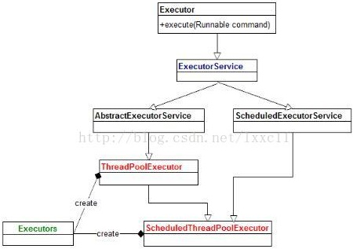
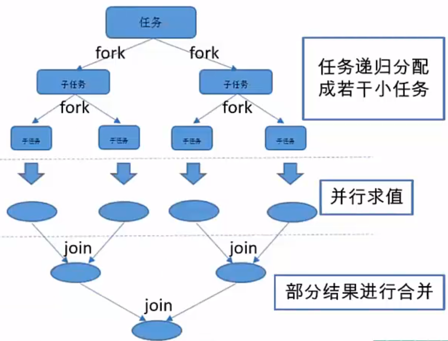
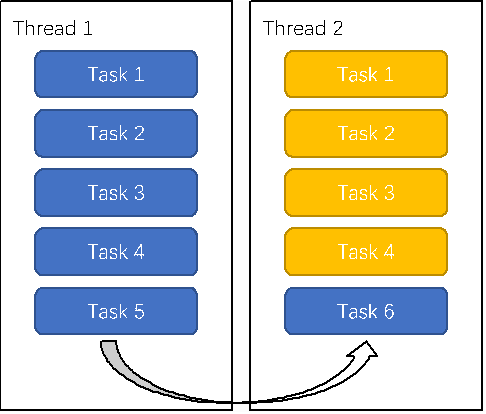
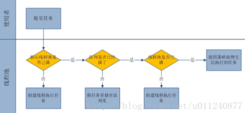

# CSE311 - Multi-thread Programming - 线程池

返回[Bulletin](./bulletin.md)

返回[CSE311 - Multi-thread Programming](./CSE311.md)

[TOC]

## 线程池

### 使用原因

| 问题                                                | 如何解决                                                     |
| --------------------------------------------------- | ------------------------------------------------------------ |
| 线程的建立和销毁是有开销的，上下文切换也有开销。    | 线程池可以提前创建若干个线程，如果有任务需要处理，线程池里的线程就会处理任务，处理完之后线程并不会被销毁，而是等待下一个任务。 |
| 线程数量越多，消耗的CPU计算资源和内存资源也会更多。 | 通过线程池限定线程个数，不会导致线程过多引发的系统运行缓慢或者崩溃。 |

### 相关接口和类



#### Executor

线程池的顶级接口, 但是严格意义上讲Executor并不是一个线程池，而只是一个执行线程的工具。有一个方法叫execute(), 执行的对象是Runnable.

#### ExecutorService

真正的线程池接口，除了可以执行任务还完善了整个任务执行器的一个生命周期，可以通过submit()提交任务。如果执行Callable类，可以有一个类型为Future的返回值，Future代表了一个未来才会执行完的结果，结果值为double.

#### ThreadPoolExecutor

线程池类。

```java
// 可以看做一个整数变量，前3位表示线程池状态，后29位表示worker数量
private final AtomicInteger ctl = new AtomicInteger(ctlOf(RUNNING, 0)); 
// 用来表示worker数量
private static final int COUNT_BITS = Integer.SIZE - 3; 
// worker数量，线程池所允许的最大线程数
private static final int COUNT_MASK = (1 << COUNT_BITS) - 1;
// 线程池的五种状态：
// 正常运行的
private static final int RUNNING    = -1 << COUNT_BITS;
// 调用了shutdown()进入了shutdown状态
private static final int SHUTDOWN   =  0 << COUNT_BITS;
// 调用了shutdownNow()马上停止
private static final int STOP       =  1 << COUNT_BITS;
// 调用了shutdown()线程也执行完了
private static final int TIDYING    =  2 << COUNT_BITS;
// 整个线程全部结束
private static final int TERMINATED =  3 << COUNT_BITS;
// 获取线程状态
private static int runStateOf(int c)     { return c & ~COUNT_MASK; }
// 获取worker数量
private static int workerCountOf(int c)  { return c & COUNT_MASK; }
// 生成ctl值
private static int ctlOf(int rs, int wc) { return rs | wc; }
// 用于比较线程池状态
private static boolean runStateLessThan(int c, int s) {
    return c < s;
}
private static boolean runStateAtLeast(int c, int s) {
    return c >= s;
}
```

##### 构造方法

```java
public ThreadPoolExecutor(
    int corePoolSize, // 线程池里最小线程数
    int maximumPoolSize, // 线程池里最大线程数量，如果设置成Integer,MAX_VALUE可能会导致OOM
    long keepAliveTime,
    TimeUnit unit, // 线程最大的存活时间
    BlockingQueue<Runnable> workQueue, // 缓存异步任务的队列，设置为LinkedBlockingQueue可能会导致OOM
    ThreadFactory threadFactory, // 用来构造线程池里的worker线程
    RejectedExecutionHandler handler //当线程池的任务缓存队列已满并且线程池中的线程数目达到maximumPoolSize，如果还有任务到来就会采取任务拒绝策略
) {
    // ...
}
```

以下为测试用例：

```java
public static void main(String[] args) {
    ThreadPoolExecutor tpe = new ThreadPoolExecutor(2, 4,
                                                    60, TimeUnit.SECONDS,
                                                    new ArrayBlockingQueue<Runnable>(4),
                                                    Executors.defaultThreadFactory(),
                                                    new ThreadPoolExecutor.CallerRunsPolicy());
    for (int i = 0; i < 8; i++) {
        tpe.execute(new Task(i));
    }
    System.out.println(tpe.getQueue());
    tpe.execute(new Task(100));
    System.out.println(tpe.getQueue());
    tpe.shutdown();
}
static class Task implements Runnable {
    private int i;
    public Task(int i) {
        this.i = i;
    }
    @Override
    public void run() {
        System.out.println(Thread.currentThread().getName() + " Task " + i);
        try {
            System.in.read();
        } catch (IOException e) {
            e.printStackTrace();
        }
    }
    @Override
    public String toString() {
        return "Task{" +
            "i=" + i +
            '}';
    }
}
```

```
pool-1-thread-1 Task 0
pool-1-thread-2 Task 1
[Task{i=2}, Task{i=3}, Task{i=4}, Task{i=5}]
pool-1-thread-4 Task 7
main Task 100
pool-1-thread-3 Task 6
```

###### 控制线程池线程的优先级

可以通过继承ThreadPoolExecutor建一个新的线程池类，创建成员PriorityBlockingQueue优先级队列。因为PriorityBlockingQueue对于相同的优先级不能确定顺序，所以每一个线程要创建一个优先级参数，将线程类实现为Comparable的类。

可以使用ThreadLocal存当前线程执行的优先级，节省代码。

###### 线程池的阻塞队列使用无界阻塞队列会出现什么问题？

与有界队列相比，除非系统资源耗尽，否则无界的任务队列不存在任务入队失败的情况。当有新的任务到来，系统的线程数小于corePoolSize时，则新建线程执行任务。当达到corePoolSize后，就不会继续增加，若后续仍有新的任务加入，而没有空闲的线程资源，则任务直接进入队列等待。若任务创建和处理的速度差异很大，无界队列会保持快速增长，直到耗尽系统内存。

###### 拒绝策略处理类

- AbortPolicy (抛出一个异常，默认的)
- DiscardPolicy (直接丢弃任务)
- DiscardOldestPolicy（丢弃队列里最老的任务，将当前这个任务继续提交给线程池）
- CallerRunsPolicy（交给线程池调用所在的线程进行处理)

#### Executors.newCachedThreadPool() 可缓存线程池

创建可缓存线程池。线程池为无限大，当执行第二个任务时第一个任务已经完成，会复用执行第一个任务的线程，而不用每次新建线程。对于执行很多短期异步任务的程序而言，这些线程池通常可提高程序性能。

线程池会终止并从缓存中移除那些已有60秒钟未被使用的线程。因此，长时间保持空闲的线程池不会使用任何资源。

```java
ExecutorService cachedThreadPool = Executors.newCachedThreadPool();
for (int i = 0; i < 10; i++) {
    final int index = i;
    try {
        Thread.sleep(index * 1000);
    } catch (InterruptedException e) {
        e.printStackTrace();
    }
    cachedThreadPool.execute(new Runnable() {
        @Override
        public void run() {
           System.out.println(index);
        }
    });
}
```

#### Executors.newFixedThreadPool() 定长线程池

创建定长线程池。可控制线程最大并发数，超出的线程会在队列中等待。

定长线程池的大小最好根据系统资源进行设置。如Runtime.getRuntime().availableProcessors()

```java
ExecutorService fixedThreadPool = Executors.newFixedThreadPool(3);
for (int i = 0; i < 10; i++) {
    final int index = i;
    fixedThreadPool.execute(new Runnable() {
        @Override
        public void run() {
            try {
                // 因为线程池大小为3，每个任务输出index后sleep 2秒，所以每两秒打印3个数字。
                System.out.println(index);
                Thread.sleep(2000);
            } catch (InterruptedException e) {
                // TODO Auto-generated catch block
                e.printStackTrace();
            }
        }
    });
}
```

#### Executors.newScheduledThreadPool() 支持定时及周期性任务的定长线程池

创建定长线程池，支持定时及周期性任务执行。

```java
ScheduledExecutorService scheduledThreadPool = Executors.newScheduledThreadPool(5); 
//延迟3秒执行
scheduledThreadPool.schedule(new Runnable() {
    @Override
    public void run() {
        System.out.println("delay 3 seconds");
    }
}, 3, TimeUnit.SECONDS); 
//延迟1秒后每3秒执行一次
scheduledThreadPool.scheduleAtFixedRate(new Runnable() {
    @Override
    public void run() {
           System.out.println("delay 1 seconds, and excute every 3 seconds");
    }
}, 1, 3, TimeUnit.SECONDS);
```

#### Executors.newSingleThreadExecutor() 单线程化的线程池

创建单线程化的线程池。它只会用唯一的工作线程来执行任务，保证所有任务按照指定顺序（FIFO, LIFO, 特定优先级等）执行。

结果依次输出，相当于顺序执行各个任务。

现行大多数GUI程序都是单线程的。Android中单线程可用于数据库操作，文件操作，应用批量安装，应用批量删除等不适合并发但可能IO阻塞性及影响UI线程响应的操作。

```java
ExecutorService singleThreadExecutor = Executors.newSingleThreadExecutor();
for (int i = 0; i < 10; i++) {
    final int index = i;
    singleThreadExecutor.execute(new Runnable() {
        @Override
        public void run() {
            try {
                System.out.println(index);
                Thread.sleep(2000);
            } catch (InterruptedException e) {
                // TODO Auto-generated catch block
                e.printStackTrace();
            }
        }
    });
}
```

#### Executors.newSingleThreadScheduledExecutor() 支持定时及周期性任务的单线程化的线程池

创建单线程池，支持定时及周期性任务执行。

```java
ExecutorService singleThreadScheduledExecutor = Executors.newSingleThreadScheduledExecutor();
singleThreadScheduledExecutor.schedule(new Runnable() {
    @Override
    public void run() {
        System.out.println("delay 3 seconds");
    }
}, 3, TimeUnit.SECONDS); 
//延迟1秒后每3秒执行一次
singleThreadScheduledExecutor.scheduleAtFixedRate(new Runnable() {
    @Override
    public void run() {
        System.out.println("delay 1 seconds, and excute every 3 seconds");
    }
}, 1, 3, TimeUnit.SECONDS);
```

#### ForkJoinPool

在Java 1.7新增了一个ForkJoinPool类，是实现了工作窃取算法的线程池，主要用于并行计算中，和MapReduce原理类似，都是把大的计算任务拆分成多个小任务并行计算。其中有一个隐含的递归过程，叫做RecursiveAction, 是不带返回值的任务。



Java 1.7中的fork/join task和Java 1.8中的并行stream都是基于ForkJoinPool.

```java
public class ForkJoinExample extends RecursiveTask<Integer> {
    private final int threshold = 5;
    private int first;
    private int last;
    public ForkJoinExample(int first, int last) {
        this.first = first;
        this.last = last;
    }
    @Override
    protected Integer compute() {
        int result = 0;
        if (last - first <= threshold) {
            // 任务足够小则直接计算
            for (int i = first; i <= last; i++) {
                result += i;
            }
        } else {
            // 拆分成小任务
            int middle = first + (last - first) / 2;
            ForkJoinExample leftTask = new ForkJoinExample(first, middle);
            ForkJoinExample rightTask = new ForkJoinExample(middle + 1, last);
            leftTask.fork();
            rightTask.fork();
            result = leftTask.join() + rightTask.join();
        }
        return result;
    }
}
public static void main(String[] args) throws ExecutionException, InterruptedException {
    ForkJoinExample example = new ForkJoinExample(1, 10000);
    ForkJoinPool forkJoinPool = new ForkJoinPool();
    Future result = forkJoinPool.submit(example);
    System.out.println(result.get());
}
```

ForkJoinPool线程数量取决于CPU核数。

```java
public class ForkJoinPool extends AbstractExecutorService
```

ForkJoinPool在1.8中被优化了，在全局建立了一个公共的线程池。

```java
ForkJoinPool.commonPool();
```

#### WorkStealingPool

在WorkStealingPool中每个线程都维护了一个双端队列用来存储需要执行的任务。**工作窃取算法**允许空闲的线程从其它线程的双端队列中窃取一个任务来执行。窃取的任务必须是最晚的任务，避免和队列所属线程发生竞争。

但是如果队列中只有一个任务时还是会发生竞争。



Java 1.8在Executors类中还新增了两个newWorkStealingPool工厂方法，利用Work-Stealing算法，并行地处理任务，不保证处理顺序。

```java
// 使用当前处理器数, 相当于调用 newWorkStealingPool(Runtime.getRuntime().availableProcessors());
public static ExecutorService newWorkStealingPool();
public static ExecutorService newWorkStealingPool(int parallelism);
```

测试用例如下：

```java
for (int i = 0; i < 5; i++) {
    final int taskIndex = i;
    executor.execute(() -> {
        System.out.println(taskIndex);
        try {
            Thread.sleep(Long.MAX_VALUE);
        } catch (InterruptedException e) {
            e.printStackTrace();
        }
    });
}
```

```
无序输出 0~4
```

### 大小设置

对于**计算密集型**任务，线程池内的线程数量建议和CPU核心数量一致。

对于**涉及IO处理**的任务，最优的线程池的大小的计算公式为：
$$
Nthreads = Ncpu * Ucpu * (1 + W / C)
$$

$$
线程池大小=CPU数量*目标CPU使用率*(1+等待时间/计算时间)
$$

上式中的时间比上下浮动一般较大，大约50%，不好估计，需要通过压力测试找到最优值。

### 线程池的启动

|          | execute()                    | submit()                                                     |
| -------- | ---------------------------- | ------------------------------------------------------------ |
| 功能     | 开启线程执行池中的任务。     | 提交指定的任务去执行并且返回Future对象。                     |
| 接收参数 | 只能执行Runnable类型的任务。 | 可以执行Runnable和Callable类型的任务。                       |
| 异常处理 |                              | 通过submit提交任务，可以获取线程执行结果，线程异常会在Future.get()执行结果时抛出。 |

```java
public class RunnableTestMain {
    public static void main(String[] args) {
        ExecutorService pool = Executors.newFixedThreadPool(2);
        /**
         * execute(Runnable x) 没有返回值。可以执行任务，但无法判断任务是否成功完成。
         */
        pool.execute(new RunnableTest("Task1")); 
        /**
         * submit(Runnable x) 返回一个future。可以用这个future来判断任务是否成功完成。请看下面：
         */
        Future future = pool.submit(new RunnableTest("Task2"));
        try {
            if(future.get()==null){//如果Future's get返回null，任务完成
                System.out.println("任务完成");
            }
        } catch (InterruptedException e) {
        } catch (ExecutionException e) {
            //否则我们可以看看任务失败的原因是什么
            System.out.println(e.getCause().getMessage());
        }
    }
}
```

### 执行逻辑



1. 线程池刚创建时，里面没有一个线程。任务队列是作为参数传进来的。不过，就算队列里面有任务，线程池也不会马上执行它们。

2. 当调用 execute() 方法添加一个任务时，线程池会做如下判断：
   1. 如果正在运行的线程数量小于 corePoolSize，那么马上创建线程运行这个任务；
   2. 如果正在运行的线程数量大于或等于 corePoolSize，那么将这个任务放入队列；
   3. 如果这时候队列满了，而且正在运行的线程数量小于 maximumPoolSize，那么还是要创建非核心线程立刻运行这个任务；
   4. 如果队列满了，而且正在运行的线程数量大于或等于 maximumPoolSize，那么线程池直接采用拒绝策略处理。
3. 当一个线程完成任务时，它会从队列中取下一个任务来执行。

4. 当一个线程无事可做，超过一定的时间（keepAliveTime）时，线程池会判断，如果当前运行的线程数大于corePoolSize，那么这个线程就被停掉。所以线程池的所有任务完成后，它最终会收缩到corePoolSize的大小。

### addWorker方法

分为两步：

- count++

- 真正加入任务并且调用start方法

Worker类内部包含了一个线程、一个任务，和完成过的任务的总数。

```java
        /**
         * This class will never be serialized, but we provide a
         * serialVersionUID to suppress a javac warning.
         */
        private static final long serialVersionUID = 6138294804551838833L;

        /** Thread this worker is running in.  Null if factory fails. */
        @SuppressWarnings("serial") // Unlikely to be serializable
        final Thread thread;
        /** Initial task to run.  Possibly null. */
        @SuppressWarnings("serial") // Not statically typed as Serializable
        Runnable firstTask;
        /** Per-thread task counter */
        volatile long completedTasks;

        // TODO: switch to AbstractQueuedLongSynchronizer and move
        // completedTasks into the lock word.

        /**
         * Creates with given first task and thread from ThreadFactory.
         * @param firstTask the first task (null if none)
         */
        Worker(Runnable firstTask) {
            setState(-1); // inhibit interrupts until runWorker
            this.firstTask = firstTask;
            this.thread = getThreadFactory().newThread(this);
        }

        /** Delegates main run loop to outer runWorker. */
        public void run() {
            runWorker(this);
        }
```

### shutdown方法

可以调用shutdown或shutdownNow方法关闭线程池。shutDown会等待线程都执行完毕之后再关闭。shutDownNow会迫使当前执行的所有任务停止工作，相当于调用每个线程的interrupt()方法。

```java
public static void main(String[] args) {
    ExecutorService executorService = Executors.newCachedThreadPool();
    executorService.execute(() -> {
        try {
            Thread.sleep(2000);
            System.out.println("Thread run");
        } catch (InterruptedException e) {
            e.printStackTrace();
        }
    });
    executorService.shutdownNow();
    System.out.println("Main run");
}
```

```
Main run
java.lang.InterruptedException: sleep interrupted
    at java.lang.Thread.sleep(Native Method)
    at ExecutorInterruptExample.lambda$main$0(ExecutorInterruptExample.java:9)
    at ExecutorInterruptExample$$Lambda$1/1160460865.run(Unknown Source)
    at java.util.concurrent.ThreadPoolExecutor.runWorker(ThreadPoolExecutor.java:1142)
    at java.util.concurrent.ThreadPoolExecutor$Worker.run(ThreadPoolExecutor.java:617)
    at java.lang.Thread.run(Thread.java:745)
```

如果只想中断 Executor 中的一个线程，可以通过使用 submit() 方法来提交一个线程，它会返回一个 Future<?> 对象，通过调用该对象的 cancel(true) 方法就可以中断线程。

```java
Future<?> future = executorService.submit(() -> {
    // ..
});
future.cancel(true);
```

#### 

