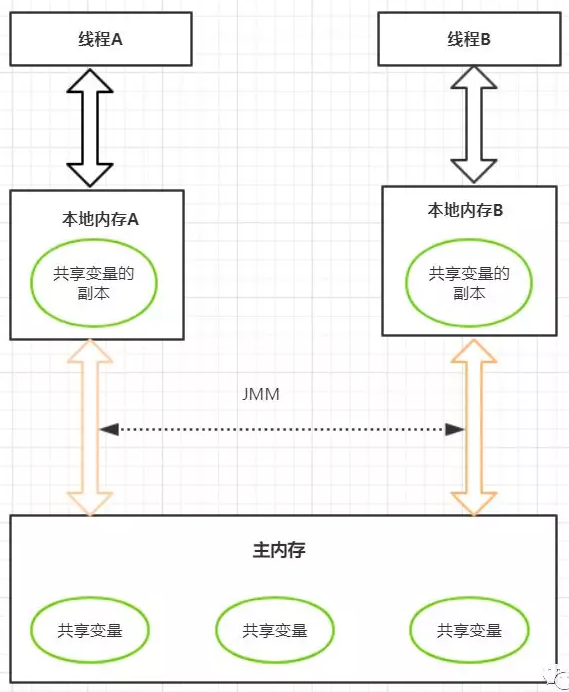
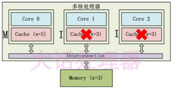
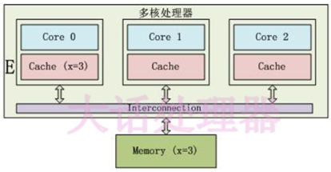
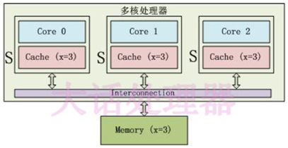
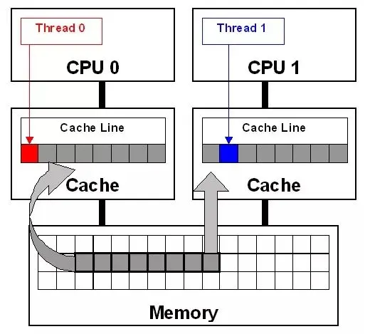
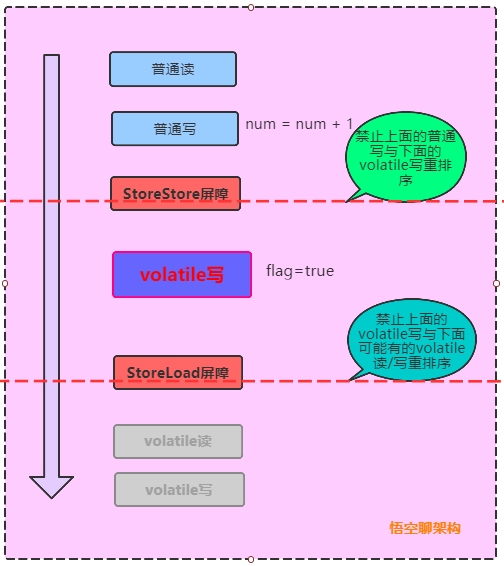
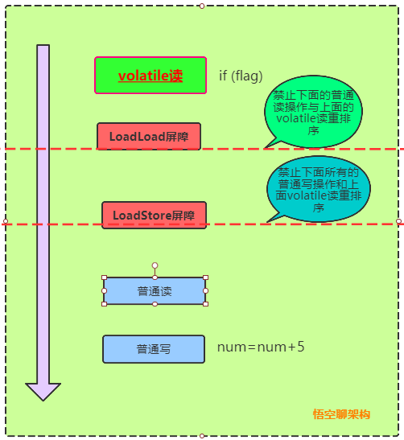
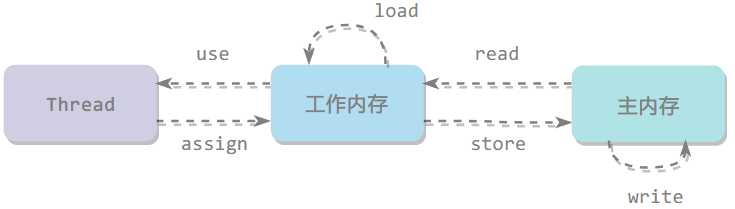

# CSE311 - Multi-thread Programming - volatile

返回[Bulletin](./bulletin.md)

返回[CSE311 - Multi-thread Programming](./CSE311.md)

[TOC]

## Java Memory Model (JMM)

Java内存模型也就是Java Memory Model，简称JMM，本身是一种并不存在的抽象概念，主要目的是定义程序中各种变量的访问规则。变量包括实例字段、静态字段和构成数组对象的元素，但不包括局部变量与方法参数，因为它们是线程私有的，不存在多线程竞争。

主内存是虚拟机内存的一部分，Java内存模型规定了所有的变量都存储在主内存中。

JMM规定所有变量都存储在主内存，每条线程还有自己的工作内存保存主内存变量副本，对变量的所有操作都必须在工作内存中进行，而不能直接读写主内存。不同的线程之间也无法直接访问对方工作内存中的变量，线程间变量的传递均需要自己的工作内存和主内存之间进行数据同步进行。

JMM遵循一个基本原则：只要不改变程序执行结果，编译器和处理器怎么优化都行。例如编译器分析某个锁只会单线程访问就消除锁，某个 volatile 变量只会单线程访问就把它当作普通变量。

在不同的硬件生产商和不同的操作系统下，内存的访问逻辑有一定的差异。



### CPU缓存

CPU缓存是一种高效的非链式结构的hash map. 每个桶（bucket）通常是64个字节，这就是一个**缓存行**（cache line）。缓存行是内存交换的实际单位，64字节大小是工业界实践得出的结论，越大空间效率越高，越小读取时间越快。

CPU缓存有三级：L1 L2 L3，是工业界实践得出的结论。一般运行越慢，缓存设置的等级越多。

举例：共有两个CPU，每个CPU有两个核

- L3 核外 CPU内
- L2 核内
- L1 核内

#### MESI协议

当多个CPU持有的缓存都来自同一个主内存的拷贝时，如果有其他CPU偷偷改了这个主内存数据而其他CPU并不知道，那么拷贝的内存将会和主内存不一致，这就是缓存不一致。

MESI是Intel X86 CPU支持的缓存一致性协议。

缓存中的数据的四种状态：

| **缓存行状态** | **描述**                                                     |
| -------------- | ------------------------------------------------------------ |
| M(Modified)    | 这行数据有效，数据被修改了，和内存中的数据不一致，数据只存在于本Cache中。   |
| E(Exclusive)   | 这行数据有效，数据和内存中的数据一致，数据只存在于本Cache中。   |
| S(Shared)      | 这行数据有效，数据和内存中的数据一致，数据只存在于很多Cache中。   |
| I(Invalid)     | 这行数据无效。                                               |

#### 总线嗅探

每个CPU通过不断嗅探总线上传播的数据，来检查自己缓存值是否过期。

如果处理器发现自己的缓存行对应的内存地址被修改，就会将当前处理器的缓存行设置为无效状态，当处理器对这个数据进行修改操作的时候，会重新从内存中把数据读取到处理器缓存中。

##### 缺点

由于MESI缓存一致性协议，需要不断对主线进行内存嗅探，大量的交互会导致总线带宽达到峰值。因此不要滥用volatile，可以根据合适场景用锁来替代。

#### 伪共享

伪共享发生在不同处理器的上的线程对变量的修改依赖于相同的缓存行，如下图所示：



比如两个变量位于同一个缓存行，随时因为一个改动而导致另一个失效。

避免伪共享可以加快运行速度：

- 号称世界上最快的单机MQ的Disrupter, 有一个环形buffer,一个指针, 变量前和变量后都有7个long变量，用来确保一定能凑整缓存行。
- JDK1.8以后加了一个注解Contended, 也是为了凑整缓存行。

#### 合并写

为了提高效率，CPU的读指令可以同时执行互不影响，写指令可以执行合并写。合并写所用到的WCBuffer(WriteCombingBuffer) 速度比L1还要快，在Intel CPU中，只有4个字节的位置，一旦超过4个字节则无法执行合并写。

```java
public class WriteCombining {
    private static final int ITERATIONS = Integer.MAX_VALUE;
    private static final int ITEMS = 1 << 24;
    private static final int MASK = ITEMS - 1;
    private static final byte[] arrayA = new byte[ITEMS];
    private static final byte[] arrayB = new byte[ITEMS];
    private static final byte[] arrayC = new byte[ITEMS];
    private static final byte[] arrayD = new byte[ITEMS];
    private static final byte[] arrayE = new byte[ITEMS];
    private static final byte[] arrayF = new byte[ITEMS];
    
    // 修改六个位置
    public static long runCaseOne() {
        long start = System.nanoTime();
        int i = ITERATIONS;
        while (--i != 0) {
            int slot = i & MASK;
            byte b = (byte) i;
            arrayA[slot] = b;
            arrayB[slot] = b;
            arrayC[slot] = b;
            arrayD[slot] = b;
            arrayE[slot] = b;
            arrayF[slot] = b;
        }
        return System.nanoTime() - start;
    }
    
    // 修改三个位置两次
    public static long runCaseTwo() {
        long start = System.nanoTime();
        int i = ITERATIONS;
        while (--i != 0) {
            int slot = i & MASK;
            byte b = (byte) i;
            arrayA[slot] = b;
            arrayB[slot] = b;
            arrayC[slot] = b;
        }
        i = ITERATIONS;
        while (--i != 0) {
            int slot = i & MASK;
            byte b = (byte) i;
            arrayD[slot] = b;
            arrayE[slot] = b;
            arrayF[slot] = b;
        }
        return System.nanoTime() - start;
    }

    public static void main(final String[] args) {
        for (int i = 1; i <= 3; i++) {
            System.out.println(i + " SingleLoop duration (ns) = " + runCaseOne());
            System.out.println(i + " SplitLoop  duration (ns) = " + runCaseTwo());
        }
    }
}
```

```
1 SingleLoop duration (ns) = 8219900300
1 SplitLoop  duration (ns) = 4836000900
2 SingleLoop duration (ns) = 8131856500
2 SplitLoop  duration (ns) = 4764185500
3 SingleLoop duration (ns) = 8009248400
3 SplitLoop  duration (ns) = 4746134600
```

后者明显用时更长。

### 指令重排序

为了提高性能，编译器和处理器通常会对指令进行重排序，重排序指从源代码到指令序列的重排序，分为三种：

- 编译器优化的重排序，编译器在不改变单线程程序语义的前提下可以重排语句的执行顺序。

- 指令级并行的重排序，如果不存在数据依赖性，处理器可以改变语句对应机器指令的执行顺序。

- 内存系统的重排序。

假如要执行两条**没有依赖关系**的指令（例如x=1;和y=3;）。因为CPU比内存快百倍，为了提高效率，不要让第二条等第一条在内存反馈完再执行，所以CPU会进行优化，让第二条先访问CPU，再让第一条访问内存。

指令重排的目的是为了在不改变程序执行结果的前提下，优化程序的运行效率。需要注意的是，这里所说的不改变执行结果，指的是不改变**单线程**下的程序执行结果，但是可能改变多线程的执行结果。单核CPU没有指令重排。

#### as-if-serial

as-if-serial保证**单线程**程序的执行结果不变。

编译器和处理器必须遵循as-if-serial语义，因此不会对存在数据依赖关系的操作重排序，因为这种重排序会改变执行结果。

#### Happens-before原则

*如果操作1happens-before操作2，那么操作1的执行结果将对操作2可见，而且操作1的执行顺序排在第操作2之前。*

happens-before保证正确同步的**多线程**程序的执行结果不变。两个操作之间存在happens-before关系，并不意味着一定要按照以下happens-before原则制定的顺序来执行。编译器和处理器只要求禁止会改变结果的重排序。

**单一线程规则 Single Thread rule**

在一个线程内，在程序前面的操作先行发生于后面的操作。

**管程锁定规则 Monitor Lock Rule**

unlock操作先行发生于后面对同一个锁的lock操作。

**Volatile变量规则 Volatile Variable Rule**

对volatile变量的写操作先行发生于后面的读操作。

**线程启动规则 Thread Start Rule**

线程的start方法先行发生于线程的每个动作。

**线程加入规则 Thread Join Rule**

线程的结束先行发生于join()方法返回。

**线程中断规则 Thread Interruption Rule**

对线程 interrupt()方法的调用先行发生于被中断线程的代码检测到中断事件的发生，可以通过interrupted()方法检测到是否有中断发生。

**对象终结规则 Finalizer Rule**

对象的初始化先行发生于finalize方法。

**传递性 Transitivity**

如果操作A先行发生于操作B，操作B先行发生于操作C，那么操作A先行发生于操作C 。

### 内存屏障

内存屏障也称为内存栅栏或栅栏指令，是一种屏障指令，它使CPU或编译器对屏障指令之前和之后发出的内存操作执行一个排序约束。 这通常意味着在屏障之前发布的操作被保证在屏障之后发布的操作之前执行。

#### CPU级别 (X86)

基于Intel的lock汇编指令实现。

##### sfence指令

在sfence指令前的写操作当必须在sfence指令后的写操作前完成。

##### lfence指令

在lfence指令前的读操作当必须在lfence指令后的读操作前完成。

##### mfence指令

在mfence指令前的读写操作当必须在mfence指令后的读写操作前完成。（全能屏障）

#### JVM级别

仅仅是规范，具体实现还是依赖操作系统。

##### LoadLoad屏障

读读屏障(load1|loadload|load2) load1必须在load2之前运行读取完

##### StoreStore屏障

写写屏障(store1|storestore|store2) load1必须在load2之前运行写入完

##### LoadStore屏障

读写屏障(load|loadstore|store) load必须在store之前运行读取完

##### StoreLoad屏障

写读屏障(store|storeload|load) 全能屏障 store必须在load之前运行写入完

### volatile

Java语言提供了一种稍弱的同步机制，即volatile变量，用来确保将变量的更新操作通知到其他线程，在各个线程的工作内存中不存在一致性问题。

#### 保持线程可见性

读一个 volatile 变量时，把该线程工作内存值置为无效，从主内存读取，每次总会返回最新写入的值。

写一个 volatile 变量时，把该线程工作内存中的值刷新到主内存。

#### 禁止重排序

volatile变量进行写操作时相当于使用了一个内存屏障（memory barrier），屏障两边的指令禁止重排，从而保障指令有序。

##### 字节码层面

加了ACC_VOLATILE修饰符。

##### JVM层面

JVM的实现会在volatile读写前后均加上内存屏障，在一定程度上保证有序性。

|  |  |
| ------------------------------------ | ------------------------------------ |

##### OS和硬件层面

```assembly
lock addl
```

lock前缀，会保证某个处理器对共享内存（一般是缓存行cacheline）的独占使用。它将本处理器缓存写入内存，该写入操作会引起其他处理器或内核对应的缓存失效。通过独占内存、使其他处理器缓存失效，达到了“指令重排序无法越过内存屏障”的作用。

#### 满足线程安全的条件

##### 对变量的写入操作不依赖其当前值

```java
num++;
```

volatile实现共享变量内存可见性有一个条件，就是对共享变量的操作必须具有原子性。比如num=10; 这个操作具有原子性，但是num++或者num--由3步组成，并不具有原子性，在字节码层面可以拆分成如下指令：

```assembly
getstatic    //读取静态变量（count）
iconst_1    //定义常量1
iadd        //count增加1
putstatic    //把count结果同步到主内存
```

虽然每一次执行 getstatic 的时候，获取到的都是主内存的最新变量值，但是进行iadd的时候，由于并不是原子性操作，其他线程在这过程中很可能让count自增了很多次。这样一来本线程所计算更新的是一个陈旧的count值，自然无法做到线程安全。

##### 该变量没有包含在具有其他变量的不变式中

```java
volatile static int start = 3;
volatile static int end = 6;
```

线程A执行如下代码：

```java
while (start < end) {
    //do something
}
```

线程B执行如下代码：

```java
start += 3;
end += 3;
```

这种情况下，一旦在线程A的循环中执行了线程B，start有可能先更新成6，造成了一瞬间 start == end，从而跳出while循环的可能性。

#### volatile能使得一个非原子操作变成原子操作吗？

能，举例如下：

基本数据类型的访问都具备原子性，例外就是long和double, 虚拟机将没有被volatile修饰的64位数据操作划分为两次32位操作。如果一个线程正在修改该变量的值，另一个线程可能只能看到该值的一半（前 32 位）。

volatile关键字可以让long或double变量的读写操作由非原子的变成原子的。

#### 能创建volatile数组吗？

能，Java 中可以创建volatile类型数组，不过只是一个指向数组的引用，而不是整个数组。

如果改变引用指向的数组，将会受到 volatile 的保护；但是如果多个线程同时改变数组的元素，volatile标示符就不能起到之前的保护作用了。

#### volatile VS synchronized

|          | volatile               | synchronized                   |
| -------- | ---------------------- | ------------------------------ |
| 修饰对象 | 实例变量、类变量       | 实例变量、类变量、方法、代码块 |
| 能够保证 | 可见性、有序性         | 可见性、有序性、原子性         |
| 重量级   | 更轻量级，不会阻塞线程 | 更重量级，可能会造成阻塞       |

### 并发编程三要素

#### 原子性

原子性指的是一个或者多个操作，要么全部执行并且在执行的过程中不被其他操作打断，要么就全部都不执行。

##### 如何保证

如果应用场景需要更大范围的原子性保证，JMM 还提供了lock和unlock操作满足需求，尽管 JVM 没有把这两种操作直接开放给用户使用，但是提供了更高层次的字节码指令monitorenter和monitorexit, 这两个字节码指令反映到Java代码中就是**synchronized**.

#### 可见性

可见性指多个线程操作一个共享变量时，其中一个线程对变量进行修改后，其他线程可以立即看到修改的结果。

##### 如何保证

可以使用**volatile**来保证多线程操作时变量的可见性。无论普通变量还是volatile变量都是由JMM通过在变量修改后将值同步回主内存，在变量读取前从主内存刷新的方式实现可见性，而区别是volatile保证新值能立即同步到主内存，以及每次使用前立即从主内存刷新。

**synchronized**关键字也可以实现可见性，基于规则“对一个变量执行 unlock前，必须先把此变量同步回主内存，即先执行store和write”保证了同步块的可见性。

**final**关键字也可以实现可见性，被final修饰的字段在构造方法中一旦初始化完成，并且构造方法没有把this引用传递出去，那么其他线程就能看到 final 字段的值。

#### 有序性

有序性可以总结为：在本线程内观察所有操作都是有序的，跨线程观察另一个线程所有操作都是无序的。

前半句指 as-if-serial 语义，后半句指指令重排序和工作内存与主内存延迟现象。

##### 如何保证

可以使用**volatile**保证有序性，volatile关键字基于Happens-before原则，本身就包含禁止指令重排序的语义。

也可以使用**synchronized**保证一个变量在同一时刻只允许一条线程对其进行lock操作，确保持有同一个锁的两个同步块只能串行进入。

### 原子操作



关于主内存与工作内存之间的交互协议，即一个变量如何从主内存拷贝到工作内存，目前模型已被**弃用**（改变了描述方式）。

| 原子操作     | 含义                                                         |
| ------------ | ------------------------------------------------------------ |
| lock(锁定)   | 作用于主内存，它把一个变量标记为一条线程独占状态。           |
| unlock(解锁) | 作用于主内存，它将一个处于锁定状态的变量释放出来，释放后的变量才能够被其他线程锁定。 |
| read(读取)   | 作用于主内存，它把变量值从主内存传送到线程的工作内存中，以便随后的load动作使用。 |
| load(载入)   | 作用于工作内存，它把read操作的值放入工作内存中的变量副本中。 |
| use(使用)    | 作用于工作内存，它把工作内存中的值传递给执行引擎，每当虚拟机遇到一个需要使用这个变量的指令时候，将会执行这个动作。 |
| assign(赋值) | 作用于工作内存，它把从执行引擎获取的值赋值给工作内存中的变量，每当虚拟机遇到一个给变量赋值的指令时候，执行该操作。 |
| store(存储)  | 作用于工作内存，它把工作内存中的一个变量传送给主内存中，以备随后的write操作使用。 |
| write(写入)  | 作用于主内存，它把store传送值放到主内存中的变量中。          |

#### 规则

Java内存模型还规定了基本操作时必须满足如下规则:

1. 不允许read和load、store和write操作之一单独出现（即不允许一个变量从主存读取了但是工作内存不接受，或者从工作内存发起会写了但是主存不接受的情况），以上两个操作必须按顺序执行，但没有保证必须连续执行，也就是说，read与load之间、store与write之间是可插入其他指令的。
2. 不允许一个线程丢弃它的最近的assign操作，即变量在工作内存中改变了之后必须把该变化同步回主内存。
3. 不允许一个线程无原因地（没有发生过任何assign操作）把数据从线程的工作内存同步回主内存中。
4. 一个新的变量只能从主内存中“诞生”，不允许在工作内存中直接使用一个未被初始化（load或assign）的变量，换句话说就是对一个变量实施use和store操作之前，必须先执行过了assign和load操作。
5. 一个变量在同一个时刻只允许一条线程对其执行lock操作，但lock操作可以被同一个条线程重复执行多次，多次执行lock后，只有执行相同次数的unlock操作，变量才会被解锁。
6. 如果对一个变量执行lock操作，将会清空工作内存中此变量的值，在执行引擎使用这个变量前，需要重新执行load或assign操作初始化变量的值。
7. 如果一个变量实现没有被lock操作锁定，则不允许对它执行unlock操作，也不允许去unlock一个被其他线程锁定的变量。
8. 对一个变量执行unlock操作之前，必须先把此变量同步回主内存（执行store和write操作）。

## JSR-133

从1997年以来，人们不断发现Java语言规范的17章定义的Java内存模型中的一些严重的缺陷。这些缺陷会导致一些使人迷惑的行为和破坏编译器常见的优化能力。

例如在旧的JMM中，一个严重缺陷是线程可能看到final值改变。比如一个线程看到一个int类型final值为0，此时该值是未初始化前的零值，一段时间后该值被某线程初始化，再去读这个final值会发现值变为1。

JSR133为Java语言定义了一个新的内存模型，它修复了早期内存模型中的缺陷。为了实现JSR133，final和volatile的语义需要重新定义：

### volatile规则

在旧的内存模型中，虽然不允许volatile变量间重排序，但允许volatile变量与普通变量重排序，可能导致内存不可见问题。

JSR-133严格限制编译器和处理器对volatile变量与普通变量的重排序，确保volatile的写-读和锁的释放-获取具有相同的内存语义。

### final规则

只要对象是正确构造的（被构造对象的引用在构造方法中没有逸出），那么不需要使用同步就可以保证任意线程都能看到这个 final 域初始化后的值。

#### 写final域重排序规则

禁止把final域的写重排序到构造方法之外，编译器会在final域的写后，构造方法的return前，插入一个Store Store屏障。确保在对象引用为任意线程可见之前，对象的final域已经初始化过。

#### 读final域重排序规则

在一个线程中，初次读对象引用和初次读该对象包含的final域，JMM禁止处理器重排序这两个操作。编译器在读final域操作的前面插入一个Load Load屏障，确保在读一个对象的final域前一定会先读包含这个final域的对象引用。
