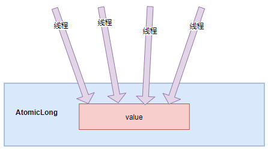
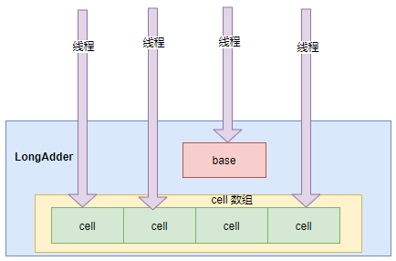

# CSE3114 - CAS 与原子类

返回[Bulletin](./bulletin.md)

返回[CSE311 - Multi-thread Programming](./CSE311.md)

[TOC]

## 并发包JUC

java.util.concurrent包（简称JUC包）中，提供了大量的同步与并发的工具类，是多线程编程的“利器”。

## Unsafe VS Varhandle

C/C++ 风格的 Unsafe 类通过将一个在 0 和 1 之间来回切换的变量作为标识，从而进行 CAS 操作。但它不符合 Java 标准，不推荐开发者使用，所以在 JDK 9 之后，官方推荐 Varhandle 代替 Unsafe 的大部分功能。Varhandle 更加安全、性能更好。

## CAS

Compare And Swap (Compare And Exchange) / 自旋 / 自旋锁 / 无锁 （无重量锁）因为经常配合循环操作，直到完成为止，所以泛指一类操作。

自旋锁原理非常简单，如果持有锁的线程能在很短时间内释放锁资源，那么那些等待竞争锁的线程就不需要做内核态和用户态之间的切换进入阻塞挂起状态，它们只需要等一等（自旋，默认限定次数是10），等持有锁的线程释放锁后即可立即获取锁，这样就避免用户线程和内核的切换的消耗。

自旋锁在JDK1.4就已引入，默认关闭，在JDK6中改为默认开启。

### 乐观锁

CAS并不是一种实际的锁，它仅仅是实现乐观锁的一种思想，java中的乐观锁基本都是通过CAS操作实现的。

乐观锁（Optimistic Lock）是一种乐观思想，假定当前环境是读多写少、不会发生并发冲突，所以每次去拿数据的时候都认为别人不会修改，不会上锁。

在提交更新的时候，乐观锁会通过以下方法判断在此期间别人有没有去更新这个数据：用户在写之前先读出当前版本号，然后乐观锁进行加锁操作，等到用户提交时，比较当前版本号和用户读到的版本号。如果版本号一样则更新（更新期间加锁保证原子性），否则重复上述“读-比较-写”的操作。

乐观锁适用于读多写少的应用场景，这样可以提高吞吐量。

### 实现

Java中的乐观锁基本都是通过CAS操作比较并替换实现的，比较当前值（主内存中的值）与预期值（当前线程中的值，主内存中值的一份拷贝）是否一样，一样则更新，否则继续进行CAS操作。一般使用数据版本（Version）或者时间戳（timestamp）记录机制。

### CAS算法

CAS算法有三个操作数：内存位置V、旧的预期值A和新值B。

当且仅当V符合预期值A时，CAS用新值B原子地更新V的值，否则不要更改该位置，只告诉这个位置现在的值即可。

整个比较并交换的操作是由硬件直接支持的原子操作。

### 优点

自旋锁尽可能的减少线程的阻塞，这对于锁的**竞争不激烈**，且**占用锁时间非常短**的代码块来说，会有大幅度的性能提升。因为此时自旋的消耗会小于线程阻塞挂起再唤醒的操作的消耗。

### 缺点

#### CPU开销较大

在并发量比较高的情况下，如果许多线程反复尝试更新某一个变量，却又一直更新不成功，循环往复，会给CPU带来很大的压力。

而重量级锁有等待队列，所有拿不到锁的进入等待队列，不需要消耗CPU资源。所以在特殊情况下重量级锁要比自旋锁性能更高。

#### 不能保证代码块的原子性

CAS机制所保证的只是一个变量的原子性操作，而不能保证整个代码块的原子性。比如需要保证3个变量共同进行原子性的更新，就不得不使用Synchronized了。

#### ABA问题

自旋锁存在"ABA"问题，假若一个变量初次读取是A，在compare阶段依然是A，但其实可能在此过程中，它先被改为B，再被改回A，而CAS是无法意识到这个问题的。CAS只关注了比较前后的值是否改变，而无法清楚在此过程中变量的变更明细，这就是所谓的ABA漏洞。

*例如：存款余额初始为100，发起原子操作将存款从100扣到50，由于网络阻塞再发起一次同一个操作。正常情况下只有一个操作生效，然而如果此时有另一个操作将存款从50补充到100，就有可能导致两个扣款操作都被执行。*

这个问题的解决方案可以使用版本号标识，每操作一次version 加 1。在 java 5 中，已经提供了 AtomicStampedReference 来解决问题。

基础类型简单值不需要版本号。

### 自适应自旋

JDK1.6引入了适应性自旋锁，意味着自旋的时间不在是固定的了，而是由前一次在同一个锁上的自旋时间、以及锁的拥有者的状态来决定，基本认为一个线程上下文切换的时间是最佳的一个时间。

如果在同一个锁上，自旋刚刚成功获得过锁且持有锁的线程正在运行，虚拟机会认为这次自旋也很可能成功，进而允许自旋持续更久。

如果自旋很少成功，以后获取锁时将可能直接省略掉自旋，避免浪费处理器资源。

有了自适应自旋，随着程序运行时间的增长，虚拟机对程序锁的状况预测就会越来越精准。

## atomic

包含在java.util.concurrent.atomic包中，提供原子变量类相关的功能，是构建非阻塞算法的基础。

atomic包出现自JDK 1.5, 里面一共提供了13个类，分为4种类型：

- 原子更新基本类型

- 原子更新数组

- 原子更新引用

- 原子更新属性

这13个类都是使用C++的Unsafe类实现的包装类。

### 原子操作

当程序更新一个变量时，如果是多线程同时更新这个变量，可能得到的结果与期望值不同。

比如：有一个变量i，A线程执行i+1,B线程也执行i+1，经过两个线程的操作后，变量i的值可能不是期望的3，而是2。这是因为，可能在A线程和B线程执行的时候拿到的i的值都是1，这就是线程不安全的更新操作。

通常可以通过atomic包或者synchronized加锁实现。

#### 原理

以原子操作方法getAndAddInt为例：

```java
@HotSpotIntrinsicCandidate
public final int getAndAddInt(Object o, long offset, int delta) {
    int v;
    do {
        v = getIntVolatile(o, offset);
    } while (!weakCompareAndSetInt(o, offset, v, v + delta));
    return v;
}
```

这段代码是一个无限循环，也就是CAS的自旋。循环体当中做了三件事：

- 获取当前值。

- 当前值+1，计算出目标值。

- 进行CAS操作，如果成功则跳出循环，如果失败则重复上述步骤。

getIntVolatile方法的作用是获取变量的当前值，通过volatile保证获得的值是最新值。

unsafe.cpp中Unsafe_CompareAndSwapInt() 对以上方法进行了实现

```c++
return Atomic::cmpxchg()
```

最终的实现是汇编实现

```assembly
lock->cmpxchg
__asm__ LOCK_IF_MP
```

多个CPU操作一个变量，不想被其他CPU打断就加一个lock（锁总线），不允许其他CPU访问变量，从而不会被打断，这就是CAS的底层实现。

### LongAdder

JDK 1.8出现的LongAdder的效率超过加锁和原子类，是因为它的内部做了分段锁，将一个变量拆成多个变量进行存储，用空间换时间，提升了线程并发。

| 原子类                               | LongAdder                            |
| ------------------------------------ | ------------------------------------ |
|  |  |

```java
public class LongAdder extends Striped64 implements Serializable {
	// 对结果累加 x
	public void add(long x) {...}
	
    // 获取结果，如果当前存在并发更新，结果不准确
    // 如果没有并发更新，那么结果是准确的
	public long sum() {...}
    
    // 结果清零，同样是在非并发更新下，才能保证准确性
    public void reset() {...}
}
```

