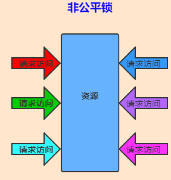
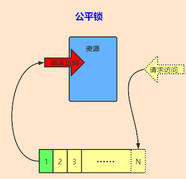
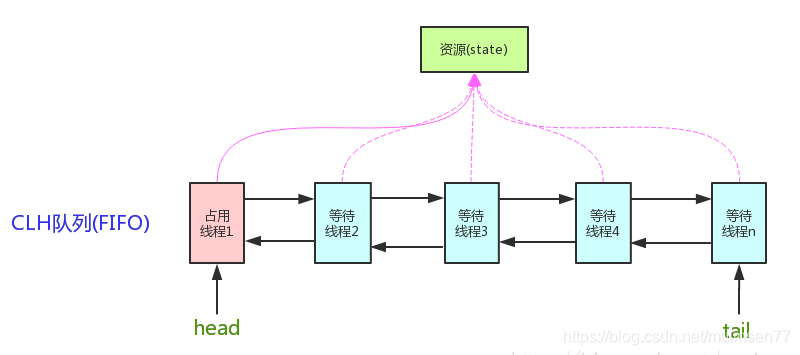
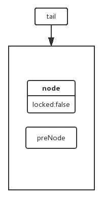
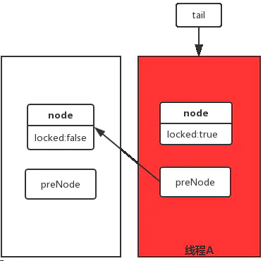
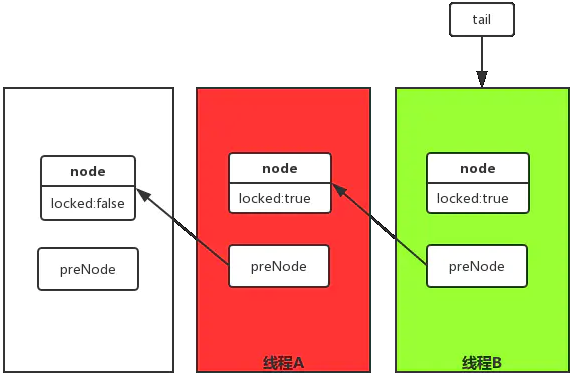
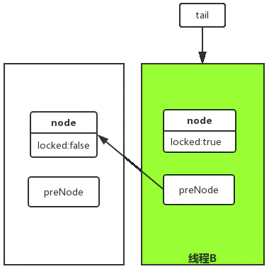
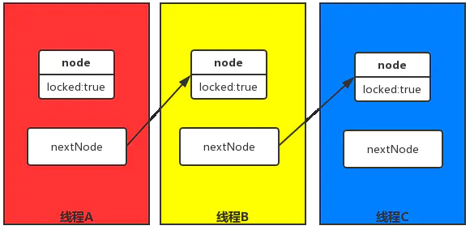
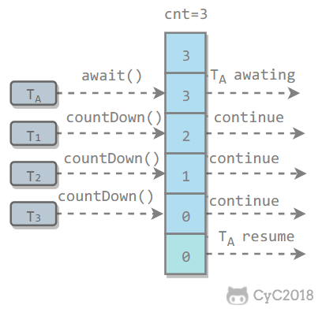
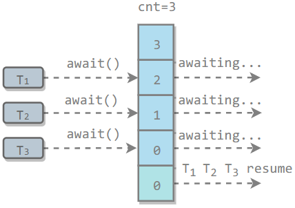

# CSE3115 - 锁与同步工具

返回[Bulletin](./bulletin.md)

返回[CSE311 - Multi-thread Programming](./CSE311.md)

[TOC]

## locks

包含在java.util.concurrent.locks包中，提供显式锁(互斥锁和读写锁)相关功能。

### 线程安全

线程安全是编程中的术语，指某个函数、函数库在并发环境中被调用时，能够正确地处理多个线程之间的共享变量，使程序功能正确完成。即在多线程场景下，不发生有序性、原子性以及可见性问题。

Java中主要通过加锁来实现线程安全。

### Lock接口

Lock接口是使用户能够以非块结构来实现互斥同步，摆脱了语言特性束缚。Lock在类库层面实现同步，并未用到 synchronized，而是利用了volatile的可见性。

### Condition接口

Condition依赖于Lock接口，是在java 1.5中出现的。

生成一个Condition的基本代码：

```java
lock.newCondition();
```

#### await()/signal()/signalAll()

Condition类的await()/signal()/signalAll()用来替代传统的Object的wait()/notify()实现线程间的协作，更加安全和高效。必须在lock保护之内（lock.lock()和lock.unlock之间）才可以调用。

- Conditon中的await()对应Object的wait()；
- Condition中的signal()对应Object的notify()；
- Condition中的signalAll()对应Object的notifyAll()。

```java
public class AwaitSignalExample {
    private Lock lock = new ReentrantLock();
    private Condition condition = lock.newCondition();
    public void before() {
        lock.lock();
        try {
            System.out.println("before");
            condition.signalAll();
        } finally {
            lock.unlock();
        }
    }
    public void after() {
        lock.lock();
        try {
            condition.await();
            System.out.println("after");
        } catch (InterruptedException e) {
            e.printStackTrace();
        } finally {
            lock.unlock();
        }
    }
}
public static void main(String[] args) {
    ExecutorService executorService = Executors.newCachedThreadPool();
    AwaitSignalExample example = new AwaitSignalExample();
    executorService.execute(() -> example.after());
    executorService.execute(() -> example.before());
}
```

```
before
after
```

### ReentrantLock

ReentrantLock是Lock接口的最常见的实现。

```java
public class LockExample {
    private Lock lock = new ReentrantLock();
    public void func() {
        lock.lock();
        try {
            for (int i = 0; i < 10; i++) {
                System.out.print(i + " ");
            }
        } finally {
            lock.unlock(); // 确保释放锁，从而避免发生死锁。
        }
    }
}
public static void main(String[] args) {
    LockExample lockExample = new LockExample();
    ExecutorService executorService = Executors.newCachedThreadPool();
    executorService.execute(() -> lockExample.func());
    executorService.execute(() -> lockExample.func());
}
```

```
0 1 2 3 4 5 6 7 8 9 0 1 2 3 4 5 6 7 8 9
```

#### 等待可中断

持有锁的线程长期不释放锁时，正在等待的线程可以选择放弃等待而处理其他事情。

#### 锁绑定多个条件

synchronized中锁对象的wait跟notify可以实现一个隐含条件，如果要和多个条件关联就不得不额外添加锁，而ReentrantLock可以多次调用newCondition创建多个条件。

#### 非公平锁/公平锁

ReentrantLock在默认情况下是非公平的，在锁被释放时，任何线程都有机会获得锁。一旦使用了公平锁，多个线程在等待同一个锁时必须按照申请锁的顺序来依次获得锁，性能会急剧下降，影响吞吐量。

可以通过构造方法指定公平锁，fair的取值代表了这个锁是公平锁还是非公平锁。无参数或false代表非公平锁，true代表公平锁。

```java
    /**
     * Creates an instance of {@code ReentrantLock}.
     * This is equivalent to using {@code ReentrantLock(false)}.
     */
    public ReentrantLock() {
        sync = new NonfairSync();
    }

    /**
     * Creates an instance of {@code ReentrantLock} with the
     * given fairness policy.
     *
     * @param fair {@code true} if this lock should use a fair ordering policy
     */
    public ReentrantLock(boolean fair) {
        sync = fair ? new FairSync() : new NonfairSync();
    }
```

|              | 非公平锁                                                     | 公平锁                                                       |
| ------------ | ------------------------------------------------------------ | ------------------------------------------------------------ |
| 定义         | 非公平锁是一种思想，JVM按就近原则分配锁。                    | 公平锁是一种思想，指多个线程在等待同一个锁时，必须按照申请锁的先后顺序来一次获得锁。 |
| 实现的区别   | 非公平锁后来的线程有一定几率逃离被挂起的开销，减少了一次挂起和唤醒。线程切换的开销其实就是非公平锁效率高于公平锁的原因。除非程序有特殊需要，否则最常用非公平锁的分配机制。 | 公平锁要维护一个队列，后来的线程要加锁，即使锁空闲，也要先检查有没有其他线程在wait，如果有，自己要挂起、加到队列后面，然后唤醒队列最前面的线程。 |
| 图示         |                          |                          |
| 实现可重入锁 | 非公平所通过nonfairTryAcquire方法获取锁，成功获取锁的线程再次获取锁将增加同步状态值，释放同步状态时将减少同步状态值。该方法将同步状态是否为0作为最终释放条件，释放时将占有线程设置为null并返回true. 如果锁被获取了n次，那么前n-1次tryRelease方法必须都返回false, 只有同步状态完全释放才能返回true. | 公平锁使用tryAcquire方法，该方法与nonfairTryAcquire的唯一区别就是判断条件中多了对同步队列中当前节点是否有前驱节点的判断，如果该方法返回true表示有线程比当前线程更早请求锁，因此需要等待前驱线程获取并释放锁后才能获取锁。 |

### ReentrantReadWriteLock 可重入读写锁

可重入读写锁ReentrantReadWriteLock和ReentrantLock不同，ReentrantReadWriteLock实现的是ReadWriteLock接口，表示两个锁：

读操作相关的锁称为**共享锁**，线程进入读锁的前提条件：

- 没有其他线程的写锁。

- 没有写请求或者有写请求，但调用线程和持有锁的线程是同一个。

写操作相关的锁称为**排他锁**，线程进入写锁的前提条件：

- 没有其他线程的读锁

- 没有其他线程的写锁

ReadWriteLock接口的核心方法是readLock()，writeLock()，适用于读多写少的情况。性能较高。读写锁有以下三个重要的特性：

- 平选择性：支持非公平（默认）和公平的锁获取方式，吞吐量还是非公平优于公平。
- 重进入：读锁和写锁都支持线程重进入。
- 锁降级：遵循获取写锁、获取读锁再释放写锁的次序，写锁能够降级成为读锁

### AQS

java.util.concurrent大大提高了并发性能，AQS被认为是J.U.C的核心。

java.util.concurrent.locks包提供了AQS队列同步器（AbstractQueuedSynchronizer），是用来构建锁或其他同步组件的基础框架，是除了java自带的synchronized关键字之外的锁机制。

AQS是自旋锁，在等待唤醒的时候，经常会使用自旋（while(!cas())）的方式，不停地尝试获取锁，直到被其他线程获取成功。

- 如果被请求的共享资源空闲，则将当前请求资源的线程设置为有效的工作线程，并将共享资源设置为锁定状态；
- 如果被请求的共享资源被占用，那么就需要一套线程阻塞等待以及被唤醒时锁分配的机制。AQS的这个机制是用CLH队列锁实现的，将暂时获取不到锁的线程加入到队列中。

### CLH锁

CLH锁(Craig, Landin, and Hagersten三个人的名字)，它是基于链表实现的自旋锁，它不断的轮询前驱的状态，如果前驱释放锁，它就结束自旋转。CLH锁是公平锁，FIFO.



CLH（Craig，Landin，and Hagersten）队列是一个虚拟的双向队列，虚拟的双向队列即不存在队列实例，仅存在节点之间的关联关系。

#### 实现

AQS是将每一条请求共享资源的线程封装成一个CLH锁队列的一个结点（Node）来实现锁的分配。

线程持有自己的node变量，node中有一个locked属性，true代表需要锁，false代表不需要锁。

线程持有前驱的node引用，轮询前驱node的locked属性，true的时候自旋，false的时候代表前驱释放了锁，结束自旋。

```java
private transient volatile Node head;
private transient volatile Node tail;
```

head节点是一个哨兵节点，不存放实际的“线程”节点（使用Node的无参构造函数）。

tail指向链表的最后一个节点，当新增节点时，将新节点作为当前tail的下一个节点，通过CAS设置成功后,将新节点设为新的tail节点即可。

| 步骤                                                         | 图示                                 |
| ------------------------------------------------------------ | ------------------------------------ |
| 初始化的时候tail指向一个类似head的节点，此时node的locked属性为false，preNode为空。 |  |
| 当线程A进来的时候，线程A持有的node节点，node的locked属性为true，preNode指向之前的head节点。 |  |
| 当线程B进来的时候，线程B持有的node节点，node的locked属性为true，preNode指向线程A的node节点，线程B的node节点locked属性为true，线程A轮询线程B的node节点的locked状态，为true自旋。 |  |
| 线程A执行完后释放锁（修改locked属性为false），线程B轮询到线程A的node节点locked属性为false，结束自旋。 |  |

#### 同步状态state

AQS还使用一个volatile int state变量作为共享资源代表同步状态。如果线程获取资源失败，则进入同步队列等待；如果获取成功就执行临界区代码，释放资源时会通知同步队列中的等待线程。

```java
private volatile int state;

//读取当前state
protected final int getState() {
    return state;
}

//直接写入，不考虑当前值
protected final void setState(int newState) {
    state = newState;
}

//保证读-写的原子性
protected final boolean compareAndSetState(int expect, int update) {
    return unsafe.compareAndSwapInt(this, stateOffset, update);
}
```

AQS中还定义了一些未实现的方法（抛出UnsupportedOperationException异常）：

- tryAcquire(int) 尝试获取state

- tryRelease(int) 尝试释放state

- tryAcquireShared(int) 共享的方式尝试获取

- tryReleaseShared(int) 共享的方式尝试释放

- isHeldExclusively() 判断当前是否为独占锁

这些方法是子类需要实现的，可以选择实现其中的一部分。根据实现方式的不同，可以分为两种：共享锁和独占锁。这两种锁多用于数据库中的事物操作，主要针对读和写的操作。

##### 独占锁（排它锁、互斥锁、写锁或X锁）

独占锁只会被一个线程占用，其他线程必须等到持有锁的线程释放锁后才能获取锁。获得锁的事务即能读数据又能修改数据。

获取同步状态时，调用acquire方法，维护一个同步队列，使用tryAcquire方法安全地获取线程同步状态，获取失败的线程会被构造同步节点并通过addWaiter方法加入到同步队列的尾部，在队列中自旋。之后调用acquireQueued方法使得该节点以死循环的方式获取同步状态，如果获取不到则阻塞，被阻塞线程的唤醒主要依靠前驱节点的出队或被中断实现，移出队列或停止自旋的条件是前驱节点是头结点且自己成功获取了同步状态。

释放同步状态时，同步器调用tryRelease方法释放同步状态，然后调用unparkSuccessor方法唤醒头节点的后继节点，使后继节点重新尝试获取同步状态。

可以用来实现：

- ReentrantLock

- ReentrantReadWriteLock.WriteLock

##### 共享锁（读锁或S锁）

共享锁如果被一个线程占用，其他线程也可以获得同一个共享锁，但是不能获得同一个数据上的独占锁。

获取同步状态时，调用acquireShared方法，该方法调用tryAcquireShared方法尝试获取同步状态，返回值为int类型，返回值不小于0表示能获取同步状态。因此在共享式获取锁的自旋过程中，成功获取同步状态并退出自旋的条件就是该方法的返回值不小于0。

释放同步状态时，调用releaseShared方法，释放后会唤醒后续处于等待状态的节点。它和独占式的区别在于tryReleaseShared方法必须确保同步状态安全释放，通过循环CAS保证，因为释放同步状态的操作会同时来自多个线程。

可以用来实现：

- ReentrantReadWriteLock.ReadLock

- CountDownLatch

- CyclicBarrier

- Semaphore

#### 节点属性

```java
volatile Node prev;
volatile Node next;
volatile Thread thread;

volatile int waitStatus;
//可以被赋值为以下常量：
static final int CANCELLED = 1;
static final int SIGNAL = -1;
static final int CONDITION = -2;
static final int PROPAGATE = -3;

Node nextWaiter;
//可以被赋值为以下常量：
//共享锁
static final Node SHARED = new Node();
//独占锁
static final Node EXCLUSIVE = null;
```

#### 构造函数

```java
//不存放任何线程，用于生成哨兵节点
Node();
//用于锁
Node(Thread thread, Node mode);
//用于Condition
Node(Thread thread, int waitStatus);
```

#### 优点

空间复杂度低，如果有n个线程，L个锁，每个线程每次只获取一个锁，那么需要的存储空间是O(L+n)。

#### 缺点

在NUMA(Non-Uniform Memory Access)非一致存储访问的情况下，CPU分成不同模块，访问内存所需时间不相同，会导致锁性能下降。

### MCS锁

MCS(John Mellor-Crummey和Michael Scott)锁可以解决CLH锁的缺点。MCS Spinlock是一种基于链表的可扩展、高性能、公平的自旋锁，申请线程只在本地变量上自旋，不是像CLH自旋锁一样轮询前驱的状态，而是由前驱主动通知，从而极大地减少了不必要的处理器缓存同步的次数，降低了总线和内存的开销。



每个线程持有一个自己的node，node有一个locked属性，true表示等待获取锁，false表示可以获取到锁，并且持有下一个node（后继者）的引用（可能存在）。

线程在轮询自己node的locked状态，true表示锁被其他线程暂用，等待获取锁，自旋。

线程释放锁的时候，修改后继者（nextNode）的locked属性，通知后继者结束自旋。

### LockSupport

在synchronized加锁的情况下使用wait()和notify()时会受到如下限制：

- 由于wait()需要释放锁，所以必须在synchronized中使用，否则会抛出异常。
- notify()不释放锁，但也需要在synchronized中使用，并且需要指定对象。

- synchronized, wait(), notify()的对象必须一致。

- synchronized中只能有一个线程调用wait()或notify().

JDK 1.6中，JUC的locks子包推出了工具类LockSupport, 提供了以下两种方法：

- 阻塞线程 LockSupport.pack()

- 唤醒线程 LockSupport.unpack(Thread t)

#### 特点

- 不需要加锁就可以阻塞或者唤醒线程。

- LockSupport.unpack(Thread t)可以先于LockSupport.pack()调用，并且线程不会阻塞。

- 连续调用两次LockSupport.pack()会导致线程永远无法被唤醒。

```java
Thread t = new Thread(()->{
    for (int i = 0; i < 10; i++) {
        System.out.println(i);
        if(i == 5) {
            LockSupport.park();
        }
        try {
            TimeUnit.SECONDS.sleep(1);
        } catch (InterruptedException e) {
            e.printStackTrace();
        }
    }
});
t.start();
LockSupport.unpark(t);
```

```
0
1
2
3
4
5
6
7
8
9
```

## 同步工具

散落在java.util.concurrent包中，提供同步工具类，如信号量、闭锁、栅栏等功能。

### CountDownLatch 门栓



用来控制一个或者多个线程等待多个线程都执行完成并且调用countDown()方法进行减一操作、发出通知后，当前线程才可以继续执行await()方法后面的部分。用join也可以实现。

CountDownLatch维护了一个计数器cnt，每次调用countDown()方法会让计数器的值减1。

减到0的时候，那些因为调用await()方法而在等待的线程就会被唤醒，可以唤起多个任务。计数器不可重用，计数值为0以后该CountDownLatch就不可再用了。

```java
public class CountdownLatchExample {
    public static void main(String[] args) throws InterruptedException {
        final int totalThread = 10;
        CountDownLatch countDownLatch = new CountDownLatch(totalThread);
        ExecutorService executorService = Executors.newCachedThreadPool();
        for (int i = 0; i < totalThread; i++) {
            executorService.execute(() -> {
                System.out.print("run..");
                countDownLatch.countDown();
            });
        }
        countDownLatch.await();
        System.out.println("end");
        executorService.shutdown();
    }
}
```

```
run..run..run..run..run..run..run..run..run..run..end
```

### CyclicBarrier 栅栏/循环屏障



所有线程等到同时进入某一位置后再一起开始执行。

和CountdownLatch相似，都是通过维护计数器来实现的。线程执行await()方法之后计数器会减1并进行等待，直到计数器为0，所有调用await()方法而在等待的线程才能继续执行。

和CountdownLatch不同，CyclicBarrier只能唤起一个任务，且计数器可通过执行reset()重用。

CyclicBarrier有两个构造函数，其中parties指示计数器的初始值，barrierAction在所有线程都到达屏障的时候会执行一次。

```java
public CyclicBarrier(int parties, Runnable barrierAction) {
    if (parties <= 0) throw new IllegalArgumentException();
    this.parties = parties;
    this.count = parties;
    this.barrierCommand = barrierAction;
}
public CyclicBarrier(int parties) {
    this(parties, null);
}
public class CyclicBarrierExample {
    public static void main(String[] args) {
        final int totalThread = 10;
        CyclicBarrier cyclicBarrier = new CyclicBarrier(totalThread);
        ExecutorService executorService = Executors.newCachedThreadPool();
        for (int i = 0; i < totalThread; i++) {
            executorService.execute(() -> {
                System.out.print("before..");
                try {
                    cyclicBarrier.await();
                } catch (InterruptedException | BrokenBarrierException e) {
                    e.printStackTrace();
                }
                System.out.print("after..");
            });
        }
        executorService.shutdown();
    }
}
```

```
before..before..before..before..before..before..before..before..before..before..after..after..after..after..after..after..after..after..after..after..
```

### Phaser 阶段器

Phaser表示“阶段器”，用来解决控制多个线程**分阶段**共同完成任务的情景问题。其作用相比CountDownLatch和CyclicBarrier更加灵活。

```java
public class PhaserTest extends Phaser {
    @Override
    protected boolean onAdvance(int phase, int registeredParties) { //在每个阶段执行完成后回调的方法
        switch (phase) {
        case 0:
            return haveAppetizer();
        case 1:
            return haveDinner();
        case 2:
            return haveDessert();
        }
        return true;
    }
    private boolean haveAppetizer(){
        System.out.println(getRegisteredParties() + " people have had appetizer.");
        return false;
    }
    private boolean haveDinner(){
        System.out.println(getRegisteredParties() + " people have had dinner.");
        return false;
    }
    private boolean haveDessert(){
        System.out.println(getRegisteredParties() + " people have had dessert.");
        return true;
    }
    static class CustomerTask implements Runnable {
        private Phaser phaser;
        public CustomerTask(Phaser phaser) {
            this.phaser = phaser;
        }
        @Override
        public void run() {
            System.out.println(Thread.currentThread().getName()+" is arrived.");
            phaser.arriveAndAwaitAdvance();
            System.out.println(Thread.currentThread().getName()+" is to have appetizer.");
            try {
                Thread.sleep(1000L);
            } catch (InterruptedException e) {
                e.printStackTrace();
            }
            System.out.println(Thread.currentThread().getName()+" have had appetizer.");
            phaser.arriveAndAwaitAdvance();
            System.out.println(Thread.currentThread().getName()+" is to have dinner.");
            try {
                Thread.sleep(1000L);
            } catch (InterruptedException e) {
                e.printStackTrace();
            }
            System.out.println(Thread.currentThread().getName()+" have had dinner.");
            phaser.arriveAndAwaitAdvance();
            System.out.println(Thread.currentThread().getName()+" is to have dessert.");
            try {
                Thread.sleep(1000L);
            } catch (InterruptedException e) {
                e.printStackTrace();
            }
            System.out.println(Thread.currentThread().getName()+" have had dessert.");
            phaser.arriveAndAwaitAdvance();
        }
    }
    public static void main(String[] args) {
        PhaserTest phaser = new PhaserTest();
        CustomerTask[] customerTasks = new CustomerTask[5];
        for (int i = 0; i < customerTasks.length; i++) {
            customerTasks[i] = new CustomerTask(phaser);
            phaser.register();
        }
        Thread[] threads = new Thread[customerTasks.length];
        for (int i = 0; i < customerTasks.length; i++) {
            threads[i] = new Thread(customerTasks[i], "Customer " + i);
            threads[i].start();
        }
    }
}
```

```
Customer 1 is arrived.
Customer 4 is arrived.
Customer 0 is arrived.
Customer 3 is arrived.
Customer 2 is arrived.
5 people have had appetizer.
Customer 2 is to have appetizer.
Customer 0 is to have appetizer.
Customer 1 is to have appetizer.
Customer 4 is to have appetizer.
Customer 3 is to have appetizer.
Customer 4 have had appetizer.
Customer 1 have had appetizer.
Customer 3 have had appetizer.
Customer 0 have had appetizer.
Customer 2 have had appetizer.
5 people have had dinner.
Customer 2 is to have dinner.
Customer 3 is to have dinner.
Customer 4 is to have dinner.
Customer 1 is to have dinner.
Customer 0 is to have dinner.
Customer 2 have had dinner.
Customer 0 have had dinner.
Customer 1 have had dinner.
Customer 3 have had dinner.
Customer 4 have had dinner.
5 people have had dessert.
Customer 3 is to have dessert.
Customer 4 is to have dessert.
Customer 1 is to have dessert.
Customer 2 is to have dessert.
Customer 0 is to have dessert.
Customer 3 have had dessert.
Customer 2 have had dessert.
Customer 1 have had dessert.
Customer 0 have had dessert.
Customer 4 have had dessert.
```

### Exchanger 交换者

交换者是用于线程间协作的工具类，用于进行线程间的数据交换。它提供一个同步点，在这个同步点两个线程可以交换彼此的数据。应用场景包括遗传算法、校对工作等。

两个线程通过exchange方法交换数据，第一个线程执行exchange方法后会阻塞等待第二个线程执行该方法，当两个线程都到达同步点时这两个线程就可以交换数据，将本线程生产出的数据传递给对方。

```java
static Exchanger<String> exchanger = new Exchanger<>();

public static void main(String[] args) {
    new Thread(()->{
        String s = "T1";
        try {
            s = exchanger.exchange(s);
        } catch (InterruptedException e) {
            e.printStackTrace();
        }
        System.out.println(Thread.currentThread().getName() + " " + s);
    }, "t1").start();
    new Thread(()->{
        String s = "T2";
        try {
            s = exchanger.exchange(s);
        } catch (InterruptedException e) {
            e.printStackTrace();
        }
        System.out.println(Thread.currentThread().getName() + " " + s);
    }, "t2").start();
}
```

```
t1 T2
t2 T1
```

### Semaphore 信号量

Semaphore信号量的作用是限制某段代码块的并发数。

Semaphore有一个构造函数，可以传入一个int型整数n，表示某段代码最多只有n个线程可以访问。线程可以使用acquire()方法获得一个许可，当许可超出了n时会被阻塞，等到某个线程执行完毕调用release()，下一个线程再acquire().

如果Semaphore构造函数中传入的int型整数n=1，相当于变成了一个synchronized了。

```java
public class SemaphoreExample {
    public static void main(String[] args) {
        final int clientCount = 3;
        final int totalRequestCount = 10;
        Semaphore semaphore = new Semaphore(clientCount);
        ExecutorService executorService = Executors.newCachedThreadPool();
        for (int i = 0; i < totalRequestCount; i++) {
            executorService.execute(()->{
                try {
                    semaphore.acquire();
                    System.out.print(semaphore.availablePermits() + " ");
                } catch (InterruptedException e) {
                    e.printStackTrace();
                } finally {
                    semaphore.release();
                }
            });
        }
        executorService.shutdown();
    }
}
```

```
2 1 2 2 2 2 2 1 2 2
```

