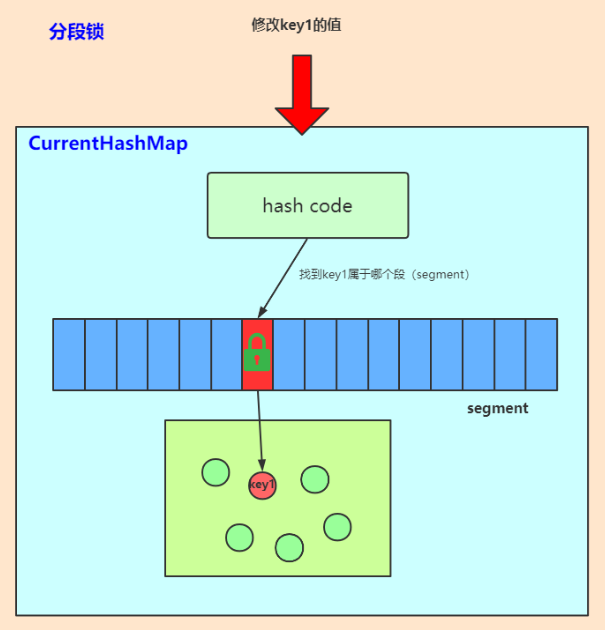
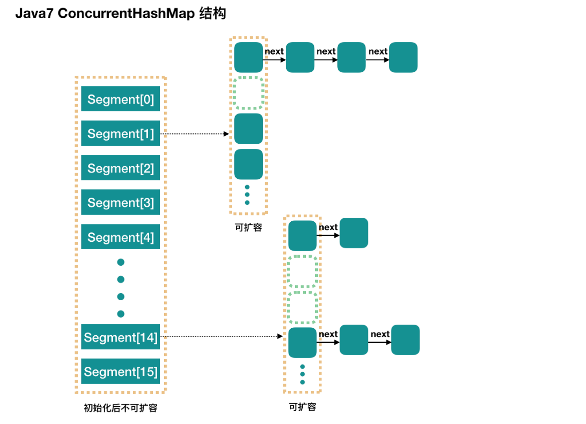
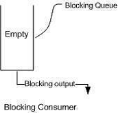
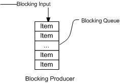

# CSE3117 - 并发容器

返回[Bulletin](./bulletin.md)

返回[CSE311 - Multi-thread Programming](./CSE311.md)

[TOC]

## 同步容器

同步容器通过synchronized关键字修饰容器保证同一时刻内只有**一个线程**在使用容器，从而使得容器线程安全。但不能保证复合操作的线程安全。举例：A线程第一步获取尾节点，第二步将尾结点的值加1，但在A线程执行完第一步的时候，B线程删除了尾节点，在A线程执行第二步的时候就会报空指针。

| 名称                         | 备注                                                      |
| ---------------------------- | --------------------------------------------------------- |
| Vector                       | JDK 1.0推出的线程安全的List, 所有方法用synchronized修饰。 |
| Stack                        | 继承自Vector.                                             |
| HashTable                    | JDK 1.0推出的线程安全的Map, 所有方法用synchronized修饰。  |
| Collections.synchronizedList | 加锁版本的ArrayList.                                      |
| Collections.synchronizedSet  | 加锁版本的HashSet.                                        |
| Collections.synchronizedMap  | 加锁版本的HashMap.                                        |
| SynchronizedHashMap          | 给HashMap手动加锁，效率和HashTable差别不大。              |

## 并发容器

散落在java.util.concurrent包中，提供并发容器相关功能。

并发容器指的是允许多线程同时使用容器，并且保证线程安全。而为了达到尽可能提高并发，Java并发工具包中采用了多种优化方式来提高并发容器的执行效率，核心的就是：锁、CAS（无锁）、COW（读写分离）、分段锁。

Java集合类都是快速失败(fail-fast)的，这就意味着当集合被改变且一个线程在使用迭代器(iterator)遍历集合的时候，迭代器的next()方法将抛出ConcurrentModificationException异常。并发容器是安全失败(fail-safe)的，支持并发的遍历和并发的更新。

### 常见容错机制

#### failover 失效转移

Failover的含义为“失效转移”，是一种备份操作模式，当主要组件异常时，其功能转移到备份组件。其要点在于有主有备，且主故障时备可启用，并设置为主。如Mysql的双Master模式，当正在使用的Master出现故障时，可以拿备Master做主使用

#### failfast 快速失败

Failfast从字面含义看就是“快速失败”，尽可能的发现系统中的错误，使系统能够按照事先设定好的错误的流程执行，对应的方式是“fault-tolerant（错误容忍）”。

Java集合类都是快速失败(fail-fast)的，当多个线程对同一个集合的内容进行操作时（比如当集合被改变且一个线程在使用迭代器(iterator)遍历集合的时候），迭代器的next()方法将抛出ConcurrentModificationException异常。

#### failback 失效自动恢复

Failover之后的自动恢复，在簇网络系统（有两台或多台服务器互联的网络）中，由于要某台服务器进行维修，需要网络资源和服务暂时重定向到备用系统。在此之后将网络资源和服务器恢复为由原始主机提供的过程，称为自动恢复

#### failsafe 失效安全

FailSafe的含义为“失效安全”，即使在故障的情况下也不会造成伤害或者尽量减少伤害。

为了避免触发fail-fast机制，导致异常，我们可以使用Java中提供的一些采用了fail-safe机制的集合类。这样的集合容器在遍历时不是直接在集合内容上访问的，而是先复制原有集合内容，在拷贝的集合上进行遍历。

java.util.concurrent包下的容器都是fail-safe的，可以在多线程下并发使用，并发修改。同时也可以在foreach中进行add/remove.

### CopyOnWrite

Copy-On-Write简称COW，是一种用于程序设计中的优化策略。其基本思路是，从一开始大家都在共享同一个内容，当某个人想要修改这个内容的时候，才会真正把内容Copy出去形成一个新的内容然后再改，这是一种延时懒惰策略。

CopyOnWrite容器即写时复制的容器。通俗的理解是当我们往一个容器添加元素的时候，不直接往当前容器添加，而是先将当前容器进行Copy，复制出一个新的容器，然后新的容器里添加元素，添加完元素之后，再将原容器的引用指向新的容器。

#### CopyOnWriteArrayList

CopyOnWriteArrayList相当于实现了线程安全的ArrayList，它的机制是在对容器有写入操作时，copy出一份副本数组，完成操作后将副本数组引用赋值给容器。底层是通过ReentrantLock来保证同步。

由于每次修改都会复制一份数据，所以CopyOnWriteArrayList主要适合读多写少的场景。

因为它通过牺牲容器的一致性来换取容器的高并发效率（在copy期间读到的是旧数据），所以不能在需要强一致性的场景下使用。

#### CopyOnWriteArraySet

CopyOnWriteArraySet和CopyOnWriteArrayList原理一样，它是实现了CopyOnWrite机制的Set集合。

### ConcurrentHashMap

在 Java 5 之后，JDK 引入了java.util.concurrent并发包，其中最常用的就是ConcurrentHashMap了，它的原理是引用了内部的Segment分段锁(ReentrantLock, 保证在操作Map的不同段的时候可以并发执行，操作同段的时候进行锁的竞争和等待，从而达到线程安全，且效率大于synchronized关键字。每个Segment内部很像一个HashMap，不过要保证线程安全，所以处理起来要麻烦些。

#### Get方法

1. 为输入的Key做Hash运算，得到hash值。

2. 通过hash值，定位到对应的Segment对象

3. 再次通过hash值，定位到Segment当中数组的具体位置。

#### Put方法

1. 为输入的Key做Hash运算，得到hash值。

2. 通过hash值，定位到对应的Segment对象

3. 获取可重入锁

4. 再次通过hash值，定位到Segment当中数组的具体位置。

5. 插入或覆盖HashEntry对象。

6. 释放锁。

#### Size方法

1. 遍历所有的Segment。

2. 把Segment的元素数量累加起来。

3. 把Segment的修改次数累加起来。

4. 判断所有Segment的总修改次数是否大于上一次的总修改次数。如果大于，说明统计过程中有修改，重新统计，尝试次数+1；如果不是。说明没有修改，统计结束。

5. 如果尝试次数超过阈值，则对每一个Segment加锁，再重新统计。

6. 再次判断所有Segment的总修改次数是否大于上一次的总修改次数。由于已经加锁，次数一定和上次相等。

7. 释放锁，统计结束。

这种思想和乐观锁悲观锁的思想如出一辙。为了尽量不锁住所有Segment，首先乐观地假设Size过程中不会有修改。当尝试一定次数，才无奈转为悲观锁，锁住所有Segment保证强一致性。

#### 性能

插入涉及到CAS判断等等，效率不如从前，但是读的效率有所提高。

使用putIfAbsent, computeIfAbsent, getOrDefault等API可以显著提升ConcurrentHashMap的性能优势。

#### concurrencyLevel

concurrencyLevel又可以称为并行级别、并发数、Segment数，默认是 16，也就是说ConcurrentHashMap有16个Segments，最多可以同时支持16个线程并发写，只要它们的操作分别分布在不同的Segment上。

这个值可以在初始化的时候设置为其他值，但是一旦初始化以后，它是不可以扩容的。

#### JDK 8优化

##### 取消分段锁机制

重新使用了synchronized关键字，进一步降低冲突概率。弃用分段锁的原因可能来自以下几点：

- 加入多个分段锁浪费内存空间。

- 生产环境中，map在放入时竞争同一个锁的概率非常小，分段锁反而会造成更新等操作的长时间等待。

- 提高GC的效率。

通过JDK的源码和官方文档看来，源码保留了segment 代码，但并没有使用。

##### 引入红黑树结构

同一个哈希槽上的元素个数超过一定阈值后，单向链表改为红黑树结构。

##### 使用了更加优化的方式统计集合内的元素数量

具体优化表现在：在 put、resize 和 size 方法中涉及元素总数的更新和计算都避免了锁，使用 CAS 代替。执行put()时，首先通过hash找到对应链表过后，查看是否是第一个object。

- 如果是，直接用CAS原则插入，无需加锁。
- 如果不是链表第一个object，则直接用链表第一个object加锁，这里加的锁是synchronized，虽然效率不如ReentrantLock，但节约了空间。这里会一直使用第一个object作为锁，直到重新计算map大小，比如扩容或者操作到第一个object为止。

### ConcurrentTreeMap

相当于实现了线程安全的TreeMap。key是有序的，并且key和value都不能为null.

### ConcurrentSkipListMap

红黑树在插入或删除节点的时候需要旋转调整，导致需要控制的粒度较大。

因此ConcurrentSkipListMap采用的跳跃表的机制来替代红黑树，利用无锁CAS机制实现高并发线程安全。

### ConcurrentSkipListSet

ConcurrentSkipListSet和ConcurrentSkipListMap原理一样，它是实现了高并发线程安全的TreeSet。

### BlockingQueue 阻塞队列

java.util.concurrent.BlockingQueue的特性是：

当队列中没有数据的情况下，消费者端的所有线程都会被自动阻塞（挂起），直到有数据放

入队列。

当队列中填满数据的情况下，生产者端的所有线程都会被自动阻塞（挂起），直到队列中有

空的位置，线程被自动唤醒。

阻塞队列不接受空值，当你尝试向队列中添加空值的时候，它会抛出 NullPointerException。

阻塞队列的实现都是线程安全的，所有的查询方法都是原子的并且使用了内部锁或者其他形式的并发控制。

可用来实现内存消息队列。

#### 主要方法

| 方法/异常处理 | 抛出异常  | 返回特殊值(null或false) | 操作成功之前一直阻塞线程 | 超过一定时长则放弃阻塞 |
| ------------- | --------- | ----------------------- | ------------------------ | ---------------------- |
| 插入          | add(e)    | offer(e)                | put(e)                   | offer(e, time, unit)   |
| 移除          | remove()  | poll()                  | take()                   | poll(time, unit)       |
| 检查          | element() | peek()                  | 不可用                   | 不可用                 |

#### ArrayBlockingQueue

由数组组成的有界阻塞队列，默认情况下不保证线程公平，有可能先阻塞的线程最后才访问队列。

#### LinkedBlockingQueue

由链表结构组成的无界阻塞队列，队列的默认和最大长度为 Integer 最大值。

#### PriorityBlockingQueue

支持优先级的无界阻塞队列，默认情况下元素按照升序排序。可自定义 compareTo 方法指定排序规则，或者初始化时指定 Comparator 排序，不能保证同优先级元素的顺序。

#### DelayQueue

支持延时获取元素的无界阻塞队列，使用优先级队列实现。创建元素时可以指定多久才能从队列中获取当前元素，只有延迟期满时才能从队列中获取元素，适用于缓存和定时调度。

#### SynchronousQueue

不存储元素的阻塞队列，每一个 put 必须等待一个 take。默认使用非公平策略，也支持公平策略，适用于传递性场景，吞吐量高。

#### LinkedTransferQueue

链表组成的无界阻塞队列，相对于其他阻塞队列多了 tryTransfer 和 transfer 方法。transfer方法：如果当前有消费者正等待接收元素，可以把生产者传入的元素立刻传输给消费者，否则会将元素放在队列的尾节点并等到该元素被消费者消费才返回。tryTransfer 方法用来试探生产者传入的元素能否直接传给消费者，如果没有消费者等待接收元素则返回 false，和 transfer 的区别是无论消费者是否消费都会立即返回。

#### LinkedBlockingDeque

链表组成的双向阻塞队列，可从队列的两端插入和移出元素，多线程同时入队时减少了竞争。

### ConcurrentLinkedQueue 非阻塞队列

ConcurrentLinkedQueue是线程安全的无界非阻塞队列,其底层数据结构是使用单向链表实现,入队和出队操作是使用我们经常提到的CAS来保证线程安全。

### 管道输入输出流

Java中有各种各样的输入、输出流（Stream），其中管道流（pipeStream）是一种特殊的流，用于在不同线程间直接传送数据。一个线程发送数据到输出管道，另一个线程从输入管道读数据。

- 字节流：PipedInputStream, PipedOutputStream

- 字符流：PipedReader, PipedWriter

这种方式在生产者和生产者、消费者和消费者之间不能保证同步，也就是说在一个生产者和一个消费者的情况下是可以生产者和消费者之间交替运行的，多个生成者和多个消费者者之间则不行。

