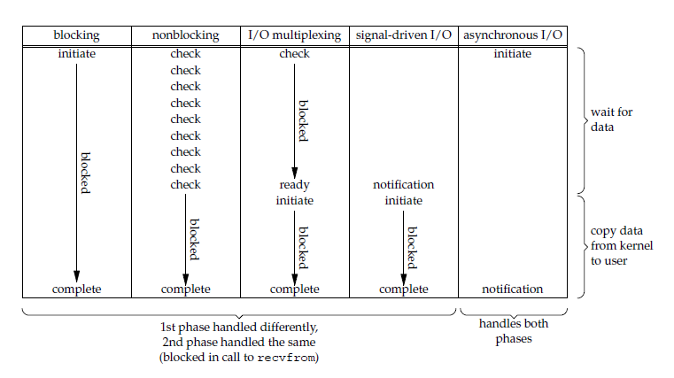
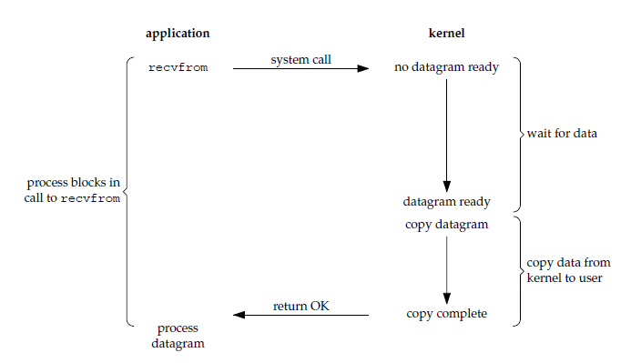
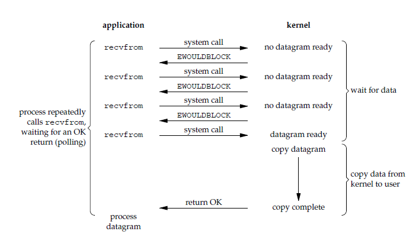
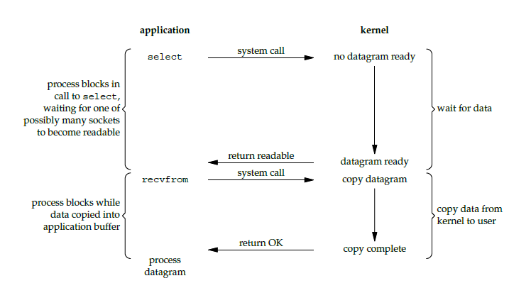
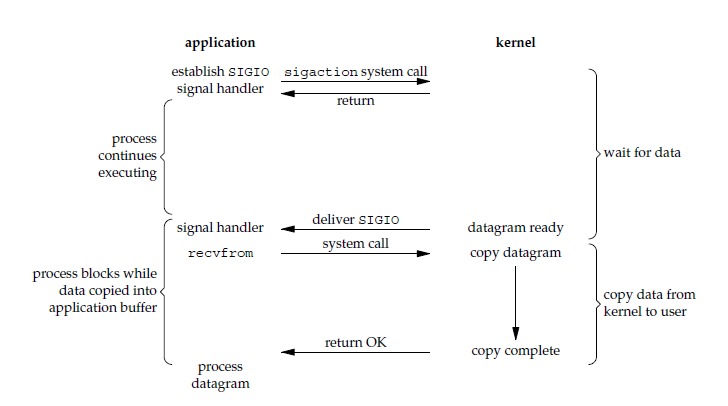
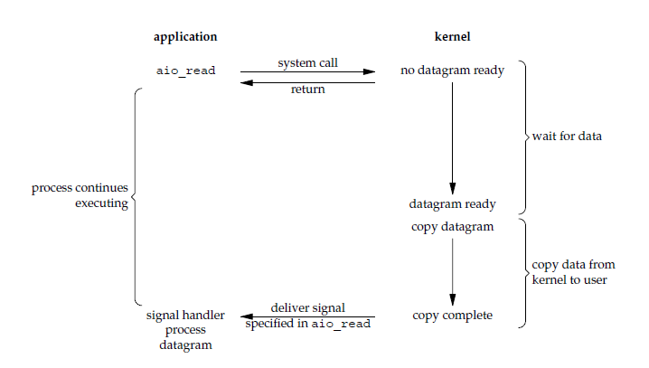

# CSE351 - Java IO - I/O模型

返回[Bulletin](./bulletin.md)

返回[CSE351 - Java I/O](./CSE351.md)

[TOC]

## 基本概念

### 阻塞 VS 非阻塞

阻塞/非阻塞关注的是程序（线程）等待消息通知时的状态。

#### 阻塞

调用结果返回之前，当前线程会被挂起。调用线程只有在得到结果之后才会返回。

#### 非阻塞

在不能立刻得到结果之前，该调用不会阻塞当前线程。

### 同步 VS 异步

同步/异步关注的是消息通知机制。

#### 同步

发出一个功能请求后，要一直主动等待返回结果。

#### 异步

发出一个功能请求后，无需主动等待，可以被动接收结果回调通知。

异步操作是可以被阻塞住的，只不过它不是在处理消息时阻塞，而是在等待消息通知时被阻塞。

## Unix I/O模型

IO操作可以分为两个阶段：

- 发起IO请求等待数据准备

- 实际IO操作

阻塞式IO（第一种）第一阶段会阻塞，非阻塞时IO第一阶段不会阻塞。

同步IO（前四种）第二阶段会阻塞，异步IO第二阶段不会阻塞。



### 阻塞式 I/O

应用进程被阻塞，直到数据从内核缓冲区复制到应用进程缓冲区中才返回。

应该注意到，在阻塞的过程中，其它应用进程还可以执行，因此阻塞不意味着整个操作系统都被阻塞。因为其它应用进程还可以执行，所以不消耗 CPU 时间，这种模型的 CPU 利用率会比较高。

下图中，recvfrom() 用于接收 Socket 传来的数据，并复制到应用进程的缓冲区 buf 中。这里把 recvfrom() 当成系统调用。

```
ssize_t recvfrom(int sockfd, void *buf, size_t len, int flags, struct sockaddr *src_addr, socklen_t *addrlen);
```



### 非阻塞式 I/O

应用进程执行系统调用之后，内核返回一个错误码。应用进程可以继续执行，但是需要不断的执行系统调用来获知 I/O 是否完成，这种方式称为轮询（polling）。

由于 CPU 要处理更多的系统调用，因此这种模型的 CPU 利用率比较低。



### I/O 多路复用

使用 select 或者 poll 等待数据，并且可以等待多个套接字中的任何一个变为可读。这一过程会被阻塞，当某一个套接字可读时返回，之后再使用 recvfrom 把数据从内核复制到进程中。

它可以让单个进程具有处理多个 I/O 事件的能力。又被称为 Event Driven I/O，即事件驱动 I/O。

相比于多进程和多线程技术，I/O 复用不需要进程线程创建和切换的开销，系统开销更小。



|            | **select**                                         | **poll**                                         | **epoll**                                                    |
| ---------- | -------------------------------------------------- | ------------------------------------------------ | ------------------------------------------------------------ |
| 操作方式   | 遍历                                               | 遍历                                             | 回调                                                         |
| 底层实现   | 数组                                               | 链表                                             | 哈希表                                                       |
| IO效率     | 每次调用都进行线性遍历，时间复杂度为O(n)           | 每次调用都进行线性遍历，时间复杂度为O(n)         | 事件通知方式，每当fd就绪，系统注册的回调函数就会被调用，将就绪fd放到readyList里面，时间复杂度O(1) |
| 最大连接数 | 1024（x86）或2048（x64）                           | 无上限                                           | 无上限                                                       |
| fd拷贝     | 每次调用select，都需要把fd集合从用户态拷贝到内核态 | 每次调用poll，都需要把fd集合从用户态拷贝到内核态 | 调用epoll_ctl时拷贝进内核并保存，之后每次epoll_wait不拷贝    |

#### select模型

##### 运行机制

首先，fd_set与打开的句柄建立联系。

调用select()后会一直阻塞，直到内核根据IO状态修改fd_set的内容引起对应的描述符的事件到达，包括可读、可写、出异常，或者等待的时间超过timeout超时参数。

select()返回结果后，通过遍历fd_set数组可以发现哪些句柄发生了事件，找到这些就绪的描述符fd然后进行对应的IO操作。
```
int select(int n, fd_set *readfds, fd_set *writefds, fd_set *exceptfds, const struct timeval *timeout);
```

| **参数说明**                                            |                                                              |
| ------------------------------------------------------- | ------------------------------------------------------------ |
| int maxfdp1                                             | 指定待测试的文件描述字个数，它的值是待测试的最大描述字加1。  |
| fd_set  *readset , fd_set *writeset , fd_set *exceptset | 要让内核测试的读、写和异常条件的文件描述符集合，是long类型的数组，每一个数组元素都能与一打开的文件句柄（不管是Socket句柄,还是其他文件或命名管道或设备句柄）建立联系。如果对某一个的条件不感兴趣，就可以把它设为空指针。 |
| const struct  timeval *timeout                          | 指定等待文件描述符集合中的任何一个就绪的所用时间。其timeval结构用于指定这段时间的秒数和微秒数。 |
| **返回值**                                              |                                                              |
| int                                                     | 若有就绪描述符返回其数目，若超时则为0，若出错则为-1          |

```
fd_set fd_in, fd_out;
struct timeval tv;
 
// Reset the sets
FD_ZERO( &fd_in );
FD_ZERO( &fd_out );
 
// Monitor sock1 for input events
FD_SET( sock1, &fd_in );
 
// Monitor sock2 for output events
FD_SET( sock2, &fd_out );
 
// Find out which socket has the largest numeric value as select requires it
int largest_sock = sock1 > sock2 ? sock1 : sock2;
 
// Wait up to 10 seconds
tv.tv_sec = 10;
tv.tv_usec = 0;
 
// Call the select
int ret = select( largest_sock + 1, &fd_in, &fd_out, NULL, &tv );
 
// Check if select actually succeed
if ( ret == -1 )
    // report error and abort
else if ( ret == 0 )
    // timeout; no event detected
else
{
    if ( FD_ISSET( sock1, &fd_in ) )
        // input event on sock1
    if ( FD_ISSET( sock2, &fd_out ) )
        // output event on sock2
}
```

##### 优点

**节省线程**

从流程上来看，使用select函数进行IO请求和同步阻塞模型没有太大的区别，甚至还多了添加监视socket，以及调用select函数的额外操作，效率更差。

但是使用select以后最大的优势是用户可以在一个线程内同时处理多个socket的IO请求。用户可以注册多个socket，然后不断地调用select读取被激活的socket，即可达到在同一个线程内同时处理多个IO请求的目的。而在同步阻塞模型中，必须通过多线程的方式才能达到这个目的。

**时间精度高**

select的timeout参数精度为微秒，而poll和epoll为毫秒，因此select更加适用于实时性要求比较高的场景，比如核反应堆的控制。

**支持平台多**

select可移植性更好，几乎被所有主流平台所支持。

##### 缺点

**全量拷贝开销大**

每次调用select，都需要把fd_set集合从用户态拷贝到内核态，如果fd_set集合很大时，那这个开销也很大。

**遍历文件描述符开销大**

同时每次调用select都需要在内核遍历传递进来的所有fd_set，如果fd_set集合很大时，那这个开销也很大。

**文件描述符个数限制**

为了减少数据拷贝带来的性能损坏，内核对被监控的fd_set集合大小做了限制，并且这个是通过宏控制的，大小不可改变(限制为1024)

#### poll模型

poll和select的实现非常类似：

```
int poll(struct pollfd *fds, unsigned int nfds, int timeout);
```

| **参数说明**        |                                                              |
| ------------------- | ------------------------------------------------------------ |
| struct  pollfd *fds | fds是一个struct pollfd类型的数组，用于存放需要检测其状态的socket描述符，并且调用poll函数之后fds数组不会被清空。  结构体pollfd的events域是监视该文件描述符的事件掩码，由用户来设置这个域。  结构体pollfd的revents域是文件描述符的操作结果事件掩码，内核在调用返回时设置这个域。 |
| nfds_t nfds         | 记录数组fds中描述符的总数量。                                |
|                     |                                                              |
| **返回值**          |                                                              |
| int                 | 若有就绪描述符返回其数目，若超时则为0，若出错则为-1          |

```
struct pollfd {
    int   fd;         /* file descriptor */
   short events;     /* requested events */
    short revents;    /* returned events */
};
 
// The structure for two events
struct pollfd fds[2];
 
// Monitor sock1 for input
fds[0].fd = sock1;
fds[0].events = POLLIN;
 
// Monitor sock2 for output
fds[1].fd = sock2;
fds[1].events = POLLOUT;
 
// Wait 10 seconds
int ret = poll( &fds, 2, 10000 );
// Check if poll actually succeed
if ( ret == -1 )
    // report error and abort
else if ( ret == 0 )
    // timeout; no event detected
else
{
    // If we detect the event, zero it out so we can reuse the structure
    if ( fds[0].revents & POLLIN )
        fds[0].revents = 0;
        // input event on sock1
 
    if ( fds[1].revents & POLLOUT )
        fds[1].revents = 0;
        // output event on sock2
}
```

##### select和poll的共同点

- 如果一个线程对某个描述符调用了select或者poll, 另一个线程关闭了该描述符，会导致调用结果不确定。

- select和poll速度都比较慢，每次调用都需要将全部描述符从应用进程缓冲区复制到内核缓冲区。

##### select和poll的不同点

- 改变了文件描述符集合的描述方式，使用了pollfd结构而不是select的fd_set结构，使得poll支持的文件描述符集合限制远大于select的1024.

- select会修改描述符，而poll不会。

- poll提供了更多的事件类型，并且对描述符的重复利用上比select高。

- 几乎所有的系统都支持select，但是只有比较新的系统支持poll.

##### 应用场景

如果平台支持，并且对实时性要求不高，应该使用没有最大描述符数量限制的poll而不是select.

#### epoll模型

epoll在Linux2.6内核正式提出，是基于事件驱动的I/O方式。

```
int epoll_create(int size);
```

epoll_create函数创建一个epoll句柄，参数size表明内核要监听的描述符数量。调用成功时返回一个epoll句柄描述符，失败时返回-1。

```
int epoll_ctl(int epfd, int op, int fd, struct epoll_event *event);
```

epoll_ctl函数用于向内核注册新的描述符，或者是改变某个文件描述符的状态。已注册的描述符在内核中会被维护在一棵红黑树上，通过回调函数内核会将I/O准备好的描述符加入到一个链表中管理。四个参数解释如下：

epfd 表示epoll句柄

op 表示fd操作类型，有如下3种

- EPOLL_CTL_ADD 注册新的fd到epfd中

- EPOLL_CTL_MOD 修改已注册的fd的监听事件

- EPOLL_CTL_DEL 从epfd中删除一个fd

fd 是要监听的描述符

event 表示要监听的事件

```
int epoll_wait(int epfd, struct epoll_event * events, int maxevents, int timeout);
```

进程调用epoll_wait()便可以得到事件完成的描述符。成功时返回就绪的事件数目，调用失败时返回 -1，等待超时返回 0。

- epfd 是epoll句柄

- events 表示从内核得到的就绪事件集合

- maxevents 告诉内核events的大小

- timeout 表示等待的超时时间

```
// Create the epoll descriptor. Only one is needed per app, and is used to monitor all sockets.
// The function argument is ignored (it was not before, but now it is), so put your favorite number here
int pollingfd = epoll_create( 0xCAFE );
 
if ( pollingfd < 0 )
 // report error
 
// Initialize the epoll structure in case more members are added in future
struct epoll_event ev = { 0 };
 
// Associate the connection class instance with the event. You can associate anything
// you want, epoll does not use this information. We store a connection class pointer, pConnection1
ev.data.ptr = pConnection1;
 
// Monitor for input, and do not automatically rearm the descriptor after the event
ev.events = EPOLLIN | EPOLLONESHOT;
// Add the descriptor into the monitoring list. We can do it even if another thread is
// waiting in epoll_wait - the descriptor will be properly added
if ( epoll_ctl( epollfd, EPOLL_CTL_ADD, pConnection1->getSocket(), &ev ) != 0 )
    // report error
 
// Wait for up to 20 events (assuming we have added maybe 200 sockets before that it may happen)
struct epoll_event pevents[ 20 ];
 
// Wait for 10 seconds, and retrieve less than 20 epoll_event and store them into epoll_event array
int ready = epoll_wait( pollingfd, pevents, 20, 10000 );
// Check if epoll actually succeed
if ( ret == -1 )
    // report error and abort
else if ( ret == 0 )
    // timeout; no event detected
else
{
    // Check if any events detected
    for ( int i = 0; i < ready; i++ )
    {
        if ( pevents[i].events & EPOLLIN )
        {
            // Get back our connection pointer
            Connection * c = (Connection*) pevents[i].data.ptr;
            c->handleReadEvent();
         }
    }
}
```

##### 工作模式

epoll的描述符事件有两种触发模式：

**LT（level trigger）模式**

当epoll_wait()检测到描述符事件到达时，将此事件通知进程，进程可以不立即处理该事件，下次调用epoll_wait()会再次通知进程。是默认的一种模式，并且同时支持Blocking和Non-Blocking.

ET（edge trigger）模式

和LT模式不同的是，通知之后进程必须立即处理事件，下次再调用epoll_wait()时不会再得到事件到达的通知。ET模式很大程度上减少了epoll事件被重复触发的次数，因此效率要比LT模式高。只支持 No-Blocking，以避免由于一个文件句柄的阻塞读/阻塞写操作把处理多个文件描述符的任务饿死。

**epoll对比select和poll**

- epoll是基于内核的反射机制，在有活跃的socket时，系统会调用我们提前设置的回调函数，而poll和select都是遍历。
  - 但是也并不是所有情况下epoll都比select/poll好，比如在如下场景：在大多数客户端都很活跃的情况下，系统会把所有的回调函数都唤醒，所以会导致负载较高。既然要处理这么多的连接，那倒不如 select 遍历简单有效。

- epoll比select和poll更加灵活而且没有描述符数量限制。

- 使用一个文件描述符管理多个描述符，将用户关心的文件描述符的事件存放到内核的一个事件表中，这样在用户空间和内核空间的copy只需一次。

- epoll对多线程编程更有友好，一个线程调用了epoll_wait()另一个线程关闭了同一个描述符也不会产生像select和poll的不确定情况。

- epoll仅适用于Linux OS.

#### 应用场景

有大量的描述符需要同时轮询的场景

如果需要同时监控小于 1000 个描述符，就没有必要使用 epoll，因为这个应用场景下并不能体现 epoll 的优势。

长连接的场景

如果需要监控的描述符状态变化多，而且都是非常短暂的，就也没有必要使用 epoll。因为 epoll 中的所有描述符都存储在内核中，造成每次需要对描述符的状态改变都需要通过 epoll_ctl() 进行系统调用，频繁系统调用降低效率。并且 epoll 的描述符存储在内核，不容易调试。

### 信号驱动 I/O

应用进程使用 sigaction 系统调用，内核立即返回，应用进程可以继续执行，也就是说等待数据阶段应用进程是非阻塞的。内核在数据到达时向应用进程发送 SIGIO 信号，应用进程收到之后在信号处理程序中调用 recvfrom 将数据从内核复制到应用进程中。

相比于非阻塞式 I/O 的轮询方式，信号驱动 I/O 的 CPU 利用率更高。



### 异步 I/O

应用进程执行 aio_read 系统调用会立即返回，应用进程可以继续执行，不会被阻塞，内核会在所有操作完成之后向应用进程发送信号。

异步 I/O 与信号驱动 I/O 的区别在于，异步 I/O 的信号是通知应用进程 I/O 完成，而信号驱动 I/O 的信号是通知应用进程可以开始 I/O。



## 文件描述符

文件描述符（File descriptor）是计算机科学中的一个术语，是一个用于表述指向文件的引用的抽象化概念。
文件描述符在形式上是一个非负整数。实际上，它是一个索引值，指向内核为每一个进程所维护的该进程打开文件的记录表。当程序打开一个现有文件或者创建一个新文件时，内核向进程返回一个文件描述符。
在程序设计中，一些涉及底层的程序编写往往会围绕着文件描述符展开。但是文件描述符这一概念往往只适用于UNIX、Linux这样的操作系统。

## Socket通信模型

当客户端和服务端进行交互的时候，两端会同时形成socket然后两端通过两个socket进行连接。

多数操作系统将socket写为文件形式。

操作系统接到Web请求（例如TCP连接的请求）后，会将请求扔到内核的pending queue中。pending queue会一直积累请求，如果被占满则会拒绝新的请求进入。

派发线程会不断循环发起accept操作，pending queue里面的线程一旦受到accept调用，则对应的请求会被从队列中拿出，在内核中形成socket文件。每个派发线程都有一个FD(socket)作为一个能够操纵文件资源的句柄，关联着一个对应的socket文件。

### BIO

派发线程会将socket配发给需要的工作线程。

工作线程拿到以后会分析请求的内容，返回时不会走原来路径，而是工作线程自己通过FD(socket)修改socket文件，然后发给网卡。

网卡之间的通信是数据链路层之间的通信。

### NIO

与BIO有所不同，socket需要在selector进行注册，后续所有的IO操作都由NIO模块进行处理，包括派发线程, socket, 和selector. NIO等到数据同步过来以后，再把socket交给工作线程。工作线程获取socket没有阻塞，可以不需要BIO那么多的线程。 
