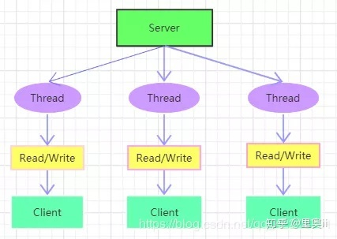
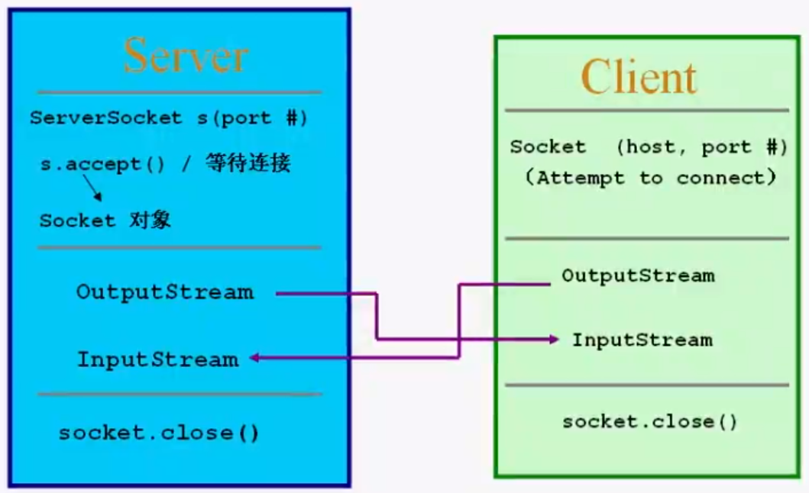
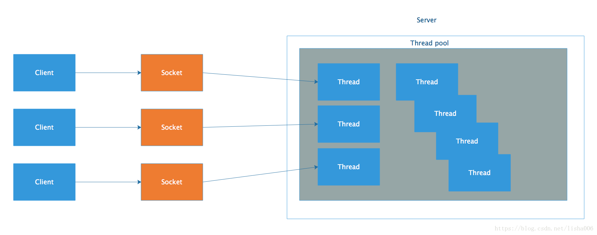
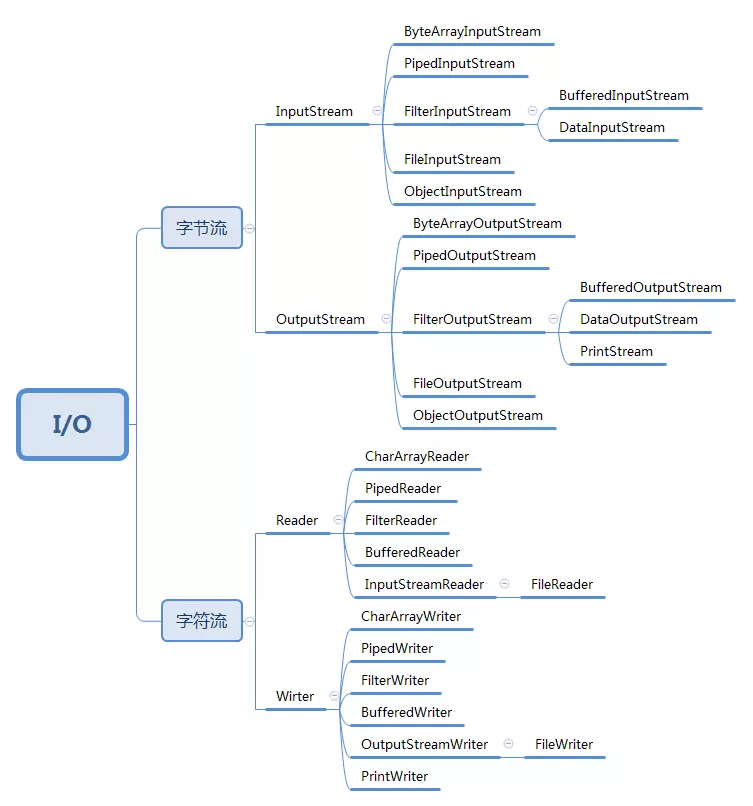
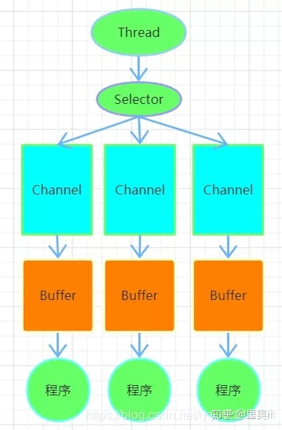
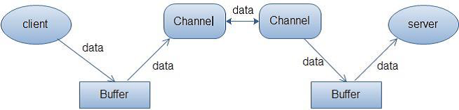
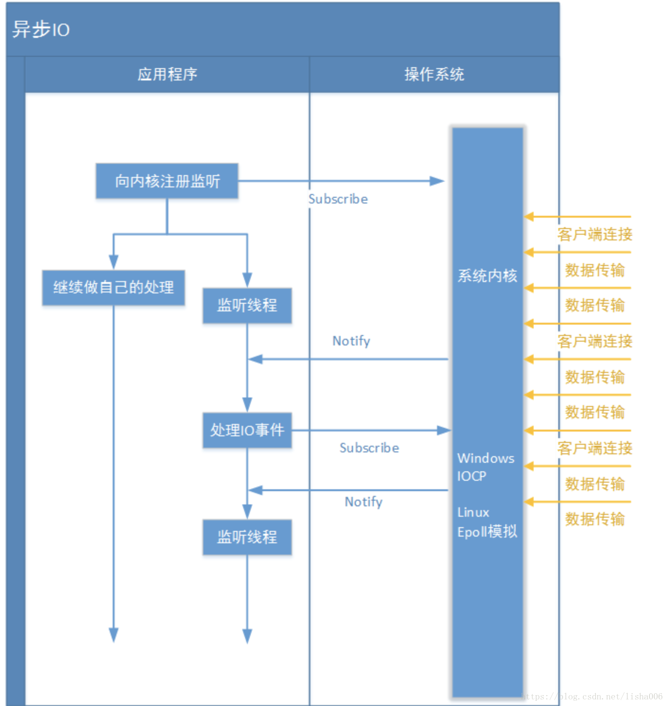

# CSE351 - Java I/O - Java I/O

返回[Bulletin](./bulletin.md)

返回[CSE351 - Java I/O](./CSE351.md)

[TOC]

## IO / BIO / 基本IO

### 定义



BIO是JDK1.4之前传统的IO模型，使用io和net中的**同步阻塞**式API实现。连接一个客户端就需要启动一个线程进行处理，占用内存明显。当线程调用read()/write()时，直到有一些数据被读取/数据完全写入，该线程会一直被阻塞，在此期间不能再干任何事情。

BIO**面向流**，每次IO从流中读一个或多个字节，直至读取所有字节，它们没有被缓存在任何地方。



可以通过引入**线程池**很大程度地避免不必要的开销。这种情况适合连接数并不多（最多几百个连接）的普通应用，但如果连接数量剧增就无法很好的工作了。



### 缺点

这个模型最本质的问题在于，严重依赖于线程。但线程是很"贵"的资源，主要表现在：

- 线程的创建和销毁成本很高，在Linux这样的操作系统中，线程本质上就是一个进程。创建和销毁都是重量级的系统函数。

- 线程本身占用较大内存，像Java的线程栈，一般至少分配512K～1M的空间，如果系统中的线程数过千，恐怕整个JVM的内存都会被吃掉一半。

- 线程的切换成本是很高的。操作系统发生线程切换的时候，需要保留线程的上下文，然后执行系统调用。如果线程数过高，可能执行线程切换的时间甚至会大于线程执行的时间，这时候带来的表现往往是系统load偏高、CPU sy使用率特别高（超过20%以上)，导致系统几乎陷入不可用的状态。

- 容易造成锯齿状的系统负载。因为系统负载是用活动线程数或CPU核心数，一旦线程数量高但外部网络环境不是很稳定，就很容易造成大量请求的结果同时返回，激活大量阻塞线程从而使系统负载压力过大。

所以，当面对十万甚至百万级连接的时候，传统的BIO模型是无能为力的。随着移动端应用的兴起和各种网络游戏的盛行，百万级长连接日趋普遍，此时，必然需要一种更高效的I/O处理模型。

### IO包

Java.io包中包括5个核心类和1个重要接口：

| 类/接口 | 名称         | 说明                                                         |
| ------- | ------------ | ------------------------------------------------------------ |
| 类      | File         | 文件类  用于对文件或目录描述和管理，例如生成新目录、文件、修改名称、删除、判断路径所在等 |
| 类      | InputStream  | 字节输入流  二进制格式操作，抽象类，基于字节的输入操作，所有字节输入流的父类，定义所有输入流共有特征 |
| 类      | OutputStream | 字节输出流  二进制格式操作，抽象类，基于字节的输出操作，所有字节输出流的父类，定义所有输出流共有特征 |
| 类      | Reader       | 字符输入流  文件格式操作，抽象类，基于字符的输入操作         |
| 类      | Writer       | 字符输出流  文件格式操作，抽象类，基于字符的输出操作         |
| 接口    | Serializable | 序列化                                                       |



#### 字节流 Stream VS 字符流 Reader/Writer

|            | 字节流                                                       | 字符流                                                       |
| ---------- | ------------------------------------------------------------ | ------------------------------------------------------------ |
| 工作位置   | 在硬盘上进行文件操作时都是以字节的方法进行的。               | 字符是只有在内存中才会形成的，使用得没有字节多。             |
| 用途       | 字节流用来处理二进制文件。当拷贝图片、声音、图像的时候，文件不只包含字符流，为了考虑到通用性要使用字节流。 | 字符流用来处理文本文件（可以看做是特殊的二进制文件，使用了某种编码，人可以阅读）。 |
| 读取单位   | 字节流读取单个字节。                                         | 字符流读取单个字符。一个字符根据编码的不同，对应的字节也不同，如 UTF-8 编码是 3 个字节，中文编码是 2 个字节。 |
| 缓冲区使用 | 字节流在操作的时候本身是不会用到缓冲区（内存）。在操作文件时，即使不关闭资源（close方法），文件也能输出。 | 字符流与文件本身直接操作的，而字符流在操作的时候是使用到缓冲区的。在操作文件时，不使用close方法则不会输出任何内容。可以使用flush方法强制进行刷新缓冲区，从而在不close的情况下输出内容。 |

#### 字节流/字符流实战

##### 字节流读文件

```java
   /**
     * 一次读完整个文件
     * @param filePath
     */
    public static void readFile(String filePath) {
        File f = new File(filePath);
        try {
            InputStream in = new FileInputStream(f);
            byte[] b = new byte[(int) f.length()];
            in.read(b);
            in.close();
            System.out.println(new String(b));
        } catch (FileNotFoundException e) {
            e.printStackTrace();
        } catch (IOException e) {
            e.printStackTrace();
        }
    }
    /**
     * 逐字节读文件
     * @param filePath
     */
    public static void readFileByByte(String filePath) {
        File f = new File(filePath);
        try {
            InputStream in = new FileInputStream(f);
            byte[] b = new byte[(int) f.length()];
            int temp = -1;
            int index = 0;
            while ((temp = in.read()) != -1) {
                b[index++] = (byte) temp;
            }
            in.close();
            System.out.println(new String(b));
        } catch (FileNotFoundException e) {
            e.printStackTrace();
        } catch (IOException e) {
            e.printStackTrace();
        }
    }
    /**
     * 一次读完整个文件
     * 创建BufferedInputStream对象，构造方法中传递FileInputStream对象，提高FileInputStream对象读取效率。
     * @param filePath
     */
    public static void readFileWithBuffer(String filePath) {
        File f = new File(filePath);
        try {
            InputStream in = new FileInputStream(f);
            InputStream bis = new BufferedInputStream(in);
            byte[] b = new byte[(int) f.length()];
            bis.read(b);
            bis.close();
            in.close();
            System.out.println(new String(b));
        } catch (FileNotFoundException e) {
            e.printStackTrace();
        } catch (IOException e) {
            e.printStackTrace();
        }
    }
    /**
     * 逐字节读文件
     * 创建BufferedInputStream对象，构造方法中传递FileInputStream对象，提高FileInputStream对象读取效率。
     * @param filePath
     */
    public static void readFileByByteWithBuffer(String filePath) {
        File f = new File(filePath);
        try {
            InputStream in = new FileInputStream(f);
            InputStream bis = new BufferedInputStream(in);
            byte[] b = new byte[(int) f.length()];
            int temp = -1;
            int index = 0;
            while ((temp = bis.read()) != -1) {
                b[index++] = (byte) temp;
            }
            bis.close();
            in.close();
            System.out.println(new String(b));
        } catch (FileNotFoundException e) {
            e.printStackTrace();
        } catch (IOException e) {
            e.printStackTrace();
        }
    }
    public static void main(String[] args) {
        String filePath = "./src/main/resources/javaiotest.txt";
        readFile(filePath);
        readFileByByte(filePath);
        readFileWithBuffer(filePath);
        readFileByByteWithBuffer(filePath);
    }
```

##### 字节流写文件

```java
    /**
     * 一次写完整个字符串
     * @param filePath
     */
    public static void writeFile(String filePath) {
        String data = "Hello world!\n";
        //如果文件不存在会自动创建
        File f = new File(filePath);
        try {
            //如果第二个参数为false或者不填写，则不能追加写文件，会覆盖
            OutputStream out = new FileOutputStream(f, true);
            //因为是字节流，所以要转化成字节数组进行输出
            byte[] b = data.getBytes();
            out.write(b);
            out.close();
        } catch (IOException e) {
            e.printStackTrace();
        }
    }
    /**
     * 逐字节写字符串
     * @param filePath
     */
    public static void writeFileByByte(String filePath) {
        String data = "Hello world!\n";
        //如果文件不存在会自动创建
        File f = new File(filePath);
        try {
            //如果第二个参数为false或者不填写，则不能追加写文件，会覆盖
            OutputStream out = new FileOutputStream(f, true);
            //因为是字节流，所以要转化成字节数组进行输出
            byte[] b = data.getBytes();
            for (int i = 0; i < b.length; i++) {
                out.write(b[i]);
            }
            out.close();
        } catch (IOException e) {
            e.printStackTrace();
        }
    }
    /**
     * 一次写完整个字符串
     * 创建BufferedOutputStream对象，构造方法中传递FileOutputStream对象，提高FileOutputStream对象读取效率。
     * @param filePath
     */
    public static void writeFileWithBuffer(String filePath) {
        String data = "Hello world!\n";
        //如果文件不存在会自动创建
        File f = new File(filePath);
        try {
            //如果第二个参数为false或者不填写，则不能追加写文件，会覆盖
            OutputStream out = new FileOutputStream(f, true);
            OutputStream bos = new BufferedOutputStream(out);
            //因为是字节流，所以要转化成字节数组进行输出
            byte[] b = data.getBytes();
            bos.write(b);
            bos.flush();
            bos.close();
            out.close();
        } catch (IOException e) {
            e.printStackTrace();
        }
    }
    /**
     * 逐字节写字符串
     * @param filePath
     */
    public static void writeFileByByteWithBuffer(String filePath) {
        String data = "Hello world!\n";
        //如果文件不存在会自动创建
        File f = new File(filePath);
        try {
            //如果第二个参数为false或者不填写，则不能追加写文件，会覆盖
            OutputStream out = new FileOutputStream(f, true);
            OutputStream bos = new BufferedOutputStream(out);
            //因为是字节流，所以要转化成字节数组进行输出
            byte[] b = data.getBytes();
            for (int i = 0; i < b.length; i++) {
                bos.write(b[i]);
            }
            bos.flush();
            bos.close();
            out.close();
        } catch (IOException e) {
            e.printStackTrace();
        }
    }
    public static void main(String[] args) {
        String filePath = "./src/main/resources/javaiotest.txt";
        writeFile(filePath);
        writeFileByByte(filePath);
        writeFileWithBuffer(filePath);
        writeFileByByteWithBuffer(filePath);
    }
```

##### 字符流读文件

FileReader是以当前机器的默认字符集来读取文件的，一旦不一致就会读取乱码。

```java
    /**
     * 一次读完整个文件
     * @param filePath
     */
    public static void readFile(String filePath) {
        File f = new File(filePath);
        try {
            Reader fr = new FileReader(f);
            // 创建字符数组，其长度就是文件的长度
            char[] all = new char[(int) f.length()];
            // 以字符流的形式读取文件所有内容
            fr.read(all);
            System.out.println(all);
            fr.close();
        } catch (IOException e) {
            e.printStackTrace();
        }
    }
    /**
     * 逐字符读文件
     * @param filePath
     */
    public static void readFileByByte(String filePath) {
        File f = new File(filePath);
        try {
            Reader fr = new FileReader(f);
            // 创建字符数组，其长度就是文件的长度
            char[] all = new char[(int) f.length()];
            int temp = -1;
            int index = 0;
            // 以字符流的形式读取文件所有内容
            while ((temp = fr.read()) != -1) {
                all[index++] = (char) temp;
            }
            System.out.println(all);
            fr.close();
        } catch (IOException e) {
            e.printStackTrace();
        }
    }
    /**
     * 一次读完整个文件
     * 创建BufferedInputStream对象，构造方法中传递FileInputStream对象，提高FileInputStream对象读取效率。
     * @param filePath
     */
    public static void readFileWithBuffer(String filePath) {
        File f = new File(filePath);
        try {
            Reader fr = new FileReader(f);
            Reader br = new BufferedReader(fr);
            // 创建字符数组，其长度就是文件的长度
            char[] all = new char[(int) f.length()];
            // 以字符流的形式读取文件所有内容
            br.read(all);
            System.out.println(all);
            br.close();
            fr.close();
        } catch (IOException e) {
            e.printStackTrace();
        }
    }
    /**
     * 逐字符读文件
     * @param filePath
     */
    public static void readFileByByteWithBuffer(String filePath) {
        File f = new File(filePath);
        try {
            Reader fr = new FileReader(f);
            Reader br = new BufferedReader(fr);
            // 创建字符数组，其长度就是文件的长度
            char[] all = new char[(int) f.length()];
            int temp = -1;
            int index = 0;
            // 以字符流的形式读取文件所有内容
            while ((temp = br.read()) != -1) {
                all[index++] = (char) temp;
            }
            System.out.println(all);
            br.close();
            fr.close();
        } catch (IOException e) {
            e.printStackTrace();
        }
    }
    public static void main(String[] args) {
        String filePath = "./src/main/resources/javaiotest.txt";
        readFile(filePath);
        readFileByByte(filePath);
        readFileWithBuffer(filePath);
        readFileByByteWithBuffer(filePath);
    }
```

##### 字符流写文件

字符流的操作比字节流操作好在一点就是可以直接输出字符串，不用再像之前那样进行转换操作。

```java
    /**
     * 一次写完整个字符串
     * @param filePath
     */
    public static void writeFile(String filePath) {
        String data = "Hello world!\n";
        //如果文件不存在会自动创建
        File f = new File(filePath);
        try {
            //如果第二个参数为false或者不填写，则不能追加写文件，会覆盖
            Writer fw = new FileWriter(f, true);
            fw.write(data);
            fw.close();
        } catch (IOException e) {
            e.printStackTrace();
        }
    }
    /**
     * 逐字符写字符串
     * @param filePath
     */
    public static void writeFileByByte(String filePath) {
        String data = "Hello world!\n";
        //如果文件不存在会自动创建
        File f = new File(filePath);
        try {
            //如果第二个参数为false或者不填写，则不能追加写文件，会覆盖
            Writer fw = new FileWriter(f, true);
            for (int i = 0; i < data.length(); i++) {
                fw.write(data.charAt(i));
            }
            fw.close();
        } catch (IOException e) {
            e.printStackTrace();
        }
    }
    /**
     * 一次写完整个字符串
     * 创建BufferedOutputStream对象，构造方法中传递FileOutputStream对象，提高FileOutputStream对象读取效率。
     * @param filePath
     */
    public static void writeFileWithBuffer(String filePath) {
        String data = "Hello world!\n";
        //如果文件不存在会自动创建
        File f = new File(filePath);
        try {
            //如果第二个参数为false或者不填写，则不能追加写文件，会覆盖
            Writer fw = new FileWriter(f, true);
            Writer bw = new BufferedWriter(fw);
            //因为是字节流，所以要转化成字节数组进行输出
            bw.write(data);
            bw.flush();
            bw.close();
            fw.close();
        } catch (IOException e) {
            e.printStackTrace();
        }
    }
    /**
     * 逐字符写字符串
     * @param filePath
     */
    public static void writeFileByByteWithBuffer(String filePath) {
        String data = "Hello world!\n";
        //如果文件不存在会自动创建
        File f = new File(filePath);
        try {
            //如果第二个参数为false或者不填写，则不能追加写文件，会覆盖
            Writer fw = new FileWriter(f, true);
            Writer bw = new BufferedWriter(fw);
            for (int i = 0; i < data.length(); i++) {
                fw.write(data.charAt(i));
            }
            bw.flush();
            bw.close();
            fw.close();
        } catch (IOException e) {
            e.printStackTrace();
        }
    }
    public static void main(String[] args) {
        String filePath = "./src/main/resources/javaiotest.txt";
        writeFile(filePath);
        writeFileByByte(filePath);
        writeFileWithBuffer(filePath);
        writeFileByByteWithBuffer(filePath);
    }
```

### BIO通信实战

#### 服务端

java.net包的ServerSocket可以接受其他通信实体的连接请求，用于监听来自客户端的Socket连接，如果没有连接，就一直处于等待状态。

- socket.accept()用于监听来自客户端的连接请求，如果接收到，则返回一个与客户端对应的Socket.

- socket.read()用于读取。

- socket.write()用于写入。

- socket.close()使用完毕后关闭服务端ServerSocket.

```java
public class BioServer implements AutoCloseable {
    private ServerSocket serverSocket;
    public BioServer() throws Exception {
        this.serverSocket = new ServerSocket(ServerConfig.SERVER_PORT);   // 进行服务端的Socket启动
        System.out.println("ECHO服务器端已经启动了，该服务在" + ServerConfig.SERVER_PORT + "端口上监听....");
        boolean serverFlag = true ;
        while(serverFlag) {
            Socket client = this.serverSocket.accept(); // 等待客户端连接
            Thread clientThread = new Thread(()->{
                try {
                    InputStream inputStream = client.getInputStream();
                    BufferedReader bufferedReader = new BufferedReader(new InputStreamReader(inputStream));
                    boolean clientFlag = true ;
                    while(clientFlag) {
                        System.out.println("*等待客户端发送数据*");
                        String readLine = bufferedReader.readLine();
                        if ("quit".equals(readLine)) {
                            System.out.println("---客户端下线---");
                            bufferedReader.close();
                            inputStream.close();
                            client.close();
                            clientFlag = false;
                        } else {
                            System.out.println("接收到客户端发送的数据:" + readLine);
                        }
                    }
                } catch (IOException e) {
                    e.printStackTrace();
                }
            }) ;
            clientThread.start(); // 启动多线程
        }
    }
    @Override
    public void close() throws IOException {
        this.serverSocket.close();
    }
    public static void main(String[] args) throws Exception {
        BioServer bioServer = new BioServer() ;
    }
}
```

#### 客户端

客户端可使用java.net包的Socket来连接指定的服务器，建立连接时所需的寻址信息为远程计算机的IP地址和端口号。

当客户端连接到指定服务端，让服务端执行accpet()建立ServerSocket, 从而产生相互连接的Socket, 然后互相进行通信。

getInputStream()通过返回的输入流输入数据。

getOutputStream()通过返回的输出流输出数据。

底层所有的IO节点流，都可以包装成处理流来处理。

```java
public class BioClient implements AutoCloseable {
    private Socket client;
    public BioClient() throws IOException {
        this.client = new Socket(ServerConfig.SERVER_IP, ServerConfig.SERVER_PORT);
        System.out.println("已经成功的连接到了服务器端，可以进行消息的发送处理。");
        OutputStream outputStream = client.getOutputStream();
        BufferedWriter bufferedWriter = new BufferedWriter(new OutputStreamWriter(outputStream));
        BufferedReader reader = new BufferedReader(new InputStreamReader(System.in));
        boolean flag = true ;
        while(flag) {
            System.out.println("请输入字符串，输入quit代表中断连接。");
            String data = reader.readLine(); // 调用某个输入字符串函数，返回BufferedReader.readline()，过程略
            bufferedWriter.write(data);
            bufferedWriter.newLine();
            bufferedWriter.flush();
            if ("quit".equals(data)) {
                System.exit(-1);
            }
        }
    }
    @Override
    public void close() throws IOException {
        this.client.close();
    }
    public static void main(String[] args) throws Exception {
        BioClient bioClient = new BioClient() ;
    }
}
```

### UDP通信实战

#### 服务端

```java
public UDPServer() {
    byte[] buf = new byte[1024];
    DatagramPacket dp = new DatagramPacket(buf, buf.length);
    try {
        DatagramSocket ds = new DatagramSocket(ServerConfig.SERVER_PORT);
        while(true) {
            ds.receive(dp);
            ByteArrayInputStream bais = new ByteArrayInputStream(buf);
            DataInputStream dis = new DataInputStream(bais);
            System.out.println(dis.readLong());
        }
    } catch (SocketException e) {
        e.printStackTrace();
    } catch (IOException e) {
        e.printStackTrace();
    }
}
```

#### 客户端

```java
public UDPClient() {
    long n = 10000L;
    ByteArrayOutputStream baos = new ByteArrayOutputStream();
    DataOutputStream dos = new DataOutputStream(baos);
    try {
        dos.writeLong(n);
        byte[] buf = baos.toByteArray();
        System.out.println(buf.length);
        DatagramPacket dp = new DatagramPacket(buf, buf.length, 
                                               new InetSocketAddress(ServerConfig.SERVER_IP, ServerConfig.SERVER_PORT));
        DatagramSocket ds = new DatagramSocket();
        ds.send(dp);
        ds.close();
    } catch (SocketException e) {
        e.printStackTrace();
    } catch (IOException e) {
        e.printStackTrace();
    }
}
```

## NIO / 非阻塞IO

### 定义



Java NIO 是一种JDK 1.4引入的**同步非阻塞**的I/O模型，采用多路复用机制，将多个IO的阻塞复用到同一个select的阻塞上，从而使得系统在单线程的情况下处理多个客户端请求。

具体来说就是Selector利用单线程阻塞式不断轮询注册在其上的Channel, 如果任何Channel上有新的连接或者读写Event, 处于就绪状态后，Selector会通过SelectorKey获取就绪Channel的集合，通过Buffer进行后续I/O操作。

- 当一个线程将数据输入Buffer时，可以同时继续做别的事情，等到数据读取到buffer中之后，线程再继续处理数据。

- 当一个线程将数据从Buffer输出时，不需要等待它完全写入，这个线程同时可以去做别的事情。

### 对比BIO

单线程处理I/O的效率确实非常高，没有线程切换，只是拼命的读、写、选择事件。但现在的服务器一般都是多核处理器，利用多核心进行I/O无疑对效率有更大的提高，能有效避免大量连接数时频繁线程的切换带来的性能或各种问题。

### Selector

Selector类是NIO的核心类，能够检测多个注册的通道上是否有事件发生，如果有事件发生，便获取事件然后针对每个事件进行相应的响应处理。要使用Selector的话，我们必须把Channel注册到Selector上。

```java
socketChannle.register(selector, SelectionKey.OP_ACCEPT|SelectionKey.OP_CONNECT)
```

| key        | 功能                                              |
| ---------- | ------------------------------------------------- |
| OP_ACCEPT  | 请求在接受新连接并创建Channel时获得通知           |
| OP_CONNECT | 请求在建立一个连接时获得通知                      |
| OP_READ    | 数据已经继续，请求可从Channel中读取数据时获得通知 |
| OP_WRITE   | 可以继续向Channel中写数据时，请求获取通知         |

然后就可以调用Selector的select()方法。这个方法会进入阻塞，直到有一个channel的状态符合条件。当方法返回后，线程可以处理这些事件。

| 方法        | 功能                                                         |
| ----------- | ------------------------------------------------------------ |
| open()      | 新建一个selector                                             |
| keys()      | 返回selectionKeys                                            |
| select()    | 阻塞select操作                                               |
| selectNow() | 非阻塞select操作                                             |
| wakeup()    | 在另外一个线程调用wakeup，被阻塞于select方法的线程就会立刻返回 |

JDK使用了epoll()代替传统的select()实现，所以没有最大连接句柄1024/2048的限制。所以，只需要一个线程负责Selector的轮询，就可以接入成千上万的客户端。

只有在Channel真正有读写事件发生时才会进行读写，大大地减少了系统开销，不必为每个连接都创建一个线程，不用去维护多个线程。避免了多线程之间的上下文切换导致的开销。

### Channel

Channel既可以用来进行读操作，又可以用来进行写操作。

在BIO模型中使用流来传输数据，因为流是单向的，所以分了InputStream和OutputStream.

在NIO模型中使用Channel来传输数据，它是双向的，一个Channel即可以读也可以写。

NIO中的Channel的主要实现有：

- FileChannel 对应文件IO

- DatagramChannel 对应UDP IO

- SocketChannel 对应TCP IO的ServerSocket

- ServerSocketChannel 对应TCP IO的Socket 

#### FileChannel实战

##### 读文件

```java
public static void readFile(String filePath) {
    FileInputStream fis = null;
    FileChannel fc = null;
    try {
        fis = new FileInputStream(filePath);
        fc = fis.getChannel();
        ByteBuffer buffer = ByteBuffer.allocate(1024);
        int length = fc.read(buffer);
        //Buffer切换写模式和读模式
        buffer.flip();
        byte[] ary = new byte[length];
        //把缓冲区的内容获取后存入ary数组中
        buffer.get(ary);
        //clear并未清除内容，而是把position置0（注意！！！）
        buffer.clear();
        System.out.println(new String(ary));
    } catch (FileNotFoundException e) {
        e.printStackTrace();
    } catch (IOException e) {
        e.printStackTrace();
    } finally {
        try {
            if(null != fc) {
                fc.close();
            }
            if(null != fis) {
                fis.close();
            }
        }catch(IOException e) {
            e.printStackTrace();
        }
    }
}
```

##### 写文件

```java
public static void writeFile(String filePath) {
    String data = "I'm fine.\n";
    FileOutputStream fos = null;
    FileChannel fc = null;
    try {
        //如果第二个参数为false或者不填写，则不能追加写文件，会覆盖
        fos = new FileOutputStream(filePath, true);
        fc = fos.getChannel();
        ByteBuffer buffer = ByteBuffer.allocate(1024);
        buffer.put(data.getBytes());
        //Buffer切换写模式和读模式
        buffer.flip();
        fc.write(buffer);
    } catch (FileNotFoundException e) {
        e.printStackTrace();
    } catch (IOException e) {
        e.printStackTrace();
    } finally {
        try {
            if(null != fc) {
                fc.close();
            }
            if(null != fos) {
                fos.close();
            }
        }catch(IOException e) {
            e.printStackTrace();
        }
    }
}
```

### Buffer

Buffer就是一个内存块，底层是有一个数组。Java NIO是面向Channel和Buffer的，Channel 提供从文件、网络读取数据的渠道，但是读取或写入的数据都必须经由Buffer. 数据总是从Channel读取到Buffer中，或者从Buffer写入到Channel中。

 

BIO模型面向流，意味着每次从流中读一个或多个字节，直至读取所有字节，它们没有被缓存在任何地方。此外，它不能前后移动流中的数据。如果需要前后移动从流中读取的数据，需要先将它缓存到一个缓冲区。

NIO模型面向Channel和Buffer, 检查缓冲区中是否包含需要处理的数据之后，数据根据需要可在缓冲区中前后移动，增加了处理过程中的灵活性。而且当更多的数据读入缓冲区时，不要覆盖缓冲区里尚未处理的数据。

具体的缓存区有这些：ByteBuffer, CharBuffer, ShortBuffer, IntBuffer, LongBuffer, FloatBuffer, DoubleBuffer. 他们继承了相同的抽象类：Buffer.

常用的ByteBuffer是一个抽象类，继承Buffer，实现了Comparable接口。Buffer抽象类有以下四个参数：

```java
private int mark = -1; //标记
private int position = 0; //位置，下一个要被读或写的元素的索引，每次读写缓冲区数据时都会改变改值，为下次读写作准备。
private int limit; //表示缓冲区的当前终点，不能对缓冲区超过极限的位置进行读写操作。且极限是可以修改的。
private int capacity; //容量，即可以容纳的最大数据量；在缓冲区创建时被设定并且不能改变。
```

**常用方法**

- flip方法：反转此缓冲区，将position给limit，然后将position置为0，其实就是切换读写模式
- clear方法：清除此缓冲区，将position置为0，把capacity的值给limit。
- rewind方法：重绕此缓冲区，将position置为0

### NIO通信实战

基本的步骤如下：

•    创建一个ServerSocketChannel对象，绑定端口并配置成非阻塞模式。

•    创建一个Selector，并把第一步创建的ServerSocketChannel交给Selector监听。

•    不停地从Selector获取准备就绪的Channel，当有客户端连接时，ServerSocketChannel就会被选取出来。

•    从ServerSocketChannel获取SocketChannel对象，这个对象代表了客户端，需要使用它来与客户端读写数据。

•    把SocketChannel也交给Selector监听，当SocketChannel可以读取数据时，也会被选取出来

•    SocketChannel被选取出来后，从中读取数据解析出请求，并写入返回数据。

#### 服务端

```java
public class NIOServer {
    public NIOServer() {
        try {
            //创建一个ServerSocketChannel对象，绑定端口并配置成非阻塞模式。
            ServerSocketChannel serverSocketChannel = ServerSocketChannel.open();
            serverSocketChannel.bind(new InetSocketAddress(ServerConfig.SERVER_PORT), 1024);
            //下面这句必需要，否则ServerSocketChannel会使用阻塞的模式，那就不是NIO了
            serverSocketChannel.configureBlocking(false);
            //把ServerSocketChannel交给Selector监听
            Selector selector = Selector.open();
            serverSocketChannel.register(selector, SelectionKey.OP_ACCEPT);
            //循环，不断的从Selector中获取准备就绪的Channel，最开始的时候Selector只监听了一个ServerSocketChannel
            //但是后续有客户端连接时，会把客户端对应的Channel也交给Selector对象
            while (true) {
                //这一步会阻塞，当有Channel准备就绪时或者超过1000秒后会返回。
                selector.select(1000);
                //获取所有的准备就绪的Channel，SelectionKey中包含中Channel信息
                Set<SelectionKey> selectionKeySet = selector.selectedKeys();
                //遍历，每个Channel都可处理
                for (SelectionKey selectionKey : selectionKeySet) {
                    //如果Channel已经无效了，则跳过（如Channel已经关闭了）
                    if(!selectionKey.isValid()) {
                        continue;
                    }
                    //判断Channel具体的就绪事件，如果是有客户端连接，则建立连接
                    if (selectionKey.isAcceptable()) {
                        try {
                            acceptConnection(selectionKey, selector);
                        } catch (Exception e) {
                            e.printStackTrace();
                        }
                    }
                    //如果有客户端可以读取请求了，则读取请求然后返回数据
                    if (selectionKey.isReadable()) {
                        try {
                            String data = readFromSelectionKey(selectionKey);
                            System.out.println(data);
                        } catch (Exception e) {
                            e.printStackTrace();
                        }
                    }
                }
                //处理完成后把返回的Set清空，如果不清空下次还会再返回这些Key，导致重复处理
                selectionKeySet.clear();
            }
        } catch (IOException e) {
            e.printStackTrace();
        }
    }
    //客户端建立连接的方法
    private static void acceptConnection(SelectionKey selectionKey, Selector selector) throws Exception {
        System.out.println("accept connection...");
        //SelectionKey中包含选取出来的Channel的信息，我们可以从中获取，对于建立连接来说，只会有ServerSocketChannel可能触发，
        //因此这里可以把它转成ServerSocketChannel对象
        ServerSocketChannel ssc = ((ServerSocketChannel) selectionKey.channel());
        //获取客户端对应的SocketChannel
        SocketChannel socketChannel = ssc.accept();
        //也需要配置成非阻塞模式
        socketChannel.configureBlocking(false);
        //把客户端的Channel交给Selector监控，之后如果有数据可以读取时，会被select出来
        socketChannel.register(selector, SelectionKey.OP_READ);
    }
    //从客户端读取数据的字符串
    private static String readFromSelectionKey(SelectionKey selectionKey) throws Exception {
        //从SelectionKey中包含选取出来的Channel的信息把Channel获取出来
        SocketChannel socketChannel = ((SocketChannel) selectionKey.channel());
        //读取数据到ByteBuffer中
        ByteBuffer byteBuffer = ByteBuffer.allocate(1024);
        int len = socketChannel.read(byteBuffer);
        if (len < 0) {
            //如果读到-1，说明数据已经传输完成了，可以关闭
            socketChannel.close();
            selectionKey.cancel();
            return "";
        } else if (len == 0) {
            //什么都没读到
            return "";
        }
        byteBuffer.flip();
        doWrite(selectionKey, "Hello Nio");
        return new String(byteBuffer.array(), 0, len);
    }
    private static void doWrite(SelectionKey selectionKey, String responseMessage) throws Exception{
        System.out.println("Output message...");
        SocketChannel socketChannel = ((SocketChannel) selectionKey.channel());
        ByteBuffer byteBuffer = ByteBuffer.allocate(responseMessage.getBytes().length);
        byteBuffer.put(responseMessage.getBytes());
        byteBuffer.flip();
        socketChannel.write(byteBuffer);
    }
    public static void main(String[] args) {
        NIOServer nioServer = new NIOServer();
    }
}
```

#### 客户端

```java
public NIOClient() {
    try {
        //创建一个SocketChannel对象
        SocketChannel socketChannel = SocketChannel.open();
        //配置成非阻塞模式
        socketChannel.configureBlocking(false);
        //创建一个选择器，并把SocketChannel交给selector对象
        Selector selector = Selector.open();
        socketChannel.register(selector, SelectionKey.OP_CONNECT);
        //发起建立连接的请求，这里会立即返回，当连接建立完成后，SocketChannel就会被选取出来
        socketChannel.connect(new InetSocketAddress(ServerConfig.SERVER_IP, ServerConfig.SERVER_PORT));
        //遍历，不段的从Selector中选取出已经就绪的Channel，在这个例子中，Selector只监控了一个SocketChannel
        while (true) {
            selector.select(1000);
            Set<SelectionKey> selectionKeySet = selector.selectedKeys();
            for (SelectionKey selectionKey : selectionKeySet) {
                if(!selectionKey.isValid()) {
                    continue;
                }
                //连接建立完成后的操作：直接发送请求数据
                if (selectionKey.isConnectable()) {
                    if(socketChannel.finishConnect()) {
                        socketChannel.register(selector, SelectionKey.OP_READ);
                        try {
                            doWriteRequest(((SocketChannel) selectionKey.channel()));
                        } catch (Exception e) {
                            e.printStackTrace();
                        }
                    }
                }
                //如果当前已经可以读数据了，说明服务端已经响应完了，读取数据
                if (selectionKey.isReadable()) {
                    try {
                        doRead(selectionKey);
                    } catch (Exception e) {
                        e.printStackTrace();
                    }
                }
            }
            //最后同样要清除所有的Key
            selectionKeySet.removeAll(selectionKeySet);
        }
    } catch (IOException e) {
        e.printStackTrace();
    }
}
//发送请求
private static void doWriteRequest(SocketChannel socketChannel) throws Exception {
    String data = "Hello Server!";
    System.out.println("start connect...");
    //创建ByteBuffer对象，会放入数据
    byte[] bytes = data.getBytes();
    ByteBuffer byteBuffer = ByteBuffer.allocate(bytes.length);
    byteBuffer.put(bytes);
    byteBuffer.flip();
    //写数据
    socketChannel.write(byteBuffer);
    if(!byteBuffer.hasRemaining()) {
        System.out.println("Send request success...");
    }
}
//读取服务端的响应
private static void doRead(SelectionKey selectionKey) throws Exception {
    SocketChannel socketChannel = ((SocketChannel) selectionKey.channel());
    ByteBuffer byteBuffer = ByteBuffer.allocate(1024);
    int len = socketChannel.read(byteBuffer);
    System.out.println("Recv:" + new String(byteBuffer.array(), 0, len));
}
public static void main(String[] args) {
    NIOClient nioClient = new NIOClient();
}
```

### 常见问题

#### 正确处理connect

SocketChannel.connect方法在非阻塞模式下可能返回false，切记判断返回值。

返回true表示连接成功，返回false则注册channel到selector监听OP_CONNECT事件，注意OP_CONNECT只能在还没有连接的channel上注册。在OP_CONNECT触发后，调用SocketChannel.finishConnect成功后，连接才真正建立。

连接建立成功后，如果没有移除OP_CONNECT，会导致SelectionKey一直处于就绪状态，空耗CPU.

#### Selector返回的key集合非线程安全

Selector.selectedKeys/keys 返回的集合都是非线程安全的。
Selector.selectedKeys返回的集合可进行移除操作，对selected keys的处理必须单线程处理或者适当同步。
Selector.keys 返回的集合不可变。

#### 处理事件移除key

在select返回值大于0的情况下，循环处理Selector.selectedKeys集合，每处理一个必须从Set中移除，不移除的后果是本次的就绪的key集合下次会再次返回,导致无限循环，CPU消耗100%

```java
Iterator<SelectionKey> it = set.iterator();
while (it.hasNext()) {
    SelectionKey key = it.next();
    it.remove(); //切记移除
    //处理事件
}
```

#### 同时注册OP_ACCEPT和OP_READ / 同时注册OP_CONNECT和OP_WRITE

在底层来说，只有两种事件：read和write
Java NIO还引入了OP_ACCEPT和OP_CONNECT
OP_ACCEPT和OP_READ皆可视为Read
OP_CONNECT和OP_WRITE皆可视为Write
同时注册OP_ACCEPT和OP_READ或者同时注册OP_CONNECT和OP_WRITE会产生错误，注意避免。

## AIO / 异步IO

### 定义



Java AIO是一种JDK 1.7引入的**异步非阻塞**的I/O模型。

增加的类主要如下：

- AsynchronousFileChannel

- AsynchronousServerSocketChannel

- AsynchronousSocketChannel

因为需要采用大量的回调处理模式，所以需要使用事件处理类接口

```java
public interface CompletionHandler<V result, A attachment>
```

具备以下两个方法：

```java
void completed(V result, A attachment)
//Invoked when an operation has completed.
void failed(Throwable exc, A attachment)
//Invoked when an operation fails.
```

### 对比NIO

NIO和AIO的关键区别反映在数据拷贝阶段是由用户线程完成还是内核完成。

AIO具有操作系统的底层支持，只有IO请求操作的发出是由用户线程来进行的，IO操作的两个阶段都是由内核自动完成，结束后发送通知告知用户线程IO操作已经完成，也就是说在AIO中不会对用户线程产生任何阻塞。

### AsynchronousFileChannel实战

#### 读文件

```java
/**
 * 通过Future读取数据
 * @param filePath
 */
public static void readFileByFuture(String filePath) {
    Path path = Paths.get(filePath);
    AsynchronousFileChannel afc = null;
    try {
        afc = AsynchronousFileChannel.open(path, StandardOpenOption.READ);
        ByteBuffer buffer = ByteBuffer.allocate(1024);
        long position = 0;
        Future<Integer> operation = afc.read(buffer, position);
        while (!operation.isDone());
        buffer.flip();
        System.out.println(new String(buffer.array()));
    } catch (IOException e) {
        e.printStackTrace();
    } finally {
        try {
            if (null != afc) {
                afc.close();
            }
        } catch (IOException e) {
            e.printStackTrace();
        }
    }
}
/**
 * 通过CompletionHandler读取数据
 * @param filePath
 */
public static void readFileByCompletionHandler(String filePath) {
    Path path = Paths.get(filePath);
    AsynchronousFileChannel afc = null;
    try {
        afc = AsynchronousFileChannel.open(path, StandardOpenOption.READ);
        ByteBuffer buffer = ByteBuffer.allocate(1024);
        long position = 0;
        afc.read(buffer, position, buffer, new CompletionHandler<Integer, ByteBuffer>() {
            @Override
            public void completed(Integer result, ByteBuffer attachment) {
                System.out.println("result: " + result);
                attachment.flip();
                System.out.println(new String(attachment.array()));
                attachment.clear();
            }
            @Override
            public void failed(Throwable exc, ByteBuffer attachment) {
                System.out.println("failed");
            }
        });
    } catch (IOException e) {
        e.printStackTrace();
    } finally {
        try {
            if (null != afc) {
                afc.close();
            }
        } catch (IOException e) {
            e.printStackTrace();
        }
    }
}
```

#### 写文件

```java
/**
 * 通过Future写入读取数据
 * @param filePath
 */
public static void writeFileByFuture(String filePath) {
    Path path = Paths.get(filePath);
    AsynchronousFileChannel afc = null;
    String data = "I'm fine, too.\n";
    try {
        afc = AsynchronousFileChannel.open(path, StandardOpenOption.WRITE);
        ByteBuffer buffer = ByteBuffer.allocate(1024);
        long position = 0;
        buffer.put(data.getBytes());
        //Buffer切换写模式和读模式
        buffer.flip();
        Future<Integer> operation = afc.write(buffer, position);
        while (!operation.isDone());
    } catch (FileNotFoundException e) {
        e.printStackTrace();
    } catch (IOException e) {
        e.printStackTrace();
    } finally {
        try {
            if(null != afc) {
                afc.close();
            }
        }catch(IOException e) {
            e.printStackTrace();
        }
    }
}
/**
 * 通过CompletionHandler写入读取数据
 * @param filePath
 */
public static void writeFileByCompletionHandler(String filePath) {
    Path path = Paths.get(filePath);
    AsynchronousFileChannel afc = null;
    String data = "I'm fine, too!\n";
    try {
        afc = AsynchronousFileChannel.open(path, StandardOpenOption.WRITE);
        ByteBuffer buffer = ByteBuffer.allocate(1024);
        long position = 0;
        buffer.put(data.getBytes());
        //Buffer切换写模式和读模式
        buffer.flip();
        afc.write(buffer, position, buffer, new CompletionHandler<Integer, ByteBuffer>() {
            @Override
            public void completed(Integer result, ByteBuffer attachment) {
                System.out.println("bytes written: " + result);
            }
            @Override
            public void failed(Throwable exc, ByteBuffer attachment) {
                System.out.println("failed");
            }
        });
    } catch (FileNotFoundException e) {
        e.printStackTrace();
    } catch (IOException e) {
        e.printStackTrace();
    } finally {
        try {
            if(null != afc) {
                afc.close();
            }
        }catch(IOException e) {
            e.printStackTrace();
        }
    }
}
```

### AIO通信实战

#### 服务端

```java
public class AIOServer {
    public AIOServer() {
        try {
            AsynchronousServerSocketChannel assc = AsynchronousServerSocketChannel.open().bind(new InetSocketAddress(ServerConfig.SERVER_PORT));
            assc.accept(null, new CompletionHandler<AsynchronousSocketChannel, Object>() {
                @Override
                public void completed(AsynchronousSocketChannel asc, Object attachment) {
                    assc.accept(null, this);
                    try {
                        ByteBuffer buffer = ByteBuffer.allocate(1024);
                        asc.read(buffer, buffer, new CompletionHandler<Integer, ByteBuffer>() {
                            @Override
                            public void completed(Integer result, ByteBuffer attachment) {
                                System.out.println("result: " + result);
                                attachment.flip();
                                System.out.println(new String(attachment.array()));
                                attachment.clear();
                            }
                            @Override
                            public void failed(Throwable exc, ByteBuffer attachment) {
                                System.out.println("failed");
                            }
                        });
                    } catch (Exception e) {
                        e.printStackTrace();
                    } finally {
                        try {
                            if (null != asc) {
                                asc.close();
                            }
                        } catch (IOException e) {
                            e.printStackTrace();
                        }
                    }
                }
                @Override
                public void failed(Throwable exc, Object attachment) {
                    System.out.println("failed");
                }
            });
        } catch (IOException e) {
            e.printStackTrace();
        }
        //因为AIO不会阻塞调用进程，因此必须在主线程阻塞，才能保持进程存活。
        try {
            Thread.sleep(Integer.MAX_VALUE);
        } catch (InterruptedException e) {
            e.printStackTrace();
        }
    }
    public static void main(String[] args) throws Exception {
        AIOServer aioServer = new AIOServer() ;
    }
}
```

#### 客户端

```java
public class AIOClient {
    public AIOClient() {
        String data = "Hello Server!";
        AsynchronousSocketChannel asc;
        try {
            asc = AsynchronousSocketChannel.open();
            asc.connect(new InetSocketAddress(ServerConfig.SERVER_IP, ServerConfig.SERVER_PORT));
            Thread.sleep(1000);
            ByteBuffer buffer = ByteBuffer.wrap(data.getBytes());
            asc.write(buffer).get();
        } catch (IOException e) {
            e.printStackTrace();
        } catch (InterruptedException e) {
            e.printStackTrace();
        } catch (ExecutionException e) {
            e.printStackTrace();
        }
    }
    public static void main(String[] args) throws Exception {
        AIOClient aioServer = new AIOClient() ;
    }
}
```

