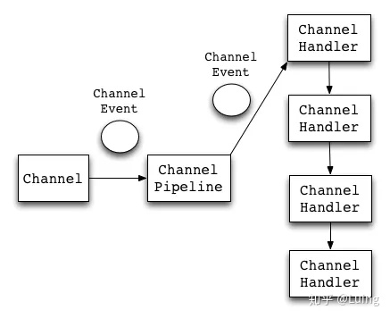
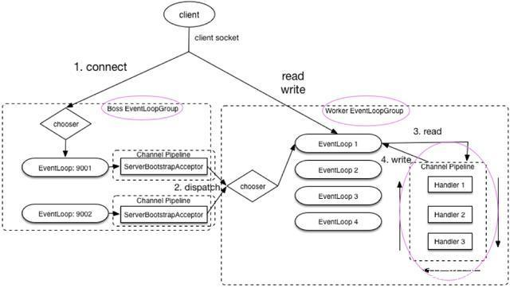
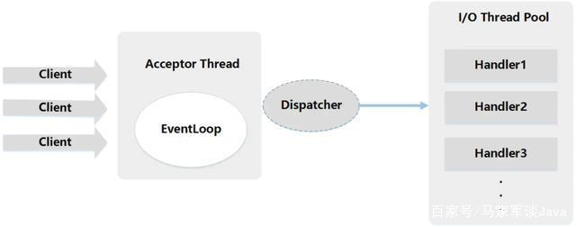
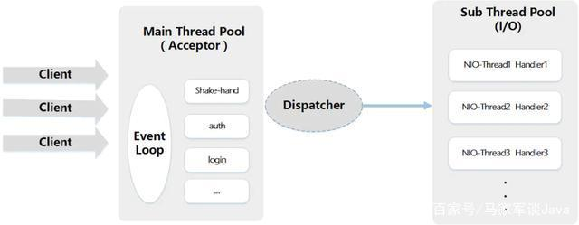

# CSE351 - Java I/O - Netty

返回[Bulletin](./bulletin.md)

返回[CSE351 - Java I/O](./CSE351.md)

[TOC]

## 定义

Netty是一款基于NIO开发的网络通信框架，代表进行事件处理的流程。对比于BIO, 它的并发性能得到了很大提高，并且没有丧失可维护性和性能等优势。

## 应用场景

Netty主要用来做网络通信，NIO可以做的事情，使用Netty都可以做并且更好。

### 作为 RPC 框架的网络通信工具

我们在分布式系统中，不同服务节点之间经常需要相互调用，这个时候就需要 RPC 框架了。不同服务节点之间的通信是如何做的呢？可以使用 Netty 来做。比如我调用另外一个节点的方法的话，至少是要让对方知道我调用的是哪个类中的哪个方法以及相关参数吧！

### 实现一个自己的 HTTP 服务器

通过 Netty 我们可以自己实现一个简单的 HTTP 服务器，这个大家应该不陌生。说到 HTTP 服务器的话，作为 Java 后端开发，我们一般使用 Tomcat 比较多。一个最基本的 HTTP 服务器可要以处理常见的 HTTP Method 的请求，比如 POST 请求、GET 请求等等。

### 实现一个即时通讯系统

使用 Netty 我们可以实现一个可以聊天类似微信的即时通讯系统，这方面的开源项目还蛮多的，可以自行去 Github 找一找。

### 实现消息推送系统

市面上有很多消息推送系统都是基于 Netty 来做的。

## 核心组件



### Channel

Channel接口是Netty对网络操作抽象类，它除了包括基本的I/O操作，如bind()、connect()、read()、write() 等。

比较常用的Channel接口实现类是NioServerSocketChannel（服务端）和NioSocketChannel（客户端），这两个 Channel 可以和 BIO 编程模型中的ServerSocket以及Socket两个概念对应上。Netty 的 Channel 接口所提供的 API，大大地降低了直接使用 Socket 类的复杂性。

### EventLoop

EventLoop（事件循环）接口的主要作用就是负责监听注册到其上的Channel生产的ChannelEvent并调用ChannelHandler进行相关I/O操作的处理。

### ChannelFuture

Netty是异步非阻塞的，因此不能立刻得到操作是否执行成功。

但是可以通过ChannelFuture接口的addListener()方法注册一个ChannelFutureListener, 当操作执行成功或者失败时，监听就会自动触发返回结果。

channel()方法可以获取关联的Channel.

sync()方法可以让异步的操作变成同步的。

### ChannelHandler

ChannelHandler是消息的具体处理器，负责处理读写操作、客户端连接等事情。

### ChannelPipeline

ChannelPipeline为ChannelHandler 的链，提供了一个容器并定义了用于沿着链传播入站和出站事件流的API. 当Channel被创建时，它会被自动地分配到它专属的ChannelPipeline.

addLast()方法可以添加一个或者多个ChannelHandler, 因为一个数据或者事件可能会被多个Handler处理。当一个ChannelHandler处理完之后就将数据交给下一个ChannelHandler.

### EventLoopGroup

包含多个EventLoop, 每一个EventLoop通常内部包含一个专有的处理事件的线程，1:1的关系保证线程安全。

当客户端通过connect方法连接服务端时，bossGroup处理客户端连接请求。

当客户端连接请求处理完成后，会将这个连接提交给workerGroup来处理其IO相关操作。



## 线程模型

### 单线程模型

一个线程需要执行处理所有的 accept、read、decode、process、encode、send 事件。

对于高负载、高并发，并且对性能要求比较高的场景不适用。

```java
//1.eventGroup既用于处理客户端连接，又负责具体的处理。
//无参构造函数设置线程数量的默认值就是CPU 核心数*2
EventLoopGroup eventGroup = new NioEventLoopGroup(1);
//2.创建服务端启动引导/辅助类：ServerBootstrap
ServerBootstrap b = new ServerBootstrap();
boobtstrap.group(eventGroup, eventGroup);
//......
```

### 多线程模型

一个Acceptor线程只负责监听客户端的连接，一个NIO线程池负责具体处理：accept、read、decode、process、encode、send 事件。

满足绝大部分应用场景，并发连接量不大的时候没啥问题，但是遇到并发连接大的时候就可能会出现问题，成为性能瓶颈。

```java
//  1.bossGroup 用于接收连接，workerGroup 用于具体的处理
EventLoopGroup  bossGroup = new NioEventLoopGroup(1);
EventLoopGroup  workerGroup = new NioEventLoopGroup();
try {
    //2.创建服务端启动引导/辅助类：ServerBootstrap
    ServerBootstrap  b = new ServerBootstrap();
    //3.给引导类配置两大线程组,确定了线程模型
    b.group(bossGroup,  workerGroup);
    //......
```



### 主从多线程模型

从一个主线程NIO线程池中选择一个线程作为Acceptor线程，绑定监听端口，接收客户端连接的连接，其他线程负责后续的接入认证等工作。连接建立完成后，子NIO线程池负责具体处理 I/O 读写。

如果多线程模型无法满足需求，可以考虑使用主从多线程模型。

```java
//  1.bossGroup 用于接收连接，workerGroup 用于具体的处理
EventLoopGroup  bossGroup = new NioEventLoopGroup();
EventLoopGroup  workerGroup = new NioEventLoopGroup();
try {
    //2.创建服务端启动引导/辅助类：ServerBootstrap
    ServerBootstrap b = new ServerBootstrap();
    //3.给引导类配置两大线程组,确定了线程模型
    b.group(bossGroup,  workerGroup);
    //......
```



## 启动流程

### 服务端

```java
// 1.bossGroup 用于接收连接，workerGroup 用于具体的处理 
EventLoopGroup bossGroup = new NioEventLoopGroup(1); 
EventLoopGroup workerGroup = new NioEventLoopGroup(); 
try { 
    //2.创建服务端启动引导/辅助类：
    ServerBootstrap ServerBootstrap b = new ServerBootstrap(); 
    //3.给引导类配置两大线程组,确定了线程模型 
    b.group(bossGroup, workerGroup) 
        // (非必备)打印日志 
        .handler(new LoggingHandler(LogLevel.INFO)) 
        // 4.指定 IO 模型 
        .channel(NioServerSocketChannel.class) 
        .childHandler(new ChannelInitializer<SocketChannel>() { 
            @Override 
            public void initChannel(SocketChannel ch) { 
                ChannelPipeline p = ch.pipeline(); 
                //5.可以自定义客户端消息的业务处理逻辑 
                p.addLast(new HelloServerHandler()); 
            } 
        }); 
    // 6.绑定端口,调用 sync 方法阻塞知道绑定完成 
    ChannelFuture f = b.bind(port).sync(); 
    // 7.阻塞等待直到服务器Channel关闭(closeFuture()方法获取Channel 的CloseFuture对象,然后调用sync()方法) 
    f.channel().closeFuture().sync(); 
} finally { 
    //8.优雅关闭相关线程组资源 
    bossGroup.shutdownGracefully(); 
    workerGroup.shutdownGracefully(); 
}
```

### 客户端

```java
//1.创建一个 NioEventLoopGroup 对象实例 
EventLoopGroup group = new NioEventLoopGroup();
try {
    //2.创建客户端启动引导/辅助类：
    Bootstrap Bootstrap b = new Bootstrap(); 
    //3.指定线程组 
    b.group(group) 
        //4.指定 IO 模型 
        .channel(NioSocketChannel.class) 
        .handler(new ChannelInitializer<SocketChannel>() { 
            @Override 
            public void initChannel(SocketChannel ch) throws Exception { 
                ChannelPipeline p = ch.pipeline(); 
                // 5.这里可以自定义消息的业务处理逻辑 
                p.addLast(new HelloClientHandler(message)); 
            } 
        }); 
    // 6.尝试建立连接 
    ChannelFuture f = b.connect(host, port).sync(); 
    // 7.等待连接关闭（阻塞，直到Channel关闭） 
    f.channel().closeFuture().sync(); 
} finally { 
    group.shutdownGracefully(); 
}
```

