# CSE381 - Java Production Troubleshooting & Performance

返回[Bulletin](./bulletin.md)

[TOC]

> **课程定位**：Senior Java Backend 线上事故排查 + 性能问题 + JVM 调优主战手册。
> 回答的问题是：**"线上 Java 服务出问题，我怎么系统地定位和解决？"**
>
> **课程边界**：
>
> - CSE301 解释 "JVM 为什么这样工作"（内存结构、GC 原理）。
> - CSE311 解释线程池与并发的原理，本课程只讲"它出事故了怎么查"。
> - DBA101 / DBA201 / SYS311 负责各自组件的专项深挖，本课程保留排障入口和证据链，不重复其内容。
> - CSE381 = 当生产环境发生事故时，把这些组件**横向串起来**定位问题。

## 1. Production Troubleshooting Methodology

本章是后续所有事故题的统一 SOP，不是 SRE 大百科。

### 核心思想：Evidence Before Tuning

任何线上问题，先拿证据，再做结论。**不要一看到问题就直接改 JVM 参数。**

调参数是排查链路的最后一环，不是第一反应。没有证据的调参 = 用猜测覆盖问题，事故会在更差的时机回来。

### 统一排查 SOP

任何线上问题尽量按以下顺序推进：

1. **现象是什么？** —— 精确描述：什么指标异常、从什么时间点开始、错误长什么样。
2. **影响范围是什么？** —— 见 Scope。
3. **先看哪些指标？** —— CPU / 内存 / GC / RT / 错误率 / 线程数，见 Observe。
4. **如何快速止损？** —— 见 Mitigate。止血优先于根因，但止血不等于修复。
5. **如何缩小范围？** —— 应用还是依赖？单机还是全量？JVM 还是 OS？
6. **使用什么工具取证？** —— top / jstat / jstack / heap dump / GC log / trace。
7. **如何定位根因？** —— 建立假设 → 找证据 → 排除。一次只验证一个假设。
8. **如何修复？** —— 代码修复、配置修复、容量修复，分层落地。
9. **如何验证？** —— 指标回归、压测或灰度验证，不能"上线即结束"。
10. **如何防止再次发生？** —— 告警阈值、容量水位、演练、Postmortem。

### Observe

信息源按优先级：

- **Alert**：告警是入口，但要区分"告警"和"根因"。
- **Metrics**：QPS、RT（P50/P95/P99）、错误率、CPU、内存、GC 次数与耗时、线程数。
- **Logs**：应用日志、错误堆栈、慢日志。
- **Trace**：调用链（OpenTelemetry / SkyWalking 等），先找到最慢的 span。
- **Thread Dump**：jstack / jcmd Thread.print，看线程在干什么。
- **Heap Dump**：内存类问题的最终证据。
- **GC Log**：GC 问题的第一手证据，生产环境应默认开启。

### Scope

快速判断六个维度，决定排查方向：

- **单实例还是全部实例？** 全部 → 全局因素（流量、下游、发布）；单台 → 本机因素（宿主机争抢、脏数据、长尾请求落点）。
- **单接口还是全服务？** 单接口 → 业务代码问题；全服务 → 公共层（连接池、GC、网络、线程池）。
- **应用还是数据库？** 看 DB 侧指标（慢 SQL、连接数）与应用侧等待点（socketRead）。
- **应用还是下游？** trace 中下游 span 耗时即答案。
- **JVM 还是 OS？** GC 日志 / NMT / CPU 分布（us/sy/wa）区分。
- **突发还是长期恶化？** 突发 → 变更（发布、配置、流量）；长期恶化 → 泄漏、数据增长、碎片化。

### Mitigate

止血手段，按对用户伤害从小到大：

- **traffic shift**：摘流量、切流量到健康实例。
- **rate limiting / degradation**：限流、降级非核心功能。
- **circuit breaker**：熔断对故障下游的调用，防止线程池被拖死。
- **rollback**：能关联到发布的，先回滚再排查。
- **restart**：**重启只是止血，不是根因修复。** 重启会销毁现场（堆、线程、连接状态），重启前尽量保留 dump / 日志 / GC 记录。面试中要说清这一点。

### Diagnose

方法只有一句话：**建立假设 → 找证据 → 排除**。

- 每个假设必须对应一个可观测的证据（指标、日志、dump）。
- 证据不支持就排除，换下一个假设，不要在第一个假设上讲故事。
- 用"差异法"缩小范围：坏实例 vs 好实例、故障前后、有流量 vs 无流量。

### Fix & Verify

- 修复按层次：代码 > 配置 > 容量。加内存 / 加机器是容量层兜底，不解决代码层泄漏。
- 修复后必须验证：指标回归基线、压测或灰度观察、确认无新问题引入。

### Postmortem

- 无责复盘（blameless）：时间线、根因、为什么没拦住（告警缺失？阈值不对？）。
- 产出：告警补齐、预案入库、容量水位线、必要时演练。

## 2. CPU 100% / High CPU

### 经典定位 SOP：top → jstack

*某服务器上部署了若干tomcat实例，即若干垂直切分的Java站点服务，以及若干Java微服务，运维突然收到CPU异常告警。*

*问：如何定位是哪个服务进程导致CPU过载？哪个线程导致CPU过载？哪段代码导致CPU过载？*

#### 步骤一：找到最消耗CPU的进程

工具：top 或 htop（高级）

方法：`top -c` 显示进程运行详细列表，键入 P（大写），按 CPU 排序

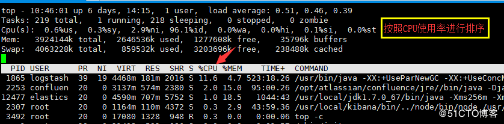

如上图，最耗CPU的进程PID为1865

#### 步骤二：找到最耗CPU的线程

工具：top

方法：`top -Hp {PID}`，显示一个进程的线程运行信息列表，键入 P，线程按 CPU 使用率排序

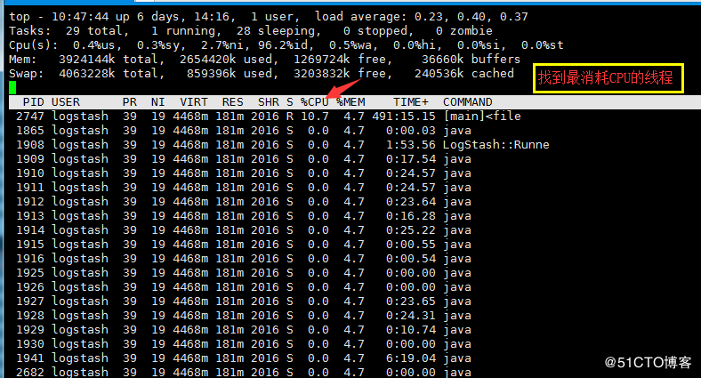

如上图，进程1865内，最耗CPU的线程PID为2747

等价工具：`pidstat -t -p {PID} 1`（逐秒输出线程级 CPU，便于抓波动型热点）。

#### 步骤三：将线程PID转化为16进制

工具：printf

方法：`printf "%x\n" 2747`


如上图，2747对应的16进制是abb，当然，这一步可以用计算器。

注意：之所以要转化为16进制，是因为堆栈里，线程id是用16进制表示的。

#### 步骤四：查看堆栈，找到线程在干嘛

工具：pstack/jstack/grep

方法：`jstack 1865 | grep 0xabb -C5 --color`

jstack pid命令查看当前运行程序进程的堆栈状态，通过将该pid转成16进制的值，在thread dump中每个线程都有一个nid，找到对应的nid即可；隔段时间再执行一次jstack命令获取thread dump，对比两份dump是否有差别，在nid=0xabb的线程调用栈中，有多次调用现象就说明该地方可能代码有问题了。

**取证要点**：jstack 是瞬时快照，CPU 高的问题必须**连续抓 2~3 次间隔几秒的 dump 对比**，热点线程会反复出现在同一段调用栈上。单次 dump 对 CPU 问题几乎没有证明力。

**现代替代路径**：Arthas `thread -n 3` 一条命令直接列出最耗 CPU 的前 3 个线程及其堆栈（见第 8 章），生产中可优先使用。

### CPU 高 ≠ Load Average 高

两个指标度量的是不同的东西：

- **CPU 使用率**：CPU 时间片被占用的时间比例（top 的 us+sy）。
- **Load Average**：一段时间内**可运行 + 不可中断睡眠（D 状态）**的任务数均值（1/5/15 分钟）。

组合判断：

| 现象 | 典型含义 |
| ---- | ---- |
| CPU 高 + Load 高 | 真正的计算瓶颈：死循环、正则回溯、GC 风暴 |
| CPU 低 + Load 高 | 大量线程在等 IO / 处于 D 状态：磁盘慢、下游慢、锁 park、上下文切换风暴 |
| CPU 高 + Load 不高 | 单线程热点（one hot thread），常见于无并发的计算循环 |

另外看 top 里 **us / sy / wa** 的分布：us 高 → 应用计算（含 GC 线程）；sy 高 → 系统调用 / 上下文切换 / 锁自旋；wa 高 → IO 等待。

### 常见根因清单

- **infinite loop / busy spin**：`while(true)` 无退出条件、轮询不 sleep。
- **excessive computation**：数据量增长后 O(n²) 逻辑被放大（如双层循环过滤大列表）。
- **serialization**：热路径上序列化超大对象（JSON / XML）。
- **regex**：灾难性回溯（catastrophic backtracking），特征是 CPU 打满但进度不动。
- **excessive GC**：GC 线程吃掉 us。验证：`jstat -gcutil PID 1000` 看 GC 时间占比，GC 日志确认频率。
- **lock contention**：大量线程竞争一把锁，自旋 + 上下文切换抬 CPU。dump 中大量 BLOCKED 线程。
- **thread explosion**：线程数暴涨后调度开销本身吃 CPU（见第 6 章）。

### Interview SOP — CPU 100% 怎么排查？

可以口述的 1 分钟版本：

> 先确认影响范围和是否可止血（摘流量、限流），然后三步定位：
> 一，`top` 找到 CPU 最高的 Java 进程 PID；
> 二，`top -Hp PID` 找到最耗 CPU 的线程 TID，`printf '%x\n'` 转十六进制；
> 三，`jstack PID` 在 dump 里按 nid=0x{hex} 找到该线程，连续抓两三份 dump 对比确认热点栈，定位到具体代码。
> 然后按根因分类处理：代码级问题（死循环/正则回溯）改代码；GC 引起的查内存；锁竞争引起的看锁粒度。容器环境要同时确认是不是 cgroup CPU 配额被吃满导致的应用侧排队。

## 3. Memory / OOM

不按错误字符串机械罗列，按**内存区域**组织。先总览，再逐类展开。

### OOM 类型总览

内存溢出（out of memory）通俗理解就是内存不够，指程序在申请内存时，没有足够的内存空间供其使用。

| 错误字符串 | 内存区域 | 首要怀疑点 |
| ---- | ---- | ---- |
| Java heap space / GC overhead limit exceeded | 堆 | 泄漏、无界集合、大查询、分配过快 |
| Metaspace | 元空间 | 类加载过多、动态代理、ClassLoader 泄漏 |
| Direct buffer memory | 堆外 | NIO / Netty 直接内存未释放 |
| Unable to create new native thread | 线程栈 | 线程数达 OS / 内存上限 |
| StackOverflowError | 单线程栈 | 递归过深（不是堆问题） |
| Out of swap space | OS 虚拟内存 | 物理内存 + swap 不足 |
| Requested array size exceeds VM limits | 堆 | 申请的数组超 VM 上限 |
| OS OOM Killer（非 JVM 错误） | 进程级 | 容器/宿主机内存耗尽，内核杀进程 |

### Java Heap OOM

#### 原因分类

- **true memory leak**：对象不再使用但被 GC root 持有，见第 4 章。
- **unbounded collection / cache**：List/Map 只增不减、缓存无淘汰策略。
- **huge query / result**：一次拉回全表、分页失效、大字段。
- **large object**：一次性构建大数组 / 大字符串（G1 下还会触发 humongous 分配，见第 5 章）。
- **allocation rate > reclamation rate**：分配速度持续大于回收速度，堆必然打满。

#### 示例

可通过设置参数比如 `-Xmx20M -Xms20M` 调小堆大小复现：

```java
@RestController
public class HeapController {
    List<Person> list=new ArrayList<Person>();
    @GetMapping("/heap")
    public String heap() {
        while(true){
            list.add(new Person());
        }
    }
}
```

访问http://localhost:8080/heap后报错：

```
Exception in thread "http-nio-8080-exec-2" java.lang.OutOfMemoryError: GC overhead limit exceeded
```

> 注：这类代码通常先抛 `GC overhead limit exceeded`（GC 时间占比 98% 且回收不足 2% 时的"预报警"），最终才是 `Java heap space`。两者都是堆耗尽，处理路径相同。

#### GC overhead limit exceeded

执行垃圾收集的时间比例太大，有效的运算量太小。说明程序基本上耗尽了所有的可用内存，GC也清理不了。

默认情况下，如果GC花费的时间超过98%，并且GC回收的内存少于2%，JVM就会抛出这个错误。

#### 排查 SOP

```
memory metrics（容器/进程 RSS、堆使用曲线）
→ GC behavior（jstat -gcutil / GC 日志：Old 区是否只涨不降）
→ heap dump（-XX:+HeapDumpOnOutOfMemoryError 或 jcmd GC.heap_dump）
→ histogram（MAT 直方图：什么对象最多）
→ dominator tree（谁在持有它们）
→ retained size（释放后能省多少）
→ GC roots（引用链指向哪段业务代码）
→ code/business root cause
```

工具：jcmd、jmap、Eclipse MAT（详见第 4、8 章）。

#### 解决

- **第一优先**：检查程序，看是否有死循环或不必要地重复创建大量对象（大多数堆 OOM 是业务问题，不是 JVM 问题）。
- **第二优先**：确认堆配置是否匹配业务数据量（并发 × 单请求内存），必要时调整 Xms/Xmx。
- 加内存只是**买时间**：如果是泄漏，加大 Xmx 只是把 OOM 从 2 小时推迟到 4 小时。面试中不能只答"加内存"。

#### 真实场景示例

- 项目中使用定时线程池不断从数据库表中拿数据，在旧的业务逻辑中，全量信息缓存后不回收，从而造成了OOM。
- list不断加入对象且不回收。（过于常见）
- 设计上是分页，但实际没有开发。（过于常见）
- 以前写C++的程序员写了程序以后产生OOM特别多，后来一看是因为他们习惯于做析构函数，在Java里找不到合适的，于是就重写finalize方法，造成对象回收变慢，新对象产生又快，于是大量OOM。（过于常见）

### Metaspace OOM

Metaspace 存放类元数据（JDK 8 起取代 PermGen，位于本地内存，默认只受物理内存限制，可用 `-XX:MaxMetaspaceSize` 设上限）。

#### 原因

- **excessive class loading**：程序中使用了大量的jar或class。
- **dynamic proxy / generated class**：CGLIB / ASM / Groovy / JSP 热生成类，每个新类都占 Metaspace。
- **ClassLoader leak**：应用反复重部署时旧 ClassLoader 无法回收，其加载的类全部滞留（常见于传统容器部署）。

#### 示例

可通过 `-XX:MetaspaceSize=50M -XX:MaxMetaspaceSize=50M` 调小元空间复现：

```xml
<dependency>
    <groupId>asm</groupId>
    <artifactId>asm</artifactId>
    <version>3.3.1</version>
</dependency>
```

```java
public class MyMetaspace extends ClassLoader {
    public static List<Class<?>> createClasses() {
        List<Class<?>> classes = new ArrayList<Class<?>>();
        for (int i = 0; i < 10000000; ++i) {
            ClassWriter cw = new ClassWriter(0);
            cw.visit(Opcodes.V1_1, Opcodes.ACC_PUBLIC, "Class" + i, null, "java/lang/Object", null);
            MethodVisitor mw = cw.visitMethod(Opcodes.ACC_PUBLIC, "<init>", "()V", null, null);
            mw.visitVarInsn(Opcodes.ALOAD, 0);
            mw.visitMethodInsn(Opcodes.INVOKESPECIAL, "java/lang/Object", "<init>", "()V");
            mw.visitInsn(Opcodes.RETURN);
            mw.visitMaxs(1, 1);
            mw.visitEnd();
            Metaspace test = new Metaspace();
            byte[] code = cw.toByteArray();
            Class<?> exampleClass = test.defineClass("Class" + i, code, 0, code.length);
            classes.add(exampleClass);
        }
        return classes;
    }
}
@RestController
public class NonHeapController {
    List<Class<?>> list=new ArrayList<Class<?>>();
    @GetMapping("/nonheap")
    public String nonheap() {
        while(true) {
            list.addAll(MyMetaspace.createClasses());
        }
    }
}
```

访问http://localhost:8080/nonheap后报错：

```
java.lang.OutOfMemoryError: Metaspace
    at java.lang.ClassLoader.defineClass1(Native Method) ~[na:1.8.0_191]
    at java.lang.ClassLoader.defineClass(ClassLoader.java:763) ~[na:1.8.0_191]
```

#### 排查与解决

- 证据：`jstat -class PID` 看已加载类数是否持续增长；dump 用 MAT 的 ClassLoader Explorer 看哪个 loader 加载了海量类。
- 修复代码层：限制动态生成类的数量、缓存代理类、避免在循环里反复生成。
- 设置 `-XX:MaxMetaspaceSize` 兜底，防止 Metaspace 无限增长吃光物理内存（进而被 OS OOM Killer 盯上）。
- 历史方案（清理 web-inf/lib 下重复 jar、公用 jar 提到容器公共 lib）效果有限，作为低优先手段保留。

（PermGen 时代的内容见 Appendix——JDK 8 起 PermGen 已被移除，不要在面试中把 `PermSize` 当现行参数讲。）

### Direct Memory OOM

报错形态：`java.lang.OutOfMemoryError: Direct buffer memory`。

#### 关联场景

- **NIO**：`ByteBuffer.allocateDirect()` 分配堆外内存，不计入堆，受 `-XX:MaxDirectMemorySize` 限制（默认约等于 Xmx）。
- **Netty 等框架**：大量使用池化堆外缓冲（`PooledByteBufferAllocator`），泄漏时堆很干净、RSS 持续涨。
- 典型事故链：业务代码忘了 `release()` / 忘了 close 带 cleaner 的 buffer → 堆外只增不减 → Direct buffer memory OOM。

#### 排查要点

- 堆指标正常但进程 RSS 持续上涨，是堆外泄漏的第一信号。
- 开 NMT 看 `Internal` / `Other` 类别（见第 8 章）；Netty 场景看其自身内存池指标。
- **经典陷阱**：`-XX:+DisableExplicitGC` 会禁掉 `System.gc()`，而 JDK 8 的 DirectByteBuffer 分配失败时正是靠调用 System.gc() 触发回收已死 buffer 的 cleaner——禁掉后堆外回收时机失控，Netty 应用极易 Direct buffer OOM。若必须保留 System.gc 的清理路径又不想要 STW Full GC，可用 `-XX:+ExplicitGCInvokesConcurrent`（CMS/G1 下转为并发周期）。

#### 修复

- 代码层：确保堆外资源释放（try-finally / ReferenceCountUtil.release）。
- 配置层：合理的 MaxDirectMemorySize + 内存池指标暴露。
- 治标：增大 MaxDirectMemorySize 只能延缓，泄漏依旧。

### Unable to Create New Native Thread

程序创建的线程数量已达到上限值，例如如下代码：

```java
while(true) {
    new Thread(new Runnable() {
        public void run() {
            try {
                Thread.sleep(10000000);
            } catch(InterruptedException e) { }
        }
  }).start();
}
```

利用死循环创建N多个新线程。用不了多久就会产生 `java.lang.OutOfMemoryError: Unable to create new native thread` 错误。

#### 上限来自三层

1. **内存**：每线程消耗一个线程栈（-Xss，默认 1M）。物理内存 / cgroup 内存限额决定上限。
2. **OS 限制**：`ulimit -u`（用户进程/线程数）、`/proc/sys/kernel/threads-max`、`vm.max_map_count`（每线程约占 2 个映射，默认 65530，理论上限约 3 万线程）。
3. **容器限制**：K8s/Docker 的 pids cgroup 限额（`pids.max`），是容器里最常见的触发点。

#### 排查与修复

- 证据：`jstack PID | grep '"' | wc -l` 数线程，按线程名分组看谁在暴涨。
- 根因几乎都在代码：每请求 new Thread、未设上限的缓存线程池、依赖库里自建线程。
- 修复：统一走有界线程池（原理见 CSE311），泄漏的线程池补 shutdown。

### StackOverflowError

（原文标题为"堆溢出"，属笔误：StackOverflowError 是**栈**溢出，与堆无关。）

示例代码如下

```java
public class StackDemo {
    public static long count=0;
    public static void method(long i) {
        System.out.println(count++);
        method(i);
    }
    public static void main(String[] args) {
        method(1);
    }
}
```

运行结果和报错：

```
7252
7253
7254
7255
Exception in thread "main" java.lang.StackOverflowError
    at sun.nio.cs.UTF_8$Encoder.encodeLoop(UTF_8.java:691)
    at java.nio.charset.CharsetEncoder.encode(Charset.Encoder.java:579)
```

Stack Space用来做方法的递归调用时压入Stack Frame(栈帧)。所以当递归调用太深的时候，就有可能耗尽Stack Space，报出栈溢出StackOverflowError的错误。

#### 原因

- 无出口递归 / 递归深度与输入规模成正比。
- 递归数据结构成环（链表环、父子互引）。
- 框架层叠过深 + 单帧较大（深层调用链上还有大局部变量）。

#### -Xss 的取舍

```shell
-Xss128k
```

设置每个线程的堆栈大小。JDK 5以后每个线程堆栈大小为1M，以前每个线程堆栈大小为256K。

线程栈的大小是个双刃剑，如果设置过小，可能会出现栈溢出，特别是在该线程内有递归、大的循环时出现溢出的可能性更大；如果该值设置过大，就会影响到可创建线程的数量，如果是多线程的应用，就会出现内存溢出的错误。

> 历史经验值"线程数 3000~5000 最佳"缺少上下文，不要当结论背：那是小栈（-Xss 很小）+ 无容器限制 + 单机物理内存较大年代的观测值。现代实践是**用有界线程池把活跃线程控制在几十~几百**，把线程数问题转化成池配置问题；真要算上限，用"可用内存 ÷ Xss"与 OS/容器限额三者取最小。

### Native Memory（堆外内存）总览

RSS 涨但堆不涨时，按块排查：Direct buffer、线程栈、Metaspace、Code Cache、GC 自身数据结构。取证工具是 **NMT（Native Memory Tracking）**，见第 8 章。

### OS OOM Killer ≠ JVM OutOfMemoryError

如果可用内存(含swap)不足，就有可能会影响系统稳定。这时候 Out of memory killer 就会设法找出流氓进程并杀死它，也就是引起了这个报错。通常采用启发式算法，对所有进程计算评分(heuristics scoring)，得分最低的进程将被kill掉。

因此 `Out of memory: Kill process or sacrifice child` 和前面所讲的OutOfMemoryError都不同，因为它既不由JVM触发也不由JVM代理，而是系统内核内置的一种安全保护措施。

| | JVM OutOfMemoryError | Linux OOM Killer |
| ---- | ---- |
| 触发者 | JVM 自身 | 内核 |
| 进程状态 | 通常存活，抛异常 | 进程被 SIGKILL，直接消失 |
| 现场证据 | 异常堆栈 + HeapDumpOnOutOfMemoryError 生效 | **HeapDumpOnOutOfMemoryError 不会触发**（没有走到 JVM 逻辑） |
| 排查入口 | 第 3、4 章流程 | `dmesg | grep -i "killed process"` / `journalctl -k`，看 oom_score 和容器 memory limit |

容器场景：Java 进程内存 = 堆 + Metaspace + 线程栈 + 堆外 + JVM 开销，Xmx 必须给这些留余量（如 `-XX:MaxRAMPercentage=70` 起步再观测），否则 cgroup memory limit 一到，kubelet 直接 OOMKilled。

### Out of swap space

JVM启动参数指定了最大内存限制，如‐Xmx以及相关的其他启动参数。假若JVM使用的内存总量超过可用的物理内存，操作系统就会用到虚拟内存。

该报错表明，交换空间(swap space,虚拟内存)不足，是由于物理内存和交换空间都不足所以导致内存分配失败。

生产建议：延迟敏感服务应尽量关 swap（swap 会让 GC 停顿数量级恶化），并确认 cgroup/物理内存规划。

### Requested array size exceeds VM limits

Java平台限制了数组的最大长度。各个版本的具体限制可能稍有不同，但范围都在1~21亿之间。

如果报错，就说明想要创建的数组长度超过限制。排查方向是业务上为什么会出现"要一次装下 20 亿元素"的数组——通常是分页失效或全量拉取。

## 4. Memory Leak

### Leak ≠ OOM

**内存泄漏**（Memory Leak）是指程序中已动态分配的堆内存由于某种原因程序未释放或无法释放，造成系统内存的浪费，导致程序运行速度减慢甚至系统崩溃等严重后果。

内存泄漏很容易导致**内存溢出**，但内存溢出不一定是内存泄漏导致的。

判定标准（现场可验证）：**多次 Full GC 后 Old 区占用仍单调上升** → 泄漏；Full GC 后能回落 → 是容量/流量问题，不是泄漏。

### 典型 Java 泄漏模式

- **static collection**：静态 Map/List 只 put 不 remove，生命周期 = JVM 生命周期。
- **unbounded cache**：自研缓存无淘汰策略（对比：应设上限 + LRU/TTL）。
- **ThreadLocal misuse**：线程池场景线程复用不 `remove()`，Entry 滞留（尤其 value 持有大对象）。
- **listener / callback not removed**：注册中心型组件反复注册不注销。
- **ClassLoader leak**：热部署/重发布后旧 loader 被 GC root（如静态日志框架缓存）钉住。
- **resource not closed**：流/连接未关，既漏 FD 也可能漏其内部缓冲。
- **oversized queue**：无界 executor 队列或 MQ 消费积压，任务对象滞留。
- **executor/task accumulation**：任务提交速率 > 执行速率，队列线性增长。
- **finalize 滥用**：finalizer 队列消费慢，对象晋升老年代滞留（见第 3 章场景示例）。

### Heap Dump 分析 SOP

取证据（两份间隔 dump 最有说服力，对比增长类）：

```shell
jcmd PID GC.heap_dump /tmp/heap.hprof
# 或 jmap -dump:live,format=b,file=/tmp/heap.hprof PID
# 注意 -dump:live 会先触发一次 Full GC，生产大堆慎用、先摘流量
```

分析路径（Eclipse MAT）：

```
Histogram（哪个类的实例数/浅堆最大）
→ Dominator Tree（哪个对象支配的内存最大）
→ Retained Heap（释放它能回收多少）
→ Path to GC Roots（它为什么没被回收——引用链指向的业务代码）
→ Leak Suspects（MAT 自动报告，快速入口，但结论要人工复核）
```

关键思维：Histogram 告诉你"是什么"，Dominator Tree 和 GC Roots 引用链才告诉你"是谁的锅"。只有拿到引用链上的业务对象名，才能定位到代码。

## 5. GC Problems

> 边界：CSE301 解释 GC 算法原理（G1/ZGC 怎么工作）。本章只回答：**GC 出问题了怎么查**。默认背景是现代收集器（G1 为主），CMS/PermGen 时代的内容统一放 Appendix。

### Frequent Young GC

Young GC 频繁本身不一定是故障（Young GC 本来就该频繁且短），**频繁 + 单次变长 + 影响 RT** 才是问题。

#### 看什么

- **allocation rate**：GC 日志里推算分配速率（MB/s），正常业务几百 MB/s 以内，突然翻倍必有代码变更。
- **young generation behavior**：Eden 多大、回收后 survivor 占用、对象是否过早晋升。
- **object churn**：大量朝生夕死对象是健康 churn；异常的是把大临时对象创建放到了热路径。

#### 常见根因

- 新代码在热路径创建大对象/大集合（一次请求构建几 MB 的中间列表）。
- 日志/JSON 序列化放大（大对象字符串拼接）。
- 缓存 miss 风暴导致重复构建。
- Eden 过小（相对分配速率）。

#### 修复方向

优先代码层（减少分配），其次才是调新生代大小。Young GC 的问题 90% 是分配问题，不是参数问题。

### Frequent / Unexpected Full GC

Full GC = 整堆 STW 回收，是 RT 抖动的主要来源之一。G1 场景下的现代原因清单：

1. **堆真的不够 / 泄漏**：Old 区持续上涨，并发周期追不上 → 退化为 Full GC。证据：GC 日志 `Full GC (Allocation Failure)` 一类字样 + 老年代只涨不降。
2. **humongous allocation**：对象 ≥ region 一半（region 1~32MB，可由 `-XX:G1HeapRegionSize` 调）即按 humongous 处理，直接进 Old 区，大量大对象会频繁触发并发周期甚至 Full GC。证据：日志中 humongous 相关行。
3. **Metaspace 空间不足**：类加载触发。证据：`Full GC (Metadata GC Threshold)`。
4. **System.gc() 显式调用**：业务代码或依赖库调用。证据：`Full GC (System.gc())`。
5. **evacuation failure（to-space exhausted）**：并发回收期间没有足够 region 装存活对象，G1 被迫 Full GC。通常是堆小或分配过快。

`System.gc()` 的处理：该方法只是**建议**JVM 进行Full GC，并非一定触发，但很多情况下它会触发 Full GC，从而增加间歇性停顿。能不用就不用，让虚拟机自己管理内存。

- 禁用：`-XX:+DisableExplicitGC`。但注意第 3 章的 Direct Memory 陷阱（Netty 场景慎用）。
- 折中：`-XX:+ExplicitGCInvokesConcurrent`，把显式调用降级为并发周期。

#### Interview SOP — Full GC 频繁怎么办？

结构化回答（现象 → 证据 → 原因分类 → 定位 → 修复）：

> **现象**：Full GC 次数陡增 / RT 抖动，确认影响范围和起始时间点，先关联变更。
> **证据**：拿 GC 日志（-Xlog:gc* 或 JDK8 的 PrintGCDetails），看 Full GC 的 **cause 字段**——这一步直接完成原因分类；配合 jstat -gcutil 看各代占用走势。
> **原因分类**（对着 cause 说）：
> Allocation Failure / 老年代只涨不降 → 查泄漏或容量（第 4 章流程，heap dump + MAT）；
> Metadata GC Threshold → 查类加载、动态代理、MaxMetaspaceSize；
> System.gc() → 查显式调用栈，DisableExplicitGC 或 ExplicitGCInvokesConcurrent；
> humongous → 查大对象分配（大数组/大报文），必要时调 G1HeapRegionSize。
> **修复**：按分类对应代码修复 / 配置修复 / 容量修复，改完用 GC 日志验证频率回归。
> **反模式**：第一反应就"调大 Xmx"——只有证据表明是容量不足时才成立；是泄漏时调大只是推迟 OOM。

### Long GC Pause

停顿长 ≠ 次数多，排查维度：

- **GC 日志**：先分清是 Young pause 长、Mixed pause 长还是 Full GC 长，每种对应不同原因。
- **heap occupancy**：堆越满、存活对象越多，复制/整理成本越高。
- **promotion**：对象过早晋升（survivor 太小或 MaxTenuringThreshold 影响）使 Young 回收变重。
- **humongous allocation**：见上。
- **CPU**：GC 线程拿不到 CPU（容器 CPU 配额太紧、宿主机争抢），GC 停顿被动拉长。`vmstat` 看是否长期满载。
- **safepoint**：GC 前要等所有线程到安全点，某个线程长时间不到（大循环、缺 Safepoint Poll 的 JIT 优化）会让"GC 停顿"实际是"等待进 safepoint"。用 `-Xlog:safepoint`（JDK 9+；JDK 8 用 `-XX:+PrintSafepointStatistics`）验证。
- **swap / 页缓存换出**：GC 要扫描的页被换出，停顿数量级放大。

### GC Log Analysis

生产环境 GC 日志应默认开启，成本极低，价值在事故时兑现。

#### 现代 Unified Logging（JDK 9+）

```shell
-Xlog:gc*:file=gc.log:time,uptime,level,tags:filecount=5,filesize=50m
```

典型输出（G1）：

```
[2026-09-28T10:15:30.123+0800][info][gc] GC(42) Pause Young (Normal) (G1 Evacuation Pause) 23M->5M(64M) 2.345ms
```

一次 Young 回收：`23M->5M` 回收前后堆占用、`(64M)` 当前堆、`2.345ms` 停顿。关注三件事：**停顿时间序列、回收前后占用（决定是否在有效回收）、cause 标签**。

#### Legacy 格式（JDK 8 及以前）

```
5.617: [GC 5.617: [ParNew: 43296K->7006K(47808K), 0.0136826 secs] 44992K->8702K(252608K), 0.0137904 secs] [Times: user=0.03 sys=0.00, real=0.02 secs]
```

```
5.617（时间戳）: [GC（GC指YGC, FGC指FGC）
5.617（时间戳）:
[ParNew（使用ParNew作为年轻代的垃圾回收器）:
43296K（年轻代垃圾回收前的大小）
->7006K（年轻代垃圾回收以后的大小）
(47808K)（年轻代的总大小）,
0.0136826 secs（回收时间）]
44992K（堆区垃圾回收前的大小）
->8702K（堆区垃圾回收后的大小）
(252608K)（堆区总大小）,
0.0137904 secs（回收时间）]
[Times: user=0.03（Young GC用户耗时）
sys=0.00（Young GC系统耗时）,
real=0.02 secs（Young GC实际耗时）]
```

> ParNew 是 CMS 时代的年轻代收集器，JDK 8 仍大量存量使用，所以这格式仍要会读；user 远大于 real 说明并行 GC 线程在多核上工作，属正常。

对应的旧开关（`-XX:+PrintGCDetails -Xloggc:...` 等）见 Appendix 的参数映射。

## 6. Thread Problems

> 边界：CSE311 讲线程池/锁的原理。本章只讲**线程出事故了怎么查**。第一工具永远是 thread dump。

### 死锁 Deadlock

#### SOP

```
jstack PID（或 jcmd PID Thread.print）
→ jstack 会自动检测并打印 "Found one Java-level deadlock" 区块
→ 分析 lock ownership：谁持有 <0x...>、谁在等它
→ 找到代码中的锁获取顺序
```

#### 修复

- 统一加锁顺序（按固定顺序获取多把锁）。
- 用 `tryLock(timeout)` 替代无限等待，拿不到就放弃/回退。
- 缩小锁范围，减少持锁时间。

### BLOCKED（热锁）

dump 中大量线程 `BLOCKED (on object monitor)`、`waiting to lock <0x...>`，且锁的持有者正在做慢操作（典型：持锁做 DB 调用 / RPC）。

- 与死锁的区别：死锁是**环**（互相等），热锁是**队**（排队等一把）。
- 定位：从 dump 找到 `locked <0x...>` 的持锁线程，看它的栈在干什么，慢的源头通常就在那几帧。
- 修复方向：缩小临界区、把 IO 移出锁、锁细化/分段（如按 key 分片锁）。

### WAITING / TIMED_WAITING

线程池空闲 worker 停在 `WAITING (parking)` 是**健康状态**，不要见到 WAITING 就报警。异常形态：

- 所有 worker 都 WAITING 在 `getConnection` / 自定义 Condition 上 → 资源池耗尽（去查池的上游）。
- `Object.wait()` 无 notify 配对、`await` 无 signal → 业务逻辑缺陷。
- 数量异常多且都在等同一个资源 → 转换为"资源池耗尽"排查（连接池/信号量/下游）。

### Thread Explosion（线程暴涨）

症状：线程数持续上涨，最终触发 `Unable to create new native thread`（见第 3 章）或上下文切换把 CPU 吃光（Load 高、sy 高）。

排查：

```shell
jstack PID | grep '^"' | awk -F'"' '{print $2}' | sed 's/[0-9].*//' | sort | uniq -c | sort -rn
# 按线程名前缀聚类，找出暴涨的线程组
```

常见来源：每请求 new Thread、定时任务泄漏创建、依赖库自建线程工厂无界、Tomcat/连接池 max 配置过大叠加。

### Thread Pool Exhaustion（线程池打满）

> 原理（corePoolSize/队列/拒绝策略如何工作）在 CSE311。这里只讲事故链。

#### 事故链（背下来）

```
下游变慢（DB/Redis/RPC 延迟升高）
→ 单任务执行时间变长
→ 活跃线程全部占满（activeCount = max）
→ 任务在队列堆积（queue size 持续增长）
→ 上游请求等不到执行 → RT 抖到超时
→ 上游超时重试 → 放大流量 → 恶性循环
→ 拒绝策略触发（RejectedExecutionException / 静默丢弃）
```

#### 看什么指标

- **active threads**：是否长期贴 max。
- **queue size**：是否持续增长不消化。
- **rejected tasks**：拒绝数（要先埋点，事后是拿不到的）。
- **task execution time**：任务耗时分布，确认是"慢"还是"多"。

#### 现场取证

jstack 中 worker 线程全部停在**同一个下游调用**的 socketRead/read 上 → 下游问题；停在业务计算栈上 → 自身计算问题；队列堆积但 worker 都闲着 → 任务提交风暴。

#### 修复

- 每个下游独立线程池（舱壁隔离，bulkhead），防止一个下游拖死全部。
- 调用必设超时；下游故障配熔断。
- 队列有界 + 拒绝策略可观测（记日志/打点，绝不静默丢弃）。
- 容量不足时扩池/扩容，但先确认不是下游慢导致的假性不足。

### 进程假死（Hung but Alive）

进程在、端口在，但请求不响应。第一步 `jstack`：全线程 BLOCKED → 热锁/死锁；全线程 WAITING 在资源池 → 上游耗尽；线程都在跑但 CPU 低 → 等 IO/等外部。完整决策树见第 11 章 Case 8。

## 7. High Latency / RT Spike

Senior 场景题高频：**接口 RT 从 100ms 涨到 3s，怎么查？**

### 第一原则

**"Java 服务慢" ≠ "JVM 慢"。** 大多数 RT 事故的根因在 JVM 之外（下游、DB、锁、容量），JVM（GC）只是候选之一。先用 trace 把慢定位到 span，再决定往哪个方向深挖。

### 排查树

```
RT 升高
├── Application
│   ├── CPU（第 2 章：热点计算、GC 抢 CPU）
│   ├── GC（第 5 章：停顿时间与 RT 抖动时间点是否吻合）
│   ├── Lock（第 6 章：BLOCKED 线程数）
│   ├── Thread Pool（第 6 章：队列堆积、任务耗时）
│   ├── 连接池（DB/Redis：等待 getConnection）
│   └── 序列化/大对象（热路径大报文）
├── DB（→ DBA101：慢 SQL、锁等待、连接数）
├── Cache（→ DBA201：Redis 延迟、bigkey、缓存击穿）
├── MQ（→ SYS311：消费积压反压）
├── Network（DNS、建连、重传、NAT/ LB 超时）
└── Downstream Service（下游 RT、超时、重试放大）
```

### 常见入口与证据

- **slow SQL**：DB 慢日志、执行计划（细节 DBA101）。应用侧证据：dump 中线程停在 JDBC socketRead。
- **DB connection pool exhaustion**：请求栈停在 `Druid/HikariCP getConnection`；池指标 active=idle=0。根因常是慢 SQL 占住连接。
- **Redis latency / bigkey**：下游 Redis RT 指标、`--bigkeys`（细节 DBA201）。
- **downstream timeout**：trace 直接给出下游 span 耗时；注意区分"下游真慢"和"网络慢"（同机房对比）。
- **retry amplification**：超时配了重试，故障时流量翻倍，把下游/自身进一步压垮。证据：网关/QPS 曲线在故障期出现放大。
- **thread pool saturation**：见第 6 章事故链。
- **GC pause**：RT 毛刺时间点与 GC 日志停顿时间点对齐即实锤。
- **lock contention**：dump 中 BLOCKED 数量与 RT 曲线同涨同落。
- **network**：ping/重传统计、连接队列溢出（`netstat -s` 的 listen drops/overflows）。

### 方法论要点

- 先分**P50 涨还是只有 P99 涨**：P50 涨 → 系统性（容量/下游/变更）；只有 P99 涨 → 毛刺类（GC、锁、慢查询长尾、重试）。
- 先对齐**时间点**：RT 开始恶化 vs 发布/配置变更/流量台阶/下游事件。
- 只保留排障入口和证据链，各组件深挖见对应课程。

## 8. JVM Diagnostic Toolkit

整理而不是堆命令。原则：**OS 层看资源，JDK 工具看 JVM 内部，Arthas/JFR 降低取证成本。**

### OS Layer

只保留 Java 排障真正需要的用法：

- **top / htop**：进程级 CPU/内存排序（第 2 章步骤一）。`top -Hp PID` 下钻线程。
- **ps**：`ps -ef | grep java` 找进程；`ps -T -p PID` 列线程（配合 jstack 用）。
- **pidstat**：`pidstat -p PID 1`（进程）、`pidstat -t -p PID 1`（线程级，波动型 CPU 问题比 top 好用）。
- **vmstat**：`vmstat 1` 看 r（运行队列，对应 Load）、us/sy/id/wa（CPU 构成）、si/so（swap 换入换出，非零即异常）、cs（上下文切换）。
- **iostat**：`iostat -x 1` 看 await 和 %util，判断磁盘是否瓶颈（影响 GC、日志、swap）。
- **free**：`free -m` 看可用内存与 cache/buff，判断是否逼近 OOM Killer / swap。

### JDK Tools

现代场景**优先 jcmd**：它是 JDK 自带的"瑞士军刀"，一个入口覆盖大多数取证（Thread.print / GC.heap_dump / GC.class_histogram / VM.native_memory / JFR.start / VM.flags），且 `jcmd PID help` 可自发现能力。下列传统工具各有所长，继续保留。

#### jcmd

```shell
jcmd PID help                  # 列出该进程支持的所有命令
jcmd PID Thread.print          # 等价 jstack
jcmd PID GC.heap_dump /tmp/h.hprof
jcmd PID GC.class_histogram    # 快速看堆内类直方图（比 dump 轻）
jcmd PID VM.flags              # 查看生效参数
```

#### jps

查看Java进程。

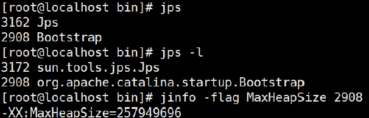

#### jstack

查看线程堆栈信息，可用于排查死锁。

```shell
jstack PID
```

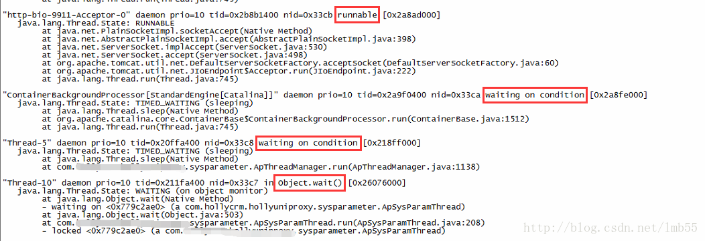

其中标注daemon字样的是后台线程。以上的用户线程中包括：

- 线程的一些基本信息：名称、优先级及id
- 线程状态：waiting on condition等
- 线程的调用栈
- 线程锁住的资源：locked<0x3f63d600>

CPU 问题、锁问题、线程池问题、假死，第一工具都是它（用法见第 2、6 章）。

#### arthas

Arthas是Alibaba开源的Java诊断工具，采用命令行交互模式，是排查jvm相关问题的利器。

下载安装：

```shell
curl -O https://alibaba.github.io/arthas/arthas-boot.jar
java -jar arthas-boot.jar
# 或者 java -jar arthas-boot.jar -h
# 然后可以选择一个Java进程
```

排障高频命令（按事故类型记，不背手册）：

- **dashboard**：总览面板（线程/内存/GC 一屏看全，故障第一眼）。
- **thread**：`thread -n 3` 最耗 CPU 线程；`thread --state BLOCKED`；`thread -b` 找阻塞源头。
- **jad**：反编译，确认线上跑的代码到底是不是你以为的版本（发布问题排查神器）。
- **watch**：观察方法入参/返回值/异常（`watch 类 方法 '{params,returnObj,throwExp}'`），不用加日志重启。
- **trace**：方法内部调用链耗时分解，RT 问题定位到具体子调用。
- **stack**：谁在调用这个方法（输出调用路径）。
- **profiler**：`profiler start/stop` 生成火焰图，CPU 热点可视化。

#### jmap

生成堆转储快照

打印出堆内存相关信息

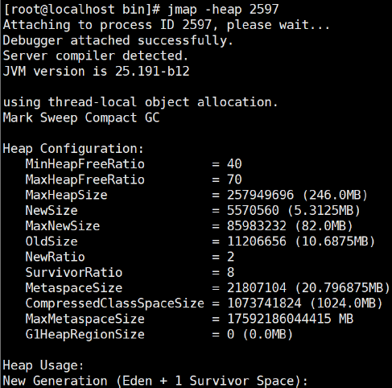

dump出堆内存相关信息

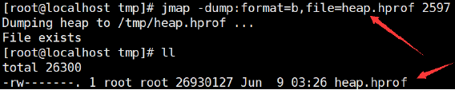

一般在开发中，JVM参数可以加上下面两句，这样内存溢出时，会自动dump出该文件

```shell
-XX:+HeapDumpOnOutOfMemoryError -XX:HeapDumpPath=heap.hprof
```

设置堆内存大小: -Xms20M -Xmx20M 启动，然后访问localhost:9090/heap，使得堆内存溢出。一般dump下来的文件可以结合工具来分析（MAT 分析流程见第 4 章）。

注意：dump 会 STW，大堆生产环境执行前先摘流量；`-dump:live` 还会先触发一次 Full GC。

#### jstat

查看虚拟机性能统计信息。

查看类装载信息

```shell
jstat -class PID 1000 10
# 查看某个java进程的类装载信息，每1000毫秒输出一次，共输出10次
```

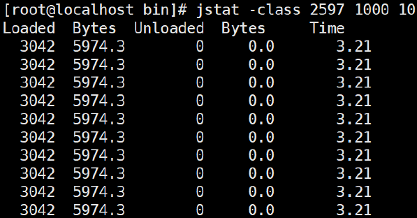

查看垃圾收集信息

```shell
jstat -gc PID 1000 10
```

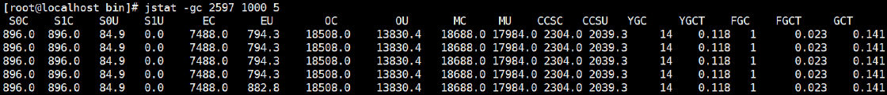

日常排障更常用 `-gcutil`（直接给各代占用百分比和 GC 次数/总耗时）：看 Old 区走势、FGC 次数与 FGCT 总耗时是否陡增。

#### jinfo

实时查看和调整JVM配置参数。（现代也可用 `jcmd PID VM.flags` 查看。）

##### 查看

```shell
jinfo -flag name PID #查看某个java进程的name属性的值：
jinfo -flag MaxHeapSize PID
jinfo -flag UseG1GC PID
jinfo -flags PID
```

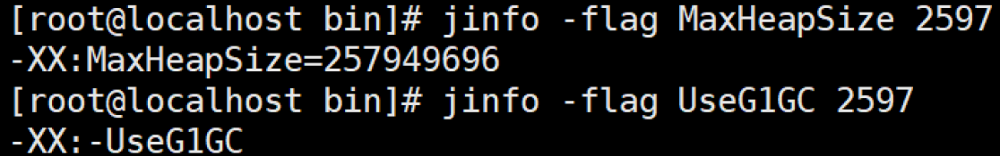

##### 修改

参数只有flags被标记为manageable才可以被实时修改

```shell
jinfo -flag [+|-] PID
jinfo -flag <name>=<value> PID
```

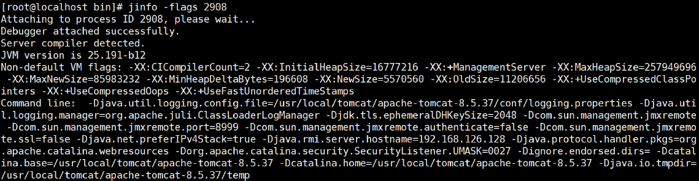

#### jconsole / jvisualvm（可视化）

JConsole工具是JDK自带的可视化监控工具。用于对JVM中的内存、线程和类等进行监控，查看java应用程序的运行概况、监控堆信息、元空间使用情况（旧版本显示 PermGen）、类加载情况等。

```shell
jconsole
```

JDK自带的全能分析工具（jvisualvm），可以分析：内存快照、线程快照、程序死锁、监控内存的变化、GC变化等。既可以监控本地Java进程，也可以监控远端Java进程。

```shell
jvisualvm
```

visualgc插件下载链接 https://visualvm.github.io/pluginscenters.html

选择对应JDK版本链接--->Tools--->Visual GC

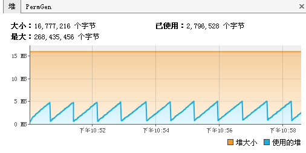

> 定位：适合开发/测试环境与低危生产窗口的 GUI 取证；生产事故现场优先 jcmd/Arthas（可脚本化、无 GUI 依赖），趋势分析优先 JFR + 监控系统。

### JFR / JMC（现代低开销持续观测）

- **JFR（Java Flight Recorder）**：JVM 内置的事件记录器，JDK 11 起开源。常开开销约 1% 量级（取决于配置），可以**长期飞行记录**（ring buffer 滚动覆盖），事故发生后把事故前后的记录直接下载分析——这是它相对"事后取证"工具的本质优势。
- **JMC（Java Mission Control）**：分析 JFR 记录的 GUI，提供分配分析、长延迟分析（哪些事件阻塞了线程）、锁竞争、IO 事件视图。

启动方式：

```shell
# 启动期持续记录
java -XX:StartFlightRecording=duration=10m,filename=rec.jfr ...
# 运行期通过 jcmd 开/停/转储
jcmd PID JFR.start name=rec settings=profile duration=10m filename=/tmp/rec.jfr
jcmd PID JFR.dump name=rec filename=/tmp/incident.jfr
```

适合的问题：**为什么这里慢（延迟分析）**、**谁在疯狂分配（allocation profiling，第 5 章 allocation rate 的证据源）**、**锁竞争热点**——即"事后无现场、且常规 dump 不足以回答"的问题。

### Heap Analysis

工具链：jcmd / jmap 取 dump（见上）→ Eclipse MAT 分析。分析 SOP（Histogram → Dominator Tree → Retained → Path to GC Roots）见第 4 章。

### Native Memory Tracking (NMT)

NMT 是Hotspot VM用来分析VM内部内存使用情况的一个功能。我们可以利用jcmd（jdk自带）这个工具来访问NMT的数据。堆外内存泄漏（RSS 涨、堆不涨，见第 3 章）的第一取证工具。

#### 打开NMT

NMT必须先通过VM启动参数中打开，不过要注意的是，打开NMT会带来5%-10%的性能损耗。

```shell
-XX:NativeMemoryTracking=[off | summary | detail]
# off: 默认关闭
# summary: 只统计各个分类的内存使用情况.
# detail: Collect memory usage by individual call sites.
```

#### jcmd查看NMT报告

通过jcmd查看NMT报告以及查看对比情况。

```shell
jcmd <pid> VM.native_memory [summary | detail | baseline | summary.diff | detail.diff | shutdown] [scale= KB | MB | GB]
# summary: 分类内存使用情况.
# detail: 详细内存使用情况，除了summary信息之外还包含了虚拟内存使用情况。
# baseline: 创建内存使用快照，方便和后面做对比
# summary.diff: 和上一次baseline的summary对比
# detail.diff: 和上一次baseline的detail对比
# shutdown: 关闭NMT
```

泄漏排查套路：起服务 → `baseline` → 跑流量/跑一天 → `summary.diff` 看哪个类别在涨（Thread/Class/Internal/Other 各对应第 3 章不同 OOM 方向）。

#### VM退出时打印NMT

可以通过下面VM参数在JVM退出时打印NMT报告。

```shell
-XX:+UnlockDiagnosticVMOptions -XX:+PrintNMTStatistics
```

## 9. JVM Performance Tuning

> 顺序纪律：**Measure → Diagnose → Tune → Benchmark → Verify**。调优是排障链路的最后一环：没有 GC 日志/指标证据，就没有调参资格。

### 调优目标

- GC低停顿和低频率。

- 低内存占用。

- 高吞吐量。

三者是 trade-off（见 Pause vs Throughput），不可能同时拉满，先明确业务要哪一个。

### 调优时机

遇到以下情况就需要考虑进行JVM调优了（注意：先走第 1~7 章排查流程确认是 JVM 层问题，再谈调优）：

- Heap内存（老年代）持续上涨达到设置的最大内存值；

- Full GC 次数频繁；

- GC 停顿时间过长（超过1秒）；

- 应用出现OutOfMemory 等内存异常；

- 应用中有使用本地缓存且占用大量内存空间；

- 系统吞吐量与响应性能不高或下降。

### Heap Sizing

#### Xms / Xmx

- `-Xms`：JVM初始分配的内存，单位（k、m、g），默认是物理内存的1/64。
- `-Xmx`：JVM最大分配的内存，单位（k、m、g），默认是物理内存的1/4。

**何时调整**：证据显示 Old 区长期高位且无泄漏、GC 频率与停顿超 SLA、容量模型（并发 × 单请求内存）确实需要更大堆。堆不是越大越好——更大堆 = 更长单次 GC（尤其整理型停顿），还挤压堆外与 OS。

#### 固定堆大小与伸缩区

每一块空间都提供有一个伸缩区，当内存空间不足时会自动打开伸缩区，继续扩大可用的内存。

当发现当前区域的空间可以满足要求的时候就可以进行收缩，收缩这个过程会降低性能。

如果不进行收缩的话，会有以下优缺点：

##### 优点

可以提升对内存分配效率。

##### 缺点

占用空间太大，如果没有合适的GC算法就会造成堆内存的性能下降。

伸缩区的处理范围很大，会导致当用户访问量增加的时候不断地判断空间是否充足、不断地进行内存空间的增长和收缩释放。

默认空余堆内存小于40%时（MinHeapFreeRatio），JVM就会增大堆直到-Xmx的最大限制；空余堆内存大于70%时（MaxHeapFreeRatio），JVM会减少堆直到-Xms的最小限制。因此服务器一般设置-Xms、-Xmx相等以避免在每次GC后调整堆的大小。对象的堆内存由称为垃圾回收器的自动内存管理系统回收。

通过以下代码可以查看伸缩区改变前后可以达到的空间大小：

```java
public class ShowSpaceDemo {
    public static void main(String[] args) {
        Runtime runtime = Runtime.getRuntime() ; //获取 Runtime 实例化对象
        System.out.println(runtime.maxMemory()); //最大可用内存
        System.out.println(runtime.totalMemory()); //默认的可用内存
        System.out.println(runtime.freeMemory()); //剩余的可用内存
    }
}
```

#### 容器内堆大小

容器里 Xmx 不能贴着 memory limit 设：堆 + Metaspace + 线程栈 + 堆外 + JVM 开销总和 < limit，否则 OOMKilled（见第 3 章）。建议 `-XX:MaxRAMPercentage`（如 70~75）起步，按 NMT/RSS 实测调整。

### Stack（-Xss）

见第 3 章 StackOverflowError 一节的取舍分析：默认 1M；调小能容纳更多线程但增加 SOE 风险；现代方向是**控制线程数**而不是压缩栈。

### GC Selection（现代主线）

| 收集器 | 定位 | 适用 |
| ---- | ---- | ---- |
| **G1**（JDK 9+ 默认） | 停顿可控的通用地带 | 大多数在线服务默认选择 |
| **Parallel**（JDK 8 默认） | 吞吐量优先，停顿可容忍 | 批处理、离线计算 |
| **ZGC / Shenandoah** | 亚毫秒级停顿、大堆 | 低延迟强 SLA、堆几十 GB~TB 级 |

选择逻辑：先问业务要吞吐还是要延迟；G1 是稳妥默认；只有延迟 SLA 逼到 GC 停顿不能容忍、且堆大时，才评估 ZGC/Shenandoah。CMS 已在 JDK 9 弃用、JDK 14 移除，只在 Appendix 讨论。

### Pause vs Throughput vs Footprint

三个维度构成 trade-off 三角：

- **Latency**：停顿上限（P99 RT 敏感业务最优先）。
- **Throughput**：GC 占用 CPU 的比例越低越好（批处理最优先）。
- **Memory Footprint**：堆占用越小越好（密度/成本优先）。

任何收集器与参数组合都在挪动这三者的相对位置：例如调小 MaxGCPauseMillis → 更频繁但更短的停顿（延迟改善、吞吐下降）；调大堆 → 停顿和频率都改善但 footprint 上升。**先声明业务在三角里站哪一格，再谈参数。**

### G1 Tuning

只保留工程上真正重要的，**不鼓励大量手工微调 flag**：

- **MaxGCPauseMillis**：G1最大停顿时间目标（默认200）。暂停时间不能太小，太小的话就会导致G1跟不上垃圾产生的速度，最终退化成Full GC。所以对这个参数的调优是一个持续的过程，逐步调整到最佳状态。
- **heap sizing**：见上；G1 建议大堆（region 数适中），但堆越大 Mixed GC 单次越重，仍受三角约束。
- **allocation behavior / humongous object**：对象 ≥ region 一半即 humongous，直接分配到 Old 区并干扰并发周期。避免超大数组/超大报文对象；确有需求时评估 `-XX:G1HeapRegionSize`（1~32MB）。
- **GC log**：改任何参数前后，统一用 `-Xlog:gc*` 对比停顿分布、回收效率、cause 分布——**没有对照组的调参都是感觉**。

G1 相关参数速查（含默认值与注意点）：

| 参数 | 说明 |
| ---- | ---- |
| -XX:MaxGCPauseMillis=200 | G1停顿时间目标。太小会导致G1缩小新生代、回收跟不上，退化成Full GC |
| -XX:InitiatingHeapOccupancyPercent | 启动并发GC周期时堆内存使用占比，默认45。G1基于整个堆的使用率触发并发标记；JDK 9+ 默认启用自适应IHOP，会自动调整，手工固定值反而可能干扰 |
| -XX:G1HeapWastePercent | 允许的浪费堆空间占比，默认5%。并发标记后可回收空间低于该值则不触发MixedGC |
| -XX:G1MixedGCLiveThresholdPercent | Mixed GC回收旧region的存活率阈值，默认85（JDK 8+；JDK 7为65） |
| -XX:G1MixedGCCountTarget | 标记完成后Mixed GC的目标次数，默认8 |
| -XX:G1OldCSetRegionThresholdPercent | Mixed GC时Old Region加入CSet的比例上限，默认10% |
| -XX:ConcGCThreads=n | 并发GC线程数，默认随平台自动设置 |
| -XX:MaxTenuringThreshold=15 | 晋升老年代的最大年龄，默认15（CMS时代为6） |

### ZGC

- **什么时候考虑**：延迟 SLA 严苛（要求 GC 停顿亚毫秒/毫秒级）、堆很大（几十 GB 到 TB）、G1 的停顿已成为 RT 长尾的实锤瓶颈——三者同时成立再评估。JDK 11 引入（实验）、JDK 15 转正。
- **机制一句话**：着色指针 + 读屏障实现并发整理（原理见 CSE301），代价是吞吐略降、需要一定 CPU 余量跑并发线程。
- **不是**"服务慢就换 ZGC"：慢的原因先按第 7 章排查；GC 不是瓶颈时换收集器没有收益，还引入新变量。

### 常用参数速查

#### 参数分类（java命令）

**标准参数**：不会随着JDK版本变化而变化，例如：

```shell
java -version
java -help
```

**非标准参数**：随着JDK版本变化可能会变化。`-X` 参数（如 -Xms / -Xmx / -Xss）与 `-XX` 参数：

```shell
-XX:name=value
-XX:+name   # 启用
-XX:-name   # 禁用
```

#### -XX 参数表（现代主线版）

| 参数                                                         | 说明                                                         |
| ------------------------------------------------------------ | ------------------------------------------------------------ |
| -XX:InitialHeapSize=100M  -Xms100M（简写）                   | 初始化堆大小                                                 |
| -XX:MaxHeapSize=100M  -Xmx100M（简写）                       | 最大堆大小                                                   |
| -XX:NewSize=20M                                              | 设置年轻代的大小                                             |
| -XX:MaxNewSize=50M                                           | 年轻代最大大小                                               |
| -XX:OldSize=50M                                              | 设置老年代大小                                               |
| -XX:MetaspaceSize=50M                                        | Metaspace 触发首次GC的水位（不是固定大小），配合 MaxMetaspaceSize 使用 |
| -XX:MaxMetaspaceSize=50M                                     | Metaspace 上限（默认无上限，受物理内存约束）                 |
| -XX:NewRatio                                                 | 新老生代的比值，比如-XX:NewRatio=4，则表示新生代:老年代=1:4，也就是新生代占整个堆内存的1/5 |
| -XX:SurvivorRatio                                            | 两个S区和Eden区的比值，比如-XX:SurvivorRatio=8，也就是(S0+S1):Eden=2:8，也就是一个S占整个新生代的1/10 |
| -XX:+HeapDumpOnOutOfMemoryError                              | 当JVM堆内存发生OOM时，自动生成dump文件（注意：OS OOM Killer 杀进程时不会触发） |
| -XX:HeapDumpPath=heap.hprof                                  | 指定堆内存溢出打印目录，表示在当前目录生成一个heap.hprof文件 |
| -Xss128k                                                     | 设置每个线程的堆栈大小（默认1M），取舍见第3章                |
| -XX:MaxTenuringThreshold=6                                   | 提升老年代的最大临界值，默认值为15（6为CMS时代默认值，示例沿用原文） |
| -XX:+UseParallelGC                                           | 使用Parallel收集器，吞吐量优先（JDK 8 默认）                 |
| -XX:+UseG1GC                                                 | 使用G1GC，年轻代+老年代统一管理，停顿可控（JDK 9+ 默认）     |
| -XX:CICompilerCount=3                                        | JIT编译线程数，默认随机器核数自适应                          |
| -Xlog:gc*                                                    | 统一日志（JDK 9+），现代GC日志开启方式，见第5章              |

> CMS（-XX:+UseConcMarkSweepGC）、-XX:+UseParallelOldGC（JDK 14 起弃用，UseParallelGC 已覆盖）、旧 GC 日志参数（-XX:+PrintGCDetails 等）均已移入 Appendix。

#### 参数优化要点

##### 固定堆大小

针对JVM堆的设置，一般可以通过-Xms -Xmx限定其最小、最大值，为了防止垃圾收集器在最小、最大之间收缩堆而产生额外的时间，通常把最大、最小设置为相同的值。

同样，为了防止年轻代的堆收缩，我们通常会把-XX:NewSize -XX:MaxNewSize设置为同样大小。

##### 合理调整分代大小比例

本着Full GC尽量少的原则，让年老代尽量缓存常用对象，JVM的默认比例1：2也是这个道理，可以通过调整二者之间的比率NewRatio来调整二者之间的大小。

经过观察，如果应用存在大量的临时对象，应该选择更大的年轻代；如果存在相对较多的持久对象，年老代应该适当增大。

## 10. Performance Testing & Benchmark

### 不要用 System.currentTimeMillis 循环做 microbenchmark

裸写计时代码的结果基本不可信，原因：

- **warm-up**：JVM 先解释执行，热点 JIT 编译后才达到稳态，前 N 次的耗时和稳态差几个数量级。
- **JIT**：优化在后台线程异步发生，测量窗口内代码形态一直在变。
- **dead-code elimination**：计算结果没有被消费，JIT 直接把整段计算优化掉，测出来的是"什么都不做"的速度。
- **benchmark isolation**：单次运行混入 GC、类加载、OS 抖动；同 JVM 内多个 benchmark 互相污染 profile。

### JMH 微基准测试

JMH是一个微基准测试框架，旨在便于衡量特定代码的基准性能。比如，在进行微基准测试时，我们想要测试的是"程序被JVM编译成机器代码（而不是直接执行字节码）"的执行速度。为了让JVM把要测试的代码编译成机器码，我们可能需要把要测试的代码进行"预热处理"（就是先跑几回，或十几回等，当运行的次多了，JVM就会生成机器码），JMH就提供"预热处理"等一系列的处理。

JMH 对应解决上面四个问题：`@Warmup` 预热迭代、fork 隔离进程、`Blackhole` 消费结果防 DCE、多次迭代取统计分布（avgt/thrpt 模式）。

> 边界：JMH 只回答"某段代码有多快"。服务整体性能要靠 profiling + 压测，不要拿 microbenchmark 结论外推线上表现。

## 11. Interview Incident Playbook

每题统一结构：现象 → 第一反应 → 指标 → 工具 → 缩小范围 → 根因分类 → 修复 → 防复发。目标是能口述的 Senior 级回答，不是背命令。

### Case 1：线上 CPU 突然 100%

- **现象**：CPU 告警，服务可能还在响应或已超时。
- **第一反应**：确认范围（单机/全量），可止血先摘流量；保留现场（不要先重启）。
- **指标**：CPU us/sy/wa、Load、线程数、GC 频率。
- **工具**：top → top -Hp → printf %x → jstack（或 Arthas thread -n 3）。
- **缩小范围**：us 高且 GC 高 → 转内存问题；us 高 GC 正常 → 业务热点；sy 高 → 上下文切换/锁；伴随发布时间点 → 回滚优先。
- **根因分类**：死循环 / 正则回溯 / 数据放大计算 / 序列化大对象 / GC 风暴 / 锁自旋。
- **修复**：定位到代码后改代码；GC 类转 Case 4 流程。
- **防复发**：热点接口压测进 CI、大查询限流、CPU 告警分级。

### Case 2：服务发生 OOM

- **现象**：OutOfMemoryError 堆栈、请求失败，进程可能存活也可能被拉起脚本重启。
- **第一反应**：确认是哪一类 OOM（错误字符串直接分流：heap / Metaspace / direct / native thread）。
- **指标**：堆曲线、GC 日志、RSS、类加载数。
- **工具**：HeapDumpOnOutOfMemoryError 落的 dump → MAT；jstat -class（Metaspace）；NMT（堆外）。
- **缩小范围**：只看堆 → 第 3 章 Java Heap OOM SOP；RSS 高堆正常 → 堆外/容器。
- **根因分类**：泄漏 / 无界集合 / 大查询 / 类加载风暴 / 堆外未释放 / 线程数上限。
- **修复**：代码层为主，配置层兜底（MaxMetaspaceSize、MaxDirectMemorySize）。
- **防复发**：dump 自动化、内存水位告警、缓存上限规范。

### Case 3：内存持续上涨，是不是 Memory Leak？

- **现象**：Old 区/RSS 单调上涨，重启即回落。
- **第一反应**：先定义判定标准——多次 Full GC 后 Old 区是否仍单调上升（见第 4 章）。
- **指标**：jstat -gcutil 序列、Full GC 后回落值、RSS。
- **工具**：间隔两份 heap dump 对比 + MAT。
- **缩小范围**：Full GC 后能回落 → 容量/流量问题，不是泄漏；堆涨 → 泄漏模式清单对号；RSS 涨堆不涨 → 堆外（NMT）。
- **根因分类**：static 集合 / 无界缓存 / ThreadLocal / listener 未注销 / ClassLoader / 队列积压。
- **修复**：按引用链定位业务代码，加淘汰/上限/清理。
- **防复发**：缓存必须带上限+TTL 进规范，内存水位趋势告警。

### Case 4：Full GC 突然频繁

- 见第 5 章 Interview SOP：GC 日志 cause 直接分流（Allocation Failure / Metadata GC Threshold / System.gc / humongous / evacuation failure），加内存证据定位，代码/配置/容量三层修复。**不要第一反应调大 Xmx。**

### Case 5：接口 RT 从 100ms 变成 3s

- **现象**：单接口还是全服务、P50 还是 P99、起始时间点。
- **第一反应**：时间点对齐变更/流量/下游事件；trace 找最慢 span。
- **指标**：RT 分位、GC 停顿序列、线程池队列、DB/Redis 指标、错误率。
- **工具**：调用链 → 按第 7 章排查树下钻；jstack 看线程停在哪。
- **缩小范围**：span 在下游 → 下游/网络；span 在 DB → 慢 SQL/连接池；GC 停顿与毛刺对齐 → GC；BLOCKED 线程多 → 锁。
- **根因分类**：慢 SQL / 连接池耗尽 / 下游超时+重试放大 / 线程池打满 / GC 停顿 / 锁竞争。
- **修复**：对应层修复（索引/池参数/超时与熔断/隔离舱壁/GC 参数或代码降分配）。
- **防复发**：关键依赖 P99 告警、超时与重试策略评审、RT 分位监控。

### Case 6：线程数突然暴涨

- **第一反应**：jstack 数线程并按线程名聚类，找出暴涨的组。
- **指标**：线程数曲线、Load、sy CPU、fd 数。
- **工具**：jstack / jcmd Thread.print / Arthas thread。
- **根因分类**：每请求建线程 / 定时任务泄漏建线程 / 依赖库线程工厂无界 / 池参数误配（max 极大）。
- **修复**：统一有界线程池，泄漏处补关闭。
- **防复发**：线程数告警、线程池创建收口到统一工厂。

### Case 7：线程池打满

- **第一反应**：背第 6 章事故链——先找"下游为什么慢"，而不是先调池大小。
- **指标**：activeCount / queue size / rejected count / 任务耗时分布。
- **工具**：jstack 看 worker 都停在哪（同一个下游 socketRead = 铁证）；埋点数据。
- **根因分类**：下游慢拖住 worker / 任务计算变慢 / 提交风暴（含重试放大）/ 池确实配小。
- **修复**：下游超时+熔断、按依赖隔离池、有界队列+可观测拒绝策略；容量不足最后扩。
- **防复发**：池指标暴露进监控、拒绝数告警、超时规范。

### Case 8：Java 服务假死但进程还在

- **现象**：进程在、端口在，请求不响应或极慢，CPU 可能很低。
- **第一反应**：假死 = 线程全部被卡住。先 jstack（必要时 force: `jstack -F`），按线程状态分流。
- **分流树**：全部 BLOCKED → 死锁（jstack 自动检测）/ 热锁；全部 WAITING 在 getConnection/资源池 → 上游池耗尽；都在 socketRead → 下游挂死且超时未生效；线程都正常但 CPU 低 → 等 IO/外部（含磁盘、DNS）；完全拿不到 dump（jstack 卡住）→ JVM 自身问题（safepoint 卡死、native 死锁），升级用 `jcmd PID Thread.print`、JFR、`kill -3` 对比。
- **根因分类**：死锁 / 锁内慢调用 / 池耗尽 / 下游无超时 / safepoint 长等待。
- **修复**：对应修复（锁顺序、超时、池隔离）；先摘流量止损。
- **防复发**：所有外呼强制超时、jstack 常备脚本、假死演练。

# Appendix — Legacy JVM Troubleshooting & Historical Reference

> 本附录保留 CSE3013 时代仍有知识价值但已非现代正文的结论。面试中可作为"历史演变"加分项讲，不要作为现行方案回答。

## PermGen 时代（JDK 7 及以前）

方法区在 HotSpot 中的旧实现是**永久代**（Permanent Generation，"永生代/永生区"为旧称），存放类的元数据、常量、静态变量等。当系统中要加载的类、反射的类和调用的方法较多时，Permanent Generation可能被占满，从而触发Full GC，且回收不了就抛出 `java.lang.OutOfMemoryError: PermGen space`。

历史解决方案：增大 `-XX:PermSize / -XX:MaxPermSize`，或转为使用CMS GC。

**现代结论**：JDK 8 移除 PermGen，类元数据进 Metaspace（本地内存），现行参数是 `-XX:MetaspaceSize / -XX:MaxMetaspaceSize`，排查见第 3 章 Metaspace OOM。`PermSize` 系参数在 JDK 8+ 已无效。

## CMS 专项（已弃用：JDK 9 弃用，JDK 14 移除）

CMS（Concurrent Mark Sweep）是老年代低停顿收集器，历史上搭配 ParNew。以下排障知识在存量 JDK 8 系统仍有价值：

### promotion failed 与 concurrent mode failure

对于采用CMS进行老年代GC的程序而言，尤其要注意GC日志中是否有promotion failed和concurrent mode failure两种状况，当这两种状况出现时会触发Full GC。

- **promotion failed**：Minor GC时survivor space放不下、对象只能放入老年代，而此时老年代也放不下造成的；
- **concurrent mode failure**：CMS并发回收执行过程中同时有对象要放入老年代，而此时老年代空间不足造成的（有时候"空间不足"是CMS GC时当前的浮动垃圾过多导致暂时性的空间不足）。

历史解决方案：增大survivor space、老年代空间或调低触发并发GC的比率。JDK 5/6 时代有已知bug导致CMS在remark完毕后很久才触发sweeping动作，可通过设置 `-XX:CMSMaxAbortablePrecleanTime=5`（单位ms）规避。

### CMS 压缩参数

老年代空间不足时的历史缓解手段：

- `-XX:+UseCMSCompactAtFullCollection`：在Full GC之后额外附带一个碎片整理的过程。因为内存整理的过程是无法并发的，所以时间变长。
- `-XX:CMSFullGCsBeforeCompaction`：设置在执行多少次不压缩的Full GC后，跟着来一次带压缩的。

**现代对应**：G1 本身就做可预期的整理（region 复制），碎片问题以 humongous/region 视角处理（第 5 章），不再需要这组参数。

> 原文"老年代空间不足→使用上述参数"的方案已随 CMS 一并成为历史；现代正文的 Full GC 处置见第 5 章。

## RMI 定时 Full GC（历史场景）

对于使用RMI来进行RPC或管理的Sun JDK应用而言，默认情况下会每小时执行一次Full GC（RMI 的分布式GC依赖定期 System.gc()）。

历史解决方案：

- 启动参数 `-Dsun.rmi.dgc.client.gcInterval=3600000` 调整间隔；
- 或 `-XX:+DisableExplicitGC` 禁止显式GC（注意第 3 章的 Direct Memory 副作用）。

**现代结论**：现代服务栈已很少使用 RMI DGC，但依赖库显式调用 System.gc() 的场景仍在——识别方法与处置见第 5 章（看 GC 日志 cause 是否为 System.gc()）。

## 旧 GC 日志参数 → Unified Logging 映射

| JDK 8 及以前 | JDK 9+ 等价 |
| ---- | ---- |
| -XX:+PrintGCDetails | -Xlog:gc* |
| -XX:+PrintGCTimeStamps | time 修饰符（-Xlog:gc::time） |
| -XX:+PrintGCDateStamps | -Xlog:gc::time（日期时间） |
| -Xloggc:g1-gc.log | -Xlog:gc*:file=g1-gc.log |

旧格式日志（ParNew/CMS 时代）的逐字段解读见第 5 章 GC Log Analysis 的 Legacy 小节。

## 其他历史参数与经验值

- `-XX:+UseParallelOldGC`：老年代并行收集（吞吐量优先）。JDK 14 起弃用——现代 `-XX:+UseParallelGC` 即选择整个 Parallel 收集器。
- `-XX:+UseConcMarkSweepGC`：启用 CMS。JDK 9 弃用、JDK 14 移除。
- 旧版笔记中 `-Xss128k 经验值是3000-5000最佳`、`-Xss256k 就足用`：这是小栈高线程密度年代的经验值，缺少上下文，不要作为现代结论——取舍分析见第 3 章。
- 堆伸缩默认阈值 40%（MinHeapFreeRatio）/ 70%（MaxHeapFreeRatio）：仍可通过这两个参数调整，但固定 Xms=Xmx 后该机制基本失效，见第 9 章。
