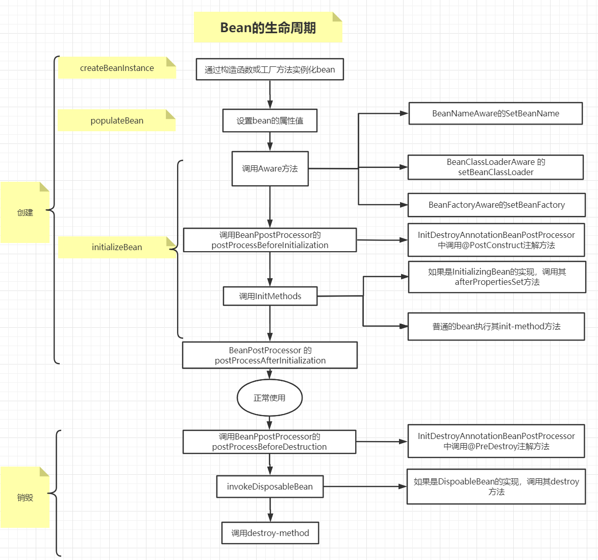
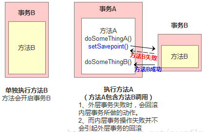

# CSE401 - Spring - Spring Framework

返回[Bulletin](./bulletin.md)

返回[CSE401 - Spring](./CSE401.md)

[TOC]

## Spring

Spring是分层的full-stack（全栈）开源框架，最初版本发布于2002年，以IoC和AOP为内核。

**轻量级 lightweight**

相比过去的Java EE, Spring是轻量的，基本的版本大约2MB。

**一站式 one-stop-shop**

整合了大量框架和工具。Spring对javaEE开发中非常难用的一些API（例如JDBC, javaMail, 远程调用等）都提供了封装，使这些API应用难度大大降低。

### 发展历程

#### Spring 1

在Spring1.x的时代，都是通过xml文件配置bean. 随着项目的不断扩大，需要将xml配置分放到不同的配置文件中，需要频繁的在java类和xml配置文件中切换。

#### Spring 2

随着JDK 1.5带来的注解支持，Spring2.x可以使用注解对Bean进行申明和注入，大大的减少了xml配置文件，同时也大大简化了项目的开发。

一般建议：应用的基本配置用xml（比如数据源、资源文件等）， 业务开发用注解（比如Service中注入bean等）。

#### Spring3

从Spring3.x开始提供了基于Java进行配置的方式，可以完全替代xml配置，可以更好的理解配置的Bean.

支持JDK 5.

#### Spring 4

Spring Framework 4.x支持JDK 6.

#### Spring 5

Spring Framework 5.x支持JDK 8.

- 增加了Spring接口中的默认方法

- 基于Java 8反射增强的内部代码改进

- 在框架代码中使用函数式编程-lambda表达式和stream流

### 模块


**Spring Core模块**

Core模块是Spring的核心类库，Spring的所有功能都依赖于该类库。Core主要用来实现IOC功能，基本上Spring的所有功能都是借助IOC实现的。IOC容器实现了对象的创建、装配、和生命周期的管理。

**AOP模块**

AOP模块是Spring的AOP库，提供了AOP（拦截器）机制，以及可自行配置的常用拦截器。

**ORM模块**

ORM模块提供对常用的ORM框架，例如Hibernate，ibtas，jdao等框架的管理和辅助支持。

Spring本身并不对ORM进行实现，仅对常见的ORM框架进行封装和管理。

**DAO模块**

DAO模块可以执行SQL语句、提供对JDBC的支持。模块并不对JDBC进行实现，而是对JDBC进行封装并允许其使用Spring资源，并统一管理所有JDBC事物。

**WEB模块**

WEB模块提供对常见框架如Struts1，WEBWORK（Struts 2），JSF的支持，能够管理这些框架，将Spring的资源注入给框架，也能在这些框架的前后插入拦截器。

**Context模块**

Context模块提供框架式的Bean访问方式，其他程序可以通过Context访问Spring的Bean资源，相当于资源注入。

**MVC模块**

MVC模块为Spring提供了一套轻量级的MVC实现。相对于Struts，Spring自己的MVC框架更加简洁和方便。

### 优势

**方便解耦，简化开发**

通过Spring提供的IoC容器，可以将对象间的依赖关系交由Spring进⾏控制，避免硬编码所造成的过度程序耦合。⽤户也不必再为单例模式类、属性⽂件解析等这些很底层的需求编写代码，可以更专注于上层的应⽤。

**AOP编程的⽀持**

通过Spring的AOP功能，⽅便进⾏⾯向切⾯的编程，许多不容易⽤传统OOP实现的功能可以通过AOP轻松应付。

**声明式事务的⽀持**

@Transactional可以将我们从单调烦闷的事务管理代码中解脱出来，通过声明式方式灵活的进行事务的管理，提⾼开发效率和质量。

**方便程序的测试**

可以⽤⾮容器依赖的编程⽅式进⾏⼏乎所有的测试⼯作，测试不再是昂贵的操作，⽽是随⼿可做的事情。

**方便集成各种优秀框架**

Spring可以降低各种框架的使⽤难度，提供了对各种优秀框架（Struts、Hibernate、Hessian、Quartz等）的直接⽀持。

**降低JavaEE API的使用难度**

Spring对JavaEE API（如JDBC、JavaMail、远程调用等）进行了薄薄的封装层，使这些API的使用难度⼤为降低。

**源码是经典的Java学习范例**

Spring的源代码设计精妙、结构清晰、匠⼼独⽤，处处体现着⼤师对Java设计模式灵活运用以及对Java技术的⾼深造诣。它的源代码⽆意是Java技术的最佳实践的范例。

我们经常说的Spring其实指的是Spring Framework（spring框架）。

## IoC 控制反转

IoC叫控制反转(Inversion of Control), 是Spring的核心，指的是把传统上由程序代码直接操控的对象的调用权，交给**Spring容器**来控制对象的生命周期和对象间的关系。

### Spring容器

Spring的核心理念就是更方便地管理Java Bean，而被管理的Java Bean存缓存在一个Map中，即IoC容器。

整个bean的生命周期，从创建到使用到销毁的过程全部都是由容器来管理。


### 依赖注入Dependency Injection

是当前比较流行的控制反转Ioc的实现方式之一。将Bean安装在Bean容器中并进行依赖关系配置的过程被称为装配，IoC控制反转就是指的安装这一过程，而DI依赖指的是配置这一过程。Spring可以通过**构造方法注入**（一般用于强依赖）和**setter方法注入**（一般用于可选依赖）两种方式完成依赖注入。


### 工厂类


#### BeanFactory

BeanFactory使用简单工厂模式，是整个Spring IoC容器的根接口，可以理解为含有 Bean 集合的工厂类。作用是管理Bean，包括实例化、定位、配置对象及建立这些对象间的依赖。

BeanFactory实例化后并不会自动实例化 Bean，只有当Bean被使用时才实例化与装配Bean的依赖关系，属于延迟加载，适合多例模式。

#### ApplicationConext

ApplicationConext是BeanFactory的子接口，扩展了BeanFactory的功能：

- 继承MessageSource，因此支持国际化。

- 统一的资源文件访问方式。

- 提供在监听器中注册bean的事件。

- 同时加载多个配置文件。

- 载入多个（有继承关系）上下文 ，使得每一个上下文都专注于一个特定的层次，比如应用的web层。

容器会在初始化时对配置的Bean进行预实例化，Bean的依赖注入在容器初始化时就已经完成，属于立即加载，适合单例模式，一般推荐使用。

##### WebApplicaionContext

使用web.xml进行配置，不用写代码。

```xml
!--从类路径下加载Spring配置文件，classpath特指类路径下加载-->
<context-param>
	<param-name>contextConfigLocation</param-name>
	<param-value>
		classpath:smart-context.xml
	</param-value>
</context-param>
<!--负责启动spring容器的监听器  还可以声明自启动的Servlet   ContextLoaderServlet-->
<listener>
	<listener-class>org.springframework.web.context.ContextLoaderListener</listener-class>
</listener>
```

Spring中提供WebApplicationContextUtils的getWebApplicationContext(ServletContext src)方法来获得WebApplicationContext对象。

```java
public static WebApplicationContext getWebApplicationContext(ServletContext sc) { 
    return getWebApplicationContext(sc, WebApplicationContext.ROOT_WEB_APPLICATION_CONTEXT_ATTRIBUTE);
}
```

##### ClassPathXmlApplicationContext

通过设置classpath目录下的路径进行容器配置。

```java
ApplicationContext context = new ClassPathXmlApplicationContext("application-context.xml");
```

##### FileSystemXmlApplicationContext

通过设置文件地址路径进行容器配置

```java
ApplicationContext context = new FileSystemXmlApplicationContext("/home/user/conf/application-context.xml");
```

#### FactoryBean

FactoryBean是BeanFactory接口的实现，使用了工厂方法模式。

使用BeanFactory创建对象的时候，必须要遵循严格的生命周期流程，太复杂了。如果想要简单的自定义某个对象的创建，同时创建完成的对象想交给Spring来管理，那么就需要实现FactroyBean接口了。

主要方法：

- isSingleton:是否是单例对象
- getObjectType:获取返回对象的类型
- getObject:自定义创建对象的过程(new，反射，动态代理)

### Bean

#### 作用域

当通过Spring容器创建一个Bean实例时，不仅可以完成Bean实例的实例化，还可以通过bean 定义中的scope属性为Bean指定特定的作用域。

Spring为bean提供了6种作用域，其中有4种只在web-aware的ApplicationContext才有用。

##### Singleton

单例模式，在整个Spring IoC容器中，使用singleton定义的Bean将只有一个实例，即使生成多次也返回同一个实例。

如果不指定Bean的作用域，Spring默认使用singleton作用域。

```xml
<bean id="person" name="person" class="com.mashibing.spring.Person" scope="singleton">
```

##### Prototype

原型模式，每次通过容器的getBean方法获取prototype定义的Bean时，都将产生一个新的Bean实例。

Java在创建Java实例时，需要进行内存申请；销毁实例时，需要完成垃圾回收，这些工作都会导致系统开销的增加。因此，prototype作用域Bean的创建、销毁代价比较大。

有状态的bean一般使用Prototype作用域，无状态的一般使用singleton单例作用域。

```xml
<bean id="person" name="person" class="com.mashibing.spring.Person" scope="prototype">
```

##### Request

只有在Web应用中使用Spring时，该作用域才有效。

对于每次HTTP请求，使用request定义的Bean都将产生一个新实例。

##### Session

只有在Web应用中使用Spring时，该作用域才有效。

同一个HTTP Session共享一个实例。

##### Global session

只有在Web应用中使用Spring时，该作用域才有效。

同一个HTTP Session共享一个实例，用于Portlet容器，因为每个portlet有单独的session，而global session提供一个全局性的http session.

##### Application

只有在Web应用中使用Spring时，该作用域才有效。

同一个Web应用共享一个实例。

#### 线程安全

prototype模式下，每次都是新建的实例，可以保证线程安全。

默认的singleton模式下，Spring并没有进行多线程的封装处理，bean无状态的情况下（比如dao类）线程也是安全的，但如果bean有状态的话（比如view, model对象）就不一定保证线程安全了。

#### 内部Bean

当一个bean只能被某一个类使用时，称该bean为内部bean.

### 工作流程


- ResourceLoader从存储介质中加载Spring配置信息，并使用Resource表示这个配置文件的资源。
- BeanDefinitionReader读取Resource所指向的配置文件资源，然后将配置文件中每一个<bean>标签解析成BeanDefinition对象，并保存到BeanDefinitionRegistry中。
  - BeanDefinition描述了一个Bean的实例，具体的属性值包括：
    - Bean指向的类
    - 是否单例
    - 是否懒加载
    - 依赖的bean
    - primary自动装配首选
- 容器扫描BeanDefinitionRegistry中的BeanDefinition，使用Java的反射机制自动识别出实现BeanFactoryPostProcessor接口的Bean，然后调用这些BeanDefinition对象的BeanFactoryPostProcessor进行加工处理，包括：
  - 对<bean>元素标签使用到的占位符进行解析，得到最终的配置值。
  - 通过Java反射机制找出所有实现java.beans.PropertyEditor接口的Bean并自动将它们注册到Spring容器的属性编辑器注册表PropertyEditorRegistry中。
- 注册BeanPostProcessor方便后续对bean对象完成具体的扩展功能。
- Spring容器从BeanDefinitionRegistry中取出加工后的BeanDefinition
  - 使用BeanWrapper对Bean进行封装。BeanWrapper提供了很多以Java反射机制操作Bean的方法，它将结合该Bean的BeanDefinition以及容器中属性编辑器，完成Bean属性的设置工作。
  - 调用InstantiationStrategy着手进行Bean实例化的工作。
- bean对象的初始化过程。生成完整的bean对象后，通过getBean方法可以直接获取。
- 使用完毕后是销毁过程。

主线程

```java
ApplicationContext context = new ClassPathXmlApplicationContext("applicationContext.xml");
```

ClassPathXmlApplicationContext.class

```java
public ClassPathXmlApplicationContext(String configLocation) throws BeansException {
    this(new String[]{configLocation}, true, (ApplicationContext)null);
}
public ClassPathXmlApplicationContext(
    String[] configLocations, boolean refresh, @Nullable ApplicationContext parent)
    throws BeansException {
    // 调用父类的构造方法
    super(parent);
    // 设置配置文件的路径
    setConfigLocations(configLocations);
    if (refresh) {
        // 包括了读取XML文件、创建并初始化Bean等几乎所有ApplicationContext中提供的全部功能
        refresh();
    }
}
```

#### 加载配置

AbstractRefreshableConfigApplicationContext.class

```java
// 支持设置多个配置文件路径
public void setConfigLocations(String... locations) {
    if (locations != null) {
        Assert.noNullElements(locations, "Config locations must not benull");
        this.configLocations = new String[locations.length];
        for(int i = 0; i < locations.length; ++i) {
            this.configLocations[i] = this.resolvePath(locations[i]).trim();
        }
    } else {
        this.configLocations = null;
    }
}
```

#### 启动容器

AbstractApplicationContext.class

```java
// 这个方法标志着IOC容器的正式启动，包括了BeanDefinition和Resource的定位、载入、注册三个基本过程。
@Override
public void refresh() throws BeansException, IllegalStateException {
    
    // 保证容器启动销毁操作的并发安全
	synchronized (this.startupShutdownMonitor) {        
		// 准备工作，包括记录容器的启动时间、标记已启动状态
		prepareRefresh();
        
		// 通知子类刷新内部bean工厂：将配置文件解析成BeanDefinition注册到重建的BeanFactory中，同时还设置两个配置属性：是否允许bean覆盖、是否允许循环引用
		ConfigurableListableBeanFactory beanFactory = obtainFreshBeanFactory();
        
		// 设置BeanFactory的类加载器，添加BeanPostProcessor, 手动注册特殊Bean
		prepareBeanFactory(beanFactory);
        
		try {            
			// 允许实现了BeanFactoryPostProcessor接口的BeanFactory执行BeanFactoryPostProcessor的方法
			postProcessBeanFactory(beanFactory);
            
			// 调用BeanFactoryPostProcessor的各个实现类的BeanFactoryPostProcessor方法，对要创建的Bean进行注册
			invokeBeanFactoryPostProcessors(beanFactory);
            
			// 注册BeanPostProcessor的实现类，BeanPostProcessor将在bean初始化之前和之后执行
			registerBeanPostProcessors(beanFactory);
            
			// 初始化当前ApplicationContext的MessageSource及不同语言的消息体，例如国际化处理
			initMessageSource();
            
			// 初始化当前ApplicationContext的事件多播器
			initApplicationEventMulticaster();
            
			// 在特定ApplicationContext子类中初始化其他特殊Bean
			onRefresh();
            
			// 注册事件监听器，监听器需要实现ApplicationListener接口
			registerListeners();
            
			// 实例化、初始化所有的非懒加载的单例Bean
			finishBeanFactoryInitialization(beanFactory);
            
			// 完成刷新过程，通知生命周期处理器lifecycleProcessor刷新过程，同时发出ContextRefreshEvent通知别人
			finishRefresh();
		}
        
		catch (BeansException ex) {
			// 摧毁已经创建的单例以避免资源浪费
			destroyBeans();
			// 重置'有效'标志
			cancelRefresh(ex);
			// Propagate exception to caller.
			throw ex;
		}
		finally {
			resetCommonCaches();
		}
	}
}
```

#### Bean的生命周期



##### createBeanInstance 实例化

- 调用对象的构造方法或工厂方法实例化对象。实例化后的对象被封装在BeanWrapper对象中，并且此时对象仍然是一个原生的状态，并没有进行依赖注入。 

##### populateBean 填充属性

- 根据BeanDefinition中的信息、通过BeanWrapper提供的设置属性的接口完成依赖注入。

##### initializeBean 初始化

- 调用Aware接口的方法。Aware接口满足了Spring容器创建的bean对象在进行具体操作的时候对于容器内其他对象的需要。
  - BeanNameAware.setBeanName()在创建此bean的bean工厂中设置bean的名称。

  - BeanClassLoaderAware.setBeanClassLoader()

  - BeanFactoryAware.setBeanFactory()回调提供了自己的bean实例工厂。

  - EnvironmentAware.setEnvironment()设置environment在组件使用时调用

  - EmbeddedValueResolverAware.setEmbeddedValueResolver()
    - 这个知道的人可能不多，实现该接口能够获取Spring EL解析器，用户的自定义注解需要支持spel表达式的时候可以使用，非常方便。

  - ResourceLoaderAware.setResourceLoader()

  - ApplicationEventPublisherAware.setApplicationEventPublisher()

  - MessageSourceAware.setMessageSource()
    - 以上三个接口其返回值实质上都是当前的ApplicationContext对象，因为ApplicationContext是一个复合接口。

  - ApplicationContextAware.setApplicationContext()

  - 对于WebApplication还有ServletContextAware.setServletContext()

- 调用BeanPostProcessor.postProcessBeforeInitialization()
  - BeanPostProcessor有很多个，而且每个BeanPostProcessor都影响多个Bean，执行顺序需要根据两个排序相关的接口决定：
    - 首先执行实现PriorityOrdered接口的BeanPostProcessor, 如果有多个则通过接口返回值排序。

    - 其次执行实现Ordered接口的BeanPostProcessor, 如果有多个则通过接口返回值排序。

    - 最后执行其他BeanPostProcessor.

- 如果实现InitializingBean接口，调用InitializingBean.afterPropertiesSet()

- 如果bean使用了init-method声明初始化方法，调用该方法。

**通过XML配置**

```xml
init-method="before"
```

**通过注解配置**

```xml
<context:component-scan base-package="com.mashibing.spring"></context:component-scan> 
```

@PostConstruct相当于init-method, 使用在方法上，当Bean初始化时执行。

- 调用BeanPostProcessor.postProcessBeforeInitialization()

- 注册必要的Destruction相关接口。

##### 就绪

Bean将一直驻留在应用上下文中，直到应用上下文被销毁。

##### 销毁

- 调用BeanPostProcessor.postProcessBeforeDestruction()
- 如果实现DispoableBean接口，调用DispoableBean.destroy()
- 如果bean使用了destroy-method声明初始化方法，调用该方法。

**通过XML配置**

```xml
destroy-method="after"
```

**通过注解配置**

```xml
<context:component-scan base-package="com.mashibing.spring"></context:component-scan>
```

@PreDestroy相当于destory-method，使用在方法上，当Bean销毁时执行。

### 三级缓存

Spring使用**三级缓存**保证在整个容器的运行过程中同名的bean对象只能有一个。

缓存的key类型是字符串；value类型是ObjectFactory, 是一个函数式接口。

**一级缓存** 单例对象的缓存

- 完整对象生成时，调用addSingleton放置。

```java
/** Cache of singleton objects: bean name --> bean instance */
private final Map<String, Object> singletonObjects = new ConcurrentHashMap<String, Object>(256);
```

**二级缓存** 提前曝光的单例对象的缓存

- 从三级缓存确认对象是普通对象/代理对象时，调用getSingleton放置。
- 生成的完整对象放入一级缓存时删除。

```java
/** Cache of early singleton objects: bean name --> bean instance */
private final Map<String, Object> earlySingletonObjects = new HashMap<String, Object>(16);
```

**三级缓存** 单例对象工厂的缓存

- createBeanInstance时，调用addSingletonFactory放置。
- 对应的普通对象/代理对象放入二级缓存时删除。

```java
/** Cache of singleton factories: bean name --> ObjectFactory */
private final Map<String, ObjectFactory<?>> singletonFactories = new HashMap<String, ObjectFactory<?>>(16);
```

我们在创建bean的时候，首先想到的是从缓存中获取这个单例的bean. 以下是过程：

- Spring首先从一级缓存singletonObjects中获取bean. 

- 如果获取不到，并且对象正在创建中，就再从二级缓存earlySingletonObjects中获取。
- 如果还是获取不到且允许一级缓存singletonFactories通过getObject()获取，就从三级缓存singletonFactories中的singletonFactory调用getObject()获取。
  - 如果获取到了则将bean从三级缓存singletonFactories中移除，并放入二级缓存earlySingletonObjects中。其实也就是从三级缓存移动到了二级缓存。

```java
protected Object getSingleton(String beanName, boolean allowEarlyReference) {
    /** allowEarlyReference 是否允许从singletonFactories中通过getObject拿到对象 **/
    Object singletonObject = this.singletonObjects.get(beanName);
    if (singletonObject == null && isSingletonCurrentlyInCreation(beanName)) {
        synchronized (this.singletonObjects) {
            /** isSingletonCurrentlyInCreation()判断当前单例bean是否正在创建中，也就是没有初始化完成
比如A的构造器依赖了B对象所以得先去创建B对象，
或则在A的populateBean过程中依赖了B对象，得先去创建B对象，
这时的A就是处于创建中的状态。**/
            singletonObject = this.earlySingletonObjects.get(beanName);
            if (singletonObject == null && allowEarlyReference) {
                ObjectFactory<?> singletonFactory = this.singletonFactories.get(beanName);
                if (singletonFactory != null) {
                    singletonObject = singletonFactory.getObject();
                    this.earlySingletonObjects.put(beanName, singletonObject);
                    this.singletonFactories.remove(beanName);
                }
            }
        }
    }
    return (singletonObject != NULL_OBJECT ? singletonObject : null);
}
//单例工厂的接口
public interface ObjectFactory<T> {
    T getObject() throws BeansException;
}
//单例工厂的接口在这里被引用
protected void addSingletonFactory(String beanName, ObjectFactory<?> singletonFactory) {
    Assert.notNull(singletonFactory, "Singleton factory must not be null");
    synchronized (this.singletonObjects) {
        if (!this.singletonObjects.containsKey(beanName)) {
            this.singletonFactories.put(beanName, singletonFactory);
            this.earlySingletonObjects.remove(beanName);
            this.registeredSingletons.add(beanName);
        }
    }
}
```

addSingletonFactory这段代码发生在createBeanInstance之后，也就是说单例对象此时已经被调用构造器创建出来，虽然还不完美还没填充依赖属性或者初始化，但是Spring此时已将这个对象**提前曝光**使其能被定位引用。

#### 为什么不能只用一级缓存？

如果将半成品对象和成品对象都混在一级缓存中，那么为了区分他们势必会增加一些而外的标记和逻辑处理，这就会导致对象的创建过程变得复杂化了。将半成品对象与成品对象分开存放，两级缓存各司其职，能够简化对象的创建过程，更简单、直观。

#### 为什么不能只用二级缓存？什么是循环依赖问题？

以A依赖B, B依赖A为例：

- 创建A对象
- 填充A对象，此时A对象中的b属性为空，填充属性b, 从容器中查找B对象。
  - 如果找到了
    - 直接赋值，不存在循环依赖问题。
  - 如果找不到
    - 创建B对象
    - 实例化B对象，此时B对象中的a属性为空，填充属性a, 从容器中查找A对象。
      - 如果没有三级缓存，循环依赖会无尽循环下去，抛出相关异常。
      - 为了处理**循环依赖**问题，Spring引入三级缓存来存放循环依赖时创建的代理对象，保证在整个容器的运行过程中同名的bean对象只能有一个。此时会发现A对象是存在的，只不过A对象只完成了实例化但是未完成初始化，是被提前曝光的，不是一个完整的状态。

因此，所有的bean对象在创建的时候都要优先放到三级缓存中，在后续的使用过程中，如果需要被代理则返回代理对象，如果不需要被代理，则直接返回普通对象

##### 单例 + setter循环依赖

```xml
<bean id="A" class="com.mashibing.spring.A" scope="singleton">
    <property name="b" ref="B"/>
</bean>
<bean id="B" class="com.mashibing.spring.B" scope="singleton">
    <property name="c" ref="C"/>
</bean>
<bean id="C" class="com.mashibing.spring.C" scope="singleton">
    <property name="a" ref="A"/>
</bean>
```

由于三级缓存提前暴露代理对象，创建循环依赖的bean时**不报错**。

##### 单例 + 构造器循环依赖

```xml
<bean id="A" class="com.mashibing.spring.A">
    <constructor-arg name="b" ref="B"/>
</bean>
<bean id="B" class="com.mashibing.spring.B">
    <constructor-arg name="c" ref="C"/>
</bean>
<bean id="C" class="com.mashibing.spring.C">
    <constructor-arg name="a" ref="A"/>
</bean>
```

由于加入singletonFactories三级缓存的前提是执行了构造器，所以构造器的循环依赖没法解决。如果在创建Bean过程中发现bean已经在“一级缓存”里时将抛出BeanCurrentlyInCreationException异常，表示循环依赖。

##### 原型循环依赖

Spring容器不缓存原型Bean, 无法使用三级缓存提前暴露，因此Spring容器无法完成依赖注入。

```xml
<bean id="A" class="com.mashibing.spring.A" scope="prototype">
    <property name="b" ref="B"/>
</bean>
<bean id="B" class="com.mashibing.spring.B" scope="prototype">
    <property name="c" ref="C"/>
</bean>
<bean id="C" class="com.mashibing.spring.C" scope="prototype">
    <property name="a" ref="A"/>
</bean>
```

## AOP 面向切面编程


AOP（Aspect-Oriented Programming）面向切面编程，指通过动态代理，在不关注被代理类的类型、不改变被代理类逻辑的情况下，在运行时动态地将代码切入到类里。

### 过程

- AOP本身是一个扩展功能，在创建对象时的BeanPostProcessor的后置处理方法中来进行实现。
- 通过jdk或者cglib的方式来生成代理对象。
- 在执行方法调用的时候，会调用到生成的字节码文件中，直接找到DynamicAdvisoredInterceptor类中的intercept方法，从此方法开始执行。
- 根据之前定义好的通知来生成拦截器链，从拦截器链的-1位置依次获取每一个通知开始进行执行。

### 优点

- 代码重用
- 业务逻辑与非业务逻辑的解耦分离

### 相关术语


#### Aspect 切面

切面是对横切关注点的抽象，例如日志、安全、事务等功能，这个关注点可能会横切多个对象。

#### Joinpoint 横切关注点

程序执行过程中的某一行为，即业务层中的所有方法。

#### Advice 连接点

指切面对于某个连接点所产生的动作，包括前置通知、后置通知、返回后通知、异常通知和环绕通知。

#### Pointcut 切入点

指被拦截的连接点，切入点一定是连接点，但连接点不一定是切入点。

#### Proxy 代理

Spring AOP 中有 JDK 动态代理和 CGLib 代理，目标对象实现了接口时采用 JDK 动态代理，反之采用 CGLib 代理。

#### Target 代理的目标对象

指一个或多个切面所通知的对象。

#### Weaving 织入

指把增强应用到目标对象来创建代理对象的过程。

## 事务

事务管理就是“按照给定的事务规则来执行提交或者回滚操作”。

### 提交与回滚

Spring的事务是由AOP来实现的。首先要生成具体的代理对象，然后按照AOP的整套流程来执行具体的操作逻辑，但通常不是通过通知来实现事务的核心功能的，而是通过TransactionInterceptor调用invoke来实现具体的逻辑。

#### 具体步骤

先做准备工作，解析各个方法上事务相关的属性，根据具体的属性来判断是否开始新事务。

当需要开启的时候，获取数据库连接，关闭自动提交功能，开启事务。

执行具体的sql逻辑操作。

- 如果执行失败了，那么会通过completeTransactionAfterThrowing看来完成事务的回滚操作，回滚的具体逻辑是通过doRollBack方法来实现的，实现的时候也是要先获取连接对象，通过连接对象来回滚。

- 如果执行过程中，没有任何意外情况的发生，那么通过commitTransactionAfterReturning来完成事务的提交操作，提交的具体逻辑是通过doCommit方法来实现的，实现的时候也是要获取连接，通过连接对象来提交。

当事务执行完毕之后需要清除相关的事务信息，调用cleanupTransactionInfo方法。

#### 回滚失败的情况

**默认情况下出现RuntimeException或Error时才回滚**

设置@Transactional(rollbackFor = XXXException.class)

**异常没有从标注@Transactional注解的方法抛出**

注意避免catch住异常，或者通过TransacrionAspectSupport.currentTransactionStatus().setRollbackOnly()手动回滚。

### 相关接口

#### PlatformTransactionManager （平台）事务管理器

Spring并不直接管理事务，而是提供了多种事务管理器 ，他们将事务管理的职责委托给Hibernate或者JTA等持久化机制所提供的相关平台框架的事务来实现。

Spring事务管理器的接口是： org.springframework.transaction.PlatformTransactionManager, 通过这个接口，Spring为各个平台如JDBC、Hibernate等都提供了对应的事务管理器，但是具体的实现就是各个平台自己的事情了。

配置方式如下：

```java
@Bean
public PlatformTransactionManager transactionManager(DataSource dataSource) {
    return new DataSourceTransactionManager(dataSource);
}
```

#### TransactionDefinition 事务定义信息

事务管理器接口 PlatformTransactionManager 通过 getTransaction(TransactionDefinition definition) 方法来得到一个事务，这个方法里面的参数是 TransactionDefinition 类 ，这个类就定义了一些基本的事务属性：

- 事务隔离级别（定义了一个事务可能受其他并发事务影响的程度）

- 事务传播行为（为了解决业务层方法之间互相调用的事务问题）

- 事务超时属性(一个事务允许执行的最长时间)

- 事务只读属性（对事物资源是否执行只读操作）

- 回滚规则（定义事务回滚规则）

#### TransactionStatus 事务运行状态

PlatformTransactionManager.getTransaction(…) 方法返回一个 TransactionStatus 对象，代表了一个新的或已经存在的事务（如果在当前调用堆栈有一个符合条件的事务）。

TransactionStatus接口定义了一组方法用来获取或判断事务的相应状态信息。

### 失效的情况

情况1：MySQL存储引擎不支持事务。

情况2：数据源没有配置事务管理器。

情况3：执行方法的类没有被Spring管理，比如没加XML配置或者注解。

情况4：Spring的声明式事务是基于代理模式的，@Transactional注解在执行继承时不能重写private, final和static方法，无法直接添加spring的事务管理功能。可以通过开启AspectJ代理模式重写以上方法。

情况5：传播类型不支持事务。

情况6：异常被吃了。

情况7：抛出的异常和事务注解定义的异常不一致。

情况8：this自调用方法不走Spring的代理类，所以无法生效事务。除非重新注入当前类，否则需要确保事务性方法从外部通过代理类调用。

### 传播行为

**事务传播行为**指的就是当一个事务方法被另一个事务方法调用时，这个事务方法应该如何进行。 

例如：methodA事务方法调用methodB事务方法时，methodB是继续在调用者methodA的事务中运行呢，还是为自己开启一个新事务运行，这就是由methodB的事务传播行为决定的。


#### Propagation_MANDATORY

```java
@Transactional(propagation = Propagation.MANDATORY)
```

如果不在事务中运行，则抛异常。


#### Propagation_NEVER

```java
@Transactional(propagation = Propagation.NEVER)
```

如果在事务中运行，则抛异常。

#### Propagation_NOT_SUPPORTED

```java
@Transactional(propagation = Propagation.NOT_SUPPOTED)
```

如果在事务中运行，则挂起当前事务。


#### Propagation_SUPPORTS

```java
@Transactional(propagation = Propagation.SUPPORTS)
```

既可以在其他事务中运行，也可以在非事务中运行。

#### Propagation_REQUIRED

```java
@Transactional(propagation = Propagation.REQUIRED)
```

如果存在一个事务，则支持当前事务。如果没有事务则开启一个新的事务。

内部事务会影响外部事务。如果内部事务回滚，会导致外部事务一并回滚。

默认事务传播策略是REQUIRED.


#### Propagation_NESTED

@Transactional(propagation = Propagation.NESTED)

如果存在一个事务，则支持当前事务。如果没有事务则开启一个新的事务。

内部事务不会影响外部事务。如果内部事务回滚，外部事务会回滚到调用内部事务之前的存档点。

因为NESTED内外是同一个事务，所以外层事务可以控制内层事务的回滚。



#### Propagation_REQUIRES_NEW

@Transactional(propagation = Propagation.REQUIRES_NEW)

挂起当前事务，开启新的事务。

因为REQUIRES_NEW内外不是同一个事务，所以外层事务不可以控制内层事务的回滚。


## 类型

类型，即Class、泛型数组、参数类型、参数类型等。

### Type

java.lang.reflect.Type，java中对所有类型的顶层抽象。

```java
public interface Type {  
    default String getTypeName() {
        return toString();
    }
}

//泛型数组，形如Class<? extends T>[], T[], List<String>[]
public interface GenericArrayType extends Type {
    // 数组对应的 Type
    Type getGenericComponentType();
}

//泛型参数，比如Class<? extends T> T, List<String>
public interface ParameterizedType extends Type {
  	// 获取参数的实际 Type 
    Type[] getActualTypeArguments();
    // 当前 Type 的实际类型，class 或者 interface
    Type getRawType();
	// 当前 Type 的所属 Type
    Type getOwnerType();
}

//表达式泛型，比如? extends T, T super Class & Type
public interface WildcardType extends Type {
    // 上界（extends）
    Type[] getUpperBounds();
   // 下界（Super）
    Type[] getLowerBounds();
}

//泛型变量，比如? extends T中的T
public interface TypeVariable<D extends GenericDeclaration> extends Type, AnnotatedElement {
	// 范型变量上界（未指明则为 Object)
    Type[] getBounds();
	// 声明该变量的类型
    D getGenericDeclaration();
    String getName();
    // 未知
    AnnotatedType[] getAnnotatedBounds();
}
```

### ResolvableType

org.springframework.core.ResolvableType, Spring对Type 的封装，Spring内部大量借助此类来访问Type属性，包括泛型等。以下代码为例：

```java
public class TestResolverType {

    class Sample<T> {

        List<? super T> list;

        private HashMap<Integer, List<String>> myMap;

        @Bean
        public T a(int a, T t) {

            return  null;
        }
    }

    @Test
    public void test1() throws NoSuchFieldException {
        ResolvableType t1 =
                ResolvableType.forType(Sample.class);
        handleGenerics(t1);

        ResolvableType t2 = ResolvableType.forField(
               Sample.class.getDeclaredField("list")
        );
        handleGenerics(t2);

        ResolvableType t3 = ResolvableType.forField(
                Sample.class.getDeclaredField("myMap")
        );
        handleGenerics(t3);

    }

    private void handleGenerics(ResolvableType t) {
        System.out.println(t.getType().getTypeName() + ":");

        System.out.println("    getRawClass = " + t.getRawClass());
        System.out.println("    getClass = " + t.getClass());
        System.out.println("    getSource = " + t.getSource());
        System.out.println("    getSuperType = " + t.getSuperType());

        System.out.println("    asMap = " + t.asMap());
        System.out.println("    asCollection = " + t.asCollection());

        System.out.println("    getGeneric(0).resolve() = " + t.getGeneric(0).resolve());
        System.out.println("    getGeneric(1).resolve() = " + t.getGeneric(1).resolve());
        System.out.println("    getGeneric(0) = " + t.getGeneric(0));
        System.out.println("    resolveGeneric(0, 1) = " + t.resolveGeneric(0, 1));
    }
}
```

```
com.xsn.type.TestResolverType$Sample:
    getRawClass = class com.xsn.type.TestResolverType$Sample
    getClass = class org.springframework.core.ResolvableType
    getSource = class com.xsn.type.TestResolverType$Sample
    getSuperType = java.lang.Object
    asMap = ?
    asCollection = ?
    getGeneric(0).resolve() = null
    getGeneric(1).resolve() = null
    getGeneric(0) = ?
    resolveGeneric(0, 1) = null
java.util.List<? super T>:
    getRawClass = interface java.util.List
    getClass = class org.springframework.core.ResolvableType
    getSource = java.util.List com.xsn.type.TestResolverType$Sample.list
    getSuperType = ?
    asMap = ?
    asCollection = java.util.Collection<?>
    getGeneric(0).resolve() = null
    getGeneric(1).resolve() = null
    getGeneric(0) = ?
    resolveGeneric(0, 1) = null
java.util.HashMap<java.lang.Integer, java.util.List<java.lang.String>>:
    getRawClass = class java.util.HashMap
    getClass = class org.springframework.core.ResolvableType
    getSource = private java.util.HashMap com.xsn.type.TestResolverType$Sample.myMap
    getSuperType = java.util.AbstractMap<java.lang.Integer, java.util.List<java.lang.String>>
    asMap = java.util.Map<java.lang.Integer, java.util.List<java.lang.String>>
    asCollection = ?
    getGeneric(0).resolve() = class java.lang.Integer
    getGeneric(1).resolve() = interface java.util.List
    getGeneric(0) = java.lang.Integer
    resolveGeneric(0, 1) = null
```

## 事件

### EventObject

```java
//由JDK定义的事件类
public class EventObject implements java.io.Serializable {
    private static final long serialVersionUID = 5516075349620653480L;
    protected transient Object source; //事件源
    public EventObject(Object source) {
        if (source == null)
            throw new IllegalArgumentException("null source");

        this.source = source;
    }
    public Object getSource() {
        return source;
    }
    public String toString() {
        return getClass().getName() + "[source=" + source + "]";
    }
}
```

#### ApplicationEvent

```java
//Spring定义的事件类，继承了EventObject, 拓展了timestamp属性记录事件发生的时间
public abstract class ApplicationEvent extends EventObject {
	private static final long serialVersionUID = 7099057708183571937L;
	private final long timestamp; //事件发生的时间戳
	public ApplicationEvent(Object source) {
		super(source);
		this.timestamp = System.currentTimeMillis();
	}
	public final long getTimestamp() {
		return this.timestamp;
	}
}
```

##### ApplicationContextEvent

```java
//Spring容器事件的抽象基类，相当于在ApplicationEvent上包装了一层
public abstract class ApplicationContextEvent extends ApplicationEvent {
	public ApplicationContextEvent(ApplicationContext source) {
		super(source);
	}
	public final ApplicationContext getApplicationContext() {
		return (ApplicationContext) getSource();
	}
}
```

其子类即具体的容器生命周期事件，包括：

- ContextClosedEvent
- ContextRefreshedEvent
- ContextStoppedEvent
- ContextStartedEvent

SpringBoot工程的话基于监听器做了很多拓展，会看到很多事件。

### EventListener

```java
//JDK定义的事件监听标记接口
public interface EventListener {
}
```

#### ApplicationListener

```java
//Spring定义的针对ApplicationEvent的监听器，是一个函数式接口
@FunctionalInterface
public interface ApplicationListener<E extends ApplicationEvent> extends EventListener {
	// 对目标事件的处理逻辑
	void onApplicationEvent(E event);
}
```

##### SmartApplicationListener

```java
//SmartApplicationListener继承了ApplicationListener, 提供对事件类型（基于Class）和事件源类型（基于Class）的匹配
public interface SmartApplicationListener extends ApplicationListener<ApplicationEvent>, Ordered {
	// 是否支持指定 事件类型（Class）
	boolean supportsEventType(Class<? extends ApplicationEvent> eventType);
	// 是否支持指定 事件源类型（Class），默认 true
	default boolean supportsSourceType(@Nullable Class<?> sourceType) {
		return true;
	}
	@Override
	// 优先级，默认最低
	default int getOrder() {
		return LOWEST_PRECEDENCE;
	}
}
```

##### GenericApplicationListener

```java
//GenericApplicationListener继承了ApplicationListener, 提供对事件类型（基于ResolvableType）和事件源类型（基于Class）的匹配
public interface GenericApplicationListener extends ApplicationListener<ApplicationEvent>, Ordered {
	// 是否支持指定 事件类型（Class）
	boolean supportsEventType(ResolvableType eventType);
	// 是否支持指定 事件源类型（Class），默认 true
	default boolean supportsSourceType(@Nullable Class<?> sourceType) {
		return true;
	}
	@Override
	// 优先级，默认最低
	default int getOrder() {
		return LOWEST_PRECEDENCE;
	}
}
```

##### GenericApplicationListenerAdapter

SmartApplicationListener和GenericApplicationListener的适配器，即通过Class和ResolvableType的转换将两者连接起来。

### ApplicationEventMulticaster

```java
//事件组播顶层接口
//它是一个事件发布类，提供事件发布方法multicastEvent
//同时也是一个监听器管理类，提供监听器的注册、移除相关方法
public interface ApplicationEventMulticaster {
	// 监听器添加
	void addApplicationListener(ApplicationListener<?> listener);
	// 监听器 beanName 添加
	void addApplicationListenerBean(String listenerBeanName);
	// 监听器移除
	void removeApplicationListener(ApplicationListener<?> listener);
	// 监听器 beanName 移除
	void removeApplicationListenerBean(String listenerBeanName);
	// 移除所有监听器
	void removeAllListeners();
	// 事件发布
	void multicastEvent(ApplicationEvent event);
	// 指定类型的事件发布
	void multicastEvent(ApplicationEvent event, @Nullable ResolvableType eventType);
}
```

#### AbstractApplicationEventMulticaster

ApplicationEventMulticaster的核心抽象类，主要实现了**监听器管理**的相关方法，它的实现也是比较经典的Spring式实现，在Spring很常用且很实用。

所有的监听器的注册和移除操作是由内部类DefaultListenerRetriever来负责管理的。addApplicationListener方法直接注册对应的监听器，addApplicationListenerBean方法注册一个监听器的beanName.

需要时直接从容器获取监听器。基于缓存实现，可以高效地管理比较复杂的内部对象。

##### SimpleApplicationEventMulticaster

AbstractApplicationEventMulticaster的实现类，主要实现**事件发布**的方法。

它的主要逻辑简单清晰，根据事件源和事件类型获取对应的监听器，回调它的方法。

它支持基于多线程的调用，只要初始化时传入自行构造的线程池即可，如果不传则默认当前线程发布事件。

## Spring中的设计模式

单例模式：bean默认都是单例的

原型模式：指定作用域为prototype

工厂模式：BeanFactory

模板方法：postProcessBeanFactory, onRefresh, initPropertyValue

策略模式：XmlBeanDefinitionReader, PropertiesBeanDefinitionReader

观察者模式：listener, event, multicast

适配器模式：Adapter

装饰者模式：BeanWrapper

责任链模式：使用aop的时候会先生成一个拦截器链

代理模式：动态代理

委托者模式：delegate

## Spring实战

### 创建标准工程

按照惯例新建libs目录，引入以下jar包：

- commons-lang3-3.11.jar

- commons-logging-1.2.jar

- spring-beans-5.2.3.RELEASE.jar

- spring-context-5.2.3.RELEASE.jar

- spring-core-5.2.3.RELEASE.jar

- spring-expression-5.2.3.RELEASE.jar

准备Spring上下文配置文件src/applicationContext.xml

### 创建Maven工程

在左侧Package Explorer点击右键，新建Maven工程。

生成的pom.xml如下所示

```xml
<project xmlns="http://maven.apache.org/POM/4.0.0" xmlns:xsi="http://www.w3.org/2001/XMLSchema-instance" xsi:schemaLocation="http://maven.apache.org/POM/4.0.0 https://maven.apache.org/xsd/maven-4.0.0.xsd">
  <modelVersion>4.0.0</modelVersion>
  <groupId>com.mashibing.spring</groupId>
  <artifactId>Spring01</artifactId>
  <version>0.0.1-SNAPSHOT</version>
  <name>spring stu</name>
</project>
```

登录[https://mvnrepository.com/artifact/org.springframework/](https://mvnrepository.com/artifact/org.springframework/spring-context) 

复制Maven下spring context和spring-core等依赖的xml dependency配置信息，到dependencies标签下。

```xml
<project xmlns="http://maven.apache.org/POM/4.0.0" xmlns:xsi="http://www.w3.org/2001/XMLSchema-instance" xsi:schemaLocation="http://maven.apache.org/POM/4.0.0 https://maven.apache.org/xsd/maven-4.0.0.xsd">
  <modelVersion>4.0.0</modelVersion>
  <groupId>com.mashibing.spring</groupId>
  <artifactId>Spring01</artifactId>
  <version>0.0.1-SNAPSHOT</version>
  <name>spring stu</name>
  
  <dependencies>
  
    <!-- https://mvnrepository.com/artifact/org.springframework/spring-context -->
    <dependency>
      <groupId>org.springframework</groupId>
      <artifactId>spring-context</artifactId>
      <version>5.3.2</version>
    </dependency>

    <!-- https://mvnrepository.com/artifact/org.springframework/spring-context -->
    <dependency>
      <groupId>org.springframework</groupId>
      <artifactId>spring-core</artifactId>
      <version>5.3.2</version>
    </dependency>
  </dependencies>
  
</project>
```

准备Spring上下文配置文件src/main/resources/applicationContext.xml

### 使用XML配置文件装配

```java
public class Person {
    private String name;
    private int age;
    private Food food;
    public Person(String name, Integer age, Food food) {
        super();
        this.name = name;
        this.age = age;
        this.food = food;
}
class Food {}
```

在application-context.xml配置文件中实现依赖注入，包括：基本类型（int, String等）、集合、Bean、配置文件等。

使用**constructor-arg**标签进行构造方法注入

```xml
<bean id="person" class="com.mashibing.spring.Person">
    <constructor-arg name ="name" value="maxiaosan"></constructor-arg>
    <constructor-arg name ="age" value="18"></constructor-arg>
    <constructor-arg name ="food" ref="food"></constructor-arg>
</bean>
<bean id="food" class="com.mashibing.spring.Food"></bean>
```

此时可以调试配置好的bean

```java
public static void main(String[] args) {
    ClassPathXmlApplicationContext ctx = 
        new ClassPathXmlApplicationContext("applicationContext.xml");
    Person person = (Person)ctx.getBean("person");
    System.out.println(ToStringBuilder.reflectionToString(person));
}
```

```bash
com.mashibing.spring.Person@5c671d7f[age=12,food=com.mashibing.spring.Food@3098cf3b,name=ZhangSan]
```

使用**c-namespace**注入构造方法

```xml
<beans xmlns:c=http://www.springframework.org/schema/c>
	<bean id="person" class="com.mashibing.spring.Person" c:name="zhangsan" c:age="18" c:food-ref="food"/>
</beans>
```

使用**property**标签进行setter注入

```xml
<bean id="person" name="person" class="com.mashibing.spring.Person">
    <property name ="name" value="maxiaosan"></property>
    <property name ="age" value="18"></property>
    <property name ="food" ref="food"></property>
</bean>
```

此时可以调试配置好的bean

```java
public static void main(String[] args) { 
    ClassPathXmlApplicationContext ctx = 
        new ClassPathXmlApplicationContext("applicationContext.xml");
    Person person = (Person)ctx.getBean("person");
    System.out.println(ToStringBuilder.reflectionToString(person));
}
```

```bash
com.mashibing.spring.Person@48974e45[age=18,food=com.mashibing.spring.Food@d29f28,name=maxiaosan]
```

使用**p-namespace**注入setter方法

```xml
<beans xmlns:p=http://www.springframework.org/schema/p>
	<bean id="person" class="com.mashibing.spring.Person" p:name="zhangsan" p:age="18" p:food-ref="food"/>
</beans>
```

**name**可以配置多个

**alias**可以为对象设置别名 等同于name

```xml
<bean id="person" name="human,star" class="com.mashibing.spring.Person">
    <constructor-arg name ="name" value="maxiaosan"></constructor-arg>
    <constructor-arg name ="age" value="18"></constructor-arg>
    <constructor-arg name ="food" ref="food"></constructor-arg>
</bean>
<bean id="food" class="com.mashibing.spring.Food"></bean>
<alias name="person" alias="person2"/>
```

可以使用**index**字段规定构造方法注入使用的不同位置的参数及其对应的值

```xml
<bean id="person" name="human,star" class="com.mashibing.spring.Person">
    <constructor-arg index="0" value="maxiaosan"></constructor-arg>
    <constructor-arg index="1" value="18"></constructor-arg>
    <constructor-arg index="2" ref="food"></constructor-arg>
</bean>
<bean id="food" class="com.mashibing.spring.Food"></bean>
```

可以使用**type**字段规定构造方法注入使用的不同类型的参数及其对应的值

```xml
<bean id="person" name="human,star" class="com.mashibing.spring.Person">
    <constructor-arg name ="name" type="java.lang.String" value="maxiaosan"></constructor-arg>
    <constructor-arg name ="age" type="java.lang.Integer" value="18"></constructor-arg>
    <constructor-arg name ="food"  type="com.mashibing.spring.Food" ref="food"></constructor-arg>
</bean>
<bean id="food" class="com.mashibing.spring.Food"></bean>
```

可以使用**map**标签定义Map类参数及其拥有的键值对

可以使用**list**标签定义List类参数及其拥有的值

可以使用**set**标签定义Set类参数及其拥有的值

```xml
<bean id="cC" name="cC" class="com.mashibing.spring.CollectionContainer">
    <constructor-arg name ="map">
        <map>
            <entry key="key" value="value"/>
        </map>
    </constructor-arg>
    <constructor-arg name ="list">
        <list>
            <value>100</value>
        </list>
    </constructor-arg>
    <constructor-arg name ="set">
        <set>
            <value>STR</value>
        </set>
    </constructor-arg>
</bean>
```

使用工厂

```xml
<bean id="carFactory" class="com.mashibing.spring.CarFactory">
    <property name="name" value="audi"/>
</bean>
<bean id="car" factory-bean="carFactory" factory-method="getCar"></bean>
```

```java
Car car = ctx.getBean("car", Car.class);
System.out.println(car.getName());
```

Spring启动的时候会把所有bean信息(包括XML和注解)解析转化成Spring能够识别的BeanDefinition, 存到Hashmap⾥供下⾯的初始化时⽤，然后对每个BeanDefinition 进⾏处理，在容器初始化阶段进行初始化并依赖注⼊。

普通Bean的初始化是在容器启动初始化阶段执⾏的，但是被lazy-init=*"true"*修饰的懒加载的bean, 在容器初始化阶段不处理，而是在容器第⼀次进行context.getBean()时被触发。

```xml
<bean id="person2" class="com.mashibing.spring.Person2" lazy-init="true">…</bean>
<beans default-lazy-init="true">
<!-- no beans will be eagerly pre-instantiated... -->
</beans>
```

#### 自动装配

自动装配（Auto-wiring）适合解决依赖很多的添加依赖的问题，具有多种类型：

**byName** 根据Bean名称

```xml
<bean id="a" class="com.mashibing.spring.A" autowire="byName"></bean>
<bean id="b" class="com.mashibing.spring.B" autowire="byName"></bean>
<bean id="c" class="com.mashibing.spring.C" autowire="byName"></bean>
```

```java
A a = (A)ctx.getBean("a");
B b = (B)ctx.getBean("b");
C c = (C)ctx.getBean("c");
System.out.println(ToStringBuilder.reflectionToString(a));
System.out.println(ToStringBuilder.reflectionToString(b));
System.out.println(ToStringBuilder.reflectionToString(c));
```

通过调试可以发现a,b,c均已被按照名称装配

```bash
com.mashibing.spring.A@53976f5c[b=com.mashibing.spring.B@732c2a62]
com.mashibing.spring.B@732c2a62[c=com.mashibing.spring.C@5ace1ed4]
com.mashibing.spring.C@5ace1ed4[a=com.mashibing.spring.A@53976f5c]
```

**byType** 根据Bean类型

只要类型一致即可实现装配，不用保持名称对应。如果有两个或以上匹配就会报错。

```xml
<beans default-autowire="byType"/>
```

或

```xml
<bean id="A" class="com.mashibing.spring.A" autowire="byType"></bean>
<bean id="B" class="com.mashibing.spring.B" autowire="byType"></bean>
<bean id="C" class="com.mashibing.spring.C" autowire="byType"></bean>
```

```java
A a = (A)ctx.getBean("a");
B b = (B)ctx.getBean("b");
C c = (C)ctx.getBean("c");
System.out.println(ToStringBuilder.reflectionToString(a));
System.out.println(ToStringBuilder.reflectionToString(b));
System.out.println(ToStringBuilder.reflectionToString(c));
```

通过调试可以发现a,b,c均已被按照名称装配

```bash
com.mashibing.spring.A@272ed83b[b=com.mashibing.spring.B@6631f5ca]
com.mashibing.spring.B@6631f5ca[c=com.mashibing.spring.C@1b6e1eff]
com.mashibing.spring.C@1b6e1eff[a=com.mashibing.spring.A@272ed83b]
```

**constructor** 构造函数，根据类型

```xml
<bean id="A" class="com.mashibing.spring.A" autowire="constructor"></bean>
<bean id="B" class="com.mashibing.spring.B" autowire="constructor"></bean>
<bean id="C" class="com.mashibing.spring.C" autowire="constructor"></bean>
```

```java
A a = (A)ctx.getBean("A");
B b = (B)ctx.getBean("B");
C c = (C)ctx.getBean("C");
System.out.println(ToStringBuilder.reflectionToString(a));
System.out.println(ToStringBuilder.reflectionToString(b));
System.out.println(ToStringBuilder.reflectionToString(c));
```

通过调试可以发现a,b,c均已被按照名称装配

```bash
com.mashibing.spring.A@1ba9117e[b=com.mashibing.spring.B@2accdbb5]
com.mashibing.spring.B@2accdbb5[c=com.mashibing.spring.C@1cbb87f3]
com.mashibing.spring.C@1cbb87f3[a=<null>]
```

#### AOP

```xml
<beans xmlns:aop="http://www.springframework.org/schema/aop"
xsi:schemaLocation="http://www.springframework.org/schema/aop http://www.springframework.org/schema/aop/spring-aop.xsd">
    <bean id="loggingBean" class="com.github.ltprc.spring.aop.LoggingBean"></bean>
    <bean id="loggedBean" class="com.github.ltprc.spring.aop.LoggedBean"></bean>
    <aop:config>
        <!-- 切面 -->
        <aop:aspect id="loggingAspect" ref="loggingBean">
	        <!-- 切点 -->
	        <aop:pointcut id="pointcut1" expression="execution(* com.github.ltprc.spring.aop.**.*(..))"></aop:pointcut>
            <!-- 连接通知方法与切点 -->
            <aop:before method="before" pointcut-ref="pointcut1"/>
            <aop:after method="after" pointcut-ref="pointcut1"/>
            <aop:after-returning method="afterReturning" pointcut-ref="pointcut1"/>
            <aop:after-throwing method="afterThrowing" pointcut-ref="pointcut1"/>
            <aop:around method="around" pointcut-ref="pointcut1"/>
        </aop:aspect>
	</aop:config>
</beans>
```

```java
public class LoggingBean {
    public void before() {
        System.out.println("====before====");
    }
    public void after() {
        System.out.println("====after====");
    }
    public void afterReturning() {
        System.out.println("====afterReturning====");
    }
    public void afterThrowing() {
        System.out.println("====afterThrowing====");
    }
    public void around() {
        System.out.println("====around====");
    }
}
public class LoggedBean {
    public void whatever() {
        System.out.println("whatever");
    }
    public static void main(String[] args) {
        ClassPathXmlApplicationContext ctx = 
            new ClassPathXmlApplicationContext("applicationContextAop.xml");
        LoggedBean loggedBean = (LoggedBean)ctx.getBean("loggedBean");
        loggedBean.whatever();
    }
}
```

> ====before====
>
> ====around====
>
> ====afterReturning====
>
> ====after====

"around"替代了"whatever"

### 使用注解装配

使用**@Component**（或其他注解）将普通Java类配置成SpringBean.

**@Repository**, **@Service**, **@Controller**就是针对不同的使用场景所采取的特定功能化的注解组件。

```java
/**
 * 处理具体业务逻辑
 * 比如，校验账号密码是否正确
 * @author tuoli
 *
 */
//@Component 注册bean 相当于<bean id=""
@Component
public class MainService {
    public User login(String login, String password) {
        System.err.println("Service 接到请求，开始处理");
        return new User();
    }
}
```

修改配置文件，加入context:component-scan标签以支持注解

```xml
<context:component-scan base-package="com.mashibing.spring"></context:component-scan>
```

使用**@Scope**注解确定bean的作用域

使用**@Value**注入简单依赖

```java
@Component
@Scope("prototype")
public class User {
    @Value("zhangfg")
    private String loginName;
    @Value("123456")
    private String password;
}
```

#### 自动装配

使用**@Autowired**或**@Resource**等其他注解使Spring满足Bean的依赖，无需定义或调用setter方法。

@Autowired属于Spring注解；@Resource属于J2EE注解，减少了与spring的耦合。

@Autowired与@Resource都可以写在字段或setter方法上。

@Autowired默认按类型装配，默认情况下必须要求依赖对象必须存在，如果要允许null值，可以设置它的required属性为false，如：@Autowired(required=false) ，如果我们想使用名称装配可以结合@Qualifier注解进行使用，如下：

```java
@Autowired() @Qualifier("baseDao")
private BaseDao baseDao;
```

@Resource装配规则如下：

     　　1. 如果同时指定了name和type，则从Spring上下文中找到唯一匹配的bean进行装配，找不到则抛出异常
  　　2. 如果指定了name，则从上下文中查找名称（id）匹配的bean进行装配，找不到则抛出异常
          　　3. 如果指定了type，则从上下文中找到类型匹配的唯一bean进行装配，找不到或者找到多个，都会抛出异常
            　　4. 如果既没有指定name，又没有指定type，则自动按照byName方式进行装配；如果没有匹配，则回退为一个原始类型进行匹配，如果匹配则自动装配。

```java
@Resource (name="baseDao")
private BaseDao baseDao;
```

#### AOP

```xml
<beans xmlns:aop="http://www.springframework.org/schema/aop"
xsi:schemaLocation="http://www.springframework.org/schema/aop http://www.springframework.org/schema/aop/spring-aop.xsd">
    <bean id="loggingBeanByAnnotation" class="com.github.ltprc.spring.aop.LoggingBeanByAnnotation"></bean>
    <bean id="loggedBeanByAnnotation" class="com.github.ltprc.spring.aop.LoggedBeanByAnnotation"></bean>
    <aop:aspectj-autoproxy></aop:aspectj-autoproxy>
</beans>
```

```java
@Component
@Aspect
public class LoggingBeanByAnnotation {
    @Before("execution(* com.github.ltprc.spring.aop.**.*(..))")
    public void before() {
        System.out.println("====before====");
    }
    @After("execution(* com.github.ltprc.spring.aop.**.*(..))")
    public void after() {
        System.out.println("====after====");
    }
    @AfterReturning("execution(* com.github.ltprc.spring.aop.**.*(..))")
    public void afterReturning() {
        System.out.println("====afterReturning====");
    }
    @AfterThrowing("execution(* com.github.ltprc.spring.aop.**.*(..))")
    public void afterThrowing() {
        System.out.println("====afterThrowing====");
    }
    @Around("execution(* com.github.ltprc.spring.aop.**.*(..))")
    public void around() {
        System.out.println("====around====");
    }
}
public class LoggedBeanByAnnotation {
    public void whatever() {
        System.out.println("whatever");
    }
    public static void main(String[] args) {
        ClassPathXmlApplicationContext ctx = 
            new ClassPathXmlApplicationContext("applicationContextAop.xml");
        LoggedBeanByAnnotation loggedBean = (LoggedBeanByAnnotation)ctx.getBean("loggedBeanByAnnotation");
        loggedBean.whatever();
    }
}
```

> ====around====

"around"替代了"whatever"

##### AspectJ注解匹配规则

```java
//所有public函数
@Before("execution( public * *(..))")
private void publicMethod() {}

//所有DAO模块中的public函数
@Before("execution( public * com.xxx.dao.*.*(..))")
private void publicDaoMethod()

//所有以save开头的函数
@Before("execution( public * save*(..))")
private void saveMethod()

//所有以save开头的public函数
@Before("execution(publicMethod() && saveMethod())")
private void publicSaveMethod()
```

### 使用Java配置

Spring的Java配置方式是通过 @Configuration 和 @Bean 这两个注解实现的：

- @Configuration 作用于类上，相当于一个xml配置文件。

- @Bean 作用于方法上，相当于xml配置中的<bean>

**配置类**

```java
@Configuration //通过该注解来表明该类是一个Spring的配置，相当于一个xml文件
@ComponentScan(basePackages = "cn.itcast.springboot.javaconfig") //填写bean的路径配置扫描包
public class SpringConfig {
    
    @Bean // 通过该注解来表明是一个Bean对象，相当于xml中的<bean>
    public UserDAO getUserDAO(){
        return new UserDAO(); // 直接new对象做演示
    }
}
```

**服务类**

```java
@Service
public class UserService {

    @Autowired // 注入Spring容器中的bean对象
    private UserDAO userDAO;
    
    public List<User> queryUserList() {
        // 调用userDAO中的方法进行查询
        return this.userDAO.queryUserList();
    }
}
```

**启动类**

```java
public class Main {
    public static void main(String[] args) {
        // 通过Java配置来实例化Spring容器
        AnnotationConfigApplicationContext context = new AnnotationConfigApplicationContext(SpringConfig.class);
        
        // 在Spring容器中获取Bean对象
        UserService userService = context.getBean(UserService.class);
        
        // 调用对象中的方法
        List<User> list = userService.queryUserList();
        for (User user : list) {
            System.out.println(user.getUsername() + ", " + user.getPassword() + ", " + user.getPassword());
        }
        
        // 销毁该容器
        context.destroy();
    }
}
```

