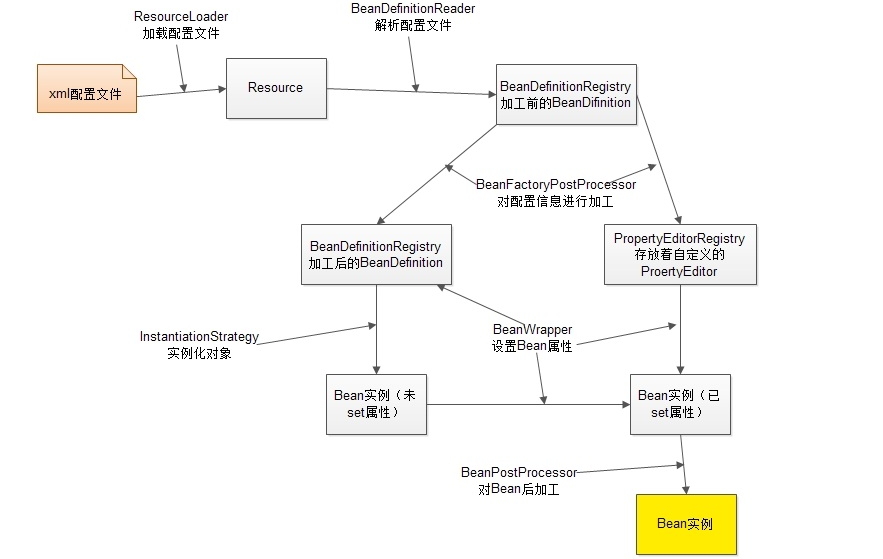

# CSE401 - Spring - Spring框架

返回[Bulletin](./bulletin.md)

返回[CSE401 - Spring](./CSE401.md)

[TOC]

## Spring

Spring是分层的full-stack（全栈）开源框架，最初版本发布于2002年，以IoC和AOP为内核。

**轻量级 lightweight**

相比过去的Java EE, Spring是轻量的，基本的版本大约2MB。

**一站式 one-stop-shop**

整合了大量框架和工具。Spring对javaEE开发中非常难用的一些API（例如JDBC, javaMail, 远程调用等）都提供了封装，使这些API应用难度大大降低。

### 版本

**Spring 5**

Spring Framework 5.x支持JDK 8.

- Spring接口中的默认方法

- 基于Java 8反射增强的内部代码改进

- 在框架代码中使用函数式编程-lambda表达式和stream流

**Spring 4**

Spring Framework 4.x支持JDK 6.

**Spring 3**

Spring Framework 3.x支持JDK 5.

### 模块


**Spring Core模块**

Core模块是Spring的核心类库，Spring的所有功能都依赖于该类库。Core主要用来实现IOC功能，基本上Spring的所有功能都是借助IOC实现的。IOC容器实现了对象的创建、装配、和生命周期的管理。

**AOP模块**

AOP模块是Spring的AOP库，提供了AOP（拦截器）机制，以及可自行配置的常用拦截器。

**ORM模块**

ORM模块提供对常用的ORM框架，例如Hibernate，ibtas，jdao等框架的管理和辅助支持。

Spring本身并不对ORM进行实现，仅对常见的ORM框架进行封装和管理。

**DAO模块**

DAO模块可以执行SQL语句、提供对JDBC的支持。模块并不对JDBC进行实现，而是对JDBC进行封装并允许其使用Spring资源，并统一管理所有JDBC事物。

**WEB模块**

WEB模块提供对常见框架如Struts1，WEBWORK（Struts 2），JSF的支持，能够管理这些框架，将Spring的资源注入给框架，也能在这些框架的前后插入拦截器。

**Context模块**

Context模块提供框架式的Bean访问方式，其他程序可以通过Context访问Spring的Bean资源，相当于资源注入。

**MVC模块**

MVC模块为Spring提供了一套轻量级的MVC实现。相对于Struts，Spring自己的MVC框架更加简洁和方便。

### 优势

**方便解耦，简化开发**

通过Spring提供的IoC容器，可以将对象间的依赖关系交由Spring进⾏控制，避免硬编码所造成的过度程序耦合。⽤户也不必再为单例模式类、属性⽂件解析等这些很底层的需求编写代码，可以更专注于上层的应⽤。

**AOP编程的⽀持**

通过Spring的AOP功能，⽅便进⾏⾯向切⾯的编程，许多不容易⽤传统OOP实现的功能可以通过AOP轻松应付。

**声明式事务的⽀持**

@Transactional可以将我们从单调烦闷的事务管理代码中解脱出来，通过声明式方式灵活的进行事务的管理，提⾼开发效率和质量。

**方便程序的测试**

可以⽤⾮容器依赖的编程⽅式进⾏⼏乎所有的测试⼯作，测试不再是昂贵的操作，⽽是随⼿可做的事情。

**方便集成各种优秀框架**

Spring可以降低各种框架的使⽤难度，提供了对各种优秀框架（Struts、Hibernate、Hessian、Quartz等）的直接⽀持。

**降低JavaEE API的使用难度**

Spring对JavaEE API（如JDBC、JavaMail、远程调用等）进行了薄薄的封装层，使这些API的使用难度⼤为降低。

**源码是经典的Java学习范例**

Spring的源代码设计精妙、结构清晰、匠⼼独⽤，处处体现着⼤师对Java设计模式灵活运用以及对Java技术的⾼深造诣。它的源代码⽆意是Java技术的最佳实践的范例。

我们经常说的Spring其实指的是Spring Framework（spring框架）。

## Spring容器

Spring的核心理念就是更方便地管理Java Bean，而被管理的Java Bean存缓存在一个Map中，即IoC容器。

整个bean的生命周期，从创建到使用到销毁的过程全部都是由容器来管理（bean的生命周期）。

### 控制反转IoC

IoC叫控制反转(Inversion of Control), 是Spring的核心，指的是把传统上由程序代码直接操控的对象的调用权，交给**Spring容器**来控制对象的生命周期和对象间的关系。


### 依赖注入Dependency Injection

是当前比较流行的控制反转Ioc的实现方式之一。将Bean安装在Bean容器中并进行依赖关系配置的过程被称为装配，IoC控制反转就是指的安装这一过程，而DI依赖指的是配置这一过程。Spring可以通过**构造方法注入**（一般用于强依赖）和**setter方法注入**（一般用于可选依赖）两种方式完成依赖注入。


### 初始化过程



- ResourceLoader从存储介质中加载Spring配置信息，并使用Resource表示这个配置文件的资源。
- BeanDefinitionReader读取Resource所指向的配置文件资源，然后将配置文件中每一个<bean>标签解析成BeanDefinition对象，并保存到BeanDefinitionRegistry中。
- 容器扫描BeanDefinitionRegistry中的BeanDefinition，使用Java的反射机制自动识别出实现BeanFactoryPostProcessor接口的Bean，然后调用这些BeanDefinition对象的BeanFactoryPostProcessor进行加工处理，包括：
  - 对<bean>元素标签使用到的占位符进行解析，得到最终的配置值。
  - 通过Java反射机制找出所有实现java.beans.PropertyEditor接口的Bean并自动将它们注册到Spring容器的属性编辑器注册表PropertyEditorRegistry中。
- 注册BeanPostProcessor方便后续对bean对象完成具体的扩展功能。

- Spring容器从BeanDefinitionRegistry中取出加工后的BeanDefinition
  - 使用BeanWrapper对Bean进行封装。BeanWrapper提供了很多以Java反射机制操作Bean的方法，它将结合该Bean的BeanDefinition以及容器中属性编辑器，完成Bean属性的设置工作。
  - 调用InstantiationStrategy着手进行Bean实例化的工作。

- bean对象的初始化过程。生成完整的bean对象后，通过getBean方法可以直接获取。
- 使用完毕后是销毁过程。

## 工厂类


### BeanFactory

BeanFactory使用简单工厂模式，是整个Spring IoC容器的根接口，可以理解为含有 Bean 集合的工厂类。作用是管理Bean，包括实例化、定位、配置对象及建立这些对象间的依赖。

BeanFactory实例化后并不会自动实例化 Bean，只有当Bean被使用时才实例化与装配Bean的依赖关系，属于延迟加载，适合多例模式。

### ApplicationConext

ApplicationConext是BeanFactory的子接口，扩展了BeanFactory的功能：

- 继承MessageSource，因此支持国际化。

- 统一的资源文件访问方式。

- 提供在监听器中注册bean的事件。

- 同时加载多个配置文件。

- 载入多个（有继承关系）上下文 ，使得每一个上下文都专注于一个特定的层次，比如应用的web层。

容器会在初始化时对配置的Bean进行预实例化，Bean的依赖注入在容器初始化时就已经完成，属于立即加载，适合单例模式，一般推荐使用。

#### WebApplicaionContext

使用web.xml进行配置，不用写代码。

```xml
!--从类路径下加载Spring配置文件，classpath特指类路径下加载-->
<context-param>
	<param-name>contextConfigLocation</param-name>
	<param-value>
		classpath:smart-context.xml
	</param-value>
</context-param>
<!--负责启动spring容器的监听器  还可以声明自启动的Servlet   ContextLoaderServlet-->
<listener>
	<listener-class>org.springframework.web.context.ContextLoaderListener</listener-class>
</listener>
```

Spring中提供WebApplicationContextUtils的getWebApplicationContext(ServletContext src)方法来获得WebApplicationContext对象。

```java
public static WebApplicationContext getWebApplicationContext(ServletContext sc) { 
    return getWebApplicationContext(sc, WebApplicationContext.ROOT_WEB_APPLICATION_CONTEXT_ATTRIBUTE);
}
```

#### ClassPathXmlApplicationContext

通过设置classpath目录下的路径进行容器配置。

```java
ApplicationContext context = new ClassPathXmlApplicationContext("application-context.xml");
```

#### FileSystemXmlApplicationContext

通过设置文件地址路径进行容器配置

```java
ApplicationContext context = new FileSystemXmlApplicationContext("/home/user/conf/application-context.xml");
```

### FactoryBean

FactoryBean是BeanFactory接口的实现，使用了工厂方法模式。

使用BeanFactory创建对象的时候，必须要遵循严格的生命周期流程，太复杂了。如果想要简单的自定义某个对象的创建，同时创建完成的对象想交给Spring来管理，那么就需要实现FactroyBean接口了。

## Bean

### 生命周期


#### 实例化Bean对象

Spring启动，查找并加载需要被Spring管理的bean，进行Bean的实例化。

实例化后的对象被封装在BeanWrapper对象中，并且此时对象仍然是一个原生的状态，并没有进行依赖注入。 

#### 设置对象属性

Spring根据BeanDefinition中的信息进行依赖注入，并且通过BeanWrapper提供的设置属性的接口完成依赖注入。

#### 检查Aware接口

Aware接口满足了Spring容器创建的bean对象在进行具体操作的时候对于容器内其他对象的需要。

- BeanNameAware.setBeanName()在创建此bean的bean工厂中设置bean的名称。

- BeanClassLoaderAware.setBeanClassLoader()

- BeanFactoryAware.setBeanFactory()回调提供了自己的bean实例工厂。

- EnvironmentAware.setEnvironment()设置environment在组件使用时调用

- EmbeddedValueResolverAware.setEmbeddedValueResolver()
  - 这个知道的人可能不多，实现该接口能够获取Spring EL解析器，用户的自定义注解需要支持spel表达式的时候可以使用，非常方便。

- ResourceLoaderAware.setResourceLoader()

- ApplicationEventPublisherAware.setApplicationEventPublisher()

- MessageSourceAware.setMessageSource()
  - 以上三个接口其返回值实质上都是当前的ApplicationContext对象，因为ApplicationContext是一个复合接口。

- ApplicationContextAware.setApplicationContext()

- 对于WebApplication还有ServletContextAware.setServletContext()

#### 检查BeanPostProcessor接口（1）

BeanPostProcessor.postProcessBeforeInitialization()

BeanPostProcessor有很多个而且每个BeanPostProcessor都影响多个Bean，执行顺序需要根据两个排序相关的接口决定：

- PriorityOrdered是一等公民，首先被执行，PriorityOrdered公民之间通过接口返回值排序。

- Ordered是二等公民，然后执行，Ordered公民之间通过接口返回值排序。

- 都没有实现是三等公民，最后执行。

#### 检查InitializingBean接口

InitializingBean.afterPropertiesSet()

#### 检查使用init-method声明的初始化方法

如果bean使用了init-method声明初始化方法，该方法也会被调用。

**通过XML配置**

```xml
init-method="before"
```

**通过注解配置**

```xml
<context:component-scan base-package="com.mashibing.spring"></context:component-scan> 
```

@PostConstruct相当于init-method, 使用在方法上，当Bean初始化时执行。

#### 检查BeanPostProcessor接口（2）

BeanPostProcessor.postProcessAfterInitialization()应用于所有给定的新bean实例。

BeanPostProcessor有很多个而且每个BeanPostProcessor都影响多个Bean，执行顺序需要根据两个排序相关的接口决定：

- PriorityOrdered是一等公民，首先被执行，PriorityOrdered公民之间通过接口返回值排序。

- Ordered是二等公民，然后执行，Ordered公民之间通过接口返回值排序。

- 都没有实现是三等公民，最后执行。

#### 检查DisposableBean接口（1）

注册必要的Destruction相关接口。

#### 就绪

Bean将一直驻留在应用上下文中，直到应用上下文被销毁。

#### 检查DisposableBean接口（2）

Spring将调用它的destory()接口方法。

#### 检查使用destroy-method声明的销毁方法

如果bean使用了destory-method声明销毁方法，该方法也会被调用。

**通过XML配置**

```xml
destroy-method="after"
```

**通过注解配置**

```xml
<context:component-scan base-package="com.mashibing.spring"></context:component-scan>
```

@PreDestroy相当于destory-method，使用在方法上，当Bean销毁时执行。

### 作用域

当通过Spring容器创建一个Bean实例时，不仅可以完成Bean实例的实例化，还可以通过bean 定义中的scope属性为Bean指定特定的作用域。

Spring为bean提供了6种作用域，其中有4种只在web-aware的ApplicationContext才有用。

#### Singleton

单例模式，在整个Spring IoC容器中，使用singleton定义的Bean将只有一个实例，即使生成多次也返回同一个实例。

如果不指定Bean的作用域，Spring默认使用singleton作用域。

```xml
<bean id="person" name="person" class="com.mashibing.spring.Person" scope="singleton">
```

#### Prototype

原型模式，每次通过容器的getBean方法获取prototype定义的Bean时，都将产生一个新的Bean实例。

Java在创建Java实例时，需要进行内存申请；销毁实例时，需要完成垃圾回收，这些工作都会导致系统开销的增加。因此，prototype作用域Bean的创建、销毁代价比较大。

有状态的bean一般使用Prototype作用域，无状态的一般使用singleton单例作用域。

```xml
<bean id="person" name="person" class="com.mashibing.spring.Person" scope="prototype">
```

#### Request

只有在Web应用中使用Spring时，该作用域才有效。

对于每次HTTP请求，使用request定义的Bean都将产生一个新实例。

#### Session

只有在Web应用中使用Spring时，该作用域才有效。

同一个HTTP Session共享一个实例。

#### Global session

只有在Web应用中使用Spring时，该作用域才有效。

同一个HTTP Session共享一个实例，用于Portlet容器，因为每个portlet有单独的session，而global session提供一个全局性的http session.

#### Application

只有在Web应用中使用Spring时，该作用域才有效。

同一个Web应用共享一个实例。

### 线程安全

prototype模式下，每次都是新建的实例，可以保证线程安全。

默认的singleton模式下，Spring并没有进行多线程的封装处理，bean无状态的情况下（比如dao类）线程也是安全的，但如果bean有状态的话（比如view, model对象）就不一定保证线程安全了。

### 内部Bean

当一个bean只能被某一个类使用时，称该bean为内部bean.

## Spring实战

### 创建标准工程

按照惯例新建libs目录，引入以下jar包：

- commons-lang3-3.11.jar

- commons-logging-1.2.jar

- spring-beans-5.2.3.RELEASE.jar

- spring-context-5.2.3.RELEASE.jar

- spring-core-5.2.3.RELEASE.jar

- spring-expression-5.2.3.RELEASE.jar

准备Spring上下文配置文件src/applicationContext.xml

### 创建Maven工程

在左侧Package Explorer点击右键，新建Maven工程。

生成的pom.xml如下所示

```xml
<project xmlns="http://maven.apache.org/POM/4.0.0" xmlns:xsi="http://www.w3.org/2001/XMLSchema-instance" xsi:schemaLocation="http://maven.apache.org/POM/4.0.0 https://maven.apache.org/xsd/maven-4.0.0.xsd">
  <modelVersion>4.0.0</modelVersion>
  <groupId>com.mashibing.spring</groupId>
  <artifactId>Spring01</artifactId>
  <version>0.0.1-SNAPSHOT</version>
  <name>spring stu</name>
</project>
```

登录[https://mvnrepository.com/artifact/org.springframework/](https://mvnrepository.com/artifact/org.springframework/spring-context) 

复制Maven下spring context和spring-core等依赖的xml dependency配置信息，到dependencies标签下。

```xml
<project xmlns="http://maven.apache.org/POM/4.0.0" xmlns:xsi="http://www.w3.org/2001/XMLSchema-instance" xsi:schemaLocation="http://maven.apache.org/POM/4.0.0 https://maven.apache.org/xsd/maven-4.0.0.xsd">
  <modelVersion>4.0.0</modelVersion>
  <groupId>com.mashibing.spring</groupId>
  <artifactId>Spring01</artifactId>
  <version>0.0.1-SNAPSHOT</version>
  <name>spring stu</name>
  
  <dependencies>
  
    <!-- https://mvnrepository.com/artifact/org.springframework/spring-context -->
    <dependency>
      <groupId>org.springframework</groupId>
      <artifactId>spring-context</artifactId>
      <version>5.3.2</version>
    </dependency>

    <!-- https://mvnrepository.com/artifact/org.springframework/spring-context -->
    <dependency>
      <groupId>org.springframework</groupId>
      <artifactId>spring-core</artifactId>
      <version>5.3.2</version>
    </dependency>
  </dependencies>
  
</project>
```

准备Spring上下文配置文件src/main/resources/applicationContext.xml

### 使用XML配置文件装配

```java
public class Person {
    private String name;
    private int age;
    private Food food;
    public Person(String name, Integer age, Food food) {
        super();
        this.name = name;
        this.age = age;
        this.food = food;
}
class Food {}
```

在application-context.xml配置文件中实现依赖注入，包括：基本类型（int, String等）、集合、Bean、配置文件等。

使用**constructor-arg**标签进行构造方法注入

```xml
<bean id="person" class="com.mashibing.spring.Person">
    <constructor-arg name ="name" value="maxiaosan"></constructor-arg>
    <constructor-arg name ="age" value="18"></constructor-arg>
    <constructor-arg name ="food" ref="food"></constructor-arg>
</bean>
<bean id="food" class="com.mashibing.spring.Food"></bean>
```

此时可以调试配置好的bean

```java
public static void main(String[] args) {
    ClassPathXmlApplicationContext ctx = 
        new ClassPathXmlApplicationContext("applicationContext.xml");
    Person person = (Person)ctx.getBean("person");
    System.out.println(ToStringBuilder.reflectionToString(person));
}
```

```bash
com.mashibing.spring.Person@5c671d7f[age=12,food=com.mashibing.spring.Food@3098cf3b,name=ZhangSan]
```

使用**c-namespace**注入构造方法

```xml
<beans xmlns:c=http://www.springframework.org/schema/c>
	<bean id="person" class="com.mashibing.spring.Person" c:name="zhangsan" c:age="18" c:food-ref="food"/>
</beans>
```

使用**property**标签进行setter注入

```xml
<bean id="person" name="person" class="com.mashibing.spring.Person">
    <property name ="name" value="maxiaosan"></property>
    <property name ="age" value="18"></property>
    <property name ="food" ref="food"></property>
</bean>
```

此时可以调试配置好的bean

```java
public static void main(String[] args) { 
    ClassPathXmlApplicationContext ctx = 
        new ClassPathXmlApplicationContext("applicationContext.xml");
    Person person = (Person)ctx.getBean("person");
    System.out.println(ToStringBuilder.reflectionToString(person));
}
```

```bash
com.mashibing.spring.Person@48974e45[age=18,food=com.mashibing.spring.Food@d29f28,name=maxiaosan]
```

使用**p-namespace**注入setter方法

```xml
<beans xmlns:p=http://www.springframework.org/schema/p>
	<bean id="person" class="com.mashibing.spring.Person" p:name="zhangsan" p:age="18" p:food-ref="food"/>
</beans>
```

**name**可以配置多个

**alias**可以为对象设置别名 等同于name

```xml
<bean id="person" name="human,star" class="com.mashibing.spring.Person">
    <constructor-arg name ="name" value="maxiaosan"></constructor-arg>
    <constructor-arg name ="age" value="18"></constructor-arg>
    <constructor-arg name ="food" ref="food"></constructor-arg>
</bean>
<bean id="food" class="com.mashibing.spring.Food"></bean>
<alias name="person" alias="person2"/>
```

可以使用**index**字段规定构造方法注入使用的不同位置的参数及其对应的值

```xml
<bean id="person" name="human,star" class="com.mashibing.spring.Person">
    <constructor-arg index="0" value="maxiaosan"></constructor-arg>
    <constructor-arg index="1" value="18"></constructor-arg>
    <constructor-arg index="2" ref="food"></constructor-arg>
</bean>
<bean id="food" class="com.mashibing.spring.Food"></bean>
```

可以使用**type**字段规定构造方法注入使用的不同类型的参数及其对应的值

```xml
<bean id="person" name="human,star" class="com.mashibing.spring.Person">
    <constructor-arg name ="name" type="java.lang.String" value="maxiaosan"></constructor-arg>
    <constructor-arg name ="age" type="java.lang.Integer" value="18"></constructor-arg>
    <constructor-arg name ="food"  type="com.mashibing.spring.Food" ref="food"></constructor-arg>
</bean>
<bean id="food" class="com.mashibing.spring.Food"></bean>
```

可以使用**map**标签定义Map类参数及其拥有的键值对

可以使用**list**标签定义List类参数及其拥有的值

可以使用**set**标签定义Set类参数及其拥有的值

```xml
<bean id="cC" name="cC" class="com.mashibing.spring.CollectionContainer">
    <constructor-arg name ="map">
        <map>
            <entry key="key" value="value"/>
        </map>
    </constructor-arg>
    <constructor-arg name ="list">
        <list>
            <value>100</value>
        </list>
    </constructor-arg>
    <constructor-arg name ="set">
        <set>
            <value>STR</value>
        </set>
    </constructor-arg>
</bean>
```

使用工厂

```xml
<bean id="carFactory" class="com.mashibing.spring.CarFactory">
    <property name="name" value="audi"/>
</bean>
<bean id="car" factory-bean="carFactory" factory-method="getCar"></bean>
```

```java
Car car = ctx.getBean("car", Car.class);
System.out.println(car.getName());
```

#### 自动装配

自动装配（Auto-wiring）适合解决依赖很多的添加依赖的问题，具有多种类型：

**byName** 根据Bean名称

```xml
<bean id="a" class="com.mashibing.spring.A" autowire="byName"></bean>
<bean id="b" class="com.mashibing.spring.B" autowire="byName"></bean>
<bean id="c" class="com.mashibing.spring.C" autowire="byName"></bean>
```

```java
A a = (A)ctx.getBean("a");
B b = (B)ctx.getBean("b");
C c = (C)ctx.getBean("c");
System.out.println(ToStringBuilder.reflectionToString(a));
System.out.println(ToStringBuilder.reflectionToString(b));
System.out.println(ToStringBuilder.reflectionToString(c));
```

通过调试可以发现a,b,c均已被按照名称装配

```bash
com.mashibing.spring.A@53976f5c[b=com.mashibing.spring.B@732c2a62]
com.mashibing.spring.B@732c2a62[c=com.mashibing.spring.C@5ace1ed4]
com.mashibing.spring.C@5ace1ed4[a=com.mashibing.spring.A@53976f5c]
```

**byType** 根据Bean类型

只要类型一致即可实现装配，不用保持名称对应。如果有两个或以上匹配就会报错。

```xml
<beans default-autowire="byType"/>
```

或

```xml
<bean id="A" class="com.mashibing.spring.A" autowire="byType"></bean>
<bean id="B" class="com.mashibing.spring.B" autowire="byType"></bean>
<bean id="C" class="com.mashibing.spring.C" autowire="byType"></bean>
```

```java
A a = (A)ctx.getBean("a");
B b = (B)ctx.getBean("b");
C c = (C)ctx.getBean("c");
System.out.println(ToStringBuilder.reflectionToString(a));
System.out.println(ToStringBuilder.reflectionToString(b));
System.out.println(ToStringBuilder.reflectionToString(c));
```

通过调试可以发现a,b,c均已被按照名称装配

```bash
com.mashibing.spring.A@272ed83b[b=com.mashibing.spring.B@6631f5ca]
com.mashibing.spring.B@6631f5ca[c=com.mashibing.spring.C@1b6e1eff]
com.mashibing.spring.C@1b6e1eff[a=com.mashibing.spring.A@272ed83b]
```

**constructor** 构造函数，根据类型

```xml
<bean id="A" class="com.mashibing.spring.A" autowire="constructor"></bean>
<bean id="B" class="com.mashibing.spring.B" autowire="constructor"></bean>
<bean id="C" class="com.mashibing.spring.C" autowire="constructor"></bean>
```

```java
A a = (A)ctx.getBean("A");
B b = (B)ctx.getBean("B");
C c = (C)ctx.getBean("C");
System.out.println(ToStringBuilder.reflectionToString(a));
System.out.println(ToStringBuilder.reflectionToString(b));
System.out.println(ToStringBuilder.reflectionToString(c));
```

通过调试可以发现a,b,c均已被按照名称装配

```bash
com.mashibing.spring.A@1ba9117e[b=com.mashibing.spring.B@2accdbb5]
com.mashibing.spring.B@2accdbb5[c=com.mashibing.spring.C@1cbb87f3]
com.mashibing.spring.C@1cbb87f3[a=<null>]
```

#### 懒加载

Spring启动的时候会把所有bean信息(包括XML和注解)解析转化成Spring能够识别的BeanDefinition, 存到Hashmap⾥供下⾯的初始化时⽤，然后对每个BeanDefinition 进⾏处理，在容器初始化阶段进行初始化并依赖注⼊。

普通Bean的初始化是在容器启动初始化阶段执⾏的，但是被lazy-init=*"true"*修饰的懒加载的bean, 在容器初始化阶段不处理，而是在容器第⼀次进行context.getBean()时被触发。

```xml
<bean id="person2" class="com.mashibing.spring.Person2" lazy-init="true">…</bean>
<beans default-lazy-init="true">
<!-- no beans will be eagerly pre-instantiated... -->
</beans>
```

## 使用注解装配

使用**@Component**（或其他注解）将普通Java类配置成SpringBean.

**@Repository**, **@Service**, **@Controller**就是针对不同的使用场景所采取的特定功能化的注解组件。

```java
/**
 * 处理具体业务逻辑
 * 比如，校验账号密码是否正确
 * @author tuoli
 *
 */
//@Component 注册bean 相当于<bean id=""
@Component
public class MainService {
    public User login(String login, String password) {
        System.err.println("Service 接到请求，开始处理");
        return new User();
    }
}
```

修改配置文件，加入context:component-scan标签以支持注解

```xml
<context:component-scan base-package="com.mashibing.spring"></context:component-scan>
```

使用**@Scope**注解确定bean的作用域

使用**@Value**注入简单依赖

```java
@Component
@Scope("prototype")
public class User {
    @Value("zhangfg")
    private String loginName;
    @Value("123456")
    private String password;
}
```

#### 自动装配

使用**@Autowired**或**@Resource**等其他注解使Spring满足Bean的依赖，无需定义或调用setter方法。

@Autowired属于Spring注解；@Resource属于J2EE注解，减少了与spring的耦合。

@Autowired与@Resource都可以写在字段或setter方法上。

@Autowired默认按类型装配，默认情况下必须要求依赖对象必须存在，如果要允许null值，可以设置它的required属性为false，如：@Autowired(required=false) ，如果我们想使用名称装配可以结合@Qualifier注解进行使用，如下：

```java
@Autowired() @Qualifier("baseDao")
private BaseDao baseDao;
```

@Resource装配规则如下：

  　　1. 如果同时指定了name和type，则从Spring上下文中找到唯一匹配的bean进行装配，找不到则抛出异常
  　　2. 如果指定了name，则从上下文中查找名称（id）匹配的bean进行装配，找不到则抛出异常
  　　3. 如果指定了type，则从上下文中找到类型匹配的唯一bean进行装配，找不到或者找到多个，都会抛出异常
  　　4. 如果既没有指定name，又没有指定type，则自动按照byName方式进行装配；如果没有匹配，则回退为一个原始类型进行匹配，如果匹配则自动装配。

```java
@Resource (name="baseDao")
private BaseDao baseDao;
```

