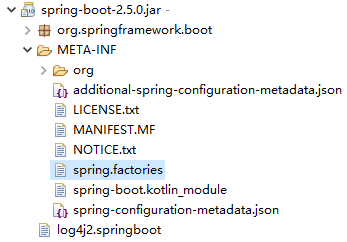
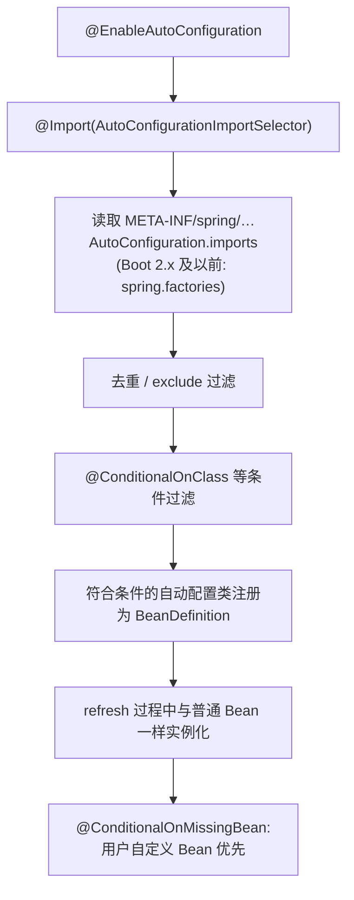
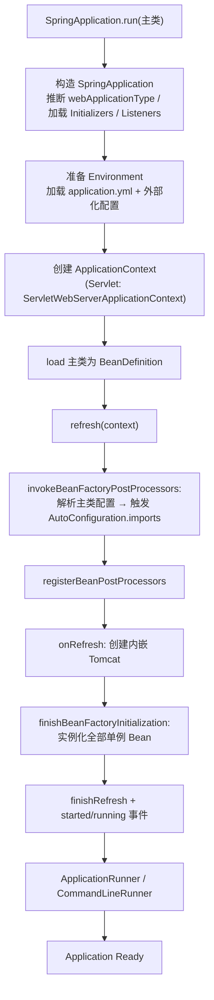
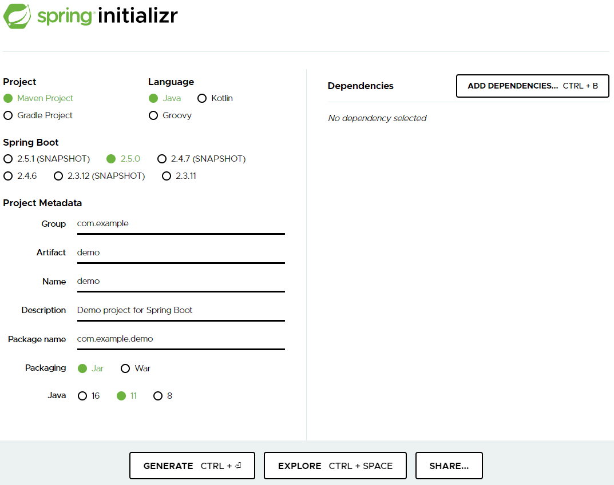

# CSE401 - Spring Ecosystem - Spring Boot

返回[Bulletin](./bulletin.md)

返回[CSE401 - Spring Ecosystem](./CSE401.md)

[TOC]

> Spring Boot 建立在 Spring Framework 的 IoC 容器之上（见 [Spring Framework Core](./CSE4011.md)），Web 层细节见 [Spring Web & MVC](./CSE4013.md)。本章正文聚焦启动主流程、自动配置机制与配置体系；`SpringApplication.run` 的 19 步源码逐行分析完整保留在 [Appendix A — 启动流程源码 Deep Dive](#appendix-a--启动流程源码-deep-dive)，旧版实战教程完整保留在 [Appendix B — 历史实战教程](#appendix-b--历史实战教程)。

## Spring Boot 解决什么问题

Spring Framework 时代（XML/Java 配置 + 外部 Tomcat）搭建一个 Web 工程需要：手写一堆 XML、管理几十个依赖版本、部署 WAR 到外部容器。Spring Boot 的答案：

- **约定优于配置**：默认值即最佳实践，需要时再覆盖。
- **Starter 依赖聚合**：一个 starter 拉齐一个场景的全部依赖与版本。
- **自动配置**：按 classpath 里有什么，自动装配对应的 Bean。
- **内嵌服务器**：`java -jar` 直接跑起一个 Web 服务，无需外部容器。

Boot 不是"另一个 Spring"——它就是 Spring Framework + 脚手架 + 自动配置层。面试一句话：**Boot 简化的是"搭建与配置"，IoC/AOP/MVC 等核心机制全部还是 Framework 的**。

## 基本介绍

Spring Boot是Spring开源组织下的子项目，通过Spring组件一站式解决方案来简化Spring应用的初始搭建以及开发过程。

- 项目可以通过命令java -jar xxx.jar以jar包的形式**独立运行**。

- 内嵌**servlet容器**，可以内嵌tomcat, jetty, 或者undertow，这样就可以不用war包形式部署项目。

- Spring提供了一系列starter pom来**简化**maven的**依赖**加载，当使用了spring-boot-starter-web时，会自动加载所需要的依赖包。

- Spring Boot会根据在类路径的jar包，类，为jar包中的类**自动配置**bean，这样会极大的减少配置的使用。

> 2026 视角：内嵌容器默认 Tomcat 10+（Jakarta namespace），`java -jar` 是生产部署最常见形态；WAR + 外部容器只保留给少数传统运维场景。

## 入口类与 @SpringBootApplication

Spring Boot的项目一般都会有名称以Application结尾的入口类，入口类中会有main方法，这是一个标准的Java应用程序的入口方法。

```java
@SpringBootApplication
@ComponentScan("com.github.ltprc")
public class SpringBootProjectApplication {
    public static void main(String[] args) {
        SpringApplication.run(SpringBootProjectApplication.class, args);
    }
}
```

`@SpringBootApplication` 是组合注解：

| 组成注解 | 作用 |
| -------- | ---- |
| @SpringBootConfiguration | 本质是 @Configuration，标识入口类本身是一个配置类；Boot 内部通过它查找主配置类 |
| @EnableAutoConfiguration | 开启自动配置（见下） |
| @ComponentScan | 组件扫描，默认扫描入口类所在包及子包 |

```java
@Target(ElementType.TYPE)
@Retention(RetentionPolicy.RUNTIME)
@Documented
@Configuration
@Indexed
public @interface SpringBootConfiguration {
    //...
}
```

> 原表述"推荐使用@SpringBootConfiguration替代@Configuration"容易误导：两者语义相同，区别只是 Boot 在检索主配置类时认 `@SpringBootConfiguration`。自己写的普通配置类用 `@Configuration` 即可。

### @ComponentScan

@ComponentScan注解默认扫描@SpringBootApplication所在类的同级目录以及它的子目录，可以将路径作为字符串参数写入注解内，注解会扫描对应路径下的类。

这也是入口类约定放在根包的原因——放错包会导致业务 Bean 全部不被扫描，是最常见的"注入失败"根因之一。

### @EnableAutoConfiguration

@EnableAutoConfiguration注解会使Spring Boot根据项目中依赖的jar包启用自动配置。

在进行SpringApplication对象实例化时，Spring Boot会加载META-INF/spring.factories文件，通过getBootstrapRegistryInitializersFromSpringFactories方法调用的getSpringFactoriesInstances方法，将该配置文件中的启动注册配置转换为BootstrapRegistryInitializer对象，载入到Spring容器。



例如我们如果添加了spring-boot-starter-web的依赖，项目中就会引入SpringMVC的依赖，Spring Boot就会自动配置tomcat和SpringMVC.

关闭某一项自动配置的方法如下所示：

```java
@SpringBootApplication(exclude = {XXXConfiguration.class})
```

> **Legacy / 2026 现状**：`spring.factories` 是 Boot 2.x 及更早的机制。Boot 2.7 起自动配置类迁移到 `META-INF/spring/org.springframework.boot.autoconfigure.AutoConfiguration.imports`（一行一个类名），Boot 3.0 彻底移除 `spring.factories` 中的自动配置条目；`spring.factories` 本身仍用于 Initializer/Listener 等非自动配置条目。

### @Conditional

自动配置类在一定条件下才能生效


| @Conditional扩展注解            | 作用                                     |
| ------------------------------- | ---------------------------------------- |
| @ConditionalOnJava              | 系统的java版本是否符合要求               |
| @ConditionalOnBean              | 容器中存在指定Bean                       |
| @ConditionalOnMissingBean       | 容器中不存在指定Bean                     |
| @ConditionalOnExpression        | 满足SpEL表达式                           |
| @ConditionalOnClass             | 系统中有指定的类                         |
| @ConditionalOnMissingClass      | 系统中没有指定的类                       |
| @ConditionalOnSingleCandidate   | 容器中只有一个指定的Bean，或者是首选Bean |
| @ConditionalOnProperty          | 系统中指定的属性是否有指定的值           |
| @ConditionalOnResource          | 类路径下是否存在指定资源文件             |
| @ConditionOnWebApplication      | 当前是web环境                            |
| @ConditionalOnNotWebApplication | 当前不是web环境                          |
| @ConditionalOnJndi              | JNDI存在指定项                           |

其中 `@ConditionalOnMissingBean` 是"用户配置优先于默认配置"的实现基石：自动配置类总是先检查用户是否已自定义该 Bean，没有才装配默认实现。

## 自动配置如何生效

把 @EnableAutoConfiguration 的机制串成一条链（面试常问"自动配置原理"）：


```mermaid
flowchart TD
    A["@EnableAutoConfiguration"] --> B["@Import(AutoConfigurationImportSelector)"]
    B --> C["读取 META-INF/spring/…AutoConfiguration.imports<br/>(Boot 2.x 及以前: spring.factories)"]
    C --> D["去重 / exclude 过滤"]
    D --> E["@ConditionalOnClass 等条件过滤"]
    E --> F["符合条件的自动配置类注册为 BeanDefinition"]
    F --> G["refresh 过程中与普通 Bean 一样实例化"]
    G --> H["@ConditionalOnMissingBean:<br/>用户自定义 Bean 优先"]
```

要点：

- 自动配置类本质是带 `@Conditional` 的 `@Configuration` 类，最终以普通 BeanDefinition 进入容器，走同一条 refresh/实例化链路。
- `spring-boot-autoconfigure` jar 里每个 `XXXAutoConfiguration` 对应一个场景（web、data-jpa、kafka…），通过 `XXXProperties`（`@ConfigurationProperties`）绑定用户配置。
- 排查"为什么没生效"：看条件（ConditionEvaluationReport，`--debug` 启动可打印）→ 看用户是否自己定义了 Bean（`@ConditionalOnMissingBean` 让位）→ 看依赖是否在 classpath。

## SpringApplication.run 主流程

面试要求能把整条链串起来：


```mermaid
flowchart TD
    S["SpringApplication.run(主类)"] --> T["构造 SpringApplication<br/>推断 webApplicationType / 加载 Initializers / Listeners"]
    T --> E["准备 Environment<br/>加载 application.yml + 外部化配置"]
    E --> C["创建 ApplicationContext<br/>(Servlet: ServletWebServerApplicationContext)"]
    C --> L["load 主类为 BeanDefinition"]
    L --> R["refresh(context)"]
    R --> R1["invokeBeanFactoryPostProcessors:<br/>解析主类配置 → 触发 AutoConfiguration.imports"]
    R1 --> R2["registerBeanPostProcessors"]
    R2 --> R3["onRefresh: 创建内嵌 Tomcat"]
    R3 --> R4["finishBeanFactoryInitialization:<br/>实例化全部单例 Bean"]
    R4 --> F["finishRefresh + started/running 事件"]
    F --> AR["ApplicationRunner / CommandLineRunner"]
    AR --> RDY["Application Ready"]
```

10 句话版本：

1. 构造 `SpringApplication`：推断应用类型（SERVLET/REACTIVE/NONE），从 `spring.factories` 加载 Initializer 和 Listener。
2. `starting()` 事件广播。
3. 准备 `Environment`：把 `application.yml`、环境变量、命令行参数等合成一个 `PropertySource` 链。
4. 打印 Banner。
5. 按应用类型创建 `ApplicationContext`（Web 对应 `ServletWebServerApplicationContext`）。
6. 把主类注册为 BeanDefinition，`prepareContext` 完成。
7. `refresh(context)`：与 Framework 的 refresh 同一条链（见 [CSE4011 工作流程](./CSE4011.md)），其中 ConfigurationClassPostProcessor 解析 `@SpringBootApplication`，触发自动配置导入。
8. `onRefresh()` 里创建内嵌 Tomcat 并绑定端口。
9. `finishBeanFactoryInitialization` 实例化所有非懒加载单例 Bean。
10. `started/running` 事件 + 执行 `ApplicationRunner`/`CommandLineRunner`，应用就绪。

### 启动事件时间线

| 事件 | 时机 | 典型用途 |
| ---- | ---- | -------- |
| ApplicationStartingEvent | run 一开始，容器创建前 | 极早期初始化（日志、注册表） |
| ApplicationEnvironmentPreparedEvent | Environment 准备好，容器创建前 | 修改配置源 |
| ApplicationContextInitializedEvent / ContextPreparedEvent | 容器创建/准备完成 | 提前注册 Bean |
| ContextRefreshedEvent | refresh 完成（Framework 事件） | 容器就绪 |
| ApplicationStartedEvent | refresh 完成后、Runner 执行前 | — |
| ApplicationReadyEvent | Runner 执行完，可以接流量 | 缓存预热后的最后一步 |

自定义初始化逻辑挂哪一层：改配置 → Environment 阶段事件；注册 Bean → `ApplicationContextInitializer`；业务预热 → `ApplicationRunner`。

### ApplicationRunner 与 CommandLineRunner

容器就绪后、`ApplicationReadyEvent` 之前的钩子，适合做缓存预热、初始数据加载：

```java
@Component
public class WarmupRunner implements ApplicationRunner {
    @Override
    public void run(ApplicationArguments args) {
        // 预热缓存、校验外部依赖
    }
}
```

> 完整的构造方法与 19 步源码逐行分析见 [Appendix A](#appendix-a--启动流程源码-deep-dive)。

## 内嵌 Web Server

在使用springboot搭建一个web应用程序的时候，我们发现不需要自己搭建一个tomcat服务器，只需要引入spring-boot-starter-web, 在应用启动时会自动启动嵌入式的tomcat作为服务器。

在自动装配时，配置类ServletWebServerFactoryAutoConfiguration导入了BeanPostProcessorRegister. 该类实现了ImportBeanDefinitionRegister接口，可以用来注册额外的BeanDefinition. 同时，该类还导入了EmbeddedTomcat，EmbeddedJetty，EmbeddedUndertow三个类，可以根据用户的需求去选择使用哪一个web服务器。

当自动装配功能完成之后，会接着执行onRefresh的方法，从而创建web服务ServletWebServerApplicationContext，默认获取的是tomcat的web容器。然后初始化Tomcat对象，包括完成内嵌tomcat的api调用和获取tomcat服务。

除了refresh方法之外，在finishRefresh()方法中也对tomcat做了相关的处理。

在refreshContext方法中注册的一个关闭的钩子函数，可以让应用上下文关闭时调用Tomcat的关闭。

> 现代实践：默认 Tomcat；切换 Jetty/Undertow 需先 exclude `spring-boot-starter-tomcat` 再引入对应 starter。内嵌容器由 `ServletWebServerFactory` 抽象，`WebServer` 生命周期挂在 `SmartLifecycle` 上，随容器 start/stop。

## 配置体系：application.yml 与 Profile

Spring Boot项目使用一个全局的配置文件application.properties（或者application.yaml），一般放在resources目录下，也可以放在类路径下的/config下。

### 配置文件路径优先级

| 优先级 | 路径               |                                  |
| ------ | ------------------ | -------------------------------- |
| 高     | ./config/          |                                  |
|        | ./                 |                                  |
|        | classpath:/config/ | 默认./src/main/resources/config/ |
| 低     | classpath:/        | 默认./src/main/resources/        |

外部配置整体优先级：命令行参数 > 操作系统环境变量 > jar 同级 `config/` > jar 同级 > classpath。这解释了生产上"为什么 `--server.port` 一定能覆盖 yml"。

### 修改 Spring Boot 自带配置

```yaml
server:
  #修改tomcat的端口为8080
  port: 8080
  #修改进入DispatcherServlet的规则（Boot 2.0+ 属性名）
  #原文 server.servlet-path 已迁移为 spring.mvc.servlet.path
```

> **Legacy 属性迁移**：`server.servlet-path`（Boot 1.x）→ Boot 2.0 起为 `spring.mvc.servlet.path`；`spring.resources.static-locations`（Boot 2.1 及以前）→ Boot 2.2+ 为 `spring.web.resources.static-locations`。旧笔记里见到老属性名时按这个映射换算。

### @ConfigurationProperties 与 @Value

| 对比项 | @ConfigurationProperties | @Value |
| ------ | ------------------------ | ------ |
| 绑定方式 | 批量按 prefix 绑定 | 一个个指定 |
| 松散语法（last-name/lastName） | 支持 | 不支持 |
| SpEL | 不支持 | 支持 |
| JSR303 校验（@Validated + @Email 等） | 支持 | 不支持 |
| 复杂类型（List/Map/嵌套对象） | 支持 | 不支持 |
| 适用 | 结构化配置类 | 单个值 |

完整 Person 绑定示例（含单测与输出）见 [Appendix B — 全局配置文件完整示例](#全局配置文件完整示例)。

### 多环境 Profile

`application-{profile}.yml` + `spring.profiles.active` 激活：

```yaml
spring:
  profiles:
    active: dev   # dev / test / prod
```

也可以在 yml 中用 `---` 文档块拆分环境，或运行时覆盖：

```bash
java -jar xxx.jar --spring.profiles.active=test
```

（原文此处命令行参数笔误 `tes`，已修正为 `test`。）

> 2026 实践：生产配置通常不放包里，而是外部 `config/` 目录、环境变量或配置中心（Nacos/Apollo，见 [Spring Cloud](./CSE4014.md)）；Profile 更多用于区分"行为差异"而非"密钥"。

### 静态资源配置

Spring Boot的请求路径一般会经过Controller处理，但是静态资源文件在请求之后是直接返回的。默认配置：

```properties
#静态资源请求路径
spring.mvc.static-path-pattern=/**
#静态资源目录（Boot 2.2+ 属性名；Boot 2.1 及以前为 spring.resources.static-locations）
spring.web.resources.static-locations=classpath:/META-INF/resources/,classpath:/resources/,classpath:/static/,classpath:/public/
```

如果请求的路径和配置中的静态资源请求路径一致，那么请求就是一个静态请求，Spring Boot使用Spring MVC的ResourceHttpRequestHandler, 依次从静态资源目录查找对应的资源；否则请求就不是静态请求。

因为Controller会先于静态资源处理，所以如果有Controller的路径完全匹配，也不会访问静态资源。

除了修改配置文件以外，还可以通过添加自己的 `WebMvcConfigurer` 实现类并重写 addResourceHandlers 方法来修改此行为（`WebMvcConfigurerAdapter` 已废弃，直接 implement 接口即可，接口方法全部有 default 实现）：

```java
@Configuration
public class MyMvcConfig implements WebMvcConfigurer {
    @Override
    public void addResourceHandlers(ResourceHandlerRegistry registry) {
        registry.addResourceHandler("/**").addResourceLocations("classpath:/static/");
    }
}
```

WebMvcAutoConfiguration 默认实现与 `spring.web` 属性绑定源码见 [Appendix B — 静态资源配置源码](#静态资源配置源码)。

## Actuator 基础

生产运维端点，加 `spring-boot-starter-actuator` 即可：

| 端点 | 作用 |
| ---- | ---- |
| /actuator/health | 存活/就绪探针（K8s liveness/readiness 直接可用） |
| /actuator/metrics | Micrometer 指标（JVM、HTTP、连接池） |
| /actuator/env | 配置源（默认脱敏） |
| /actuator/beans | 容器内全部 Bean |
| /actuator/threaddump | 线程栈（排查死锁/阻塞） |

默认只暴露 health；其余按需 `management.endpoints.web.exposure.include` 打开。启动日志里的 `LivenessState: CORRECT`、`ReadinessState: ACCEPTING_TRAFFIC` 就是 health 的底层状态。

## 演进：Spring Boot 2 → 3 → 4

| 版本线 | 基线 | 关键变化 |
| ------ | ---- | -------- |
| Boot 2.x | Java 8+ | 主流存量系统；spring.factories 自动配置；javax.* |
| Boot 3.x（2022.11 起） | Java 17 | **javax.\* → jakarta.\***（Servlet/Validation/持久化全线换包名）；自动配置迁移到 `AutoConfiguration.imports`；原生镜像 GA（AOT/GraalVM）；3.2 起支持**虚拟线程**（Java 21，`spring.threads.virtual.enabled=true`）；可观测性 Micrometer Observation/Tracing 取代 Sleuth |
| Boot 4.x（2025.11 起） | Java 17 | 基于 Spring Framework 7；模块化拆分（spring-boot-http 等新模块）；Jackson 3、`RestClient` 为默认 HTTP 客户端栈 |

面试高频点：

- **javax→jakarta**：Oracle 把 Java EE 捐给 Eclipse 后 licensing 不允许继续用 javax，Jakarta EE 9 起包名改为 `jakarta.*`。Boot 3 升级的最大迁移成本就在 import 与第三方依赖兼容。
- **虚拟线程**：IO 密集服务用虚拟线程可以"每请求一线程"而不撑爆内存，替代复杂异步编排；Tomcat/Jetty 适配自动生效。
- **spring.factories → imports 文件**：机制不变（`AutoConfigurationImportSelector`），只是数据源换了文件，Boot 2.7~3.0 为过渡期。

## Appendix A — 启动流程源码 Deep Dive

> 本节是原笔记的逐行源码分析，基于 Boot 2.5 源码，机制在 Boot 3/4 中基本一致（细节实现有差异）。保留供深挖。

### SpringApplication构造方法

当程序开始执行之后，会调用SpringApplication的构造方法，进行某些初始参数的设置。

```java
//创建一个新的实例，这个应用程序的上下文将要从指定的来源加载Bean
@SuppressWarnings({ "unchecked", "rawtypes" })
public SpringApplication(ResourceLoader resourceLoader, Class<?>... primarySources) {
    
    //资源初始化资源加载器，默认为null
    this.resourceLoader = resourceLoader;
    
    //断言主要加载资源类不能为 null，否则报错
    Assert.notNull(primarySources, "PrimarySources must not be null");
    
    //初始化主要加载资源类集合并去重
    this.primarySources = new LinkedHashSet<>(Arrays.asList(primarySources));

    this.webApplicationType = WebApplicationType.deduceFromClasspath();
    
    //设置应用启动注册初始化器，从"META-INF/spring.factories"读取BootstrapRegistryInitializer类的实例名称集合并去重，并进行set去重。
    this.bootstrapRegistryInitializers = getBootstrapRegistryInitializersFromSpringFactories();
    
    //设置应用上线文初始化器，从"META-INF/spring.factories"读取ApplicationContextInitializer类的实例名称集合并去重，并进行set去重。（一共7个）
    setInitializers((Collection) getSpringFactoriesInstances(ApplicationContextInitializer.class));
    
    //设置监听器，从"META-INF/spring.factories"读取ApplicationListener类的实例名称集合并去重，并进行set去重。（一共11个）
    setListeners((Collection) getSpringFactoriesInstances(ApplicationListener.class));
    
    //推断主入口应用类，通过当前调用栈，获取Main方法所在类，并赋值给mainApplicationClass
    this.mainApplicationClass = deduceMainApplicationClass();
}

//推断当前 WEB 应用类型
static WebApplicationType deduceFromClasspath() {
    if (ClassUtils.isPresent(WEBFLUX_INDICATOR_CLASS, null) && !ClassUtils.isPresent(WEBMVC_INDICATOR_CLASS, null)
        && !ClassUtils.isPresent(JERSEY_INDICATOR_CLASS, null)) {
        return WebApplicationType.REACTIVE;
    }
    for (String className : SERVLET_INDICATOR_CLASSES) {
        if (!ClassUtils.isPresent(className, null)) {
            return WebApplicationType.NONE;
        }
    }
    return WebApplicationType.SERVLET;
}

//WebApplicationType的类型，一共有三种
public enum WebApplicationType {

	/**
	 * The application should not run as a web application and should not start an
	 * embedded web server.
	 * 非web项目
	 */
	NONE,

	/**
	 * The application should run as a servlet-based web application and should start an
	 * embedded servlet web server.
	 * servlet web 项目
	 */
	SERVLET,

	/**
	 * The application should run as a reactive web application and should start an
	 * embedded reactive web server.
	 * 响应式 web 项目
	 */
	REACTIVE;

    //...
}
```

### SpringApplication.run方法

Spring Boot应用的整个启动流程都封装在SpringApplication.run方法中，本质上其实就是在spring的基础之上做了封装和大量的扩展。

```java
public ConfigurableApplicationContext run(String... args) {
    
    //1.创建并启动计时监控类
    StopWatch stopWatch = new StopWatch();
    stopWatch.start();
    
    //2.初始化应用上下文和异常报告集合
    ConfigurableApplicationContext context = null;
    Collection<SpringBootExceptionReporter> exceptionReporters = new ArrayList<>();
    
    //3.设置系统属性java.awt.headless的值为true
    //用于运行headless服务器进行简单的图像处理，是缺少显示屏、键盘或者鼠标时常用的系统配置，很多监控工具例如jconsole需要将该值设置为true
    configureHeadlessProperty();
    
    //4.创建所有spring运行监听器并发布应用启动事件
    SpringApplicationRunListeners listeners = getRunListeners(args);
    
    //5.通过调用starting()方法通知所有的SpringApplicationRunListeners应用已开始启动
    listeners.starting();
    
    try {
        
        //6.初始化默认应用参数类
        ApplicationArguments applicationArguments = new DefaultApplicationArguments(args);
        
        //7.根据运行监听器和应用参数来准备Spring环境
        ConfigurableEnvironment environment = prepareEnvironment(listeners, applicationArguments);
        
        //8.将要忽略的bean的参数打开
        configureIgnoreBeanInfo(environment);
        
        //9.创建Banner打印类
        Banner printedBanner = printBanner(environment);
        
        //10.根据是否是web项目，来创建不同的ApplicationContext应用上下文，即容器
        context = createApplicationContext();
        context.setApplicationStartup(this.applicationStartup);
        
        //11.初始化ApplicationContext
        prepareContext(context, environment, listeners, applicationArguments, printedBanner);
        
        //12.刷新应用上下文
        refreshContext(context);
        
        //13.应用上下文刷新后置处理
        afterRefresh(context, applicationArguments);
        
        //14.停止计时监控类
        stopWatch.stop();
        
        //15.将执行主类名、时间信息记录至输出日志
        if (this.logStartupInfo) {
            new StartupInfoLogger(this.mainApplicationClass)
                .logStarted(getApplicationLog(), stopWatch);
        }
        
        //16.发布应用上下文启动监听事件
        listeners.started(context);
        
        //17.执行所有的Runner运行器
        callRunners(context, applicationArguments);
        
    } catch (Throwable ex) {
        handleRunFailure(context, listeners, exceptionReporters, ex);
        throw new IllegalStateException(ex);
    }
    try {
        
        //18.发布应用上下文就绪事件
        listeners.running(context);
    }
    catch (Throwable ex) {
        handleRunFailure(context, ex, null);
        throw new IllegalStateException(ex);
    }
    
    //19.返回应用上下文
    return context;
}
```

#### 1.创建并启动计时监控类

```java
//StopWatch stopWatch = new StopWatch();
//stopWatch.start();

public void start() throws IllegalStateException {
	start("");
}

public void start(String taskName) throws IllegalStateException {
	if (this.currentTaskName != null) {
		throw new IllegalStateException("Can't start StopWatch: it's already running");
	}
	this.currentTaskName = taskName; //当前任务的名称，默认是空字符串
	this.startTimeNanos = System.nanoTime(); //记录当前springboot应用启动的开始时间
}
```

#### 2.初始化应用上下文和异常报告集合

```java
//ConfigurableApplicationContext context = null;
//Collection<SpringBootExceptionReporter> exceptionReporters = new ArrayList<>();
```

#### 3.设置系统属性java.awt.headless的值为true

```java
//configureHeadlessProperty();

/*
java.awt.headless模式是在缺少显示屏、键盘或者鼠标的系统配置
当配置了如下属性之后，应用程序可以执行如下操作：
	1、创建轻量级组件
	2、收集关于可用的字体、字体指标和字体设置的信息
	3、设置颜色来渲染准备图片
	4、创造和获取图像，为渲染准备图片
	5、使用java.awt.PrintJob,java.awt.print.*和javax.print.*类里的方法进行打印
*/
private void configureHeadlessProperty() {
    System.setProperty(SYSTEM_PROPERTY_JAVA_AWT_HEADLESS, System.getProperty(SYSTEM_PROPERTY_JAVA_AWT_HEADLESS, Boolean.toString(this.headless)));
}
```

#### 4.创建所有spring运行监听器并发布应用启动事件

```java
//SpringApplicationRunListeners listeners = getRunListeners(args);

//查找并加载运行时监听器实例，封装进SpringApplicationRunListeners然后返回
private SpringApplicationRunListeners getRunListeners(String[] args) {
	Class<?>[] types = new Class<?>[] { SpringApplication.class, String[].class };
	return new SpringApplicationRunListeners(logger, getSpringFactoriesInstances(SpringApplicationRunListener.class, types, this, args));
}

//SpringApplicationRunListener类型的EventPublishingRunListener运行时监听器实例
SpringApplicationRunListeners(Log log, Collection<? extends SpringApplicationRunListener> listeners) {
	this.log = log;
	this.listeners = new ArrayList<>(listeners);
}
```

#### 5.通过调用starting()方法通知所有的SpringApplicationRunListeners应用已开始启动

```java
//listeners.starting();

//循环遍历获取监听器
void starting() {
	for (SpringApplicationRunListener listener : this.listeners) {
		listener.starting();
	}
}

//此处的监听器可以看出是事件发布监听器，主要用来发布启动事件
@Override
public void starting() {
    //创建启动事件ApplicationStartingEvent
	this.initialMulticaster.multicastEvent(new ApplicationStartingEvent(this.application, this.args));
}

//ApplicationStartingEvent是springboot框架最早执行的监听器，在该监听器执行started方法时，会继续发布事件，主要是基于spring的事件机制
@Override
public void multicastEvent(final ApplicationEvent event, @Nullable ResolvableType eventType) {
    ResolvableType type = (eventType != null ? eventType : resolveDefaultEventType(event));
    //获取线程池
    Executor executor = getTaskExecutor();
    for (ApplicationListener<?> listener : getApplicationListeners(event, type)) {
        if (executor != null) {
            //线程池不为空，异步发送事件
            executor.execute(() -> invokeListener(listener, event));
        }
        else {
            //线程池为空，同步发送事件
            invokeListener(listener, event);
        }
    }
}
```

#### 6.初始化默认应用参数类

```java
//ApplicationArguments applicationArguments = new DefaultApplicationArguments(args);

public DefaultApplicationArguments(String... args) {
	Assert.notNull(args, "Args must not be null");
	this.source = new Source(args);
	this.args = args;
}
```

#### 7.根据运行监听器和应用参数来准备Spring环境

```java
//ConfigurableEnvironment environment = prepareEnvironment(listeners, applicationArguments);

//详细环境的准备
private ConfigurableEnvironment prepareEnvironment(SpringApplicationRunListeners listeners,
	ApplicationArguments applicationArguments) {
	// 获取或者创建应用环境
	ConfigurableEnvironment environment = getOrCreateEnvironment();
    // 配置应用环境，配置propertySource和activeProfiles
	configureEnvironment(environment, applicationArguments.getSourceArgs());
    //listeners环境准备，广播ApplicationEnvironmentPreparedEvent
	ConfigurationPropertySources.attach(environment);
	listeners.environmentPrepared(environment);
    //将环境绑定给当前应用程序
	bindToSpringApplication(environment);
    //对当前的环境类型进行判断，如果不一致进行转换
	if (!this.isCustomEnvironment) {
		environment = new EnvironmentConverter(getClassLoader()).convertEnvironmentIfNecessary(environment,
					deduceEnvironmentClass());
	}
    //配置propertySource对它自己的递归依赖
	ConfigurationPropertySources.attach(environment);
	return environment;
}

// 获取或者创建应用环境，根据应用程序的类型可以分为servlet环境、标准环境(特殊的非web环境)和响应式环境
private ConfigurableEnvironment getOrCreateEnvironment() {
    //存在则直接返回
		if (this.environment != null) {
			return this.environment;
		}
    //根据webApplicationType创建对应的Environment
		switch (this.webApplicationType) {
		case SERVLET:
			return new StandardServletEnvironment();
		case REACTIVE:
			return new StandardReactiveWebEnvironment();
		default:
			return new StandardEnvironment();
		}
	}

//配置应用环境
protected void configureEnvironment(ConfigurableEnvironment environment, String[] args) {
	if (this.addConversionService) {
		ConversionService conversionService = ApplicationConversionService.getSharedInstance();
		environment.setConversionService((ConfigurableConversionService) conversionService);
	}
    //配置property sources
	configurePropertySources(environment, args);
    //配置profiles
	configureProfiles(environment, args);
}
```

#### 8.将要忽略的bean的参数打开

```java
//configureIgnoreBeanInfo(environment);

private void configureIgnoreBeanInfo(ConfigurableEnvironment environment) {
    if (System.getProperty(CachedIntrospectionResults.IGNORE_BEANINFO_PROPERTY_NAME) == null) {
        Boolean ignore = environment.getProperty("spring.beaninfo.ignore", Boolean.class, Boolean.TRUE);
        System.setProperty(CachedIntrospectionResults.IGNORE_BEANINFO_PROPERTY_NAME, ignore.toString());
    }
}
```

#### 9.创建Banner打印类

```java
//Banner printedBanner = printBanner(environment);

//打印类的详细操作过程
private Banner printBanner(ConfigurableEnvironment environment) {
    if (this.bannerMode == Banner.Mode.OFF) {
        return null;
    }
    ResourceLoader resourceLoader = (this.resourceLoader != null) ? this.resourceLoader
        : new DefaultResourceLoader(getClassLoader());
    SpringApplicationBannerPrinter bannerPrinter = new SpringApplicationBannerPrinter(resourceLoader, this.banner);
    if (this.bannerMode == Mode.LOG) {
        return bannerPrinter.print(environment, this.mainApplicationClass, logger);
    }
    return bannerPrinter.print(environment, this.mainApplicationClass, System.out);
}
```

#### 10.根据是否是web项目，来创建不同的ApplicationContext应用上下文，即容器

```java
//context = createApplicationContext();
//context.setApplicationStartup(this.applicationStartup);

protected ConfigurableApplicationContext createApplicationContext() {
    Class<?> contextClass = this.applicationContextClass;
    if (contextClass == null) {
        try {
            switch (this.webApplicationType) {
                case SERVLET:
                    contextClass = Class.forName(DEFAULT_SERVLET_WEB_CONTEXT_CLASS);
                    break;
                case REACTIVE:
                    contextClass = Class.forName(DEFAULT_REACTIVE_WEB_CONTEXT_CLASS);
                    break;
                default:
                    contextClass = Class.forName(DEFAULT_CONTEXT_CLASS);
            }
        }
        catch (ClassNotFoundException ex) {
            throw new IllegalStateException(
                "Unable create a default ApplicationContext, please specify an ApplicationContextClass", ex);
        }
    }
    return (ConfigurableApplicationContext) BeanUtils.instantiateClass(contextClass);
}
```

#### 11.初始化ApplicationContext

```java
//prepareContext(context, environment, listeners, applicationArguments, printedBanner);

private void prepareContext(ConfigurableApplicationContext context, ConfigurableEnvironment environment, SpringApplicationRunListeners listeners, ApplicationArguments applicationArguments, Banner printedBanner) {
    //应用上下文的environment
    context.setEnvironment(environment);
    //应用上下文后处理
    postProcessApplicationContext(context);
    //为上下文应用所有初始化器，执行容器中的applicationContextInitializer(spring.factories的实例)，将所有的初始化对象放置到context对象中
    applyInitializers(context);
    //触发所有SpringApplicationRunListener监听器的ContextPrepared事件方法。添加所有的事件监听器
    listeners.contextPrepared(context);
    //记录启动日志
    if (this.logStartupInfo) {
        logStartupInfo(context.getParent() == null);
        logStartupProfileInfo(context);
    }
    //注册启动参数bean，将容器指定的参数封装成bean，注入容器
    ConfigurableListableBeanFactory beanFactory = context.getBeanFactory();
    beanFactory.registerSingleton("springApplicationArguments", applicationArguments);
    //设置banner
    if (printedBanner != null) {
        beanFactory.registerSingleton("springBootBanner", printedBanner);
    }
    if (beanFactory instanceof DefaultListableBeanFactory) {
        ((DefaultListableBeanFactory) beanFactory)
        .setAllowBeanDefinitionOverriding(this.allowBeanDefinitionOverriding);
    }
    if (this.lazyInitialization) {
        context.addBeanFactoryPostProcessor(new LazyInitializationBeanFactoryPostProcessor());
    }
    //加载所有资源，指的是启动器指定的参数
    Set<Object> sources = getAllSources();
    Assert.notEmpty(sources, "Sources must not be empty");
    //将bean加载到上下文中
    load(context, sources.toArray(new Object[0]));
    //触发所有springapplicationRunListener监听器的contextLoaded事件方法，
    listeners.contextLoaded(context);
}

//这里没有做任何的处理过程，因为beanNameGenerator和resourceLoader默认为空，可以方便后续做扩展处理
protected void postProcessApplicationContext(ConfigurableApplicationContext context) {
    if (this.beanNameGenerator != null) {
        context.getBeanFactory().registerSingleton(AnnotationConfigUtils.CONFIGURATION_BEAN_NAME_GENERATOR, this.beanNameGenerator);
    }
    if (this.resourceLoader != null) {
        if (context instanceof GenericApplicationContext) {
            ((GenericApplicationContext) context).setResourceLoader(this.resourceLoader);
        }
        if (context instanceof DefaultResourceLoader) {
            ((DefaultResourceLoader) context).setClassLoader(this.resourceLoader.getClassLoader());
        }
    }
    if (this.addConversionService) {
        context.getBeanFactory().setConversionService(ApplicationConversionService.getSharedInstance());
    }
}

//将启动器类加载到spring容器中，为后续的自动化配置奠定基础，之前看到的很多注解也与此相关
protected void load(ApplicationContext context, Object[] sources) {
    if (logger.isDebugEnabled()) {
        logger.debug("Loading source " + StringUtils.arrayToCommaDelimitedString(sources));
    }
    BeanDefinitionLoader loader = createBeanDefinitionLoader(getBeanDefinitionRegistry(context), sources);
    if (this.beanNameGenerator != null) {
        loader.setBeanNameGenerator(this.beanNameGenerator);
    }
    if (this.resourceLoader != null) {
        loader.setResourceLoader(this.resourceLoader);
    }
    if (this.environment != null) {
        loader.setEnvironment(this.environment);
    }
    loader.load();
}

//springboot会优先选择groovy加载方式，找不到在选择java方式
private int load(Class<?> source) {
    if (isGroovyPresent() && GroovyBeanDefinitionSource.class.isAssignableFrom(source)) {
        // Any GroovyLoaders added in beans{} DSL can contribute beans here
        GroovyBeanDefinitionSource loader = BeanUtils.instantiateClass(source, GroovyBeanDefinitionSource.class);
        load(loader);
    }
    if (isComponent(source)) {
        this.annotatedReader.register(source);
        return 1;
    }
    return 0;
}
```

#### 12.刷新应用上下文

```java
//refreshContext(context);

private void refreshContext(ConfigurableApplicationContext context) {
		refresh(context);
		if (this.registerShutdownHook) {
			try {
				context.registerShutdownHook();
			}
			catch (AccessControlException ex) {
				// Not allowed in some environments.
			}
		}
	}

public void refresh() throws BeansException, IllegalStateException {
    synchronized (this.startupShutdownMonitor) {
        // Prepare this context for refreshing.
        //刷新上下文环境，初始化上下文环境，对系统的环境变量或者系统属性进行准备和校验
        prepareRefresh();

        // Tell the subclass to refresh the internal bean factory.
        //初始化beanfactory，解析xml，相当于之前的xmlBeanfactory操作
        ConfigurableListableBeanFactory beanFactory = obtainFreshBeanFactory();

        // Prepare the bean factory for use in this context.
        //为上下文准备beanfactory，对beanFactory的各种功能进行填充，如@autowired，设置spel表达式解析器，设置编辑注册器，添加applicationContextAwareprocessor处理器等等
        prepareBeanFactory(beanFactory);

        try {
            // Allows post-processing of the bean factory in context subclasses.
            //提供子类覆盖的额外处理，即子类处理自定义的beanfactorypostProcess
            postProcessBeanFactory(beanFactory);

            // Invoke factory processors registered as beans in the context.
            //激活各种beanfactory处理器
            invokeBeanFactoryPostProcessors(beanFactory);

            // Register bean processors that intercept bean creation.
            //注册拦截bean创建的bean处理器，即注册beanPostProcessor
            registerBeanPostProcessors(beanFactory);

            // Initialize message source for this context.
            //初始化上下文中的资源文件如国际化文件的处理
            initMessageSource();

            // Initialize event multicaster for this context.
            //初始化上下文事件广播器
            initApplicationEventMulticaster();

            // Initialize other special beans in specific context subclasses.
            //给子类扩展初始化其他bean
            onRefresh();

            // Check for listener beans and register them.
            //在所有的bean中查找listener bean,然后 注册到广播器中
            registerListeners();

            // Instantiate all remaining (non-lazy-init) singletons.
            //初始化剩余的非懒惰的bean，即初始化非延迟加载的bean
            finishBeanFactoryInitialization(beanFactory);

            // Last step: publish corresponding event.
            //发完成刷新过程，通知声明周期处理器刷新过程，同时发出ContextRefreshEvent通知别人
            finishRefresh();
        }

        catch (BeansException ex) {
            if (logger.isWarnEnabled()) {
                logger.warn("Exception encountered during context initialization - " +
                            "cancelling refresh attempt: " + ex);
            }

            // Destroy already created singletons to avoid dangling resources.
            destroyBeans();

            // Reset 'active' flag.
            cancelRefresh(ex);

            // Propagate exception to caller.
            throw ex;
        }

        finally {
            // Reset common introspection caches in Spring's core, since we
            // might not ever need metadata for singleton beans anymore...
            resetCommonCaches();
        }
    }
}
```

#### 13.应用上下文刷新后置处理

```java
//afterRefresh(context, applicationArguments);

//当前方法的代码是空的，可以做一些自定义的后置处理操作
protected void afterRefresh(ConfigurableApplicationContext context, ApplicationArguments args) {
}
```

#### 14.停止计时监控类

```java
//stopWatch.stop();

public void stop() throws IllegalStateException {
    if (this.currentTaskName == null) {
        throw new IllegalStateException("Can't stop StopWatch: it's not running");
    }
    long lastTime = System.nanoTime() - this.startTimeNanos;
    this.totalTimeNanos += lastTime;
    this.lastTaskInfo = new TaskInfo(this.currentTaskName, lastTime);
    if (this.keepTaskList) {
        this.taskList.add(this.lastTaskInfo);
    }
    ++this.taskCount;
    this.currentTaskName = null;
}
```

#### 15.将执行主类名、时间信息记录至输出日志

```java
//if (this.logStartupInfo) {
//    new StartupInfoLogger(this.mainApplicationClass).logStarted(getApplicationLog(), stopWatch);
//}
```

#### 16.发布应用上下文启动监听事件

```java
//listeners.started(context);

//触发所有SpringapplicationRunListener监听器的started事件方法
void started(ConfigurableApplicationContext context) {
    for (SpringApplicationRunListener listener : this.listeners) {
        listener.started(context);
    }
}
```

#### 17.执行所有的Runner运行器

```java
//callRunners(context, applicationArguments);

//执行所有applicationRunner和CommandLineRunner两种运行器
private void callRunners(ApplicationContext context, ApplicationArguments args) {
    List<Object> runners = new ArrayList<>();
    runners.addAll(context.getBeansOfType(ApplicationRunner.class).values());
    runners.addAll(context.getBeansOfType(CommandLineRunner.class).values());
    AnnotationAwareOrderComparator.sort(runners);
    for (Object runner : new LinkedHashSet<>(runners)) {
        if (runner instanceof ApplicationRunner) {
            callRunner((ApplicationRunner) runner, args);
        }
        if (runner instanceof CommandLineRunner) {
            callRunner((CommandLineRunner) runner, args);
        }
    }
}
```

#### 18.发布应用上下文就绪事件

```java
//listeners.running(context);

void running(ConfigurableApplicationContext context) {
    for (SpringApplicationRunListener listener : this.listeners) {
        listener.running(context);
    }
}
```

#### 19.返回应用上下文

```java
//return context;
```

## Appendix B — 历史实战教程

> 原笔记的 Boot 2.x 实战教程完整保留，机制至今通用；涉及属性名/包名的地方已标注迁移。

## Spring Boot实战

### Web开发的步骤

1. 创建一个SpringBoot应用，选择需要的模块。SpringBoot会默认将需要的模块自动配置好。
2. 手动在配置文件中设置好部分配置，项目就可以运行起来了。
3. 专注编写业务代码，不需要像以前那样考虑大量配置。

### 搭建工程

登录https://start.spring.io/下载项目代码。

- 选择项目类型、所用语言、Spring Boot版本等信息。
- 选择必须的依赖（例如Spring Web）。



### Starter pom

只要使用应用场景所需要的starter pom就可以得到Spring Boot自动配置的Bean.

```xml
<dependencies>
    <dependency>
        <groupId>org.springframework.boot</groupId>
        <artifactId>spring-boot-starter-web</artifactId>
    </dependency>
    <dependency>
        <groupId>org.springframework.boot</groupId>
        <artifactId>spring-boot-starter-test</artifactId>
        <scope>test</scope>
    </dependency>
</dependencies>
```

Spring Boot提供了绝大多数场景的starter pom, 详见https://docs.spring.io/spring-boot/docs/current/reference/html/using.html#using.build-systems.starters

### 开发者工具devtools

提供development-time功能，不用重启就可以让IDE根据修改实时重新提供服务。

**Maven**

```xml
<dependencies>
	<dependency>
    	<groupId>org.springframework.boot</groupId>
        <artifactId>spring-boot-devtools</artifactId>
        <optional>true</optional>
    </dependency>
</dependencies>
```

**Gradle**

```
dependencies {
	implementation("org.springframework.boot:spring-boot-devtools")
}
```

> 原文 Gradle 示例用的 `compile` 配置在 Gradle 7+ 已移除，改为 `implementation`。另外 IDEA 里 devtools 默认不自动编译，需要开启 Build project automatically + 允许运行中更新；如今更主流的做法是 Spring Boot DevTools 之外直接用 JRebel 或重启容器（启动够快）。

### 自定义Banner

运行程序后打印的日志如下（Boot 2.5.0 时代）：

```
  .   ____          _            __ _ _
 /\\ / ___'_ __ _ _(_)_ __  __ _ \ \ \ \
( ( )\___ | '_ | '_| | '_ \/ _` | \ \ \ \
 \\/  ___)| |_)| | | | | || (_| |  ) ) ) )
  '  |____| .__|_| |_|_| |_\__, | / / / /
 =========|_|==============|___/=/_/_/_/
 :: Spring Boot ::                (v2.5.0)

2021-05-24 16:12:01.442  INFO 17368 --- [           main] c.g.ltprc.SpringBootProjectApplication   : Starting SpringBootProjectApplication using Java 15.0.1 on DESKTOP-E2INRCP with PID 17368 (D:\workspace-spring-tool-suite-4-4.9.0.RELEASE\springbootproject\target\classes started by tuoli in D:\workspace-spring-tool-suite-4-4.9.0.RELEASE\springbootproject)
2021-05-24 16:12:01.446  INFO 17368 --- [           main] c.g.ltprc.SpringBootProjectApplication   : No active profile set, falling back to default profiles: default
2021-05-24 16:12:02.273  INFO 17368 --- [           main] o.s.b.w.embedded.tomcat.TomcatWebServer  : Tomcat initialized with port(s): 8080 (http)
2021-05-24 16:12:02.287  INFO 17368 --- [           main] o.apache.catalina.core.StandardService   : Starting service [Tomcat]
2021-05-24 16:12:02.287  INFO 17368 --- [           main] org.apache.catalina.core.StandardEngine   : Starting Servlet engine: [Apache Tomcat/9.0.46]
2021-05-24 16:12:02.363  INFO 17368 --- [           main] o.a.c.c.C.[Tomcat].[localhost].[/]       : Initializing Spring embedded WebApplicationContext
2021-05-24 16:12:02.363  INFO 17368 --- [           main] w.s.c.ServletWebServerApplicationContext : Root WebApplicationContext: initialization completed in 853 ms
2021-05-24 16:12:02.698  INFO 17368 --- [           main] o.s.b.w.embedded.tomcat.TomcatWebServer  : Tomcat started on port(s): 8080 (http) with context path ''
2021-05-24 16:12:02.706  INFO 17368 --- [           main] c.g.ltprc.SpringBootProjectApplication   : Started SpringBootProjectApplication in 1.66 seconds (JVM running for 2.625)
2021-05-24 16:12:02.707  INFO 17368 --- [           main] o.s.b.a.ApplicationAvailabilityBean      : Application availability state LivenessState changed to CORRECT
2021-05-24 16:12:02.708  INFO 17368 --- [           main] o.s.b.a.ApplicationAvailabilityBean      : Application availability state ReadinessState changed to ACCEPTING_TRAFFIC
```

Banner允许自定义。获取Banner图案可以通过http://patorjk.com/software/taag/生成，拷贝到一个文本文件中，并且将该文件命名为banner.txt然后将banner.txt拷贝到项目的resources目录中。

关闭Banner的方法如下所示（也可以直接配置 `spring.main.banner-mode=off`）：

```java
@SpringBootApplication
@ComponentScan("com.github.ltprc")
public class SpringBootProjectApplication {
    public static void main(String[] args) {
        SpringApplication app = new SpringApplication(SpringBootProjectApplication.class);
        app.setBannerMode(Banner.Mode.OFF);
        app.run(args);
    }
}
```

### 全局配置文件完整示例

自定义配置 application.yaml：

```yaml
person:
  name: zhangsan
  age: 12
  sex: 男
  likes:
    - book
    - movie
    - girl
```

#### @ConfigurationProperties

@ConfigurationProperties注解批量注入配置文件中的属性，支持JSR303数据校验（例如使用@Email注解标识邮箱地址并使用@Validated注解校验）和复杂类型封装，不支持SpEL表达式.

创建对应的Bean

```java
@ConfigurationProperties(prefix = "person")
@Component
public class Person {
    private String name;
    private Integer age;
    private String sex;
    private List<String> likes;
    //...
    @Override
    public String toString() {
        return "Person [name=" + name + ", age=" + age + ", sex=" + sex + ", likes=" + likes + "]";
    }
}
```

创建对应的单测类

```java
@SpringBootTest
class PersonTest {

    @Autowired
    Person person;
    
    @Test
    void contextLoads() {
        System.out.println(person);
    }
}
```

运行单测类后打印结果如下：

```
Person [name=zhangsan, age=12, sex=男, likes=[book, movie, girl]]
```

#### @Value

@Value注解一个个指定配置文件中的属性，支持SpEL表达式，不支持JSR303数据校验（例如使用@Email注解标识邮箱地址并使用@Validated注解校验）和复杂类型封装。

创建对应的Bean

```java
@Component
public class Person {
    @Value("${person.name}")
    private String name;
    @Value("${person.age}")
    private Integer age;
    private String sex;
    private List<String> likes;
    //...
    @Override
    public String toString() {
        return "Person [name=" + name + ", age=" + age + ", sex=" + sex + ", likes=" + likes + "]";
    }
}
```

同样的单测运行结果：

```
Person [name=zhangsan, age=12, sex=null, likes=null]
```

@Value 只能一个个取，sex 与 likes 没有注入，所以为 null——这也是两种注解选型的直观对比。

### 静态资源配置源码

WebMvcAutoConfiguration源码如下：

```java
@Override
public void addResourceHandlers(ResourceHandlerRegistry registry) {
    //如果主动添加过静态资源配置，则不执行默认配置
    if (!this.resourceProperties.isAddMappings()) {
        logger.debug("Default resource handling disabled");
        return;
    }
    addResourceHandler(registry, "/webjars/**", "classpath:/META-INF/resources/webjars/");
    addResourceHandler(registry, this.mvcProperties.getStaticPathPattern(), (registration) -> {
        registration.addResourceLocations(this.resourceProperties.getStaticLocations());
        if (this.servletContext != null) {
            ServletContextResource resource = new ServletContextResource(this.servletContext, SERVLET_LOCATION);
            registration.addResourceLocations(resource);
        }
    });
}
```

可以通过修改配置文件对Resources进行属性的赋值。

```java
@ConfigurationProperties("spring.web")
public class WebProperties {
    public static class Resources {
        //...
    }
}
```

### XML配置文件

Spring Boot不提倡使用XML文件进行配置，但是如果必须使用的话可以参考如下方法：

```java
@ImportResource({"classpath:some-context.xml","classpath:another-context.xml"})
```

### 控制器 Controller

```java
@RestController
public class MyController {
    @RequestMapping("hello")
    public String hello() {
        return "Hello, springboot!";
    }
}
```

可以在对应的端口以匹配的地址访问到Controller里的方法：[http://localhost:8080/hello](http://localhost:8080/hello)

```
Hello, springboot!
```

### 服务类 Servlet

```java
@WebServlet(name = "myServlet",urlPatterns = "/srv")
public class MyServlet extends HttpServlet {
    @Override
    protected void doGet(HttpServletRequest req, HttpServletResponse resp) throws ServletException, IOException {
        //此处自行添加doGet逻辑
        super.doGet(req, resp);
    }
    @Override
    protected void doPost(HttpServletRequest req, HttpServletResponse resp) throws ServletException, IOException {
        //此处自行添加doGet逻辑
        super.doPost(req, resp);
    }
}
```

根据启动类的配置可以决定Servlet是否还需要增加注解：

```java
@SpringBootApplication
@ServletComponentScan
public class ConfigApplication {
    public static void main(String[] args) {
        SpringApplication.run(ConfigApplication.class, args);
    }
    //添加如下方法后，上述Servlet不需要添加@WebServlet注解
    @Bean
    public ServletRegistrationBean<MyServlet> getServletRegistrationBean(){
        ServletRegistrationBean<MyServlet> bean = new ServletRegistrationBean<>(new MyServlet());
        ArrayList<String> url = new ArrayList<>();
        url.add("/srv");
        bean.setUrlMappings(url);
        bean.setLoadOnStartup(1);
        return bean;
    }
}
```

> Boot 3 起这些类来自 `jakarta.servlet.*`；Boot 内更推荐用 Filter/Interceptor 的 Spring MVC 方式（见 [Spring Web & MVC](./CSE4013.md)），原生 Servlet 只在极少数场景使用。

### 过滤类 Filter

```java
@WebFilter(filterName = "MyFilter", urlPatterns = "/filter")
public class MyFilter implements Filter {
    @Override
    public void init(FilterConfig filterConfig) throws ServletException {
        //初始化容器时调用
        System.out.println("init");
    }
    @Override
    public void doFilter(ServletRequest request, ServletResponse response, FilterChain chain) throws IOException, ServletException {
        //访问Servlet时调用
        System.out.println("filter");
        chain.doFilter(request,response);
    }
    @Override
    public void destroy() {
        //销毁容器时调用
        System.out.println("destory");
    }
}
```

### 监听器 Listener

是servlet规范定义的一种特殊类，用于监听servletContext, HttpSession和ServletRequest等域对象的创建和销毁事件，在事件发生前后做一些必要的处理。

#### 事件发布运行监听器 Run Listeners

是springboot中配置的唯一一个应用运行监听器，作用是通过一个多路广播器，将springboot运行状态的变化，构建成事件，并广播给各个监听器。

#### 服务监听器 Application Listeners

##### 使用场景

- 系统启动时加载初始化信息
- 统计在线人数
- 统计网站访问量
- 记录用户访问路径

### 统计在线人数示例

监听器

```java
public class MyHttpSessionListener implements HttpSessionListener {
    public static int online = 0;
    @Override
    public void sessionCreated(HttpSessionEvent se) {
        System.out.println("创建session");
        online++;
    }
    @Override
    public void sessionDestroyed(HttpSessionEvent se) {
        System.out.println("销毁session");
    }
}
```

控制器

```java
@RestController
public class MyController {
    @RequestMapping("hello")
    public String hello(HttpSession session) {
        session.setAttribute("aa", "aa");
        return "Hello, springboot!";
    }
    @RequestMapping("login")
    public String login(HttpServletRequest request){
        HttpSession session = request.getSession(true);
        return "login";
    }
    @RequestMapping("online")
    @ResponseBody
    public String online(){
        return "当前在线人数：" + MyHttpSessionListener.online + "人";
    }
}
```

增加监听器的配置

在main函数添加：

```java
@SpringBootApplication
@ServletComponentScan
public class ConfigApplication {
    public static void main(String[] args) {      
        SpringApplication.run(ConfigApplication.class, args);
    }
    //添加在main函数
    @Bean
    public ServletListenerRegistrationBean listenerRegist() {
        ServletListenerRegistrationBean srb = new ServletListenerRegistrationBean();
        srb.setListener(new MyHttpSessionListener());
        System.out.println("listener");
        return srb;
    }
}
```

新建配置类：

```java
@Configuration
public class MyMvcConfig implements WebMvcConfigurer {
    @Bean
    public ServletListenerRegistrationBean listenerRegist(){
        ServletListenerRegistrationBean srb = new ServletListenerRegistrationBean();
        srb.setListener(new MyHttpSessionListener());
        System.out.println("listener");
        return srb;
    }
}
```

可以通过多个浏览器窗口进行调试。

> 经典教学示例。生产上"在线人数"不能用单机内存计数：多实例部署时各节点 Session 独立，计数也不共享，需要 Redis/分布式 Session（Spring Session）或网关层统计。
