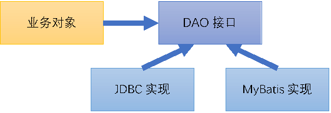
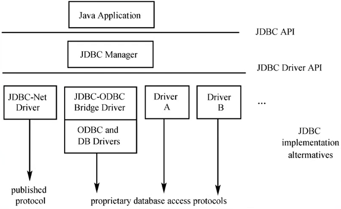
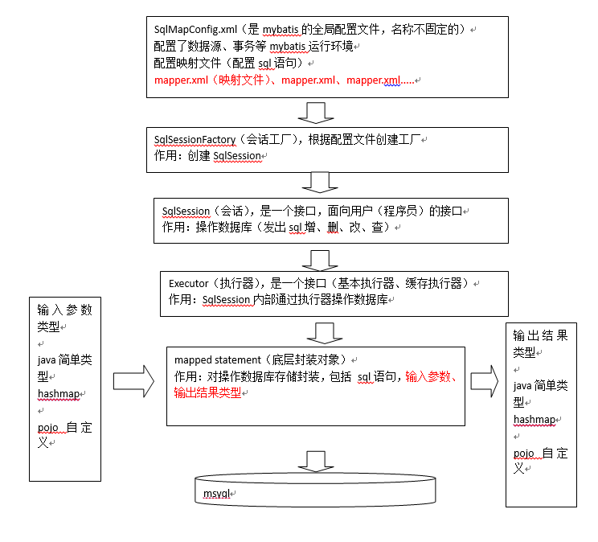

# CSE401 - Spring - ORM

返回[Bulletin](./bulletin.md)

返回[CSE401 - Spring](./CSE401.md)

[TOC]

## 基本概念

### DAO

DAO(Data Access Object)数据访问相关接口，可以屏蔽数据库底层差异。



### ORM

ORM(Object Relation Mapping)对象关系映射。

### 静态SQL

在编译阶段就可以确定数据库要做什么事情。在某种高级语言中，如果嵌入了SQL语句，而这个SQL语句的主体结构已经明确，

例如在Java的一段代码中有一个待执行的SQL“select * from t1 where c1>5”，在Java编译阶段，就可以将这段SQL交给数据库管理系统去分析，数据库软件可以对这段SQL进行语法解析，生成数据库方面的可执行代码，这样的SQL称为静态SQL。

在SQL中如果某些参数没有确定，如"select * from t1 where c1>? and c2<?"，这种语句是静态SQL，不是动态SQL，虽然个别参数的值不知道，但整个SQL的结构已经确定，数据库是可以将它编译的，在执行阶段只需将个别参数的值补充进来即可。

### 动态SQL

而如果嵌入的SQL没有明确给出，如在Java中定义了一个字符串类型的变量sql：String sql;，然后采用preparedStatement对象的execute方法去执行这个sql，该sql的值可能等于从文本框中读取的一个SQL或者从键盘输入的SQL，但具体是什么，在编译时无法确定，只有等到程序运行起来，在执行的过程中才能确定，这种SQL叫做动态SQL。

例如每一种数据库软件都有能够执行SQL语句的界面，那个界面接收的SQL就是动态SQL，因为数据库厂商在做这个界面时，并不知道用户会输入哪些SQL，只有在该界面执行后，接收了用户的实际输入，才知道SQL是什么。

## JDBC

JDBC API 允许用户访问任何形式的表格数据，尤其是存储在关系数据库中的数据。

### 执行流程

- 连接数据源，如：数据库。
- 为数据库传递查询和更新指令。
- 处理数据库响应并返回的结果。

### 架构



### SPI机制

SPI (Service Provider Interface) 是JDK内置的一种动态替换发现机制， 数据库DriverManager, Spring, ConfigurableBeanFactory等都用到了SPI机制。

以DriverManager接口为例，DriverManager是jdbc里管理和注册不同数据库driver的工具类。我们在运用Class.forName("com.mysql.jdbc.Driver")加载mysql驱动后，就会执行其中的静态代码把driver注册到DriverManager中，以便后续的使用。不同厂商可以针对同一Driver接口做出不同的实现，而Java的SPI机制可以为接口寻找服务实现。 

### JDBC URL

*协议:子协议://子名称（主机:端口/数据库）*

jdbc:mysql://<ip>:<port>/database

jdbc:oracle:thin:@<ip>:<port>:database

jdbc:microsoft:sqlserver://<ip>:<port>;/database

### DataSource

DataSource类代表了数据源，非Spring独有，来自javax.sql包。包括以下参数：

- 驱动类名

- 连接地址

- 用户名

- 密码

可以通过调用getConnection()方法获取连接。

#### DriverManagerDataSource

每次调用getConnection()方法时都会创建新的连接。

#### BasicDataSource

由Apache提供，具有线程池的功能。

### JdbcTemplate

JDBC已经能够满足大部分用户最基本的需求，但是在使用JDBC时，必须自己来管理数据库资源如：获取PreparedStatement，设置SQL语句参数，关闭连接等步骤。

**JdbcTemplate**来自org.springframework.jdbc.core包，是Spring对JDBC的封装，处理了资源的建立和释放，目的是使JDBC更加易于使用。

```java
public class JdbcExampleDao {
    
    private JdbcTemplate jdbcTemplate;
    
    @Autowired
    public void setDataSource(DataSource dataSource) {
        this.jdbcTemplate = new JdbcTemplate(dataSource);
    }
    
    // execute可以执行所有SQL语句，因为没有返回值，一般用于执行DDL语句。
    public void execute(final String sql) {}
    
    // JDBCTemplate添加数据
	public static void test01() throws Exception {
		JdbcTemplate jdbcTemplate = new JdbcTemplate(DataSourceUtils.getDataSource());
		String sql = "INSERT INTO product VALUES (NULL, ?, ?);";
		jdbcTemplate.update(sql, "iPhone3GS", 3333);
	}
	// JDBCTemplate修改数据
	public static void test02() throws Exception {
		JdbcTemplate jdbcTemplate = new JdbcTemplate(DataSourceUtils.getDataSource());
		String sql = "UPDATE product SET pname=?, price=? WHERE pid=?;";
		int i = jdbcTemplate.update(sql, "XVIII", 18888, 10);
		System.out.println("影响的行数: " + i);
	}
	// JDBCTemplate删除数据
	public static void test03() throws Exception {
		JdbcTemplate jdbcTemplate = new JdbcTemplate(DataSourceUtils.getDataSource());
		String sql = "DELETE FROM product WHERE pid=?;";
		int i = jdbcTemplate.update(sql, 7);
		System.out.println("影响的行数: " + i);
	}

    // queryForInt返回一个整数
    public static void test01() throws Exception {
       // String sql = "SELECT COUNT(*) FROM product;";
       String sql = "SELECT pid FROM product WHERE price=18888;";
       JdbcTemplate jdbcTemplate = new JdbcTemplate(DataSourceUtils.getDataSource());
       int forInt = jdbcTemplate.queryForInt(sql);
       System.out.println(forInt);
    }
    // queryForLong  返回一个long类型整数
    public static void test02() throws Exception {
       String sql = "SELECT COUNT(*) FROM product;";
       // String sql = "SELECT pid FROM product WHERE price=18888;";
       JdbcTemplate jdbcTemplate = new JdbcTemplate(DataSourceUtils.getDataSource());
       long forLong = jdbcTemplate.queryForLong(sql);
       System.out.println(forLong);
    }
    // queryForObject  返回一个指定类型对象
    public static void test03() throws Exception {
       String sql = "SELECT pname FROM product WHERE price=7777;";
       JdbcTemplate jdbcTemplate = new JdbcTemplate(DataSourceUtils.getDataSource());
       String str = jdbcTemplate.queryForObject(sql, String.class);
       System.out.println(str);
    }
    // queryForMap  返回一个Map对象
    public static void test03() throws Exception {
       String sql = "SELECT pname FROM product WHERE price=7777;";
       JdbcTemplate jdbcTemplate = new JdbcTemplate(DataSourceUtils.getDataSource());
       String str = jdbcTemplate.queryForObject(sql, String.class);
       System.out.println(str);
    }
    // queryForList  返回一个List对象
    public static void test05() throws Exception {
       String sql = "SELECT * FROM product WHERE pid<?;";
       JdbcTemplate jdbcTemplate = new JdbcTemplate(DataSourceUtils.getDataSource());
       List<Map<String, Object>> list = jdbcTemplate.queryForList(sql, 8);
       for (Map<String, Object> map : list) {
          System.out.println(map);
       }
    }
    // query使用rowMap做映射返回一个对象
    public static void test06() throws Exception {
        JdbcTemplate jdbcTemplate = new JdbcTemplate(DataSourceUtils.getDataSource());
       // 查询数据的SQL语句
       String sql = "SELECT * FROM product;";
       List<Product> query = jdbcTemplate.query(sql, new RowMapper<Product>() {
          @Override
          public Product mapRow(ResultSet arg0, int arg1) throws SQLException {
             Product p = new Product();
             p.setPid(arg0.getInt("pid"));
             p.setPname(arg0.getString("pname"));
             p.setPrice(arg0.getDouble("price"));
             return p;
          }
       });
       for (Product product : query) {
          System.out.println(product);
       }
    }
    // query使用BeanPropertyRowMapper做映射返回对象
    public static void test07() throws Exception {
        JdbcTemplate jdbcTemplate = new JdbcTemplate(DataSourceUtils.getDataSource());
        // 查询数据的SQL语句
        String sql = "SELECT * FROM product;";
        List<Product> list = jdbcTemplate.query(sql, new BeanPropertyRowMapper<>(Product.class));
        for (Product product : list) {
            System.out.println(product);
        }
    }
}
```

####  NamedParameterJdbcTemplate

不通过使用通配符?进行定义参数，而是使用参数的名称进行定义。

## MyBatis

MyBatis是一个半ORM（对象关系映射）框架，项目前身是apache基金会下的一个开源项目iBatis. 内部封装了JDBC，不需要花费精力去处理加载驱动、创建连接、创建statement等繁杂的过程，开发时支持自定义SQL, 存储过程和高级映射。

MyBatis可以使用XML或注解来配置和映射原生信息，将POJO映射成数据库中的记录，避免了几乎所有的JDBC代码和手动设置参数以及获取结果集。

### 架构

- 接口层
  - 数据查询接口
  - 数据新增接口
  - 数据更新接口
  - 数据删除接口
  - 获取配置接口
- 数据处理层
  - 参数映射
    - 参数映射配置
    - 参数映射解析
    - 参数类型解析
  - SQL解析
    - SQL获取
    - SQL解析
    - 动态SQL
  - SQL执行
    - SimpleExecutor
    - BatchExecutor
    - ReuseExecutor
  - 结果映射
    - 结果映射配置
    - 结果类型转换
    - 结果数据拷贝
- 基础支持层
  - 连接管理
  - 事务管理
  - 配置加载
  - 缓存处理
  - 配置框架

### 优势

相比JDBC减少了大量代码量，减少冗余代码。

使用灵活，SQL语句写在XML里，从程序代码中彻底分离，降低了耦合度，便于管理。

提供XML标签，支持编写动态SQL语句。

提供映射标签，支持对象与数据库的ORM字段映射关系。

### 劣势

SQL语句编写工作量较大，尤其是字段和关联表多时。

SQL语句依赖于数据库，导致数据库移植性差，不能随意更换数据库。

### 运行流程



### #{} VS ${}

${}是Properties文件中的变量占位符，它可以用于标签属性值和sql内部，属于静态文本替换，比如${driver}会被静态替换为com.mysql.jdbc.Driver. 相当于使用字符串拼接，存在SQL注入的风险。

\#{}是sql的参数占位符，Mybatis会将sql中的#{}替换为?号，在sql执行前会使用PreparedStatement的参数设置方法，按序给sql的?号占位符设置参数值，比如preparedStatement.setInt(0, parameterValue)。相当于使用占位符，可以防止SQL注入.

## Hibernate

- Hibernate对JDBC访问数据库的代码做了封装，大大简化了繁琐的访问数据层的重复性代码。

- Hibernate使用java的反射机制，而不是字节码增强程序类实现透明性。

- Hibernate是一个轻量级框架，映射的灵活性很出色。它支持很多关系型数据库，从一对一到多对多的各种复杂关系。

- Hibernate本身性能并不是很好，存在很多优化手段 （一级缓存、二级缓存、查询缓存、抓取策略）。

## Mybatis VS Hibernate

**灵活性**

MyBatis更加灵活，自己可以写SQL语句，使用起来比较方便。

**可移植性**

MyBatis有很多自己写的SQL，因为每个数据库的SQL可以不相同，所以可移植性比较差。

**学习和使用门槛**

MyBatis入门比较简单，使用门槛也更低。

**二级缓存**

Hibernate拥有更好的二级缓存，它的二级缓存可以自行更换为第三方的二级缓存。

