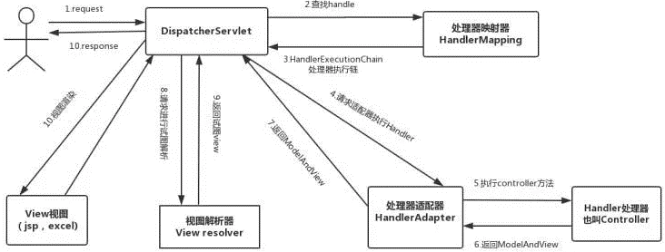
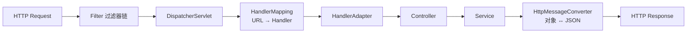
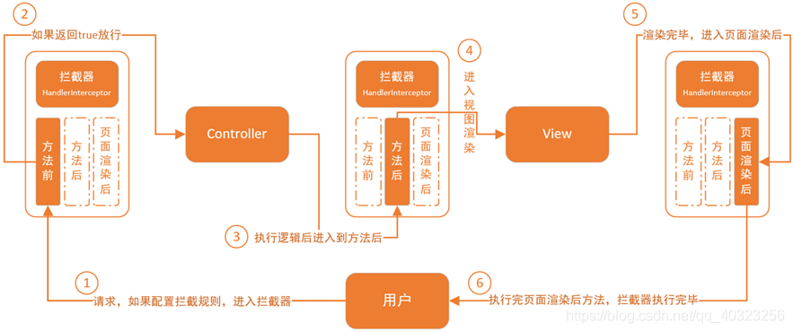
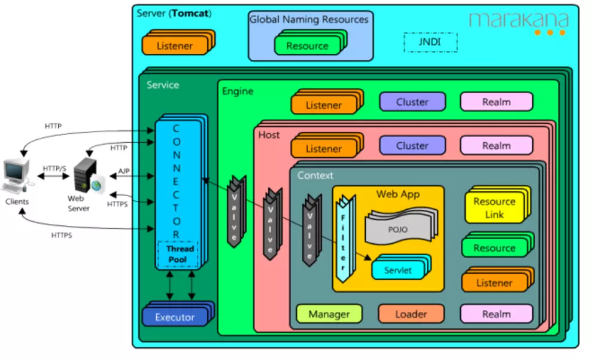
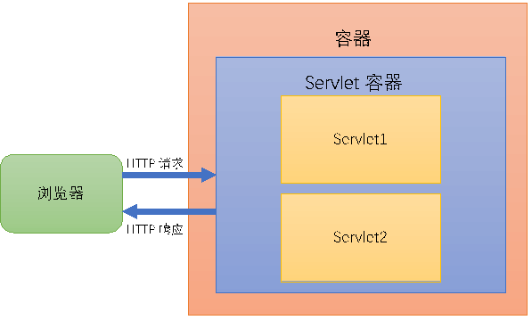
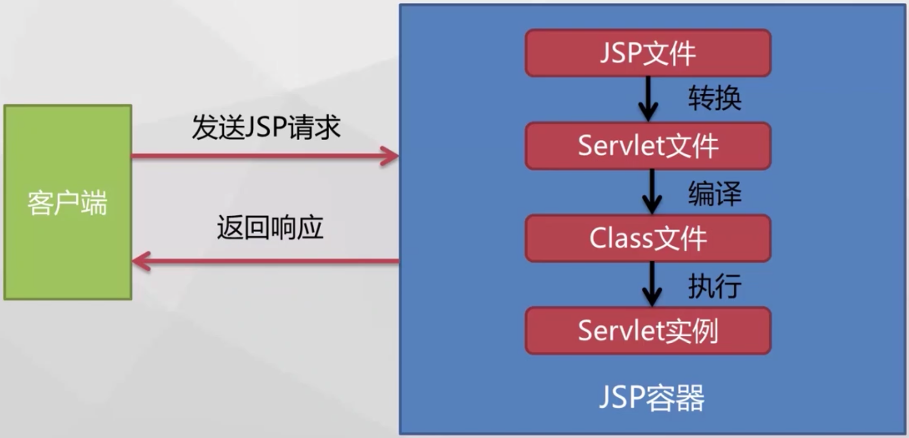
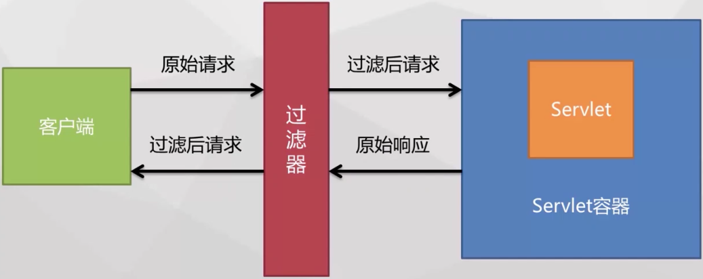
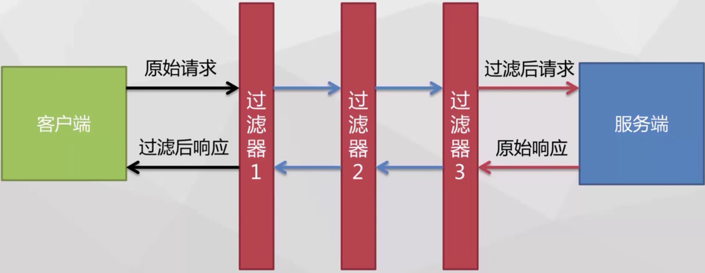
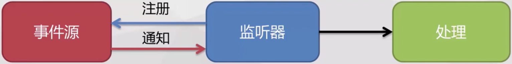

# CSE401 - Spring Ecosystem - Spring Web & MVC

返回[Bulletin](./bulletin.md)

返回[CSE401 - Spring Ecosystem](./CSE401.md)

[TOC]

> Spring MVC 不是过时技术：它仍是 Java 后端构建 HTTP API / 服务端渲染的主流框架（Spring Boot 3 中基于 Jakarta Servlet）。本章正文聚焦现代主战链路；Tomcat/Servlet/JSP/web.xml/WAR 等经典 Java Web 教程内容完整保留在 [Appendix — Classical Java Web](#appendix--classical-java-web--servlet--jsp)。

## Servlet 模型最小背景

理解 Spring MVC 的底层仍然是 Servlet 模型，一句话版本：

- Web 容器（Tomcat/Jetty/Undertow）监听端口、解析 HTTP 报文，封装为 `HttpServletRequest`/`HttpServletResponse`。
- 每个请求路由到某个 Servlet 的 `service()` 方法处理；Servlet 默认单例，由容器管理生命周期。
- 过滤器（Filter）在请求进入 Servlet 前后做横切处理。
- Spring Boot 把这套容器**内嵌**进应用（默认 Tomcat），不再打 WAR 部署。

Servlet/JSP 的详细教程（生命周期、web.xml、九大内置对象等）见 Appendix。

## DispatcherServlet 前端控制器

`DispatcherServlet` 是 Spring MVC 的**统一入口**——一个特殊的 Servlet（Spring Boot 3 中基于 `jakarta.servlet`），`/` 映射下所有请求都先到它，再由它协调各组件完成处理。

它的价值：把"接收请求 → 找处理器 → 执行 → 渲染响应"的编排逻辑集中到一处，让 Controller 只写业务，组件间解耦、可替换。

初始化时机：容器启动（或 Spring Boot 内嵌容器启动）时，`DispatcherServlet` 随 Servlet WebApplicationContext 一起初始化，扫描并注册所有 `@RequestMapping` 方法。

## Spring MVC 请求处理流程



现代核心链路（面试按这条主线讲）：


```mermaid
flowchart LR
    A[HTTP Request] --> B[Filter 过滤器链]
    B --> C[DispatcherServlet]
    C --> D[HandlerMapping<br/>URL → Handler]
    D --> E[HandlerAdapter]
    E --> F[Controller]
    F --> G[Service]
    G --> H[HttpMessageConverter<br/>对象 ↔ JSON]
    H --> I[HTTP Response]
```

**初始化**

0. Web容器启动时，通知Spring初始化容器，加载Bean的定义信息并初始化所有单例Bean. 然后遍历容器中的Bean, 获取每一个Controller中方法访问的URL，将URL和Controller对应保存到一个Map集合中。

**捕获**

1. 用户传入的所有的请求会转发给DispatcherServlet前端处理器（负责接收请求并转发给对应的处理组件）处理。

**查找Handler**

2. DispatcherServlet会请求HandlerMapping处理器映射器找出容器中被@Controller注解修饰的Bean以及被@RequestMapping修饰的方法和类

3. 生成Handler处理器（用于完成具体业务逻辑的Servlet）和HandlerInterceptor处理器拦截器（用于拦截处理的接口），以 HandlerExecutionChain处理器执行链的形式返回。

**执行Handler**

4. DispatcherServlet根据获得的Handler，选择一个合适的HandlerAdapter处理器适配器（用于封装数据到JavaBean）。
5. HandlerAdapter提取Request中的模型数据，执行Handler(Controller).
6. Handler执行完成后，向HandlerAdapter返回ModelAndView装载模型数据和视图信息对象。
7. ModelAndView对象经过HandlerAdapter返回给DispatcherServlet.

**选择ViewResolver**

8. DispatcherServlet根据返回的ModelAndView，选择一个适合的ViewResolver视图解析器（将逻辑视图解析为物理视图）, 这个ViewResolver必须已经注册到Spring容器中。

**渲染返回**

9. ViewResolver对得到的ModelAndView逻辑视图进行解析，得到View物理视图。

10. DispatcherServlet渲染结果。

11. DispatcherServlet将渲染结果返回给客户端。

> 现代补充：`@ResponseBody`/`@RestController` 场景下没有视图解析这一步——返回值直接经 `HttpMessageConverter` 序列化写回响应体（`RequestResponseBodyMethodProcessor` 处理）。前后端分离 API 是 2026 年的主流形态，"渲染视图"仅在服务端模板（Thymeleaf/JSP）场景出现。

### HandlerMapping 与 HandlerAdapter

- **HandlerMapping**：解析"请求 → Handler"的映射。现代默认实现 `RequestMappingHandlerMapping`，启动时扫描 `@RequestMapping` 建立映射表，运行期返回 `HandlerExecutionChain`（Handler + 拦截器链）。
- **HandlerAdapter**：执行 Handler 的适配器。为什么需要适配器？Handler 的形态多样（`@RequestMapping` 方法、老式 `Controller` 接口、`HttpRequestHandler` 等），适配器把"参数解析、类型转换、返回值处理"统一封装，`DispatcherServlet` 无需关心具体形态。现代默认 `RequestMappingHandlerAdapter`。

## Controller 与参数绑定

```java
@RestController
@RequestMapping("/users")
public class UserController {

    @GetMapping("/{id}")
    public User getUser(@PathVariable Long id) { ... }

    @GetMapping
    public List<User> list(@RequestParam(defaultValue = "1") int page,
                           @RequestParam(defaultValue = "20") int size) { ... }

    @PostMapping
    public User create(@RequestBody User user) { ... }
}
```

常用参数绑定注解：

| 注解 | 来源 | 说明 |
| --- | --- | --- |
| `@PathVariable` | URL 路径段 | REST 风格资源 ID |
| `@RequestParam` | 查询串/表单 | 单值参数，支持默认值 |
| `@RequestBody` | 请求体 | 由 HttpMessageConverter 反序列化 |
| `@RequestHeader` / `@CookieValue` | 头 / Cookie | 元信息 |
| 无注解 POJO | 查询串/表单 | 按属性名自动绑定（`@ModelAttribute` 语义） |

`@RestController` = `@Controller` + `@ResponseBody`：类内所有方法返回值都走消息转换器而非视图。

## HttpMessageConverter

`@RequestBody`/`@ResponseBody`（及 `@RestController`）的序列化机制：

- HandlerAdapter 对标注了 `@ResponseBody` 的返回值（或带 `@RequestBody` 的参数）委托给 `HttpMessageConverter`。
- 转换器按 **`Content-Type`/`Accept` 协商**选择：请求头 `Content-Type: application/json` 选择能读 JSON 的转换器；`Accept` 决定响应格式。
- JSON 的默认实现是 `MappingJackson2HttpMessageConverter`（Jackson），引入 `jackson-datatype-jsr310` 后支持 `java.time` 类型。
- 常见故障：406（服务端无法产出 `Accept` 要求的格式）、415（请求体 `Content-Type` 无转换器可读）、自定义 `ObjectMapper` 未生效（new 了新实例绕过 Spring 容器中的定制）。

## 拦截器与过滤器

### 拦截器 Interceptor

SpringMVC拦截器可以按照一定规则拦截请求并进行处理，需要实现HandlerInterceptor接口并在SpringMVC配置文件中进行配置。

可以配置多个拦截器，配置的顺序会影响到拦截器的执行顺序，配置在前的先执行。

拦截器也体现了AOP思想，可以应用于应用：权限检查，日志记录，性能检测等。



HandlerInterceptor有3个方法：

- preHandle 预处理：
  - 在拦截方法前执行；
  - 根据拦截器定义的顺序，**正向**执行。

- postHandle 后处理：
  - 在拦截方法后执行；
  - 根据拦截器定义的顺序，**逆向**执行。
  - 需要所有的preHandle都返回true时才会调用。

- afterCompletion 渲染后处理：
  - 在页面渲染后执行；
  - 根据拦截器定义的顺序，**逆向**执行。
  - preHandle返回true就会调用。

现代注册方式（Spring Boot，替代老式 XML `<mvc:interceptors>`）：

```java
@Configuration
public class WebConfig implements WebMvcConfigurer {
    @Override
    public void addInterceptors(InterceptorRegistry registry) {
        registry.addInterceptor(new LogInterceptor())
                .addPathPatterns("/**")
                .excludePathPatterns("/health");
    }
}
```

老式 XML 配置：

```xml
<!-- 配置SpringMvc的拦截器 -->
<mvc:interceptors>
    <!-- 配置一个拦截器的Bean就可以了 默认是对所有请求都拦截 -->
    <bean id="myInterceptor" class="com.et.action.MyHandlerInterceptor"></bean>
    <!-- 只针对部分请求拦截 -->
    <mvc:interceptor>
        <mvc:mapping path="/modelMap.do" />
        <bean class="com.et.action.MyHandlerInterceptorAdapter" />
    </mvc:interceptor>
</mvc:interceptors>
```

```java
public class MyInterceptor1 implements HandlerInterceptor {
 	@Override
	public boolean preHandle(HttpServletRequest request, HttpServletResponse response, Object handler)
			throws Exception {
		System.out.println("1 PreHandle预处理");
		return true;
	} 
	@Override
	public void postHandle(HttpServletRequest request, HttpServletResponse response, Object handler,
			ModelAndView modelAndView) throws Exception {
		System.out.println("1 postHandle后处理");
	}
	@Override
	public void afterCompletion(HttpServletRequest request, HttpServletResponse response, Object handler, Exception ex)
			throws Exception {
		System.out.println("1 afterCompletion页面渲染后处理");
	}
}
```

### Filter vs Interceptor 对比

| 维度 | Filter 过滤器 | Interceptor 拦截器 |
| --- | --- | --- |
| 规范 | Servlet 规范（容器级） | Spring MVC 机制 |
| 作用范围 | 几乎所有请求（含静态资源、非 DispatcherServlet 请求） | 只拦截进入 DispatcherServlet 的 Handler 请求 |
| 执行时机 | DispatcherServlet **之前/之后**（链两端） | Handler 执行前后、渲染完成后 |
| 能否感知 Handler | 不能 | 能（可拿到 HandlerMethod、注解元数据） |
| 典型用途 | 编码、CORS、安全过滤、请求体包装（日志） | 登录态/权限、操作日志、接口耗时 |

经验法则：与业务请求语义无关的底层处理放 Filter；需要感知 Controller 方法（鉴权按方法注解）放 Interceptor。

## Bean Validation：@Valid / @Validated

- 依赖 `spring-boot-starter-validation`（Jakarta Bean Validation，实现为 Hibernate Validator；注意与 ORM 的 Hibernate 无关）。
- 在 POJO 字段上标注约束：`@NotNull`、`@Size`、`@Email`、`@Min` 等（`jakarta.validation.constraints` 包）。
- Controller 参数上标注 **`@Valid`** 触发校验；校验失败抛 `MethodArgumentNotValidException`（HTTP 400）。

```java
public class CreateUserRequest {
    @NotBlank
    private String loginName;
    @Email
    private String email;
    @Min(18)
    private Integer age;
}

@PostMapping("/users")
public User create(@RequestBody @Valid CreateUserRequest req) { ... }
```

`@Valid` 与 `@Validated` 的区别：

- `@Valid`：Jakarta 标准注解，用于触发嵌套对象级联校验（字段上再标 `@Valid`）。
- `@Validated`：Spring 注解，额外支持**分组校验**（group），以及非 Controller Bean 的方法级参数校验（配合 `MethodValidationPostProcessor`）。

## 全局异常处理：@ControllerAdvice / @ExceptionHandler

分散在每个 Controller 里 try-catch 是反模式；集中处理：

```java
@RestControllerAdvice
public class GlobalExceptionHandler {

    @ExceptionHandler(MethodArgumentNotValidException.class)
    public ErrorResponse handleValidation(MethodArgumentNotValidException ex) {
        String msg = ex.getBindingResult().getFieldErrors().stream()
                .map(e -> e.getField() + " " + e.getDefaultMessage())
                .collect(Collectors.joining("; "));
        return new ErrorResponse(400, msg);
    }

    @ExceptionHandler(BusinessException.class)
    public ErrorResponse handleBusiness(BusinessException ex) {
        return new ErrorResponse(ex.getCode(), ex.getMessage());
    }
}
```

要点：`@RestControllerAdvice` = `@ControllerAdvice` + `@ResponseBody`；可按异常类型精确匹配（子类优先）；未被捕获的异常最终由容器/Spring Boot 的 `/error` 兜底（`ErrorController`）。

## REST API

- 资源化 URL + HTTP 动词语义：`GET /users`（列表）、`GET /users/{id}`（详情）、`POST /users`（创建）、`PUT /users/{id}`（全量更新）、`PATCH`（部分更新）、`DELETE /users/{id}`。
- `GET`/`PUT`/`DELETE` 语义上幂等，`POST` 不幂等——重试策略据此判断（与微服务可靠性呼应）。
- 状态码用语义化的：400 参数错、401/403 认证授权、404 不存在、409 冲突、5xx 服务端错。
- 版本化：URL 前缀（`/v1/`）或 `Accept` 头（内容协商）。

## Spring MVC vs WebFlux（理解层）

| 维度 | Spring MVC（Servlet 栈） | WebFlux（Reactive 栈） |
| --- | --- | --- |
| 底层 | Servlet API（Tomcat/Jetty，阻塞式） | Reactor + Netty（非阻塞） |
| 编程模型 | 同步阻塞，一请求一线程（线程池） | 事件循环 + 少量线程，返回 `Mono/Flux` |
| 优势 | 生态成熟、调试直观、绝大多数场景够用 | IO 密集高并发（网关、长连接/SSE）下线程利用率高 |
| 代价 | 线程数限制吞吐上限 | 全链路不能有阻塞调用，学习/排障成本高 |
| 选择 | **默认选择** | 明确的 IO 密集 + 团队具备响应式经验时 |

关键理解：WebFlux 的收益来自"少线程扛多 IO"，一旦链路中混入阻塞调用（JDBC、锁等待），事件循环被卡死，吞吐反而崩塌。Spring Cloud Gateway 即基于 WebFlux。虚拟线程（JDK 21+，Spring Boot 3.2+ `spring.threads.virtual.enabled=true`）让阻塞式 MVC 也能以极低线程成本扛海量 IO，进一步压缩了 WebFlux 的适用面。

## Appendix — Classical Java Web / Servlet / JSP

以下为经典 Java Web / Servlet / JSP 教程内容，作为 Spring MVC 的技术背景保留。历史上正确；现代 Spring Boot 工程已不再手写这些配置。

### Tomcat 结构



**Server**

Tomcat的顶级组件，位于整个配置的最外层，代表Tomcat的运行实例。

维护一至多个Service的生命周期，包括如何初始化，如何结束服务，如何找到别人请求的服务。让其它程序可以访问到这个Service集合。

**Service**

维护一个Container和多个Connector并将其关联，提供各种服务。

**Connector**

Connector组件是可选择替换的，负责接收浏览器发过来的TCP连接请求，创建Request/Response,分配线程，将创建的对象传递给Container来处理请求。

**Container**

容器的父接口，由四个容器组成：Engine, Host, Context, Wrapper.

其中Engine包含Host，Host包含Context，Context包含Wrapper.

**Engine**

顶级Container组件，相当于一个Container的门面。

**Host**

代表一个虚拟主机，这个主机可以运行多个应用，他负责安装和展开这些应用，并且标识这个应用以便能够区分他们。

Host不是必需的，但是要运行 war程序，就必须要使用Host，因为在war中必有web.xml文件，这个文件解析就需要Host，如果有多个Host就需要定义一个top容器 Engine，而Engine没有父容器，一个Engine就代表一个完整的Servlet引擎。

**Context**

管理Servlet实例，具备Servlet运行的基本环境。

**Wrapper**

代表一个Servlet，它负责管理Servlet，包括装载，初始化，执行以及资源回收。它是最底层的容器。

### Tomcat 请求处理流程

以客户端访问http://localhost:8080/TestWeb/index.jsp为例：

- 浏览器将请求发送给本机8080端口。
- 侦听该端口的Connector接受请求，将该请求发给它本身所在的Service所在的Engine来处理，并等待Engine来回应。
  - Engine获得请求localhost:8080/TestWeb/index.jsp, 匹配它所有的虚拟主机Host, 把请求交给别名为localhost的Host. 如果没有匹配的就交给默认Host.
    - localhost Host获得请求/TestWeb/index.jsp，匹配它所拥有的所有Context, 把请求交给路径为/TestWeb的Context. 如果没有匹配到就交给请求路径名为""的context处理。
      - path="/testWeb"的Context获得请求"/index.jsp", 在它的mapping table寻找对应的Servlet.
      - 匹配到URL PATTERN为*.jsp的Servlet, 对应于JspServlet类.
      - 构造HttpServletRequest对象和HttpServletResponse对象作为参数,调用JspServlet的doGet()方法和doPost()方法.
      - Context把执行后返回的HttpServletResponse对象返回给Host.
    - Host把HttpServletResponse对象返回给Engine. 
  - Engine把HttpServletResponse对象返回给Connector.
- Connector把HttpServletResponse对象返回给浏览器的Browser.

### forward 转发 vs redirect 重定向

#### 转发（forward）

**转发**（forward）将当前的request和response对象交给指定的web组件处理，可以共享request里的数据，不能跨web应用或服务器，URL不会改变。

一次请求，一次响应。效率更高。

#### 重定向（redirect）

**重定向**（redirect）就是通过response对象发送给浏览器一个新URL地址让其重新请求，不能共享request里的数据，能跨web应用和服务器，URL会改变。

两次请求、两次响应。效率更低。

### Tomcat 参数优化

修改Tomcat的bin/catalina.sh里的JAVA_OPTS属性，例如"-Xms4096m -Xmx4096m -Xss1024K"

### Web 应用结构

- webapp（公共资源部分，用户可以通过URL访问到的静态资源）
  - css
  - js
  - images
  - html（静态页面）
  - META-INF（jar包的元信息，其中必有一个MANIFEST.MF文件，主要定义与扩展和包相关的数据）
  - WEB-INF（Web应用的核心部分，专用区，不提供给用户直接访问）
    - classes（应用自身的类文件与资源）
    - lib（应用依赖的jar包）
    - web.xml（部署描述符，XML文件，用来设置web应用程序的组件部署信息，受到Servlet容器支持）

### Servlet

$$
Servlet = Server + Applet
$$

一个Servlet就是一个提供基于请求-响应模式的Web服务的Java类。



#### 生命周期

##### 类装载过程

- 默认情况下，当收到第一个对该servlet的请求的时候，此servlet实例被初始化。
- 容器启动时初始化。
- 手动设置为在服务器启动时加载此servlet, load-on-startup标签代表加载的**优先级顺序**（整数，数值越小越先加载）。

```xml
<servlet>
    <servlet-name>Xxx</servlet-name>
    <servlet-class>com.lingz.Xxx</servlet-class>
    <load-on-startup>1</load-on-startup>
</servlet>
```

- 更新Servlet类文件后初始化。

##### 初始化过程

Servlet实例一创建出来，便调用init(ServletConfig var1)进行初始化，其中的ServletConfig参数对象携带了该servlet的配置信息，比如初始化参数，此ServletConfig参数由服务器创建。

在web.xml配置具体参数，就不需要在Servlet类中添加、修改。

```xml
<servlet>
    <servlet-name>Xxx</servlet-name>
    <servlet-class>com.lingz.Xxx</servlet-class>
    <!--两个自定义的初始化参数-->
    <init-param>
        <param-name>value1</param-name>
        <param-value>key1</param-value>
    </init-param>
    <init-param>
        <param-name>value2</param-name>
        <param-value>key2</param-value>
    </init-param>
</servlet>
```

init(ServletConfig var1) 在Servlet生命周期中，只执行一次。并且是单线程执行，不需要担心多线程安全。执行时通过ServletConfig类提供的getInitParameter(String name)获取以上初始化参数：

```java
public interface ServletConfig {
    String getServletName();
    ServletContext getServletContext();
    String getInitParameter(String var1);
    Enumeration<String> getInitParameterNames();
}
```

##### 服务过程

容器根据配置将接收到的请求交给对应的Servlet, 同时创建HttpServletRequest和HttpServletResponse对象。Servlet调用service(), service()根据请求调用doGet()/doPost(). 处理后通过HttpServletResponse获得相应信息，返回给Web容器，Web容器再将响应返回给客户端。

Servlet是单例的，当多个请求请求同一个servlet时，在某些情况下需要主要注意线程安全：

- 如果service()方法没有访问Servlet的成员变量也没有访问全局的资源比如静态变量、文件、数据库连接等，而是只使用了当前线程自己的资源，比如非指向全局资源的临时变量、request和response对象等，那么该方法本身就是线程安全的，不必进行任何的同步控制。

- 如果service()方法访问了Servlet的成员变量，但是对该变量的操作是只读操作，那么该方法本身就是线程安全的，不必进行任何的同步控制。

- 反之，如果对于全局资源有写的操作，通常需要加上同步控制语句。

##### 销毁过程

当web服务器认为此Servlet没有存在的必要、类重新加载、服务器关闭、长时间未被访问时，则Servlet可以从内存中销毁。web服务器保证该方法被调用时已经结束了请求调用的service(), 或等待剩余的请求执行完，并且不会再接收请求，然后即可调用destroy()并进行内存回收。

### JSP

JSP(Java Server Page)是Sun公司设计的一种动态网页技术标准，可以被理解为简化的Servlet.

JSP是在传统的HTML网页文件中插入了Java程序段和JSP标记，从而形成的文件。



#### 基本语法

**JSP声明**

一个声明语句可以声明一个或多个变量或方法，供后面的Java代码使用。

```jsp
<%! Declaration; [ deckaration; ]+ … %>
<%! Int a, b, c; %>
```

**JSP表达式**

表达式元素中可以包含任何符合Java语言规范的表达式，但是不能使用分号来结束表达式。

```jsp
<%= 表达式 %>
<p> Today's date: <%= (new java.util.Date()).toLocaleString()%> </p>
```

**JSP脚本**

脚本程序可以包含任意量的Java语句、变量、方法或表达式。

```jsp
<% 代码片段 %>
<% out.println("Your IP address is " + request.getRemoteAddr()); %>
```

**JSP注释**

JSP注释主要为代码作注释以及将某段代码注释掉。

```jsp
<%-- 注释 --%>
```

**JSP指令**

page指令：定义页面的依赖属性，比如脚本语言、error页面、缓存需求等等。

include指令：包含其他文件。

taglib指令：引入标签库的定义。

**JSP内置对象**

request：HttpServletRequest类的实例。

response：HttpServletResponse类的实例。

session：HttpSession类的实例。

application：ServletContext类的实例，与应用上下文有关。

out：PrintWriter类的实例，用于把结果输出到网页上。

config：ServletConfig类的实例。

pageContext：PageContext类的实例。

page：JspPage类的实例。

exception：JspException类的实例。

#### JSP 作用域

**page**

代表与一个页面相关的对象和属性。

**request**

代表与客户端发出的一个请求相关的对象和属性。一个请求可能跨越多个页面，涉及多个 Web 组件；需要在页面显示的临时数据可以置于此作用域。

**session**

代表与某个用户与服务器建立的一次会话相关的对象和属性。跟某个用户相关的数据应该放在用户自己的 session 中。

**application**

代表与整个 Web 应用程序相关的对象和属性，它实质上是跨越整个 Web 应用程序，包括多个页面、请求和会话的一个全局作用域。

#### JSP VS Servlet

**JSP**

侧重于视图、页面表示。

有内置对象供选择。JSP在静态HTML内容中嵌入Java代码，Java代码被动态执行后生成HTML内，类似在html里面写java代码。

JSP经过容器解释之后就是Servlet.

JSP虽然规避了Servlet在生成HTML内容方面的劣势，但是在HTML中混入大量、复杂的业务逻辑同样也是不可取的。

**Servlet**

侧重于逻辑控制。

没有内置对象。Servlet在Java代码中通过HttpServletResponse对象动态输出HTML内容，类似在java里面写html代码。

Servlet是一个完整的Java类。

Servlet能够很好地组织业务逻辑代码，但是在Java源文件中通过字符串拼接的方式生成动态HTML内容会导致代码维护困难、可读性差。

### 过滤器与监听器

#### 过滤器

用于对用户请求进行预处理、和对响应进行后处理的web应用组件。

过滤请求与响应，可以自定义过滤规则。

应用场景包括：用户认证、解编码处理、数据压缩处理等。





#### 监听器



监听事件发生，在事件发生前后能够做出相应处理的web应用组件。按照被监听对象可以将监听器分为以下三大类：

- 监听应用程序环境 ServletContext
  - ServletContextListener 监听对象创建与销毁
  - ServletContextAttributeListener 监听对象属性的变化

- 监听用户请求对象 ServletRequest
  - ServletRequestListener监听对象创建与销毁
  - ServletRequestAttributeListener监听对象属性的变化

- 监听用户会话对象 HTTPSession 
  - HTTPSessionListener监听对象创建与销毁
  - HTTPSessionAttributeListener监听对象属性的变化
  - HTTPSessionActivationListener 监听HTTPSession持久化到磁盘/加载到JVM
  - HTTPSessionBindingListener 监听对象调用attribute或removeAttribute方法

监听器的应用场景包括：用户登录的统计（统计创建Session），任务触发（监听状态的变化），根据业务需求做其他特殊处理等。

> Spring Boot 中的等价物：`FilterRegistrationBean`/`@WebFilter` + `@ServletComponentScan` 注册过滤器；`OncePerRequestFilter` 是自定义 Filter 的推荐基类；Servlet 监听器的多数用途已由 Spring 事件机制（见 [Spring Framework Core — 事件](./CSE4011.md)）替代。

### 传统 WAR 工程搭建（web.xml 时代）

创建New Maven Project, 选择org.apache.maven.archetypes的maven-archetype-webapp

- {ProjectName}
  - src
    - main
      - resources
      - webapp
        - WEB-INF
          - Web.xml
        - Index.jsp
  - target
  - Pom.xml

在计算机上安装Tomcat, 将安装好的Tomcat以添加Server的形式加入IDE.

在项目属性中的Java Build Path中加入Server Runtime的库，选择Tomcat.

自定义**index.jsp**中的前端内容。

补充**pom.xml**中的Spring依赖信息。

```xml
<!-- https://mvnrepository.com/artifact/org.springframework/spring-core -->
<dependency>
    <groupId>org.springframework</groupId>
    <artifactId>spring-core</artifactId>
    <version>5.3.2</version>
</dependency>
<!-- https://mvnrepository.com/artifact/org.springframework/spring-web -->
<dependency>
    <groupId>org.springframework</groupId>
    <artifactId>spring-web</artifactId>
    <version>5.3.2</version>
</dependency>
<!-- https://mvnrepository.com/artifact/org.springframework/spring-webmvc -->
<dependency>
    <groupId>org.springframework</groupId>
    <artifactId>spring-webmvc</artifactId>
    <version>5.3.2</version>
</dependency>
```

要使用Spring MVC, 需要在**web.xml**项目配置文件中配置其前端控制器{dispatcher-servlet}

- `<listener>`标签中的ContextLoaderListener用来在工程启动时加载上下文环境配置
- `<context-param>`标签中定义了上下文环境配置位于文件dispatcher-servlet.xml
- `<servlet>`标签页配置了Spring的servlet入口（DispatcherServlet）
- `<servlet-mapping>`设置了DispatcherServlet的URL映射规则（`/`）

```xml
<!DOCTYPE web-app PUBLIC
 "-//Sun Microsystems, Inc.//DTD Web Application 2.3//EN"
 "http://java.sun.com/dtd/web-app_2_3.dtd" >

<web-app xmlns:xsi="http://www.w3.org/2001/XMLSchema-instance" xmlns="http://java.sun.com/xml/ns/javaee" xsi:schemaLocation="http://java.sun.com/xml/ns/javaee http://java.sun.com/xml/ns/javaee/web-app_3_0.xsd" id="WebApp_ID" version="3.0">
    <display-name>Archetype Created Web Application</display-name>
     <servlet>
        <servlet-name>dispatcher</servlet-name>
        <servlet-class>
            org.springframework.web.servlet.DispatcherServlet
        </servlet-class>
        <load-on-startup>1</load-on-startup>
    </servlet>
     <servlet-mapping>
        <servlet-name>dispatcher</servlet-name>
        <url-pattern>/</url-pattern>
    </servlet-mapping>
     <context-param>
        <param-name>contextConfigLocation</param-name>
        <param-value>/WEB-INF/dispatcher-servlet.xml</param-value>
    </context-param>
     <listener>
        <listener-class>
            org.springframework.web.context.ContextLoaderListener
        </listener-class>
    </listener>
</web-app>
```

然后在web.xml的同级目录，创建**dispatcher-servlet.xml**文件用来支持HandlerMapping, Controllers, View解析相关，名称要符合{servlet名称}-servlet.xml格式。

控制器的路径在这里被定义为*com.github.ltprc.springmvc.controller*

视图路径在这里被定义为{/WEB-INF/views/*.jsp}

```xml
<?xml version="1.0" encoding="UTF-8"?>
<beans xmlns="http://www.springframework.org/schema/beans"
    xmlns:context="http://www.springframework.org/schema/context"
    xmlns:xsi="http://www.w3.org/2001/XMLSchema-instance"
    xsi:schemaLocation="
http://www.springframework.org/schema/beans
http://www.springframework.org/schema/beans/spring-beans-3.0.xsd
http://www.springframework.org/schema/context
http://www.springframework.org/schema/context/spring-context-3.0.xsd">
    <context:component-scan base-package="com.github.ltprc.springmvc.controller" />
    <bean class="org.springframework.web.servlet.view.InternalResourceViewResolver">
        <property name="prefix">
            <value>/WEB-INF/views/</value>
        </property>
        <property name="suffix">
            <value>.jsp</value>
        </property>
    </bean>
</beans>

```

在指定位置创建HelloWorldController.java

加入注解@Controller让Spring找到这个Controller

加入注解@RequestMapping标注Controller的链接地址

为方法增加注解@RequestMapping设置子目录

```java
import org.springframework.stereotype.Controller;
import org.springframework.web.bind.annotation.RequestMapping;
import org.springframework.web.bind.annotation.RequestParam;
import org.springframework.web.servlet.ModelAndView;

@Controller
public class HelloWorldController {
    String message = "Welcome to Spring MVC!";
    @RequestMapping("/hello")
    public ModelAndView showMessage(
            @RequestParam(value = "name", required = false, defaultValue = "World") String name) {
        System.out.println("in controller");
         ModelAndView mv = new ModelAndView("helloworld");
        mv.addObject("message", message);
        mv.addObject("name", name);
        return mv;
    }
}
```

在/WEB-INF/views/目录下创建helloworld.jsp

```xml
<%@ page language="java" contentType="text/html; charset=ISO-8859-1" pageEncoding="ISO-8859-1"%>
<!DOCTYPE html PUBLIC "-//W3C//DTD HTML 4.01 Transitional//EN" "http://www.w3.org/TR/html4/loose.dtd">
<html>
    <head>
        <meta http-equiv="Content-Type" content="text/html; charset=ISO-8859-1">
        <title>Spring 4 MVC -HelloWorld</title>
    </head>
    <body>
        <center>
            <h2>Hello World</h2>
            <h2>
                ${message} ${name}
            </h2>
        </center>
    </body>
</html>
```

执行Run on server进行测试。

在浏览器输入地址http://localhost:8080/SpringMVC01/访问到HelloWorldController

> Hello World!
