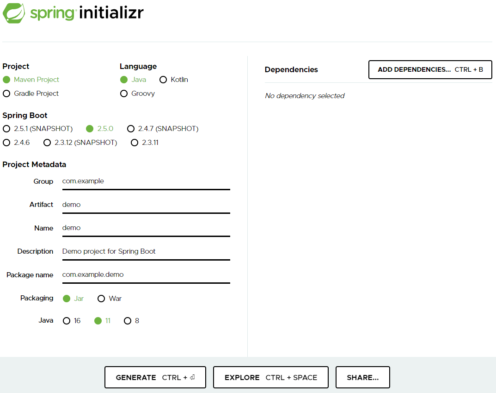

# CSE401 - Spring - Spring Boot

返回[Bulletin](./bulletin.md)

返回[CSE401 - Spring](./CSE401.md)

[TOC]

## 基本介绍

Spring Boot是Spring开源组织下的子项目，Spring组件一站式解决方案。

Spring Boot是用来简化Spring应用的初始搭建以及开发过程的，简化了使用Spring的难度，简省了繁重的配置，提供了各种启动器，开发者能快速上手。Spring Boot使用“习惯优于配置”的理念让项目快速运行起来，使用Spring Boot很容易创建一个独立运行的jar，内嵌servlet容器。

### 核心功能

- Spring Boot项目可以通过命令java -jar xxx.jar以jar包的形式**独立运行**。

- 内嵌**servlet容器**，可以内嵌tomcat, jetty, 或者undertow，这样就可以不用war包形式部署项目。

- Spring提供了一系列starter pom来**简化**maven的**依赖**加载，当使用了 spring-boot-starter-web时，会自动加载所需要的依赖包。

- Spring Boot会根据在类路径的jar包，类，为jar包中的类**自动配置**bean，这样会极大的减少配置的使用。

## Spring Boot启动流程


## Spring Boot实战

登录https://start.spring.io/下载项目代码。

- 选择项目类型、所用语言、Spring Boot版本等信息。
- 选择必须的依赖（例如Spring Web）。



可以仿造Spring MVC的形式，创建Controller类。

```java
@Controller
public class HelloController {
    @RequestMapping("/hello")
    @ResponseBody
    public String hello() {
        return "Hello";
    }
}
```

运行后打印如下日志。

```

  .   ____          _            __ _ _
 /\\ / ___'_ __ _ _(_)_ __  __ _ \ \ \ \
( ( )\___ | '_ | '_| | '_ \/ _` | \ \ \ \
 \\/  ___)| |_)| | | | | || (_| |  ) ) ) )
  '  |____| .__|_| |_|_| |_\__, | / / / /
 =========|_|==============|___/=/_/_/_/
 :: Spring Boot ::                (v2.5.0)

2021-05-24 16:12:01.442  INFO 17368 --- [           main] c.g.ltprc.SpringBootProjectApplication   : Starting SpringBootProjectApplication using Java 15.0.1 on DESKTOP-E2INRCP with PID 17368 (D:\workspace-spring-tool-suite-4-4.9.0.RELEASE\springbootproject\target\classes started by tuoli in D:\workspace-spring-tool-suite-4-4.9.0.RELEASE\springbootproject)
2021-05-24 16:12:01.446  INFO 17368 --- [           main] c.g.ltprc.SpringBootProjectApplication   : No active profile set, falling back to default profiles: default
2021-05-24 16:12:02.273  INFO 17368 --- [           main] o.s.b.w.embedded.tomcat.TomcatWebServer  : Tomcat initialized with port(s): 8080 (http)
2021-05-24 16:12:02.287  INFO 17368 --- [           main] o.apache.catalina.core.StandardService   : Starting service [Tomcat]
2021-05-24 16:12:02.287  INFO 17368 --- [           main] org.apache.catalina.core.StandardEngine  : Starting Servlet engine: [Apache Tomcat/9.0.46]
2021-05-24 16:12:02.363  INFO 17368 --- [           main] o.a.c.c.C.[Tomcat].[localhost].[/]       : Initializing Spring embedded WebApplicationContext
2021-05-24 16:12:02.363  INFO 17368 --- [           main] w.s.c.ServletWebServerApplicationContext : Root WebApplicationContext: initialization completed in 853 ms
2021-05-24 16:12:02.698  INFO 17368 --- [           main] o.s.b.w.embedded.tomcat.TomcatWebServer  : Tomcat started on port(s): 8080 (http) with context path ''
2021-05-24 16:12:02.706  INFO 17368 --- [           main] c.g.ltprc.SpringBootProjectApplication   : Started SpringBootProjectApplication in 1.66 seconds (JVM running for 2.625)
2021-05-24 16:12:02.707  INFO 17368 --- [           main] o.s.b.a.ApplicationAvailabilityBean      : Application availability state LivenessState changed to CORRECT
2021-05-24 16:12:02.708  INFO 17368 --- [           main] o.s.b.a.ApplicationAvailabilityBean      : Application availability state ReadinessState changed to ACCEPTING_TRAFFIC
```

可以在对应的端口以匹配的地址访问到Controller里的方法：http://localhost:8080/hello

```
Hello
```

