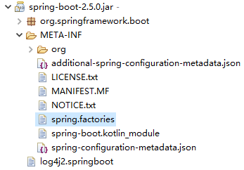

# CSE401 - Spring - Spring Boot

返回[Bulletin](./bulletin.md)

返回[CSE401 - Spring](./CSE401.md)

[TOC]

## 基本介绍

Spring Boot是Spring开源组织下的子项目，通过Spring组件一站式解决方案来简化Spring应用的初始搭建以及开发过程。

- 项目可以通过命令java -jar xxx.jar以jar包的形式**独立运行**。

- 内嵌**servlet容器**，可以内嵌tomcat, jetty, 或者undertow，这样就可以不用war包形式部署项目。

- Spring提供了一系列starter pom来**简化**maven的**依赖**加载，当使用了spring-boot-starter-web时，会自动加载所需要的依赖包。

- Spring Boot会根据在类路径的jar包，类，为jar包中的类**自动配置**bean，这样会极大的减少配置的使用。

## Web开发

### 步骤

1. 创建一个SpringBoot应用，选择需要的模块。SpringBoot会默认将需要的模块自动配置好。
2. 手动在配置文件中设置好部分配置，项目就可以运行起来了。
3. 专注编写业务代码，不需要像以前那样考虑大量配置。

### 搭建工程

登录https://start.spring.io/下载项目代码。

- 选择项目类型、所用语言、Spring Boot版本等信息。
- 选择必须的依赖（例如Spring Web）。


### Starter pom

只要使用应用场景所需要的starter pom就可以得到Spring Boot自动配置的Bean.

```xml
<dependencies>
    <dependency>
        <groupId>org.springframework.boot</groupId>
        <artifactId>spring-boot-starter-web</artifactId>
    </dependency>
    <dependency>
        <groupId>org.springframework.boot</groupId>
        <artifactId>spring-boot-starter-test</artifactId>
        <scope>test</scope>
    </dependency>
</dependencies>
```

Spring Boot提供了绝大多数场景的starter pom, 详见https://docs.spring.io/spring-boot/docs/current/reference/html/using.html#using.build-systems.starters

### 开发者工具devtools

提供development-time功能，不用重启就可以让IDE根据修改实时重新提供服务。

**Maven**

```xml
<dependencies>
	<dependency>
    	<groupId>org.springframework.boot</groupId>
        <artifactId>spring-boot-devtools</artifactId>
        <optional>true</optional>
    </dependency>
</dependencies>
```

**Gradle**

```
dependencies {
	compile("org.springframework.boot:spring-boot-devtools")
}
```

### 入口类

Spring Boot的项目一般都会有名称以Application结尾的入口类，入口类中会有main方法，这是一个标准的Java应用程序的入口方法。

```java
@SpringBootApplication
@ComponentScan("com.github.ltprc")
public class SpringBootProjectApplication {
    public static void main(String[] args) {
        SpringApplication.run(SpringBootProjectApplication.class, args);
    }
}
```

**@SpringBootApplication**注解是Spring Boot的核心注解，它其实是一个组合注解。

在Spring Boot项目中推荐使用@ SpringBootConfiguration替代@Configuration

```java
@Target(ElementType.TYPE)
@Retention(RetentionPolicy.RUNTIME)
@Documented
@Configuration
@Indexed
public @interface SpringBootConfiguration {
    //...
}
```

**@ComponentScan**注解默认扫描@SpringBootApplication所在类的同级目录以及它的子目录。

#### 自动配置

**@EnableAutoConfiguration**注解会使Spring Boot根据项目中依赖的jar包启用自动配置：在进行SpringApplication对象实例化时，Spring Boot会加载META-INF/spring.factories文件，通过getBootstrapRegistryInitializersFromSpringFactories方法调用的getSpringFactoriesInstances方法，将该配置文件中的配置转换为对象，载入到Spring容器。



例如我们如果添加了spring-boot-starter-web的依赖，项目中就会引入SpringMVC的依赖，Spring Boot就会自动配置tomcat和SpringMVC.

关闭某一项自动配置的方法如下所示：

```java
@SpringBootApplication(exclude = {XXXConfiguration.class})
```

#### 自定义Banner

运行后打印如下日志。

```
  .   ____          _            __ _ _
 /\\ / ___'_ __ _ _(_)_ __  __ _ \ \ \ \
( ( )\___ | '_ | '_| | '_ \/ _` | \ \ \ \
 \\/  ___)| |_)| | | | | || (_| |  ) ) ) )
  '  |____| .__|_| |_|_| |_\__, | / / / /
 =========|_|==============|___/=/_/_/_/
 :: Spring Boot ::                (v2.5.0)

2021-05-24 16:12:01.442  INFO 17368 --- [           main] c.g.ltprc.SpringBootProjectApplication   : Starting SpringBootProjectApplication using Java 15.0.1 on DESKTOP-E2INRCP with PID 17368 (D:\workspace-spring-tool-suite-4-4.9.0.RELEASE\springbootproject\target\classes started by tuoli in D:\workspace-spring-tool-suite-4-4.9.0.RELEASE\springbootproject)
2021-05-24 16:12:01.446  INFO 17368 --- [           main] c.g.ltprc.SpringBootProjectApplication   : No active profile set, falling back to default profiles: default
2021-05-24 16:12:02.273  INFO 17368 --- [           main] o.s.b.w.embedded.tomcat.TomcatWebServer  : Tomcat initialized with port(s): 8080 (http)
2021-05-24 16:12:02.287  INFO 17368 --- [           main] o.apache.catalina.core.StandardService   : Starting service [Tomcat]
2021-05-24 16:12:02.287  INFO 17368 --- [           main] org.apache.catalina.core.StandardEngine  : Starting Servlet engine: [Apache Tomcat/9.0.46]
2021-05-24 16:12:02.363  INFO 17368 --- [           main] o.a.c.c.C.[Tomcat].[localhost].[/]       : Initializing Spring embedded WebApplicationContext
2021-05-24 16:12:02.363  INFO 17368 --- [           main] w.s.c.ServletWebServerApplicationContext : Root WebApplicationContext: initialization completed in 853 ms
2021-05-24 16:12:02.698  INFO 17368 --- [           main] o.s.b.w.embedded.tomcat.TomcatWebServer  : Tomcat started on port(s): 8080 (http) with context path ''
2021-05-24 16:12:02.706  INFO 17368 --- [           main] c.g.ltprc.SpringBootProjectApplication   : Started SpringBootProjectApplication in 1.66 seconds (JVM running for 2.625)
2021-05-24 16:12:02.707  INFO 17368 --- [           main] o.s.b.a.ApplicationAvailabilityBean      : Application availability state LivenessState changed to CORRECT
2021-05-24 16:12:02.708  INFO 17368 --- [           main] o.s.b.a.ApplicationAvailabilityBean      : Application availability state ReadinessState changed to ACCEPTING_TRAFFIC
```

Banner允许自定义。获取Banner图案可以通过http://patorjk.com/software/taag/生成，拷贝到一个文本文件中，并且将该文件命名为banner.txt然后将banner.txt拷贝到项目的resources目录中。

关闭Banner的方法如下所示：

```java
@SpringBootApplication
@ComponentScan("com.github.ltprc")
public class SpringBootProjectApplication {
    public static void main(String[] args) {
        SpringApplication app = new SpringApplication(SpringBootProjectApplication.class);
        app.setBannerMode(Banner.Mode.OFF);
        app.run(args);
    }
}
```

### 全局配置文件

Spring Boot项目使用一个全局的配置文件application.properties（或者application.yaml），一般放在resources目录下，也可以放在类路径下的/config下。

#### 配置文件路径优先级

| 优先级 | 路径               |                                  |
| ------ | ------------------ | -------------------------------- |
| 高     | ./config/          |                                  |
|        | ./                 |                                  |
|        | classpath:/config/ | 默认./src/main/resources/config/ |
| 低     | classpath:/        | 默认./src/main/resources/        |

#### 修改Spring Boot自带配置

application.properties或application.yml二选一：

- application.properties格式如下所示：

```properties
#修改tomcat的端口为8080
server.port=8080
#修改进入DispatcherServlet的规则为：*.html
server.servlet-path=*.html
```

- application.yaml格式如下所示：

```properties
server:
  #修改tomcat的端口为8080
  port: 8080
  #修改进入DispatcherServlet的规则为：*.html
  servlet-path: *.html
```

仿造Spring MVC的形式，创建Controller类。

```java
@Controller
public class HelloController {
    @RequestMapping("/hello")
    @ResponseBody
    public String hello() {
        return "Hello";
    }
}
```

可以在对应的端口以匹配的地址访问到Controller里的方法：[http://localhost:8080/hello.html](http://localhost:8080/hello.html)

```
Hello
```

#### 自定义配置

application.yaml格式如下所示：

```yaml
person:
  name: zhangsan
  age: 12
  sex: 男
  likes:
    - book
    - movie
    - girl
```

##### @ConfigurationProperties

@ConfigurationProperties注解批量注入配置文件中的属性，支持JSR303数据校验（例如使用@Email注解标识邮箱地址并使用@Validated注解校验）和复杂类型封装，不支持SpEL表达式.

定义如下所示：

```java
@Target({ ElementType.TYPE, ElementType.METHOD })
@Retention(RetentionPolicy.RUNTIME)
@Documented
@Indexed
public @interface ConfigurationProperties {
	//...
}
```

创建对应的Bean

```java
@ConfigurationProperties(prefix = "person")
@Component
public class Person {
    private String name;
    private Integer age;
    private String sex;
    private List<String> likes;
    //...
    @Override
    public String toString() {
        return "Person [name=" + name + ", age=" + age + ", sex=" + sex + ", likes=" + likes + "]";
    }
}
```

创建对应的单测类

```java
@SpringBootTest
class PersonTest {

    @Autowired
    Person person;
    
    @Test
    void contextLoads() {
        System.out.println(person);
    }
}
```

运行单侧类后打印结果如下：

```
Person [name=zhangsan, age=12, sex=男, likes=[book, movie, girl]]
```

##### @Value

@Value注解一个个指定配置文件中的属性，支持SpEL表达式，不支持JSR303数据校验（例如使用@Email注解标识邮箱地址并使用@Validated注解校验）和复杂类型封装。

创建对应的Bean

```java
@Component
public class Person {
    @Value("${person.name}")
    private String name;
    @Value("${person.age}")
    private Integer age;
    private String sex;
    private List<String> likes;
    //...
    @Override
    public String toString() {
        return "Person [name=" + name + ", age=" + age + ", sex=" + sex + ", likes=" + likes + "]";
    }
}
```

创建对应的单测类

```java
@SpringBootTest
class PersonTest {

    @Autowired
    Person person;
    
    @Test
    void contextLoads() {
        System.out.println(person);
    }
}
```

运行单侧类后打印结果如下：

```
Person [name=zhangsan, age=12, sex=null, likes=null]
```

#### 多环境配置

在配置文件路径下可以创建多个配置文件，例如

- application-dev.properties
  - 其中spring.profiles.active=dev
- application-test.properties
  - 其中spring.profiles.active=test
- application-prod.properties
  - 其中spring.profiles.active=prod

执行java命令运行时，可以手动配置环境参数。

```bash
java -jar xxx.jar --spring.profiles.active=tes
```

### XML配置文件

Spring Boot不提倡使用XML文件进行配置，但是如果必须使用的话可以参考如下方法：

```java
@ImportResource({"classpath:some-context.xml","classpath:another-context.xml"})
```

### Controller

```java
@RestController
public class MyController {
    @RequestMapping("hello")
    public String hello() {
        return "Hello, springboot!";
    }
}
```

可以在对应的端口以匹配的地址访问到Controller里的方法：[http://localhost:8080/hello.html](http://localhost:8080/hello.html)

```
Hello, springboot!
```

### Servlet

```java
@WebServlet(name = "myServlet",urlPatterns = "/srv")
public class MyServlet extends HttpServlet {
    @Override
    protected void doGet(HttpServletRequest req, HttpServletResponse resp) throws ServletException, IOException {
        //此处自行添加doGet逻辑
        super.doGet(req, resp);
    }
    @Override
    protected void doPost(HttpServletRequest req, HttpServletResponse resp) throws ServletException, IOException {
        //此处自行添加doGet逻辑
        super.doPost(req, resp);
    }
}
```

根据启动类的配置可以决定Servlet是否还需要增加注解：

```java
@SpringBootApplication
@ServletComponentScan
public class ConfigApplication {
    public static void main(String[] args) {
        SpringApplication.run(ConfigApplication.class, args);
    }
    //添加如下方法后，上述Servlet不需要添加@WebServlet注解
    @Bean
    public ServletRegistrationBean<MyServlet> getServletRegistrationBean(){
        ServletRegistrationBean<MyServlet> bean = new ServletRegistrationBean<>(new MyServlet());
        ArrayList<String> url = new ArrayList<>();
        url.add("/srv");
        bean.setUrlMappings(url);
        bean.setLoadOnStartup(1);
        return bean;
    }
}
```

### Filter

过滤器

```java
@WebFilter(filterName = "MyFilter", urlPatterns = "/filter")
public class MyFilter implements Filter {
    @Override
    public void init(FilterConfig filterConfig) throws ServletException {
        //初始化容器时调用
        System.out.println("init");
    }
    @Override
    public void doFilter(ServletRequest request, ServletResponse response, FilterChain chain) throws IOException, ServletException {
        //访问Servlet时调用
        System.out.println("filter");
        chain.doFilter(request,response);
    }
    @Override
    public void destroy() {
        //销毁容器时调用
        System.out.println("destory");
    }
}
```

### Listener

监听器，是servlet规范定义的一种特殊类，用于监听servletContext, HttpSession和ServletRequest等域对象的创建和销毁事件，在事件发生前后做一些必要的处理。可用于：

- 系统启动时加载初始化信息
- 统计在线人数
- 统计网站访问量
- 记录用户访问路径

### 统计在线人数示例

监听器

```java
public class MyHttpSessionListener implements HttpSessionListener {
    public static int online = 0;
    @Override
    public void sessionCreated(HttpSessionEvent se) {
        System.out.println("创建session");
        online++;
    }
    @Override
    public void sessionDestroyed(HttpSessionEvent se) {
        System.out.println("销毁session");
    }
}
```

控制器

```java
@RestController
public class MyController {
    @RequestMapping("hello")
    public String hello(HttpSession session) {
        session.setAttribute("aa", "aa");
        return "Hello, springboot!";
    }
    @RequestMapping("login")
    public String login(HttpServletRequest request){
        HttpSession session = request.getSession(true);
        return "login";
    }
    @RequestMapping("online")
    @ResponseBody
    public String online(){
        return "当前在线人数：" + MyHttpSessionListener.online + "人";
    }
}
```

增加监听器的配置

在main函数添加：

```java
@SpringBootApplication
@ServletComponentScan
public class ConfigApplication {
    public static void main(String[] args) {      
        SpringApplication.run(ConfigApplication.class, args);
    }
    //添加在main函数
    @Bean
    public ServletListenerRegistrationBean listenerRegist() {
        ServletListenerRegistrationBean srb = new ServletListenerRegistrationBean();
        srb.setListener(new MyHttpSessionListener());
        System.out.println("listener");
        return srb;
    }
}
```

新建配置类：

```java
@Configuration
public class MyMvcConfig implements WebMvcConfigurer {
    @Bean
    public ServletListenerRegistrationBean listenerRegist(){
        ServletListenerRegistrationBean srb = new ServletListenerRegistrationBean();
        srb.setListener(new MyHttpSessionListener());
        System.out.println("listener");
        return srb;
    }
}
```

可以通过多个浏览器窗口进行调试。

### 静态资源配置

Spring Boot的请求路径一般会经过Controller处理，但是静态资源文件在请求之后是直接返回的。这涉及到application.properties的俩个配置项，以下为默认配置：

```properties
#静态资源请求路径
spring.mvc.static-path-pattern=/**
#静态资源目录，目录按配置顺序由先到后、优先级由高到低
spring.resources.static-locations=classpath:/META-INF/resources/,classpath:/resources/,classpath:/static/,classpath:/public/
```

如果请求的路径和配置中的静态资源请求路径一致，那么请求就是一个静态请求，Spring Boot使用Spring MVC的ResourceHttpRequestHandler, 依次从静态资源目录查找对应的资源；否则请求就不是静态请求。

因为Controller会先于静态资源处理，所以如果有Controller的路径完全匹配，也不会访问静态资源。

除了修改配置文件以外，还可以通过添加自己的 WebMvcConfigurerAdapter 并重写 addResourceHandlers 方法来修改此行为。

```java
@Configuration
public class MyMvcConfig implements WebMvcConfigurer {
    @Override
    public void addResourceHandlers(ResourceHandlerRegistry registry) {
        registry.addResourceHandler("/**").addResourceLocations("classpath:/static/");
    }
}
```

