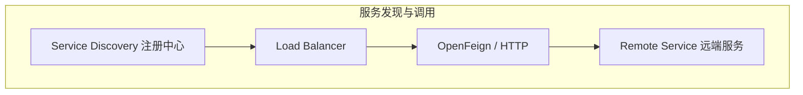
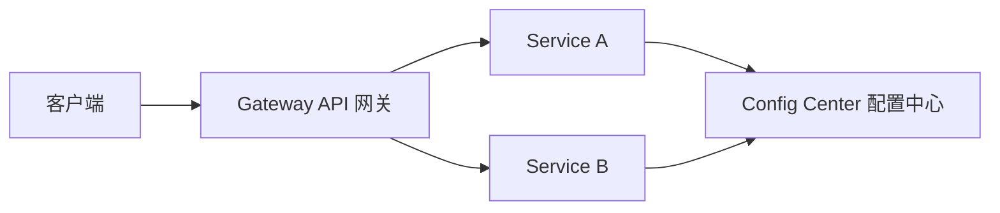
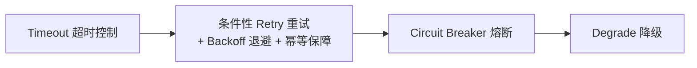
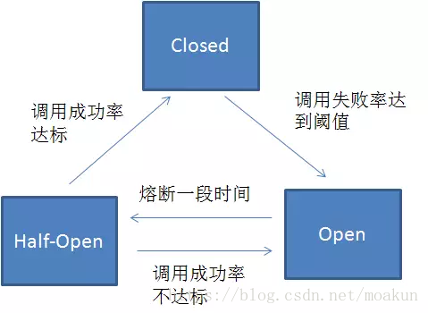
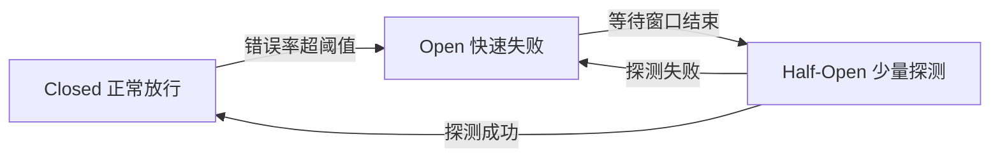
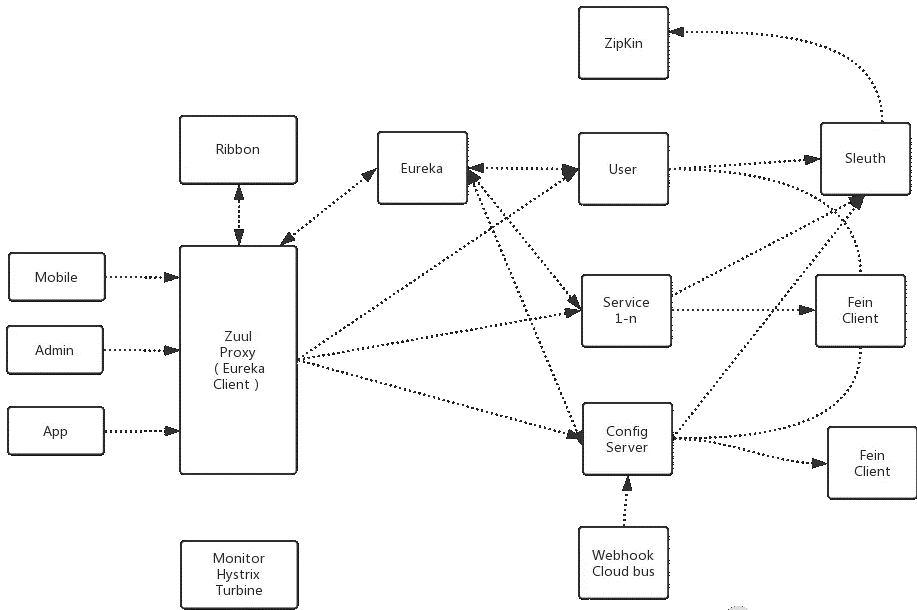

# CSE401 - Spring Ecosystem - Spring Cloud & Microservice Integration

返回[Bulletin](./bulletin.md)

返回[CSE401 - Spring Ecosystem](./CSE401.md)

[TOC]

> 本章目标：能解释 Spring Cloud **解决什么问题**、现代微服务组件各自职责，能接 Senior Java 面试的一到两层追问。不追求组件百科与配置项清单。微服务通用理论（拆分原则、一致性、可观测性理论等）属于 SYS302（规划中），本章只讲 Spring 生态如何实现这些能力。

## Spring Boot vs Spring Cloud

- **Spring Boot**：简化单个服务的构建——自动配置、内嵌容器、生产就绪。它不解决服务间的问题。
- **Spring Cloud**：在 Spring Boot 之上构建的**分布式系统工具集**（有序集合），把服务注册发现、负载均衡、网关、配置中心、熔断限流等基础设施能力，用统一的编程模型（大量基于 `@Conditional` 的自动配置 + Starter）接入应用。

一句话：Spring Boot 关注"一个应用怎么快速跑起来"，Spring Cloud 关注"一群应用怎么协同工作"。

## 为什么微服务需要服务治理

单体拆成微服务后，原本进程内的方法调用变成了跨网络调用，立刻出现四类新问题：

1. **找不到了**——调用方写死对方 IP？实例扩缩容、发布、宕机后地址随时变化 → 需要**服务注册与发现**。
2. **打不匀**——一个服务有多个实例，请求怎么分摊 → 需要**负载均衡**。
3. **挂不起**——网络抖动、依赖超时会沿调用链放大，一个下游故障拖垮整条链路 → 需要**超时、重试、熔断、降级、限流**。
4. **配置散**——几十个服务各自一份配置，改一次全网发布 → 需要**配置中心**。

## 核心知识图


```mermaid
flowchart TD
    subgraph 服务发现与调用
    A[Service Discovery 注册中心] --> B[Load Balancer]
    B --> C[OpenFeign / HTTP]
    C --> D[Remote Service 远端服务]
    end
```


```mermaid
flowchart LR
    Client[客户端] --> GW[Gateway API 网关]
    GW --> S1[Service A]
    GW --> S2[Service B]
    S1 --> CFG[Config Center 配置中心]
    S2 --> CFG
```

远程调用可靠性链（按触发顺序）：


```mermaid
flowchart LR
    T[Timeout 超时控制] --> R[条件性 Retry 重试<br/>+ Backoff 退避 + 幂等保障]
    R --> CB[Circuit Breaker 熔断]
    CB --> DG[Degrade 降级]
```

## 核心组件

### Service Registration / Discovery 服务注册与发现

- **解决的问题**：服务实例动态增减，调用方无法写死地址。
- **机制**：服务启动时向注册中心注册（服务名 → IP:port），调用方按**服务名**从注册中心拉取实例列表（通常本地缓存 + 定时刷新），实例下线或心跳超时后自动摘除。
- **CAP 取舍**：注册中心本质是分布式协调组件，Eureka 选 AP（自我保护、宁可返回过期列表也不拒绝服务），ZooKeeper/etcd 偏 CP。
- **现代选型**：Spring Cloud Netflix Eureka（维护模式）、Consul、**Nacos**（国内主流，注册中心 + 配置中心一体）；Kubernetes 环境下服务发现常由 K8s Service/DNS 原生承担，Spring Cloud Kubernetes 直接对接——这也是很多公司"内部平台封装了服务发现、应用无感知"的原因。

### 服务间调用：OpenFeign

- **解决的问题**：把"发 HTTP 请求 + 序列化 + 负载均衡"变成一个本地接口调用。
- **机制**：声明式 HTTP 客户端。定义一个接口 + `@FeignClient(name = "user-service")`，Spring 生成动态代理，方法调用被翻译成对 `http://user-service/...` 的请求，服务名经负载均衡器解析为具体实例。
- OpenFeign 是当前 Spring Cloud 推荐的 HTTP 调用方式，常配合 `spring-cloud-starter-loadbalancer`。

```java
@FeignClient(name = "user-service")
public interface UserClient {
    @GetMapping("/users/{id}")
    User getUser(@PathVariable("id") Long id);
}
```

### Client-side Load Balancing 客户端负载均衡

- **解决的问题**：拿到实例列表后，把请求分摊到多个实例。
- **特点**：负载均衡逻辑在**调用方进程内**（对比服务端负载均衡如 LVS/Nginx）：无需独立设备、能感知实例健康度、与重试/熔断天然配合；代价是客户端逻辑复杂、多语言重复实现。
- **常见策略**：轮询（Round Robin）、随机、加权。
- **演进**：Netflix Ribbon（维护模式）→ **Spring Cloud LoadBalancer**（现默认实现）。

### API Gateway 网关

- **解决的问题**：为所有外部流量提供统一入口：路由、鉴权、限流、日志、灰度。
- **职责定位**：横切关注点收敛点——客户端只需认识网关，服务可以自由拆分重组。
- **现代选型**：**Spring Cloud Gateway**（基于 WebFlux/Netty 的响应式网关，过滤器和谓词语义清晰）。Netflix Zuul 1（阻塞 Servlet 模型）已停止维护，见 Appendix。

### Configuration Center 配置中心

- **解决的问题**：配置集中管理、按环境隔离、**动态刷新**（不用重启改配置）。
- **机制**：配置中心服务端持有各环境配置，客户端启动时拉取；支持配置变更推送/轮询刷新（`@RefreshScope` 或 `@ConfigurationProperties` 重绑定）。
- **选型**：Spring Cloud Config（Git 仓库后端，需配合 Bus 做推送）；国内生产更常见 **Nacos**（配置 + 注册一体）与 **Apollo**。

### Timeout / Retry / Circuit Breaker / Degrade / Rate Limit

这是"远程调用可靠性"的一组配套手段，缺一不可：

- **Timeout 超时**：一切可靠性的前提。没有超时的调用 = 无限占用线程/连接，故障沿线程池扩散。需要为每一层调用设置有梯度的超时（网关 > 服务间调用）。
- **Retry 重试**：必须**条件性**重试——只重试幂等操作与可重试异常（连接失败、特定状态码），配合**退避**（Backoff，避免同步重试风暴），并设置重试预算。非幂等接口盲目重试会造成重复扣款类事故。
- **Circuit Breaker 熔断**：当依赖的错误率/慢调用率超过阈值，直接快速失败一段时间，不再发起真实调用，避免线程被拖死，也给下游喘息恢复的机会。
- **Degrade 降级**：熔断/失败后返回兜底结果（默认值、缓存、友好提示），保住核心链路可用性。熔断是手段，降级是结果之一。
- **Rate Limit 限流**：保护自身容量，拒绝超出容量的流量（令牌桶/漏桶，单机或集群）。

#### 断路器三状态



- **Closed（关闭）**：正常放行请求，同时统计失败率。
- **Open（打开）**：失败率超过阈值后，直接快速失败（走 fallback），不再真实调用。
- **Half-Open（半开）**：Open 持续一段时间后放行少量探测请求；成功率达到预期则回到 Closed 恢复流量，仍然失败则回到 Open。


```mermaid
flowchart LR
    C[Closed 正常放行] -- "错误率超阈值" --> O[Open 快速失败]
    O -- "等待窗口结束" --> H[Half-Open 少量探测]
    H -- "探测成功" --> C
    H -- "探测失败" --> O
```

> 现代实现：**Resilience4j**（Spring Cloud CircuitBreaker 默认后端，轻量函数式）；Alibaba 生态常用 **Sentinel**（熔断 + 限流 + 控制台）。Netflix Hystrix 的模式讲解见 Appendix——原理仍通用，组件本身已停维护。

### Observability 基本概念

- **Metrics 指标**：QPS、RT、错误率、JVM、连接池——Spring Boot Actuator + **Micrometer**（门面，接 Prometheus 等后端）。
- **Tracing 链路追踪**：一个请求跨多个服务的完整路径与各段耗时，依靠 trace_id 贯穿传递。演进：Netflix Sleuth + Zipkin（旧）→ **Micrometer Tracing**（Spring Boot 3+，桥接 Zipkin/OpenTelemetry）。
- **Logging**：统一输出 trace_id，实现日志聚合检索（ELK 类方案）。

### 当前常见组件角色表

| 能力 | 现代主流方案 | Legacy（Netflix 时代） |
| --- | --- | --- |
| 注册发现 | Nacos / Consul / Eureka(维护模式) / K8s 原生 | Netflix Eureka |
| 负载均衡 | Spring Cloud LoadBalancer | Netflix Ribbon |
| 声明式调用 | OpenFeign | Netflix Feign（OpenFeign 前身） |
| 网关 | Spring Cloud Gateway | Netflix Zuul 1 |
| 熔断/降级 | Resilience4j / Sentinel | Netflix Hystrix |
| 配置中心 | Nacos / Apollo / Spring Cloud Config | Spring Cloud Config（仍可用） |
| 链路追踪 | Micrometer Tracing + Zipkin / OpenTelemetry | Sleuth + Zipkin |

> 背景（面试可主动交代）：生产长期使用 Spring Boot；大公司的服务发现、RPC、配置、监控多由内部平台封装（或 K8s 原生能力承担），标准 Spring Cloud 全家桶组件以理解原理与职责为主。

## Appendix — Legacy Spring Cloud Netflix Stack

以下为 Netflix 时代 Spring Cloud 组件的历史知识。描述在其时代（约 2015–2019）是正确的，Netflix 组件已陆续停止维护，Spring Cloud 自 2020.0 版本起将 Ribbon/Hystrix/Zuul 移出默认发行版。保留供理解遗留系统与现代替代方案的对应关系。

整体架构图（Netflix 全家桶时代）：



### Netflix Eureka

负责服务的注册与发现。

历史定位：Eureka 1.x 由 Netflix 维护并进入维护模式（Eureka 2.x 未开源），Spring Cloud Netflix Eureka 客户端/服务端目前仍在维护分支提供基本支持，社区新项目多转向 Nacos/Consul/K8s。

### Netflix Hystrix

断路器（Circuit Breaker），负责监控服务之间的调用情况，起到熔断、降级作用。

#### 使用原因

在分布式环境下，特别是微服务结构的分布式系统中，一个软件系统调用另外一个远程系统是非常普遍的。这种远程调用的被调用方可能是另外一个进程，或者是跨网路的另外一台主机。

这种远程的调用和进程的内部调用最大的区别是，远程调用可能会失败，或者挂起而没有任何回应，直到超时。更坏的情况是，如果有多个调用者对同一个挂起的服务进行调用，那么就很有可能的是一个服务的超时等待迅速蔓延到整个分布式系统，引起连锁反应，从而消耗掉整个分布式系统大量资源，最终可能导致系统瘫痪。

断路器模式就是为了防止在分布式系统中出现这种瀑布似的连锁反应导致的灾难。断路器被封装在需要保护的远程服务中，在内部监听失败次数，一旦失败次数达到某阀值后，所有后续对该服务的调用，被断路器截获后都直接返回错误到调用方，而不会继续调用已经出问题的服务，从而达到保护调用方的目的, 整个系统也就不会出现因为超时而产生的瀑布式连锁反应。

#### Hystrix 默认参数（历史行为）

- 统计窗口默认 10 秒（`metrics.rollingStats.timeInMilliseconds`），窗口内请求数达到下限（默认 20）且错误率达到 50% 触发熔断。
- 熔断打开后默认休眠 5 秒（`circuitBreaker.sleepWindowInMilliseconds`）进入半开探测。

现代等价物：Resilience4j 的 `CircuitBreaker` 配置语义与此同构（滑动窗口、失败率阈值、半开等待期）。

### Netflix Zuul

转发所有对外的请求和服务，起到 API 网关的作用。

历史定位：Zuul 1 基于阻塞 Servlet 模型（一请求一线程），Zuul 2（Netty 异步）未进入 Spring Cloud 体系；现代替代为 Spring Cloud Gateway（响应式、非阻塞）。

### Spring Cloud Ribbon

是基于Netflix Ribbon实现的一套客户端负载均衡的工具。它是一个基于HTTP和TCP的客户端负载均衡器。

历史定位：进入维护模式后由 **Spring Cloud LoadBalancer** 接替；`spring-cloud-starter-netflix-ribbon` 已从默认发行版移除，OpenFeign 的默认负载均衡器也切换为 Spring Cloud LoadBalancer。

### Spring Cloud Config

提供了统一的分布式配置中心服务。

历史定位与现状：仍是 Spring Cloud 当前组件（非 Netflix），基于 Git 仓库后端；动态广播推送需配合 Spring Cloud Bus。国内生产环境更常用 Nacos/Apollo（一体化、控制台友好）。

### Sleuth + Zipkin

记录所有请求数据，方便后续分析。

历史定位：Spring Cloud Sleuth 在 Spring Boot 3.0 后停止发展，由 **Micrometer Tracing** 接替（底层可对接 OpenTelemetry/Brave），Zipkin 作为追踪后端仍广泛使用。

### Feign

声明式的 Web Service客户端，目的就是让 Web Service调用更加简单。

历史定位：Netflix Feign 捐赠社区后演化为 **OpenFeign**（`spring-cloud-starter-openfeign`），是当前仍在维护的推荐组件，见正文"服务间调用：OpenFeign"。
