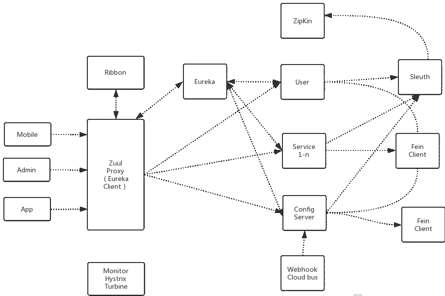
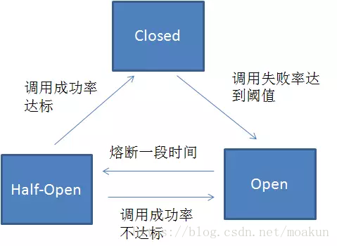

# CSE401 - Spring - Spring Cloud

返回[Bulletin](./bulletin.md)

返回[CSE401 - Spring](./CSE401.md)

[TOC]

## 基本概念

Spring Cloud是一系列框架的有序集合。它利用Spring Boot的开发便利性巧妙地简化了分布式系统基础设施的开发，如服务发现注册、配置中心、消息总线、负载均衡、断路器、数据监控等，都可以用Spring Boot的开发风格做到一键启动和部署。

## 核心组件

### Netflix Eureka

负责服务的注册与发现。

### Netflix Hystrix

断路器（Circuit Breaker），负责监控服务之间的调用情况，起到熔断、降级作用。

#### 使用原因

在分布式环境下，特别是微服务结构的分布式系统中，一个软件系统调用另外一个远程系统是非常普遍的。这种远程调用的被调用方可能是另外一个进程，或者是跨网路的另外一台主机。

这种远程的调用和进程的内部调用最大的区别是，远程调用可能会失败，或者挂起而没有任何回应，直到超时。更坏的情况是，如果有多个调用者对同一个挂起的服务进行调用，那么就很有可能的是一个服务的超时等待迅速蔓延到整个分布式系统，引起连锁反应，从而消耗掉整个分布式系统大量资源，最终可能导致系统瘫痪。

断路器模式就是为了防止在分布式系统中出现这种瀑布似的连锁反应导致的灾难。断路器被封装在需要保护的远程服务中，在内部监听失败次数，一旦失败次数达到某阀值后，所有后续对该服务的调用，被断路器截获后都直接返回错误到调用方，而不会继续调用已经出问题的服务，从而达到保护调用方的目的, 整个系统也就不会出现因为超时而产生的瀑布式连锁反应。

#### 不同状态

##### 熔断关闭状态（Closed）

服务没有故障时，熔断器所处的状态，对调用方的调用不做任何限制。

##### 熔断开启状态（Open）

在固定时间窗口内（Hystrix默认是10秒），接口调用出错比率达到一个阈值（Hystrix默认为50%），会进入熔断开启状态。进入熔断状态后，后续对该服务接口的调用不再经过网络，直接执行本地的fallback方法。

##### 半熔断状态（Half-Open）

在进入熔断开启状态一段时间之后（Hystrix默认是5秒），熔断器会进入半熔断状态。所谓半熔断就是尝试恢复服务调用，允许有限的流量调用该服务，并监控调用成功率。如果成功率达到预期，则说明服务已恢复，进入熔断关闭状态；如果成功率仍旧很低，则重新进入熔断关闭状态。

### Netflix Zuul

转发所有对外的请求和服务，起到 API 网关的作用。

### Spring Cloud Ribbon

是基于Netflix Ribbon实现的一套客户端负载均衡的工具。它是一个基于HTTP和TCP的客户端负载均衡器。

### Spring Cloud Config

提供了统一的分布式配置中心服务。

### Sleuth + Zipkin

记录所有请求数据，方便后续分析。

### Feign

声明式的Web Service客户端，目的就是让Web Service调用更加简单。

