# DBA1011 - MySQL & InnoDB 核心原理

返回[Bulletin](./bulletin.md)

返回[DBA101 - MySQL](./DBA101.md)

[TOC]

## 本章主线

```text
一条 SQL 的旅程：
连接 → 解析 → 优化 → 执行 → 存储引擎 → InnoDB Page
                                          ↓
一条 UPDATE 的日志之旅：
Undo（旧版本）→ Redo（prepare）→ Binlog → Commit（两阶段提交）
                                          ↓
                                     崩溃恢复（WAL）
```

> 本章讲执行链路、存储结构与索引；日志之旅与两阶段提交是事务故事的下半场，完整展开在 [DBA1012 - 事务、MVCC 与锁](./DBA1012.md)；EXPLAIN 与慢 SQL 排查在 [DBA1013 - EXPLAIN 与 SQL 优化](./DBA1013.md)。

------------------------------------------------------------------------

# 1. SQL 执行链路【P0】

## MySQL 基础架构

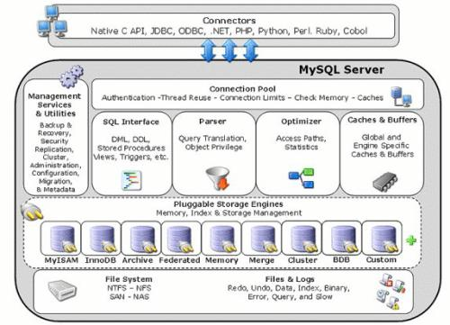

| 层级        | 组件     | 备注                                               |
| ----------- | -------- | -------------------------------------------------- |
| 客户端      |          | 向数据库发送请求，例如：cli, jdbc, navicat, sqlyog |
| MySQL服务器 | 连接器   | 控制用户的连接。                                   |
|             | 查询缓存 | 【历史】MySQL 8 移除了该模块。                     |
|             | SQL接口  | 用来接收用户的SQL命令，返回用户需要的查询结果。    |
|             | 分析器   | 词法分析、语法分析。                               |
|             | 优化器   | 优化SQL语句，规定执行流程。                        |
|             | 执行器   | SQL语句的实际执行组件。                            |
| 存储引擎    |          | 负责数据的存储和提取。                             |

### Server 层 vs 存储引擎层【P0】

这是理解一切 MySQL 知识的地基：

```text
Server 层
├─ 连接器 / 分析器 / 优化器 / 执行器
├─ Binlog（Server 层日志，与引擎无关）
└─ 所有存储引擎共用的能力

存储引擎层（InnoDB / MyISAM / Memory ...）
├─ 数据的实际存储与提取
├─ 索引在存储引擎层实现
└─ InnoDB 自己的日志：Redo / Undo
```

面试关键点：

> 索引是在存储引擎层实现的，不是在服务器层实现的，所以不同存储引擎具有不同的索引类型和实现。Binlog 属于 Server 层，记录所有引擎的逻辑变更；Redo/Undo 属于 InnoDB 引擎层。

### 连接器

连接命令一般这么写：

```shell
mysql -h$ip -P$port -u$user –p$password
```

连接成功之后，若没有后续动作则这个连接就处于空闲状态，查看连接的命令：

```mysql
mysql> show processlist
```

Command 列显示为“Sleep”的这一行，就表示系统里有一个空闲连接。客户端如果长时间没动静，连接器会将其断开。这个时间由wait_timeout参数控制，默认八小时。

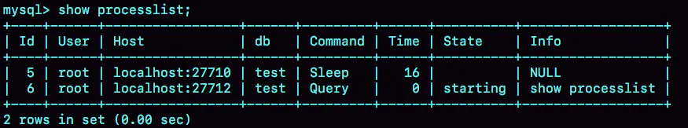

#### 长连接占用内存问题

为了减少建立连接，建议使用长连接。但是全部使用长连接之后，可能会发现MySQL内存占用涨幅迅速，这是因为MySQL在执行过程中，使用的内存是管理在连接对象里的，这些资源只有在断开连接时才会被释放。所以如果长连接累积下来，可能导致内存占用过大，被系统强杀（OOM），从现象上看就是MySQL异常重启了。

考虑以下两种方案解决这个问题：

- 定期断开长连接，之后查询再重连。

- MySQL5.7 级以上版本，可以在每次执行一个较大操作后通过执行mysql_reset_connection来重新初始化连接资源，回到连接刚创建时的状态。

### 查询缓存【历史｜MySQL 8.0 已移除】

> **【校正】** 查询缓存（Query Cache）在 MySQL 8.0 中被整体移除，只在 8.0 之前版本存在。面试提及时应主动说明版本背景，而不是当作现行机制。

连接建立后，就可以执行select语句了。MySQL拿到查询请求会先查看缓存，一般缓存key为查询语句，value为查询结果。若没有对应缓存，则继续后面的步骤。执行完成将结果存入查询缓存。

为什么被移除：

- 第一个是查询缓存的命中率非常低，缓存要求查询SQL语句必须完全相同，SQL语句只要有任何不同，比如多一个空格或者大小写不同，都会认为是不同的SQL语句，导致缓存不命中。

- 第二个是查询缓存的失效非常频繁，只要表结构有改动或者表中数据发生更新，那么与这个表有关的所有的查询缓存都会被清空。

所以大多数情况不建议使用查询缓存，MySQL 8.0 版本直接将查询缓存的整块功能删掉了。

### 分析器

*这条sql要做什么*

如果没有命中缓存，就要开始真正执行语句了。MySQL需要对sql语句解析。

#### 词法分析

把一个完整的 SQL 语句分割成一个个的字符串，例如识别“select”关键字，“ID”识别为“列ID”。

#### 语法分析

根据词法分析的结果，按照语法规则检查判断是否满足MySQL语法。

#### 预处理器

进一步去检查解析树是否合法，比如表名是否存在，语句中表的列是否存在等等。在这一步MySQL也会检验用户是否有表的操作权限。预处理之后会得到一个新的AST(抽象语法树)。

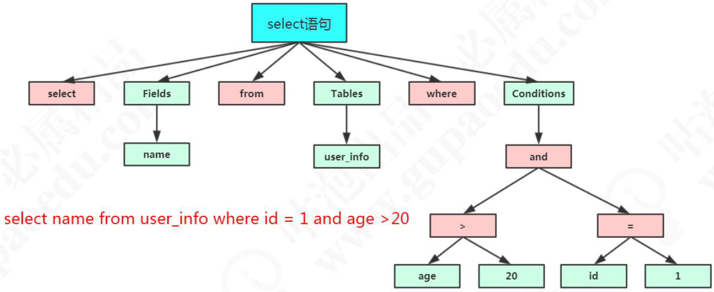

### 优化器

*这条sql要怎么做*

查询优化器的作用就是根据解析树生成不同的执行计划，然后选择一种最优的执行计划。

优化器分为两种方式：

- 基于规则的优化(RBO)

- 基于成本的优化(CBO)，MySQL使用的种类

优化器进行的优化处理包括：

- 当有多个索引可用的时候，决定使用哪个索引。

- 在一个语句有多表关联（join）的时候，决定各个表的连接顺序，以哪个表为基准表。

> **面试提示**：这一层是索引设计（§4 起）与 [DBA1013 EXPLAIN 与 SQL 优化](./DBA1013.md) 的入口 —— "某种 SQL 一定不走索引"这类口诀之所以不可靠，就是因为最终决定权在优化器的成本估算（统计信息、基数、选择性），而不是 SQL 的外观。

### 执行器

*真正的执行阶段*

开始执行前，要先判断你对这个表是否具有权限。

- 如果没有，会返回没有权限的错误信息。
- 如果有权限，执行器会根据表的引擎定义，去使用这个引擎提供的接口。

以此SQL语句为例：

```mysql
mysql> select * from T where ID=10;
```

表T中ID字段没有索引，执行器的执行过程是这样的：

- 调用InnoDB引擎取表的第一行，判断ID是否是10，如果是则将这行存到结果集中。

- 调用引擎接口取表的“下一行”，重复1的逻辑，直到取到最后一行。

- 执行器将上述遍历过程中所有满足条件的行组成的结果集返回。

更新流程还涉及两个重要的日志模块：redo log(重做日志)和binlog(归档日志)，日志与两阶段提交的完整展开见 [DBA1012 - 事务、MVCC 与锁](./DBA1012.md)。

### 面试回答

> MySQL 分成 Server 层和存储引擎层。Server 层负责连接、解析、优化和执行调度，Binlog 也在这层；存储引擎负责数据存储和提取，索引是在引擎层实现的，InnoDB 的 Redo/Undo 日志也属于引擎层。一条 SQL 进来先经过连接器、分析器得到 AST，优化器基于成本选择执行计划，执行器调用引擎接口逐行取数。理解这个分层是理解日志体系、索引差异和主从复制的前提。

------------------------------------------------------------------------

# 2. 连接池【P1】

### 不使用连接池建立连接

如果不使用连接池，建立连接需要经过以下流程：

- TCP建立连接的三次握手

- MySQL认证的三次握手

- 真正的SQL执行

- MySQL的关闭

- TCP的四次握手关闭

虽然实现简单，但是多了非常多我们不关心的网络交互。

### 使用连接池建立连接

#### 连接池的建立

一般在系统初始化时，连接池会根据系统配置建立，并在池中创建了几个连接对象，以便使用时能从连接池中获取。连接池中的连接不能随意创建和关闭，这样避免了连接随意建立和关闭造成的系统开销。Java中提供了很多容器类可以方便的构建连接池，例如Vector、Stack等。

#### 连接池的管理

连接池管理策略是连接池机制的核心，连接池内连接的分配和释放对系统的性能有很大的影响。其管理策略是：

- 当客户请求数据库连接时，首先查看连接池中是否有空闲连接，如果存在空闲连接，则将连接分配给客户使用；如果没有空闲连接，则查看当前所开的连接数是否已经达到最大连接数，如果没达到就重新创建一个连接给请求的客户；如果达到就按设定的最大等待时间进行等待，如果超出最大等待时间，则抛出异常给客户。

- 当客户释放数据库连接时，先判断该连接的引用次数是否超过了规定值，如果超过就从连接池中删除该连接，否则保留为其他客户服务。

该策略保证了数据库连接的有效复用，避免频繁的建立、释放连接所带来的系统资源开销。

#### 连接池的关闭

当应用程序退出时，关闭连接池中所有的连接，释放连接池相关的资源，该过程正好与创建相反。

#### 连接池的不同代

一般来讲采用单线程同步的架构设计都属于第一代连接池，采用多线程异步架构的则属于第二代连接池。使用线程池可以减少网路开销、限制连接总数、提高系统性能。

#### 连接池的主要参数

| 参数                          | 备注                                                         |
| ----------------------------- | ------------------------------------------------------------ |
| thread_handling               | 该参数是配置线程模型，默认情况是one-thread-per-connection，即不启用线程池；将该参数设置为pool-of-threads即启用了线程池。 |
| thread_pool_size              | 该参数是设置线程池的Group的数量，默认为系统CPU的个数，充分利用CPU资源。 |
| thread_pool_oversubscribe     | 该参数设置group中的最大线程数，每个group的最大线程数为thread_pool_oversubscribe+1，注意listener线程不包含在内。 |
| thread_pool_high_prio_mode    | 高优先级队列的控制参数：transactions：（默认）这个模式中已经启动事务的语句放到高优先级队列中。statements：这个模式中所有的语句都会放到高优先级队列中，不会使用到低优先级队列。none：这个模式中不使用高优先级队列。 |
| thread_pool_high_prio_tickets | 该参数控制每个连接最多允许多少次被放入高优先级队列中，默认为4294967295，注意这个参数只有在thread_pool_high_prio_mode为transactions的时候才有效果。 |
| thread_pool_idle_timeout      | worker线程最大空闲时间，默认为60秒，超过限制后会退出。       |
| thread_pool_max_threads       | 该参数用来限制线程池最大的线程数，超过该限制后将无法再创建更多的线程，默认为100000。 |
| thread_pool_stall_limit       | 该参数设置timer线程的检测group是否异常的时间间隔，默认为500ms。 |

#### Java 应用的实践要点

> **知识与经验的区分**：对 Java 应用来说，连接池（HikariCP/Druid）几乎是标配。这一层常见的问题是"连接池打满导致 RT 上升"，排查时应先看 `show processlist` 里连接的状态（活跃/等待/长事务），再决定是加连接数、缩短事务还是治理慢 SQL。这与 [DBA1013 慢 SQL SOP](./DBA1013.md) 里"API 慢不一定是 SQL"是同一条排查原则的两面。

------------------------------------------------------------------------

# 3. InnoDB 存储结构【P0】

## InnoDB

InnoDB是MySQL 5.5.5.以后的默认引擎。

### 存储结构

InnoDB引擎使用B+树作为索引结构。InnoDB表数据文件本身就是一个索引结构，树的叶节点data域保存了完整的数据记录，每个节点对应innodb的一个page，page大小是固定的，一般设为16k。key太长会导致一个页当中能够存放的key的数目变少，间接导致索引树的页数目变多，索引层次增加，从而影响整体查询变更的效率。

这种数据行跟相邻的键值紧凑存储在一起的存储方式，叫做**聚集索引**。

因为InnoDB的数据文件本身要按主键聚集，所以InnoDB要求表必须有主键(MyISAM可以没有)，如果没有显式指定，则mysql会自动选择一个可以唯一标识数据记录的列作为主键。如果不存在这种列，则mysql自动为InnoDB表生成一个隐含字段作为主键，这个字段长度为6个字节，类型为长整型。

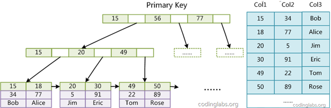

InnoDB的所有辅助索引都引用主键作为data域。

下图为定义在Col3上的一个辅助索引。

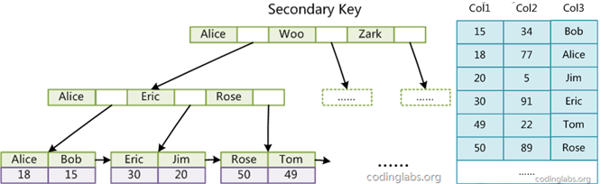

因此InnoDB的索引能提供一种非常快速的主键查找性能。

不过，它的辅助索引也会包含主键列，所以如果主键定义的比较大，其他索引也将很大。InnoDB 不会压缩索引。

> 索引细节（聚簇/二级/回表/覆盖/联合索引）见下文 §4–§10。

### 聚簇索引的优缺点

优点：

- 可以把相关数据保存在一起；

- 数据访问更快，因为数据跟索引保存在同一棵树上；

- 使用覆盖索引扫描的查询可以直接使用叶子节点中的主键值。

缺点：

- 数据都在内存时，提高IO密集型应用性能的聚簇索引没有什么优势；

- 插入速度严重依赖于插入顺序，如果不按照主键的顺序执行插入操作会很慢；

- 更新代价高；

- 插入或更新时可能面临页分裂的问题，遇到全表搜索会很慢。

### 逻辑存储结构

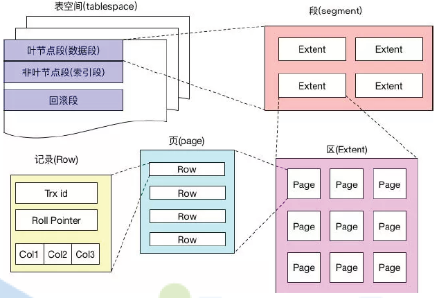

#### 表空间

从InnoDB存储引擎的逻辑存储结构看，所有数据都被逻辑地存放在一个空间中，称之为表空间(tablespace)。

从功能上来看，InnoDB存储引擎的表空间分为系统表空间，独占表空间，通用表空间，临时表空间，Undo表空间。

- 如果开启了独立表空间innodb_file_per_table=1，每张表一个单独的.ibd文件。

- 如果关闭了独立表空间innodb_file_per_table=0，所有基于InnoDB存储引擎的表数据都会记录到系统表空间，文件名为ibdata1。

#### 段

表空间是由各个段组成的，常见的段有数据段、索引段、回滚段等。

#### 区

一个区由64个连续的页组成，一个区的大小=1M=64个页(16K)。

#### 页

InnoDB 每个页默认大小是 16KB，页是 InnoDB管理磁盘的最小单位，也是InnoDB中磁盘和内存交互的最小单位。

索引树（B+树）上一个节点就是一个页，MySQL规定一个页上最少存储2个数据项。如果向一个页插入数据时，这个页已经满了，就会从区中分配一个新页。如果向索引树叶子节点中间的一个页中插入数据，如果这个页是满的，就会发生页分裂。

操作系统管理磁盘的最小单位是磁盘块，是操作系统读写磁盘最小单位，Linux中页一般是4K，可以通过命令查看。

> **面试提示**：`show variables like 'innodb_page_size'` 可确认页大小。B+Tree "矮而宽" 的本质就是：一个 16KB 的页能容纳大量 Key，几层就能覆盖海量数据，从而把磁盘 IO 控制在常数次。

#### 行

InnoDB的数据是以行为单位存储的，1个页中包含多个行。

### Buffer Pool 与脏页【P0】

InnoDB 的读写都以 Buffer Pool 为中心：

```text
读：先查 Buffer Pool → 未命中才读磁盘页
写：先改 Buffer Pool 中的页（该页成为"脏页"）
   → 后台线程异步刷盘
```

推论：

- 数据库最怕的不是"计算慢"而是"磁盘 IO 多"，索引的核心价值就是减少需要读取的页数；

- 脏页刷盘是异步的、可延迟的，这正是需要 Redo Log（WAL）的原因；

- Buffer Pool 不足或脏页集中刷盘时，可能出现 RT 毛刺，这是线上性能问题的常见来源之一。

### 面试回答

> InnoDB 逻辑上是表空间、段、区、页、行的层级，页默认 16KB，是磁盘和内存交互的最小单位，B+Tree 的一个节点就是一个页。读写都经过 Buffer Pool，写操作先改内存页形成脏页，由后台异步刷盘。所以 InnoDB 需要一套日志机制来保证"已提交的数据在脏页还没落盘时也不会丢"，这就是 Redo Log 存在的原因。

------------------------------------------------------------------------

# 4. 索引是什么？【P0】

## 定义

索引（Index）是对数据库表中一列或多列的值进行**排序**的一种**数据结构**，它们包含着对数据表里所有记录的引用指针，是帮助数据库高效获取数据的。更通俗的说，索引就相当于目录。

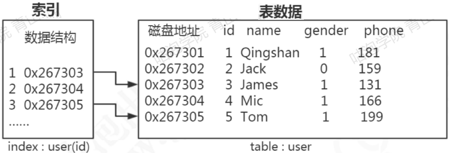

> **【校正】** 老笔记中"把创建了索引的列的内容进行排序，对排序结果生成倒排表然后拼上数据地址链"的表述有误：InnoDB 的 B+Tree 索引和全文检索的倒排索引（Inverted Index）是**两种不同的数据结构，解决两类不同问题**。B+Tree 是"有序 Key → 记录/范围"；倒排索引是"Term → 包含它的文档列表"。倒排索引的内容见 [DBA1014 - 全文检索与倒排索引](./DBA1014.md)。本章只讲 B+Tree。

索引是在存储引擎层实现的，而不是在服务器层实现的，所以不同存储引擎具有不同的索引类型和实现。

## 为什么需要（磁盘视角）

**磁盘**的维度有两个指标：

- 寻址：ms级，比内存慢10W倍
- 带宽（单位时间通过的数据量）：M/G级

**内存**的维度有两个指标：

- 寻址：ns级
- 带宽（单位时间通过的数据量）：更大

**I/O buffer**的成本问题：一个扇区有512Byte，扇区越小，索引的成本越大。所以真正使用硬盘的时候并不是以512Byte作为一次的读写量，操作系统无论读多少，磁盘一般默认最少4K。数据库有很多data page，大小就是4k（InnoDB 页默认 16KB，见上文 InnoDB 存储结构一节）。

关系型数据库建表必须给出schema，声明每一列的类型以及字节宽度，然后倾向以行为单位进行存储。

正如随着文件变大Linux读取文件的速度会变慢，随着数据量变大数据库操作数据的速度也会变慢，这都是因为硬盘I/O成为了瓶颈。

只有建索引能够通过减少磁盘IO让速度加快，前者存的是4k的数据行，而后者存的是特定的某一列数据，每一个数据项指向不同的行。

核心价值一句话：

> **索引的本质是减少查询需要读取的数据量（页数）。**

## 优点

- 可以大大减少服务器需要扫描的数据量。

- 帮助服务器避免排序和临时表。

- 将随机IO变成顺序IO。

## 缺点

- 时间方面：创建索引和维护索引要耗费时间，当对表中的数据进行增加、删除和修改的时候，索引也要动态的维护，会降低增/改/删的执行效率；

- 空间方面：索引需要占物理空间。

## 局限性

当表变大时，如果此时索引能够全部被硬盘存下，进行少量查询操作依然会很快，但是在高并发的时候可能会受硬盘带宽影响从而变慢。

## 使用方式

如果表的记录少（两个页面之内），且不强制使用索引，则一律全表扫描。

如果没有索引，则全表扫描。

先选择主键，再选择尺寸最小的索引。

### 面试回答

> 索引本质上是数据库为提高查询效率额外维护的数据结构，核心价值是减少扫描的数据量。InnoDB 常见索引底层使用 B+Tree。索引会占空间并增加写入维护成本，所以需要结合真实查询模式设计，不是越多越好。

------------------------------------------------------------------------

# 5. 为什么是 B+Tree？【P0】

数据库最怕树太深导致多次存储访问。B+Tree "矮而宽"：一个 16KB 的节点（页）能容纳很多 Key，几层就能覆盖大量数据，把磁盘 IO 控制在常数次。同时叶子节点按 Key 有序并串成链表，天然适合范围查询和排序。

## B树

一颗m阶的B树（B-tree）定义如下：

1. 每个节点**最多有m-1个**key；
2. 根节点至少有1个key；
3. 非根节点**至少有Math.ceil(m/2)-1个**key；
4. 每个节点中的key都按照从小到大的顺序排列，每个key的左子树中的所有key都小于它，而右子树中的所有key都大于它；
5. 所有叶子节点都位于同一层，即根节点到每个叶子节点的长度都相同。

2-3树就是3阶的B树，2-3-4树就是4阶的B树。

如下图是一棵4阶B树（2-3-4树）：

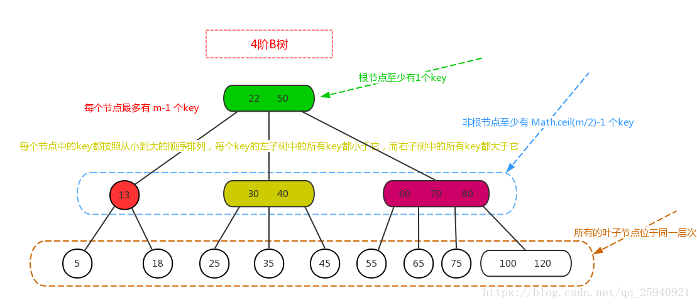

### B树的优点

多路查找树的数据结构，用在内存读取外存的场景下，可以减少磁盘的IO次数，因为在高阶的情况下，树不用很高就可以标识很大的数据量了。

由于B树的每一个节点都包含key和value，因此经常访问的元素可能离根节点更近，因此访问也更迅速。

## B+树

B+树在B树的基础上做了优化，它与B树的差异在于：

1. 有 k 个子节点的节点**必然有 k 个**key；
2. 非叶子节点仅具有索引作用，跟记录有关的信息均存放在叶子节点中。
3. 树的所有叶子节点构成一个有序链表，可以按照key排序的次序遍历全部记录。

即，B和B+树的区别在于，B+树的非叶子结点只包含导航信息，不包含实际的值，所有的叶子结点和相连的节点使用链表相连，便于区间查找和遍历。

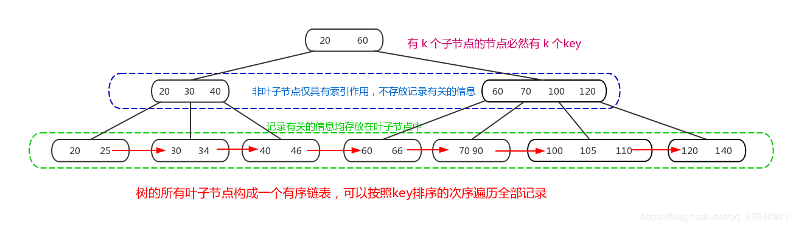

### B+树的优点

由于B+树在内部节点上不包含数据信息，因此在内存页中能够存放更多的key。数据存放的更加紧密，具有更好的空间局部性。因此访问叶子节点上关联的数据也具有更好的缓存命中率。

B+树的叶子结点都是相连的，因此对整棵树的遍历只需要一次线性遍历叶子结点即可。而且由于数据顺序排列并且相连，所以便于区间查找和搜索。而B树则需要进行每一层的递归遍历，相邻的元素可能在内存中不相邻，所以缓存命中性没有B+树好。因此InnoDB选择了B+树作为索引结构，解决了元素遍历效率低下的问题。

### 面试回答

> B+Tree 节点能容纳较多 Key，使树保持较低高度，从而减少存储访问次数；叶子节点又按 Key 有序并形成顺序链表，因此既适合等值查询，也适合范围查询和排序场景。相比之下 B 树非叶节点也存数据，单页能放的 Key 更少、树更高，且范围遍历要回到上层。

------------------------------------------------------------------------

# 6. 聚簇索引与二级索引【P0】

## InnoDB：聚簇索引

InnoDB支持聚簇索引和非聚簇索引。一个表只能有一个聚簇索引，即主键。主索引的叶子节点data域记录着完整的数据记录。

**InnoDB 的主键选择规则**（没有显式主键时）：

1. 如果设置了主键，InnoDB选择主键作为聚集索引；
2. 如果没有显式定义主键，则InnoDB选择第一个不包含NULL值的唯一索引作为主键索引；
3. 如果也没有这样的唯一索引，则InnoDB选择内置6字节长的ROWID作为隐含的聚集索引（ROWID随着行记录的写入而递增）。

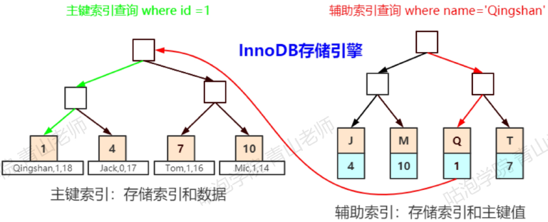

索引和数据都在ibd文件里。

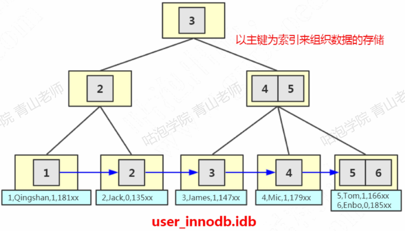

### 自增主键 vs 非自增主键

**自增主键**：每次插入新的记录，记录就会顺序添加到当前索引节点的后续位置，主键的顺序按照数据记录的插入顺序排列，自动有序。当一页写满，就会自动开辟一个新的页。

**非自增主键**：例如身份证号或学号等，由于每次插入主键的值近似于随机，因此每次新纪录都要被插到现有索引页的中间某个位置，此时MySQL不得不为了将新记录插到合适位置而移动数据，甚至目标页面可能已经被回写到磁盘上而从缓存中清掉，此时又要从磁盘上读回来，这增加了很多开销，同时频繁的移动、分页操作造成了大量的碎片，得到了不够紧凑的索引结构，后续不得不通过OPTIMIZE TABLE来重建表并优化填充页面。

> 这是"推荐自增整型主键"的根本原因：插入顺序 = 主键顺序，避免页分裂与碎片。

## 二级索引与回表

二级索引叶子通常保存"索引列 + 主键"，而不是完整行：

```text
name='Alice'
 → idx_name 找到 PK=100
 → 主键索引（聚簇索引）
 → 完整 Row
```

第二次查主键索引就是**回表**。

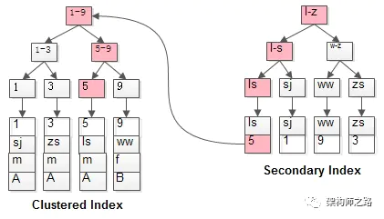

> "走索引"不等于一定快；如果命中几十万条并大量回表，总代价可能高于全表扫描，优化器也正是基于这个成本模型决定走不走索引。

## MyISAM：非聚簇索引

MyISAM支持非聚簇索引，值都记录在辅助索引的叶子节点的data域，因此在使用辅助索引进行查找时，需要先从辅助索引查找到主键值，然后再到主索引中进行查找。

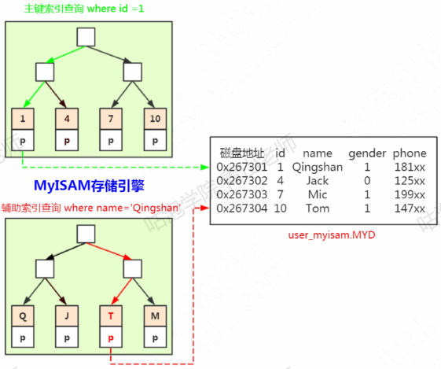

索引存放在MYI文件，表数据存放在MYD文件。

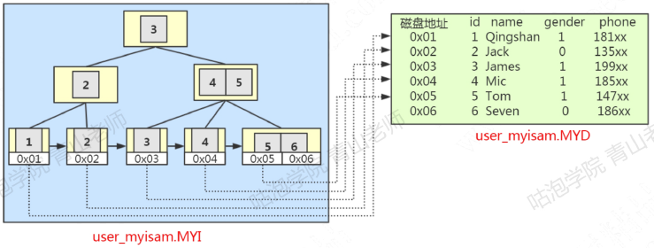

（MyISAM 细节已 Appendix 化，见 [DBA1015](./DBA1015.md)。）

### 面试回答

> InnoDB 的聚簇索引把索引组织和行数据结合在一起，主键索引叶子节点直接保存完整行，按主键查一次就能取整行；二级索引叶子保存索引列和主键，如果查询还需要索引外的字段，就先通过二级索引得到主键再回聚簇索引取整行，这就是回表。所以二级索引列加上主键尽量覆盖高频查询字段，可以省掉回表。

------------------------------------------------------------------------

# 7. 覆盖索引【P0】

索引覆盖指：如果要查询的字段都建立过索引，那么引擎会直接在索引中查询并返回，而不需要回表访问原始数据行。

有 `(name,age)` 索引，查询 `SELECT name,age FROM user WHERE name=?` 可能直接从索引得到结果（EXPLAIN Extra 显示 `Using index`）。

不要想着为每个字段建立索引，因为索引的优势就在于其体积小。

### 优点

- 索引条目通常远小于数据行大小，如果只需要读取索引，那么mysql就会极大地减少数据访问量。

- 因为索引是按照列值顺序存储的，所以对于IO密集型的范围查询，会比随机从磁盘读取每一行数据的IO少得多。

### 存储引擎差异

- 由于InnoDB的聚簇索引，覆盖索引对InnoDB表特别有用。

- 一些存储引擎如MyISAM在内存中只缓存索引，数据则依赖于操作系统来缓存，因此要访问数据需要一次系统调用，这可能会导致严重的性能问题。

- Memory存储引擎不支持覆盖索引。

### 面试回答

> 覆盖索引指查询需要的字段都能直接从索引获得，不需要再根据主键回表。它可以减少额外访问，EXPLAIN 里对应 Using index。但也要权衡索引大小和写入维护成本，不是见查询就加宽索引。

------------------------------------------------------------------------

# 8. 联合索引与最左前缀【P0】

`INDEX(a,b,c)` 是先按 a 排，a 相同再按 b，最后按 c，类似电话簿先按姓再按名。

这个顺序决定了数据库能如何利用索引的有序性：通常 `(a)`、`(a,b)`、`(a,b,c)` 能利用其左侧有序结构；完全跳过 a，不能像从 a 开始一样高效定位。

```sql
-- 容易利用
WHERE a=?
WHERE a=? AND b=?
WHERE a=? AND b=? AND c=?

-- 需要警惕
WHERE b=?                 -- 跳过最左列
WHERE a>? AND b=?         -- a 是范围后，b 的有序利用受限
```

联合索引要结合 `WHERE / ORDER BY / SELECT` 的真实访问模式设计。

### 面试回答

> 联合索引有明确列顺序，例如 `(a,b,c)` 先按 a 排，再按 b、c。因此查询通常从索引左侧列开始才能充分利用有序结构，这就是最左前缀原则。设计时把等值条件、高选择性的列放在左边，并尽量让索引同时服务过滤和排序。

------------------------------------------------------------------------

# 9. 索引分类【P1】

## 主键 Primary key

是表中的一个或多个字段，它的值用于唯一地标识表中的某一条记录。主键是一种特殊的**唯一索引**，且要求**非空**，MySQL会自动为所有表的主键进行索引。

建表的时候可以直接在列名后面增加主键约束：

```sql
ID char(5) primary key
```

对已经建表的列增加主键约束：

```sql
alter table 表名 add constraint 约束名 primary key (ID)
```

## 普通索引 Normal Index

也叫非唯一索引，是最普通的索引，没有任何的限制。

## 唯一索引 Unique Index

唯一索引表明此索引的每一个索引值只对应唯一的数据记录。一张表可以有多个唯一索引。

## 全文索引 Fulltext Index

主要用来查找文本中的关键字，配合**MATCH AGAINST**操作使用。InnoDB 在 MySQL 5.6.4 版本开始支持全文索引。（全文检索与倒排索引的完整讨论在 [DBA1014](./DBA1014.md)。）

## 联合/组合索引 Union Index

MySQL中的索引可以以一定顺序引用多列，这种索引叫作联合索引。

## 外键

外键用于与另一张表的关联，保持数据的一致性。

使用条件：两个表必须是InnoDB表；外键字段必须由用户进行明确的索引；两个表的列必须是数据类型相似。

> **实践口径**：互联网业务里外键约束很少用，一致性由应用层/事务保证——外键会带来额外锁和级联开销。知道概念即可。

## 哈希索引

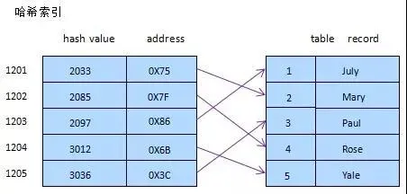

通过Hash算法将数据库字段数据转换成定的Hash值，与这条数据的行指针一并存入Hash表的对应位置。如果发生Hash碰撞，则在对应Hash键下以链表形式存储。

### 缺点

- 哈希索引适合等值查询，但是无法进行范围查询。
- 哈希索引没办法利用索引完成排序。
- 哈希索引不支持多列联合索引的最左匹配规则。
- 如果有大量重复键值的情况下，哈希索引的效率会很低，因为存在哈希碰撞问题。

### 存储引擎

InnoDB 存储引擎有一个特殊的功能叫"自适应哈希索引"：当某个索引值被使用的非常频繁时，会在 B+Tree 索引之上再创建一个哈希索引，让 B+Tree 索引具有哈希索引的一些优点，比如快速的哈希查找。

Memory引擎可以使用哈希索引。

## 空间数据索引【P2】

MyISAM 存储引擎支持空间数据索引（R-Tree），可以用于地理数据存储。必须使用 GIS 相关的函数来维护数据。

------------------------------------------------------------------------

# 10. 索引利用问题：不要背口诀【P0】

> **【校正】** 老笔记里"XX 一定使索引失效"式的清单是面试高危答案。**最终以 EXPLAIN 执行计划为准**（EXPLAIN 见 [DBA1013 - EXPLAIN 与 SQL 优化](./DBA1013.md)）——优化器基于成本（统计信息、基数、选择性、回表代价）做决定。下面每条都理解为"风险点"，不是"必然失效"。

先理解机制，再看风险清单：

- 对索引列做函数/计算：破坏了索引列原有的可直接查找性，例如 `upper(col)=?`、`col+1=?`；

- 联合索引使用方式不合理：跳过最左列、范围条件之后的列利用受限；

- `LIKE '%abc'` 前导模糊：无法利用 B+Tree 左侧有序定位；

- 隐式类型转换：**不是所有隐式类型转换都会导致索引失效**。经典场景是 VARCHAR 索引列拿数字去比较，例如 `varchar_col = 123`，MySQL 会进入数值比较，字符串列的索引可能无法用于快速查找；反过来 INT 列和 `'123'` 这样的字符串常量比较，通常可以把常量转换成数字，索引仍然可以使用。核心看类型转换是否破坏了索引列原有的可直接查找性；

- 返回数据比例过高时：优化器可能认为全表扫描更便宜（大范围 + 回表的代价可能超过整表顺序读）。

补充的老笔记条目（同样以执行计划为准）：

- 搜索一个索引而在另一个索引上做 order by：`where A=a order by B`，只使用A上的索引，因为一条查询通常只用一个索引（可用联合索引 `(A,B)` 解决）；

- or 的利用：`where A=a1 or A=a2`（同一列，可用 index merge 或 IN 改写）；`where A=a or B=b`（不同列，索引利用通常变差）；

- 索引列不能是表达式的一部分或者函数参数，`!=`、`not in` 等写法利用索引的能力通常受限（仍取决于优化器成本判断）。

### 面试回答

> 我一般从 B+Tree 有序性和优化器成本理解索引问题。常见风险包括函数计算、联合索引使用不合理、前导模糊、类型转换和返回比例过高。但我不背"某写法一定失效"的口诀，隐式类型转换也是分方向的——varchar 列和数字比较才容易出问题，int 列和字符串常量比较通常没事。最终都用 EXPLAIN 验证。

------------------------------------------------------------------------

# 11. 数据库文件【P2】

MySQL的每个数据库都对应存放在一个与数据库同名的文件夹中，该文件夹由MySQL配置文件 /etc/my.cnf 定义，其中datadir=/var/lib/mysql指定存放位置。

```sql
SHOW VARIABLES LIKE '%datadir%';
```

### 表结构文件

不论表使用的哪一种存储引擎，MySQL都会为表生成一个.frm为后缀名的表结构文件。（MySQL 8.0 起 .frm 已被移除，表结构并入数据字典。）

### InnoDB数据文件

采用表空间 (tablespace) 来管理数据，存储表数据和索引：

- .ibd文件：独享表空间，一张表对应一个ibd文件。
- .ibdata文件：共享表空间，所有表共同使用一个或者多个ibdata文件。

### MyISAM数据文件

- .myd文件：存储表数据信息。
- .myi文件：存储索引数据树。

------------------------------------------------------------------------

# 12. 双写 Double Write【P2】

Double Write保证了InnoDB存储引擎数据页的可靠性。

InnoDB默认一个页的大小是16k，如果一个页没有写完整出现故障，这种页叫做corrupt page，这种情况叫部分写失效(partial page write)。

InnoDB崩溃恢复，redo恢复数据的前提是页是完整干净的，corrupt page不恢复又会造成写入丢失。

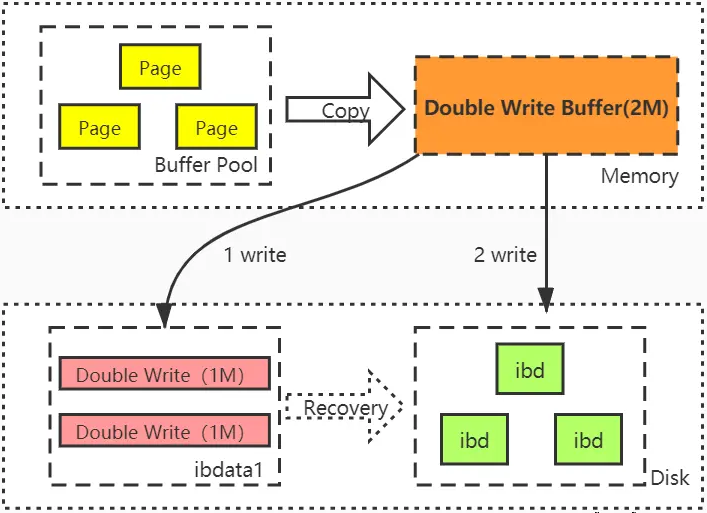

Double Write由两部分组成，一部分在磁盘上，存在于ibdata1中的一个段对象，这个段由两个区(每个1M)组成，另一部分在内存中，叫double write buffer，也是2M，大小固定，不支持调整。

缓冲池中的页落盘时，不直接写入对应的ibd文件中，第一步是先拷贝到double write buffer中，再先从double write buffer中写入double write段对象(2M循环，顺序写入，只有一次IO)，成功写满2M也就是128个页后，再根据(space,page_no)写入对应ibd(随机io)。

如果写double write时发生crash，此时ibd是干净的，服务启动后通过redo进行恢复。

如果写ibd时发生crash，此时double write中存在副本，可以直接覆盖到ibd中对应的页中，然后再继续redo恢复。

### 查看是否开启双写

InnoDB_doublewrite=1表示启动double write

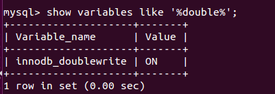

show status like 'dbl%'可以查询double write的使用情况

InnoDB_dblwr_pages_written 从bp flush 到 DBWB的个数

InnoDB_dblwr_writes 写文件的次数

每次写操作合并page的个数= InnoDB_dblwr_pages_written/InnoDB_dblwr_writes

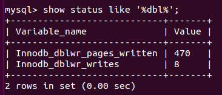

------------------------------------------------------------------------

# 13. CheckPoint 检查点机制【P2】

**当数据库发生宕机时**，数据库不需要重做所有的日志，因为Checkpoint之前的页都已经刷新回磁盘。数据库只需对Checkpoint后的重做日志进行恢复，这样就大大缩短了恢复的时间。

**当缓冲池不够用时**，根据LRU算法会淘汰最近最少使用的页，若此页为脏页，那么需要强制执行Checkpoint，将脏页也就是页的新版本刷回磁盘。

**当重做日志出现不可用时**，因为当前事务数据库系统对重做日志的设计都是循环使用的，并不是让其无限增大的。重做日志可以被重用的部分是指这些重做日志已经不再需要，当数据库发生宕机时，数据库恢复操作不需要这部分的重做日志，因此这部分就可以被覆盖重用。如果重做日志还需要使用，那么必须强制Checkpoint，将缓冲池中的页至少刷新到当前重做日志的位置。

------------------------------------------------------------------------

# 14. ID 达到上限以后发生什么？【P2】

## 自增id

如果设置了主键，那么将会报错主键冲突。

如果没有设置主键，数据库则会帮我们自动生成一个全局的row_id，新数据会覆盖老数据。

首先，创建一个最简单的表，只包含一个自增id，并插入一条数据。

```mysql
create table t0(id int unsigned auto_increment primary key) ;
insert into t0 values(null);
```

通过show命令查看表情况。

```mysql
show create table t0;
```

可以发现 AUTO_INCREMENT 已经自动变成2，这离用完还有很远，我们可以算下当前声明的自增ID最大是多少，由于这里定义的是 int unsigned，所以最大可以达到2的32幂次方 - 1 = 4294967295。

```mysql
CREATE TABLE `t0` ( `id` int(10) unsigned NOT NULL AUTO_INCREMENT, PRIMARY KEY (`id`)) ENGINE=InnoDB AUTO_INCREMENT=2 DEFAULT CHARSET=utf8
```

这里有个小技巧，可以在创建表的时候，直接声明AUTO_INCREMENT的初始值。

```mysql
create table t1(id int unsigned auto_increment primary key) auto_increment = 4294967295;
insert into t1 values(null);
```

当想再尝试插入一条数据时，得到了下面的异常结果。说明表的自增id达到上限后，再申请时，它的值就不会改变，进而导致继续插入数据时报主键冲突的错误。

```shell
17:28:03  insert into t1 values(null) Error Code: 1062. Duplicate entry '4294967295' for key 'PRIMARY'  0.00054 sec
```

4294967295，这个数字已经可以应付大部分的场景了，如果你的服务会经常性的插入和删除数据的话，还是存在用完的风险，建议采用bigint unsigned，这个数字就大了。

## row id

在创建表时没有声明主键的情况下，row_id达到上限后，则会归0再重新递增。

如果出现相同的row_id，后写的数据会覆盖之前的数据。

InnoDB会自动帮你创建一个不可见的、长度为6字节的row_id，而且InnoDB 维护了一个全局的 dictsys.row_id，所以未定义主键的表都共享该row_id，每次插入一条数据，都把全局row_id当成主键id，然后全局row_id加1.

该全局row_id在代码实现上使用的是bigint unsigned类型，但实际上只给row_id留了6字节，这种设计就会存在一个问题：如果全局row_id一直涨，一直涨，直到2的48幂次-1时，这个时候再+1，row_id的低48位都为0，结果在插入新一行数据时，拿到的row_id就为0，存在主键冲突的可能性。

## Xid

Xid是由Server层维护的redo log和binlog的一个共同字段，对应一个事务。

MySQL内部维护一个全局变量global_query_id，每次执行语句的时候将global_query_id赋值给Query_id，然后global_query_id+1，global_query_id达到上限后，就会继续从0开始计数。

只需要不在同一个binlog文件中出现重复值即可。虽然理论上会出现重复值，但是概率极小，可以忽略不计。

## max_trx_id

InnoDB引擎内部维护一个max_trx_id的全局变量，每次需要申请一个新的trx_id，就获得max_trx_id的当前值，然后max_trx_id+1。

Trx_id分配给读写事务，只读事务不分配，根据指针地址临时生成。

max_trx_id会持久化存储，重启不会重置为0，只有到达2^48-1的上限后，才会被重置为0.

## thread_id

thread_id_counter定义为4 Bytes，因此达到2^32-1后就会重置为0

thread_id分配给线程的逻辑如下，保证不会重复：

```c++
do {
    new_id= thread_id_counter++;
} while (!thread_ids.insert_unique(new_id).second);
```

------------------------------------------------------------------------

# 15. 存储引擎对比【P1｜对比即可】

## InnoDB VS MyISAM

| 存储引擎     | InnoDB                                                       | MyISAM                                                       |
| ------------ | ------------------------------------------------------------ | ------------------------------------------------------------ |
| 索引类型     | 聚簇索引和非聚簇索引                                         | 非聚簇索引                                                   |
| 支持锁       | 支持行锁和表锁                                               | 支持表锁                                                     |
| 支持事务     | InnoDB**支持事务和MVCC**.                                    | MyISAM**不支持事务**和MVCC.                                  |
| 支持全文索引 | 在5.6.4版本提供了对全文索引的支持。                          | MyISAM支持FULLTEXT类型的全文索引。                           |
| 支持外键     | InnoDB支持外键。                                             | 不支持外键。                                                 |
| 表的总行数   | InnoDB中**不保存表的行数**，如select count() from table时，InnoDB需要扫描一遍整个表来计算有多少行。 | MyISAM中**保存表的行数**，执行select count() from table只要简单的读出保存好的行数即可。注意的是，当count()语句包含where条件时MyISAM也需要扫描整个表。 |
| 自增长       | 支持自动增加列属性**auto_increment**. 对于自增长的字段，InnoDB中必须包含只有该字段的索引。InnoDB只会把自增主键的最大id记录在内存中，所以当表删除条目重启之后会导致最大id丢失，即变小。 | 对于自增长的字段，在MyISAM表中可以和其他字段一起建立联合索引，不必须包含只有该字段的索引。删除条目重启之后MyISAM的最大id不会有变化。 |
| 清空整张表   | 清空整张表时，InnoDB是一行一行的删除，效率非常慢。           | 清空整张表时，MyISAM会重建表。                               |
| 适合场景     | 大量INSERT, DELETE, UPDATE操作                               | 大量SELECT操作                                               |

MyISAM是MySQL5.5.5之前的默认的引擎。其叶节点的data域存放的是数据记录的地址，数据文件跟索引文件分开存放，叫做**非聚集索引**。（详细图示与 .frm/.myd/.myi 文件说明见 [DBA1015 - Appendix](./DBA1015.md)。）

## Memory

如果需要快速访问数据且这些数据不会被修改，重启以后丢失也没有关系，那么使用 Memory 表是非常有用的。Memory表支持哈希索引。所有数据都保存在内存，不需要磁盘IO，表结构在重启后会保留，但数据会丢失。

Memory表使用表级锁，因此并发写入的性能较低。它不支持 BLOB 和 TEXT 类型的列，并且每行的长度是固定的，所以即使指定了 VARCHAR 列，实际存储时也会转换成CHAR，这可能导致部分内存的浪费。

如果MySQL在执行查询的过程中需要使用临时表来保存中间结果，内部使用的临时表就是 Memory表。如果中间结果太大超出了Memory表的限制，或者含有BLOB或TEXT字段，临时表会转换成其他引擎的表。

> **面试口径**：当前主线只讲 InnoDB。MyISAM / Memory 属于历史与对比知识，能说清"为什么 InnoDB 成为默认"（事务 + 行锁 + MVCC + 聚簇索引 + 崩溃安全）即可，不需要深入它们的运维细节。

------------------------------------------------------------------------

## 本章验收

- [ ] SQL 执行链路？Server 层和存储引擎层各管什么？
- [ ] InnoDB 逻辑存储结构（表空间/段/区/页/行）？页多大？
- [ ] 索引本质是什么？为什么能加速？
- [ ] 为什么 InnoDB 用 B+Tree？（对比 B 树）
- [ ] 聚簇索引？主键选择规则？为什么推荐自增主键？
- [ ] 二级索引和回表？为什么"走索引"不一定快？
- [ ] 覆盖索引？EXPLAIN 里怎么识别？
- [ ] 联合索引/最左前缀？范围条件对后续列的影响？
- [ ] 隐式类型转换什么方向才危险？
- [ ] 双写解决什么问题？Checkpoint 什么时候触发？
