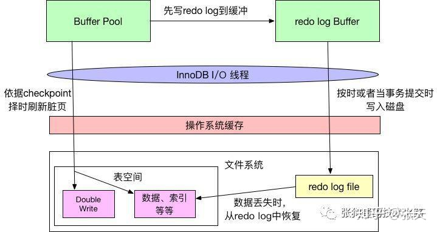
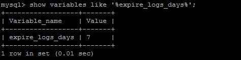
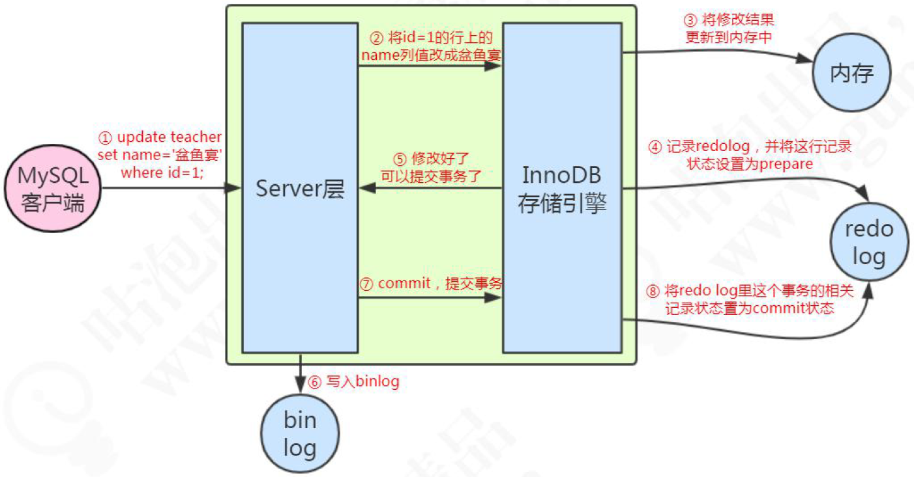

# DBA1011 - MySQL & InnoDB 核心原理

返回[Bulletin](./bulletin.md)

返回[DBA101 - MySQL](./DBA101.md)

[TOC]

## 本章主线

```text
一条 SQL 的旅程：
连接 → 解析 → 优化 → 执行 → 存储引擎 → InnoDB Page
                                          ↓
一条 UPDATE 的日志之旅：
Undo（旧版本）→ Redo（prepare）→ Binlog → Commit（两阶段提交）
                                          ↓
                                     崩溃恢复（WAL）
```

------------------------------------------------------------------------

# 1. SQL 执行链路【P0】

## MySQL 基础架构


| 层级        | 组件     | 备注                                               |
| ----------- | -------- | -------------------------------------------------- |
| 客户端      |          | 向数据库发送请求，例如：cli, jdbc, navicat, sqlyog |
| MySQL服务器 | 连接器   | 控制用户的连接。                                   |
|             | 查询缓存 | 【历史】MySQL 8 移除了该模块。                     |
|             | SQL接口  | 用来接收用户的SQL命令，返回用户需要的查询结果。    |
|             | 分析器   | 词法分析、语法分析。                               |
|             | 优化器   | 优化SQL语句，规定执行流程。                        |
|             | 执行器   | SQL语句的实际执行组件。                            |
| 存储引擎    |          | 负责数据的存储和提取。                             |

### Server 层 vs 存储引擎层【P0】

这是理解一切 MySQL 知识的地基：

```text
Server 层
├─ 连接器 / 分析器 / 优化器 / 执行器
├─ Binlog（Server 层日志，与引擎无关）
└─ 所有存储引擎共用的能力

存储引擎层（InnoDB / MyISAM / Memory ...）
├─ 数据的实际存储与提取
├─ 索引在存储引擎层实现
└─ InnoDB 自己的日志：Redo / Undo
```

面试关键点：

> 索引是在存储引擎层实现的，不是在服务器层实现的，所以不同存储引擎具有不同的索引类型和实现。Binlog 属于 Server 层，记录所有引擎的逻辑变更；Redo/Undo 属于 InnoDB 引擎层。

### 连接器

连接命令一般这么写：

```shell
mysql -h$ip -P$port -u$user –p$password
```

连接成功之后，若没有后续动作则这个连接就处于空闲状态，查看连接的命令：

```mysql
mysql> show processlist
```

Command 列显示为“Sleep”的这一行，就表示系统里有一个空闲连接。客户端如果长时间没动静，连接器会将其断开。这个时间由wait_timeout参数控制，默认八小时。


#### 长连接占用内存问题

为了减少建立连接，建议使用长连接。但是全部使用长连接之后，可能会发现MySQL内存占用涨幅迅速，这是因为MySQL在执行过程中，使用的内存是管理在连接对象里的，这些资源只有在断开连接时才会被释放。所以如果长连接累积下来，可能导致内存占用过大，被系统强杀（OOM），从现象上看就是MySQL异常重启了。

考虑以下两种方案解决这个问题：

- 定期断开长连接，之后查询再重连。

- MySQL5.7 级以上版本，可以在每次执行一个较大操作后通过执行mysql_reset_connection来重新初始化连接资源，回到连接刚创建时的状态。

### 查询缓存【历史｜MySQL 8.0 已移除】

> **【校正】** 查询缓存（Query Cache）在 MySQL 8.0 中被整体移除，只在 8.0 之前版本存在。面试提及时应主动说明版本背景，而不是当作现行机制。

连接建立后，就可以执行select语句了。MySQL拿到查询请求会先查看缓存，一般缓存key为查询语句，value为查询结果。若没有对应缓存，则继续后面的步骤。执行完成将结果存入查询缓存。

为什么被移除：

- 第一个是查询缓存的命中率非常低，缓存要求查询SQL语句必须完全相同，SQL语句只要有任何不同，比如多一个空格或者大小写不同，都会认为是不同的SQL语句，导致缓存不命中。

- 第二个是查询缓存的失效非常频繁，只要表结构有改动或者表中数据发生更新，那么与这个表有关的所有的查询缓存都会被清空。

所以大多数情况不建议使用查询缓存，MySQL 8.0 版本直接将查询缓存的整块功能删掉了。

### 分析器

*这条sql要做什么*

如果没有命中缓存，就要开始真正执行语句了。MySQL需要对sql语句解析。

#### 词法分析

把一个完整的 SQL 语句分割成一个个的字符串，例如识别“select”关键字，“ID”识别为“列ID”。

#### 语法分析

根据词法分析的结果，按照语法规则检查判断是否满足MySQL语法。

#### 预处理器

进一步去检查解析树是否合法，比如表名是否存在，语句中表的列是否存在等等。在这一步MySQL也会检验用户是否有表的操作权限。预处理之后会得到一个新的AST(抽象语法树)。


### 优化器

*这条sql要怎么做*

查询优化器的作用就是根据解析树生成不同的执行计划，然后选择一种最优的执行计划。

优化器分为两种方式：

- 基于规则的优化(RBO)

- 基于成本的优化(CBO)，MySQL使用的种类

优化器进行的优化处理包括：

- 当有多个索引可用的时候，决定使用哪个索引。

- 在一个语句有多表关联（join）的时候，决定各个表的连接顺序，以哪个表为基准表。

> **面试提示**：这一层是 [DBA1013 索引优化](./DBA1013.md) 的入口 —— "某种 SQL 一定不走索引"这类口诀之所以不可靠，就是因为最终决定权在优化器的成本估算（统计信息、基数、选择性），而不是 SQL 的外观。

### 执行器

*真正的执行阶段*

开始执行前，要先判断你对这个表是否具有权限。

- 如果没有，会返回没有权限的错误信息。
- 如果有权限，执行器会根据表的引擎定义，去使用这个引擎提供的接口。

以此SQL语句为例：

```mysql
mysql> select * from T where ID=10;
```

表T中ID字段没有索引，执行器的执行过程是这样的：

- 调用InnoDB引擎取表的第一行，判断ID是否是10，如果是则将这行存到结果集中。

- 调用引擎接口取表的“下一行”，重复1的逻辑，直到取到最后一行。

- 执行器将上述遍历过程中所有满足条件的行组成的结果集返回。

更新流程还涉及两个重要的日志模块：redo log(重做日志)和binlog(归档日志)。

### 面试回答

> MySQL 分成 Server 层和存储引擎层。Server 层负责连接、解析、优化和执行调度，Binlog 也在这层；存储引擎负责数据存储和提取，索引是在引擎层实现的，InnoDB 的 Redo/Undo 日志也属于引擎层。一条 SQL 进来先经过连接器、分析器得到 AST，优化器基于成本选择执行计划，执行器调用引擎接口逐行取数。理解这个分层是理解日志体系、索引差异和主从复制的前提。

------------------------------------------------------------------------

## 2. 连接池【P1】

### 不使用连接池建立连接

如果不使用连接池，建立连接需要经过以下流程：

- TCP建立连接的三次握手

- MySQL认证的三次握手

- 真正的SQL执行

- MySQL的关闭

- TCP的四次握手关闭

虽然实现简单，但是多了非常多我们不关心的网络交互。

### 使用连接池建立连接

#### 连接池的建立

一般在系统初始化时，连接池会根据系统配置建立，并在池中创建了几个连接对象，以便使用时能从连接池中获取。连接池中的连接不能随意创建和关闭，这样避免了连接随意建立和关闭造成的系统开销。Java中提供了很多容器类可以方便的构建连接池，例如Vector、Stack等。

#### 连接池的管理

连接池管理策略是连接池机制的核心，连接池内连接的分配和释放对系统的性能有很大的影响。其管理策略是：

- 当客户请求数据库连接时，首先查看连接池中是否有空闲连接，如果存在空闲连接，则将连接分配给客户使用；如果没有空闲连接，则查看当前所开的连接数是否已经达到最大连接数，如果没达到就重新创建一个连接给请求的客户；如果达到就按设定的最大等待时间进行等待，如果超出最大等待时间，则抛出异常给客户。

- 当客户释放数据库连接时，先判断该连接的引用次数是否超过了规定值，如果超过就从连接池中删除该连接，否则保留为其他客户服务。

该策略保证了数据库连接的有效复用，避免频繁的建立、释放连接所带来的系统资源开销。

#### 连接池的关闭

当应用程序退出时，关闭连接池中所有的连接，释放连接池相关的资源，该过程正好与创建相反。

#### 连接池的不同代

一般来讲采用单线程同步的架构设计都属于第一代连接池，采用多线程异步架构的则属于第二代连接池。使用线程池可以减少网路开销、限制连接总数、提高系统性能。

#### 连接池的主要参数

| 参数                          | 备注                                                         |
| ----------------------------- | ------------------------------------------------------------ |
| thread_handling               | 该参数是配置线程模型，默认情况是one-thread-per-connection，即不启用线程池；将该参数设置为pool-of-threads即启用了线程池。 |
| thread_pool_size              | 该参数是设置线程池的Group的数量，默认为系统CPU的个数，充分利用CPU资源。 |
| thread_pool_oversubscribe     | 该参数设置group中的最大线程数，每个group的最大线程数为thread_pool_oversubscribe+1，注意listener线程不包含在内。 |
| thread_pool_high_prio_mode    | 高优先级队列的控制参数：transactions：（默认）这个模式中已经启动事务的语句放到高优先级队列中。statements：这个模式中所有的语句都会放到高优先级队列中，不会使用到低优先级队列。none：这个模式中不使用高优先级队列。 |
| thread_pool_high_prio_tickets | 该参数控制每个连接最多允许多少次被放入高优先级队列中，默认为4294967295，注意这个参数只有在thread_pool_high_prio_mode为transactions的时候才有效果。 |
| thread_pool_idle_timeout      | worker线程最大空闲时间，默认为60秒，超过限制后会退出。       |
| thread_pool_max_threads       | 该参数用来限制线程池最大的线程数，超过该限制后将无法再创建更多的线程，默认为100000。 |
| thread_pool_stall_limit       | 该参数设置timer线程的检测group是否异常的时间间隔，默认为500ms。 |

#### Java 应用的实践要点

> **知识与经验的区分**：对 Java 应用来说，连接池（HikariCP/Druid）几乎是标配。这一层常见的问题是"连接池打满导致 RT 上升"，排查时应先看 `show processlist` 里连接的状态（活跃/等待/长事务），再决定是加连接数、缩短事务还是治理慢 SQL。这与 [DBA1013 慢 SQL SOP](./DBA1013.md) 里"API 慢不一定是 SQL"是同一条排查原则的两面。

------------------------------------------------------------------------

# 3. InnoDB 存储结构【P0】

## InnoDB

InnoDB是MySQL 5.5.5.以后的默认引擎。

### 存储结构

InnoDB引擎使用B+树作为索引结构。InnoDB表数据文件本身就是一个索引结构，树的叶节点data域保存了完整的数据记录，每个节点对应innodb的一个page，page大小是固定的，一般设为16k。key太长会导致一个页当中能够存放的key的数目变少，间接导致索引树的页数目变多，索引层次增加，从而影响整体查询变更的效率。

这种数据行跟相邻的键值紧凑存储在一起的存储方式，叫做**聚集索引**。

因为InnoDB的数据文件本身要按主键聚集，所以InnoDB要求表必须有主键(MyISAM可以没有)，如果没有显式指定，则mysql会自动选择一个可以唯一标识数据记录的列作为主键。如果不存在这种列，则mysql自动为InnoDB表生成一个隐含字段作为主键，这个字段长度为6个字节，类型为长整型。


InnoDB的所有辅助索引都引用主键作为data域。

下图为定义在Col3上的一个辅助索引。


因此InnoDB的索引能提供一种非常快速的主键查找性能。

不过，它的辅助索引也会包含主键列，所以如果主键定义的比较大，其他索引也将很大。InnoDB 不会压缩索引。

> 索引细节（聚簇/二级/回表/覆盖/联合索引）的完整展开在 [DBA1013 - 索引、EXPLAIN 与 SQL 优化](./DBA1013.md)。

### 聚簇索引的优缺点

优点：

- 可以把相关数据保存在一起；

- 数据访问更快，因为数据跟索引保存在同一棵树上；

- 使用覆盖索引扫描的查询可以直接使用叶子节点中的主键值。

缺点：

- 数据都在内存时，提高IO密集型应用性能的聚簇索引没有什么优势；

- 插入速度严重依赖于插入顺序，如果不按照主键的顺序执行插入操作会很慢；

- 更新代价高；

- 插入或更新时可能面临页分裂的问题，遇到全表搜索会很慢。

### 逻辑存储结构


#### 表空间

从InnoDB存储引擎的逻辑存储结构看，所有数据都被逻辑地存放在一个空间中，称之为表空间(tablespace)。

从功能上来看，InnoDB存储引擎的表空间分为系统表空间，独占表空间，通用表空间，临时表空间，Undo表空间。

- 如果开启了独立表空间innodb_file_per_table=1，每张表一个单独的.ibd文件。

- 如果关闭了独立表空间innodb_file_per_table=0，所有基于InnoDB存储引擎的表数据都会记录到系统表空间，文件名为ibdata1。

#### 段

表空间是由各个段组成的，常见的段有数据段、索引段、回滚段等。

#### 区

一个区由64个连续的页组成，一个区的大小=1M=64个页(16K)。

#### 页

InnoDB 每个页默认大小是 16KB，页是 InnoDB管理磁盘的最小单位，也是InnoDB中磁盘和内存交互的最小单位。

索引树（B+树）上一个节点就是一个页，MySQL规定一个页上最少存储2个数据项。如果向一个页插入数据时，这个页已经满了，就会从区中分配一个新页。如果向索引树叶子节点中间的一个页中插入数据，如果这个页是满的，就会发生页分裂。

操作系统管理磁盘的最小单位是磁盘块，是操作系统读写磁盘最小单位，Linux中页一般是4K，可以通过命令查看。

> **面试提示**：`show variables like 'innodb_page_size'` 可确认页大小。B+Tree "矮而宽" 的本质就是：一个 16KB 的页能容纳大量 Key，几层就能覆盖海量数据，从而把磁盘 IO 控制在常数次。

#### 行

InnoDB的数据是以行为单位存储的，1个页中包含多个行。

### Buffer Pool 与脏页【P0】

InnoDB 的读写都以 Buffer Pool 为中心：

```text
读：先查 Buffer Pool → 未命中才读磁盘页
写：先改 Buffer Pool 中的页（该页成为"脏页"）
   → 后台线程异步刷盘
```

推论：

- 数据库最怕的不是"计算慢"而是"磁盘 IO 多"，索引的核心价值就是减少需要读取的页数；

- 脏页刷盘是异步的、可延迟的，这正是需要 Redo Log（WAL）的原因；

- Buffer Pool 不足或脏页集中刷盘时，可能出现 RT 毛刺，这是线上性能问题的常见来源之一。

### 面试回答

> InnoDB 逻辑上是表空间、段、区、页、行的层级，页默认 16KB，是磁盘和内存交互的最小单位，B+Tree 的一个节点就是一个页。读写都经过 Buffer Pool，写操作先改内存页形成脏页，由后台异步刷盘。所以 InnoDB 需要一套日志机制来保证"已提交的数据在脏页还没落盘时也不会丢"，这就是 Redo Log 存在的原因。

------------------------------------------------------------------------

## 4. 双写 Double Write【P2】

Double Write保证了InnoDB存储引擎数据页的可靠性。

InnoDB默认一个页的大小是16k，如果一个页没有写完整出现故障，这种页叫做corrupt page，这种情况叫部分写失效(partial page write)。

InnoDB崩溃恢复，redo恢复数据的前提是页是完整干净的，corrupt page不恢复又会造成写入丢失。


Double Write由两部分组成，一部分在磁盘上，存在于ibdata1中的一个段对象，这个段由两个区(每个1M)组成，另一部分在内存中，叫double write buffer，也是2M，大小固定，不支持调整。

缓冲池中的页落盘时，不直接写入对应的ibd文件中，第一步是先拷贝到double write buffer中，再先从double write buffer中写入double write段对象(2M循环，顺序写入，只有一次IO)，成功写满2M也就是128个页后，再根据(space,page_no)写入对应ibd(随机io)。

如果写double write时发生crash，此时ibd是干净的，服务启动后通过redo进行恢复。

如果写ibd时发生crash，此时double write中存在副本，可以直接覆盖到ibd中对应的页中，然后再继续redo恢复。

查看是否开启双写

InnoDB_doublewrite=1表示启动double write


show status like 'dbl%'可以查询double write的使用情况

InnoDB_dblwr_pages_written 从bp flush 到 DBWB的个数

InnoDB_dblwr_writes 写文件的次数

每次写操作合并page的个数= InnoDB_dblwr_pages_written/InnoDB_dblwr_writes


------------------------------------------------------------------------

# 5. Redo / Undo / Binlog 三套日志【P0】

> 这是用"各解决什么问题"来记忆的最佳题型。三套日志解决的问题不同，不能混成一种日志。

## Redo Log 的两个反事实【P2】

> 先看两个"如果"题，理解为什么 InnoDB 需要两套日志分工。

### 如果没有redo log只有undo log

那么就必须保证提交前刷脏完成，否则宕机时有些修改就在内存中丢失了，破坏了持久性。

这样带来了性能差的问题。

### 如果没有undo log只有redo log

那么就不能随心所欲地在事务提交前刷脏，即无法支持大事务。

假如某张表有 100 亿的 8 字节整数数据，就算不考虑其他东西带来的损耗，光 update 整张表至少要消耗 80G 的内存。如前所述，有了 undo log，就可以随便刷脏。

## Redo Log（重做日志）

解决：

```text
事务已经提交
但数据页还没刷盘
机器突然掉电怎么办？
```

关键词：

> **InnoDB 崩溃恢复 / WAL / 持久性**

### 作用

确保事务的**持久性**。

防止在发生故障的时间点，尚有脏页未写入磁盘，在重启mysql服务的时候，根据redo log进行重做，从而达到事务的持久性这一特性。

### WAL(Write-Ahead Logging)【P0】

WAL是所有存储类系统的基础，要求**先将内存中的日志写入到磁盘，再把数据的变更写入到磁盘**。即：先写日志（顺序 IO），后刷数据页（随机 IO），用廉价的顺序写换取性能，同时保证崩溃可恢复。

### Force-log-at-commit

Force-log-at-commit要求当一个事务提交时，所有产生的日志都必须已经刷新到磁盘上。这样，如果日志刷新成功后，缓冲池中的数据刷新到磁盘前数据库发生了宕机，那么重启时，数据库可以从日志中恢复数据。

### 内容

InnoDB存储引擎上的物理格式的日志，记录的是物理数据页面的修改的信息，其redo log是顺序写入redo log file的物理文件中去的。

### 什么时候产生

事务开始之后就产生redo log，redo log的落盘并不是随着事务的提交才写入的，而是在事务的执行过程中，便开始通过Master Thread线程的定时任务写入redo log文件中。

### 什么时候释放

当对应事务的脏页写入到磁盘之后，redo log的使命也就完成了，重做日志占用的空间就可以重用（被覆盖）。



### 刷盘机制

InnoDB的*innodb*_*flush*_*log*_*at*_*trx_commit*属性可以控制每次事务提交时InnoDB的行为。

- 当属性值为0时，事务提交时，不会对重做日志进行写入操作，而是等待主线程按时写入。写入效率最高，但是数据安全最低。

- 当属性值为1时，事务提交时，会将重做日志写入文件系统缓存，并且调用文件系统的fsync，将文件系统缓冲中的数据真正写入磁盘存储，确保不会出现数据丢失。写入效率最低，但是数据安全最高。只有这种情况才能保证事务的**一致性**。

- 当属性值为2时，事务提交时，也会将日志文件写入文件系统缓存，但是不会调用fsync，而是让文件系统自己去判断何时将缓存写入磁盘。写入效率和数据安全居中。


## Undo Log（回滚日志）

解决：

```text
事务要回滚怎么办？
MVCC 怎么看到旧版本？
```

关键词：

> **旧值 / 回滚 / MVCC**

### 作用

确保事务的**原子性**。

保存了事务发生之前的数据的一个版本，可以用于回滚，同时可以提供多版本并发控制下的读（MVCC），也即非锁定读。

### 内容

InnoDB存储引擎上的逻辑格式的日志，在执行undo的时候，仅仅是将数据从逻辑上恢复至事务之前的状态，而不是从物理页面上操作实现的，这一点是不同于redo log的。

### 什么时候产生

事务开始之前，将当前的版本生成undo log，undo也会产生redo来保证undo log的可靠性。

### 什么时候释放

当事务提交之后，undo log并不能立马被删除，而是放入待清理的链表，由purge线程判断是否存在其他事务在使用undo段中该记录的上一个版本信息，再决定是否可以清理undo log的日志空间。

> MVCC 版本链与 ReadView 可见性判断的完整机制在 [DBA1012 - 事务、MVCC 与锁](./DBA1012.md)。

## Binlog（二进制日志）

解决：

```text
数据变更需要复制、需要按时间点恢复怎么办？
```

关键词：

> **逻辑变更 / 复制 / 恢复（PITR）/ CDC**

### 作用

#### 主从同步

- 第一步是在主库上记录二进制日志。每次准备提交事务、完成数据更新前，MySQL会按事务提交的顺序（而非每条语句的执行顺序）来记录二进制日志，而后主库告诉存储引擎可以提交事务了。

- 下一步备库启动一个工作的IO线程跟主库建立一个普通的客户端连接，然后在主库上启动一个特殊的二进制转储线程读取主库上二进制日志中的事件。如果该线程追赶上了主库将进入睡眠状态，直到主库发送信号量通知其有新的事件产生时才会被唤醒，备库IO线程会将接收到的事件记录到中继日志中。

- 最后一步，备库从中继日志中读取事件并执行，从而实现备库数据的更新。

#### 用于数据库的基于时间点的还原

以定时做全量备份，以及备份增量的binlog日志为前提。恢复到任意时间点首先将全量备份恢复之后，再在此基础上回放binlog直至指定的时间点。

### 内容

逻辑格式的日志，同时包括了执行的sql语句（增删改）反向的信息，也就意味着delete对应着delete本身和其反向的insert；update对应着update执行前后的版本的信息；insert对应着delete和insert本身的信息。在使用mysqlbinlog解析binlog之后一切都会真相大白。因此可以基于binlog做到类似于oracle的闪回功能，其实都是依赖于binlog中的日志记录。

binlog有三种模式：

- Statement（基于SQL语句的复制）

- Row（基于行的复制）

- Mixed（混合模式）

### 什么时候产生

事务提交的时候，一次性将事务中的sql语句（一个事务可能对应多个sql语句）按照一定的格式记录到binlog中。因此在开启了binlog的情况下，对于较大事务的提交，可能会变得比较慢一些。

### 什么时候释放

binlog的默认保持时间由参数expire_logs_days（MySQL 8.0 起为 binlog_expire_logs_seconds）配置，也就是说对于非活动的日志文件，在生成时间超过配置的天数之后，会被自动删除。



## 三者对比表【P0】

|          | redo/undo log                                                | binlog                                                       |
| -------- | ------------------------------------------------------------ | ------------------------------------------------------------ |
| 层次     | redo/undo log是InnoDB引擎层维护的                            | binlog是mysql server层维护的，跟采用何种引擎没有关系，记录的是所有引擎的更新操作的日志记录 |
| 记录内容 | redo log是物理日志，undo log是逻辑日志，记录的是每个页/每个数据的修改情况 | binlog记录的都是事务操作内容，格式是二进制的                 |
| 记录时机 | redo/undo log在事务执行过程中会不断的写入                    | binlog是在事务最终提交前写入的，什么时候刷新到磁盘跟参数sync_binlog相关 |
| 记录方式 | redo/undo log是循环写的，空间会用完                          | binlog是可以追加写的，不会覆盖之前的日志信息                 |

记忆锚点：

```text
Undo → 旧值 / 回滚 / MVCC
Redo → 重做 / WAL / 崩溃恢复 / 持久性
Binlog → 逻辑变更 / 复制 / PITR
```

### 面试回答

> Undo 主要保存旧版本，用于事务回滚和 MVCC；Redo 是 InnoDB 的重做日志，配合 WAL 先写日志再刷脏页，保证已提交事务在宕机后可以恢复；Binlog 属于 MySQL Server 层，记录逻辑变更，常用于复制和数据恢复。三者解决的问题不同：Undo 解决"怎么退回"，Redo 解决"提交了但没刷盘怎么补"，Binlog 解决"怎么复制和按时间点恢复"，不能混成一种日志。

### Redo 和 Binlog 为什么都需要？【P1】

简化理解：

```text
Redo   → InnoDB 自己恢复"已经提交但数据页还没刷完"的状态
Binlog → MySQL 层记录业务数据发生了哪些逻辑变化
```

事务提交时必须保证二者在一致的提交语义下协调，否则可能出现"Redo 说提交了、Binlog 却没有"，从而影响复制/恢复的一致性。

面试不需要深挖源码，只需要知道：MySQL/InnoDB 通过**两阶段提交**保证 Redo 和 Binlog 的一致性。

------------------------------------------------------------------------

# 6. 两阶段提交【P0】

MySQL使用两阶段提交主要解决binlog和InnoDB redo log的数据一致性的问题，以此SQL为例：

```sql
update test set age = age +1 where id = 1
```

- 执行器先去引擎找id=1的这一行，id是主键引擎直接用树搜索找到这一行。如果这一行的数据页在内存中，就直接返回给执行器，否则就需要从磁盘读取然后在返回。

- 执行器拿到引擎提供的行数据，给age字段加1，比如原来是9，现在就是10，得到新的一行数据，再调用引擎接口写入这行数据

- 引擎将新的数据行更新到内存中，同时将这个更新操作记录到redo log，此时redo log处于**prepare**状态，然后告知执行器执行完成了，随时可以提交事务

- 执行器生成这个操作的binlog，并把binlog写入磁盘

- 执行器调用引擎接口，引擎把刚刚写的redo log改成**commit**状态，更新完成。

备注: 每个事务binlog的末尾，会记录一个 XID event，标志着事务是否提交成功，也就是说，recovery 过程中，binlog最后一个 XID event 之后的内容都应该被 purge。



## 如果不使用两阶段提交

以此SQL为例：

```sql
update user set age='23' where id='1'
```

### 先写redo log后写binlog

还没写完binlog时，MySQL异常了重启，恢复后，本例中age应该=23；但是由于binlog没有写完crash了，binlog没有记录这个语句；若用binlog来恢复临时库，恢复出来age=21，与原库中的值不同。

### 先写binlog再写redo log

binlog写后，crash了，redo log还没写，恢复后，这个事务无效，age=21。但binlog恢复后，记录了将age=23，会多出一个事务，与原库值也不同。

### 面试回答

> Redo 和 Binlog 分属引擎层和 Server 层，是两个独立的日志系统，二者必须在事务提交语义上保持一致。MySQL 用两阶段提交协调：先写 Redo 并置为 prepare，再写 Binlog，最后把 Redo 改成 commit。崩溃恢复时，如果 Redo 处于 prepare 就看 Binlog 是否完整：完整则提交，不完整则回滚。这样保证主库和备库、恢复出来的数据永远一致。

------------------------------------------------------------------------

# 7. CheckPoint 检查点机制【P2】

**当数据库发生宕机时**，数据库不需要重做所有的日志，因为Checkpoint之前的页都已经刷新回磁盘。数据库只需对Checkpoint后的重做日志进行恢复，这样就大大缩短了恢复的时间。

**当缓冲池不够用时**，根据LRU算法会淘汰最近最少使用的页，若此页为脏页，那么需要强制执行Checkpoint，将脏页也就是页的新版本刷回磁盘。

**当重做日志出现不可用时**，因为当前事务数据库系统对重做日志的设计都是循环使用的，并不是让其无限增大的。重做日志可以被重用的部分是指这些重做日志已经不再需要，当数据库发生宕机时，数据库恢复操作不需要这部分的重做日志，因此这部分就可以被覆盖重用。如果重做日志还需要使用，那么必须强制Checkpoint，将缓冲池中的页至少刷新到当前重做日志的位置。

------------------------------------------------------------------------

# 8. ID 达到上限以后发生什么？【P2】

## 自增id

如果设置了主键，那么将会报错主键冲突。

如果没有设置主键，数据库则会帮我们自动生成一个全局的row_id，新数据会覆盖老数据。

首先，创建一个最简单的表，只包含一个自增id，并插入一条数据。

```mysql
create table t0(id int unsigned auto_increment primary key) ;
insert into t0 values(null);
```

通过show命令查看表情况。

```mysql
show create table t0;
```

可以发现 AUTO_INCREMENT 已经自动变成2，这离用完还有很远，我们可以算下当前声明的自增ID最大是多少，由于这里定义的是 int unsigned，所以最大可以达到2的32幂次方 - 1 = 4294967295。

```mysql
CREATE TABLE `t0` ( `id` int(10) unsigned NOT NULL AUTO_INCREMENT, PRIMARY KEY (`id`)) ENGINE=InnoDB AUTO_INCREMENT=2 DEFAULT CHARSET=utf8
```

这里有个小技巧，可以在创建表的时候，直接声明AUTO_INCREMENT的初始值。

```mysql
create table t1(id int unsigned auto_increment primary key) auto_increment = 4294967295;
insert into t1 values(null);
```

当想再尝试插入一条数据时，得到了下面的异常结果。说明表的自增id达到上限后，再申请时，它的值就不会改变，进而导致继续插入数据时报主键冲突的错误。

```shell
17:28:03  insert into t1 values(null) Error Code: 1062. Duplicate entry '4294967295' for key 'PRIMARY'  0.00054 sec
```

4294967295，这个数字已经可以应付大部分的场景了，如果你的服务会经常性的插入和删除数据的话，还是存在用完的风险，建议采用bigint unsigned，这个数字就大了。

## row id

在创建表时没有声明主键的情况下，row_id达到上限后，则会归0再重新递增。

如果出现相同的row_id，后写的数据会覆盖之前的数据。

InnoDB会自动帮你创建一个不可见的、长度为6字节的row_id，而且InnoDB 维护了一个全局的 dictsys.row_id，所以未定义主键的表都共享该row_id，每次插入一条数据，都把全局row_id当成主键id，然后全局row_id加1.

该全局row_id在代码实现上使用的是bigint unsigned类型，但实际上只给row_id留了6字节，这种设计就会存在一个问题：如果全局row_id一直涨，一直涨，直到2的48幂次-1时，这个时候再+1，row_id的低48位都为0，结果在插入新一行数据时，拿到的row_id就为0，存在主键冲突的可能性。

## Xid

Xid是由Server层维护的redo log和binlog的一个共同字段，对应一个事务。

MySQL内部维护一个全局变量global_query_id，每次执行语句的时候将global_query_id赋值给Query_id，然后global_query_id+1，global_query_id达到上限后，就会继续从0开始计数。

只需要不在同一个binlog文件中出现重复值即可。虽然理论上会出现重复值，但是概率极小，可以忽略不计。

## max_trx_id

InnoDB引擎内部维护一个max_trx_id的全局变量，每次需要申请一个新的trx_id，就获得max_trx_id的当前值，然后max_trx_id+1。

Trx_id分配给读写事务，只读事务不分配，根据指针地址临时生成。

max_trx_id会持久化存储，重启不会重置为0，只有到达2^48-1的上限后，才会被重置为0.

## thread_id

thread_id_counter定义为4 Bytes，因此达到2^32-1后就会重置为0

thread_id分配给线程的逻辑如下，保证不会重复：

```c++
do {
    new_id= thread_id_counter++;
} while (!thread_ids.insert_unique(new_id).second);
```

------------------------------------------------------------------------

# 9. 存储引擎对比【P1｜对比即可】

## InnoDB VS MyISAM

| 存储引擎     | InnoDB                                                       | MyISAM                                                       |
| ------------ | ------------------------------------------------------------ | ------------------------------------------------------------ |
| 索引类型     | 聚簇索引和非聚簇索引                                         | 非聚簇索引                                                   |
| 支持锁       | 支持行锁和表锁                                               | 支持表锁                                                     |
| 支持事务     | InnoDB**支持事务和MVCC**.                                    | MyISAM**不支持事务**和MVCC.                                  |
| 支持全文索引 | 在5.6.4版本提供了对全文索引的支持。                          | MyISAM支持FULLTEXT类型的全文索引。                           |
| 支持外键     | InnoDB支持外键。                                             | 不支持外键。                                                 |
| 表的总行数   | InnoDB中**不保存表的行数**，如select count() from table时，InnoDB需要扫描一遍整个表来计算有多少行。 | MyISAM中**保存表的行数**，执行select count() from table只要简单的读出保存好的行数即可。注意的是，当count()语句包含where条件时MyISAM也需要扫描整个表。 |
| 自增长       | 支持自动增加列属性**auto_increment**. 对于自增长的字段，InnoDB中必须包含只有该字段的索引。InnoDB只会把自增主键的最大id记录在内存中，所以当表删除条目重启之后会导致最大id丢失，即变小。 | 对于自增长的字段，在MyISAM表中可以和其他字段一起建立联合索引，不必须包含只有该字段的索引。删除条目重启之后MyISAM的最大id不会有变化。 |
| 清空整张表   | 清空整张表时，InnoDB是一行一行的删除，效率非常慢。           | 清空整张表时，MyISAM会重建表。                               |
| 适合场景     | 大量INSERT, DELETE, UPDATE操作                               | 大量SELECT操作                                               |

MyISAM是MySQL5.5.5之前的默认的引擎。其叶节点的data域存放的是数据记录的地址，数据文件跟索引文件分开存放，叫做**非聚集索引**。（详细图示与 .frm/.myd/.myi 文件说明见 [DBA1015 - Appendix](./DBA1015.md)。）

## Memory

如果需要快速访问数据且这些数据不会被修改，重启以后丢失也没有关系，那么使用 Memory 表是非常有用的。Memory表支持哈希索引。所有数据都保存在内存，不需要磁盘IO，表结构在重启后会保留，但数据会丢失。

Memory表使用表级锁，因此并发写入的性能较低。它不支持 BLOB 和 TEXT 类型的列，并且每行的长度是固定的，所以即使指定了 VARCHAR 列，实际存储时也会转换成CHAR，这可能导致部分内存的浪费。

如果MySQL在执行查询的过程中需要使用临时表来保存中间结果，内部使用的临时表就是 Memory表。如果中间结果太大超出了Memory表的限制，或者含有BLOB或TEXT字段，临时表会转换成其他引擎的表。

> **面试口径**：当前主线只讲 InnoDB。MyISAM / Memory 属于历史与对比知识，能说清"为什么 InnoDB 成为默认"（事务 + 行锁 + MVCC + 聚簇索引 + 崩溃安全）即可，不需要深入它们的运维细节。

------------------------------------------------------------------------

# 10. 达梦 / Oracle 怎么防守？【P0】

## 达梦怎么防守

> 我没有达梦的生产使用经验，过去数据库主栈主要是 MySQL，这一点我会如实说明。关系型数据库的数据模型、SQL、索引、事务和性能分析能力是可以迁移的。如果做国产数据库适配，我会重点关注 SQL/函数和数据类型兼容、JDBC 驱动和连接池、主键或序列机制、事务行为，以及迁移后的功能和性能回归。达梦具体特性我会结合项目补充。

**说完停，不主动展开。**

## Oracle 怎么防守【P1】

> 我的核心生产经验还是 MySQL，对 Oracle 没有到 DBA 或深度调优程度。关系模型、SQL、索引和事务这些通用能力没有问题，但 Oracle 特有的执行计划和运维细节我不会包装成深度生产经验。

（MySQL vs Oracle / MySQL vs DB2 的逐项对比表见 [DBA1015 - Appendix](./DBA1015.md)。）

------------------------------------------------------------------------

## 本章验收

- [ ] Server 层和存储引擎层各负责什么？Binlog 和 Redo 各属于哪层？
- [ ] 一条 SELECT 从连接到返回经过哪些组件？
- [ ] 为什么 MySQL 8.0 移除 Query Cache？
- [ ] Page 多大？B+Tree 一个节点是什么？
- [ ] Buffer Pool / 脏页 / WAL 的关系？
- [ ] Undo / Redo / Binlog 各解决什么问题？
- [ ] 两阶段提交的流程？不用会怎样？
- [ ] innodb_flush_log_at_trx_commit 0/1/2 的区别？
- [ ] 达梦没用过怎么答？
