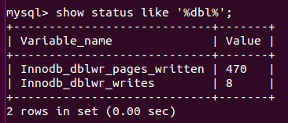

# DBA101 - MySQL - 关系型数据库

返回[DBA201 - Redis](./DBA201.md)

[TOC]

## MySQL

### 基础架构 />


| 层级        | 组件     | 备注                                               |
| ----------- | -------- | -------------------------------------------------- |
| 客户端      |          | 向数据库发送请求，例如：cli, jdbc, navicat, sqlyog |
| MySQL服务器 | 连接器   | 控制用户的连接。                                   |
|             | 查询缓存 | MySQL 8移除了该模块。                              |
|             | SQL接口  | 用来接收用户的SQL命令，返回用户需要的查询结果。    |
|             | 分析器   | 词法分析、语法分析。                               |
|             | 优化器   | 优化SQL语句，规定执行流程。                        |
|             | 执行器   | SQL语句的实际执行组件。                            |
| 存储引擎    |          | 负责数据的存储和提取。                             |

#### 连接器

连接命令一般这么写：

```shell
mysql -h$ip -P$port -u$user –p$password
```

连接成功之后，若没有后续动作则这个连接就处于空闲状态，查看连接的命令：

```mysql
mysql> show processlist
```

Command 列显示为“Sleep”的这一行，就表示系统里有一个空闲连接。客户端如果长时间没动静，连接器会将其断开。这个时间由wait_timeout参数控制，默认八小时。


##### 长连接占用内存问题

为了减少建立连接，建议使用长连接。但是全部使用长连接之后，可能会发现MySQL内存占用涨幅迅速，这是因为MySQL在执行过程中，使用的内存是管理在连接对象里的，这些资源只有在断开连接时才会被释放。所以如果长连接累积下来，可能导致内存占用过大，被系统强杀（OOM），从先现象上看就是MySQL异常重启了。

考虑以下两种方案解决这个问题：

- 定期断开长连接，之后查询再重连。

- MySQL5.7 级以上版本，可以在每次执行一个较大操作后通过执行mysql_reset_connection来重新初始化连接资源，回到连接刚创建时的状态。

##### 不使用连接池建立连接

如果不使用连接池，建立连接需要经过以下流程：

- TCP建立连接的三次握手

- MySQL认证的三次握手

- 真正的SQL执行

- MySQL的关闭

- TCP的四次握手关闭

虽然实现简单，但是多了非常多我们不关心的网络交互。

##### 使用连接池建立连接

###### 连接池的建立

一般在系统初始化时，连接池会根据系统配置建立，并在池中创建了几个连接对象，以便使用时能从连接池中获取。连接池中的连接不能随意创建和关闭，这样避免了连接随意建立和关闭造成的系统开销。Java中提供了很多容器类可以方便的构建连接池，例如Vector、Stack等。

###### 连接池的管理

连接池管理策略是连接池机制的核心，连接池内连接的分配和释放对系统的性能有很大的影响。其管理策略是：

- 当客户请求数据库连接时，首先查看连接池中是否有空闲连接，如果存在空闲连接，则将连接分配给客户使用；如果没有空闲连接，则查看当前所开的连接数是否已经达到最大连接数，如果没达到就重新创建一个连接给请求的客户；如果达到就按设定的最大等待时间进行等待，如果超出最大等待时间，则抛出异常给客户。

- 当客户释放数据库连接时，先判断该连接的引用次数是否超过了规定值，如果超过就从连接池中删除该连接，否则保留为其他客户服务。

该策略保证了数据库连接的有效复用，避免频繁的建立、释放连接所带来的系统资源开销。

###### 连接池的关闭

当应用程序退出时，关闭连接池中所有的连接，释放连接池相关的资源，该过程正好与创建相反。

##### 连接池的不同代

一般来讲采用单线程同步的架构设计都属于第一代连接池，采用多线程异步架构的则属于第二代连接池。使用线程池可以减少网路开销、限制连接总数、提高系统性能。

##### 连接池的主要参数

| 参数                          | 备注                                                         |
| ----------------------------- | ------------------------------------------------------------ |
| thread_handling               | 该参数是配置线程模型，默认情况是one-thread-per-connection，即不启用线程池；将该参数设置为pool-of-threads即启用了线程池。 |
| thread_pool_size              | 该参数是设置线程池的Group的数量，默认为系统CPU的个数，充分利用CPU资源。 |
| thread_pool_oversubscribe     | 该参数设置group中的最大线程数，每个group的最大线程数为thread_pool_oversubscribe+1，注意listener线程不包含在内。 |
| thread_pool_high_prio_mode    | 高优先级队列的控制参数：transactions：（默认）这个模式中已经启动事务的语句放到高优先级队列中。statements：这个模式中所有的语句都会放到高优先级队列中，不会使用到低优先级队列。none：这个模式中不使用高优先级队列。 |
| thread_pool_high_prio_tickets | 该参数控制每个连接最多允许多少次被放入高优先级队列中，默认为4294967295，注意这个参数只有在thread_pool_high_prio_mode为transactions的时候才有效果。 |
| thread_pool_idle_timeout      | worker线程最大空闲时间，默认为60秒，超过限制后会退出。       |
| thread_pool_max_threads       | 该参数用来限制线程池最大的线程数，超过该限制后将无法再创建更多的线程，默认为100000。 |
| thread_pool_stall_limit       | 该参数设置timer线程的检测group是否异常的时间间隔，默认为500ms。 |

#### 查询缓存

连接建立后，就可以执行select语句了。MySQL拿到查询请求会先查看缓存，一般缓存key为查询语句，value为查询结果。若没有对应缓存，则继续后面的步骤。执行完成将结果存入查询缓存。

但是大多数情况不建议使用查询缓存，MySQL 8.0 版本直接将查询缓存的整块功能删掉了。

- 第一个是查询缓存的命中率非常低，缓存要求查询SQL语句必须完全相同，SQL语句只要有有任何不同，比如多一个空格或者大小写不同，都会认为是不同的SQL语句，导致缓存不命中。

- 第二个是查询缓存的失效非常频繁，只要表结构有改动或者表中数据发生更新，那么与这个表有关的所有的查询缓存都会被清空。

#### 分析器

*这条sql要做什么*

如果没有命中缓存，就要开始真正执行语句了。MySQL需要对sql语句解析。

##### 词法分析

把一个完整的 SQL 语句分割成一个个的字符串，例如识别“select”关键字，“ID”识别为“列ID”。

##### 语法分析

根据词法分析的结果，按照语法规则检查判断是否满足MySQL语法。

##### 预处理器

进一步去检查解析树是否合法，比如表名是否存在，语句中表的列是否存在等等。在这一步MySQL也会检验用户是否有表的操作权限。预处理之后会得到一个新的AST(抽象语法树)。


**优化器**

*这条sql要怎么做*

查询优化器的作用就是根据解析树生成不同的执行计划，然后选择一种最优的执行计划。

优化器分为两种方式：

- 基于规则的优化(RBO)

- 基于成本的优化(CBO)，MySQL使用的种类

优化器进行的优化处理包括：

- 当有多个索引可用的时候，决定使用哪个索引。

- 在一个语句有多表关联（join）的时候，决定各个表的连接顺序，以哪个表为基准表。

**执行器**

*真正的执行阶段*

开始执行前，要先判断你对这个表是否具有权限。

- 如果没有，会返回没有权限的错误信息。
- 如果有权限，执行器会根据表的引擎定义，去使用这个引擎提供的接口。

以此SQL语句为例：

```mysql
mysql> select * from T where ID=10;
```

表T中ID字段没有索引，执行器的执行过程是这样的：

- 调用InnoDB引擎取表的第一行，判断ID是否是10，如果是则将这行存到结果集中。

- 调用引擎接口取表的“下一行”，重复1的逻辑，直到取到最后一行。

- 执行器将上述遍历过程中所有满足条件的行组成的结果集返回。

更新流程还涉及两个重要的日志模块：redo log(重做日志)和binlog(归档日志)。

### 存储引擎

#### InnoDB

InnoDB是MySQL 5.5.5.以后的默认引擎。

##### 存储结构

InnoDB引擎使用B+树作为索引结果。InnoDB表数据文件本身就是一个索引结构，树的叶节点data域保存了完整的数据记录，每个节点对应innodb的一个page，page大小是固定的，一般设为16k。key太长会导致一个页当中能够存放的key的数目变少，间接导致索引树的页数目变多，索引层次增加，从而影响整体查询变更的效率。

这种数据行跟相邻的键值紧凑存储在一起的存储方式，叫做**聚集索引**。

因为InnoDB的数据文件本身要按主键聚集，所以InnoDB要求表必须有主键(MyISAM可以没有)，如果没有显式指定，则mysql会自动选择一个可以唯一标识数据记录的列作为主键。如果不存在这种列，则mysql自动为InnoDB表生成一个隐含字段作为主键，这个字段长度为6个字节，类型为长整型。


InnoDB的所有辅助索引都引用主键作为data域。

下图为定义在Col3上的一个辅助索引。


因此InnoDB的索引能提供一种非常快速的主键查找性能。

不过，它的辅助索引也会包含主键列，所以如果主键定义的比较大，其他索引也将很大。InnoDB 不会压缩索引。

##### 逻辑存储结构


###### 表空间

从InnoDB存储引擎的逻辑存储结构看，所有数据都被逻辑地存放在一个空间中，称之为表空间(tablespace)。

从功能上来看，InnoDB存储引擎的表空间分为系统表空间，独占表空间，通用表空间，临时表空间，Undo表空间。

- 如果开启了独立表空间innodb_file_per_table=1，每张表一个单独的.ibd文件。

- 如果关闭了独立表空间innodb_file_per_table=0，所有基于InnoDB存储引擎的表数据都会记录到系统表空间，文件名为ibdata1。

###### 段

表空间是由各个段组成的，常见的段有数据段、索引段、回滚段等。

###### 区

一个区由64个连续的页组成，一个区的大小=1M=64个页(16K)。

###### 页

InnoDB 每个页默认大小时是 16KB，页是 InnoDB管理磁盘的最小单位，也InnoDB中磁盘和内存交互的最小单位。

索引树（B+树）上一个节点就是一个页，MySQL规定一个页上最少存储2个数据项。如果向一个页插入数据时，这个页已将满了，就会从区中分配一个新页。如果向索引树叶子节点中间的一个页中插入数据，如果这个页是满的，就会发生页分裂。

操作系统管理磁盘的最小单位是磁盘块，是操作系统读写磁盘最小单位，Linux中页一般是4K，可以通过命令查看。

**行**

InnoDB的数据是以行为单位存储的，1个页中包含多个行。

##### 双写Double Write

Double Write保证了InnoDB存储引擎数据页的可靠性。

InnoDB默认一个页的大小是16k，如果一个页没有写完整出现故障，这种页叫做corrupt page，这种情况叫部分写失效(partial page write)。

InnoDB崩溃恢复，redo恢复数据的前提是页是完整干净的，corrupt page不恢复又会造成写入丢失。


Double Write由两部分组成，一部分在磁盘上，存在于ibdata1中的一个段对象，这个段由两个区(每个1M)组成，另一部分在内存中，叫double write buffer，也是2M，大小固定，不支持调整。

缓冲池中的页落盘时，不直接写入对应的ibd文件中，第一步是先拷贝到double write buffer中，再先从double write buffer中写入double write段对象(2M循环，顺序写入，只有一次IO)，成功写满2M也就是128个页后，再根据(space,page_no)写入对应ibd(随机io)。

如果写double write时发生crash，此时ibd是干净的，服务启动后通过redo进行恢复。

如果写ibd时发生crash，此时double write中存在副本，可以直接覆盖到ibd中对应的页中，然后再继续redo恢复。

查看是否开启双写

InnoDB_doublewrite=1表示启动double write


show status like 'dbl%'可以查询double write的使用情况

InnoDB_dblwr_pages_written 从bp flush 到 DBWB的个数

InnoDB_dblwr_writes 写文件的次数

每次写操作合并page的个数= InnoDB_dblwr_pages_written/InnoDB_dblwr_writes



#### MyISAM

MyISAM是MySQL5.5.5之前的默认的引擎。

##### 存储结构

MyISAM引擎使用B+树作为索引结果，叶节点的data域存放的是数据记录的地址。

MyISAM不强制要求每个表都有主键。

下图为MyISAM表的主索引，Col1为主键。


在MyISAM中，主索引和辅助索引在结构上没有任何区别，只是主索引要求key是唯一的，而辅助索引的key可以重复。

下图在Col2上建立一个辅助索引。


因此，MyISAM中索引检索的算法为首先按照B+Tree搜索算法搜索索引，如果指定的Key存在，则取出其data域的值，然后以data域的值为地址，读取相应数据记录。

MyISAM数据文件跟索引文件你分开存放的存储方式叫做**非聚集索引**，与InnoDB的聚集索引区分。

#### InnoDB VS MyISAM

| 存储引擎     | InnoDB                                                       | MyISAM                                                       |
| ------------ | ------------------------------------------------------------ | ------------------------------------------------------------ |
| 索引类型     | 聚簇索引和非聚簇索引                                         | 非聚簇索引                                                   |
| 支持锁       | 支持行锁和表锁                                               | 支持表锁                                                     |
| 支持事务     | InnoDB**支持事务和MVCC**.                                    | MyISAM**不支持事务**和MVCC.                                  |
| 支持全文索引 | 在5.6.4版本提供了对全文索引的支持。                          | MyISAM支持FULLTEXT类型的全文索引。                           |
| 支持外键     | InnoDB支持外键。                                             | 不支持外键。                                                 |
| 表的总行数   | InnoDB中**不保存表的行数**，如select count() from table时，InnoDB需要扫描一遍整个表来计算有多少行。 | MyISAM中**保存表的行数**，执行select count() from table只要简单的读出保存好的行数即可。注意的是，当count()语句包含where条件时MyISAM也需要扫描整个表。 |
| 自增长       | 支持自动增加列属性**auto_increment**. 对于自增长的字段，InnoDB中必须包含只有该字段的索引。InnoDB只会把自增主键的最大id记录在内存中，所以当表删除条目重启之后会导致最大id丢失，即变小。 | 对于自增长的字段，在MyISAM表中可以和其他字段一起建立联合索引，不必须包含只有该字段的索引。删除条目重启之后MyISAM的最大id不会有变化。 |
| 清空整张表   | 清空整张表时，InnoDB是一行一行的删除，效率非常慢。           | 清空整张表时，MyISAM会重建表。                               |
| 适合场景     | 大量INSERT, DELETE, UPDATE操作                               | 大量SELECT操作                                               |

#### Memory

如果需要快速访问数据且这些数据不会被修改，重启以后丢失也没有关系，那么使用 Memory 表是非常有用的。Memory表支持哈希索引，因此至少要比MyISAM表快一个数量级。所有数据都保存在内存，不需要磁盘IO，表结构在重启后会保留，但数据会丢失。

Memory表使用表级锁，因此并发写入的性能较低。它不支持 BLOB 和 TEXT 类型的列，并且每行的长度是固定的，所以即使指定了 VARCHAR 列，实际存储时也会转换成CHAR，这可能导致部分内存的浪费。

如果MySQL在执行查询的过程中需要使用临时表来保持中间结果，内部使用的临时表就是 Memory表。如果中间结果太大超出了Memory表的限制，或者含有BLOB或TEXT字段，临时表会转换成MyISAM表。

### 日志

#### 重做日志redo log

##### 作用

确保事务的**持久性**。

防止在发生故障的时间点，尚有脏页未写入磁盘，在重启mysql服务的时候，根据redo log进行重做，从而达到事务的持久性这一特性。

##### 内容

InnoDB存储引擎上的物理格式的日志，记录的是物理数据页面的修改的信息，其redo log是顺序写入redo log file的物理文件中去的。

##### 什么时候产生

事务开始之后就产生redo log，redo log的落盘并不是随着事务的提交才写入的，而是在事务的执行过程中，便开始通过Master Thread线程的定时任务写入redo log文件中。

##### 什么时候释放

当对应事务的脏页写入到磁盘之后，redo log的使命也就完成了，重做日志占用的空间就可以重用（被覆盖）。


#### 回滚日志undo log

##### 作用

确保事务的**原子性**。

保存了事务发生之前的数据的一个版本，可以用于回滚，同时可以提供多版本并发控制下的读（MVCC），也即非锁定读。

##### 内容

InnoDB存储引擎上的逻辑格式的日志，在执行undo的时候，仅仅是将数据从逻辑上恢复至事务之前的状态，而不是从物理页面上操作实现的，这一点是不同于redo log的。

##### 什么时候产生

事务开始之前，将当前是的版本生成undo log，undo也会产生redo来保证undo log的可靠性。

##### 什么时候释放

当事务提交之后，undo log并不能立马被删除，而是放入待清理的链表，由purge线程判断是否存在其他事务在使用undo段中表的上一个事务之前的版本信息，再决定是否可以清理undo log的日志空间。

##### 如果没有redo log只有undo log

那么就必须保证提交前刷脏完成，否则宕机时有些修改就在内存中丢失了，破坏了持久性。

这样带来了性能差的问题。

##### 如果没有undo log只有redo log

那么就不能随心所欲地在事务提交前刷脏，即无法支持大事务。

假如、某张表有 100 亿的 8 字节整数数据，就算不考虑其他东西带来的损耗，光 update 整张表至少要消耗 80G 的内存。如前所述，有了 undo log，就可以随便刷脏。

#### 二进制日志binlog

##### 作用

###### 主从同步

- 第一步是在主库上记录二进制日志。每次准备提交事务、完成数据更新前，MySQL会按事务提交的顺序（而非每条语句的执行顺序）来记录二进制日志，而后主库告诉存储引擎可以提交事务了。

- 下一步备库启动一个工作的IO线程跟主库建立一个普通的客户端连接，然后在主库上启动一个特殊的二进制转储线程读取主库上二进制日志中的事件。如果该线程追赶上了主库将进入睡眠状态，直到主库发送信号量通知其有新的事件产生时才会被唤醒，备库IO线程会将接收到的事件记录到中继日志中。

- 最后一步，备库从中继日志中读取事件并执行，从而实现备库数据的更新。

###### 用于数据库的基于时间点的还原。

以定时做全量备份，以及备份增量的binlog日志为前提。恢复到任意时间点首先将全量备份恢复之后，再此基础上回放增加的binlog直至指定的时间点。

##### 内容

逻辑格式的日志，同时包括了执行的sql语句（增删改）反向的信息，也就意味着delete对应着delete本身和其反向的insert；update对应着update执行前后的版本的信息；insert对应着delete和insert本身的信息。在使用mysqlbinlog解析binlog之后一些都会真相大白。因此可以基于binlog做到类似于oracle的闪回功能，其实都是依赖于binlog中的日志记录。

binlog有三种模式：

- Statement（基于SQL语句的复制）

- Row（基于行的复制）

- Mixed（混合模式）

##### 什么时候产生

事务提交的时候，一次性将事务中的sql语句（一个事物可能对应多个sql语句）按照一定的格式记录到binlog中。因此在开启了binog的情况下，对于较大事务的提交，可能会变得比较慢一些。

##### 什么时候释放

binlog的默认是保持时间由参数expire_logs_days配置，也就是说对于非活动的日志文件，在生成时间超过expire_logs_days配置的天数之后，会被自动删除。


#### redo/undo log VS binlog

|          | redo/undo log                                                | binlog                                                       |
| -------- | ------------------------------------------------------------ | ------------------------------------------------------------ |
| 层次     | redo/undo log是innodb引擎层维护的                            | binlog是mysql server层维护的，跟采用何种引擎没有关系，记录的是所有引擎的更新操作的日志记录 |
| 记录内容 | redo log是物理日志，undo log是逻辑日志，记录的是每个页/每个数据的修改情况 | binlog记录的都是事务操作内容，格式是二进制的                 |
| 记录时机 | redo/undo log在事务执行过程中会不断的写入                    | binlog是在事务最终提交前写入的，什么时候刷新到磁盘跟参数sync_binlog相关 |
| 记录方式 | redo/undo log是循环写的，空间会用完                          | binlog是可以追加写的，不会覆盖之前的日志信息                 |

#### 二阶段提交

MySQL使用两阶段提交主要解决binlog和InnoDB redo log的数据一致性的问题，以此SQL为例：

```sql
update test set age = age +1 where id = 1
```

- 执行器先去引擎找id=1的这一行，id是主键引擎直接用树搜索找到这一行。如果这一行的数据页在内存中，就直接返回给执行器，否则就需要从磁盘读取然后在返回。

- 执行器拿到引擎提供的行数据，给age字段加1，比如原来是9，现在就是10，得到新的一行数据，在调用引擎接口写入这行数据

- 引擎将新的数据行更新到内存中，同时将这个更新操作记录到redo log，此时redo log处于prepare状态，然后告知执行器执行完成了，随时可以提交事务

- 执行器生成这个操作的binlog,并把binlog写入磁盘

- 执行器调用引擎接口，引擎把刚刚写的redo log改成提交commit状态，更新完成。

备注: 每个事务binlog的末尾，会记录一个 XID event，标志着事务是否提交成功，也就是说，recovery 过程中，binlog最后一个 XID event 之后的内容都应该被 purge。


##### 如果不使用二阶段提交

以此SQL为例：

```sql
update user set age='23' where id='1'
```

###### 先写redo log后写binlog

还没写完binlog时，MySQL异常了重启，恢复后，本例中age应该=23；但是由于binlog没有写完crash了，binlog没有记录这个语句；若用binlog来恢复临时库，恢复出来age=21，与原库中的值不同。

###### 先写binlog再写redo log

binlog写后，crash了，redo log还没写，恢复后，这个事务无效，age=21。但binlog恢复后，记录了将age=23，会多出一个事务，与原库值也不同。

### CheckPoint检查点机制

**当数据库发生宕机时**，数据库不需要重做所有的日志，因为Checkpoint之前的页都已经刷新回磁

盘。数据库只需对Checkpoint后的重做日志进行恢复，这样就大大缩短了恢复的时间。

**当缓冲池不够用时**，根据LRU算法会溢出最近最少使用的页，若此页为脏页，那么需要强制执行

Checkpoint，将脏页也就是页的新版本刷回磁盘。

**当重做日志出现不可用时**，因为当前事务数据库系统对重做日志的设计都是循环使用的，并不是让

其无限增大的。重做日志可以被重用的部分是指这些重做日志已经不再需要，当数据库发生宕机

时，数据库恢复操作不需要这部分的重做日志，因此这部分就可以被覆盖重用。如果重做日志还需

要使用，那么必须强制Checkpoint，将缓冲池中的页至少刷新到当前重做日志的位置。

## 关系型数据库

采用了关系模型来组织数据的数据库，其以行和列的形式存储数据。

### 常见的关系型数据库

#### Oracle

最贵，功能最多，安装最不方便，Oracle环境里的其他相关组件最多，支持平台数量一般，使用中等方便，开发中等方便，运维中等方便，不开源，速度最慢，最安全。

#### Microsoft SQL Server

中等贵，功能最少，安装中等方便，Microsoft SQL Server 2014环境里的其他相关组件最少，支持平台最少，使用最方便，开发最方便，运维最方便，不开源，速度中等，一般安全。

#### MySQL

免费，功能中等，安装最方便，Mysql环境里的其他相关组件数量中等，支持平台最多，使用最不方便，开发最不方便，运维最不方便，有开源版本，速度最快，最不安全。

#### MySQL VS Oracle

|                   | MySQL                                                        | Oracle                                                       |
| ----------------- | ------------------------------------------------------------ | ------------------------------------------------------------ |
| 数据库等价于      | 一个数据库DB                                                 | 一个用户Schema                                               |
| 自增长            | 自增长主键  字段的auto_increment属性                         | 序列（Sequence）                                             |
| 查询语句分页      | limit  [offset,] <row count>                                 | rownum伪列（且需要注意陷阱）                                 |
| 真假判断          | 真1假0                                                       | 真true假false                                                |
| 无引用查询        | select  sysdate();                                           | 需要引用虚表（select sysdate from dual;）                    |
| 备份命令          | mysqldump  执行结果是一个（文本sql命令），可以直接导入到其它mysql数据库，甚至可以稍作修改导入到其它类型的数据库 | dpdump  执行结果是一个二进制的dmp文件，只能Oracle自己用（甚至还有版本限制） |
| 命令默认commit    | 是                                                           | 不是                                                         |
| 注释行            | # 注释内容                                                   | -- 注释内容                                                  |
| 日期转换          | dateformat()函数                                             | to_date()与to_char()两个函数                                 |
| 字符串            | 单引号/双引号引用                                            | 单引号引用                                                   |
| 字符串连接        | concat()参数不限                                             | concat()参数两个 和 \|\|                                     |
| 查询格式信息      | show tables;                                                 | select *  from user_tables;                                  |
| 大小写敏感        | Unix/Linux下的数据库名、表名                                 | 无                                                           |
| 执行脚本/外部命令 | mysql>source  a.sql;                                         | SQL>@a.sql                                                   |
| 类型支持          | 支持枚举类型（enum）  支持集合类型（set）                    | 需要外键                                                     |

#### MySQL VS DB2

|                | MySQL                          | DB2                                  |
| -------------- | ------------------------------ | ------------------------------------ |
| 主备复制       | 逻辑复制                       | 物理复制，要求主备架构、配置一致     |
| 复制日志       | 提交的日志                     | 提交和回滚的日志                     |
| 事务跨越       | 事务跨越数据库                 | 事务不可跨越独立日志、表空间、缓冲区 |
| 多版本         | 支持多版本，从UNDO构造历史版本 | 只有落实和未落实版本                 |
| 受影响的记录数 | 默认是实际更改的行数           | 默认是实际匹配的行数                 |
| UPDATE SET计算 | 从左往右的实时计算             | 全部使用更新前的值计算               |
| HASH JOIN      | MySQL 8以后支持                | 支持                                 |
| 窗口函数       | MySQL 8以后支持                | 支持                                 |
| 支持CTE        | MySQL 8以后支持                | 支持                                 |
| 更新游标       | 不支持                         | 支持                                 |

### 范式

范式就是规范。

#### 第一范式（1NF）

指数据库表的每一列都是不可分割的基本数据项。（列数据的不可分割）


#### 第二范式（2NF）

想要满足第二范式必须先满足第一范式。

指数据库表的每一行都可以被唯一的区分，为此要加上一列以储存每一行的唯一表示。（主键）


#### 第三范式（3NF）

要满足第三范式必须先满足第二范式。

指数据库表的每一行再被主键标识的基础上，不存在已在其他表上包含的函数关系，即不能依赖于本表非关键字数据元素。（外键）


#### 反三范式

有时为了效率，可以设置重复或者可以推导出的字段。

例如：订单（总价） 和 订单项（单价）

### 存储过程

存储过程是一个预编译的SQL语句，只在创建时进行编译，以后每次执行存储过程都不需要再重新编译，可以大大提高数据库执行速度。

存储过程把多条SQL语句存在同一个存储过程中，可以减少客户端和服务端之间的网络传输负载。

只需创建一次，以后在该程序中就可以调用多次，减少数据库开发人员工作量。

安全性高，屏蔽对底层数据库对象的直接访问。这样用户只需要使用EXECUTE权限调用存储过程，而不必具备访问底层数据库对象的显式权限。

### 视图

视图实际上是在数据库中通过Select查询语句从多张表中提取的多个表字段所组成的虚拟表。

- 视图并不占据物理空间，所以通过视图查询出的记录并非保存在视图中，而是保存在原表中。

- 通过视图可以对指定用户隐藏相应的表字段，起到保护数据的作用。

- 在满足一定条件时，可以通过视图对原表中的记录进行增删改操作。

- 创建视图时，只能使用单条select查询语句。

下面是视图的常见使用场景：

- 重用SQL语句，在编写查询后可以方便的重用它而不必知道它的基本查询细节。

- 简化复杂的SQL操作；使用表的组成部分而不是整个表。

- 保护数据：可以给用户授予表的特定部分的访问权限而不是整个表的访问权限。

- 更改数据格式和表示。视图可返回与底层表的表示和格式不同的数据。

### 触发器

触发器是一种特殊的存储过程，主要是通过条件来触发而被执行操作的。

它可以强化约束，来维护数据的完整性和一致性，可以跟踪数据库内的操作从而不允许未经许可的更新和变化。可以联级运算。如，某表上的触发器上包含对另一个表的数据操作，而该操作又会导致该表触发器被触发。

### 分库&分表

分库和分表是两个独立的概念，都是为了防止数据库服务因为同一时间的访问量（增删查改）过大导致宕机而设计的一种应对策略。

#### 分库

将一个库的数据拆分到多个库中，访问的时候根据一定条件访问单库，缓解单库的性能压力。

#### 分表

如果单表的数据量太大，就会影响SQL语句的执行性能。分表就是将单表的数据按照特定策略拆分到多个表中，这样就将每次查询的数据范围缩小了，可以提升SQL语句的执行性能。

#### 水平拆分

把一个表的数据拆分到多个结构相同的库或表里面去，数据汇总起来就是全部数据。

水平拆分的意义在于将数据均匀地存放在各个库表里，依靠多个库来杠更高的并发，而且还能借助多个库的存储容量来进行扩容。

#### 垂直拆分

把一个有很多字段的表给拆分成多个库或表上面去，每个库表都包含原表的部分字段。一般来说会将较少的访问频率很高的字段放到一个表里面去，然后将较多的访问频率很低的字段放到另外一个表里面去。因为数据库是有缓存的，你访问频率高的行字段越少，就可以在缓存里面缓存更多的行，性能也就越好。一般在表层面做的较多一些。

#### 按照范围拆分

优点在于扩容的时候非常简单，比如只要预备好每个月都准备一个库就可以了，到了下一个新的月份自动将数据写入新的库。

缺点则是如果大部分请求都是访问最新的数据，那么这种方式很容易会产生热点问题，大量的流量都打在最新的数据上了。分库分表的设计目的就只是简单的扩容，而不是为了应对高并发了。

#### 按照哈希值拆分

优点在于可以平均分配每个库表的数据量和请求压力。

缺点在于扩容比较麻烦，因为会存在一个数据迁移的过程，即之前的数据需要重新计算hash值并重新分配到不同的库表中。

#### 分表的时机

具体情况根据数据库服务器的配置和架构有关，以下仅供参考：

- 当oracle单表的数据量大于2000万行时，建议进行水平分拆。
- 当mysql单表的数据量大于1000万行时，建议进行水平分拆。

### IO瓶颈

第一种：磁盘读IO瓶颈，热点数据太多，数据库缓存放不下，每次查询时会产生大量的IO，降低查询速度。

解决方法：分库和垂直分表

第二种：网络IO瓶颈，请求的数据太多，网络带宽不够。

解决方法：分库

### CPU瓶颈

第一种：SQL问题，如SQL中包含join，group by，order by，非索引字段条件查询等，增加CPU运算的操作。

解决方法：SQL优化，建立合适的索引，在业务Service层进行业务计算。

第二种：单表数据量太大，查询时扫描的行太多，SQL效率低，CPU率先出现瓶颈。

解决方法：水平分表

### 数据库优化

归纳为5个层次：

#### 减少数据访问（减少磁盘访问）

创建并使用正确的索引

只通过索引访问数据

优化SQL执行计划（数据访问算法）

#### 返回更少数据（减少网络传输或磁盘访问）

数据分页处理

只返回需要字段

#### 减少交互次数（减少网络传输）

使用储存过程

优化业务逻辑

#### 减少服务器CPU开销（减少CPU及内存开销）

合理使用排序

减少比较操作

复杂运算在客户端处理

#### 利用更多资源（增加资源）

客户端多进程并行访问

数据库并行处理

