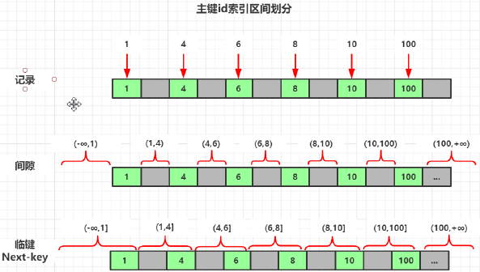
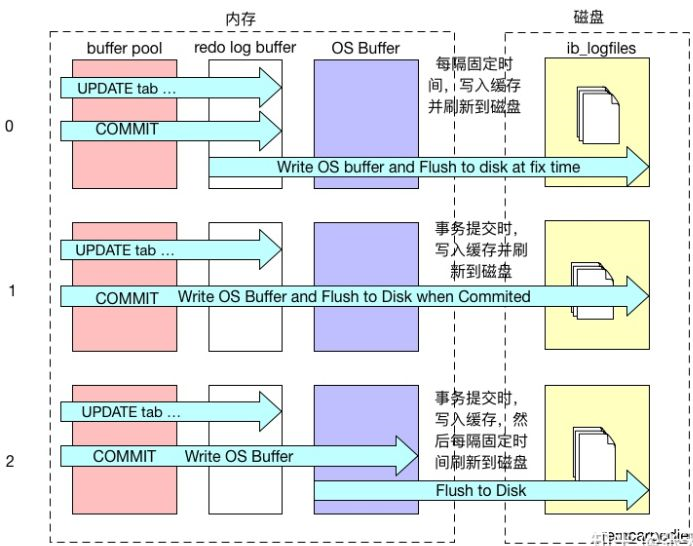

# DBA1012 - 事务、MVCC 与锁

返回[DBA101 - MySQL](./DBA101.md)

[TOC]

## 本章主线

```text
Transaction（事务）
  → ACID
  → 并发问题（脏读/不可重复读/幻读/更新丢失）
  → 隔离级别（RU/RC/RR/Serializable）
  → MVCC（Undo 版本链 + ReadView）
  → 快照读 vs 当前读
  → Lock（S/X、Record/Gap/Next-Key）
  → SELECT ... FOR UPDATE
  → Deadlock
```

一条贯穿全章的故事线：**读写互相阻塞太贵 → 用 MVCC 让读不加锁 → 但写写冲突还是要锁 → 锁与索引绑定 → 锁不当产生死锁**。

------------------------------------------------------------------------

# 1. 事务与 ACID【P0】

## 什么是事务

数据库事务是指：几个SQL语句，要么全部执行成功，要么全部执行失败。比如银行转账就是事务的典型场景。

数据库事务的三个常用命令：Begin Transaction, Commit Transaction, Rollback Transaction.

**InnoDB**支持数据库事务。

## ACID 基本要素

| 特性            | 含义                                         | InnoDB 靠什么实现          |
| --------------- | -------------------------------------------- | -------------------------- |
| Atomicity 原子性 | 整体成功或失败，不可分割                     | **Undo Log**（回滚）       |
| Consistency 一致性 | 事务前后满足约束，数据从一个一致状态到另一个 | 原子性+持久性+隔离性共同保证 |
| Isolation 隔离性 | 并发事务互相看不到中间状态                   | **读写锁 + MVCC**          |
| Durability 持久性 | 提交后的改动永久生效，宕机不丢               | **Redo Log**（WAL）        |

> **面试提示**：回答 ACID 时不要只背四个词，要能接住追问"每个特性靠什么实现"——原子性靠 Undo，持久性靠 Redo，隔离性靠锁 + MVCC。这直接把话题接到 [DBA1011 日志三件套](./DBA1011.md)。

### 例子

更新 KYC Case + 相关本地业务记录，如果要求原子完成，可使用一个数据库事务。

### 放回系统

**本地事务不会自动把 `DB + RPC + MQ` 变成一个原子操作。** 涉及 RPC、MQ 时还需要额外的幂等、重试或最终一致性设计。

### 面试回答

> 事务把一组数据库操作作为一个逻辑工作单元。ACID 是原子性、一致性、隔离性和持久性。实现上，InnoDB 用 Undo Log 保证原子性，用 Redo Log 配合 WAL 保证持久性，用读写锁加 MVCC 保证隔离性。后端工程里尤其要明确本地事务边界——一旦跨了 RPC 或 MQ，原子性就不再自动成立，需要幂等和最终一致性设计。

------------------------------------------------------------------------

# 2. 并发问题：脏读 / 不可重复读 / 幻读 / 更新丢失【P0】

先看四个并发异常的定义，再看隔离级别如何消除它们。

## 更新丢失

### 回滚丢失

在事务A期间，事务B对数据进行了更新；在事务A撤销之后，覆盖了事务B已经提交的数据。

| 时间 | 事务A                        | 事务B                       |
| ---- | ---------------------------- | --------------------------- |
| T1   | 开始事务                     |                             |
| T2   |                              | 开始事务                    |
| T3   | 查询账户余额为1000元         |                             |
| T4   |                              | 查询账户余额为1000元        |
| T5   |                              | 汇入100元，余额更改为1100元 |
| T6   |                              | 提交事务                    |
| T7   | 取出100元把余额改为900元     |                             |
| T8   | 撤销事务                     |                             |
| T9   | 余额恢复为1000元（丢失更新） |                             |

### 覆盖丢失/两次更新问题

在事务A期间，事务B对数据进行了更新；在事务A提交之后，覆盖了事务B已经提交的数据。

| 时间 | 事务A                        | 事务B                      |
| ---- | ---------------------------- | -------------------------- |
| T1   | 开始事务                     |                            |
| T2   |                              | 开始事务                   |
| T3   | 查询账户余额为1000元         |                            |
| T4   |                              | 查询账户余额为1000元       |
| T5   |                              | 取出100元，余额更改为900元 |
| T6   |                              | 提交事务                   |
| T7   | 汇入100元                    |                            |
| T8   | 提交事务                     |                            |
| T9   | 余额更改为1100元（丢失更新） |                            |

## 脏读

读取一个事务未提交的更新。

| 时间 | 事务A                      | 事务B                    |
| ---- | -------------------------- | ------------------------ |
| T1   | 开始事务                   |                          |
| T2   |                            | 开始事务                 |
| T3   | 查询账户余额为1000元       |                          |
| T4   | 取出100元，余额更改为900元 |                          |
| T5   |                            | 查询账户余额为900元      |
| T6   |                            | 汇入100元                |
| T7   | 撤销事务                   |                          |
| T8   |                            | 提交事务                 |
| T9   |                            | 余额更改为1000元（脏读） |

## 不可重复读

同一个事务中两次读取相同的记录，结果不一样。

| 时间 | 事务A                              | 事务B                       |
| ---- | ---------------------------------- | --------------------------- |
| T1   | 开始事务                           |                             |
| T2   |                                    | 开始事务                    |
| T3   | 查询账户余额为1000元               |                             |
| T4   |                                    | 查询账户余额为1000元        |
| T5   |                                    | 汇入100元，余额更改为1100元 |
| T6   | 查询账户余额为1100元（不可重复读） |                             |

## 幻读

两次读取的结果包含的行记录不一样。

| 时间 | 事务A                                       | 事务B        |
| ---- | ------------------------------------------- | ------------ |
| T1   | 开始事务                                    |              |
| T2   |                                            | 开始事务     |
| T3   | 读取用户列表，只有张三1个用户               |              |
| T4   |                                            | 新增用户李四 |
| T5   | 读取用户列表，共有张三、李四2个用户（幻读） |              |

> **概念区分**：不可重复读针对**同一行的值变化**（UPDATE）；幻读针对**结果集行数变化**（INSERT/DELETE）。

------------------------------------------------------------------------

# 3. 隔离级别【P0】

事务隔离级别越高，数据库性能越差。

| 隔离级别                           | 改进                                                     | 更新遗失 | 脏读 | 不可重复读 | 幻读 |
| ---------------------------------- | -------------------------------------------------------- | -------- | ---- | ---------- | ---- |
| 没有并发控制                       |                                                          | √        | √    | √          | √    |
| 可读取未确认Read Uncommitted       | **写**事务阻止其他**写**事务                             |          | √    | √          | √    |
| 可读取确认Read Committed           | **写**事务阻止其他**读写**事务                           |          |      | √          | √    |
| 可重复读Repeatable Read(MySQL默认) | **读**事务阻止其他**写**事务                             |          |      |            | √    |
| 串行化Serializable                 | **读**加共享锁，**写**加排他锁，读读并发，读写、写写互斥 |          |      |            |      |

## 面试回答

> 四个常见隔离级别是 RU、RC、RR、Serializable，隔离逐渐增强，主要在脏读、不可重复读、幻读和并发性能之间权衡。InnoDB 常见默认是 Repeatable Read，并结合 MVCC 和锁处理并发。要补充一点：InnoDB 在 RR 下靠 MVCC + Next-Key Lock，很大程度上也控制了幻读，所以"RR 一定有幻读"这种教科书口径对 InnoDB 并不完全准确。

> **【校正】** 上表是教科书口径。对 InnoDB 的准确理解是：
>
> - RR 下的**快照读**靠 MVCC 看到"不会变化"的重复读效果；
> - RR 下的**当前读**靠 Next-Key Lock（记录锁+间隙锁）阻止范围内新插入，从而控制幻读；
> - 所以 InnoDB RR 对幻读的防护远强于 SQL 标准定义，但快照读与当前读混用时仍可能出现看似"幻读"的现象。
>
> 面试说"MySQL 默认 RR，并通过 MVCC 和 Next-Key Lock 控制幻读"比背"RR 有幻读"更准确。

------------------------------------------------------------------------

# 4. MVCC：多版本并发控制【P0】

## 为什么需要 MVCC

直觉：数据库不能因为有人在修改一行，就让所有读都排队。

MVCC = Multi-Version Concurrency Control，多版本并发控制。InnoDB 保留必要的历史版本，让一致性读不必与写操作互相阻塞，在一致性和并发性能之间取得更好的平衡。

### 例子

事务 A 开始读取后，事务 B 修改并提交；根据隔离级别和读取方式，A 仍要看到符合自己事务视角的版本。

### 用途

- 在并发读写数据库时，可以做到读操作不阻塞写操作，写操作也不阻塞读操作，提高了数据库并发读写的性能。

- 同时可以解决脏读、不可重复读、幻读等读的一致性问题，但不能解决更新丢失问题。

- 可以和锁形成两个组合，最大程度的提高数据库并发性能：
  - **MVCC + 悲观锁**：MVCC 解决读写冲突，悲观锁解决写写冲突。
  - **MVCC + 乐观锁**：MVCC 解决读写冲突，乐观锁解决写写冲突。

### 隔离级别限制

MVCC 只能在 READ COMMITTED 和 REPEATABLE READ 两个隔离级别下工作，因为 READ UNCOMMITTED 总是读取最新的数据行，而 SERIALIZABLE 则会对所有读取的行都加锁。

## 实现原理：三个隐式字段 + Undo + ReadView【P0】

主要是依赖记录中的3个隐式字段，undo日志，ReadView来实现的。

### 隐式字段

InnoDB的MVCC通过在每行记录后面保存隐藏的列来实现：

| Row1 | Row2 | DB_ROW_ID 隐式主键                                          | DB_TRX_ID 事务ID                               | DB_ROLL_PTR 回滚指针                                        |
| ---- | ---- | ------------------------------------------------------------ | ----------------------------------------------- | ------------------------------------------------------------ |
|      |      | 如果数据表没有主键，InnoDB会自动以DB_ROW_ID产生一个聚簇索引。 | 记录创建这条记录或者最近一次修改该记录的事务ID. | 配合undo log，指向这条记录的上一个版本（存储于rollback segment里）。 |

实际还有一个删除flag隐藏字段，即记录被更新或删除并不代表真的删除，而是删除flag变了。

### undo log 版本链

undo log主要分为两种：

#### insert undo log

代表事务在insert新记录时产生的undo log，只在事务回滚时需要，并且在事务提交后可以被立即丢弃。

#### update undo log

事务在进行update或delete时产生的undo log；不仅在事务回滚时需要，在快照读时也需要；所以不能随便删除，只有在快照读或事务回滚不涉及该日志时，对应的日志才会被purge线程统一清除。

对MVCC有帮助的实质是update undo log。不同事务或者相同事务对同一记录的修改，会导致该记录的undo log成为一条记录版本线性表，即链表，存在rollback segment中的旧记录链，undo log的链首就是最新的旧记录，链尾是最早的旧记录。

```text
当前行
  ↓ DB_ROLL_PTR
undo log 中的旧版本
  ↓
更老版本
```

### ReadView 判断数据行可见性【P0】

ReadView 可以理解为：**当前事务拍的一张"哪些事务版本对我可见"的规则快照。** 其中有一个列表存储系统中当前活跃的读写事务（begin了还未提交的事务），通过这个列表由近到远判断记录的某个版本是否对当前事务可见：

- 如果访问的记录事务id < ReadView列表中的最小值，说明早已提交，可以访问。

- 如果访问的记录事务id介于ReadView列表中的最小值和最大值之间，且不存在于列表中，说明早已提交，可以访问。

- 如果访问的记录事务id介于ReadView列表中的最小值和最大值之间，且存在于列表中，说明尚未提交，不可以访问。

- 如果访问的记录事务id > ReadView列表中的最大值，说明尚未提交，不可以访问。

不可见时，沿 DB_ROLL_PTR 找上一个版本，重复判断，直到找到可见版本或版本链尽头。

### RC 和 RR 的区别：ReadView 生成时机【P0】

**已提交读（RC）** 隔离级别下的事务在**每次查询**的开始都会生成一个独立的ReadView。

**可重复读（RR）** 隔离级别则在**第一次读**的时候生成一个ReadView，之后的读都复用之前的ReadView.

这就是"RR 能重复读、RC 会读到别人已提交的新值"的根源。

### 面试回答

> InnoDB 的 MVCC 可以理解成 Undo Log 版本链加 ReadView 可见性判断。更新数据时旧版本会保留在 Undo 中，普通快照读不一定要等当前写事务，而是根据自己的 ReadView 沿版本链找到可见版本，从而提高读写并发。RC 和 RR 的核心区别就在 ReadView 的生成时机：RC 每次查询生成新的，RR 只在第一次读生成后复用。

------------------------------------------------------------------------

# 5. 快照读 vs 当前读【P0/P1】

- 普通一致性 `SELECT` 是**快照读**：通过 MVCC 读取符合事务视角的版本，不加锁。

- `SELECT ... FOR UPDATE` / `SELECT ... LOCK IN SHARE MODE`、UPDATE、DELETE 需要**当前读**：读取当前最新数据并参与加锁语义。

```text
select xxx from xxx where xxx            → 无锁，快照读
select xxx from xxx where xxx for update → 当前读 + X 锁
select xxx from xxx where xxx lock in share mode → 当前读 + S 锁
update / delete / insert                 → 当前读语义
```

> **MySQL 8.0 note**：`LOCK IN SHARE MODE` 在 8.0 里等价写法是 `FOR SHARE`。

### 面试回答

> 快照读通过 MVCC 读取符合事务视角的数据版本，不加锁；当前读需要读取当前最新数据并按 InnoDB 锁规则加锁，例如 `SELECT FOR UPDATE`、UPDATE、DELETE。区分这两者是理解"为什么普通 SELECT 不阻塞别人、UPDATE 却会"的关键。

------------------------------------------------------------------------

# 6. 锁机制【P0】

## 锁的粒度

MySQL的锁机制相对其他数据库比较简单，其最显著的特点是不同的存储引擎支持不同的锁机制。

### 表级锁 (table-level locking)

InnoDB, MyISAM, MEMORY支持表级锁。

开销小，加锁快；不会出现死锁；锁定粒度大，发生锁冲突的概率最高，并发度最低。

可以通过检查table_locks_waited和table_locks_immediate状态变量来分析系统上的表级锁争夺情况。

```mysql
mysql> show status like 'table%';
+-----------------------+-------+
| Variable_name         | Value |
+-----------------------+-------+
| Table_locks_immediate | 352   |
| Table_locks_waited    | 2     |
+-----------------------+-------+
--如果Table_locks_waited的值比较高，则说明存在着较严重的表级锁争用情况。
```

### 页级锁 (page-level locking)

开销和加锁时间界于表锁和行锁之间；会出现死锁；锁定粒度界于表锁和行锁之间，并发度一般。

### 行级锁 (row-level locking)

InnoDB支持行级锁，默认使用行级锁。

开销大，加锁慢；会出现死锁；锁定粒度最小，发生锁冲突的概率最低，并发度也最高。

## S 锁与 X 锁【P0】

### 共享锁/读锁/S锁

允许一个事务去读一行，阻止其他事务获得相同数据集的排他锁。

若事务T对数据对象A加上S锁，则事务T可以读A但不能修改A。其他事务只能再对A加S锁，而不能加X锁，直到T释放A上的S锁。这保证了其他事务可以读A，但在T释放A上的S锁之前不能对A做任何修改。

SELECT语句默认不加锁。需要加共享锁可以使用语句 `SELECT * FROM XXX LOCK IN SHARE MODE`（8.0 亦可写 `FOR SHARE`）。

### 排他锁/写锁/X锁

允许获取排他锁的事务更新数据，阻止其他事务取得相同的数据集共享读锁和排他写锁。

若事务T对数据对象A加上X锁，事务T可以读A也可以修改A。其他事务不能再对A加任何锁，直到T释放A上的锁。加了排他锁的行虽然不能被加锁方式修改，但普通快照读不受影响，因为普通查询走 MVCC，不申请锁。

UPDATE, DELETE, INSERT语句默认都会自动加上排他锁。需要显式加排他锁可以使用语句 `SELECT * FROM XXX FOR UPDATE`

## 乐观锁与悲观锁【P1】

### 乐观锁

假设不会发生并发冲突，只在提交操作时检查是否违反数据完整性。在修改数据的时候把事务锁起来，通过Version的方式来进行锁定。

一般会使用版本号机制或CAS算法实现。

### 悲观锁

假定会发生并发冲突，屏蔽一切可能违反数据完整性的操作。在查询完数据的时候就把事务锁起来，直到提交事务。

使用数据库中的锁机制实现。

> **口径提示**：乐观/悲观锁是**应用层并发控制思想**，不是 MySQL 内置的锁类型。数据库层面 InnoDB 的行锁、间隙锁属于悲观实现；乐观锁通常靠业务表的 version 列 + `UPDATE ... WHERE version=?` 实现。

## 加锁方式：行锁锁的是索引【P0】

在MySQL中，行级锁并不是直接锁记录，而是锁索引：

- 如果一条SQL语句操作了主键索引，MySQL就锁定这条主键索引；

- 如果操作了非主键索引，MySQL就先锁定非主键索引再锁定相关的主键索引；

- 如果该表上没有任何索引，MySQL会在后台创建一个隐藏的聚集主键索引，在每一条聚集索引后面加锁。

> **【校正】** 老笔记里"没有索引就锁表"的说法过于绝对。准确表述是：**没有可用索引时，UPDATE/DELETE 的扫描范围是全表，InnoDB 会对全部扫描过的索引记录加锁，效果上接近锁表，但机制上仍是行锁（锁的是聚簇索引记录），概念与真正的表锁不同。** 这也解释了为什么"缺索引导致锁范围扩大"是死锁和并发下降的常见根因。

这一点MySQL与Oracle不同，后者是通过在数据块中对相应数据行加锁来实现的。



### 记录锁 Record lock【P0】

单条索引记录上加锁，例如：

```sql
SELECT * FROM `test` WHERE `id`=1 FOR UPDATE;
```

它会在 id=1 的记录上加上记录锁，以阻止其他事务插入、更新、删除 id=1 这一行。

### 间隙锁 Gap lock【P0/P1】

锁定一个范围，不包括记录本身。

设计的目的是为了阻止多个事务将记录插入到同一范围内导致幻读。

> **【校正｜版本】** 老笔记中"将参数innodb_locks_unsafe_for_binlog设置为1可关闭gap锁"只适用于 MySQL 5.7 及更早版本。**该参数在 MySQL 8.0 中已被移除**。8.0 下想避免间隙锁，通行做法是把隔离级别设为 READ COMMITTED（RC 下大部分场景不再使用间隙锁，仅保留外键检查和唯一性检查等必要场景）。将事务隔离级别设置为RC这一方式在 8.0 仍然有效。

### 临键锁 Next-key lock【P0】

锁定一个范围，包含记录本身。

InnoDB对于行的查询使用next-key lock。当查询的索引含有唯一属性时，将next-key lock降级为记录锁。

### 插入意向锁 Insert Intention Lock

在insert操作时产生。在多事务同时写入相同索引间隙内的**不同位置**的时候，不需要等待其他事务就可以完成，不会发生锁等待。

### 锁范围取决于什么

> 不要说"FOR UPDATE 永远只锁一行"。具体锁范围取决于：
>
> - 隔离级别（RR 有间隙锁，RC 基本没有）；
> - 是否唯一索引（唯一索引等值命中可降级为记录锁）；
> - 查询条件（等值/范围/不存在的值）；
> - 实际执行计划（用了哪个索引、扫了多少行）。

## 执行流程（更新视角）

查询数据 `select xxx from xxx where xxx`：

- 无锁，快照读。

加锁查询 `select ... for update` / `select ... lock in share mode`：

- where 中没有使用索引：扫描范围内全部记录加锁，效果接近锁表（当前读）；
- where 中使用索引且记录存在：锁命中记录（当前读）；
- where 中使用索引且记录不存在：RR 下可能留下间隙锁防止幻读插入。

更改数据（update和delete）：

- 没有使用索引：扫描过的全部记录加锁，效果接近锁表；
- 使用索引且满足条件的记录存在：锁命中的记录；
- 使用索引且满足条件的记录不存在：在该记录前后存在的记录之间加区间锁（左闭右开），防止幻读的发生。

添加数据（insert）：

- 存在表锁，或存在区间锁（范围锁）且索引列要插入的值在区间内：阻塞；
- 其他情况：正常执行。

------------------------------------------------------------------------

# 7. `SELECT ... FOR UPDATE` 做了什么？【P0++】

普通：

```sql
SELECT * FROM account WHERE id = 100;
```

通常是快照读。

而：

```sql
SELECT * FROM account WHERE id = 100 FOR UPDATE;
```

是**当前读**，读取当前最新满足条件的数据，并对扫描/命中的记录按 InnoDB 锁规则加排他锁。

## 并发场景：两个请求同时 UPDATE 同一行【P0】

```text
T1: TX A: UPDATE account SET balance = balance - 100 WHERE id = 100;
    → 对 id=100 加 X 记录锁

T2: TX B: UPDATE account SET balance = balance - 100 WHERE id = 100;
    → 等待 A 的锁

T3: TX A: COMMIT（释放锁）

T4: TX B: 获得锁，读到 A 提交后的最新值（当前读），
    在新值基础上继续计算，COMMIT
```

要点：

- UPDATE 是当前读：B 等到锁之后看到的是 A 提交后的最新值，所以两次扣减不会互相丢失；
- 如果 B 先普通 SELECT 再 UPDATE，SELECT 是快照读，看到的是旧版本，但 UPDATE 仍是当前读——**丢失更新不会发生，但"先读后算再写"的业务逻辑如果不加锁，读到的旧值可能用于计算**，这是业务层要小心的地方；
- 事务越长，锁持有时间越长，等待队列越长——这就是"缩短事务"能减少锁竞争的原因。

## GoPay 真实映射（事实锚点）

```text
TX A: SELECT account FOR UPDATE
      decision == null
      计算并写 decision
      COMMIT

TX B: SELECT account FOR UPDATE
      等待 A
      A commit 后继续
      重新看到 decision != null
      直接 return
```

这就是为什么 GoPay 的：

```text
行锁 + decision null-check
```

比单纯：

``` java
if (decision == null)
```

可靠：后者两个线程可能同时通过 null 检查然后重复决策；前者靠行锁串行化同一 account 的并发决策。

> **事实锚点**：GoPay 的并发决策控制用的是 `SELECT FOR UPDATE + decision gate`，不是 Redis 分布式锁。不要反说。

## 并发控制工具箱：怎么选【P0】

```text
唯一约束       → 防止重复插入
乐观锁/version → 冲突较少的场景
SELECT FOR UPDATE → 必须串行修改同一行
状态机         → 限制合法状态迁移
幂等键         → 同一业务请求只生效一次
```

关键不是哪个更"高级"，而是**冲突频率和一致性要求决定选型**：冲突少用乐观锁（version 列），冲突多且必须串行用 FOR UPDATE，防重复用唯一约束 + 幂等键。

### 面试回答

> `SELECT ... FOR UPDATE` 是当前读，会读取当前最新数据并对相关记录加排他性质的锁。GoPay 的自动 KYC 决策就利用它串行化同一个 account 的并发决策，再配合 decision 非空判断形成幂等闸门，避免多个异步触发源同时重复决策。选型上，如果冲突少我会优先考虑乐观锁版本号，必须严格串行才用 FOR UPDATE，防重复插入则靠唯一约束。

------------------------------------------------------------------------

# 8. 元数据锁与 Latch【P2】

## 元数据锁 MDL

元数据锁是位于Server层的表级锁，每次操作表都会申请MDL锁，申请操作会统一添加到一个队列，队列中写锁优先于读锁，一旦获取锁阻塞会影响后续操作。

> 这是"长事务 + DDL"事故的根源：一个未提交的长查询持有 MDL 读锁，后续 ALTER 的 MDL 写锁排队，再后来的所有查询都被堵住。线上 DDL 前先确认无长事务。

## Latch

Latch是更底层的保护锁资源申请、释放、维护的设施，通常是线程的mutex, rwlock等。

锁是逻辑的，用以表达申请一个资源的占有或释放，通常是一个需要latch保护的数据结构。

------------------------------------------------------------------------

# 9. 死锁【P0】

## 什么是死锁

```text
A持有资源1 → 等资源2
B持有资源2 → 等资源1
```

### InnoDB 的死锁场景

在InnoDB中，锁是逐步获得的，就造成了死锁的可能。在UPDATE、DELETE操作时，MySQL不仅锁定WHERE条件扫描过的所有索引记录，而且会锁定相邻的键值，即所谓的**next-key locking**。

造成死锁的经典场景：

- 会话1主键重复持有S锁

- 会话2申请X锁被S锁阻碍

- 会话1申请X锁被自身S锁阻碍，发生死锁

发生死锁后，InnoDB一般都可以检测到，并使一个事务释放锁回退（deadlock victim），另一个获取锁完成事务。

### MyISAM 为什么没有死锁

MyISAM中是不会产生死锁的，因为MyISAM总是一次性获得所需的全部锁，要么全部满足，要么全部等待。

## 定位

```text
1. 看数据库死锁日志/监控（SHOW ENGINE INNODB STATUS）
2. 找两个事务分别持有什么锁
3. 又分别等待什么锁
4. 映射到 SQL 和业务调用链
5. 判断锁顺序、范围、事务长度
```

分析死锁的常用命令为：

```mysql
SHOW ENGINE INNODB STATUS
```

## 常见优化

- 多个资源按固定顺序访问（表、行）；

- 缩短事务，事务内不做慢 RPC / 不等外部回调；

- 建正确索引，减少扫描范围，从而减少锁范围；

- 大批量操作拆小批次；

- 对死锁 victim 做有限、幂等的重试。

### 面试回答

> 死锁本质是多个事务形成循环等待。我会先通过数据库死锁信息（SHOW ENGINE INNODB STATUS 或监控）找到参与事务、SQL、持有锁和等待锁，再看是否存在加锁顺序不一致、索引缺失导致锁范围扩大或事务过长。优化通常是统一资源访问顺序、缩短事务、补索引减少锁范围；被数据库回滚的一方可以在业务允许且幂等的前提下有限重试。

------------------------------------------------------------------------

# 10. 刷盘机制与事务安全【P1】

InnoDB的*innodb*_*flush*_*log*_*at*_*trx_commit*属性可以控制每次事务提交时InnoDB的行为（与 [DBA1011 Redo Log](./DBA1011.md) 同一参数，此处从事务安全角度回顾）：

- 0：提交时不主动写 redo log，等待主线程按时写入。效率最高，安全最低。

- 1：提交时写入并 fsync 到磁盘。只有这种情况才能保证事务的持久性/一致性，也是默认值。

- 2：提交时写入文件系统缓存，不 fsync，交给操作系统。性能与安全居中，MySQL 崩溃不丢（缓存在 OS），OS/机器崩溃可能丢。

配合的另一个参数是 sync_binlog：0=binlog 攒批刷盘，1=每次提交 fsync（最安全），N=每 N 次事务 fsync。**双 1 配置（trx_commit=1 + sync_binlog=1）是金融级安全基线。**



------------------------------------------------------------------------

## 本章验收

- [ ] ACID 分别靠什么实现？
- [ ] 脏读/不可重复读/幻读的区别？不可重复读和幻读针对什么？
- [ ] 四个隔离级别？InnoDB 默认哪个？RR 下幻读的真实情况？
- [ ] MVCC 靠什么实现？三个隐式字段？
- [ ] ReadView 的可见性规则？RC 和 RR 的生成时机区别？
- [ ] 快照读和当前读的区别？哪些语句是当前读？
- [ ] 行锁锁的是什么？没有索引时会怎样（准确说法）？
- [ ] Record / Gap / Next-Key Lock 分别锁什么？
- [ ] FOR UPDATE 做了什么？两个请求同时 UPDATE 同一行的时序？
- [ ] 并发控制工具箱（唯一约束/乐观锁/FOR UPDATE/状态机/幂等键）怎么选？
- [ ] 死锁怎么定位、怎么减少？
