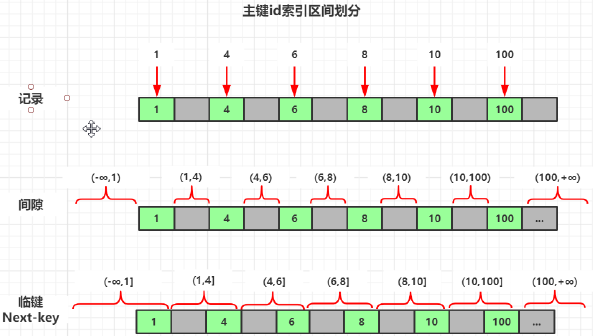
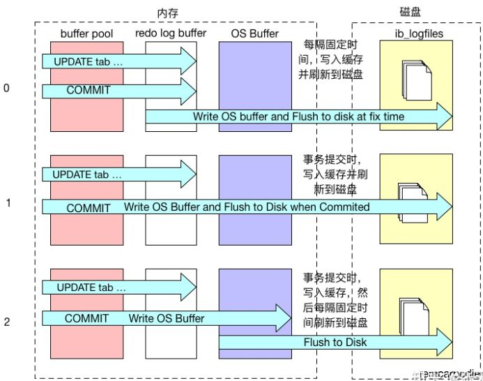

# DBA101 - MySQL - 数据库并发

返回[DBA201 - Redis](./DBA201.md)

[TOC]

## MySQL的锁机制

锁是计算机协调多个进程或线程并发访问某一资源的机制。

MySQL的锁机制相对其他数据库比较简单，其最显著的特点是不同的存储引擎支持不同的锁机制。

### 乐观锁

假设不会发生并发冲突，只在提交操作时检查是否违反数据完整性。在修改数据的时候把事务锁起来，通过Version的方式来进行锁定。

#### 实现方式

一般会使用版本号机制或CAS算法实现。

### 悲观锁

假定会发生并发冲突，屏蔽一切可能违反数据完整性的操作。在查询完数据的时候就把事务锁起来，直到提交事务。

#### 实现方式

使用数据库中的锁机制

### 表级锁 (table-level locking) 

InnoDB, MyISAM, MEMORY支持表级锁。

开销小，加锁快；不会出现死锁；锁定粒度大，发生锁冲突的概率最高，并发度最低。

可以通过检查table_locks_waited和table_locks_immediate状态变量来分析系统上的表锁定争夺。

```mysql
mysql> show status like 'table%';
+-----------------------+-------+
| Variable_name         | Value |
+-----------------------+-------+
| Table_locks_immediate | 352   |
| Table_locks_waited    | 2     |
+-----------------------+-------+
--如果Table_locks_waited的值比较高，则说明存在着较严重的表级锁争用情况。
```

#### 共享锁/读锁

在执行查询语句之前自动加锁。阻塞同一表的写请求，不阻塞同一表的读请求。

#### 独占锁/写锁

在执行更新语句之前自动加锁。阻塞同一表的写请求和读请求。

### 页级锁 (page-level locking)

开销和加锁时间界于表锁和行锁之间；会出现死锁；锁定粒度界于表锁和行锁之间，并发度一般。

### 行级锁 (row-level locking) 

InnoDB支持行级锁，默认使用行级锁。

开销大，加锁慢；会出现死锁；锁定粒度最小，发生锁冲突的概率最低，并发度也最高。

#### 共享锁/读锁/S锁

允许一个事务去读一行，阻止其他事务获得相同数据集的排他锁。

若事务T对数据对象A加上S锁，则事务T可以读A但不能修改A. 其他事务只能再对A加S锁，而不能加X锁，直到T释放A上的S锁。这保证了其他事务可以读A，但在T释放A上的S锁之前不能对A做任何修改。

SELECT语句默认不加锁。需要加共享锁可以使用语句SELECT * FROM XXX LOCK IN SHARE MODE

#### 排他锁/写锁/X锁

允许获取排他锁的事务更新数据，阻止其他事务取得相同的数据集共享读锁和排他写锁。

若事务T对数据对象A加上X锁，事务T可以读A也可以修改A. 其他事务不能再对A加任何锁，直到T释放A上的锁。加了排他锁的语句虽然不能修改，也不能使用加锁的方式查询，但是可以不加锁查询，因为普通查询没有任何锁机制。

UPDATE, DELETE, INSERT语句默认都会自动加上排他锁。需要加排他锁可以使用语句SELECT * FROM XXX FOR UPDATE

#### 加锁方式

在MySQL中，行级锁并不是直接锁记录，而是锁索引。

- 如果一条SQL语句操作了主键索引，MySQL就锁定这条主键索引；

- 如果操作了非主键索引，MySQL就先锁定非主键索引再锁定相关的主键索引；

- 如果该表上没有任何索引，MySQL会在后台创建一个隐藏的聚集主键索引，在每一条聚集索引后面加锁，类似于表锁但原理上完全不同。

这一点MySQL与Oracle不同，后者是通过在数据块中对相应数据行加锁来实现的。



##### 记录锁 Record lock

单条索引记录上加锁，例如：

SELECT * FROM `test` WHERE `id`=1 FOR UPDATE;

它会在 id=1 的记录上加上记录锁，以阻止其他事务插入，更新，删除 id=1 这一行。

##### 间隙锁 Gap lock

锁定一个范围，不包括记录本身。

设计的目的是为了阻止多个事务将记录插入到同一范围内导致幻读。

有两种方式显式关闭gap锁：（除了外键约束和唯一性检查外，其余情况仅使用record lock）

- 将事务隔离级别设置为RC

- 将参数innodb_locks_unsafe_for_binlog设置为1

##### 临键锁 Next-key lock

锁定一个范围，包含记录本身。

InnoDB对于行的查询使用next-key lock. 当查询的索引含有唯一属性时，将next-key lock降级为记录锁。

##### 插入意向锁 Insert Intention Lock

在insert操作时产生。在多事务同时写入不同数据至相同索引间隙内的**不同位置**的时候，不需要等待其他事务就可以完成，不会发生锁等待。

#### 执行流程

##### 查询（排他锁）

查询（select）数据：

```sql
select xxx from xxx where xxx for update
```

- where中没有使用索引
  - 锁表
  - 当前读

- where中使用索引且记录存在
  - 锁记录（X锁）
  - 同时锁该记录所在数据页的数据，即锁区间（S锁）（一个页空间可能包含了多条数据，16K）
  - 当前读

- where中使用索引且记录不存在
  - 无锁

##### 查询（共享锁）

查询（select）数据：

```sql
select xxx from xxx where xxx lock in share mode
```

- where中没有使用索引
  - 锁表
  - 当前读

- where中使用索引且记录存在
  - 锁记录（S锁）
  - 同时锁该记录所在数据页的数据，即锁区间（S锁）（一个页空间可能包含了多条数据，16K）
  - 当前读

- where中使用索引且记录不存在
  - 无锁

##### 查询

查询（select）数据：

```sql
select xxx from xxx where xxx 
```

- 无锁，快照读

##### 更新&删除

更改（update和delete）数据：

- 没有使用索引
  - 锁表

- 使用索引满足条件的记录存在
  - 锁记录

- 使用索引满足条件的记录不存在
  - 在该记录前后存在的记录之间加区间锁（左闭右开），防止幻读的放生

##### 增加

添加（insert）数据：

- 存在表锁，或者存在区间锁（范围锁）且索引列要插入的值在区间内
  - 阻塞

- 其他情况
  - 阻塞

### 死锁

#### InnoDB

而在InnoDB中，锁是逐步获得的，就造成了死锁的可能。在UPDATE、DELETE操作时，MySQL不仅锁定WHERE条件扫描过的所有索引记录，而且会锁定相邻的键值，即所谓的**next-key locking**.

造成死锁的场景：

- 会话1主键重复持有S锁

- 会话2申请X锁被S锁阻碍

- 会话1申请X锁被自身S锁阻碍，发生死锁

分析死锁的常用命令为

```mysql
SHOW ENGINE INNODB STATUS
```

发生死锁后，InnoDB一般都可以检测到，并使一个事务释放锁回退，另一个获取锁完成事务。

#### MyISAM

MyISAM中是不会产生死锁的，因为MyISAM总是一次性获得所需的全部锁，要么全部满足，要么全部等待。

#### 减少死锁

- 如果不同程序会并发存取多个表，尽量约定以相同的顺序访问表。
- 在同一个事务中，尽可能做到一次锁定所需要的所有资源。
- 对于非常容易产生死锁的业务部分，可以尝试升级锁定颗粒度，例如使用表级锁。

### Latch

Latch是更底层的保护锁资源申请、释放、维护的设施，通常是线程的mutex, rwlock等。

锁是逻辑的，用以表达申请一个资源的占有或释放，通常是一个需要latch保护的数据结构。

### 元数据锁

元数据锁是位于Server层的表级锁，每次操作表都会申请MDL锁，申请操作会同意添加到一个队列，队列中写锁优先于读锁，一旦获取锁阻塞会影响后续操作。

## 数据库事务

数据库事务是指：几个SQL语句，要么全部执行成功，要么全部执行失败。比如银行转账就是事务的典型场景。

数据库事务的三个常用命令：Begin Transaction, Commit Transaction, Rollback Transaction.

**InnoDB**支持数据库事务。

### ACID基本要素

#### 原子性(Atomic)

事务是一个完整的操作、不可分割的工作逻辑单元，其中的各项操作不可分割，一起提交，要么全执行成功，要么全不执行，任何一项操作的失败都会导致整个事务的失败。

事务的原子性是通过undo log来实现的，用于在崩溃时恢复数据。

#### 一致性(Consistent)

事务中各项操作在事务结束后系统状态是一致的，要么全成功，要么全失败，如果事务失败要对已进行的部分操作进行回滚。

事务的一致性是通过原子性，持久性，隔离性来实现的。

#### 隔离性(Isolated)

并发执行的事务彼此无法看到对方的中间状态，不会互相干扰。

事务的隔离性是通过 (读写锁+MVCC)来实现。

#### 持久性(Durable)

事务开始后，就不会终止，而且事务完成后所做的改动都会被持久化，即使发生灾难性的失败。通过日志和同步备份可以在故障发生后重建数据。

事务的持久性是通过redo log来实现的，遵守以下规则：

##### WAL(Write-Ahead Logging)

WAL是所有存储类系统的基础，要求先将内存中的日志写入到磁盘，再把数据的变更写入到磁盘。

##### Force-log-at-commit

Force-log-at-commit要求当一个事务提交时，所有产生的日志都必须已经刷新到磁盘上。这样，如果日志刷新成功后，缓冲池中的数据刷新到磁盘前数据库发生了宕机，那么重启时，数据库可以从日志中恢复数据。

### 事务隔离级别

事务隔离级别越高，数据库性能越差。

| 隔离级别                           | 改进                                                     | 更新遗失 | 脏读 | 不可重复读 | 幻读 |
| ---------------------------------- | -------------------------------------------------------- | -------- | ---- | ---------- | ---- |
| 没有并发控制                       |                                                          | √        | √    | √          | √    |
| 可读取未确认Read Uncommitted       | **写**事务阻止其他**写**事务                             |          | √    | √          | √    |
| 可读取确认Read Committed           | **写**事务阻止其他**读写**事务                           |          |      | √          | √    |
| 可重复读Repeatable Read(MySQL默认) | **读**事务阻止其他**写**事务                             |          |      |            | √    |
| 串行化Serializable                 | **读**加共享锁，**写**加排他锁，读读并发，读写、写写互斥 |          |      |            |      |

#### 更新丢失

##### 回滚丢失

在事务A期间，事务B对数据进行了更新；在事务A撤销之后，覆盖了事务B已经提交的数据。

| 时间 | 事务A                        | 事务B                       |
| ---- | ---------------------------- | --------------------------- |
| T1   | 开始事务                     |                             |
| T2   |                              | 开始事务                    |
| T3   | 查询账户余额为1000元         |                             |
| T4   |                              | 查询账户余额为1000元        |
| T5   |                              | 汇入100元，余额更改为1100元 |
| T6   |                              | 提交事务                    |
| T7   | 取出100元把余额改为900元     |                             |
| T8   | 撤销事务                     |                             |
| T9   | 余额恢复为1000元（丢失更新） |                             |

##### 覆盖丢失/两次更新问题

在事务A期间，事务B对数据进行了更新；在事务A提交之后，覆盖了事务B已经提交的数据。

| 时间 | 事务A                        | 事务B                      |
| ---- | ---------------------------- | -------------------------- |
| T1   | 开始事务                     |                            |
| T2   |                              | 开始事务                   |
| T3   | 查询账户余额为1000元         |                            |
| T4   |                              | 查询账户余额为1000元       |
| T5   |                              | 取出100元，余额更改为900元 |
| T6   |                              | 提交事务                   |
| T7   | 汇入100元                    |                            |
| T8   | 提交事务                     |                            |
| T9   | 余额更改为1100元（丢失更新） |                            |

#### 脏读

读取一个事务未提交的更新。

| 时间 | 事务A                      | 事务B                    |
| ---- | -------------------------- | ------------------------ |
| T1   | 开始事务                   |                          |
| T2   |                            | 开始事务                 |
| T3   | 查询账户余额为1000元       |                          |
| T4   | 取出100元，余额更改为900元 |                          |
| T5   |                            | 查询账户余额为900元      |
| T6   |                            | 汇入100元                |
| T7   | 撤销事务                   |                          |
| T8   |                            | 提交事务                 |
| T9   |                            | 余额更改为1000元（脏读） |

#### 不可重复读

同一个事务中两次读取相同的记录，结果不一样。

| 时间 | 事务A                              | 事务B                       |
| ---- | ---------------------------------- | --------------------------- |
| T1   | 开始事务                           |                             |
| T2   |                                    | 开始事务                    |
| T3   | 查询账户余额为1000元               |                             |
| T4   |                                    | 查询账户余额为1000元        |
| T5   |                                    | 汇入100元，余额更改为1100元 |
| T6   | 查询账户余额为1100元（不可重复读） |                             |

#### 幻读

两次读取的结果包含的行记录不一样。

| 时间 | 事务A                                       | 事务B        |
| ---- | ------------------------------------------- | ------------ |
| T1   | 开始事务                                    |              |
| T2   |                                             | 开始事务     |
| T3   | 读取用户列表，只有张三1个用户               |              |
| T4   |                                             | 新增用户李四 |
| T5   | 读取用户列表，共有张三、李四2个用户（幻读） |              |

### 刷盘机制

InnoDB的*innodb*_*flush*_*log_at*_*trx_commit*属性可以控制每次事务提交时InnoDB的行为。

- 当属性值为0时，事务提交时，不会对重做日志进行写入操作，而是等待主线程按时写入。写入效率最高，但是数据安全最低。

- 当属性值为1时，事务提交时，会将重做日志写入文件系统缓存，并且调用文件系统的fsync，将文件系统缓冲中的数据真正写入磁盘存储，确保不会出现数据丢失。写入效率最低，但是数据安全最高。只有这种情况才能保证事务的**一致性**。
- 当属性值为2时，事务提交时，也会将日志文件写入文件系统缓存，但是不会调用fsync，而是让文件系统自己去判断何时将缓存写入磁盘。写入效率和数据安全居中。



## MVCC

一致性读取/多版本并发控制（MVCC）全称Multi-Version Concurrency Control，是一种用来解决读-写冲突的无锁并发控制，也就是为事务分配单向增长的时间戳，为每个修改保存一个版本，版本与事务时间戳关联。这就使得可以一边有线程修改这条记录同时在版本链中记录快照，一边使用SELECT在版本链中拿记录。

### 用途

- 在并发读写数据库时，可以做到在读操作时不用阻塞写操作，写操作也不用阻塞读操作，提高了数据库并发读写的性能。

- 同时还可以解决脏读，幻读，不可重复读等事务隔离问题，但不能解决更新丢失问题。

- 可以和锁形成两个组合，最大程度的提高数据库并发性能，并解决读写冲突和写写冲突导致的问题：
  - **MVCC +** **悲观锁** MVCC解决读写冲突，悲观锁解决写写冲突。
  - **MVCC +** **乐观锁** MVCC解决读写冲突，乐观锁解决写写冲突。

### 隔离级别

MVCC只能在READ COMMITTED和REPEATABLE READ两个隔离级别下工作，因为READ UNCOMMITTED总是读取最新的数据行，而不是符合当前事务版本的数据行，而SERIALIZABLE则会对所有读取的行都加锁。

### 实现原理

主要是依赖记录中的3个隐式字段，undo日志，Read View来实现的。

#### 隐式字段

InnoDB的MVCC通过在每行记录后面保存两个隐藏的列来实现，这两个列一个保存了行的创建时间对应的系统版本号，一个保存行的过期时间对应的系统版本号。

| Row1 | Row2 | DB_ROW_ID  隐式主键                                          | DB_TRX_ID  事务ID                               | DB_ROLL_PTR  回滚指针                                        |
| ---- | ---- | ------------------------------------------------------------ | ----------------------------------------------- | ------------------------------------------------------------ |
|      |      | 如果数据表没有主键，InnoDB会自动以DB_ROW_ID产生一个聚簇索引。 | 记录创建这条记录或者最近一次修改该记录的事务ID. | 配合undo log, 指向这条记录的上一个版本（存储于rollback segment里）。 |

实际还有一个删除flag隐藏字段, 既记录被更新或删除并不代表真的删除，而是删除flag变了。

#### undo log

undo log主要分为两种：

##### insert undo log

代表事务在insert新记录时产生的undo log, 只在事务回滚时需要，并且在事务提交后可以被立即丢弃。

##### update undo log

事务在进行update或delete时产生的undo log; 不仅在事务回滚时需要，在快照读时也需要；所以不能随便删除，只有在快速读或事务回滚不涉及该日志时，对应的日志才会被purge线程统一清除。

对MVCC有帮助的实质是update undo log. 不同事务或者相同事务的对同一记录的修改，会导致该记录的undo log成为一条记录版本线性表，即链表，存在rollback segment中的旧记录链，undo log的链首就是最新的旧记录，链尾就是最早的旧记录。

#### ReadView判断数据行可见性

ReadView中主要就是有个列表来存储我们系统中当前活跃着的读写事务，也就是begin了还未提交的事务。通过这个列表来由近到远判断记录的某个版本是否对当前事务可见。

- 如果访问的记录事务id<ReadView列表中的最小值，说明早已提交，可以访问。

- 如果访问的记录事务id介于ReadView列表中的最小值和最大值之间，且不存在，说明早已提交，可以访问。

- 如果访问的记录事务id介于ReadView列表中的最小值和最大值之间，且存在，说明尚未提交，不可以访问。

- 如果访问的记录事务id>ReadView列表中的最大值，说明尚未提交，不可以访问。

**已提交读**隔离级别下的事务在每次查询的开始都会生成一个独立的ReadView.

**可重复读**隔离级别则在第一次读的时候生成一个ReadView，之后的读都复用之前的ReadView.

