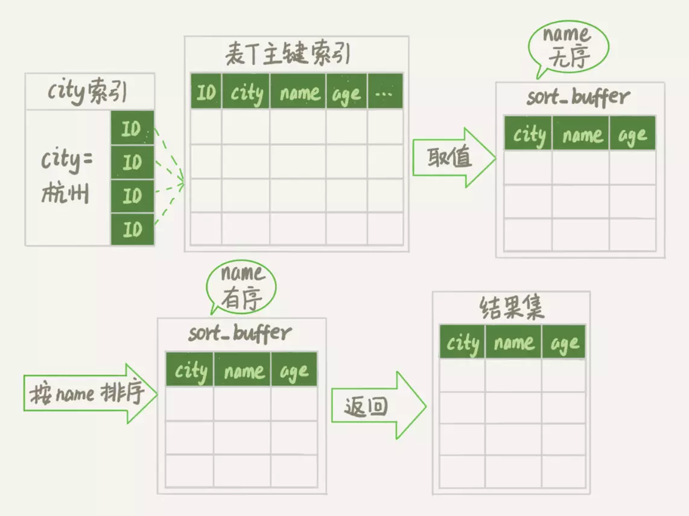
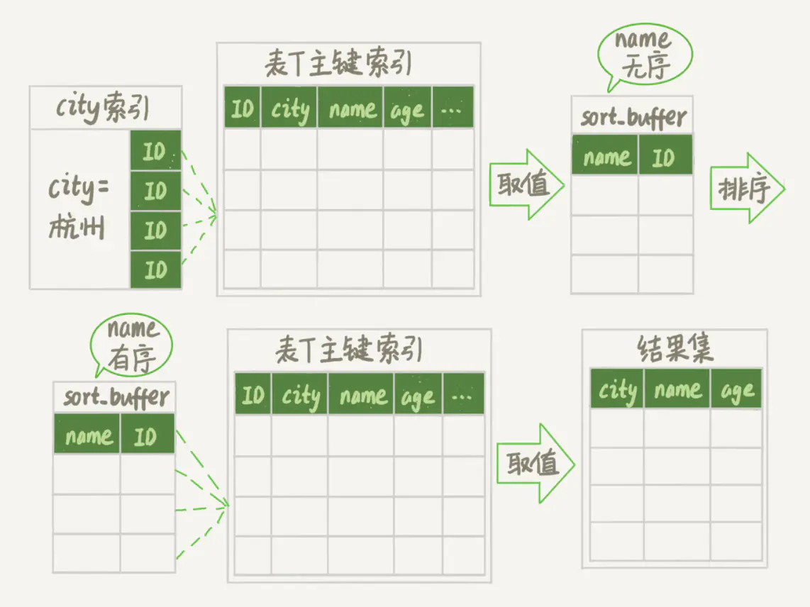
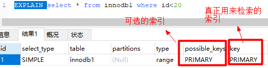

# DBA1013 - EXPLAIN 与 SQL 优化

返回[Bulletin](./bulletin.md)

返回[DBA101 - MySQL](./DBA101.md)

[TOC]

## 本章主线

```text
SQL 慢了怎么办
  → EXPLAIN（type/key/rows/Extra）
  → Slow SQL SOP（定位 → 归因 → 优化 → 验证）
  → ORDER BY / 深分页
  → 索引优化实践（避免回表 / ICP / 前缀索引 / 列顺序）
```

> 索引的结构原理（B+Tree / 聚簇 / 二级 / 回表 / 覆盖 / 联合索引 / 最左前缀）已上移到 [DBA1011 - MySQL & InnoDB 核心原理](./DBA1011.md)，本章专注"诊断与优化"。

------------------------------------------------------------------------

# 1. EXPLAIN【P0】

使用**EXPLAIN**关键字可以模拟优化器执行SQL查询语句，从而知道MySQL是如何处理SQL语句的。这可以帮助分析查询语句或是表结构的性能瓶颈。通过EXPLAIN命令可以得到：

- 表的读取顺序

- 数据读取操作的操作类型

- 哪些索引可以使用

- 哪些索引被实际使用

- 表之间的引用

- 每张表有多少行被优化器查询

## 先记五个字段【P0】

```text
possible_keys → 候选索引
key           → 实际索引
type          → 访问方式
rows          → 预计检查行数
Extra         → 额外执行信息
```

SQL 慢不能靠猜，需要知道 MySQL 准备怎么访问数据——EXPLAIN 就是 SQL 的"执行路线图"。

放回系统：

```text
慢SQL → EXPLAIN → 执行计划 → 优化 → 再验证
```

## type 怎么看【P0】

```text
const → ref → range → index → ALL
```

- **const**：非常精确的唯一值访问（主键/唯一索引等值）；

- **ref**：常见索引等值匹配（非唯一）；

- **range**：索引范围扫描；

- **index**：扫描整个索引；

- **ALL**：全表扫描。

> type 帮助判断访问方式，但实际优化必须结合 rows、key、Extra 和数据量，不能只看 type。

## key / rows / Extra【P0】

- `key`：实际选择的索引（possible_keys 多而 key 为 NULL 时要注意）；

- `rows`：预计检查的数据量——最直接的规模信号；

- `Using index`：常见于覆盖索引，不回表；

- `Using filesort`：需要额外排序过程；

- `Using temporary`：使用临时表处理某些操作（如 group by/distinct 的中间结果）。

> **【校正】** 看到 filesort 或 temporary 不应该机械判定"很差"——小数据量下的 filesort 完全无害；数据量大时才是优化对象。判断标准回到 rows 和真实耗时。

### 面试回答

> EXPLAIN 用于查看 SQL 执行计划。我重点看 type、实际索引 key、预计扫描行数 rows，以及 Extra 中的额外排序、临时表等信息，用它验证优化器实际怎么执行，而不是凭 SQL 外观猜。看到 filesort 或 temporary 我会先看数据规模再决定要不要处理。

------------------------------------------------------------------------

# 2. 慢 SQL 排查 SOP【P0】

不要第一反应"加索引"。

```text
定位慢SQL和参数（监控/慢查询日志）
 → EXPLAIN
 → type/key/rows/Extra
 → 表结构/索引
 → 扫描/回表/排序/锁等待
 → 优化
 → 验证
```

## 展开为可口述的步骤

1. **先确认瓶颈在 DB**：API 慢不一定是 SQL——先看链路（网关/服务/连接池/DB），确认 DB 是瓶颈后再进入 SQL 分析；连接池打满也会表现为"SQL 慢"；

2. **定位具体 SQL 和参数**：慢查询日志 / APM / `show processlist`；拿到真实参数，因为执行计划跟绑定值强相关；

3. **EXPLAIN 看执行计划**：type、key、rows、Extra，判断是全表扫、回表过多、filesort 还是 temporary；

4. **结合表结构与数据量**：有没有匹配查询模式的联合索引、区分度如何、返回量多少；

5. **排除非执行计划因素**：锁等待（`SHOW ENGINE INNODB STATUS`）、缓冲池命中率、其他会话的长事务；

6. **优化后验证**：用相同数据规模验证执行计划（EXPLAIN）和真实耗时（profile / 监控），不是"改完就走"。

## 例子

GoPay 某 KYC 查询慢：先看是否存在匹配查询条件的联合索引、返回量、回表量，也要排除锁等待和连接池问题。

### 面试回答

> 我会先通过监控或慢查询日志定位具体 SQL 和参数，先确认瓶颈确实在数据库而不是连接池或上游；再用 EXPLAIN 看访问方式、索引、扫描行数和 Extra，结合数据量、表结构判断是扫描、回表、排序还是锁等待的问题；优化后用相同数据规模验证执行计划和真实耗时。第一反应不是加索引。

------------------------------------------------------------------------

# 3. ORDER BY 原理【P1】

## 使用场景

当我们使用order by将查询结果按照某个字段排序时，如果该字段没有建立索引，那么执行计划会将查询出的所有数据使用**外部排序**（将数据从硬盘分批读取到内存使用内部排序，最后合并排序结果），这个操作是很影响性能的，因为需要将查询涉及到的所有数据从磁盘中读到内存，更无论读到内存之后的排序了。

如果对该字段建立索引 `alter table 表名 add index(字段名)`，那么由于索引本身是有序的，直接按照索引的顺序和映射关系逐条取出数据即可。如果分页，只用取出索引表某个范围内的索引对应的数据，而不用取出所有数据进行排序再返回某个范围内的数据。（从磁盘取数据是最影响性能的）

## 全字段排序



## RowId排序



如果MySQL实在是担心排序内存太小，会影响排序效率，才会采用**rowid排序**算法，这样排序过程中一次可以排序更多行，但是需要再回到原表去取数据。

如果MySQL认为内存足够大，会优先选择**全字段排序**，把需要的字段都放到sort_buffer中，这样排序后就会直接从内存里面返回查询结果了，不用再回到原表去取数据。

这也就体现了MySQL的一个设计思想：如果内存够，就要多利用**内存**，尽量减少**磁盘**访问。对于InnoDB表来说，rowid排序会要求回表多造成磁盘读，因此不会被优先选择。

可以通过设置**联合索引**，不通过排序就能得到正确的结果。这样对系统的消耗会小很多，语句的执行时间也会变得更短。

------------------------------------------------------------------------

# 4. 分页与深分页【P1】

## 假分页 vs 真分页

**假分页**：第一次就取出全部数据，点击下一页的时候只是展示的不一样而已，而不是再次和后台交互。

**真分页**：即后台分页，每一次动态从后台获取数据，分页参数也作为一个查询参数，一起传回到后台。

MySQL使用关键字limit来进行分页：`limit offset, size` 表示从多少索引去查多少位。

```mysql
-- 例如：查找按条件排序的第6至10行。
select * from 表 order by 查询字段 desc limit 5, 5;
```

Oracle的分页要采取三层嵌套查询的思路。

## 深分页问题

`LIMIT 1000000, 20` 的代价：MySQL 需要取出并丢弃前 100 万行（若走二级索引还要回表 100 万次），offset 越大越慢。

常见优化：

```text
1. 游标/Keyset 分页：WHERE id > 上次最大id ORDER BY id LIMIT 20
   （利用索引定位，不扫描丢弃行；要求有稳定排序键）
2. 延迟关联：先覆盖索引查出主键，再回表取整行
   SELECT t.* FROM t JOIN (SELECT id FROM t WHERE ... ORDER BY x LIMIT 1000000, 20) tmp ON t.id = tmp.id
3. 产品层限制：禁止跳转到任意深页，只允许下一页
```

> **面试提示**：深分页是"覆盖索引 + 回表代价"的最好应用题——先在索引上完成定位和分页，最后只对 20 行回表。

------------------------------------------------------------------------

# 5. 索引优化实践【P1】

## 避免回表查询

**回表查询**指的是使用普通索引查询时先扫描一遍普通索引找到主键值，再扫描一遍主键找到行记录。

- 使用主键查询，而不是其他索引，可以避免触发回表查询。

- 覆盖索引：查询字段都在索引中，直接在索引中返回，不访问原始数据（详见 [DBA1011 覆盖索引](./DBA1011.md)）。

## 索引下推 ICP（Index Condition Pushdown）

将"使用索引查找数据→筛选符合条件的数据"的过程，精简为"使用索引查找符合条件的索引→查找数据"，减少需要回表查询的全行数据。

### 启动方式

mysql默认启用索引下推，可以通过修改系统变量optimizer_switch的index_condition_pushdown标志来控制：

```sql
SET optimizer_switch = 'index_condition_pushdown=off';
```

### 使用条件

- 索引下推只能用于InnoDB的二级索引，因为主键索引树叶子结点上保存的是全行数据，索引下推并不能减少查询全行数据的效果。

- 索引下推不要求select列有联合索引的字段，但要求有多个查询条件，且查询条件子句（where/order by）字段全是联合索引。

## 使用前缀索引

语法：`index(field(?))`，使用字段值的前?个字符建立索引，默认是使用字段的全部内容建立索引。前缀长度的选取需要根据索引选择性来确定。

对于 BLOB、TEXT 和 VARCHAR 类型的列，必须使用前缀索引。

## 更新频繁的字段上不宜建立索引

索引更新会变更B+树，频繁更新会大大降低数据库性能。

## 索引列的顺序

让选择性最强的索引列放在前面。索引的选择性是指：不重复的索引值和记录总数的比值。最大值为 1，此时每个记录都有唯一的索引与其对应。选择性越高，每个记录的区分度越高，查询效率也越高。

例如性别这类区分不大的属性，建立索引是没有意义的，不能有效的过滤数据，一般区分度在80%以上的时候就可以建立索引，区分度可以使用 `count(distinct(列名))/count(*)` 来计算。

## 使用场景

### WHERE

对比没有索引的字段执行WHERE语句，效率有明显提升。

如果一个字段被定义了多个索引，在执行WHERE语句时，只调用主键索引。



### JOIN

对Join语句匹配关系（on）涉及的字段建立索引能够提高效率。

------------------------------------------------------------------------

## 本章验收

- [ ] EXPLAIN 五个字段？type 顺序？filesort/temporary 怎么判断严不严重？
- [ ] 慢 SQL 排查 SOP 完整说一遍？
- [ ] 全字段排序 vs rowid 排序？
- [ ] 深分页为什么慢？三种优化？
- [ ] 索引下推是什么？作用在哪类索引？
