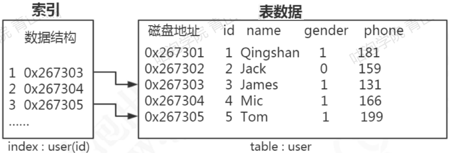
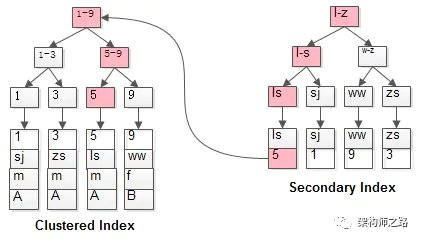

# DBA101 - MySQL - 索引

返回[DBA201 - Redis](./DBA201.md)

[TOC]

## 定义

索引（Index）是对数据库表中一列或多列的值进行**排序**的一种**数据结构**，它们包含着对数据表里所有记录的引用指针，是帮助数据库高效获取数据的。更通俗的说，索引就相当于目录。



## 使用原因

**磁盘**的维度有两个指标：

寻址：ms级，比内存慢10W倍

带宽（单位时间通过的数据量）：M/G级

**内存**的维度有两个指标：

寻址：ns级

带宽（单位时间通过的数据量）：更大

**I/O buffer**的成本问题：

一个扇区有512Byte, 扇区越小，索引的成本越大。所以真正使用硬盘的时候并不是以512Byte作为一次的读写量，操作系统无论读多少，磁盘一般默认最少4K. 数据库有很多data page, 大小就是4k. 

关系型数据库建表必须给出schema, 声明每一列的类型以及字节宽度，然后倾向以行为单位进行存储。

正如随着文件变大Linux读取文件的速度会变慢，随着数据量变大数据库操作数据的速度也会变慢，这都是因为硬盘I/O成为了瓶颈。

只有建索引能够通过减少磁盘IO让速度加快，前者存的是4k的数据行，而后者存的是特定的某一列数据，每一个数据项指向不同的行。

## 原理

索引的原理很简单，就是把无序的数据变成有序的查询：把创建了索引的列的内容进行排序，对排序结果生成倒排表然后拼上数据地址链，从而拿到具体数据。

索引是在存储引擎层实现的，而不是在服务器层实现的，所以不同存储引擎具有不同的索引类型和实现。

## 优点

- 可以大大减少服务器需要扫描的数据量。

- 帮助服务器避免排序和临时表。

- 将随机IO变成顺序IO.

## 缺点

- 时间方面：创建索引和维护索引要耗费时间，具体地，当对表中的数据进行增加、删除和修改的时候，索引也要动态的维护，会降低增/改/删的执行效率；

- 空间方面：索引需要占物理空间。

## 局限性

当表变大时，如果此时索引能够全部被硬盘存下，进行少量查询操作依然会很快，但是在高并发的时候可能会受硬盘带宽影响从而变慢。

## 使用方式

如果表的记录少（两个页面之内），且不强制使用索引，则一律全表扫描。

如果没有索引，则全表扫描。

先选择主键，再选择尺寸最小的索引。

## 使用场景

### WHERE

对比没有索引的字段执行WHERE语句，效率有明显提升。

如果一个字段被定义了多个索引，在执行WHERE语句时，只调用主键索引。


### ORDER BY

当我们使用order by将查询结果按照某个字段排序时，如果该字段没有建立索引，那么执行计划会将查询出的所有数据使用**外部排序**（将数据从硬盘分批读取到内存使用内部排序，最后合并排序结果），这个操作是很影响性能的，因为需要将查询涉及到的所有数据从磁盘中读到内存（如果单条数据过大或者数据量过多都会降低效率），更无论读到内存之后的排序了。

但是如果我们对该字段建立索引alter table 表名 add index(字段名)，那么由于索引本身是有序的，因此直接按照索引的顺序和映射关系逐条取出数据即可。而且如果分页的，那么只用取出索引表某个范围内的索引对应的数据，而不用像上述那取出所有数据进行排序再返回某个范围内的数据。（从磁盘取数据是最影响性能的）

### JOIN

对Join语句匹配关系（on）涉及的字段建立索引能够提高效率。

## 分类

### 主键 Primary key

是表中的一个或多个字段，它的值用于唯一地标识表中的某一条记录。主键是一种特殊的**唯一索引**，且要求**非空**，MySQL会自动为所有表的主键进行索引。

建表的时候可以直接在列名后面增加主键约束：

```sql
ID char(5) primary key
```

对已经建表的列增加主键约束：

```sql
alter table 表名 add constraint 约束名 primary key (ID)
```

#### InnoDB的主键

如果设置了主键，那么InnoDB会选择主键作为聚集索引。

如果没有显式定义主键，则InnoDB会选择第一个不包含有NULL值的唯一索引作为主键索引。

如果也没有这样的唯一索引，则InnoDB会选择内置6字节长的ROWID作为隐含的聚集索引(ROWID随着行记录的写入而主键递增)。

##### 自增主键

如果表使用自增主键，那么每次插入新的记录，记录就会顺序添加到当前索引节点的后续位置，主键的顺序按照数据记录的插入顺序排列，自动有序。当一页写满，就会自动开辟一个新的页。

##### 非自增主键

如果使用非自增主键，例如身份证号或学号等，由于每次插入主键的值近似于随机，因此每次新纪录都要被插到现有索引页得中间某个位置，此时MySQL不得不为了将新记录插到合适位置而移动数据，甚至目标页面可能已经被回写到磁盘上而从缓存中清掉，此时又要从磁盘上读回来，这增加了很多开销，同时频繁的移动、分页操作造成了大量的碎片，得到了不够紧凑的索引结构，后续不得不通过OPTIMIZE TABLE来重建表并优化填充页面。

### 普通索引 Normal Index

也叫非唯一索引，是最普通的索引，没有任何的限制。

### 唯一索引 Unique Index

唯一索引表明此索引的每一个索引值只对应唯一的数据记录，对于单列惟一性索引，这保证单列不包含重复的值。对于多列惟一性索引，保证多个值的组合不重复。

一张表可以有多个唯一索引。

### 全文索引 Fulltext Index

主要用来查找文本中的关键字，而不是直接与索引中的值相比较。Full-text索引更像是一个搜索引擎，跟其它索引大不相同、互不冲突。Full-text索引配合**MATCH AGAINST**操作使用，而不是一般的WHERE语句加LIKE对较大数据的低效操作。支持文本类型的字段，比如char, varchar, text.

MyISAM 存储引擎支持全文索引，InnoDB 存储引擎在 MySQL 5.6.4 版本中也开始支持全文索引。

### 联合/组合索引 Union Index

MySQL中的索引可以以一定顺序引用多列，这种索引叫作联合索引。

## 外键

外键用于与另一张表的关联。是能确定另一张表记录的字段，用于保持数据的一致性。

外键可以是一对一的，一个表的记录只能与另一个表的一条记录连接，或者是一对多的，一个表的记录与另一个表的多条记录连接。

### 使用条件

两个表必须是InnoDB表，MyISAM表暂时不支持外键。

外键字段必须由用户进行明确的索引。

外键关系的两个表的列必须是数据类型相似，也就是可以相互转换类型的列，比如int和tinyint可以，而int和char则不可以。

### 优点

可以使得两张表关联，保证数据的一致性和实现一些级联操作。保持数据一致性，完整性，主要目的是控制存储在外键表中的数据，使两张表形成关联，保证数据的一致性和实现一些级联操作。

## 数据库文件

MySQL的每个数据库都对应存放在一个与数据库同名的文件夹中，该文件夹由MySQL配置文件 /etc/my.cnf 定义，其中datadir=/var/lib/mysql指定存放位置。

查看MySQL数据文件命令：

```sql
SHOW VARIABLES 1 LIKE ‘%datadir%’;
```

MySQL数据库文件包括 MySQL 所建数据库文件和 MySQL 所用存储引擎创建的数据库文件

### 表结构文件

不论表使用的哪一种存储引擎，MySQL都会为表生成一个.frm为后缀名的表结构文件。

### 数据文件

存储引擎负责对表中数据的读取和写入，每个存储引擎会以自己的方式来保存表中的数据，在不同存储引擎中数据存放的方式一般是不同的。

#### InnoDB数据文件

采用表空间 (tablespace) 来管理数据，存储表数据和索引，InnoDB 数据库文件 (即 InnoDB文件集，ib-file set)。

##### .ibd文件

使用独享表空间存储表数据和索引信息，一张表对应一个ibd文件。

##### .ibdata文件

使用共享表空间存储表数据和索引信息，所有表共同使用一个或者多个ibdata文件。

#### MyIsam数据文件

##### .myd文件

主要用来存储表数据信息。

##### .myi文件

主要用来存储表数据文件中任何索引的数据树。

## B树索引

最常见的索引类型，基于B+树数据结构。

### B树

一颗m阶的B树（B-tree） 定义如下：

1. 每个节点**最多有m-1个**key；
2. 根节点至少有1个key；
3. 非根节点**至少有Math.ceil(m/2)-1个**key；
4. 每个节点中的key都按照从小到大的顺序排列，每个key的左子树中的所有key都小于它，而右子树中的所有key都大于它；
5. 所有叶子节点都位于同一层，即根节点到每个叶子节点的长度都相同。

2-3树就是3阶的B树，2-3-4树就是4阶的B树。

如下图是一棵4阶B树（2-3-4树）：


#### 优点

多路查找树的数据结构，用在内存读取外存的场景下，可以减少磁盘的IO次数，因为在高阶的情况下，树不用很高就可以标识很大的数据量了。

由于B树的每一个节点都包含key和value，因此经常访问的元素可能离根节点更近，因此访问也更迅速。

### B+树

B+树在B树的基础上做了优化，它与B树的差异在于：

1. 有 k 个子节点的节点**必然有 k 个**key；
2. 非叶子节点仅具有索引作用，跟记录有关的信息均存放在叶子节点中。
3. 树的所有叶子节点构成一个有序链表，可以按照key排序的次序遍历全部记录。

即，B和B+树的区别在于，B+树的非叶子结点只包含导航信息，不包含实际的值，所有的叶子结点和相连的节点使用链表相连，便于区间查找和遍历。

多路查找树的数据结构，用在内存读取外存的场景下，可以减少磁盘的IO次数，因为在高阶的情况下，树不用很高就可以标识很大的数据量了。


#### 优点

由于B+树在内部节点上不包含数据信息，因此在内存页中能够存放更多的key。数据存放的更加紧密，具有更好的空间局部性。因此访问叶子节点上关联的数据也具有更好的缓存命中率。

B+树的叶子结点都是相连的，因此对整棵树的便利只需要一次线性遍历叶子结点即可。而且由于数据顺序排列并且相连，所以便于区间查找和搜索。而B树则需要进行每一层的递归遍历，相邻的元素可能在内存中不相邻，所以缓存命中性没有B+树好。因此InnoDB选择了B+树作为索引结构，解决了元素遍历效率低下的问题。

### InnoDB

InnoDB支持聚簇索引和非聚簇索引。一个表只能有一个聚簇索引，即主键。主索引的叶子节点data域记录着完整的数据记录。


索引和数据都在ibd文件里。


### MyISAM

MyISAM支持非聚簇索引，值都记录在辅助索引的叶子节点的data域，因此在使用辅助索引进行查找时，需要先从辅助索引查找到主键值，然后再到主索引中进行查找。


索引存放在MYI文件，表数据存放在MYD文件。


## 哈希索引


当我们在MySQL中用哈希索引时，主要就是通过Hash算法（常见的Hash算法有直接定址法、平方取中法、折叠法、除数取余法、随机数法），将数据库字段数据转换成定的Hash值，与这条数据的行指针一并存入Hash表的对应位置。

如果发生Hash碰撞（两个不同关键字的Hash值相同），则在对应Hash键下以链表形式存储。

### 缺点

哈希索引适合等值查询，但是无法进行范围查询。

哈希索引没办法利用索引完成排序。

哈希索引不支持多列联合索引的最左匹配规则。

如果有大量重复键值的情况下，哈希索引的效率会很低，因为存在哈希碰撞问题。

### 存储引擎

InnoDB 存储引擎有一个特殊的功能叫“自适应哈希索引”，当某个索引值被使用的非常频繁时，会在 B+Tree 索引之上再创建一个哈希索引，这样就让 B+Tree 索引具有哈希索引的一些优点，比如快速的哈希查找。

Memory引擎可以使用哈希索引。

## 空间数据索引

MyISAM 存储引擎支持空间数据索引（R-Tree），可以用于地理数据存储。空间数据索引会从所有维度来索引数据，可以有效地使用任意维度来进行组合查询。

必须使用 GIS 相关的函数来维护数据。

## 索引优化

### 避免索引失效

1. 组合索引未使用最左前缀，例如组合索引（A，B），where B=b不会使用索引；
2. like未使用最左前缀，where A like '%China'；
3. 搜索一个索引而在另一个索引上做order by，where A=a order by B，只使用A上的索引，因为查询只使用一个索引 ；
4. or会使索引失效。不过如果查询字段相同，也可以使用索引。例如where A=a1 or A=a2（生效），where A=a or B=b（失效）；
5. 如果列类型是字符串，要使用引号。例如where A='China'，否则索引失效，数据类型出现隐式转化，例如varchar不加引号可能会自动转化为int；
6. 索引列不能是表达式的一部分或者函数参数，否则无法使用索引。例如使用函数（upper()等）、or、！=(<>)、not in等。

### 避免回表查询

**回表查询**指的是使用普通索引查询时先扫描一遍普通索引找到主键值，在扫描一遍主键找到行记录。



#### 使用主键查询

使用主键查询，而不是其他索引，可以避免触发回表查询。 

#### 覆盖索引

索引覆盖指，如果要查询的字段都建立过索引，那么引擎会直接在索引表中查询，而不会访问原始数据。否则，只要有一个字段没有建立索引就会做全表扫描。

不要想着为每个字段建立索引，因为优先使用索引的优势就在于其体积小。

##### 优点

- 索引条目通常远小于数据行大小，如果只需要读取索引，那么mysql就会极大的较少数据访问量。

- 因为索引是按照列值顺序存储的，所以对于IO密集型的范围查询会比随机从磁盘读取每一行数据的IO要少的多。

##### 存储引擎

- 由于INNODB的聚簇索引，覆盖索引对INNODB表特别有用。

- 一些存储引擎如MYISAM在内存中只缓存索引，数据则依赖于操作系统来缓存，因此要访问数据需要一次系统调用，这可能会导致严重的性能问题。

- Memory存储引擎不支持覆盖索引。

#### 索引下推

将“使用索引查找数据->筛选符合条件的数据”的过程，精简为“使用索引查找符合条件的索引->查找数据”，减少需要回表查询的全行数据。

##### 启动方式

mysql默认启用索引下推，我们也可以通过修改系统变量optimizer_switch的index_condition_pushdown标志来控制：

```sql
SET optimizer_switch = 'index_condition_pushdown=off';
```

##### 使用条件

- 索引下推只能用于InnoDB的二级索引，因为主键索引树叶子结点上保存的是全行数据，所以这个时候索引下推并不会起到减少查询全行数据的效果。

- 索引下推不要求select列有联合索引的字段，但要求有多个查询条件，且查询条件子句（where/order by）字段全是联合索引。

### 使用前缀索引

语法：index(field(?))

使用字段值的前?个字符建立索引，默认是使用字段的全部内容建立索引。前缀长度的选取需要根据索引选择性来确定。

对于 BLOB、TEXT 和 VARCHAR 类型的列，必须使用前缀索引。

### 避免强制类型转换

强制类型转换会触发全表扫描，例如将Integer强制按照Char匹配。

### 更新频繁的字段上不宜建立索引

索引更新会变更B+树，频繁更新会大大降低数据库性能。

### 索引列的顺序

让选择性最强的索引列放在前面。索引的选择性是指：不重复的索引值和记录总数的比值。最大值为 1，此时每个记录都有唯一的索引与其对应。选择性越高，每个记录的区分度越高，查询效率也越高。

例如性别这类区分不大的属性，建立索引是没有意义的，不能有效的过滤数据，一般区分度在80%以上的时候就可以建立索引，区分度可以使用 count(distinct(列名))/count(*) 来计算。

