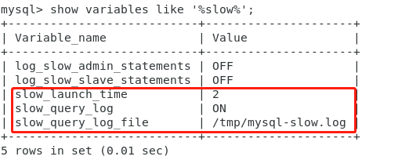

# DBA101 - MySQL - 常用命令

返回[DBA201 - Redis](./DBA201.md)

[TOC]

## 常用命令

### 显示查询命令的精确用时

```mysql
show profiles #显示之前所有查询命令的精确用时。
show profile for query {编号} #显示指定查询命令执行时各个时间段的精确用时。
```

以上命令将会被逐步淘汰。

### Performance Schema性能模块

用来监视数据库的工具，主要关注数据库运行过程中的性能相关的数据。在MySQL 5.7是默认开启的，可以通过/etc/my.cnf修改配置。

显示performance_schema数据库：

```mysql
show databases
```

进入之后一共有87张表，使用的是performance_schema存储引擎，数据不会持久化，不会被写入binlog进行同步。

### 查看连接信息

```mysql
show processlist
```

### 模拟优化器执行SQL查询语句

使用**EXPLAIN**关键字可以模拟优化器执行SQL查询语句，从而知道MySQL是如何处理SQL语句的。这可以帮助分析查询语句或是表结构的性能瓶颈。通过EXPLAIN命令可以得到：

- 表的读取顺序

- 数据读取操作的操作类型

- 哪些索引可以使用

- 哪些索引被实际使用

- 表之间的引用

- 每张表有多少行被优化器查询

### 慢查询

开启**慢查询**日志，查看慢查询的SQL。

登录数据库服务器，连接数据库：

```shell
mysql -uroot -p 密码
```

查看慢sql日志是否开启：

```mysql
show variables like '%slow%'
```



- slow_lauch_time，慢sql的执行时间配置，大于该值将被视作慢sql记录到日志中，这个值根据业务需求配置；

- slow_query_log，慢sql日志开关，ON为开启，OFF为关闭；

- slow_query_log_file，慢sql日志文件路径，可通过日志查看慢sql语句及执行时间；

查看慢sql语句，并查看sql语句的执行计划，看是否缺少索引，是否可以进行优化。

### 获取当前MySQL数据库版本

```mysql
select version()
```

### Linux下将csv导入MySQL

#### 文件不含中文

```mysql
load data infile 'F:/MySqlData/test1.csv' --CSV⽂件存放路径
into table student --要将数据导⼊的表名
fields terminated by ',' optionally enclosed by '"' escaped by '"'
lines terminated by '\r\n';
```

#### 文件含中文

```mysql
load data infile 'F:/MySqlData/test1.csv' --CSV⽂件存放路径
into table student character set gb2312 --要将数据导⼊的表名
fields terminated by ',' optionally enclosed by '"' escaped by '"'
lines terminated by '\r\n';
```

### 查看建表语句

```mysql
SHOW CREATE TABLE TEST
```

### 分页

当数据很多、不可能完全显示的时候，就要进行分页显示。

#### 假分页

有一种分页方式是第一次就取出全部数据，点击下一页的时候只是展示的不一样而已，而不是再次和后台交互。

#### 真分页

即后台分页，每一次动态从后台获取数据，分页参数也作为一个查询参数，一起传回到后台。

MySQL使用关键字limit来进行分页：limit offset, size 表示从多少索引去查多少位。

```mysql
-- 例如：查找按条件排序的第6至10行。
select * from 表 order by 查询字段 desc limit 5, 5;
```

Oracle的分页要采取三层嵌套查询的思路。

### ORDER BY原理

**全字段排序**


**RowId****排序**


如果MySQL实在是担心排序内存太小，会影响排序效率，才会采用**rowid排序**算法，这样排序过程中一次可以排序更多行，但是需要再回到原表去取数据。

如果MySQL认为内存足够大，会优先选择**全字段排序**，把需要的字段都放到sort_buffer中，这样排序后就会直接从内存里面返回查询结果了，不用再回到原表去取数据。

这也就体现了MySQL的一个设计思想：如果内存够，就要多利用**内存**，尽量减少**磁盘**访问。对于InnoDB表来说，rowid排序会要求回表多造成磁盘读，因此不会被优先选择。

可以通过设置**联合索引**，不通过排序就能得到正确的结果。这样对系统的消耗会小很多，语句的执行时间也会变得更短。

## 数据类型

### 浮点小数

float 最多可以存储 8 位的十进制数，并在内存中占 4 字节。

double 最可可以存储 16 位的十进制数，并在内存中占 8 字节。

### 字符串

#### CHAR VS VARCHAR

CHAR的长度是固定的，而VARCHAR2的长度是可以变化的。比如，存储字符串“abc"，对于CHAR (20)，表示你存储的字符将占20个字节(包括17个空字符) ，检索CHAR值时需删除尾随空格；而同样的VARCHAR2 (20)则只占用3个字节的长度，20只是最大值，当你存储的字符小于20时，按实际长度存储。

CHAR的效率比VARCHAR2的效率稍高。 

#### VARCHAR

目前VARCHAR是VARCHAR2的同义词。工业标准的VARCHAR类型可以存储空字符串，但是oracle不这样做，尽管它保留以后这样做的权利。Oracle自己开发了一个数据类型VARCHAR2，这个类型不是一个标准的VARCHAR，它将在数据库中varchar列可以存储空字符串的特性改为存储NULL值。如果你想有向后兼容的能力，Oracle建议使用VARCHAR2而不是VARCHAR.

#### LIKE中的匹配符

％对应于0个或更多字符。

_只是LIKE语句中的一个字符。

#### 字符串拼接

concat函数

```shell
mysql> select concat('1','2','3') from test ;
+---------------------+
| concat('1','2','3') |
+---------------------+
| 123 |
+---------------------+
```

如果连接串中存在NULL，则返回结果为NULL

```shell
mysql> select concat('1','2',NULL,'3') from test ;
+--------------------------+
| concat('1','2',NULL,'3') |
+--------------------------+
| NULL |
+--------------------------+
```

concat_ws(separator,str1,str2,...) 代表 concat with separator ，是concat()的特殊形式。第一个参数是其它参数的分隔符。分隔符的位置放在要连接的两个字符串之间。分隔符可以是一个字符串，也可以是其它参数。

```shell
mysql> select concat_ws(':','1','2','3') from test ;
+----------------------------+
| concat_ws(':','1','2','3') |
+----------------------------+
| 1:2:3 |
+----------------------------+
```

分隔符为NULL，则返回结果为NULL

```shell
mysql> select concat_ws(NULL,'1','2','3') from test; 
+-----------------------------+
| concat_ws(NULL,'1','2','3') |
+-----------------------------+
| NULL | 
+-----------------------------+
```

如果参数中存在NULL，则会被忽略

```shell
mysql> select concat_ws(':','1','2',NULL,NULL,NULL,'3') from test ;
+-------------------------------------------+
| concat_ws(':','1','2',NULL,NULL,NULL,'3') |
+-------------------------------------------+
| 1:2:3 |
+-------------------------------------------+
```

可以对NULL进行判断，并用其它值进行替换

```shell
mysql> select concat_ws(':','1','2',ifNULL(NULL,'0'),'3') from bank limit 1; 
+---------------------------------------------+
| concat_ws(':','1','2',ifNULL(NULL,'0'),'3') |
+---------------------------------------------+
| 1:2:0:3          | 
+---------------------------------------------+
```

#### CHAR_LENGTH VS LENGTH

CHAR_LENGTH是字符数，而LENGTH是字节数。Latin字符的这两个数据是相同的，但是对于Unicode和其他编码，它们是不同的。

### 日期时间类型

| 日期时间类型 | 占用空间 | 日期格式            | 最小值              | 最大值              |
| ------------ | -------- | ------------------- | ------------------- | ------------------- |
| DATETIME     | 8 bytes  | YYYY-MM-DD HH:MM:SS | 1000-01-01 00:00:00 | 9999-12-31 23:59:59 |
| TIMESTAMP    | 4 bytes  | YYYY-MM-DD HH:MM:SS | 19700101080001      | 2038 年的某个时刻   |
| DATE         | 4 bytes  | YYYY-MM-DD          | 1000-01-01          | 9999-12-31          |
| TIME         | 3 bytes  | HH:MM:SS            | -838:59:59          | 838:59:59           |
| YEAR         | 1 bytes  | YYYY                | 1901                | 2155                |

### 数据类型的优化

- 尽量使用可以正确存储数据的一个最小数据类型。

- 让数据操作简单，例如：
  - 整型操作比字符操作代价更低，因为校对规则更简单。
  - 使用MySQL自建类型而不是字符串来存储时间信息。

  - 用整型存储IP地址。

- 尽量避免使用NULL, 因为需要额外的列来描述是否允许为NULL.

