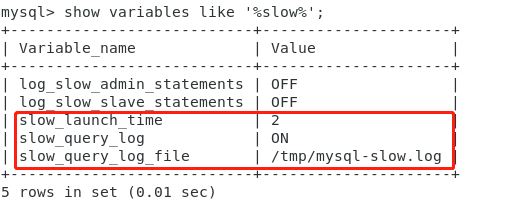
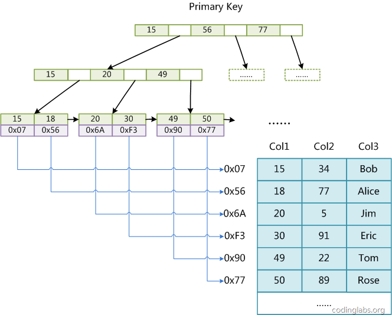
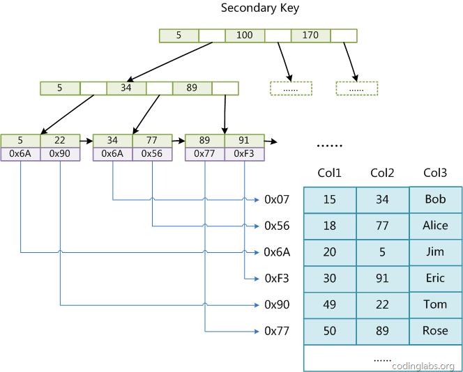
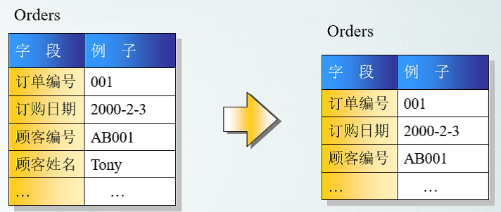

# DBA1015 - SQL、数据类型与工具

返回[Bulletin](./bulletin.md)

返回[DBA101 - MySQL](./DBA101.md)

[TOC]

## 本章定位

主线章节之外的 SQL 基础、数据类型选择、常用运维命令与工具，以及全部历史知识（MyISAM 细节、Oracle/DB2 对比、范式、存储过程等）。**Appendix 内容正确但非当前 Senior Java 面试主线**，按需查阅。

```text
1. 常用 SQL 与函数
2. 数据类型与设计选择
3. 常用命令与工具（processlist / slow log / performance schema ...）
4. 数据库优化总览
5. 【Appendix】历史知识
```

------------------------------------------------------------------------

# 1. 常用 SQL 与函数

## 字符串拼接

concat函数：

```shell
mysql> select concat('1','2','3') from test ;
+---------------------+
| concat('1','2','3') |
+---------------------+
| 123 |
+---------------------+
```

如果连接串中存在NULL，则返回结果为NULL

```shell
mysql> select concat('1','2',NULL,'3') from test ;
+--------------------------+
| concat('1','2',NULL,'3') |
+--------------------------+
| NULL |
+--------------------------+
```

concat_ws(separator,str1,str2,...) 代表 concat with separator，是concat()的特殊形式。第一个参数是其它参数的分隔符。分隔符的位置放在要连接的两个字符串之间。分隔符可以是一个字符串，也可以是其它参数。

```shell
mysql> select concat_ws(':','1','2','3') from test ;
+----------------------------+
| concat_ws(':','1','2','3') |
+----------------------------+
| 1:2:3 |
+----------------------------+
```

分隔符为NULL，则返回结果为NULL。

如果参数中存在NULL，则会被忽略：

```shell
mysql> select concat_ws(':','1','2',NULL,NULL,NULL,'3') from test ;
+-------------------------------------------+
| concat_ws(':','1','2',NULL,NULL,NULL,'3') |
+-------------------------------------------+
| 1:2:3 |
+-------------------------------------------+
```

可以对NULL进行判断，并用其它值进行替换：

```shell
mysql> select concat_ws(':','1','2',ifNULL(NULL,'0'),'3') from bank limit 1;
+---------------------------------------------+
| concat_ws(':','1','2',ifNULL(NULL,'0'),'3') |
+---------------------------------------------+
| 1:2:0:3          |
+---------------------------------------------+
```

## LIKE 中的匹配符

- `%` 对应于0个或更多字符。
- `_` 只是LIKE语句中的一个字符。

> 前导 `%` 无法利用 B+Tree 左侧有序定位，详见 [DBA1013 索引利用问题](./DBA1013.md)。

## CHAR_LENGTH VS LENGTH

CHAR_LENGTH是字符数，而LENGTH是字节数。Latin字符的这两个数据是相同的，但是对于Unicode和其他编码，它们是不同的。

## 查看建表语句

```mysql
SHOW CREATE TABLE TEST
```

## 获取当前MySQL数据库版本

```mysql
select version()
```

------------------------------------------------------------------------

# 2. 数据类型与设计选择

## 数值类型

float 最多可以存储 8 位的十进制数，并在内存中占 4 字节。

double 最多可以存储 16 位的十进制数，并在内存中占 8 字节。

> 精确金额不要用 float/double，用 DECIMAL（定点数）或整数分（以"分"为单位存 long）。浮点误差是支付/账务类的经典事故。

## 字符串：CHAR vs VARCHAR（MySQL 口径）

> **【校正】** 老笔记这一节混用了 Oracle 的 VARCHAR2 术语。MySQL 里只有 CHAR 和 VARCHAR；VARCHAR2 是 Oracle 的类型，相关讨论移入 Appendix。

- CHAR(n)：定长。存 "abc" 到 CHAR(20) 也会占满 20 个字符位置（检索时删除尾随空格）。
- VARCHAR(n)：变长。只占用实际内容的长度，n 是最大值，额外用 1~2 字节记录长度。

CHAR 的效率比 VARCHAR 稍高（定长对齐）；VARCHAR 更省空间。选型直觉：长度基本固定的（如国家码、MD5）用 CHAR，其余用 VARCHAR。

## 日期时间类型

| 日期时间类型 | 占用空间 | 日期格式            | 最小值              | 最大值              |
| ------------ | -------- | ------------------- | ------------------- | ------------------- |
| DATETIME     | 8 bytes  | YYYY-MM-DD HH:MM:SS | 1000-01-01 00:00:00 | 9999-12-31 23:59:59 |
| TIMESTAMP    | 4 bytes  | YYYY-MM-DD HH:MM:SS | 1970-01-01 00:00:00 | 2038 年的某个时刻   |
| DATE         | 4 bytes  | YYYY-MM-DD          | 1000-01-01          | 9999-12-31          |
| TIME         | 3 bytes  | HH:MM:SS            | -838:59:59          | 838:59:59           |
| YEAR         | 1 bytes  | YYYY                | 1901                | 2155                |

> **面试提示**：TIMESTAMP 的 4 字节上限对应 2038 年问题（32 位 Unix 时间戳溢出）。MySQL 8.0.28+ 对 2038 之后的时间支持有所扩展，但跨系统传值时仍要警惕。TIMESTAMP 还带时区转换语义（存储为 UTC，读取按会话时区转换），DATETIME 存"字面值"不做转换——两者选型差异常被追问。

## 数据类型的优化

- 尽量使用可以正确存储数据的一个最小数据类型。

- 让数据操作简单，例如：
  - 整型操作比字符操作代价更低，因为校对规则更简单。
  - 使用MySQL自建类型而不是字符串来存储时间信息。
  - 用整型存储IP地址。

- 尽量避免使用NULL，因为需要额外的列来描述是否允许为NULL。

> **口径提示**：最后一条是经验法则不是铁律。现代 InnoDB 对 NULL 的处理代价没有老版本传说中那么夸张；NULL 列对索引、聚合和唯一约束的语义影响才是设计时要想的点。

------------------------------------------------------------------------

# 3. 常用命令与工具

## 查看连接信息

```mysql
show processlist
```

排查连接池打满、长事务、Sleep 连程堆积的第一入口（用法见 [DBA1011 连接器](./DBA1011.md)）。

## 慢查询日志【P0】

开启**慢查询**日志，查看慢查询的SQL。

登录数据库服务器，连接数据库：

```shell
mysql -uroot -p 密码
```

查看慢sql日志是否开启：

```mysql
show variables like '%slow%'
```



- slow_launch_time，慢sql的执行时间配置，大于该值将被视作慢sql记录到日志中，这个值根据业务需求配置；

- slow_query_log，慢sql日志开关，ON为开启，OFF为关闭；

- slow_query_log_file，慢sql日志文件路径，可通过日志查看慢sql语句及执行时间；

查看慢sql语句，并查看sql语句的执行计划（EXPLAIN 见 [DBA1013](./DBA1013.md)），看是否缺少索引，是否可以进行优化。

这是慢 SQL SOP 的第一步（完整 SOP 见 [DBA1013 慢 SQL 排查](./DBA1013.md)）。

## Performance Schema 性能模块

用来监视数据库的工具，主要关注数据库运行过程中的性能相关的数据。在MySQL 5.7是默认开启的，可以通过/etc/my.cnf修改配置。

显示performance_schema数据库：

```mysql
show databases
```

进入之后一共有87张表，使用的是performance_schema存储引擎，数据不会持久化，不会被写入binlog进行同步。

## 显示查询命令的精确用时【历史】

```mysql
show profiles #显示之前所有查询命令的精确用时。
show profile for query {编号} #显示指定查询命令执行时各个时间段的精确用时。
```

> **【校正】** 以上命令将会被逐步淘汰，新版本应以 Performance Schema 的 statement event 表替代。面试提到 profiling 时主动说明"这是老命令，现在用 Performance Schema"。

## EXPLAIN

EXPLAIN 的完整用法（五字段、type、Extra、执行计划解读）见 [DBA1013 - 索引、EXPLAIN 与 SQL 优化](./DBA1013.md)。

## 死锁分析

```mysql
SHOW ENGINE INNODB STATUS
```

用法与死锁定位 SOP 见 [DBA1012 死锁](./DBA1012.md)。

## Linux下将csv导入MySQL

### 文件不含中文

```mysql
load data infile 'F:/MySqlData/test1.csv' --CSV⽂件存放路径
into table student --要将数据导⼊的表名
fields terminated by ',' optionally enclosed by '"' escaped by '"'
lines terminated by '\r\n';
```

### 文件含中文

```mysql
load data infile 'F:/MySqlData/test1.csv' --CSV⽂件存放路径
into table student character set gb2312 --要将数据导⼊的表名
fields terminated by ',' optionally enclosed by '"' escaped by '"'
lines terminated by '\r\n';
```

------------------------------------------------------------------------

# 4. 数据库优化总览

归纳为5个层次：

## 减少数据访问（减少磁盘访问）

- 创建并使用正确的索引

- 只通过索引访问数据

- 优化SQL执行计划（数据访问算法）

## 返回更少数据（减少网络传输或磁盘访问）

- 数据分页处理

- 只返回需要字段

## 减少交互次数（减少网络传输）

- 使用储存过程

- 优化业务逻辑

## 减少服务器CPU开销（减少CPU及内存开销）

- 合理使用排序

- 减少比较操作

- 复杂运算在客户端处理

## 利用更多资源（增加资源）

- 客户端多进程并行访问

- 数据库并行处理

## IO瓶颈

第一种：磁盘读IO瓶颈，热点数据太多，数据库缓存放不下，每次查询时会产生大量的IO，降低查询速度。

解决方法：分库和垂直分表

第二种：网络IO瓶颈，请求的数据太多，网络带宽不够。

解决方法：分库

## CPU瓶颈

第一种：SQL问题，如SQL中包含join，group by，order by，非索引字段条件查询等，增加CPU运算的操作。

解决方法：SQL优化，建立合适的索引，在业务Service层进行业务计算。

第二种：单表数据量太大，查询时扫描的行太多，SQL效率低，CPU率先出现瓶颈。

解决方法：水平分表

------------------------------------------------------------------------

# 5. 【Appendix｜非当前 Senior Java 面试主线】

> 以下内容正确但低频，作为历史知识保留。面试主线请回到 DBA1011~1014。

## 附录A. MyISAM 详细结构【Appendix】

MyISAM是MySQL5.5.5之前的默认的引擎。对比表见 [DBA1011 存储引擎对比](./DBA1011.md)。

### 存储结构

MyISAM引擎使用B+树作为索引结构，叶节点的data域存放的是数据记录的地址。

MyISAM不强制要求每个表都有主键。

下图为MyISAM表的主索引，Col1为主键。



在MyISAM中，主索引和辅助索引在结构上没有任何区别，只是主索引要求key是唯一的，而辅助索引的key可以重复。

下图在Col2上建立一个辅助索引。



因此，MyISAM中索引检索的算法为首先按照B+Tree搜索算法搜索索引，如果指定的Key存在，则取出其data域的值，然后以data域的值为地址，读取相应数据记录。

MyISAM数据文件跟索引文件分开存放的存储方式叫做**非聚集索引**，与InnoDB的聚集索引区分。

索引存放在MYI文件，表数据存放在MYD文件。

## 附录B. 关系型数据库概览【Appendix】

采用了关系模型来组织数据的数据库，其以行和列的形式存储数据。

### Oracle

最贵，功能最多，安装最不方便，Oracle环境里的其他相关组件最多，支持平台数量一般，使用中等方便，开发中等方便，运维中等方便，不开源，速度最慢，最安全。

### Microsoft SQL Server

中等贵，功能最少，安装中等方便，Microsoft SQL Server 2014环境里的其他相关组件最少，支持平台最少，使用最方便，开发最方便，运维最方便，不开源，速度中等，一般安全。

### MySQL

免费，功能中等，安装最方便，Mysql环境里的其他相关组件数量中等，支持平台最多，使用最不方便，开发最不方便，运维最不方便，有开源版本，速度最快，最不安全。

### MySQL VS Oracle【Appendix】

|                   | MySQL                                                        | Oracle                                                       |
| ----------------- | ------------------------------------------------------------ | ------------------------------------------------------------ |
| 数据库等价于      | 一个数据库DB                                                 | 一个用户Schema                                               |
| 自增长            | 自增长主键  字段的auto_increment属性                         | 序列（Sequence）                                             |
| 查询语句分页      | limit  [offset,] <row count>                                 | rownum伪列（且需要注意陷阱）                                 |
| 真假判断          | 真1假0                                                       | 真true假false                                                |
| 无引用查询        | select  sysdate();                                           | 需要引用虚表（select sysdate from dual;）                    |
| 备份命令          | mysqldump  执行结果是一个（文本sql命令），可以直接导入到其它mysql数据库，甚至可以稍作修改导入到其它类型的数据库 | dpdump  执行结果是一个二进制的dmp文件，只能Oracle自己用（甚至还有版本限制） |
| 命令默认commit    | 是                                                           | 不是                                                         |
| 注释行            | # 注释内容                                                   | -- 注释内容                                                  |
| 日期转换          | dateformat()函数                                             | to_date()与to_char()两个函数                                 |
| 字符串            | 单引号/双引号引用                                            | 单引号引用                                                   |
| 字符串连接        | concat()参数不限                                             | concat()参数两个 和 \|\|                                     |
| 查询格式信息      | show tables;                                                 | select *  from user_tables;                                  |
| 大小写敏感        | Unix/Linux下的数据库名、表名                                 | 无                                                           |
| 执行脚本/外部命令 | mysql>source  a.sql;                                         | SQL>@a.sql                                                   |
| 类型支持          | 支持枚举类型（enum）  支持集合类型（set）                    | 需要外键                                                     |

### Oracle 的 VARCHAR 与 VARCHAR2【Appendix】

工业标准的VARCHAR类型可以存储空字符串，但是oracle不这样做。Oracle自己开发了一个数据类型VARCHAR2，这个类型不是一个标准的VARCHAR，它将varchar列可以存储空字符串的特性改为存储NULL值。如果你想有向后兼容的能力，Oracle建议使用VARCHAR2而不是VARCHAR.

目前VARCHAR是VARCHAR2的同义词。

### MySQL VS DB2【Appendix】

|                | MySQL                          | DB2                                  |
| -------------- | ------------------------------ | ------------------------------------ |
| 主备复制       | 逻辑复制                       | 物理复制，要求主备架构、配置一致     |
| 复制日志       | 提交的日志                     | 提交和回滚的日志                     |
| 事务跨越       | 事务跨越数据库                 | 事务不可跨越独立日志、表空间、缓冲区 |
| 多版本         | 支持多版本，从UNDO构造历史版本 | 只有落实和未落实版本                 |
| 受影响的记录数 | 默认是实际更改的行数           | 默认是实际匹配的行数                 |
| UPDATE SET计算 | 从左往右的实时计算             | 全部使用更新前的值计算               |
| HASH JOIN      | MySQL 8以后支持                | 支持                                 |
| 窗口函数       | MySQL 8以后支持                | 支持                                 |
| 支持CTE        | MySQL 8以后支持                | 支持                                 |
| 更新游标       | 不支持                         | 支持                                 |

## 附录C. 范式【Appendix】

范式就是规范。

### 第一范式（1NF）

指数据库表的每一列都是不可分割的基本数据项。（列数据的不可分割）


### 第二范式（2NF）

想要满足第二范式必须先满足第一范式。

指数据库表的每一行都可以被唯一的区分，为此要加上一列以储存每一行的唯一表示。（主键）


### 第三范式（3NF）

要满足第三范式必须先满足第二范式。

指数据库表的每一行再被主键标识的基础上，不存在已在其他表上包含的函数关系，即不能依赖于本表非关键字数据元素。（外键）



### 反三范式

有时为了效率，可以设置重复或者可以推导出的字段。

例如：订单（总价） 和 订单项（单价）

## 附录D. 存储过程 / 视图 / 触发器【Appendix】

### 存储过程

存储过程是一个预编译的SQL语句，只在创建时进行编译，以后每次执行存储过程都不需要再重新编译，可以大大提高数据库执行速度。

存储过程把多条SQL语句存在同一个存储过程中，可以减少客户端和服务端之间的网络传输负载。

只需创建一次，以后在该程序中就可以调用多次，减少数据库开发人员工作量。

安全性高，屏蔽对底层数据库对象的直接访问。这样用户只需要使用EXECUTE权限调用存储过程，而不必具备访问底层数据库对象的显式权限。

> 当前互联网应用普遍把业务逻辑放应用层，存储过程难版本管理、难扩展，仅作知识保留。

### 视图

视图实际上是在数据库中通过Select查询语句从多张表中提取的多个表字段所组成的虚拟表。

- 视图并不占据物理空间，所以通过视图查询出的记录并非保存在视图中，而是保存在原表中。

- 通过视图可以对指定用户隐藏相应的表字段，起到保护数据的作用。

- 在满足一定条件时，可以通过视图对原表中的记录进行增删改操作。

- 创建视图时，只能使用单条select查询语句。

常见使用场景：

- 重用SQL语句，在编写查询后可以方便的重用它而不必知道它的基本查询细节。

- 简化复杂的SQL操作；使用表的组成部分而不是整个表。

- 保护数据：可以给用户授予表的特定部分的访问权限而不是整个表的访问权限。

- 更改数据格式和表示。视图可返回与底层表的表示和格式不同的数据。

### 触发器

触发器是一种特殊的存储过程，主要是通过条件来触发而被执行操作的。

它可以强化约束，来维护数据的完整性和一致性，可以跟踪数据库内的操作从而不允许未经许可的更新和变化。可以联级运算。如，某表上的触发器上包含对另一个表的数据操作，而该操作又会导致该表触发器被触发。

## 附录E. 分库分表【Appendix｜只到概念层】

分库和分表是两个独立的概念，都是为了防止数据库服务因为同一时间的访问量（增删查改）过大导致宕机而设计的一种应对策略。

### 分库

将一个库的数据拆分到多个库中，访问的时候根据一定条件访问单库，缓解单库的性能压力。

### 分表

如果单表的数据量太大，就会影响SQL语句的执行性能。分表就是将单表的数据按照特定策略拆分到多个表中，这样就将每次查询的数据范围缩小了，可以提升SQL语句的执行性能。

### 水平拆分

把一个表的数据拆分到多个结构相同的库或表里面去，数据汇总起来就是全部数据。

水平拆分的意义在于将数据均匀地存放在各个库表里，依靠多个库来扛更高的并发，而且还能借助多个库的存储容量来进行扩容。

### 垂直拆分

把一个有很多字段的表给拆分成多个库或表上面去，每个库表都包含原表的部分字段。一般来说会将较少的访问频率很高的字段放到一个表里面去，然后将较多的访问频率很低的字段放到另外一个表里面去。因为数据库是有缓存的，你访问频率高的行字段越少，就可以在缓存里面缓存更多的行，性能也就越好。一般在表层面做的较多一些。

### 按照范围拆分

优点在于扩容的时候非常简单，比如只要预备好每个月都准备一个库就可以了，到了下一个新的月份自动将数据写入新的库。

缺点则是如果大部分请求都是访问最新的数据，那么这种方式很容易会产生热点问题，大量的流量都打在最新的数据上了。分库分表的设计目的就只是简单的扩容，而不是为了应对高并发了。

### 按照哈希值拆分

优点在于可以平均分配每个库表的数据量和请求压力。

缺点在于扩容比较麻烦，因为会存在一个数据迁移的过程，即之前的数据需要重新计算hash值并重新分配到不同的库表中。

### 分表的时机

具体情况根据数据库服务器的配置和架构有关，以下仅供参考：

- 当oracle单表的数据量大于2000万行时，建议进行水平分拆。

- 当mysql单表的数据量大于1000万行时，建议进行水平分拆。

> **止损**：分库分表的完整理论（ShardingSphere、跨分片查询、分布式事务、扩容迁移）不在本课程范围。面试能讲清"垂直/水平、范围/哈希的取舍 + 引入分布式 ID 和跨片查询的代价"即可。

------------------------------------------------------------------------

## 本章验收

- [ ] CHAR vs VARCHAR（MySQL 口径）？
- [ ] DATETIME vs TIMESTAMP（空间/时区/2038）？
- [ ] concat 遇到 NULL 的行为？concat_ws？
- [ ] 慢查询日志三个关键变量？
- [ ] show profiles 为什么被淘汰？
- [ ] 金额字段用什么类型？
- [ ] （Appendix）为什么 InnoDB 取代了 MyISAM？
- [ ] （Appendix）1NF/2NF/3NF 一句话各是什么？
