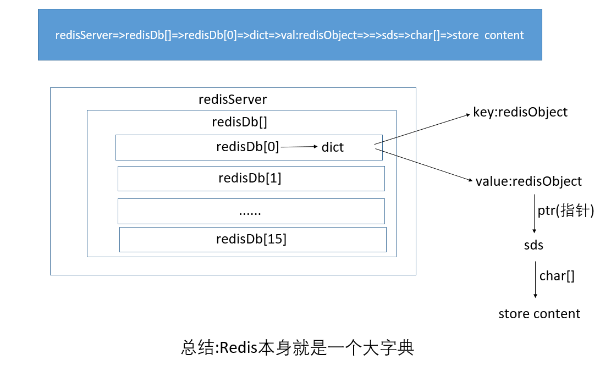
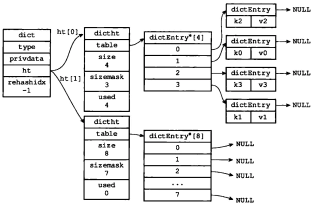
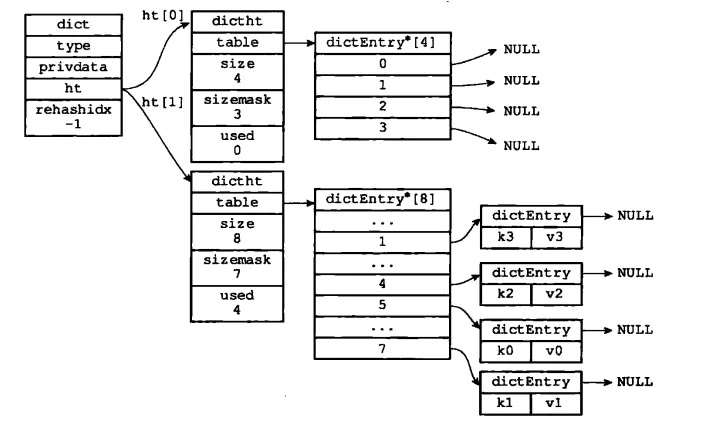
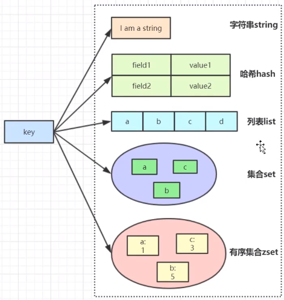

# DBA201 - Redis - 基本概念

返回[Bulletin](./bulletin.md)

返回[DBA201 - Redis](./DBA201.md)

[TOC]

## 非关系型数据库

### 定义

NoSQL, 全称Not Only SQL, 泛指非关系型数据库，存储数据的方式和关系型数据库不一样，一度成为高并发、海量数据存储解决方案的代名词。

### 文档数据库 MongoDB

MongoDB是一种文档数据库，是一种介于关系型数据库和非关系型数据库之间的产品，是非关系型数据库中功能最丰富、最像关系型数据库的，是对传统关系型数据库的补充。 MongoDB非常适合高伸缩性的场景，可扩展性的表结构可以将不同结构的文件存储在同一个数据库里。 如果用MongoDB存储数据量特别大的日志数据，利用分片集群支持海量数据，同时使用聚集分析和MapReduce的能力，是个很好的选择。 MongoDB还适合存储大尺寸的数据，GridFS存储方案就是基于MongoDB的分布式文件存储系统。

### 列族数据库 HBase

HBase适合海量数据的存储与高性能实时查询，它是运行于HDFS文件系统之上，并且作为MapReduce分布式处理的目标数据库，以支撑离线分析型应用。在数据仓库、数据集市、商业智能等领域发挥了越来越多的作用，在数以千计的企业中支撑着大量的大数据分析场景的应用。

### 全文搜索引擎 ElasticSearch

在一般情况下，关系型数据库的模糊查询，都是通过like的方式进行查询。其中，like "value%" 可以使用索引，但是对于like "%value%"这样的方式，执行全表查询，这在数据量小的表，不存在性能问题，但是对于海量数据，全表扫描是非常可怕的事情。ElasticSearch 作为一个建立在全文搜索引擎Apache Lucene基础上的实时的分布式搜索和分析引擎，适用于处理实时搜索应用场景。此外，使用ElasticSearch全文搜索引擎，还可以支持多词条查询、匹配度与权重、自动联想、拼写纠错等高级功能。因此，可以使用ElasticSearch作为关系型数据库全文搜索的功能补充，将要进行全文搜索的数据缓存一份到ElasticSearch上，达到处理复杂的业务与提高查询速度的目的。
ElasticSearch不仅仅适用于搜索场景，还非常适合日志处理与分析的场景。著名的ELK日志处理方案，由ElasticSearch, Logstash和Kibana三个组件组成，包括了日志收集、聚合、多维度查询、可视化显示等。

### Redis

Redis (Remote Dictionary Server) 本质上是一个 Key-Value 类型的内存数据库，整个数据库统统加载在内存当中进行操作，定期通过异步操作把数据库数据flush到硬盘上进行保存。Redis是开源NoSQL数据库，目前由VMware主持开发工作。

#### 应用场景

- 五大value类型。
- Redis适用于数据变化快且数据库大小可遇见（适合内存容量）的应用程序。可以使用Redis作为一个缓存服务器，基本没有使用Redis进行存储的。
- 用于实现服务无状态。可以在单机环境中实现单机锁，或者在多机环境中实现分布式锁。
- Redis单线程串行执行，可以实现系统的无锁化。

#### 优点

- 高性能：使用C编写，因为是纯内存操作，Redis的性能非常出色，读写速度几乎没有区别，每秒可以处理超过10万次读写操作，是已知性能最快的Key-Value DB.
- 数据结构化：Redis最大的魅力是支持保存多种数据结构。Redis提供了一个高效的数据结构扩展，因此它有时也被称为数据结构服务器。
- 事务功能：Redis提供了事务的功能，可以保证一串命令的原子性，中间不会被任何操作打断。
- PUB/SUB: 支持发布与订阅。
- 主从复制：Redis支持master-slave模式的数据备份。
- 持久化：可以将内存中的数据保存到磁盘中，重启的时候可以再次加载原数据。
- 过期时间：另外Redis也可以对存入的Key-Value设置expire时间，因此也可以被当作一个功能加强版的memcached来用。

#### 缺点

- 数据库容量受到物理内存的限制，不能用作海量数据的高性能读写，因此Redis适合的场景主要局限在较小数据量的高性能操作和运算上。
- 事务中任一命令有语法错误或key-value数据类型错误，事务照常运行。
- 数据结构不支持嵌套其他数据结构，比如类型为list的value不能再嵌套一个list.
- 单线程模型处理所客户请求的命令。对高并发支持不是很好。
- 主从做冗余备份时，主机迭机后，不能从多个从机中自动选举出主机。

### Memcached

Memcached数据缓存服务器，也是Key-Value类型的数据库，提供的命令形式极为接近。

#### Redis VS Memcache
|              | Redis                                                        | Memcached                                           |
| ------------ | ------------------------------------------------------------ | --------------------------------------------------- |
| 数据持久化   | 支持                                                         | 不支持                                              |
| 主从复制     | 支持                                                         | 不支持                                              |
| 数据支持类型 | Redis支持更为丰富的数据类型，提供list, set, zset, hash等数据结构的存储，以及不同类型可以调用的方法。 | Memcached所有的值均是简单的字符串，没有类型的概念。 |
| 底层模型     | 底层实现方式以及服务端客户端之间通信的应用协议不一样。Redis自己构建了VM机制，避免了一般系统中浪费一定的时间去移动和请求。 |                                                     |
| Value值大小  | Redis最大可以达到512M。Redis单个value的最大限制远大于Memcached，因此Redis可以用来实现很多有用的功能，比方说用他的List来做FIFO双向链表，实现一个轻量级的高性能消息队列服务，用他的Set可以做高性能的tag系统等等。 | Memcached只有1mb。                                  |
| 速度         | 快                                                           | 慢                                                  |

## Redis基本知识

### Redis版本号

版本号第二位如果是奇数，则为非稳定版本（例如2.7、2.9、3.1）；如果是偶数，则为稳定版本  （例如2.6、2.8、3.0、3.2、4.0）。

目前官网最新版本已到6以上。常用版本以4.0.10版本为例，有以下特性：

- 优化了主从复制同步

- 优化阻塞命令，例如优化了del/flush命令删除大key，可以使用非阻塞的unlink命令让整个数据库集或单个数据库异步释放

- 慢日志记录客户端来源ip地址

- 混合RDB+AOF格式

- 新的管理命令，例如MEMORY命令更深入地报告Redis内存使用情况

- 使用更少的内存存储相同数量的数据，并对使用的内存进行碎片整理，逐渐回收空间。

### 数据结构



Redis是一个键值对（key-value pair）数据库服务器，结构由redis.h/redisServer表示。

```c
struct redisServer {
    //..
    //服务器的数据库数量
    int dbnum;
    //一个数组，保存着服务器中的所有数据库
    redisDb *db;
    //..
}
```

Redis服务器中的所有数据库保存在**db数组**中，结构由redis.h/redisDb表示。

```c
struct redisDb {
    //..
    //数据库键空间，保存着数据库中的所有键值对
    dict *dict;
    //..
}
```

redisDb结构的**dict字典**保存了数据库中的所有键值对。

当要将一个新的键值对添加到字典里面时，程序需要先根据键值对的键计算出哈希值和索引值，然后再根据索引值，将包含新键值对的哈希表节点放到哈希表数组的指定索引上。

当有两个或以上数量的键被分配到了哈希表数组的同一个索引上时，称为哈希冲突，Redis的哈希表使用**单向链表**解决冲突，使用哈希表节点的next指针将冲突的节点连接起来，因为dictEntry节点组成的链表没有指向链表表尾的指针，为了速度考虑，总是将新节点添加的链表的**表头位置**（复杂度为O(1)）。

### Rehash

为了让哈希表的负载因子（load factor）维持在一个合理的范围内，会使用rehash（重新散列）操作对哈希表进行相应的扩展或收缩。 

#### 触发扩容条件

负载因子=哈希表已保存节点数量 / 哈希表大小
$$
load_factor = ht[0].used / ht[0].size
$$

- Redis服务器目前没有在执行BGSAVE命令或BGREWRITEAOF命令，并且哈希表的负载因子大于等于1。
- Redis服务器目前在执行BGSAVE命令或BGREWRITEAOF命令，并且哈希表的负载因子大于等于5。

#### 触发缩容条件

当哈希表的负载因子小于0.1时，对哈希表执行收缩操作。

#### 具体步骤

为字典的ht[1]哈希表分配空间。

- 如果执行的是扩展操作，那么ht[1]的大小为第一个大于等于ht[0].used*2的2的n次幂.
- 如果执行的是收缩操作，那么ht[1]的大小为第一个大于等于ht[0].used的2的n次幂。

例如：这里我们为ht[1]分配空间为8



将ht[0]中的数据转移到ht[1]中，在转移的过程中，重新计算键的哈希值和索引值，然后将键值对放置到ht[1]的指定位置。

数据转移后的结果：



当ht[0]的所有键值对都迁移到了ht[1]之后（ht[0]变为空表），将ht[0]释放，然后将ht[1]设置成ht[0]，最后为ht[1]分配一个空白哈希表：


### 渐进式Rehash

在进行拓展或者压缩的时候，可以直接将所有的键值对rehash到ht[1]中，这是因为数据量比较小。在实际开发过程中，这个rehash操作并不是一次性、集中式完成的，而是分多次、渐进式地完成的。

#### 详细步骤

1. 为ht[1]分配空间，让字典同时持有ht[0]和ht[1]两个哈希表
2. 维持一个索引计数器变量rehashidx，并将它的值设置为0，表示rehash开始
3. 在rehash进行期间，每次对字典执行CRUD操作时，程序除了执行指定的操作以外，还会将ht[0]中的数据rehash到ht[1]表中，并且将rehashidx加1。
4. 当ht[0]中所有数据转移到ht[1]中时，将rehashidx 设置成-1，表示rehash结束。

#### 优点

采用渐进式rehash的好处在于它采取分而治之的方式，避免了集中式rehash带来的庞大计算量。

### Redis数据类型

Redis键值对的key只能是字符串类型，value可以是以下五种数据类型：



#### String 字符串

String是redis最基本的类型，可以理解成与Memcached一模一样的类型，一个key对应一个 value, 最大能存储512MB。

String类型是二进制安全的。意思是redis的string可以包含任何数据。比如jpg图片或者序列化的对象。

常用命令：

- set 为指定key赋值
- get 获取指定key的值
- decr 数值减一
- incr 数值加一
- mget 获取一个或多个指定key的值

#### Hash 哈希

Hash是一个键值(key=>value)对集合；是一个string类型的field和value的映射表，每个hash可以存储232 – 1个键值对（40多亿），建议不超过50000个。

Hash特别适合用于存储对象。

常用命令：

- hget 返回指定字段的值
- hset 为指定字段赋值
- hgetall 返回hash中所有字段和值

应用场景：存储一些结构化的数据，比如用户的昵称、年龄、性别、积分等，存储一个用户信息对象数据。

#### List 列表

List是简单的字符串列表，按照插入顺序排序。你可以添加一个元素到列表的头部（左边）或者尾部（右边）。当所有元素被移除后，列表的key也会被从数据库中移除。列表最多可存储232 – 1个元素 (4294967295, 每个列表可存储40多亿)，建议不超过50000个。

常用命令：

- lpush 从左加入元素
- rpush 从右加入元素
- lpop 从左弹出元素
- rpop 从右弹出元素
- lrange 返回指定区间内的元素

应用场景：List类型经常会被用于消息队列的服务，以完成多程序之间的消息交换。

#### Set 集合

Set是string类型的无序集合。集合是通过哈希表实现的，所以添加，删除，查找的复杂度都是O(1)。集合不允许出现重复的元素，如果多次添加相同的元素，集合将仅保留该元素的一份拷贝。集合可包含的最大元素数量是232 – 1（4294967295）个元素，建议不超过50000个。

集合最大的优势在于可以进行交集并集差集操作。

常用命令：

- sadd 将一个或多个指定元素加入集合
- spop将一个或多个指定元素移除集合
- smembers返回集合中的所有元素
- sinter 求交集
- sinterstore 求交集并保存在另一个集合中
- sunion 求并集
- sunionstore求并集并保存在另一个集合中
- sdiff 求差集
- sdiffstore 求差集并保存在另一个集合中

应用场景：

- 利用交集求共同好友。
- 利用唯一性，可以统计访问网站的所有独立IP。
- 好友推荐的时候根据tag求交集，大于某个threshold（临界值的）就可以推荐。

#### Zset (sorted set)有序集合

Zset和set一样，也是string类型元素的集合，且不允许有重复的成员。不同的是zset每个元素都会关联一个double类型的分数。redis正是通过分数来为集合中的成员进行从小到大的排序。

Zset的成员是唯一的，但分数(score)却可以重复。有序集合可包含的最大元素数量是232 – 1（4294967295）个元素，建议不超过50000个。

底层实现：跳表

常用命令：

- zadd将一个或多个指定元素加入集合

- zrange 按顺序返回指定区间内的元素

- zrem 将一个或多个指定元素移出集合

- zcard 返回集合中元素的数量

应用举例：

- 当你需要一个有序的并且不重复的集合列表时，那么可以选择sorted set数据结构。

- 例如存储全班同学的成绩，其集合value可以是同学的学号，而score就可以是成绩。

- 排行榜应用，根据得分列出topN的用户等。

### Redis高效的原因

- Redis使用C编写，纯内存访问，内存的响应时长大约为100纳秒，这是Redis达到每秒万级别访问的重要基础。
- 非阻塞I/O，Redis使用epoll作为I/O多路复用技术的实现。
- 单线程操作，避免了频繁的线程上下文切换和竞态产生的消耗，因此Redis可以保障内部串行，但是整体业务上需要自行保障执行顺序。无论什么版本，工作线程**只有一个**，不违反Redis的串行原子性。只不过在6.x高版本出现了IO多线程，把输入/输出放到更多的线程里去并行，便于：
  - 缩短执行时间
  - 高效使用系统以及硬件的资源

### 内存和性能优化

- 尽量使用Redis的**散列表**，把相关的信息放到散列表里面存储，而不是把每个字段单独存储，这样可以有效的**减少内存使用**。比如将Web系统的用户对象，应该放到散列表里面再整体存储到Redis, 而不是把用户的姓名、年龄、密码、邮箱等字段分别设置key进行存储。
- 主服务器写内存快照，会阻塞主线程的工作，当快照比较大时对性能影响是非常大的，会间断性暂停服务，所以**主服务器**最好**不要写内存快照**。
- Redis主从复制的性能问题，为了主从复制的速度和连接的稳定性，主从库最好在**同一个局域网**内。

### 管道操作

Redis的多条插入，远快于多条更新的执行时间。因为两个连续的写操作和两个连续的读操作总共只会花费一次网络来回，就好比连续的 write 操作合并了，连续的 read 操作也合并了一样。

这便是**管道**操作的本质，服务器根本没有任何区别对待，还是收到一条消息，执行一条消息，回复一条消息的正常的流程。客户端通过对管道中的指令列表改变读写顺序就可以大幅节省 IO 时间，管道中指令越多效果越好。

### 过期策略

Redis的过期策略会处理掉不常用的数据，只保留常用的。因为过期策略不会处理全量的过期数据，所以部分数据可能过期以后还会占用着内存。

#### 定期删除

指的是 redis 默认是每隔 100ms 就随机抽取一些设置了过期时间的key，检查其是否过期，如果过期就删除。

为了保证性能，Redis定期删除只是抽取一部分key来检查和删除的。

#### 惰性删除

获取key的时候，如果此时key已经过期，就删除，不会返回任何东西。

### 内存淘汰机制

过期策略仍可能导致大量过期key堆积，此时就需要**内存淘汰机制**，主要采用了6种方式进行内存对象的释放操作：

**noeviction**

不删除任意数据，不过Redis还是会根据引用计数器进行释放。

当内存不足以容纳新写入数据时，直接报错。

**allkeys-lru**

当内存不足以容纳新写入数据时，在key空间中，移除最近最少使用的key.

最常用的方式。

**allkeys-random**

当内存不足以容纳新写入数据时，在key空间中，移除随机一个key.

**volatile-lru**

当内存不足以容纳新写入数据时，在设置了过期时间的key空间中，移除最近最少使用的key.

**volatile-random**

当内存不足以容纳新写入数据时，在设置了过期时间的key空间中，移除随机一个key.

**volatile-ttl**

当内存不足以容纳新写入数据时，在设置了过期时间的key空间中，优先移除有更早过期时间的key.