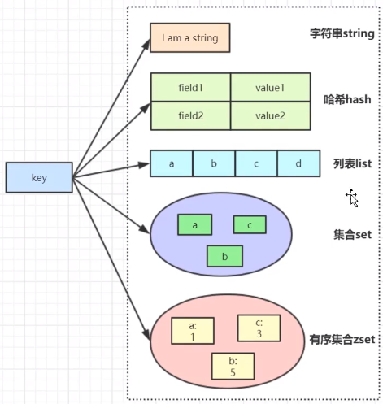
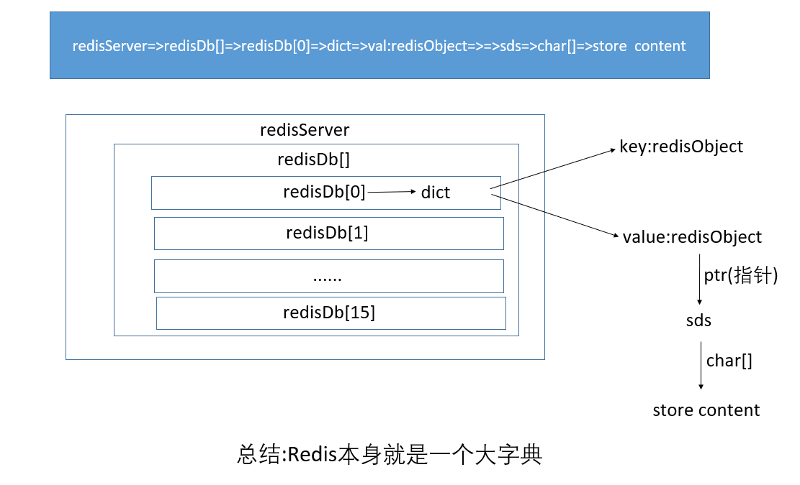
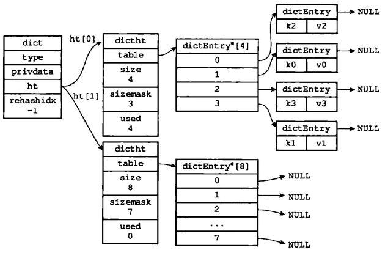
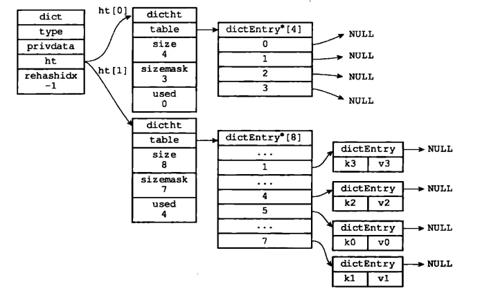
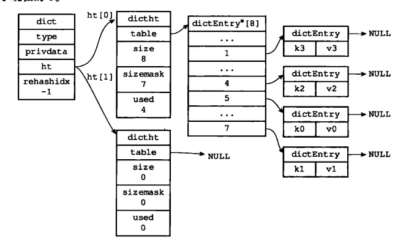

# DBA201 - Redis - 原理与数据结构

返回[Bulletin](./bulletin.md)

返回[DBA201 - Redis](./DBA201.md)

[TOC]

## Redis 是什么【P0】

Redis (Remote Dictionary Server) 本质上是一个 Key-Value 类型的内存数据库，整个数据库统统加载在内存当中进行操作，定期通过持久化机制（RDB/AOF）把数据保存到硬盘。Redis 是开源 NoSQL 数据库。

### 人话解释

主要把数据放在内存、支持多种数据结构的高性能数据服务。

### 应用场景

- 五大 value 类型。
- Redis 适用于数据变化快且数据库大小可遇见（适合内存容量）的应用程序。最常见是作为缓存服务器：缓存热点数据，减少 MySQL 压力和接口延迟。
- 用户配置、热点详情、Token、计数器等。
- 用于实现服务无状态。可以在单机环境中实现单机锁，或者在多机环境中实现分布式锁。
- Redis 命令串行执行，可以实现系统的无锁化。

### 优点

- 高性能：使用 C 编写，因为是纯内存操作，Redis 的性能非常出色，读写速度几乎没有区别，每秒可以处理超过 10 万次读写操作，是已知性能最快的 Key-Value DB。
- 数据结构化：Redis 最大的魅力是支持保存多种数据结构。Redis 提供了一个高效的数据结构扩展，因此它有时也被称为数据结构服务器。
- 事务功能：见《Redis 事务》一节的校正说明。
- PUB/SUB：支持发布与订阅。
- 主从复制：Redis 支持 master-slave 模式的数据备份。
- 持久化：可以将内存中的数据保存到磁盘中，重启的时候可以再次加载原数据。
- 过期时间：另外 Redis 也可以对存入的 Key-Value 设置 expire 时间，因此也可以被当作一个功能加强版的 memcached 来用。

### 缺点

- 数据库容量受到物理内存的限制，不能用作海量数据的高性能读写，因此 Redis 适合的场景主要局限在较小数据量的高性能操作和运算上。
- 数据结构不支持嵌套其他数据结构，比如类型为 list 的 value 不能再嵌套一个 list。
- 【校正】原笔记"事务中任一命令有语法错误或 key-value 数据类型错误，事务照常运行"，这句话方向接近事实（Redis 事务确实不整体回滚），但表述不完整：**入队阶段的错误会让整个事务在 EXEC 时拒绝执行**，运行阶段的错误才表现为"该条失败、其余继续"。详见《Redis 事务》。
- 【校正】原笔记"单线程模型处理所有客户请求的命令。对高并发支持不是很好"，基于旧版本、表述过度绝对。现代 Redis 更准确的理解是：核心命令执行是单线程串行的，但单实例依然能跑到 10 万级 QPS；高并发扩展依靠分片/Cluster，而不是"把命令执行改成多线程"；并且 Redis 6.0 起网络 I/O 已经可以多线程。单线程串行恰恰是它简单、无锁竞争的原因，不应简单列为"高并发差"。
- 【校正】原笔记"主从做冗余备份时，主机宕机后，不能从多个从机中自动选举出主机"，这是**裸主从模式**的缺点。使用 Sentinel（2.8+）或 Cluster（3.0+）之后可以自动故障转移，详见 [DBA2014](./DBA2014.md)。

### 面试回答【30-60 秒】

> Redis 是以内存访问为主的数据服务，支持 String、Hash、List、Set、Sorted Set 等结构。Java 后端最常用于缓存以降低数据库压力和延迟，也常用于计数、Session、排行榜和分布式锁等场景。

------------------------------------------------------------------------

## Redis 为什么快？【P0】

- Redis 使用 C 编写，纯内存访问，内存的响应时长大约为 100 纳秒，这是 Redis 达到每秒万级别访问的重要基础。
- 数据结构高效：底层 DS（动态字符串、哈希表、跳表、压缩列表等）针对读写场景做了专门优化。
- 非阻塞 I/O：Redis 使用 epoll 作为 I/O 多路复用技术的实现，事件驱动模型处理海量连接。
- 命令执行模型简洁：核心命令在单线程中串行执行，避免了频繁的线程上下文切换和竞态锁消耗，因此 Redis 内部天然串行（整体业务上仍需要自行保障执行顺序）。

【校正】原笔记写"无论什么版本，工作线程**只有一个**，不违反 Redis 的串行原子性"。这基于旧版本、表述过度绝对。现代更准确的理解是：

> 经典核心命令执行路径主要串行处理，减少共享数据上的锁竞争。但"单线程"不能理解为"整个 Redis 只有一个线程"——Redis 6.x 网络 I/O 已支持多线程（并行读写 socket、协议解析），除此之外还有持久化、异步删除（lazy free）等后台线程。面试中不要再说"Redis 所有事情都只有一个线程"。

### 面试回答【30-60 秒】

> Redis 快首先因为数据主要在内存；其次经典核心命令执行模型较简洁，减少大量共享数据锁竞争；同时数据结构和网络事件处理也针对高性能优化。现代 Redis 并不能简单理解为所有工作都只有一个线程。

------------------------------------------------------------------------

## 五种常见数据类型【P0】

Redis 键值对的 key 只能是字符串类型，value 可以是以下五种数据类型：



### String 字符串

String 是最基本的类型，一个 key 对应一个 value，最大能存储 512MB。String 类型是二进制安全的，可以包含任何数据，比如 jpg 图片或者序列化的对象。

常用命令：

- set 为指定 key 赋值
- get 获取指定 key 的值
- decr 数值减一
- incr 数值加一
- mget 获取一个或多个指定 key 的值

应用场景：普通缓存、计数器、Token、锁的基础。

### Hash 哈希

Hash 是一个键值对集合，是一个 string 类型的 field 和 value 的映射表，每个 hash 可以存储 2^32 - 1 个键值对（40 多亿），建议不超过 50000 个。Hash 特别适合用于存储对象。

常用命令：

- hget 返回指定字段的值
- hset 为指定字段赋值
- hgetall 返回 hash 中所有字段和值

应用场景：存储结构化数据，比如用户的昵称、年龄、性别、积分等，存储一个用户信息对象数据。

### List 列表

List 是简单的字符串列表，按照插入顺序排序。可以添加元素到列表的头部（左边）或者尾部（右边）。当所有元素被移除后，列表的 key 也会被从数据库中移除。列表最多可存储 2^32 - 1 个元素（40 多亿），建议不超过 50000 个。

常用命令：

- lpush 从左加入元素
- rpush 从右加入元素
- lpop 从左弹出元素
- rpop 从右弹出元素
- lrange 返回指定区间内的元素

应用场景：经常被用于消息队列的服务，以完成多程序之间的消息交换。

### Set 集合

Set 是 string 类型的无序集合。集合通过哈希表实现，所以添加、删除、查找的复杂度都是 O(1)。集合不允许出现重复的元素，多次添加相同元素只保留一份。集合可包含的最大元素数量是 2^32 - 1 个，建议不超过 50000 个。

集合最大的优势在于可以进行交集、并集、差集操作。

常用命令：

- sadd 将一个或多个指定元素加入集合
- spop 将一个或多个指定元素移除集合
- smembers 返回集合中的所有元素
- sinter 求交集 / sinterstore 求交集并保存
- sunion 求并集 / sunionstore 求并集并保存
- sdiff 求差集 / sdiffstore 求差集并保存

应用场景：

- 利用交集求共同好友。
- 利用唯一性，统计访问网站的所有独立 IP。
- 好友推荐的时候根据 tag 求交集，大于某个 threshold 就可以推荐。

### Zset (sorted set) 有序集合

Zset 和 set 一样，也是 string 类型元素的集合，且不允许有重复的成员。不同的是 zset 每个元素都会关联一个 double 类型的分数（score）。Redis 正是通过分数来为集合中的成员进行从小到大的排序。

Zset 的成员是唯一的，但分数 (score) 却可以重复。有序集合可包含的最大元素数量是 2^32 - 1 个，建议不超过 50000 个。

底层实现：跳表。

常用命令：

- zadd 将一个或多个指定元素加入集合
- zrange 按顺序返回指定区间内的元素
- zrem 将一个或多个指定元素移出集合
- zcard 返回集合中元素的数量

应用举例：

- 当你需要一个有序的并且不重复的集合列表时，可以选择 sorted set 数据结构。
- 例如存储全班同学的成绩，其集合 value 可以是同学的学号，而 score 就可以是成绩。
- 排行榜应用，根据得分列出 topN 的用户等。

### 面试回答【30-60 秒】

> 常见结构包括 String、Hash、List、Set 和 Sorted Set。String 适合普通缓存和计数；Hash 适合对象字段；List 是有序可重复集合；Set 用于去重和集合运算；Sorted Set 通过 score 排序，适合排行榜等场景。

------------------------------------------------------------------------

## 过期策略【P0】

### TTL 是什么

TTL = Key 的生存时间。

- 为什么需要：控制数据时效、避免无用缓存永久占内存。
- 例子：验证码 TTL 5 分钟；普通业务缓存可能 30 分钟。
- 系统位置：`SET Cache → TTL → 过期 → 后续重新加载`。
- 面试回答：

> TTL 是 Key 的生存时间，用于控制缓存时效并避免无用 Key 长期占用内存。TTL 长度要在数据实时性和数据库回源压力之间权衡。

### TTL 到点会立即物理删除吗【P1】

不保证。

直觉上 Redis 结合：

- **惰性删除**：访问 key 时发现过期再清理，不会返回任何东西。
- **定期删除**：Redis 默认每隔 100ms 随机抽取一些设置了过期时间的 key，检查其是否过期，如果过期就删除。为了保证性能，定期删除只是抽取一部分 key 来检查和删除的。

> TTL 到点意味着逻辑上失效，但 Redis 不保证那一毫秒立即物理删除。它会结合惰性删除和周期清理，在过期回收与 CPU 成本之间权衡。

因此部分数据在过期以后还会短暂占用内存，这也是需要内存淘汰机制的原因之一。

### 过期删除 vs 内存淘汰【P0】

两个完全不同的机制：

```text
过期删除：
TTL 到期 → 清理

内存淘汰：
Memory 达到限制
 → 根据 Eviction Policy
 → 即使某些 Key 未过期也可能淘汰
```

> 过期删除针对 TTL 已到期的 Key；内存淘汰则是在达到内存限制时，根据 eviction policy 选择部分 Key 释放空间，即使它们可能还没自然过期。

------------------------------------------------------------------------

## 内存淘汰机制【P0｜历史失分】

【校正】原笔记写"主要采用了 6 种方式进行内存对象的释放操作"，缺少了 LFU 系列。现代 Redis 共 **8 种**淘汰策略（maxmemory-policy）：

**noeviction**

不删除任意数据，当内存不足以容纳新写入数据时，直接报错。默认策略。

**allkeys-lru**

当内存不足以容纳新写入数据时，在 key 空间中，移除最近最少使用的 key。最常用的方式。

**allkeys-lfu**

在 key 空间中，移除使用频率最低的 key。

**allkeys-random**

当内存不足以容纳新写入数据时，在 key 空间中，移除随机一个 key。

**volatile-lru**

当内存不足以容纳新写入数据时，在设置了过期时间的 key 空间中，移除最近最少使用的 key。

**volatile-lfu**

在设置了过期时间的 key 空间中，移除使用频率最低的 key。

**volatile-random**

当内存不足以容纳新写入数据时，在设置了过期时间的 key 空间中，移除随机一个 key。

**volatile-ttl**

当内存不足以容纳新写入数据时，在设置了过期时间的 key 空间中，优先移除有更早过期时间的 key。

### LRU / LFU【P0｜历史失分】

- LRU（Least Recently Used）：最近最久没有被访问的数据更容易淘汰。
- LFU（Least Frequently Used）：访问频率较低的数据更容易淘汰。

```text
LRU → 看"多久没用"
LFU → 看"使用频率"
```

> LRU 主要根据最近访问时间，倾向淘汰长时间未使用的数据；LFU 更关注访问频率，倾向淘汰低频数据。Redis 实际实现会采用适合工程性能的近似机制。

### 淘汰策略需要背多少？【P1】

理解三件事即可：

- `noeviction`：不淘汰，达到限制后相关写入失败；
- 可从带 TTL 的 Key 或全部 Key 中选择；
- 选择方式包括 LRU、LFU、随机等。

### 面试回答【30-60 秒】

> Redis 内存达到 maxmemory 后按淘汰策略（如 allkeys-lru / allkeys-lfu / volatile-ttl 等 8 种）释放空间。LRU 看最近是否被访问，LFU 看访问频率；Redis 采用近似实现以控制成本。生产上要关注 eviction 指标，淘汰增多通常意味着内存容量不足或存在 Big Key。

------------------------------------------------------------------------

## Redis 事务【P1】

Redis 通过 MULTI / EXEC 把一组命令打包执行：

```text
MULTI     开启事务，后续命令入队（返回 QUEUED）
EXEC      按入队顺序连续执行
DISCARD   放弃事务，清空命令队列
WATCH     乐观锁（CAS）：监视 key，若 EXEC 前被其他客户端改动则整个事务放弃
```

两类错误行为不同：

- 入队阶段错误（命令不存在、语法错误）：EXEC 时整个事务拒绝执行。
- 运行阶段错误（比如对 String 类型执行 lpush）：**出错的那条失败，其余命令照常执行**。

【校正】原笔记"事务功能：Redis 提供了事务的功能，可以保证一串命令的原子性"。这句话借用了传统数据库 ACID 的"原子性"话术，容易误导。现代更准确的理解是：MULTI/EXEC 提供的是"命令排队、按顺序连续执行、期间不插入其他客户端命令"，但 **Redis 事务不支持回滚**——出错的命令不撤销，已执行的不恢复。

和 ACID 对比：

- 原子性：只是"整体执行/整体拒绝"，没有 rollback；
- 一致性：依赖应用保证，没有约束概念；
- 隔离性：单线程串行执行天然满足；
- 持久性：取决于持久化配置，不能保证不丢数据。

工程上复杂逻辑通常用 **Lua 脚本**替代事务：Lua 整体原子执行，还能做条件判断（如释放锁时的 compare-and-delete）。

> 面试回答：Redis 事务是通过 MULTI/EXEC 把命令排队、连续执行，期间不会插入其他客户端的命令，但它和 ACID 意义上的原子性不同，不支持回滚：运行期出错的命令失败，其它命令照样执行。需要更完整的原子逻辑时我会用 Lua 脚本。

------------------------------------------------------------------------

## 管道操作 Pipeline【P1】

Redis 的多条插入，远快于多条单独执行的时间。因为两个连续的写操作和两个连续的读操作总共只会花费一次网络来回，就好比连续的 write 操作合并了，连续的 read 操作也合并了一样。

这便是**管道**操作的本质，服务器根本没有任何区别对待，还是收到一条消息，执行一条消息，回复一条消息的正常的流程。客户端通过对管道中的指令列表改变读写顺序就可以大幅节省 IO 时间，管道中指令越多效果越好。

注意：Pipeline 只合并网络往返，**不保证原子性**（区别于 MULTI/EXEC），部分命令失败也不会回滚。

------------------------------------------------------------------------

## 内存和性能优化【P1】

- 尽量使用 Redis 的**散列表**，把相关的信息放到散列表里面存储，而不是把每个字段单独存储，这样可以有效的**减少内存使用**。比如将 Web 系统的用户对象，应该放到散列表里面再整体存储到 Redis，而不是把用户的姓名、年龄、密码、邮箱等字段分别设置 key 进行存储。
- 【校正】原笔记"主服务器**最好**不要写内存快照"，表述过度绝对。现代更准确的理解是：开启 RDB/BGSAVE 时，fork 会有短暂停顿；COW（写时复制）在写入量大时会带来内存膨胀压力；后台 I/O 也会抢资源。但在主节点上做持久化仍是常见配置，关键是评估数据量、写入量和内存余量，配套监控，而不是一概禁止。
- Redis 主从复制的性能问题，为了主从复制的速度和连接的稳定性，主从库最好在**同一个局域网**内。

------------------------------------------------------------------------

## Redis 版本号【P2】

版本号第二位如果是奇数，则为非稳定版本（例如 2.7、2.9、3.1）；如果是偶数，则为稳定版本（例如 2.6、2.8、3.0、3.2、4.0）。

以 4.0.10 版本为例，历史特性：

- 优化了主从复制同步
- 优化阻塞命令，例如优化了 del/flush 命令删除大 key，可以使用非阻塞的 unlink 命令让整个数据库集或单个数据库异步释放
- 慢日志记录客户端来源 ip 地址
- 混合 RDB+AOF 格式
- 新的管理命令，例如 MEMORY 命令更深入地报告 Redis 内存使用情况
- 使用更少的内存存储相同数量的数据，并对使用的内存进行碎片整理，逐渐回收空间

现代背景：6.0 起引入 I/O 多线程、ACL 等能力；7.0 起提供 Redis Functions、Multi-Part AOF 等特性。

------------------------------------------------------------------------

## 数据结构（底层实现）【P2】

> 本节属于源码级理解，高级 Java 面试"了解即可"，对应 DBA201 索引中的 P2 止损清单（不背 SDS/Dict/SkipList 源码细节）。



Redis 是一个键值对（key-value pair）数据库服务器，结构由 redis.h/redisServer 表示。

```c
struct redisServer {
    //..
    //服务器的数据库数量
    int dbnum;
    //一个数组，保存着服务器中的所有数据库
    redisDb *db;
    //..
}
```

Redis 服务器中的所有数据库保存在 **db 数组**中，结构由 redis.h/redisDb 表示。

```c
struct redisDb {
    //..
    //数据库键空间，保存着数据库中的所有键值对
    dict *dict;
    //..
}
```

redisDb 结构的 **dict 字典**保存了数据库中的所有键值对。

当要将一个新的键值对添加到字典里面时，程序需要先根据键值对的键计算出哈希值和索引值，然后再根据索引值，将包含新键值对的哈希表节点放到哈希表数组的指定索引上。

当有两个或以上数量的键被分配到了哈希表数组的同一个索引上时，称为哈希冲突，Redis 的哈希表使用**单向链表**解决冲突，使用哈希表节点的 next 指针将冲突的节点连接起来，因为 dictEntry 节点组成的链表没有指向链表表尾的指针，为了速度考虑，总是将新节点添加到链表的**表头位置**（复杂度为 O(1)）。

### Rehash

为了让哈希表的负载因子（load factor）维持在一个合理的范围内，会使用 rehash（重新散列）操作对哈希表进行相应的扩展或收缩。

#### 触发扩容条件

负载因子 = 哈希表已保存节点数量 / 哈希表大小

$$
load\_factor = ht[0].used / ht[0].size
$$

- Redis 服务器目前没有在执行 BGSAVE 命令或 BGREWRITEAOF 命令，并且哈希表的负载因子大于等于 1。
- Redis 服务器目前在执行 BGSAVE 命令或 BGREWRITEAOF 命令，并且哈希表的负载因子大于等于 5。

#### 触发缩容条件

当哈希表的负载因子小于 0.1 时，对哈希表执行收缩操作。

#### 具体步骤

为字典的 ht[1] 哈希表分配空间。

- 如果执行的是扩展操作，那么 ht[1] 的大小为第一个大于等于 ht[0].used*2 的 2 的 n 次幂。
- 如果执行的是收缩操作，那么 ht[1] 的大小为第一个大于等于 ht[0].used 的 2 的 n 次幂。

例如：这里我们为 ht[1] 分配空间为 8



将 ht[0] 中的数据转移到 ht[1] 中，在转移的过程中，重新计算键的哈希值和索引值，然后将键值对放置到 ht[1] 的指定位置。

数据转移后的结果：



当 ht[0] 的所有键值对都迁移到了 ht[1] 之后（ht[0] 变为空表），将 ht[0] 释放，然后将 ht[1] 设置成 ht[0]，最后为 ht[1] 分配一个空白哈希表：



### 渐进式 Rehash

在进行拓展或者压缩的时候，直接一次性将所有键值对 rehash 到 ht[1] 中在数据量小时没有问题。在实际开发过程中，这个 rehash 操作并不是一次性、集中式完成的，而是分多次、渐进式地完成的。

#### 详细步骤

1. 为 ht[1] 分配空间，让字典同时持有 ht[0] 和 ht[1] 两个哈希表
2. 维持一个索引计数器变量 rehashidx，并将它的值设置为 0，表示 rehash 开始
3. 在 rehash 进行期间，每次对字典执行 CRUD 操作时，程序除了执行指定的操作以外，还会将 ht[0] 中的数据 rehash 到 ht[1] 表中，并且将 rehashidx 加 1。
4. 当 ht[0] 中所有数据转移到 ht[1] 中时，将 rehashidx 设置成 -1，表示 rehash 结束。

#### 优点

采用渐进式 rehash 的好处在于它采取分而治之的方式，避免了集中式 rehash 带来的庞大计算量。

------------------------------------------------------------------------

## P2 止损（不深挖）

- SDS / Dict / SkipList 源码实现
- ListPack 内部格式
- Event Loop 源码
- Cluster Gossip 协议
- Hash Slot 迁移细节
- Sentinel 选举协议时序细节
- Redlock 争议
- AOF Rewrite 内核
- RDB fork / COW 深度原理
- Bloom Filter 数学推导

以上内容属于 P2/Appendix 级别，面试被追问细节时给出结论性回答即可。
