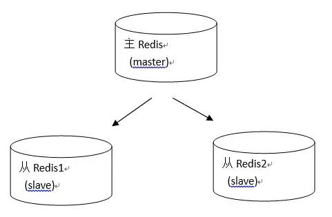
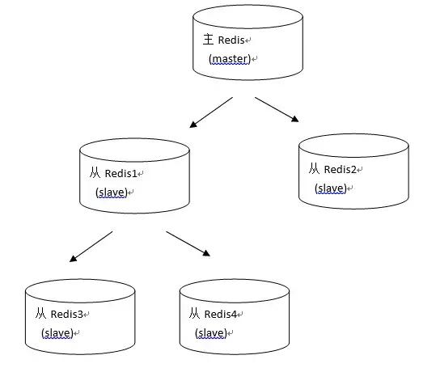
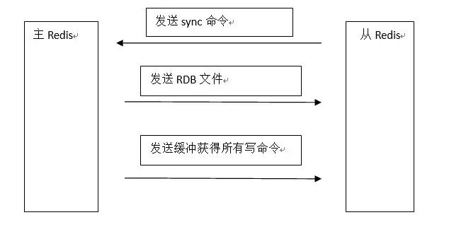
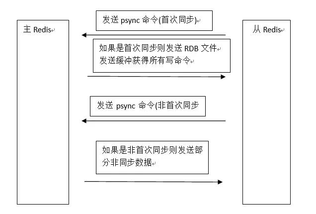
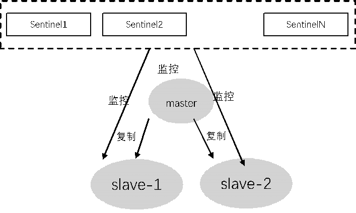
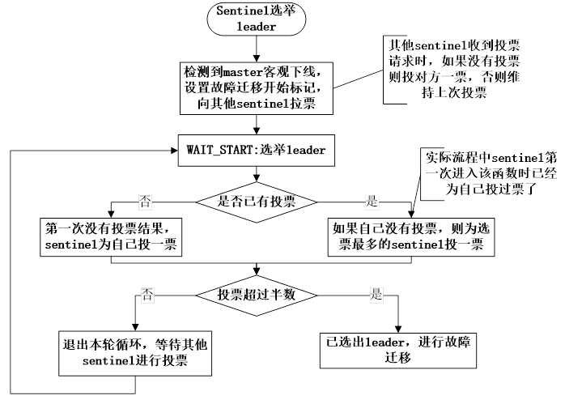
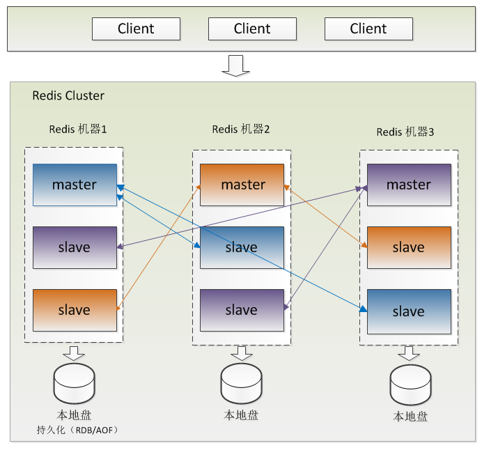

# DBA201 - Redis - 持久化

返回[Bulletin](./bulletin.md)

返回[DBA201 - Redis](./DBA201.md)

[TOC]

## RDB

RDB（Redis Database）是Redis默认的持久化方式，指在指定的时间间隔内，将内存中的数据集快照写入磁盘。RDB会在对应的目录下生产一个dump.rdb文件，重启会通过加载dump.rdb文件恢复数据。

### 操作过程

- Redis通过fork产生子进程；

- 父进程继续处理client请求，子进程负责将快照写入临时文件；

- 子进程写完后，用临时文件替换原来的快照文件，然后子进程退出。

### 优点

- 只有一个紧凑压缩的二进制文件dump.rdb，方便持久化；
- 容灾性好，对于灾难恢复可以非常轻松的将一个单独的文件压缩后再转移到其它存储介质上；
- 性能最大化，fork子进程来完成写操作，让主进程继续处理命令，所以是IO最大化（使用单独子进程来进行持久化，主进程不会进行任何IO操作，保证了redis的高性能) ；
- 如果数据集偏大，RDB的启动效率会比AOF更高。

### 缺点

- 如果持久化之间redis发生故障，会发生数据丢失；
- 由于RDB是通过fork子进程来协助完成数据持久化工作的，因此，如果当数据集较大时，可能会导致整个服务器停止服务几百毫秒，甚至是1秒钟；
- 每次快照持久化都是将内存数据完整写入到磁盘一次，并不是增量。如果数据量大的话，而且写操作比较多，必然会引起大量的磁盘io操作，可能会严重影响性能；
- RDB文件使用特定二进制格式保存，Redis版本演进过程中有多个格式的RDB版本，存在老版本Redis服务无法兼容新版RDB格式的问题。

## AOF

AOF（Append Only File）持久化是以**日志**的形式将服务器所处理的每一个**增删操作**（不包括查询操作）追加到文件中。Redis重启时，会根据日志文件的内容将写指令从前到后执行一次以完成数据的恢复工作。

### 操作过程

- write操作会触发延迟写（delayed write）机制。Linux在内核提供页缓冲区用来提高硬盘IO性能。write操作在写入系统缓冲区后直接返回。同步文件之前如果系统故障宕机，缓冲区内数据将丢失

- fsync针对单个文件操作（比如AOF文件），做强制硬盘同步，fsync将阻塞直到写入硬盘完成后返回，保证了数据持久化。

### 相关参数

- appendonly yes: 启用aof持久化方式。

- appendfsync always: 每次收到写命令就立即强制写入磁盘，最慢但是保证完全的持久化，不推荐使用。

- appendfsync everysec: 每秒钟强制写入磁盘一次，在性能和持久化方面做了很好的折中，推荐。

- appendfsync no: 完全依赖os，性能最好，持久化没保证。

### Rewrite重写机制

日志文件有一个通病，就是如果只增不减的话，文件将会无限长大。Rewrite机制可以先给当前的所有数据做一个快照，然后再在这个快照的基础上删除旧的日志继续写。

- 手动触发：直接调用bgrewriteaof命令。
- 自动触发：根据auto-aof-rewrite-min-size和auto-aof-rewrite-percentage参数确定自动触发时机。

### 优点

1. 数据安全性更高，例如配置appendfsync always.
2. 通过append模式写文件，即使中途服务器宕机，可以通过redis-check-aof工具解决数据一致性问题。
3. AOF机制的rewrite模式。AOF文件没被rewrite之前（文件过大时会对命令进行合并重写），可以删除其中的某些命令（比如误操作的flushall）。

### 缺点

1. AOF文件比RDB文件大，且恢复速度慢；数据集大的时候，比RDB启动效率低。
2. 根据同步策略的不同，AOF在运行效率上有时会慢于RDB.

## RDB VS AOF

RDB持久化方式每次生成RDB文件开销较大，无法做到实时持久化，但因为RDB文件格式紧凑压缩性更高，因此载入和读取RDB文件速度更快，适用于冷备和全量复制场景。

AOF持久化实时性更好，适用于数据实时备份，对数据安全较高的场景。但AOF需要更多的磁盘IO，对Redis性能影响较大。

不管是RDB还是AOF，都会对Redis性能有影响，并且两种持久化都不能完全保证数据不丢失。

## 单机模式

指的是单个Redis实例，它提供了Redis基本功能，在数据量不大或者仅仅用于熟悉Redis，单例模式的Redis是一个选择。但是当数据体量比较大时，单例的Redis性能会下降，并且单例模式不具备高可用性，行内原则上不允许生产环境使用。

## 主从复制模式

持久化保证了即使 redis 服务重启也会丢失数据，因为 redis 服务重启后会将硬盘上持久化的数据恢复到内存中，但是当 redis 服务器的硬盘损坏了可能会导致数据丢失，如果通过 redis 的主从复制机制就可以避免这种单点故障。

如图所示，主Redis中的数据有两个（或任意多个）副本（replication）即从Redis1和从Redis2. 主Redis中的数据和从Redis上的数据保持实时同步，主Redis写入数据时，通过主从复制机制会复制到两个从Redis服务上，而且不会阻塞主Redis. 即使一台Redis服务器宕机，其它两台Redis服务也可以继续提供服务。

除了多个从连到相同的主外，从也可以连接其他从形成图状结构。

 

 

### 全量复制

 

- 从Redis服务启动，建立和主Redis的连接，发送sync命令。如果主Redis同时收到多个从Redis发来的同步连接命令，只会启动一个进程来写数据库镜像，然后发送给所有从Redis.

- 主Redis启动一个后台进程，将数据库快照保存到RDB文件中。如果此时存在写数据操作，会导致RDB文件和当前主Redis数据不一致，所以主进程会开始收集写命令并缓存起来。

- 主Redis发送RDB文件给从Redis, 从Redis将文件保存到磁盘上然后加载到内存恢复。

- 主Redis把缓存的命令转发给从Redis, 后续主Redis的写命令都会通过开始建立的连接发送。

- 当主从连接断开后，从Redis可以自动重新建立连接。

**存在的问题**

在**Redis 2.8**之前，每次同步都会从主Redis中复制全部的数据，如果从Redis是新创建的、需要复制全部的数据，这没有问题，但是如果从Redis是停止运行一段时间再启动，可能只有少部分数据不同步，启动后仍然会从主Redis复制全部数据，这样的性能肯定没有只复制那一小部分不同步的数据高。

### 增量复制

- 从Redis连接主Redis后会主动发起PSYNC命令，提供：
  - 主Redis的runid(机器标识，随机生成的一个串) 
  - offset（数据偏移量，如果offset主从不一致则说明数据不同步）

- 主Redis验证runid和offset是否有效。runid相当于主机身份验证码，用来验证从机上一次连接的主机，如果 runid 验证未通过则，则进行全同步，如果验证通过则说明曾经同步过，根据 offset 同步部分数据。

## 哨兵模式

**Redis 2.8**中提供了哨兵工具，它的功能包括：

1. 监控主服务器和从服务器是否正常运行。 

2. 主服务器出现故障时自动将从服务器转换为主服务器。

### 优点

- 哨兵模式具备主从复制的所有优点；而且实现了自动容错和主从切换功能。
- 解决了主从复制模式下主服务器切换IP后引入数据不一致降低系统可用性的问题。

### 缺点

- 如果是从节点下线了，sentinel不会对其进行故障转移，并且连接从节点的客户端也无法获取到新的可用从节点。
- Redis较难支持在线扩容，在集群容量达到上限时在线扩容会变得很复杂。

### 定时任务

Redis Sentinel包含若干个Sentinel节点和Redis数据节点，每个Sentinel节点执行下列三个定时任务：

- 每隔10秒，每个Sentinel节点会向主节点和从节点发送info命令获取最新的拓扑结构。

- 每隔2秒，每个Sentinel节点会向Redis数据节点的__sentinel__：hello频道上发送该Sentinel节点对于主节点的判断以及当前Sentinel节点的信息。

- 每隔1秒，每个Sentinel节点会向主节点、从节点、其余Sentinel节点发送一条ping命令做一次心跳检测，来确认这些节点当前是否可达。

### 下线检测

当Sentinel发现节点距离最后一次有效回复 PING 命令的时间超过 down-after-milliseconds时，会对节点标识**主观下线** (SDOWN)。

如果被标识的是主服务器节点，正在监视这个节点的所有Sentinel节点要以每秒一次的频率确认当前主服务器节点的确进入了主观下线状态。

当有足够数量（quorum）的Sentinel确认以后，主服务器节点会被标记为**客观下线**（ODOWN），它们会选举出一个Sentinel节点来完成自动故障转移的工作，同时会将这个变化实时通知给Redis应用方。反之，则主服务器的客观下线状态就会被移除。若主服务器节点重新向Sentinel进程发送ping命令返回有效回复，主服务器的主观下线状态也会被移除。

### Sentinel选举leader

如果需要从redis集群选举一个节点为主节点，首先需要从Sentinel集群中选举一个Sentinel节点作为Leader。

每一个Sentinel节点都可以成为Leader，当一个Sentinel节点确认redis集群的主节点主观下线后，会请求其他Sentinel节点要求将自己选举为Leader。被请求的Sentinel节点如果没有同意过其他Sentinel节点的选举请求，则同意该请求(选举票数+1)，否则不同意。

如果一个Sentinel节点获得的选举票数达到Leader最低票数(quorum和Sentinel节点数/2+1的最大值)，则该Sentinel节点选举为Leader；否则重新进行选举。

 

当Sentinel集群选举出Sentinel Leader后，由Sentinel Leader从redis从节点中选择一个redis节点作为主节点：

- 过滤故障的节点

- 选择优先级slave-priority最大的从节点作为主节点，如不存在则继续

- 选择复制偏移量（数据写入量的字节，记录写了多少数据。主服务器会把偏移量同步给从服务器，当主从的偏移量一致，则数据是完全同步）最大的从节点作为主节点，如不存在则继续

- 选择runid（redis每次启动的时候生成随机的runid作为redis的标识）最小的从节点作为主节点

## 集群模式

**Redis 3.0**正式推出Redis Cluster, 采用无中心结构，它的特点如下：

- 所有的redis节点彼此互联(PING-PONG机制),内部使用二进制协议优化传输速度和带宽。
- 节点的fail是通过集群中超过半数的节点检测失效时才生效。
- 客户端与redis节点直连,不需要中间代理层.客户端不需要连接集群所有节点,连接集群中任何一个可用节点即可。

Redis集群没有使用一致性hash, 引入了了**哈希槽**(HASH SLOT). 集群中所有的主节点都负责16384个哈希槽中的一部分。当集群处于稳定状态时，集群中没有在执行行重配置（reconfiguration）操作，每个哈希槽都只由一个节点进行处理（不过主节点可以有一个或多个从节点，可以在网络断线或节点失效时替换掉主节点）。

当我们的存取的key到达的时候，redis会根据crc16的算法得出一个结果，然后把结果对 16384 求余数，这样每个key都会对应一个编号在 0-16383 之间的哈希槽：

$$
slot = CRC16(KEY) / 16384
$$
通过这个值，去找到对应的插槽所对应的节点，然后直接自动跳转到这个对应的节点上进行存取操作。

- 在集群模式下，只有处理槽的主节点才负责读写请求和集群槽等关键信息维护，而从节点只进行主节点数据和状态信息的复制。所以由负责槽的主节点参与故障发现决策。

- 必须要半数以上是为了应对网络分区等原因造成的集群分割情况时，被分割的小集群因为无法完成从主观下线到客观下线，在故障转移之后不能继续对外提供服务。这也是集群可以自动failover的必要条件。

集群至少需要3主3从，且每个实例使用不同的配置文件，主从不用配置，集群会自己选。这里的master选举和zookeeper的相似。

### 优点

有效解决了Redis在分布式方面的需求，当遇到单机内存、并发、流量等瓶颈时，可以采用Cluster方案达到负载均衡的目的。

- slave节点使用全量复制和增量复制，保持着和master节点数据同步状态，达到数据备份作用。

有效地解决了Sentinel模式从节点下线不会故障转移、连接的客户端也无法获取到新的可用从节点的问题。当集群内少量节点出现故障时，通过自动故障转移保证集群可以正常对外提供服务。

- 从节点通过内部定时任务发现自身复制的主节点宕掉时，将会触发故障恢复流程。当主节点发生故障时，需要在它的从节点中选出一个替换它，从而保证集群的高可用。

### 参数配置

- cluster-enabled: 开启集群模式。 

- cluster-config-file: 集群节点自动生成的配置文件。每次⼀旦配置有修改，它都通过该配置文件来持久化配置。 

- cluster-node-timeout: 集群节点的最大超时时间，响应超过这个时间的话，该节点会被认为是挂掉了。
- cluster-slave-validity-factor: 
  - 如果将该项设置为0，不管slave节点和master节点间失联多久都会一直尝试failover.
  - 如果将该项设为正数，失联大于一定时间（factor * 节点timeout配置）后，不再进行failover. 在这种情况下，只有原来那个master重新回到集群中，才能让集群恢复工作。

- cluster-migration-barrier: 一个master可以拥有的最小slave数量。该项的作用是，当一个master没有任何slave的时候，某些有富余slave的master节点，可以自动的分slave给它。

- cluster-require-full-coverage: 如果该项设置为yes（默认），当一定比例的键空间没有被覆盖到（就是某一部分的哈希槽没了，有可能是暂时挂了），集群就停止处理任何请求。

