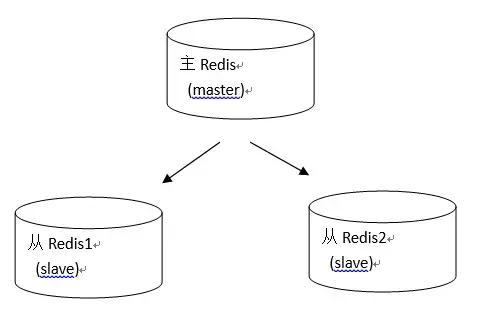
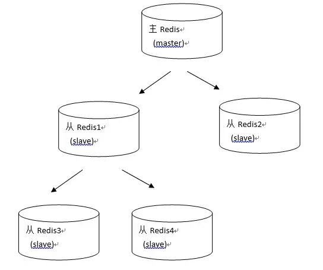
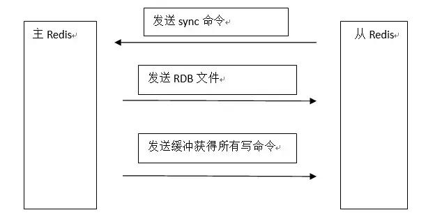
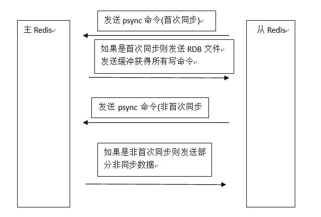
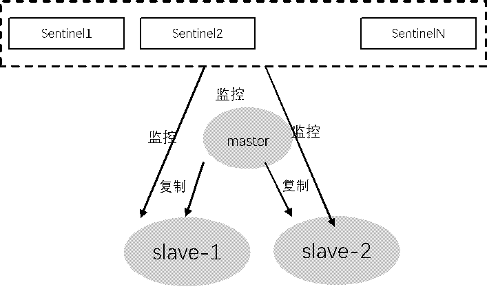
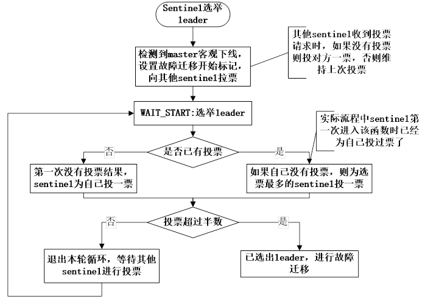
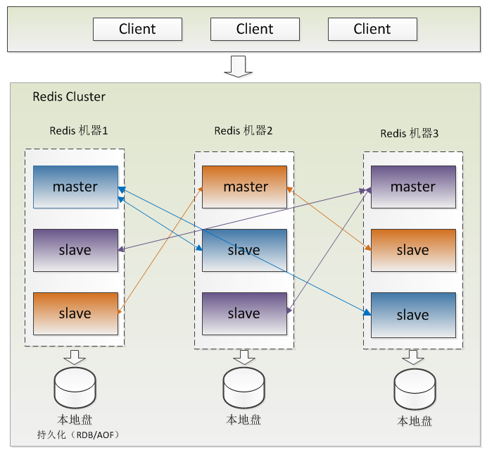

# DBA201 - Redis - 持久化 / 高可用 / 集群

返回[Bulletin](./bulletin.md)

返回[DBA201 - Redis](./DBA201.md)

[TOC]

> 本章主线：持久化（RDB/AOF）→ 副本（主从复制）→ 高可用（Sentinel）→ 分片 + 高可用（Cluster）。

## RDB【P1】

RDB（Redis Database）是 Redis 默认的持久化方式，指在指定的时间间隔内，将内存中的数据集快照写入磁盘。RDB 会在对应的目录下生成一个 dump.rdb 文件，重启会通过加载 dump.rdb 文件恢复数据。

### 操作过程

- Redis 通过 fork 产生子进程；
- 父进程继续处理 client 请求，子进程负责将快照写入临时文件；
- 子进程写完后，用临时文件替换原来的快照文件，然后子进程退出。

### 优点

- 只有一个紧凑压缩的二进制文件 dump.rdb，方便持久化；
- 容灾性好，对于灾难恢复可以非常轻松的将一个单独的文件压缩后再转移到其它存储介质上；
- 使用单独子进程来进行持久化，主进程可以继续处理命令。

### 缺点

- 如果两次持久化之间 redis 发生故障，会发生数据丢失；
- 由于 RDB 是通过 fork 子进程来协助完成数据持久化工作的，因此，如果当数据集较大时，可能会导致整个服务器停止服务几百毫秒，甚至是 1 秒钟；
- 每次快照持久化都是将内存数据完整写入到磁盘一次，并不是增量。如果数据量大的话，而且写操作比较多，必然会引起大量的磁盘 io 操作，可能会严重影响性能；
- RDB 文件使用特定二进制格式保存，Redis 版本演进过程中有多个格式的 RDB 版本，存在老版本 Redis 服务无法兼容新版 RDB 格式的问题。

【校正】原笔记"性能最大化……主进程不会进行任何 IO 操作，保证了 redis 的高性能"，表述过度绝对，仅指"写快照的 I/O 由子进程承担"。现代更准确的理解是：fork 本身有短暂停顿（数据集越大越明显）；COW（写时复制）在写入量大时会造成内存膨胀压力；持久化期间的后台 I/O 仍会争抢磁盘与 CPU 资源。

------------------------------------------------------------------------

## AOF【P1】

AOF（Append Only File）持久化是以**日志**的形式将服务器所处理的每一个**增删操作**（不包括查询操作）追加到文件中。Redis 重启时，会根据日志文件的内容将写指令从前到后执行一次以完成数据的恢复工作。

### 操作过程

- write 操作会触发延迟写（delayed write）机制。Linux 在内核提供页缓冲区用来提高硬盘 IO 性能。write 操作在写入系统缓冲区后直接返回。同步文件之前如果系统故障宕机，缓冲区内数据将丢失。
- fsync 针对单个文件操作（比如 AOF 文件），做强制硬盘同步，fsync 将阻塞直到写入硬盘完成后返回，保证了数据持久化。

### 相关参数

- appendonly yes：启用 aof 持久化方式。
- appendfsync always：每次收到写命令就立即强制写入磁盘，最慢但是保证完全的持久化，不推荐使用。
- appendfsync everysec：每秒钟强制写入磁盘一次，在性能和持久化方面做了很好的折中，推荐。
- appendfsync no：完全依赖 os，性能最好，持久化没保证。

### Rewrite 重写机制

日志文件有一个通病，就是如果只增不减的话，文件将会无限长大。Rewrite 机制可以先给当前的所有数据做一个快照，然后再在这个快照的基础上删除旧的日志继续写。

- 手动触发：直接调用 bgrewriteaof 命令。
- 自动触发：根据 auto-aof-rewrite-min-size 和 auto-aof-rewrite-percentage 参数确定自动触发时机。

### 优点

1. 数据安全性更高，例如配置 appendfsync always。
2. 通过 append 模式写文件，即使中途服务器宕机，可以通过 redis-check-aof 工具解决数据一致性问题。
3. AOF 机制的 rewrite 模式。AOF 文件没被 rewrite 之前（文件过大时会对命令进行合并重写），可以删除其中的某些命令（比如误操作的 flushall）。

### 缺点

1. AOF 文件比 RDB 文件大，且恢复速度慢；数据集大的时候，比 RDB 启动效率低。
2. 根据同步策略的不同，AOF 在运行效率上有时会慢于 RDB。

------------------------------------------------------------------------

## RDB VS AOF【P1】

RDB 持久化方式每次生成 RDB 文件开销较大，无法做到实时持久化，但因为 RDB 文件格式紧凑压缩性更高，因此载入和读取 RDB 文件速度更快，适用于冷备和全量复制场景。

AOF 持久化实时性更好，适用于数据实时备份，对数据安全较高的场景。但 AOF 需要更多的磁盘 IO，对 Redis 性能影响较大。

不管是 RDB 还是 AOF，都会对 Redis 性能有影响，并且两种持久化都不能完全保证数据不丢失。

**混合持久化**：4.0 起支持 RDB + AOF 混合格式（aof-use-rdb-preamble），rewrite 时先写 RDB 快照再追加增量 AOF，兼顾恢复速度与数据安全。

### 面试回答【30-60 秒】

> RDB 更像周期性快照，AOF 更像持续记录写操作。两者在数据安全、文件大小、性能和恢复速度上有不同取舍。生产系统是否开启以及刷盘策略要结合 Redis 的业务定位决定，不能因为有持久化就把 Redis 等同于资金账本。

------------------------------------------------------------------------

## 单机模式【P2】

指的是单个 Redis 实例，它提供了 Redis 基本功能，在数据量不大或者仅仅用于熟悉 Redis 时，单例模式的 Redis 是一个选择。但是当数据体量比较大时，单例的 Redis 性能会下降，并且单例模式不具备高可用性，行内原则上不允许生产环境使用。

------------------------------------------------------------------------

## 主从复制模式【P1】

持久化保证了即使 redis 服务重启也不会丢失数据，因为 redis 服务重启后会将硬盘上持久化的数据恢复到内存中，但是当 redis 服务器的硬盘损坏了可能会导致数据丢失，如果通过 redis 的主从复制机制就可以避免这种单点故障。



如图所示，主 Redis 中的数据有两个（或任意多个）副本（replication）即从 Redis1 和从 Redis2。主 Redis 中的数据和从 Redis 上的数据保持实时同步，主 Redis 写入数据时，通过主从复制机制会复制到两个从 Redis 服务上，而且不会阻塞主 Redis。即使一台 Redis 服务器宕机，其它两台 Redis 服务也可以继续提供服务。

除了多个从连到相同的主外，从也可以连接其他从形成图状结构。



### 全量复制



- 从 Redis 服务启动，建立和主 Redis 的连接，发送 sync 命令。如果主 Redis 同时收到多个从 Redis 发来的同步连接命令，只会启动一个进程来写数据库镜像，然后发送给所有从 Redis。
- 主 Redis 启动一个后台进程，将数据库快照保存到 RDB 文件中。如果此时存在写数据操作，会导致 RDB 文件和当前主 Redis 数据不一致，所以主进程会开始收集写命令并缓存起来。
- 主 Redis 发送 RDB 文件给从 Redis，从 Redis 将文件保存到磁盘上然后加载到内存恢复。
- 主 Redis 把缓存的命令转发给从 Redis，后续主 Redis 的写命令都会通过开始建立的连接发送。
- 当主从连接断开后，从 Redis 可以自动重新建立连接。

**存在的问题**

在 **Redis 2.8** 之前，每次同步都会从主 Redis 中复制全部的数据。如果从 Redis 是新创建的、需要复制全部的数据，这没有问题；但是如果从 Redis 是停止运行一段时间再启动，可能只有少部分数据不同步，启动后仍然会从主 Redis 复制全部数据，这样的性能肯定没有只复制那一小部分不同步的数据高。

### 增量复制



- 从 Redis 连接主 Redis 后会主动发起 PSYNC 命令，提供：
  - 主 Redis 的 runid（机器标识，随机生成的一个串）
  - offset（数据偏移量，如果 offset 主从不一致则说明数据不同步）
- 主 Redis 验证 runid 和 offset 是否有效。runid 相当于主机身份验证码，用来验证从机上一次连接的主机，如果 runid 验证未通过，则进行全同步；如果验证通过则说明曾经同步过，根据 offset 同步部分数据。

------------------------------------------------------------------------

## 哨兵模式 Sentinel【P0/P1】

### 解决什么问题

Redis 主从结构里，如果 Master 挂了：

```text
谁发现？
谁选新的 Master？
客户端以后连谁？
```

Sentinel 就是解决这一类**高可用故障发现和自动故障转移**的问题。

**Redis 2.8** 中提供了哨兵工具，它的功能包括：

1. 监控主服务器和从服务器是否正常运行。
2. 主服务器出现故障时自动将从服务器转换为主服务器。



### 优点

- 哨兵模式具备主从复制的所有优点；而且实现了自动容错和主从切换功能。
- 解决了主从复制模式下主服务器切换 IP 后引入数据不一致降低系统可用性的问题。

### 缺点

- 如果是从节点下线了，sentinel 不会对其进行故障转移，并且连接从节点的客户端也无法获取到新的可用从节点。
- Redis 较难支持在线扩容，在集群容量达到上限时在线扩容会变得很复杂。

### 定时任务

Redis Sentinel 包含若干个 Sentinel 节点和 Redis 数据节点，每个 Sentinel 节点执行下列三个定时任务：

- 每隔 10 秒，每个 Sentinel 节点会向主节点和从节点发送 info 命令获取最新的拓扑结构。
- 每隔 2 秒，每个 Sentinel 节点会向 Redis 数据节点的 __sentinel__：hello 频道上发送该 Sentinel 节点对于主节点的判断以及当前 Sentinel 节点的信息。
- 每隔 1 秒，每个 Sentinel 节点会向主节点、从节点、其余 Sentinel 节点发送一条 ping 命令做一次心跳检测，来确认这些节点当前是否可达。

### 下线检测

当 Sentinel 发现节点距离最后一次有效回复 PING 命令的时间超过 down-after-milliseconds 时，会对节点标识**主观下线**（SDOWN）。

如果被标识的是主服务器节点，正在监视这个节点的所有 Sentinel 节点要以每秒一次的频率确认当前主服务器节点的确进入了主观下线状态。

当有足够数量（quorum）的 Sentinel 确认以后，主服务器节点会被标记为**客观下线**（ODOWN），它们会选举出一个 Sentinel 节点来完成自动故障转移的工作，同时会将这个变化实时通知给 Redis 应用方。反之，则主服务器的客观下线状态就会被移除。若主服务器节点重新向 Sentinel 进程发送 ping 命令返回有效回复，主服务器的主观下线状态也会被移除。

### Sentinel 选举 leader【P2】

> 以下为协议细节（P2 级别），面试了解即可；P0 只需知道"Sentinel 之间会选出 Leader 执行故障转移"。

如果需要从 redis 集群选举一个节点为主节点，首先需要从 Sentinel 集群中选举一个 Sentinel 节点作为 Leader。

每一个 Sentinel 节点都可以成为 Leader，当一个 Sentinel 节点确认 redis 集群的主节点主观下线后，会请求其他 Sentinel 节点要求将自己选举为 Leader。被请求的 Sentinel 节点如果没有同意过其他 Sentinel 节点的选举请求，则同意该请求（选举票数+1），否则不同意。

如果一个 Sentinel 节点获得的选举票数达到 Leader 最低票数（quorum 和 Sentinel 节点数/2+1 的最大值），则该 Sentinel 节点选举为 Leader；否则重新进行选举。



当 Sentinel 集群选举出 Sentinel Leader 后，由 Sentinel Leader 从 redis 从节点中选择一个 redis 节点作为主节点：

- 过滤故障的节点
- 选择优先级 slave-priority 最大的从节点作为主节点，如不存在则继续
- 选择复制偏移量（数据写入量的字节，记录写了多少数据。主服务器会把偏移量同步给从服务器，当主从的偏移量一致，则数据是完全同步）最大的从节点作为主节点，如不存在则继续
- 选择 runid（redis 每次启动的时候生成随机的 runid 作为 redis 的标识）最小的从节点作为主节点

### 面试回答【30-60 秒】

> Redis Sentinel 主要解决非 Cluster 场景下主从 Redis 的高可用问题，负责监控节点、判断主节点故障、执行故障转移并让系统找到新的主节点。它主要解决高可用，不负责把数据自动分片到很多主节点。

------------------------------------------------------------------------

## 集群模式 Cluster【P0/P1】

### 解决什么问题

一台 Redis：内存有限、吞吐有限。Cluster 让数据分布到多个主节点，同时每个 master 可以有 replica，节点故障时支持高可用切换。

**Redis 3.0** 正式推出 Redis Cluster，采用无中心结构，它的特点如下：

- 所有的 redis 节点彼此互联（PING-PONG 机制），内部使用二进制协议优化传输速度和带宽。
- 节点的 fail 是通过集群中超过半数的节点检测失效时才生效。
- 客户端与 redis 节点直连，不需要中间代理层。客户端不需要连接集群所有节点，连接集群中任何一个可用节点即可。

### 哈希槽

Redis 集群没有使用一致性 hash，引入了**哈希槽**（HASH SLOT）。集群中所有的主节点都负责 16384 个哈希槽中的一部分。当集群处于稳定状态时，集群中没有在执行重配置（reconfiguration）操作，每个哈希槽都只由一个节点进行处理（不过主节点可以有一个或多个从节点，可以在网络断线或节点失效时替换掉主节点）。

当我们的存取的 key 到达的时候，redis 会根据 crc16 的算法得出一个结果，然后把结果对 16384 求余数，这样每个 key 都会对应一个编号在 0-16383 之间的哈希槽：

$$
slot = CRC16(key) \bmod 16384
$$

【校正】原笔记此处公式误写为 `slot = CRC16(KEY) / 16384`，但正文描述是"对 16384 求余数"，正确公式为 `slot = CRC16(key) % 16384`。

通过这个值，去找到对应的插槽所对应的节点，然后直接自动跳转到这个对应的节点上进行存取操作。如果 key 不属于当前节点，客户端会收到 MOVED 重定向（槽迁移过程中为 ASK）。

- 在集群模式下，只有处理槽的主节点才负责读写请求和集群槽等关键信息维护，而从节点只进行主节点数据和状态信息的复制。所以由负责槽的主节点参与故障发现决策。
- 必须要半数以上是为了应对网络分区等原因造成的集群分割情况时，被分割的小集群因为无法完成从主观下线到客观下线，在故障转移之后不能继续对外提供服务。这也是集群可以自动 failover 的必要条件。

集群至少需要 3 主 3 从，且每个实例使用不同的配置文件，主从不用配置，集群会自己选。



### 优点

有效解决了 Redis 在分布式方面的需求，当遇到单机内存、并发、流量等瓶颈时，可以采用 Cluster 方案达到负载均衡的目的。

- slave 节点使用全量复制和增量复制，保持着和 master 节点数据同步状态，达到数据备份作用。
- 有效地解决了 Sentinel 模式从节点下线不会故障转移、连接的客户端也无法获取到新的可用从节点的问题。当集群内少量节点出现故障时，通过自动故障转移保证集群可以正常对外提供服务。
- 从节点通过内部定时任务发现自身复制的主节点宕掉时，将会触发故障恢复流程。当主节点发生故障时，需要在它的从节点中选出一个替换它，从而保证集群的高可用。

### 参数配置

- cluster-enabled：开启集群模式。
- cluster-config-file：集群节点自动生成的配置文件。每次一旦配置有修改，它都通过该配置文件来持久化配置。
- cluster-node-timeout：集群节点的最大超时时间，响应超过这个时间的话，该节点会被认为是挂掉了。
- cluster-slave-validity-factor：
  - 如果将该项设置为 0，不管 slave 节点和 master 节点间失联多久都会一直尝试 failover。
  - 如果将该项设为正数，失联大于一定时间（factor * 节点 timeout 配置）后，不再进行 failover。在这种情况下，只有原来那个 master 重新回到集群中，才能让集群恢复工作。
- cluster-migration-barrier：一个 master 可以拥有的最小 slave 数量。该项的作用是，当一个 master 没有任何 slave 的时候，某些有富余 slave 的 master 节点，可以自动的分 slave 给它。
- cluster-require-full-coverage：如果该项设置为 yes（默认），当一定比例的键空间没有被覆盖到（就是某一部分的哈希槽没了，有可能是暂时挂了），集群就停止处理任何请求。

### 面试回答【30-60 秒】

> Redis Cluster 同时解决数据分片和高可用。Key 会映射到 hash slot（CRC16(key) % 16384），再由 slot 分布到不同 master；master 通常还有 replica 用于故障转移。和 Sentinel 相比，Cluster 的核心差异是它不仅做高可用，还承担水平分片。

------------------------------------------------------------------------

## Sentinel 和 Cluster 怎么选？【P1】

```text
数据规模单机能放下
+ 主要需要高可用
→ Sentinel / 托管高可用方案即可

数据量或吞吐需要横向扩展
→ Cluster
```

生产环境很多公司使用云 Redis / 内部平台，底层细节由平台封装。面试可以讲原理，不要冒充自己运维过大型 Redis Cluster。

------------------------------------------------------------------------

## Appendix A：非关系型数据库【Appendix】

NoSQL，全称 Not Only SQL，泛指非关系型数据库，存储数据的方式和关系型数据库不一样，一度成为高并发、海量数据存储解决方案的代名词。

### 文档数据库 MongoDB

MongoDB 是一种文档数据库，是一种介于关系型数据库和非关系型数据库之间的产品，是非关系型数据库中功能最丰富、最像关系型数据库的，是对传统关系型数据库的补充。MongoDB 非常适合高伸缩性的场景，可扩展性的表结构可以将不同结构的文件存储在同一个数据库里。如果用 MongoDB 存储数据量特别大的日志数据，利用分片集群支持海量数据，同时使用聚集分析和 MapReduce 的能力，是个很好的选择。MongoDB 还适合存储大尺寸的数据，GridFS 存储方案就是基于 MongoDB 的分布式文件存储系统。

### 列族数据库 HBase

HBase 适合海量数据的存储与高性能实时查询，它是运行于 HDFS 文件系统之上，并且作为 MapReduce 分布式处理的目标数据库，以支撑离线分析型应用。在数据仓库、数据集市、商业智能等领域发挥了越来越多的作用，在数以千计的企业中支撑着大量的大数据分析场景的应用。

### 全文搜索引擎 ElasticSearch

在一般情况下，关系型数据库的模糊查询，都是通过 like 的方式进行查询。其中，like "value%" 可以使用索引，但是对于 like "%value%" 这样的方式，执行全表查询，这在数据量小的表，不存在性能问题，但是对于海量数据，全表扫描是非常可怕的事情。ElasticSearch 作为一个建立在全文搜索引擎 Apache Lucene 基础上的实时的分布式搜索和分析引擎，适用于处理实时搜索应用场景。此外，使用 ElasticSearch 全文搜索引擎，还可以支持多词条查询、匹配度与权重、自动联想、拼写纠错等高级功能。因此，可以使用 ElasticSearch 作为关系型数据库全文搜索的功能补充，将要进行全文搜索的数据缓存一份到 ElasticSearch 上，达到处理复杂的业务与提高查询速度的目的。

ElasticSearch 不仅仅适用于搜索场景，还非常适合日志处理与分析的场景。著名的 ELK 日志处理方案，由 ElasticSearch、Logstash 和 Kibana 三个组件组成，包括了日志收集、聚合、多维度查询、可视化显示等。

### Memcached

Memcached 数据缓存服务器，也是 Key-Value 类型的数据库，提供的命令形式极为接近。

#### Redis VS Memcache

|              | Redis                                                        | Memcached                                           |
| ------------ | ------------------------------------------------------------ | --------------------------------------------------- |
| 数据持久化   | 支持                                                         | 不支持                                              |
| 主从复制     | 支持                                                         | 不支持                                              |
| 数据支持类型 | Redis 支持更为丰富的数据类型，提供 list, set, zset, hash 等数据结构的存储，以及不同类型可以调用的方法。 | Memcached 所有的值均是简单的字符串，没有类型的概念。 |
| 底层模型     | 底层实现方式以及服务端客户端之间通信的应用协议不一样。Redis 自己构建了 VM 机制，避免了一般系统中浪费一定的时间去移动和请求。 |                                                     |
| Value 值大小 | Redis 最大可以达到 512M。Redis 单个 value 的最大限制远大于 Memcached，因此 Redis 可以用来实现很多有用的功能，比方说用他的 List 来做 FIFO 双向链表，实现一个轻量级的高性能消息队列服务，用他的 Set 可以做高性能的 tag 系统等等。 | Memcached 只有 1mb。                                |
| 速度         | 快                                                           | 慢                                                  |

------------------------------------------------------------------------

## P2 止损（本章部分）

- Cluster Gossip 协议细节
- Hash Slot 迁移细节（resharding 流程）
- Sentinel 选举完整时序
- AOF Rewrite 内核
- RDB fork / COW 深度原理

以上给出结论性回答即可，不展开源码级细节。
