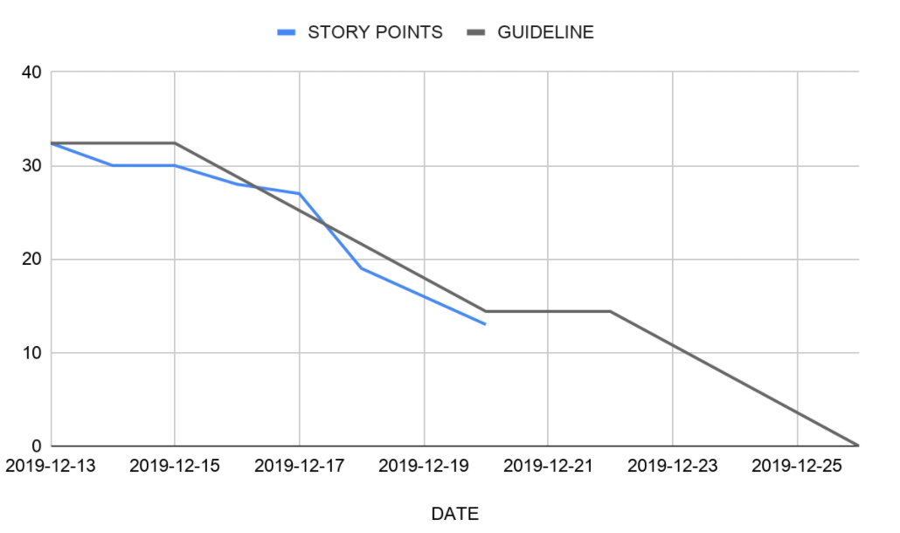

# SDE121 - Introduction of Agile

返回[Bulletin](./bulletin.md)

[TOC]

## 什么是敏捷？

敏捷是一种软件开发方法的迭代方法, 使用1到4周的短迭代，通过不断自我调整来交付变化的业务需求。

## 敏捷宣言

- 个体和互助 高于 流程和工具
- 工作的软件 高于 详尽的文档
- 客户合作 高于 合同谈判
- 响应变化 高于 遵循计划

## Scrum

原指并列争球。指敏捷框架。

## Sprint

原指拿到球冲到底线的过程。指迭代。

## 三个关键角色

### Product Owner (PO) 产品负责人

代表客户的一个声音，提供PB的优先排序，给迭代开发人员产出故事。

- 在迭代计划会议输出迭代SB.
- 在评审会（一般是每周最后一天的下午，回顾会之前）产出潜在的产品增量Increment.

### Scrum Master (SM) 迭代负责人/敏捷教练

像保姆，什么问题都可以找他解决；像超人，可以控制整个Scrum的流程。关键职责包括：

- 跟踪和监视项目开发。
- 正确了解用户需求。
- 努力正确地获得项目。
- 改善团队绩效。
- 组织会议并解决问题。
- 沟通并向客户和开发团队报告。

### Team 团队

开发团队。最好能发展成全功能团队（包括前端、后端、中台、UI、BA等），以便于自组织、自驱动。如果新人居多，可以先考虑搞出一个强项提升产能，而不是盲目发展成全功能团队。

## 三个关键产出

### Product Backlog (PB) 产品待办清单

可以被拆分，在中信银行从大到小分为Epic, Feature, User story三级。

### Sprint Backlog (SB) 迭代待办清单

将PB拆分出的最上方的部分放入SB.

### Increment 产品增量

Scrum的交付物。

## 五个关键活动

### Product Backlog Refinement PB梳理会议

每个迭代1次，120分钟。

确定在即将到来的Sprint中可以交付哪些User story.

创建Sprint待办事项(SB)。

将User story分解成Task.

### Sprint Planning Meeting 迭代计划会议

每个迭代1~2次，90分钟。

使完整的User story达到“准备好”的状态。

### Daily Scrum 每日站会

每天1次，15分钟。

三个问题：

- 昨天我做了什么帮助团队达到Sprint目标？
- 今天我要做什么帮助团队达到Sprint目标？
- 有哪些阻碍我达到目标的障碍？

### Sprint Review 迭代评审会议

每个迭代1次，60分钟。

向PO展示“完成的”工作。

请PO提供审阅意见（同意或拒绝）。

### Sprint Retrospective 迭代回顾会议

每个迭代1次，60分钟。

评估整个Sprint过程的人员、关系、流程和工具方面的进展情况。

提出问题和改进建议。

## 五个核心价值

Focus 专注

Courage 勇气

Openess 开放

Commitment 承诺

Respect 尊重

## 传统瀑布模式 VS 敏捷模式

| 对比维度             | 瀑布           | 敏捷             |
| -------------------- | -------------- | ---------------- |
| 计划时间             | 长             | 短               |
| 规范和实施之间的时间 | 长             | 短               |
| 发展路线             | 直接、计划驱动 | 弯曲、价值驱动   |
| 发现问题耗时         | 耗时长         | 耗时短           |
| 交付产品的时间       | 长             | 简短、有时间限制 |
| 上市时间和投资回报率 | 固定           | 可调式           |
| 项目进展风险         | 高             | 低               |

客户需求简单, 规模小, 定义明确, 可以完全理解, 可预测, 并且在项目完成之前主题不会改变的时候，可以在Scrum上使用瀑布。

## 敏捷的价值

敏捷不等于单纯交付快，价值在于快速响应业务的需求变化，提高可预测性。

- 不是最大化产出；而是最大化价值。
- 传统进行整体交付，如果周期过长，风险很大；敏捷每次迭代都交付可用的产品增量，风险降到最低。
- 传统像炮弹瞄准射击，很难一次命中；敏捷像导弹，持续调整，直至命中目标。
- 敏捷通过做正确的事情、正确地做事，以及通过持续迭代，减少浪费从而提升效率和预测准确性。
- 敏捷可以根据团队的速率为业务提供较为准确的预测。

## 燃尽图

用于表示剩余工作量的工作图表，由横轴（X）和纵轴（Y）组成，横轴表示时间，纵轴表示工作量。这种图表可以直观的预测何时工作将全部完成，常用于软件开发中的敏捷软件开发方式，也可以用于其他类型的工作流程监控。

